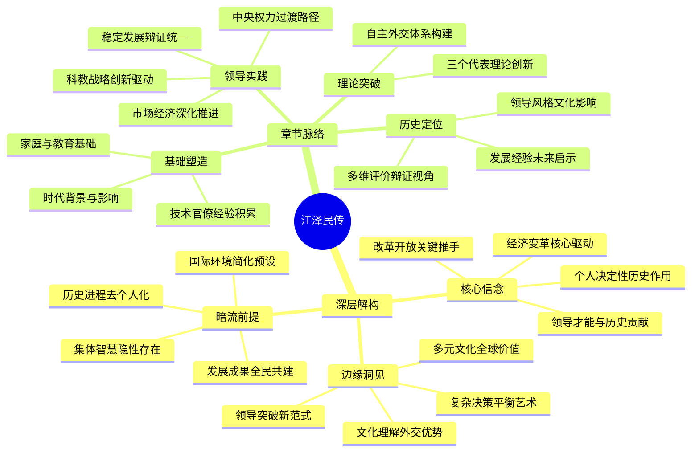

豆瓣链接：https://book.douban.com/subject/1023322/

# 深层解构
### 基石：核心信念
作者库恩的核心信念围绕着对江泽民个人能力与贡献的高度认可。他坚信江泽民凭借卓越的领导才能，带领中国在复杂的国际国内形势下实现了巨大变革。在他看来，江泽民是推动中国改革开放进程的关键人物，这种信念贯穿全书，从对江泽民参与经济特区建立、提出“社会主义市场经济”概念，到推动中国加入世界贸易组织等事件的描述中得以体现。库恩也相信个人在历史进程中能够发挥决定性作用，他将中国在江泽民时期的发展成就，很大程度上归因于江泽民个人的智慧、勇气和决心 ，强调江泽民的领导是中国从困境走向繁荣的核心驱动力。

### 边缘：可能改变一切的洞见
书中提到江泽民对语言的热爱使其对不同文化有深刻见解，这一细节虽然着墨不多，但却蕴含重要洞见。这表明文化理解在国际交往中的重要性，江泽民凭借对不同文化的理解，在外交场合展现出独特魅力，如他1997年访美在哈佛大学用英文演讲，赢得广泛喝彩，为中国外交增添助力。这启示人们，在全球化背景下，深入理解多元文化是开展有效外交、提升国家形象的重要因素。另外，书中对江泽民在面对国内改革阻力和国际压力时，如何平衡各方利益、推动改革前进的描述，为研究在复杂环境下的决策机制和领导艺术提供了生动案例，为领导者在困境中寻求突破提供新思路。 

### 暗流：未被言说的前提
作者在书中描述中国发展历程时，默认国际环境是相对稳定且可预测的，没有充分探讨当时国际形势中潜在的巨大不确定性和复杂性。实际上，20世纪末到21世纪初，国际格局处于深刻调整期，地区冲突不断、大国关系微妙变化、全球经济波动频繁，这些不稳定因素对中国的发展决策产生着重大影响。书中未深入剖析这些，可能会让读者对中国当时面临的挑战认识不足。此外，书中虽强调江泽民的领导作用，但存在将历史进程过度个人化的假设，忽略了中国共产党集体领导的力量，以及广大人民群众在改革开放和国家建设中的主体作用。中国在这一时期的发展成就是集体智慧和全体人民共同努力的结果，并非仅靠个人推动。 

# 章节内容
好的，作为一名历史和文化领域的学者，我将严格按照罗伯特·劳伦斯·库恩先生的著作《他改变了中国：江泽民传》的章节结构，对该书的核心内容和作者的关键论点进行逐章节的总结。

---

### 第一部分 根基

#### 第1章 战争与革命
本章追溯了江泽民的出身和早年经历，库恩的核心论点是，江泽民的**家庭背景和少年时期的战争体验，深刻地塑造了他对国家统一和稳定的极端重视**。江泽民出生于江苏扬州的一个书香门第，其过继的父亲江上青是一位受人敬重的革命烈士，这为他提供了“**革命遗孤**”的政治资本，也成为他一生中强烈的道德和情感驱动力。库恩指出，亲身经历日军侵华的暴行和国家分裂的痛苦，让江泽民从小就萌生了强烈的爱国主义情怀和对秩序的渴望。这段经历让他认识到，没有一个强大和统一的国家，人民只会遭受苦难。这种根深蒂固的信念，解释了他在后来的政治生涯中，为何始终将**维护社会稳定和国家主权**放在压倒一切的位置。

#### 第2章 大学生
本章聚焦于江泽民在上海交通大学的求学岁月。库恩认为，这段经历对江泽民的塑造是双重的：一方面，他接受了**严格的西式工程技术训练**，这培养了他**注重事实、逻辑和细节的科学思维方式**，使他成为一名典型的技术官僚。另一方面，他在大学期间秘密加入了中国共产党，投身于反抗国民党统治的地下学运。库恩强调，这种“**工程师”与“革命者**”的双重身份，让江泽民学会了如何在复杂的环境中行事，既有专业知识，又懂政治纪律。作者指出，江泽民在学运中并非激进的领袖，而是务实的组织者，这预示了他日后的政治风格：**不尚空谈、讲求实际、善于在现有框架内解决问题**。

#### 第3章 在政府、企业和国外
本章记述了江泽民从建国初期到文革前在工业战线的履历。库恩的核心观点是，这段长达数十年的基层和中层技术管理经验，是江泽民治国理念的实践基础。他从食品厂的工程师做起，一步步到肥皂厂、汽车厂，并被派往莫斯科斯大林汽车厂实习。库恩认为，这段经历让江泽民对**现代工业体系的运作、计划经济的优劣以及苏联模式的利弊**有了第一手的深刻认识。与许多党内的高层领导不同，江泽民是**从工厂车间里成长起来的**，他了解技术、尊重专家，并深知经济发展的复杂性。这段经历使他成为一个**典型的技术型官僚**，其核心信念是**通过发展科学技术和工业来推动国家进步**。

#### 第4章 “文化大革命”
本章探讨了“文革”对江泽民的影响。库恩指出，与其他许多被打倒的老干部相比，江泽民在文革期间的遭遇相对平缓，他被下放到“五七干校”劳动，但未受到严重的人身迫害。库恩的核心论点是，文革的经历让江泽民深刻体会到**极左路线和政治动乱对国家经济和人民生活的巨大破坏性**。他目睹了非理性的政治狂热如何摧毁了正常的生产秩序和专业知识。这段经历进一步强化了他对**稳定、秩序和务实作风**的信奉。库恩认为，正是因为对文革灾难有切身体会，江泽民在后来的政治生涯中，对于任何可能导致社会动荡的苗头都保持着高度警惕，并坚信**只有聚精会神搞建设，国家才能真正强大**。

### 第二部分 领导者

#### 第5章 改革开放
本章描述了江泽民在改革开放初期重返领导岗位，并最终进入中央的历程。库恩认为，邓小平推动的改革开放，为江泽民这样具有专业知识和国际视野的技术官僚提供了广阔的舞台。江泽民被任命为新成立的电子工业部部长，并进入中央委员会。库恩的核心观点是，江泽民在电子工业部的表现，充分展示了他作为**改革实干家**的能力。他积极推动技术引进、中外合资，并强调发展集成电路等核心技术。这段经历不仅让他**积累了在国家层面管理一个重要工业部门的经验**，更让他深刻理解了邓小平对外开放战略的决心和意义，为他日后主政上海和中央打下了坚实基础。

#### 第6章 市长
本章聚焦于江泽民出任上海市长的经历。库恩的核心论点是，主政上海的这段时期，是江泽民**从一名高级技术官僚向一位成熟的政治家转变的关键阶段**。他面临着改造上海这个陈旧的工业基地、改善民生和推动对外开放的艰巨任务。库恩详细记述了江泽民如何运用他的专业知识和务实风格，推动了地铁、越江隧道、机场等重大基础设施建设，并积极争取中央支持，着手规划**浦东的开发开放**。作者认为，在上海的经历，让江泽民学会了如何**平衡各方利益，处理复杂的社会问题，并开始形成自己关于城市发展和对外开放的宏观思路**。

#### 第7章 市委书记
本章分析了江泽民在担任上海市委书记期间处理的棘手政治事件，特别是1989年的学潮。库恩的核心观点是，江泽民在处理“**《世界经济导报》事件**”和上海的学潮时，展现出了一种**既坚定原则又讲究策略的政治手腕**，这直接影响了他的政治命运。他果断地对《导报》进行了整顿，维护了党的权威；但同时，他又亲自与学生对话，努力疏导情绪，避免了矛盾的激化和流血事件的发生。库恩认为，邓小平等中央领导人正是通过江泽民在上海的表现，看到他是一位**既能坚持党的领导，又能以相对温和务实的方式维持稳定**的领导人，这种特质在当时动荡的局势下显得尤为宝贵。

### 第三部分 总书记

#### 第8章 北京，1989
本章详细描述了江泽民在1989年春夏之交被邓小平等元老戏剧性地选为中共中央总书记的内幕。库恩的核心论点是，江泽民的当选并非偶然，而是党内元老在危急关头经过深思熟虑后做出的**战略选择**。他们认为，江泽民具备几个关键素质：第一，他在上海处理学潮的表现证明他**政治上靠得住，能够维护稳定**；第二，他有丰富的经济工作经验，**坚定支持并有能力继续推进改革开放**；第三，他没有卷入北京高层的派系斗争，是一个各方都能接受的人物。库恩强调，邓小平将江泽民扶上最高领导岗位，是希望他能成为一个“**承前启后、继往开来**”的人物，既能稳定住天安门事件后的混乱局势，又能把改革开放的事业继续推向前进。

#### 第9章 稳定局势
本章论述了江泽民在上任初期所面临的严峻挑战，以及他如何“稳住阵脚”。库恩认为，江泽民接手的是一个极其困难的局面：内部思想混乱，经济滑坡；外部则面临西方世界的全面制裁和孤立。在此背景下，江泽民的首要任务是**稳定人心、恢复秩序**。他紧密团结在邓小平周围，强调党的统一领导和政治稳定。库恩指出，江泽民采取了**一手抓稳定，一手抓经济**的策略，在政治上强调反对“和平演变”，同时在经济上继续进行治理整顿，为下一阶段的发展积蓄力量。这一时期，他成功地确立了自己作为“**以他为核心的第三代领导集体**”的地位。

#### 第10章 南方之行
本章聚焦于1992年邓小平“南方谈话”对江泽民领导地位的巩固和中国改革进程的推动。库恩认为，当时中国的改革正陷入姓“社”还是姓“资”的争论中而停滞不前。邓小平的南方谈话，实际上是对当时犹豫不决的中央领导层的一次**政治督促和思想总动员**。库恩的核心观点是，江泽民**敏锐地抓住了这次机会，迅速响应并全面贯彻了邓小平的讲话精神**。他主持召开了政治局会议，正式将“**社会主义市场经济**”确立为中国经济体制改革的目标。这一举动，不仅彻底扭转了当时保守的政治气氛，也使江泽民的领导地位得到了极大的巩固，他证明了自己是**邓小平改革路线最坚定的继承者和执行者**。

#### 第11章 市场经济
本章分析了江泽民如何领导中国进行建立“社会主义市场经济体制”的艰巨探索。库恩的核心论点是，江泽民在这一过程中扮演了**总设计师和总工程师**的角色。他主持制定了《关于建立社会主义市场经济体制若干问题的决定》，这个文件被库恩视为**中国经济改革的宏伟蓝图**。它涵盖了从财税、金融、外汇体制改革到建立现代企业制度等方方面面。库恩强调，江泽民的贡献在于，他不仅在理论上确立了市场经济的地位，更重要的是，他**以巨大的政治魄力，推动了这些深刻触及利益格局的改革付诸实施**，从而为中国经济在90年代的腾飞奠定了制度基础。

#### 第12章 外交关系
本章论述了江泽民在外交领域的成就。库恩认为，江泽民彻底扭转了1989年后中国在外交上被孤立的局面，为中国的经济发展**创造了一个长期和平有利的国际环境**。他的外交策略是**全方位、多层次的**。特别是在对美关系上，江泽民展现了高度的灵活性和战略耐心，成功地处理了“银河号”事件、台海危机等一系列挑战，并最终通过与克林顿总统的互访，建立了中美“**建设性战略伙伴关系**”。库恩强调，江泽民作为一位能在国际舞台上用英语发表演讲、背诵《葛底斯堡演说》的领导人，其**个人风格也极大地改善了中国的国际形象**。

#### 第13章 军队
本章探讨了江泽民如何逐步掌控并推动军队的现代化。库恩的核心观点是，作为一个没有军旅生涯的文人领导者，江泽民通过**坚定的决心和巧妙的策略，成功地在军队中树立了权威**。他一方面通过提拔和任用新的高级将领，逐步建立起自己的支持力量；另一方面，他高瞻远瞩地提出了“**科技强军**”的战略思想，强调要打赢未来高科技条件下的局部战争。库恩特别提到了江泽民在1998年做出的**军队和武警部队必须停止一切经商活动**的重大决策。他认为，这一举动极具魄力，有效地遏制了军队腐败，保证了军队的战斗力，是江泽民治军的关键一笔。

### 第四部分 领袖

#### 第14章 治国
本章总结了江泽民在邓小平逝世后，作为国家最高领导人的治国理念和风格。库恩认为，江泽民的治国核心是“**稳定**”与“**发展**”的辩证统一。他继承了邓小平“发展是硬道理”的思想，但更加强调“**在稳定中求发展**”。库恩将江泽民的治理风格概括为**审慎、稳健、注重平衡**。在经济上，他力推国有企业改革，实施“**抓大放小**”的策略；在政治上，他强调党的统一领导和思想建设。库恩指出，江泽民成功地应对了亚洲金融危机的冲击，保持了人民币不贬值，这不仅稳定了中国经济，也为他赢得了国内外的赞誉，充分证明了他独立治国的能力。

#### 第15章 “三个代表”
本章深入阐述了江泽民最重要的理论贡献——“三个代表”重要思想。库恩的核心论点是，“三个代表”思想是江泽民为了**解决在市场经济条件下，中国共产党如何保持其执政合法性的根本问题，而进行的重大理论创新**。通过提出党要始终代表“中国先进社会生产力的发展要求”、“中国先进文化的前进方向”和“中国最广大人民的根本利益”，江泽民实际上**极大地拓宽了党的阶级基础和执政基础**。库恩认为，这一理论的革命性在于，它允许**私营企业家等新兴社会阶层加入共产党**，从而使党能够与时俱进，适应变化了的社会现实，避免了与新兴的经济力量相对立的危险。

#### 第16章 交接
本章详细描述了江泽民如何精心安排并最终实现了向以胡锦涛为总书记的第四代领导集体的平稳权力交接。库恩认为，这是江泽民留给中国的**一项至关重要的政治遗产**。他强调，江泽民在很早的时候就有意识地培养和确立了胡锦涛作为接班人的地位，并通过各种方式对他进行锻炼和考验。库恩的核心观点是，江泽民通过在中共十六大上主动交出总书记职务，并在两年后交出军委主席职务，**最终在中国建立起了一套有序、规范的最高权力交接制度**。这在共产党的历史上是前所未有的，它**结束了领导人终身制，为中国的长治久安提供了制度性的保障**，其意义极为深远。

#### 第17章 江泽民和改变了的中国
在最后一章，库恩对江泽民的整个政治生涯和历史地位进行了总结。他认为，江泽民是一位**被外界，特别是西方世界严重低估的领导人**。他不仅成功地巩固了邓小平开启的改革开放事业，更重要的是，他**在中国从革命党向执政党、从计划经济向市场经济转型的最关键和最危险的时期，保持了国家的稳定和发展**。库恩总结道，江泽民的遗产体现在三个方面：一是**保持了政治稳定和经济的持续高速增长**；二是通过“三个代表”思想**更新了党的执政理论**；三是**建立了制度化的权力交接机制**。正是这些，使得中国在他领导的13年里，发生了翻天覆地的变化，为21世纪的崛起奠定了坚实的基础。