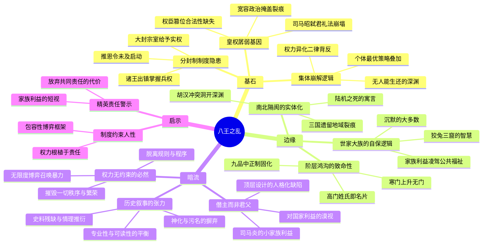

---
tags:
  - 西晋崩解
  - 宗室内战
  - 制度缺陷
  - 阶层固化
  - 权力异化
douban_link: https://book.douban.com/subject/38188677/
score: 4
cover: https://img9.doubanio.com/view/subject/s/public/s35527395.jpg
create_time: 2026-08-09
---

# 深层解构

### 一、基石：西晋为何注定崩解

**1. 皇权的"孱弱"基因——合法性缺失如何毒化整个王朝**

本书的核心信念在于：八王之乱绝非偶然的宗室内讧闹剧，而是西晋制度缺陷、权力结构失衡、社会阶层矛盾长期积压的必然结果。这一因果链的起点，是司马氏政权与生俱来的合法性危机。

司马懿洛水之誓的失信、司马昭当街弑君的礼法崩塌——这两事件彻底摧毁了儒家意识形态中"忠孝"的根基。**以权臣篡夺江山，却要求臣下尽忠，这本身就是个巨大的悖论。** 司马炎对此的应对是"宽容政治"：对朝野内外的怨愤充耳不闻，试图以怀柔消解怨恨。但宽容并非真正和解，而是将裂痕暂时掩埋。作者引用一句点睛之笔——"司马炎不是那种秉持'朕即国家'理念的君父，反倒更像是一个僭主，他对小家族利益的关注远远超越对国家利益的"——揭示了西晋皇权的本质：**一个以家族利益为最高准则的政权，注定无法构建真正的国家共识。**

**2. 分封制——饮鸩止渴的顶层设计**

为防止曹魏宗室无力拱卫皇权的覆辙重演，司马炎大封宗室为王，令其出镇地方、掌握兵权。这一制度的致命缺陷在于：**它在逻辑上预设了宗室对皇帝的忠诚，却忽略了宗室自身同样拥有皇位继承的合法性。** 当皇帝是司马衷这样一个"柔质慈民"的弱智之君时，任何手握重兵的藩王都有理由认为：自己比那个坐在龙椅上的傀儡更有资格。

司马炎借鉴了西汉推恩令的思路——宗室嫡子袭爵，其余子弟降爵分封，逐代削弱。但西晋甚至来不及启动这一削弱程序，就已在贾南风与诸王的反复政变中被掏空。**制度设计需要时间来消化，而历史没有给西晋这个时间。**

**3. 集体崩解的二律背反——"最优策略"如何导向共同毁灭**

全书最深刻的洞见，是对八王之乱"权力异化逻辑"的揭示。每一个参与者——从精于算计的贾南风，到优柔寡断的司马颖，到纵兵肆虐的河间王司马颙，再到最后"获胜"的东海王司马越——都在扭曲的格局中采取了自保的"最优策略"。**但正是这些个体层面的理性选择，构成了宏观上无可逆转的集体崩解。**

司马越虽胜，面对的却是一个满目疮痍、皇纲解纽的帝国，他本人也在恐惧与忧愤中暴病身亡。**这是一场没有赢家的博弈：当政治结构与社会秩序无法提供最基本的信任与共识，所有的计谋与武力，都将导向无人能够生还的深渊。**

### 二、边缘：被轻描淡写的结构性洞见

**1. 阶层鸿沟——"盛世"的两种面孔**

第四章"会见汝在荆棘中耳！"是全书最具思想分量的部分（再版时专门重写），它将叙事从宫廷权斗拉升到社会结构的宏观视野。作者借一段精妙的对比揭示了西晋"太康之治"的两副面孔：

> "一个人倘若是高门世家子弟，父祖位列公卿，他出门尽可将姓氏当名片用，自己到了年纪便直接出仕，起家就是县令以上的官职。只要不犯大错，起码能做到太守一级的五品官……但如果他的家族阶层较低，那么他对这个时代的观感将截然不同。"

九品中正制将阶层固化制度化为"上品无寒门，下品无势族"。左思"世胄蹑高位，英俊沉下僚"的喟叹，不是文人的牢骚，而是整个时代的结构性困境。**当寒门士子的上升通道被彻底封死，他们便成为乱世中最活跃的投机者——搅弄风云的不是诸王本人，而是那些在正常秩序中永无出头之日的寒门谋士。** 这种"制度的暴力"远比宫廷阴谋更具毁灭性。

**2. 世家大族的"沉默"——狡兔三窟的代价**

书中反复呈现一个被传统叙事忽略的现象：在八王之乱的十六年间，世家大族几乎始终选择观望自保。这并非怯懦，而是一种精心计算的生存策略——无论哪个藩王获胜，高门大族都能凭借其文化资本和社会网络在新政权中找到位置。**但这种"狡兔三窟"的智慧，恰恰是国家崩解的催化剂。** 当社会精英阶层放弃共同责任，将家族利益凌驾于公共福祉之上，帝国便失去了最后的纠错机制。作者在此处的分析虽然克制，但指向极为锋利：**西晋之亡，亡于精英的集体卸责。**

**3. 陆机之死——南北隔阂的致命寓言**

陆机之死是全书最具象征意义的历史场景之一。出自吴郡陆氏的大名士，被成都王司马颖委以将兵重任，却因南人身份受尽北人将佐的牵制与构陷，最终兵败被谗身死，临刑前悲叹"华亭鹤唳，岂可复闻乎！"

作者将陆机之死提升为寓言层面：**西晋不仅未能缝合三国遗留的南北鸿沟，更在新一轮政治裂变中，让潜在的地域裂痕全部转化为致命的实体冲撞。** 统一只是表面的政治合并，深层的文化整合从未完成。当这种内部撕裂遭遇胡族势力的外部冲击，崩溃便不可逆转。

### 三、暗流：未被审视的认知前提

**1. "僭主"叙事的限度——人治逻辑的变体**

作者将司马炎定位为"僭主"而非"君父"，这一判断犀利且富有启发。但如果深入追问：**这种"僭主"模式是否为所有篡位王朝的通病？** 从曹魏到隋唐，以权臣篡位立国的王朝并不鲜见，但并非每个都走向了八王之乱式的全面崩溃。将西晋的覆灭完全归因于合法性缺失，可能忽略了其他变量——如具体的人事安排（贾杨两家的愚蠢）、突发的权力真空（司马衷的智力缺陷）、以及地缘格局的变化（胡族势力的崛起）。**"僭主"论提供了一个有力的解释框架，但不应成为唯一的框架。**

**2. 史料残缺与情理推衍的边界**

作者曾任上市公司财务总监，其丰富的人生阅历让他在史料残缺处"按情理来推衍"时，具有不一般的社会深广度——这是刘勃在推荐语中点出的优势。但这也带来一个潜在问题：**当"情理推衍"成为叙事的重要组成部分，历史书写与历史小说的边界便变得模糊。** 作者虽在再版中逐条增补注释，力求厘正内容出处，但读者仍需保持警觉：书中某些人物的心理活动和决策动机，究竟是史有明载还是合理想象？这并非否定本书的价值，而是提醒读者以批判性眼光阅读。

**3. "制度决定论"的阴影**

全书倾向于将八王之乱解释为制度缺陷的必然结果——分封制的隐患、九品中正制的固化、权力结构的失衡。这种"制度决定论"的叙事框架极具说服力，但也可能遮蔽**偶然性和个人选择在历史进程中的作用**。如果司马衷的智力正常，如果贾南风没有那么极端，如果司马炎在继承人问题上做出不同选择——八王之乱是否仍会爆发？制度提供了结构性条件，但具体的历史走向，仍由无数偶然事件和个人决策共同塑造。**过度强调制度必然性，可能让我们低估历史中"人的因素"的份量。**

### 四、金句与精华语录

> **"会见汝在荆棘中耳！"**

晋武帝司马炎对西晋未来的预言。他在位时营造的太康之治看似繁华太平，但他自己清楚——制度缺陷已埋下祸根，子孙将在荆棘丛中挣扎。这句话既是帝王的自知之明，也是对"盛世"幻象的最早刺穿。

> **"柔质慈民曰惠"——名褒实贬的谥号。**

"慈民"只是托词，"柔质"才是真意——柔弱无能，被人操纵于股掌之间。历史上谥号为"惠"的皇帝全都命运悲惨：汉惠帝刘盈畏缩于吕后阴影之下，明惠帝朱允炆被叔叔夺位生死成谜。一个"惠"字，浓缩了弱主乱世的历史宿命。

> **"华亭鹤唳，岂可复闻乎！"**

陆机临刑前的最后悲叹。一个南渡北上的天才文人，在权力漩涡中被碾为齑粉。这不仅是个人悲剧，更是整个时代南北隔阂、文化撕裂的缩影——华亭的鹤鸣，是一个再也回不去的故土与理想。

> **"草木萌牙杀长沙。"**

长沙王司马乂的陨落，如同初春萌芽便被连根拔起。他是八王中少数有才干的宗室，却死于诸王合谋与政治算计。这句话暗喻：**在权力的丛林中，才华和正直不是护身符，而是催命符。**

# 章节内容

### 第一章 悲剧的前奏

本章回溯八王之乱的远因，聚焦晋武帝司马炎晚年的权力交接困局。司马炎有二十六个儿子，但夭折过半，活到成年的仅九个。嫡长子司马轨两岁夭折后，次子司马衷成为法定继承人——然而这位太子心智不足，"皇太子不堪奉大统"。司马炎曾动摇过换太子的念头，但皇后杨艳以"立嫡以长不以贤，岂可动乎"强硬回绝。与此同时，司马炎的弟弟司马攸（过继给司马师）拥有极强的继承合法性，形成"兄终弟及"与"父死子继"的路线之争。西晋初年的党争——以贾充为首的功臣派与以张华、羊祜为代表的正直派之间的博弈——为日后的政治撕裂埋下伏笔。咸宁二年（276年）的一场未遂政变，更暴露了司马炎对权力安全感的深层焦虑。太熙元年（290年），司马炎病逝，一个注定崩解的王朝正式交到了最不该接手的人手中。

### 第二章 杨骏

司马炎临终前，将辅政大权交给外戚杨骏（皇后杨芷之父）。杨骏并非能臣，他的上位纯粹是司马炎为太子司马衷搭建的"保护架构"——以杨家制衡贾家，以宗室拱卫皇权。然而杨骏上台后独揽大权、排斥异己，迅速将潜在盟友推向对立面。新皇帝司马衷的"柔质"在此章得到充分展现——他无法理解政事，成为各方势力角逐的棋子。杨骏的愚蠢在于：他既无能力控制局面，又无胸襟笼络人心。"折杨柳"的意象暗喻政治同盟的脆弱——昨日的盟友今日便可倒戈。辛卯政变中，杨骏被贾南风联合楚王司马玮诛杀，杨家覆灭。杨骏之女杨芷（太后）被废为庶人，"哀哉秋兰"——一场政治花期的终结，也是更大风暴的序幕。

### 第三章 汝南王与楚王

杨骏覆灭后，汝南王司马亮与楚王司马玮成为朝堂新贵，但二人的权力博弈迅速激化。贾南风——这位"野心勃勃的皇后"——展现出高超的权术：先利用楚王诛杀汝南王，再以"驺虞幡"（象征皇帝权威的旗帜）解除楚王兵权，将其处死。"倘来之物"与"与虎谋皮"精准概括了诸王的命运——权力是意外之财，而与贾南风合作无异于与虎谋皮。六月政变后，"满朝公卿皆姓贾"——贾南风通过族兄贾模、侄子贾谧等人控制朝政，开启了长达十年的贾氏专权时期。此章的核心洞见在于：**贾南风虽权术高超，但她的每一次"成功"都在侵蚀皇权的合法性基础，为日后更猛烈的报复积蓄能量。**

### 第四章 "会见汝在荆棘中耳！"

这是全书最具思想深度的一章，再版时专门重写。作者跳出宫廷叙事，全景式剖析西晋社会的结构性矛盾。"盛世表象"之下，是"寒门视角"的全面绝望——九品中正制将社会阶层法律化、世袭化，高门子弟"将姓氏当名片用"，寒门士子却上升无门。"鸿沟的形成"不仅存在于阶层之间，更贯穿于南人与北人、胡族与汉人之间。晋武帝的"宽容"实为无力——他既无法撼动世家大族的利益格局，又不敢触碰宗室诸王的兵权。从"正始之音"到"元康之放"，魏晋名士的清谈与放达，本质上是对现实政治的集体逃避——"沉默的大多数"用玄学饮酒装点太平，对帝国的裂痕视而不见。"非我族类，其心必异"则预示了胡汉矛盾的爆发。作者以"知我者谓我心忧"收束全章——晋武帝的预言"会见汝在荆棘中耳"在此章得到全景式展开，盛世之下的荆棘已然丛生。

### 第五章 愍怀太子

本章聚焦贾南风与太子司马遹的矛盾，这是八王之乱全面爆发的直接导火索。司马遹是司马衷唯一的儿子，聪慧而刚愎，"杜锡坐针毡"的典故即出自其东宫属臣的忠谏之苦。"洛阳街头的艳遇"展现了太子的轻佻——他在宫廷权力斗争中的致命弱点。"晋世宁"是当时的民间歌谣，表面歌颂太平，实则暗含讽刺。东宫良莠不齐的属僚、贾南风与太子之间"诡异的母子"关系——贾南风既非生母又非嫡母，却以太皇太后名义掌控朝政——使得双方矛盾不断升级。"生机与杀机"并存：朝中正直之士试图保全太子，而贾南风则决意除之。"南风烈烈吹黄沙"——贾南风的权势如烈风席卷洛阳，最终在式乾殿上，太子被废为庶人。此章的悲剧性在于：**太子司马遹是西晋最后的希望，他的陨落意味着和平解决权力危机的最后一扇窗彻底关闭。**

### 第六章 贾皇后

太子被废引发朝野震动。阎缵"舆棺上奏"——抬着棺材上书直言——是西晋罕见的硬骨之举，但未能改变局面。"黄雀在后"暗喻赵王司马伦对权力的觊觎：他在等待时机，既不急于表态，也不急于行动。"哀王孙"折射出宗室成员在乱世中的惶恐——连皇族血脉都朝不保夕。癸巳政变是八王之乱的正式开端：赵王司马伦联合禁军发动政变，废杀贾南风。"'下克上'的禁军"揭示了一个被忽略的关键变量——禁军中下层军官的政治投机。这些寒门武人借助政变实现阶层跃升，他们的忠诚不在任何一方，而在于谁能为他们提供更大的利益。"杀人活人"——贾南风的权术终被更冷酷的权术反噬。"他乡遇仇敌"与"白虎幡"展现了政变后的混乱清算。"着火的羊皇后"——羊献容的命运是乱世女性的缩影，被反复废立，身不由己。

### 第七章 赵王

赵王司马伦篡位称帝，上演了八王之乱中最荒唐的一幕。"狗尾续貂"——司马伦大封党羽，官员泛滥到貂尾不够用、以狗尾充数——这一成语的出处，生动刻画了权力滥封的荒诞。"勤王！勤王！"——三王（齐王、成都王、河间王）起兵讨伐司马伦，战争从宫廷政变升级为全国性内战。"战城南"描绘了洛阳城外的血腥厮杀。"金屑酒"——司马伦被赐毒酒而死，从篡位到覆灭不过数月。此章的核心在于：**司马伦的篡位打破了最后的政治底线——此前诸王争夺的是"控制皇帝"的权力，而司马伦直接取代皇帝。这一行为使得所有规则失效，此后八王之乱彻底沦为毫无底线的绞杀。**

### 第八章 齐王

司马伦覆灭后，齐王司马冏、成都王司马颖、河间王司马颙"三王并立"，形成新的权力均势。齐王司马冏以"僭主"姿态控制朝政——他有实无名地行使皇权，却缺乏合法性与政治智慧。"皇嗣问题"成为新的引爆点：谁来做司马衷的继承人？这直接关系到各方的政治算盘。"鼙鼓动地"——长沙王司马乂起兵，战争再次爆发。"逃生的名士"折射出文人在乱世中的窘迫——他们有文化资本却无武力保障，只能在诸王之间奔走求生。"激战洛阳"——齐王兵败被杀，长沙王入主洛阳。此章揭示了一个残酷的循环：**每一个"胜利者"都在重复前任的错误——以武力夺取权力，却无法以制度巩固权力。**

### 第九章 长沙王

长沙王司马乂是八王中少数展现出政治才能的宗室。"燎原野火遍天南"——张昌起义在南方爆发，帝国边疆开始崩裂。"靖尘沙"——长沙王在洛阳试图稳定局面，展现出治理能力。然而"李含之死"揭示了河间王司马颙的阴谋——他利用李含挑拨长沙王与成都王的关系。"煮豆燃萁"——本为同宗兄弟，却自相残杀。"华亭鹤唳讵可闻"——陆机被成都王司马颖委以重任，却因南人身份受北人将佐排挤构陷，兵败被杀。陆机临刑前的悲叹，成为整个时代文化撕裂的象征。"草木萌牙杀长沙"——长沙王最终被河间王与成都王联手绞杀。此章最令人扼腕：**长沙王是唯一可能扭转局面的宗室，但他的才能恰恰使他成为众矢之的。在权力的丛林中，能力不是保护，而是危险。**

### 第十章 成都王

成都王司马颖入主洛阳后，权力进一步集中。"再入洛阳"——他试图建立新的政治秩序，但缺乏足够的政治手腕。"御驾亲征"——司马衷被裹挟上战场，成为人质般的皇帝。"荡阴之役"是八王之乱中最关键的战役之一——东海王司马越挟持皇帝讨伐成都王，结果惨败，皇帝被成都王俘获。"潜龙惊"——成都王虽胜，却暴露了其政治短板。"何不食肉糜？"——这个流传千古的典故在此章得到还原：司马衷在战乱中听闻百姓饿死，问出"何不食肉糜"，不是冷血，而是真心的不理解。此章的深刻之处在于：**一个无法理解民间疾苦的皇帝，和一个无法控制军队的藩王，共同构成了西晋政治的最荒诞图景。皇权在此刻已彻底沦为暴力的附庸。**

### 第十一章 河间王

河间王司马颙控制皇帝后，试图以关中为基地遥控朝政。"皇帝入关"——司马衷被挟持至长安，洛阳的政治中心地位动摇。"新储君豫章王"——各方围绕皇位继承展开新一轮博弈。"关外羽檄飞"——东海王司马越再次起兵，战火重燃。"皇帝回銮"——司马衷被迎回洛阳，但帝国已名存实亡。"获胜者东海王"——司马越成为八王之乱名义上的最终胜利者，但他面对的是一个满目疮痍的帝国。此章揭示了八王之乱的终极悖论：**最终的"胜利者"恰恰是最大的失败者——他继承了废墟。** 司马越在恐惧与忧愤中暴病身亡，不久之后，永嘉之乱爆发，西晋灭亡。

### 尾声

光熙元年（306年），一生颠沛流离的司马衷于洛阳宫城显阳殿突然去世，享年四十八岁。作者指出，关于司马越毒杀司马衷的传言不足信——除掉一个容易操控的傀儡有百害而无一利。继位的司马炽言行得体，有开国皇帝司马炎的影子，但西晋国本已毁伤过重，无力回天。仅仅五年之后，永嘉之乱降临，司马越、司马炽和末代皇帝司马邺成为西晋最后的殉葬品。然而，作者在尾声中点出一个更深层的视角：**在八王之乱的阵痛中，一个全新的、外延更扩大的"中国"正在诞生——当少数民族政权为了巩固统治而接纳中原文明和制度，"中国"逐渐从血缘政治共同体转向文化意义上的共同体。** 这一洞见将八王之乱从纯粹的灾难叙事，提升为中华文明转型的关键节点。

### 参考文献

本书再版增补了详细的注释和参考文献，涵盖《晋书》《资治通鉴》等正史，以及现代学者的研究成果。作者参照最新权威学术成果精审史事细节，力求最大程度贴合历史原貌。全书逐条增补注释，清晰厘正内容出处，体现了非虚构历史写作的严谨态度。
