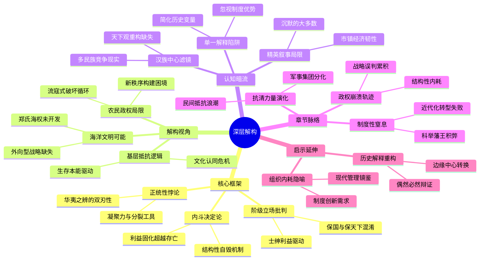

豆瓣链接：https://book.douban.com/subject/35771873/

# 深层解构

### 一、基石：作者构建一切的支点——反复回归的核心信念
1. **内斗决定论：政权崩溃的核心逻辑**  
   顾诚以“内斗就要亡国，亡国也要内斗”为全书灵魂，将南明灭亡的根本原因归结于统治集团的结构性内耗。从弘光朝“拥潞”与“拥福”之争，到永历朝官僚与军阀的倾轧，他反复强调：**当外部威胁（大顺、清）尚未形成绝对优势时，南明政权已因党争、权斗自毁长城**。这种对“人性荒唐”的批判，本质是对传统王朝政治生态的解剖——官僚体系的利益固化远超家国存亡，即便濒临绝境仍无法形成合力。

2. **“正统”执念的双重性**  
   书中隐含对“明朝正统性”的复杂态度：一方面，南明政权以“恢复中原”为旗号凝聚人心，士绅阶层因“华夷之辨”而抗清；另一方面，这种“正统”成为内斗的工具——诸王争位、文武互诋皆借“礼法”之名行私利之实。顾诚通过史实揭示：**传统王朝的“合法性”叙事，在乱世中既是凝聚力来源，也是分裂的导火索**。

3. **阶级立场的隐形批判**  
   引用顾炎武“亡国”与“亡天下”之辨时，顾诚实际在强调：**明末士绅阶层将“保国”（朱明王朝）与“保天下”（文化存续）混为一谈**。当大顺政权代表底层颠覆旧秩序时，士绅选择“易姓改号”的默许；当清朝威胁“被发左衽”时，才唤起“天下兴亡”的共识。这种阶级本能的选择，暴露出传统知识分子的局限性——其“家国情怀”始终与自身利益绑定。

### 二、边缘：思想曲线的远端——轻轻掠过却可能改变一切的洞见
1. **农民政权的历史局限**  
   顾诚对大顺政权的迅速崛起与崩溃着墨较少，但字里行间隐含关键判断：李自成虽“深得民心”，却缺乏治国纲领，政权仍停留在“流寇式破坏”层面。这一视角可延伸思考：**传统农民起义为何难以突破“打天下—坐天下”的循环？其对旧秩序的摧毁是否为新秩序的建立扫清障碍，还是加剧了社会撕裂？**

2. **南明“海洋属性”的未竟可能**  
   书中提及郑成功集团据守东南沿海，但未深入其“海上帝国”的潜在价值。事实上，郑氏拥有当时东亚最强大的海军力量，若与南明政权协同，或可开辟“海上抗清”第二战场。这一“边缘”线索暗示：**当大陆政权陷入内卷时，海洋文明的外向型思维或许能打破困局，但传统史书往往忽视这种“非正统”力量的可能性**。

3. **基层社会的自主抗清逻辑**  
   顾诚重点描写上层政治斗争，却轻描淡写基层民众的自发抵抗（如江阴、嘉定屠城）。这些事件中，普通百姓的抗清动力并非单纯“忠明”，更多是对“剃发令”等文化压迫的本能反抗。这提示：**“华夷之辨”的话语建构，可能滞后于民间真实的文化认同危机**，而底层的生存逻辑才是历史进程的深层动力。

### 三、暗流：未被言说的前提——论证依赖却未被审视的假设
1. **“内斗”作为单一解释框架的局限性**  
   顾诚将南明灭亡归因于内斗，隐含假设“若统治集团团结，即可抵御外敌”。但这一逻辑忽略了清政权的制度优势（如八旗军事体系、满汉联合政权）、大顺与大西政权的战略失误，以及江南经济因战乱崩溃的客观现实。**历史的偶然性与多重变量，被简化为“人性弱点”的必然结果**，这可能导致对复杂历史进程的过度归因。

2. **“士绅视角”的叙事盲区**  
   全书以官僚、宗室、军阀为主角，默认他们是历史的主要推动者，却鲜见农民、工匠、商人等群体的声音。这种“精英史观”背后，是传统史学对“上层政治”的路径依赖。事实上，南明时期江南市镇经济的韧性、秘密社会的活动（如洪门），可能对政权存续产生关键影响，但被排除在叙事之外。

3. **“华夷之辨”的时代滤镜**  
   顾诚继承顾炎武的“天下观”，将抗清叙事视为“文明保卫战”，但未审视这一框架的时代局限性。从更宏观的视角看，明末清初的政权更迭是多民族政权竞争的结果，“华”与“夷”的二元对立，可能掩盖了满族汉化、蒙藏联盟等历史趋势。**作者的论证依赖“汉族中心主义”的隐性前提，而未充分探讨“天下”范畴在清朝的重新定义**。

### 四、作者的盲点与读者的启示
1. **盲点：结构性矛盾 vs. 个体道德批判**  
   顾诚对南明官僚的“人性荒唐”批判犀利，但未深入分析科举制度、藩王政策等制度性缺陷。**当个体道德成为主要批判对象时，制度本身的僵化与腐败可能被淡化**，而后者才是内斗反复发作的土壤。

2. **启示：从“亡国史”到“转型史”的再解读**  
   若跳出“南明是否该亡”的框架，可将其视为传统王朝体系在“大航海时代”冲击下的转型失败案例。此时的东亚已非封闭体系，欧洲列强、日本德川幕府、东南亚殖民地皆在重构地缘格局。**南明的内斗本质是农业文明在近代化压力下的制度性崩溃**，而顾诚的叙事尚未触及这一维度。

### 五、给读者的“X光眼镜”
- **看骨架**：全书以“内斗—分裂—灭亡”为线性逻辑，用海量史实支撑“政治斗争决定论”，但需警惕单一因果的解释陷阱。  
- **找宝石**：关注那些被主流叙事忽视的“边缘力量”（如郑氏海权、基层抗清），它们可能揭示传统史学的“沉默大多数”。  
- **辨陷阱**：作者对“士绅道德”的批判虽深刻，却可能高估了“道德自觉”对政治的影响，低估了制度与利益格局的顽固性。  
- **寻暗门**：从南明的崩溃反观当代组织管理——当“内耗”成为常态时，任何外部挑战都可能成为压垮骆驼的最后一根稻草，这或许是本书超越历史的现实隐喻。

**原来这本书真正在说**：一个政权若将精力消耗于内部倾轧，纵有天险、民心、正统旗号，终难逃覆灭命运。  
**如果换个角度看**：南明的灭亡不是“人性荒唐”的偶然，而是传统王朝制度在多重危机（农民起义、民族矛盾、全球变局）下的必然溃败。  
**作者可能没意识到**：他对“内斗”的痛斥，恰恰暴露了中国传统政治文化中“团结”叙事的脆弱性——当“一致对外”需要以压制不同声音为代价时，内斗只是表象，制度性窒息才是根源。

# 章节内容
### 第一章：明朝覆亡后的全国形势
- **明帝国的分崩离析**：明王朝气数已尽，政治腐败、社会矛盾激化，最终走向崩溃。
- **大顺政权的失误**：大顺军入京后在政治和军事上犯了一系列错误，如追赃助饷严重打击官绅阶层等。
- **吴三桂叛变与山海关之战**：吴三桂降清，引清军入关，改变了局势，李自成亲征山海关失败。
- **清军占领北京和大顺军西撤**：清军趁势占领北京，大顺军被迫西撤，北方局势大变。
- **地方叛乱**：畿南、山东、晋北等地官绅反对大顺政权，发动叛乱，社会秩序混乱。

### 第二章：弘光朝廷的建立
- **继统纷争与史可法失策**：南明在皇位继承问题上纷争不断，史可法在此事上处理不当，影响了弘光政权的团结。
- **朱由崧称帝**：朱由崧最终成为皇帝，建立弘光政权，但他能力平庸，难以担当复兴重任。
- **四镇问题**：四镇军阀跋扈自雄，拥兵自重，成为弘光朝廷的不稳定因素，且他们之间矛盾重重，内耗严重。
- **党争激化**：弘光朝廷内部党争激烈，各方势力相互倾轧，严重影响了朝廷决策和抗清力量的团结。
- **山东局势**：清廷接管畿南、山东等地，山东百姓进行了抗清斗争，但弘光朝廷未能有效支援。

### 第三章：弘光朝廷的偏安江淮
- **“借虏平寇”国策**：弘光朝廷幻想借清军之力消灭李自成等农民军，不积极抗清，这一政策是重大失误。
- **清廷态度变化**：清廷对南明弘光政权的态度从最初的观望到后来转为军事进攻，南明面临更大压力。
- **北使团出使**：左懋第为首的北使团出使清廷，未能达成目的，反而暴露出弘光朝廷的软弱和对形势的误判。
- **军政与财政状况**：弘光朝廷军政腐败，财政困难，无法有效组织抗清力量，军队战斗力低下。
- **朝廷腐败**：官员们贪污受贿、奢侈享乐之风盛行，进一步削弱了弘光政权的根基。

### 第四章：大顺政权的覆亡
- **潼关战役**：清军多铎部与大顺军在潼关展开激战，大顺军失利，清军占领西安。
- **陕北战役**：陕北战场大顺军也遭受挫折，被迫放弃西北，李自成战略转移。
- **李自成牺牲**：李自成在撤退途中牺牲，大顺政权失去核心领导，最终失败，但其余部继续坚持抗清斗争。

### 第五章：弘光政权的瓦解
- **南渡三案**：“大悲案”“伪太子案”“童妃案”引发朝廷内部信任危机，各方势力借此互相攻击，政治更加混乱。
- **睢州之变**：高杰被杀，史可法前往处理善后，导致其军事部署被打乱，南明朝廷局势动荡。
- **左良玉东下**：左良玉以“清君侧”为名起兵东下，与江北四镇发生冲突，进一步削弱了南明的防御力量。
- **扬州失守**：清军南下，扬州城破，史可法殉国，扬州十日大屠杀惨绝人寰，南明防线崩溃。
- **弘光帝出逃被俘**：弘光帝出逃后被俘，潞王朱常淓监国后不久降清，弘光政权彻底瓦解，南明局势危急。

### 第六章：清廷推行的政策
- **多尔衮失算**：多尔衮在一些政策决策上存在失误，如剃发令的推行时机等问题。
- **清兵滥杀无辜**：清军在征战过程中，滥杀百姓，给社会带来巨大灾难，激起民众强烈反抗。
- **剃发易服令**：强迫汉民剃头改用满族衣制，严重伤害了汉民族的自尊心，引发了大规模的反清情绪。
- **圈地和投充**：圈占土地，强迫汉人“投充”为奴，破坏了农业生产和社会经济秩序，加剧了民族矛盾。
- **缉捕逃人法**：缉捕逃人的法律极为严酷，造成社会动荡不安，许多汉人被迫逃亡或反抗。

### 第七章：各地抗清运动的兴起
- **江南绅衿动向**：江南绅衿阶层在南明政权灭亡后，态度不一，部分人组织或参与抗清活动，部分人则观望或降清。
- **百姓自发抗清**：江阴等地百姓自发组织起来进行抗清斗争，展现了强烈的民族气节和反抗精神，虽然最终失败，但英勇事迹激励后人。
- **英霍山区抗清**：英霍山区等地也爆发了抗清斗争，当地民众利用地理优势，坚持抵抗清军，给清军造成一定困扰。
- **皖南抗清斗争**：皖南各地纷纷响应抗清，一些义师和地方势力联合起来，与清军展开战斗，试图恢复明朝统治。
- **陕西抗清运动**：陕西各地的抗清运动此起彼伏，大顺军余部及当地民众继续坚持抵抗清军，斗争形势复杂。

### 第八章：隆武政权与鲁监国争立
- **隆武政权建立**：朱聿键在福州称帝，建立隆武政权，他有一定的政治抱负，试图有所作为，但面临诸多困难。
- **鲁王监国浙东**：鲁王朱以海在浙东监国，与隆武政权形成对立，双方互不承认，分散了抗清力量。
- **唐鲁纷争**：唐、鲁政权之间为争夺正统地位产生对立和纷争，导致抗清阵营内部矛盾激化，给清军可乘之机。
- **鲁监国抗清活动**：鲁监国政权积极开展抗清活动，在浙东地区与清军作战，但由于内部矛盾和实力有限，成效不佳。
- **靖江王之乱**：靖江王朱亨嘉企图争夺皇位，发动叛乱，扰乱了抗清局势，最终被平定。

### 第九章：隆武政权的作为与覆败
- **形势变化**：1645年秋到1646年夏，局势对南明越发不利，清军不断进攻，南明各政权面临巨大压力。
- **隆武帝政策举措**：隆武帝采取了一些积极政策，如联合农民军抗清等，但受到郑芝龙等势力的掣肘，难以有效实施。
- **郑芝龙跋扈**：郑芝龙兄弟在隆武政权中跋扈专权，为了自身利益与清军暗中勾结，最终降清，导致隆武政权失去支柱。
- **黄道周出征**：黄道周毅然出征，但因缺乏军事支持而失败被俘杀，隆武朝廷损失重要力量，抗清形势更加严峻。
- **政权覆亡**：清兵占领浙东，鲁监国航海避难，清军又占领赣南，隆武帝在汀州遇难，隆武政权宣告覆败。

### 第十章：大顺军联明抗清
- **与何腾蛟联合**：东路大顺军余部与何腾蛟联合抗清，但受到何腾蛟的排挤，合作并不顺利，影响了抗清效果。
- **忠贞营改编**：李过、高一功等部改编为“忠贞营”，继续坚持抗清斗争，在一些战役中发挥了重要作用。
- **围攻荆州之役**：忠贞营围攻荆州，虽一度占据优势，但因各种原因最终失败，战略意图未能实现。
- **何腾蛟举措失当**：何腾蛟在经营湖南时举措失当，如与农民军关系处理不好、军事指挥失误等，导致局势恶化。
- **清军入湘**：清孔有德等三王兵进入湖南，南明军队抵抗不力，湖南大部分地区沦陷，抗清局势严峻。

### 第十一章：大西军经营云南
- **沙定洲之乱**：云南发生沙定洲之乱，扰乱了当地社会秩序，为大西军进入云南创造了机会。
- **大西军入滇**：大西军由贵州进入云南，平定了沙定洲之乱，逐步控制了云南地区，稳定了局势。
- **孙可望经营云南**：孙可望等大西军将领在云南采取了一系列有效的经营措施，如恢复生产、整顿军队等，使云南成为抗清的重要基地。

### 第十二章：郑成功起兵与鲁监国浙闽抗清
- **郑芝龙降清**：郑芝龙不顾民族大义降清，郑成功与之决裂，坚决起兵抗清，在东南沿海地区坚持斗争。
- **郑成功早年经历与起兵**：郑成功早年受良好教育，具有强烈的民族意识，他以厦门、金门等地为基地，招募军队，组织抗清力量，不断发展壮大。
- **鲁监国在浙闽抗清活动**：鲁监国在浙闽地区继续抗清，但其势力逐渐衰弱，面临诸多困难，与郑成功之间也存在一定矛盾。

### 第十三章：永历朝廷的建立
- **朱由榔监国与绍武争立**：朱由榔在肇庆监国，随后建立永历政权，但同时绍武政权与之争立，双方发生冲突，削弱了抗清力量。
- **绍武政权覆亡**：绍武政权很快被清军攻灭，显示出南明政权内部的不团结和短视。
- **广东抗清活动**：陈邦彦、张家玉、陈子壮等在广东组织抗清，英勇奋战，但最终失败，广东局势危急。
- **永历朝廷在武冈**：永历朝廷曾迁至武冈，在复杂的局势中艰难维持，面临清军和内部各种势力的威胁。
- **郝永忠入桂**：郝永忠部由湘入桂，引发一系列事件，永历帝逃离桂林，朝廷再次陷入动荡。

### 第十四章：郑成功在闽粤沿海军事活动
- **同安之役**：郑军发动同安之役，取得一定胜利，扩大了势力范围，增强了抗清信心。
- **潮州之役**：郑成功在潮州地区与清军及地方势力展开争夺，军事行动复杂，对当地局势产生重要影响。
- **清军袭占厦门**：1651年清军袭占厦门，郑成功遭受重大挫折，损失惨重，但他迅速调整，继续抗清。
- **郑施交恶**：郑成功与施琅之间产生矛盾，最终施琅降清，这对郑成功的军事力量和战略布局产生了一定影响。

### 第十五章：吴胜兆、王光泰等反清
- **吴胜兆反清与陈子龙遇难**：吴胜兆在江南地区反清，陈子龙等参与其中，但最终失败，陈子龙等人遇难，反清力量遭受打击。
- **宁波华夏密谋反清**：宁波华夏等人密谋策划反清，虽有计划但因各种原因未能成功，反映出民间抗清活动的艰难。
- **王光泰兄弟在襄阳、郧阳反清**：王光泰兄弟在湖北襄阳、郧阳地区起兵反清，一度有所作为，但难以持久，最终失败。

### 第十六章：金声桓、李成栋反清归明
- **江西反正**：金声桓、王得仁领导江西反正，宣布归明，这一事件对南明局势产生重要影响，鼓舞了抗清士气。
- **广东反正**：李成栋以广东全省反正，南明在南方的势力有所恢复，但李成栋后来在进攻赣州时败亡，局势再次逆转。

### 第十七章：北方各省反清运动
- **山东等地抗清斗争**：山东等地民众继续进行抗清斗争，尽管面临清军镇压，但反抗精神不屈，展现了民族气节。
- **山西反清运动**：姜镶等人领导山西反清运动，规模较大，坚持了一段时间，但最终失败，对北方局势产生重要影响。
- **陕北起兵反清**：王永强等在陕北起兵反清，得到当地民众支持，但因力量悬殊而失败，反映出北方抗清形势的严峻。
- **甘肃回民抗清**：甘肃回民米喇印、丁国栋为首的抗清运动具有民族特色，他们反抗清朝统治，但最终被镇压下去。

### 第十八章：1648 - 1649年湖南战局
- **明军收复常德、宝庆**：明军在湖南战场上一度收复常德、宝庆等地，取得一定胜利，但随后内部发生内衅。
- **忠贞营湖南之役**：忠贞营等部在湖南展开战役，与清军战斗激烈，但由于多种因素影响，未能取得更大战果。
- **济尔哈朗进军与何腾蛟之死**：济尔哈朗进军湖南，何腾蛟被俘杀，南明在湖南的局势急剧恶化，抗清力量遭受重创。
- **忠贞营撤入广西**：忠贞营撤入广西，堵胤锡病死，南明在湖南的抗清斗争陷入低谷，清军进一步控制了湖南地区。

### 第十九章：永历朝廷内部党争
- **楚党和吴党**：永历朝廷内部形成楚党和吴党，两党相互争斗，争夺权力和利益，严重破坏了朝廷的团结和决策效率。
- **“五虎”事件**：所谓“五虎”在朝廷中活跃，他们与各方势力纠葛，加剧了党争的复杂性，使得朝廷政治更加黑暗。
- **“打虎”行动**：永历朝廷进行“打虎”行动，试图整顿朝廷秩序，但未能从根本上解决党争问题，反而引发更多矛盾。

### 第二十章：清军攻占桂林、广州
- **清军南下**：孔有德、耿仲明、尚可喜统兵南下，清军攻势猛烈，南明面临巨大军事压力。
- **桂林失陷**：孔有德占领桂林，瞿式耜死难，桂林的失守对南明是沉重打击，广西局势危急。
- **广州被占**：尚可喜、耿继茂攻占广州，南明在广东的势力基本瓦解，永历朝廷被迫播迁，逃亡至其他地区。

### 第二十一章：大西军联明抗清
- **孙可望请封纠葛**：孙可望请封秦王一事引发纠葛，反映出大西军与永历朝廷之间复杂的关系和权力博弈。
- **军阀纷争**：川黔地区军阀纷争不断，大西军内部也存在矛盾，影响了抗清大局，分散了抗清力量。
- **出滇抗清**：大西军出滇抗清，在战场上取得一些胜利，如收复部分地区等，对清军形成一定威胁。
- **忠贞营北上与“白毛毡贼”**：忠贞营北上夔东，被称为“白毛毡贼”，在当地坚持抗清，与其他抗清势力相互呼应。
- **永历帝入安龙**：永历帝进入安龙，在大西军的庇护下继续维持南明政权，但实际上处于孙可望的控制之下，处境艰难。

### 第二十二章：1651 - 1653年浙闽赣抗清势力消长
- **舟山之役与鲁监国退位**：舟山之役清军获胜，鲁监国被迫退位，浙闽沿海抗清势力受到削弱，局势对南明不利。
- **郑成功围攻漳州**：1652年郑成功围攻漳州之役规模较大，给清军造成一定压力，但最终未能攻克漳州，双方陷入僵持。
- **海澄战役**：海澄战役郑成功取得胜利，巩固了在闽南的根据地，增强了抗清实力和信心。
- **江西义师抗清**：江西义师积极开展抗清活动，与清军作战，在一定程度上牵制了清军，但难以改变整体局势。

### 第二十三章：孙可望部署反攻
- **收复湖南战役**：孙可望、李定国组织收复湖南战役，取得重大胜利，收复大片失地，改变了南明在湖南的被动局面。
- **桂林大捷**：李定国取得桂林大捷，击毙孔有德，极大地鼓舞了南明抗清士气，清军在广西的统治受到沉重打击。
- **衡阳大捷**：李定国衡阳大捷，击败清军主力，威震天下，南明抗清形势出现转机，孙可望威望也有所提升。
- **刘文秀保宁之战**：刘文秀进攻保宁之战失利，对大西军的战略布局产生一定影响，也引发了内部一些矛盾。
- **孙可望逼走李定国**：孙可望因嫉妒李定国战功，逼走李定国，导致大西军内部发生分裂，宝庆之败后，南明抗清局势再次恶化。

### 第二十四章：清廷政策调整
- **八旗兵实力下降**：满洲八旗兵经过长期战争，实力有所下降，清廷不得不调整军事策略，更多依靠汉人军队。
- **洪承畴出任经略**：清廷命洪承畴出任五省经略，利用其对南明情况的了解来对付抗清势力，加强了对南方的控制。
- **招抚郑成功**：清廷对郑成功展开招抚活动，试图分化瓦解抗清力量，但郑成功不为所动，坚持抗清立场。
- **郑成功活动**：1655 - 1656年郑成功继续在沿海地区活动，发展势力，与清军对抗，同时也面临一些内部问题。

### 第二十五章：李定国进军广东
- **肇庆之役**：1653年李定国发动广东肇庆之役，虽初期进展顺利，但因郑成功未能有效配合等原因，最终失败。
- **新会之战**：1654年李定国广东新会之战再次失利，南明失去了一次恢复广东的重要机会，抗清形势更加严峻。
- **郑李关系分析**：郑成功与李定国之间的关系复杂，由于双方战略目标、利益等因素，未能实现有效合作，影响了抗清大业。

### 第二十六章：会师长江战略设想
- **张名振三入长江**：张名振、张煌言组织三入长江之役，对清军后方造成一定威胁，展示了南明的抗清决心。
- **钱谦益等人策划**：钱谦益、姚志卓等人密谋策划会师长江，试图联合各方力量，恢复江南，但计划未能实现。
- **孙可望决策与搁置原因**：孙可望决策会师长江，但因内部矛盾等原因计划被搁置，南明错失了一次重要的战略机会

### 第二十七章：李定国迎永历帝入滇
- **永历帝困境与抉择**：永历帝在安龙处境艰难，受孙可望挟制，李定国击败孙可望后迎永历帝入滇，试图重振南明。
- **李定国受封与权力格局**：李定国受封晋王，掌握军政大权，但南明内部矛盾依然存在，各方势力仍有博弈。
- **云南治理与抗清筹备**：李定国在云南积极治理，整顿军队，筹备抗清物资，为继续抗清做准备，一定程度上稳定了局势。
- **与孙可望余部关系**：处理与孙可望降清后余部的关系成为难题，内部整合面临挑战，影响了抗清力量的团结与战斗力。

### 第二十八章：清廷对西南的进攻
- **吴三桂进兵贵州**：吴三桂受命进兵贵州，清军逐步向西南推进，南明面临新的军事压力。
- **战略布局与军事行动**：清廷制定详细战略，多路清军协同作战，试图彻底消灭南明在西南的势力。
- **对当地影响**：清军的进攻给西南地区百姓带来战乱与苦难，社会经济遭到破坏，民族矛盾也有所加剧。
- **南明的抵抗态势**：南明军队在李定国等将领指挥下进行抵抗，但因力量对比悬殊，逐渐处于劣势，防线不断收缩。

### 第二十九章：郑成功与永历朝廷的貌合神离
- **郑成功的独立性**：郑成功在东南沿海自成体系，虽表面尊奉永历朝廷，实际在军事、政治等方面保持较大独立性。
- **双方矛盾根源**：战略重点差异、利益分配不均以及地域隔阂等因素导致郑成功与永历朝廷矛盾渐生。
- **合作中的分歧**：在一些联合作战计划中，双方因指挥权、资源调配等问题产生分歧，难以形成有效合力。
- **对整体抗清局势的影响**：这种貌合神离的状态削弱了南明整体抗清力量，给了清廷各个击破的机会。

### 第三十章：永历朝廷的覆灭
- **清军入滇**：吴三桂等清军攻入云南，永历帝出逃，南明在西南的最后据点丧失，局势岌岌可危。
- **咒水之难**：缅甸发生咒水之难，永历朝廷官员多被杀，进一步削弱了南明的核心力量。
- **永历帝被俘杀**：永历帝最终被吴三桂俘获并杀害，标志着永历朝廷的彻底覆灭，南明政权正式结束。
- **历史意义与反思**：南明的覆灭反映出其内部政治腐败、军事无能、派系纷争等诸多问题，也展现了明清易代时期复杂的历史局势与民族矛盾。

### 第三十一章：郑成功收复台湾
- **决策背景**：郑成功在大陆抗清面临困境，为寻找新的根据地，决定收复被荷兰殖民者占据的台湾。
- **军事准备与行动**：郑成功精心筹备，组织舰队，跨海作战，克服重重困难，成功登陆台湾并展开军事进攻。
- **与荷兰殖民者的战斗**：与荷兰军队进行激烈战斗，凭借军事智慧和顽强斗志，逐步击败荷兰殖民者，收复台湾岛。
- **历史意义**：郑成功收复台湾不仅维护了中国领土完整，也为台湾的开发和民族融合奠定了基础，在中华民族历史上具有重要意义。

### 第三十二章：南明余波与历史影响
- **夔东十三家坚持抗清**：夔东十三家在川鄂边境继续坚持抗清斗争，虽孤立无援，但展现出顽强的民族气节与反抗精神。
- **南明抗清运动的后续影响**：南明抗清运动在一定程度上激发了民族意识，对后世民族精神的传承和历史文化产生了深远影响。
- **历史教训总结**：南明的历史教训表明，一个政权的稳定需要内部团结、政治清明、军事强大以及正确的战略决策，否则难以在复杂局势中生存发展。
- **对明清历史研究的意义**：南明史丰富了明清历史的内涵，为研究这一时期的政治、军事、民族关系等提供了大量生动而深刻的素材，有助于深入理解中国古代社会转型期的特点与规律。 