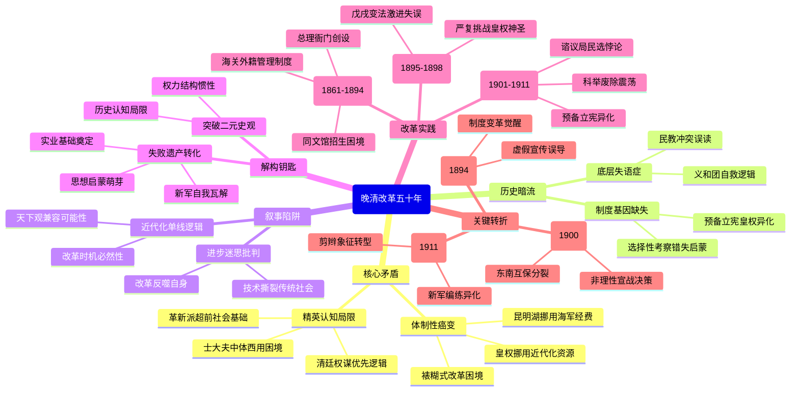

豆瓣链接：https://book.douban.com/subject/36574408/

# 深层解构

### 《大变局：晚清改革五十年》深层解码

#### 一、基石：被反复锚定的核心逻辑
1. **体制性癌变：从裱糊匠到破屋理论的宿命**  
    - 作者以“裱糊匠”李鸿章的自白为隐喻，构建起全书的核心框架：晚清改革如同给破屋糊纸，技术革新（如洋务军工、电报铁路）与制度惰性（如满汉权力博弈、科举取士）构成根本矛盾。  
    - **关键例证**：昆明湖练海军（1886年）将海军军费挪作颐和园修缮，表面是“以园换海”的荒唐决策，实则暴露皇权对近代化资源的系统性挪用——当“万寿庆典”比“渤海防务”更优先，改革已沦为权力合法性的粉饰工具。
2. **精英的困局：在传统与现代间失重的三代人**  
    - 书中将人物分为三类：  
      - **清廷高层**（慈禧、奕䜣）：困于“权谋优先于改革”的传统政治逻辑，如奕䜣创设总理衙门却屡遭慈禧猜忌，终因甲申易枢被逐出权力中心；  
      - **官僚士大夫**（曾国藩、徐继畬）：在“中体西用”框架内挣扎，曾国藩处理天津教案时“谤讥纷纷”，暴露出传统治理智慧面对近代外交的无力；  
      - **革新派**（严复、谭嗣同）：试图突破君权神圣性，但严复的“开民智”与谭嗣同的“杀身成仁”均缺乏社会基础，最终沦为体制外的呐喊。  
    - **隐含判断**：传统精英的知识结构与价值体系，无法孕育出真正的近代化改革者——即便如郭嵩焘这样“正眼看世界”的先驱，也因《使西纪程》遭保守派围攻，客死他乡。

#### 二、边缘：被轻拂而过的思想星火
1. **底层的沉默：改革叙事中的缺席者**  
    - 书中偶提“生活支离破碎的底层民众”，却未深入其与改革的互动逻辑：  
      - 教案频发（如1870年天津教案）本质是底层对陌生文明的恐惧与反抗，而清廷将其简化为“民教冲突”，错失理解社会转型阵痛的契机；  
      - 义和团运动（1900年）被描述为“底层社会全面失序”，但未深究“扶清灭洋”口号中，包含着对体制失效的绝望自救——当朝廷无法提供安全与公正，民众只能诉诸传统迷信组织。
2. **技术之外的现代性：被忽视的制度基因**  
    - 作者聚焦洋务运动的“器物革新”，却对同期日本明治维新的制度变革着墨较少。事实上，大清并非没有制度创新机会：  
      - 1866年斌椿使团出洋，本可成为睁眼看世界的起点，却因“选择性考察”（只学技术，回避政治制度）错失关键启蒙；  
      - 1906年预备立宪，载泽误读“君主立宪乃保君权”，将宪政改革退化为“皇权合法化工程”，最终导致谘议局与清廷的对立。  
    - **潜在洞见**：技术革新需制度土壤，而制度变革需打破“统治术优先”的思维定式——这正是清廷始终跨不过去的坎。

#### 三、暗流：未被审视的叙事前提
1. **近代化单一叙事的陷阱**  
    - 全书以“改革失败→帝国灭亡”为线性逻辑，隐含“近代化=西方化”的预设，却未追问：  
      - 传统天下观是否完全无法与现代国家观兼容？徐继畬《瀛寰志略》试图调和二者，却被保守派视为“离经叛道”；  
      - 若改革不始于1861年，而是更早（如鸦片战争后），或更晚（如庚子事变后），历史是否有其他可能？作者默认“五十年改革窗口”的唯一性，却未论证其必然性。
2. **对“进步”的盲目信任**  
    - 书中将铁路、电报、新军等视为“进步象征”，却忽略其与传统社会的撕裂：  
      - 1876年吴淞铁路被拆，表面是保守派反对“奇技淫巧”，实则反映传统运输业者（如挑夫、车夫）对失业的恐惧——近代化的“进步”背后，可能是无数个体的命运悲剧；  
      - 新式学堂（1902年）以“培养忠君意识”为目标，反而催生反清革命青年，印证“改革措施可能走向初衷反面”的吊诡逻辑。  
    - **隐藏反思**：当我们歌颂“历史进步”时，是否听见了那些被进步碾碎的哭声？

#### 四、给读者的三把钥匙
1. **超越“好坏二元论”**：慈禧不是纯粹的“保守派”（她支持洋务、推行新政），光绪也非完美的“改革者”（戊戌变法中多次决策失当）。权力结构的惯性，远大于个人意志。  
2. **警惕“后见之明”**：我们站在历史终点看改革，容易苛责前人“何不早立宪”，却忽视他们身处“传统—现代”撕裂中的认知局限。如1874年清廷误判日本明治维新为“乱源”，恰是因缺乏近代国家竞争的认知框架。  
3. **在失败中寻找遗产**：改革虽未挽救清廷，却留下重要遗产：严复翻译《天演论》种下思想启蒙的种子，张謇等实业家奠定近代民族工业基础，甚至清廷编练的新军，最终成为瓦解帝制的力量——历史的吊诡之处，在于失败的改革往往为未来埋下伏笔。

#### 结语：一场跨越百年的思想对话
谌旭彬的书写，表面是晚清五十年改革史，实则是对中国近代化道路的深沉叩问。当我们在书中看到奕䜣的权谋、李鸿章的无奈、严复的呐喊，看到昆明湖的游船与渤海的浪花，看到剪辫子的迟疑与立宪的骗局，我们看到的不仅是一个帝国的黄昏，更是一个文明在古今中西碰撞中的挣扎与觉醒。  

这本书真正的价值，不在于给出“改革为何失败”的答案，而在于邀请读者思考：在传统与现代的张力中，在权力与民意的博弈中，一个古老文明该如何完成痛苦的蜕变？或许，这才是《大变局》留给我们最珍贵的礼物——一场关于中国何以成为今日之中国的思想接力。

# 章节内容
### 第一章 1861年：改革始于人事更迭
- **咸丰皇帝宁死不回京**：咸丰逃往承德后不愿回京，最终死于此地，为后续改革埋下伏笔，这一事件也反映出当时清廷内部的不稳定局势。
- **奕䜣艰难创设总理衙门**：奕䜣努力推动下，总理衙门得以创设，成为洋务运动开端，标志着清政府开始尝试与西方接触和交流，以应对外部挑战。
- **冯桂芬深埋改革主张**：冯桂芬虽有改革思想，但受时代局限，只能将主张深埋，反映出当时保守势力强大，改革面临诸多困难。

### 第二章 1862年：步履艰难同文馆
- **满人本位意识下的改革**：同文馆设立初衷为培养外语人才，却因满人本位意识，在招生等方面遭遇重重阻碍，体现了传统观念对改革的束缚。
- **真诚勇敢的无知顽固者**：顽固派反对同文馆开设，认为学习外语等西方知识会危及传统文化和统治，他们的无知和固执成为改革的巨大阻力。
- **没能录取到任何体面人**：由于社会偏见，同文馆招生困难，难以招到体面之人，反映出当时社会对西方文化和洋务改革的排斥态度。

### 第三章 1863年：赫德执掌大清海关
- **“领事保关制度”因贪腐崩溃**：原有的“领事保关制度”因贪腐问题无法有效管理海关事务，凸显出清政府海关制度的腐败和落后，急需改革。
- **“外籍税务监督制度”的由来**：在这种背景下，“外籍税务监督制度”应运而生，赫德开始执掌大清海关，引入西方管理模式，对海关进行整顿和改革。
- **“如果我们有一百个赫德”**：作者通过这一表述，探讨了赫德对中国海关改革的影响，认为如果有更多像赫德这样有能力的人来管理中国事务，或许能给中国带来更大改变，但也暗示了中国改革不能完全依赖外人。

### 第四章 1864年：太平天国偃旗息鼓
- **天王与东王的冲突**：洪秀全与杨秀清之间的权力争夺导致内部矛盾激化，严重削弱了太平天国的领导力量，成为其失败的重要原因之一。
- **人力与物力的汲取**：太平天国在人力和物力汲取方面存在问题，过度消耗资源且无法有效管理，导致民众负担过重，失去民心，这是其失败的根本原因之一。
- **条例与制度的缺陷**：太平天国的制度和条例在实践中暴露出诸多缺陷，如平均主义的空想性等，无法适应现实社会发展需求，最终导致政权崩溃。

### 第五章 1865年：搬运新器械与新技术
- **地方干了中枢没法干的事**：地方督抚在引进西方器械和技术方面发挥了重要作用，他们比中枢更具灵活性和实干精神，推动了洋务运动在地方的开展。
- **劝化英夷让他们改邪归正**：清政府在外交上仍存在天朝上国观念，试图劝化英国等西方国家，反映出清政府对国际形势认识不足，外交观念落后。
- **用魔法是打败不了魔法的**：作者通过此观点强调，清政府仅靠传统思维和手段无法应对西方挑战，必须进行全面改革，学习西方先进技术和制度。

### 第六章 1866年：首个官派考察团出洋
- **恭亲王找了个变通之法**：恭亲王为推动洋务改革，采取变通策略，组织官派考察团出洋，体现了他在改革过程中的智慧和无奈，既要应对保守势力，又要推动改革进程。
- **有选择性地“开眼看世界”**：考察团在出洋过程中，对西方的观察和学习具有选择性，主要关注军事、技术等方面，忽视了政治、文化等深层次内容，反映出清政府改革的局限性。
- **仍不免被骂做“甘为鬼奴”**：即使考察团带回了西方的先进知识和经验，仍遭到保守派的攻击和谩骂，说明当时改革面临巨大的舆论压力和保守势力的强烈反对。

### 第七章 1867年：改革先驱发挥人生余热
- **《瀛寰志略》远胜《海国图志》**：作者认为徐继畬的《瀛寰志略》在对世界地理和历史的介绍上比魏源的《海国图志》更具深度和客观性，为中国人了解世界提供了更准确的视角。
- **有“死不瞑目”四字念念不能忘**：徐继畬等改革先驱虽有远见卓识，但在当时的环境下难以实现抱负，其“死不瞑目”体现了他们对改革未竟事业的遗憾和对国家命运的担忧。
- **开眼看世界不够，得正眼看世界**：强调不仅要了解西方，还要正确认识西方，摒弃偏见和幻想，以更积极的态度学习西方先进文明，推动中国的现代化进程。

### 第八章 1868年：首支外交使团出访欧美
- **奕䜣不敢独断，追求集体决策**：在派遣外交使团出访欧美问题上，奕䜣谨慎行事，追求集体决策，反映出清政府内部决策机制的复杂性和保守性，担心个人决策引发争议和反对。
- **皇帝的面子也是国体的一部分**：使团出访过程中，涉及到礼仪等问题，清政府强调皇帝面子和国体尊严，体现了传统观念对外交事务的影响，在一定程度上阻碍了外交的正常开展。
- **美国人病逝于中国钦差使节任上**：蒲安臣病逝于任上这一事件，反映出外交使团在出访过程中面临的困难和挑战，也显示了中美之间在外交上的互动和合作尝试。
- **一个被传统困住了的改革派**：作者通过对使团出访相关事件的描述，展现了清政府在外交改革中受传统束缚的困境，即使有改革举措，也难以突破传统思维和体制的限制。

### 第九章 1869年：拒铁路于国门之外
- **地方督抚集体决策抵制铁路**：地方督抚出于多种原因，如担心破坏风水、影响社会稳定等，集体抵制铁路建设，反映出当时社会的保守观念和对新事物的恐惧。
- **基于开放形象的体谅与放弃**：清政府在面对外国压力时，考虑到国际形象，对外国在华修建铁路的要求有所体谅，但最终还是放弃，体现了清政府在外交和国内事务之间的权衡和矛盾心态。
- **拆掉清帝国境内第一条铁路**：清政府拆除已建成的铁路，这一行为阻碍了中国近代交通事业的发展，也反映出清政府改革的摇摆不定和保守势力的强大。

### 第十章 1870年：曾国藩被算计进退失据
- **有人想要尽戮在京夷酋**：天津教案发生后，部分人主张对外国侨民采取极端措施，反映出当时民众对外来势力的不满情绪以及民族主义情绪的高涨。
- **两条改革路线激烈交锋**：在处理天津教案过程中，曾国藩的温和外交路线与部分人的强硬路线产生冲突，反映出清政府内部在外交和改革方向上的分歧。
- **“谤讥纷纷”背后的算计**：曾国藩因处理教案方式受到各方指责，背后涉及到政治算计和权力斗争，也显示出他在复杂政治环境中的艰难处境。
- **法国想要的并不是头颅**：作者通过分析指出，法国在天津教案中的目的并非简单的报复，而是追求更大的利益，清政府对此认识不足，处理方式不当。

### 第十一章 1871年：消弭教案的努力流产
- **清廷想主导一次条约外交**：清政府试图通过外交谈判解决教案问题，体现了其在外交观念上的转变，开始尝试运用条约和外交手段处理国际关系。
- **无力让法国坐到谈判桌前**：然而，清政府由于自身实力弱小，无法迫使法国进行谈判，反映出清政府在国际事务中的被动地位和外交能力的不足。
- **旧基层统治秩序开始崩溃**：教案的频繁发生和难以解决，表明清政府旧的基层统治秩序在西方冲击下开始瓦解，地方社会矛盾日益尖锐。
- **教案退潮背后的制度玄机**：作者分析了教案退潮的原因，认为背后涉及到制度层面的问题，如中外法律制度差异等，这些问题未得到根本解决，教案隐患依然存在。

### 第十二章 1872年：种子播下后迟早会发芽
- **容闳心中藏着一个梦想**：容闳致力于推动中国留学生赴美留学，他的梦想是通过培养西式人才来改变中国，这一举措为中国近代化进程注入了新的活力。
- **倘有疾病生死，各安天命**：清政府在派遣留学生问题上，起初态度消极，对留学生的生死安危缺乏足够重视，反映出清政府对留学事务的不重视和传统观念的影响。
- **是体制有病，非人品问题**：作者通过对留学生相关事件的分析，指出中国问题的根源在于体制，而非个人品德，强调了体制改革的必要性。
- **恭亲王不再支持汉人留学**：随着时间推移，恭亲王对汉人留学的态度发生转变，不再支持，这反映出清政府内部在改革政策上的摇摆和满汉之间的矛盾。
- **去国十载，归来已是思想犯**：留学生回国后，因思想观念的变化与国内传统观念产生冲突，甚至被视为思想犯，体现了中国近代化进程中思想变革的艰难。

### 第十三章 1873年：同治皇帝放弃跪拜礼
- **空前绝后的失礼行为**：同治皇帝在接见外国使臣时放弃跪拜礼，这一行为在当时被视为打破传统礼仪规范，引起了轩然大波，反映出传统礼仪观念与近代外交礼仪的冲突。
- **恭亲王战战兢兢做汇报**：恭亲王在处理此事时小心翼翼，向慈禧太后汇报，体现了他在改革与传统之间的谨慎权衡，担心引发更大的政治风波。
- **别等他国用武力逼迫才改**：作者通过这一事件，呼吁清政府应主动适应国际形势，改革传统礼仪制度，避免因循守旧导致更大的危机。
- **洋人被皇帝的天威“吓尿了”**：部分保守派认为皇帝放弃跪拜礼是对洋人的恩赐，洋人会被皇帝天威震慑，这种观点体现了他们的愚昧和对国际形势的无知。

### 第十四章 1874年：清廷被日本耍得团团转
- **日本使团给总理衙门挖坑**：日本使团在与清政府谈判过程中，故意设置陷阱，清政府应对不当，反映出清政府外交人员缺乏经验和外交智慧。
- **步步落在对方的算计里**：清政府在处理日本侵台事件中，始终处于被动，不断被日本牵着鼻子走，体现了清政府在外交和军事上的软弱。
- **“古今所罕有的大业”**：日本明治维新后的对外扩张被视为其“大业”，而清政府对此认识不足，未能有效应对，显示出清政府对国际形势变化的敏感度不够。
- **众人坚信明治维新是乱源**：清政府内部许多人认为日本明治维新导致社会动荡，是乱源，而没有认识到明治维新对日本国力提升的积极作用，反映出清政府的短视和保守。

### 第十五章 1875年：躁狂的年轻皇帝死了
- **朕将皇位让给你恭亲王如何？**：同治皇帝的这一言论反映出他对皇位的厌倦和无奈，也暗示了当时清政府内部政治环境的复杂和皇帝面临的压力。
- **挨过揍的人要更靠谱一些**：在选择新皇帝时，慈禧太后等考虑到恭亲王有与西方打交道的经验，认为他更能应对外部挑战，体现了清政府在改革过程中对西方因素的重视。
- **大转型时代最需要的是见识**：作者通过这一事件强调，在时代变革时期，领导者需要有广阔的见识和胸怀，才能带领国家走向富强，而同治皇帝的早逝使清政府失去了一次可能的变革机遇。

### 第十六章 1876年：首次向欧美派驻外交官
- **结束漫长的盲人摸象时代**：清政府向欧美派驻外交官，标志着中国外交开始走向世界，结束了以往对西方世界缺乏直接了解的局面，是外交近代化的重要一步。
- **未出国门已是人神共愤**：外交官刘锡鸿在出国前就遭到各方攻击，反映出清政府内部保守势力对洋务外交的强烈抵制，也显示出改革面临的巨大阻力。
- **一部日记不知是何居心**：刘锡鸿在国外撰写的日记被保守派利用，引发争议，说明清政府内部在外交观念和改革方向上存在严重分歧，保守势力试图通过攻击洋务派来维护传统体制。
- **京师同指目为汉奸之人**：刘锡鸿等人被保守派视为“汉奸”，这一现象体现了当时保守势力对洋务改革的极端排斥，以及改革派在国内面临的恶劣舆论环境。
- **“两面人”刘锡鸿**：作者对刘锡鸿的评价，指出他在外交事务中既想推动改革，又受传统观念束缚，表现出矛盾的态度，反映出当时许多官员在改革浪潮中的复杂心态。

### 第十七章 1877年：丁戊奇荒里的天灾与人祸
- **山西已成人间地狱**：丁戊奇荒给山西等地带来了巨大灾难，人口锐减，社会秩序混乱，反映出当时清政府在应对自然灾害方面的能力不足。
- **戒鸦片难，戒鸦片财政更难**：清政府在救灾过程中，由于财政困难，无法有效开展救灾工作，而鸦片贸易又影响了财政收入，体现了清政府在经济和社会治理方面的困境。
- **“小孩饿死尚是小事”**：地方官员在救灾中的冷漠态度和不当言论，揭示了清政府吏治腐败和对民生问题的忽视，进一步加剧了社会矛盾。

### 第十八章 1878年：连小小的武举也废不掉
- **湘军其实是一支传统军队**：湘军虽然在镇压太平天国运动中发挥了重要作用，但本质上仍是传统军队，其军事制度和理念已无法适应近代战争需求。
- **刻意摧毁曾国藩的建军之道**：清政府在军事改革过程中，未能有效借鉴曾国藩的建军经验，反而对其进行打压，反映出清政府内部的政治斗争和对军事改革的盲目性。
- **统治术的优先级高于强军术**：作者认为清政府在改革中更注重统治权术，而忽视了强军的重要性，导致军事改革滞后，无法有效抵御外部威胁。

### 第十九章 1879年：琉球交涉错失良机
- **李鸿章不在乎琉球的朝贡**：李鸿章在琉球问题上态度消极，认为琉球朝贡对清政府利益影响不大，反映出他在外交决策上的短视和对国家主权的忽视。
- **总理衙门选择回避外交考验**：总理衙门在琉球交涉中回避问题，未能积极应对日本的侵略行径，体现了清政府外交的软弱和无能。
- **原本有机会拿到琉球的一半**：作者指出清政府在琉球交涉中原本有机会争取到一定利益，但由于决策失误和外交不力，错失良机，进一步损害了国家利益。
- **恭亲王一度欲将海军托付给赫德**：这一事件反映出清政府在海军建设和管理上的无奈，试图借助外人力量来发展海军，但也存在主权丧失的风险。

### 第二十章 1880年：终于允许建设电报线路
- **改革者们纠结了整二十年**：清政府在电报线路建设问题上犹豫了二十年，反映出改革者内部对新事物的认识存在分歧，以及保守势力的强大阻碍。
- **被逼至走投无路才肯解禁**：在外部压力和实际需求的推动下，清政府最终允许建设电报线路，体现了改革的被动性和滞后性。
- **自己搬石头砸自己的脚**：清政府在电报建设过程中，由于管理不善和利益冲突，出现了诸多问题，如电报线路被破坏等，这是清政府在改革过程中缺乏规划和管理能力的表现。
- **从天津到北京要走三年**：这一夸张说法形象地说明了清政府在电报建设前信息传递的缓慢，强调了电报建设对提高信息传递效率和推动社会发展的重要性。

### 第二十一章 1881年：现代医学进入中国
- **现代医学与传统医学的区别**：作者介绍了现代医学与传统医学在理论、治疗方法等方面的差异，强调现代医学的科学性和先进性，为现代医学在中国的传播和发展提供了背景。
- **同行之间才有赤裸裸的仇恨**：中西医之间的冲突不仅源于医学理念的不同，还涉及到行业利益和文化观念的冲突，反映出社会变革时期新旧事物交替的复杂性。
- **李鸿章对现代医学心悦诚服**：李鸿章对现代医学的认可，体现了部分洋务派官员对西方先进科学技术的接受和重视，对推动现代医学在中国的发展起到了一定作用。
- **王清任很少，张锡纯太多**：作者通过对比王清任和张锡纯，批评了当时中医界存在的盲目排外和因循守旧现象，呼吁中医应积极吸收现代医学的优点，进行改革创新。

### 第二十二章 1882年：美国出台《排华法案》
- **稀里糊涂放弃了《蒲安臣条约》**：清政府在外交上的失误，未能有效维护在美华人权益，导致《蒲安臣条约》的权益丧失，反映出清政府外交的软弱和对国际事务的不了解。
- **清廷对自己的国际形象没感知**：清政府对美国出台《排华法案》反应迟缓，缺乏对国际形象的重视，没有采取有效措施应对，进一步损害了中国在国际上的地位。
- **掉进了社会达尔文主义的陷阱**：美国的《排华法案》体现了社会达尔文主义的影响，清政府在国际事务中面临这种不平等对待，显示出当时国际关系中弱肉强食的现实。

### 第二十三章1883年：太后欲雪庚申之耻
- **地方督抚与清流台谏普遍主战**：中法战争前夕，地方督抚和清流台谏大多主张对法作战，反映出当时清政府内部部分官员的民族主义情绪和对国家尊严的维护意识，但也存在盲目乐观和缺乏对局势准确判断的问题。
- **“自信”源于洋务改革20年**：这种主战的“自信”部分源于洋务运动开展二十年来取得的一些成果，如军事装备的更新等，但清政府未意识到自身在制度、军事指挥等方面仍存在诸多弊端。
- **局内人忧惧改革的含金量有限**：部分有识之士担忧洋务改革成果有限，难以应对法国的挑战，他们认识到清政府的改革并未触及根本问题，如政治体制的腐朽等，在战争面前可能不堪一击。

### 第二十四章1884年：改革来到了分水岭
- **恭亲王奕䜣被逐离政坛**：奕䜣作为洋务运动的重要推动者被逐出政坛，这是清政府内部权力斗争的结果，也标志着洋务运动前期改革势力受到重大挫折，对后续改革进程产生了深远影响。
- **算命的瞎子进入军机处**：慈禧太后任用非专业人士进入军机处，反映出清政府决策层的混乱和腐朽，决策不再基于理性和能力，而是受到宫廷政治和个人喜好的左右，进一步削弱了清政府的统治能力。
- **“不败而败”只是个神话**：关于中法战争“不败而败”的说法作者进行了剖析，认为清政府在战争中实际上处于劣势，所谓“不败而败”是一种片面的观点，清政府在军事、外交等方面的失败是多方面因素造成的，包括战略决策失误、军队战斗力低下等。
- **总督遗折请求开设议院**：总督遗折提出开设议院的主张，反映出部分官员开始认识到政治体制改革的必要性，希望通过引入西方政治制度来挽救清政府的统治危机，但这一主张在当时保守的政治环境中难以实现。

### 第二十五章1885年：企业转型成了衙门
- **开办洋务以来最得意之事**：清政府在洋务企业发展过程中，将企业管理逐渐衙门化，初期还视为得意之事，体现了清政府对近代企业管理缺乏正确认识，仍以传统衙门管理思维来对待新兴企业。
- **“官进民退”与疯狂“报效”**：这种管理模式导致“官进民退”，企业失去市场活力，同时企业被迫进行疯狂“报效”，资金被挪用，严重影响了企业的正常发展，阻碍了中国近代工业化进程。
- **郑观应的诊断与药方**：郑观应针对企业问题提出了诊断和药方，他认识到企业管理体制的弊端，主张进行改革，强调商办企业的重要性，为中国近代企业发展提供了新的思路，但在当时的政治经济环境下难以有效实施。

### 第二十六章1886年：拿昆明湖换渤海
- **北洋海军无奈前往长崎**：北洋海军因经费等问题前往长崎，反映出北洋海军发展面临困境，清政府在海军建设上投入不足，且在战略布局上存在问题，导致海军发展受限。
- **清廷海兵与日本警察互斗**：长崎事件中双方的冲突，不仅是一次简单的治安事件，更反映出中日两国在军事力量对比和国家关系上的微妙变化，也预示着未来可能的冲突。
- **昆明湖里练海军的玄机**：清政府挪用海军经费修建颐和园，在昆明湖练兵，揭示了清政府的腐败和对海军建设的不重视，将海军建设经费用于满足统治者的私欲，严重削弱了海军实力。
- **人人皆知中国不足惧**：通过这一事件，日本及其他国家认识到清政府的腐朽和虚弱，中国在国际上的形象进一步受损，也刺激了列强侵略中国的野心。

### 第二十七章1887年：广学会改变中国
- **博得中国士大夫的尊敬**：广学会通过传播西方知识和思想，赢得了部分中国士大夫的尊敬，说明其在文化交流和思想启蒙方面起到了一定作用，为西方文化在中国的传播开辟了渠道。
- **批评洋务改革走了歧路**：广学会对洋务运动提出批评，认为其改革方向存在问题，没有触及根本制度，这一观点反映出部分西方人士对洋务运动局限性的认识，也促使一些中国人反思洋务改革的不足之处。

### 第二十八章1888年：北洋海军以残阵成军
- **与大清格格不入的近代化军队**：北洋海军作为近代化军队，在人员素质、管理体制等方面与清政府传统军队和官僚体系存在诸多矛盾，难以融入清政府的整体军事体系，导致其发展受到制约。
- **海军停滞，李鸿章怀念醇亲王**：醇亲王去世后，北洋海军发展停滞，李鸿章的怀念体现出醇亲王在世时对海军建设的支持，也反映出清政府内部政治人物的更替对洋务事业发展的影响。
- **没有土壤的花，结不出果实**：北洋海军虽然在装备等方面实现了近代化，但由于缺乏相应的制度、文化等土壤，无法真正发挥其战斗力，最终在甲午战争中失败，作者以此强调全面改革的重要性，仅有军事技术的引进而无制度文化变革难以实现国家富强。

### 第二十九章1889年：光绪大婚不给慈禧面子
- **若非太后垂帘，大清哪有今天**：慈禧太后强调自己垂帘听政对大清的贡献，反映出她对权力的掌控欲和对自身地位的维护，同时也体现出清政府统治的危机，需要借助慈禧的权威来维持稳定。
- **年轻皇帝内心充满愤懑**：光绪皇帝在大婚事件中的表现，显示出他对慈禧太后专权的不满，这种矛盾为日后的政治斗争埋下伏笔，也反映出清政府内部权力结构的不稳定。
- **朕连那汉献帝都不如！**：光绪皇帝的这一感叹，深刻表达了他在慈禧太后压制下的无奈和痛苦，也预示着清政府内部权力斗争的加剧，皇帝与太后之间的矛盾将对国家政治产生重大影响。

### 第三十章1890年：清帝国大炼钢铁
- **贵州巡抚炼钢铁弄出大爆炸**：贵州巡抚主导的炼钢铁活动失败，发生大爆炸，反映出清政府在工业建设中缺乏科学技术和管理经验，盲目开展项目，造成资源浪费和人员伤亡。
- **要政治平衡，不要专业能力**：清政府在钢铁工业等洋务项目中，更多考虑政治因素，如平衡各方势力，而忽视专业人才的选拔和任用，导致项目失败，这是清政府改革失败的重要原因之一。
- **不是炼铁厂，而是炼铁厂衙门**：钢铁厂衙门化管理，使得企业失去市场主体地位，成为政府机构的附属，无法按照市场规律和科学管理进行运营，进一步阻碍了中国近代工业的发展。

### 第三十一章1891年：皇帝开始学英语
- **洋文堆满御案，引起国际关注**：光绪皇帝学习英语这一行为引起国际关注，反映出清政府在时代变革中试图与国际接轨，学习西方文化的努力，但也显示出这种努力在当时保守的政治环境中面临诸多争议。
- **帝师们竭力防止皇帝“过激”**：帝师们对光绪皇帝学习英语的态度谨慎，担心皇帝过于追求西方知识而引发政治变革，体现出他们维护传统体制的保守思想，也反映出清政府内部新旧思想的冲突。
- **光绪皇帝逸出了思想的牢笼**：光绪皇帝学习英语等西方知识，使他的思想逐渐开阔，开始突破传统思想的束缚，为后来的戊戌变法奠定了思想基础，但这一过程也充满了曲折和阻力。

### 第三十二章1892年：周汉被精神病
- **与谣言共舞，全躯岂算大清人**：周汉利用谣言煽动民众情绪，反映出当时社会底层民众对西方文化和洋务运动的误解和抵制，以及民族主义情绪的极端化倾向，这种情绪被保守势力利用，加剧了社会矛盾。
- **到处是周汉，张之洞焦头烂额**：周汉事件在多地引发混乱，张之洞等官员难以应对，说明清政府在处理社会舆论和民众情绪方面缺乏有效手段，也显示出社会变革时期思想混乱和管理困境。
- **以愚昧爱国，士绅的思想底色**：作者通过周汉事件，批判了当时部分士绅以愚昧方式表达爱国情感的现象，强调理性爱国和思想启蒙的重要性，这种愚昧思想阻碍了中国社会的进步。

### 第三十三章1893年：关东铁路为太后大寿让路
- **边患日重，亟需往东北修铁路**：东北地区面临日益严重的边患，修建铁路具有重要战略意义，但清政府在决策时并未优先考虑国家战略需求，体现出其短视和对国家利益的忽视。
- **万寿最大，铁路建设只能停工**：为了庆祝慈禧太后大寿，关东铁路停工，反映出清政府政治的腐朽，统治者将个人私欲置于国家利益之上，严重影响了国家基础设施建设和国防安全。
- **全国大小官员掀起“报效”热潮**：官员们为慈禧太后大寿进行“报效”，进一步加重了民众负担，也反映出清政府官场的腐败和不良风气，这种行为加剧了社会贫富差距和阶级矛盾。

### 第三十四章1894年：大清“战胜”了日本
- **清军在版画新闻里所向无敌**：清政府在甲午战争期间，通过版画新闻等手段宣传清军胜利，营造虚假繁荣，反映出清政府对舆论的控制和对民众的欺骗，试图掩盖战争的真实情况。
- **朝廷对战争信息实施了管制**：清政府管制战争信息，导致民众无法了解真实战况，这不仅影响了民众对战争的支持和参与，也使得清政府在决策时缺乏准确信息，无法及时调整战略。
- **报纸为取媚民众搞畸形报道**：部分报纸为迎合民众情绪进行畸形报道，扭曲了战争真相，进一步误导了民众，也反映出当时社会舆论环境的不健康和缺乏独立思考精神。

### 第三十五章1895年：朝野反思甲午之败
- **光绪认同改革惟有“仿行西法”**：甲午战败后，光绪皇帝认识到必须学习西方制度进行全面改革，这一观点反映出清政府内部在战败后的觉醒，意识到洋务运动仅学习西方技术无法挽救国家危亡。
- **李鸿章主张变更“立国政教”**：李鸿章也提出变更国家政治制度，进一步强调了政治体制改革的必要性，他们的主张为戊戌变法提供了思想基础，但在实施过程中面临巨大阻力。
- **严复撰文挑战皇权的神圣地位**：严复的文章从思想层面挑战了皇权的神圣性，呼吁进行思想启蒙和政治改革，这一思想冲击了传统封建观念，为中国近代思想变革注入了新的活力。
- **谭嗣同愿做“陈涉杨玄感”**：谭嗣同表达了强烈的变革决心，愿意像历史上的起义者一样推动社会变革，体现了维新派激进的改革思想和为国家命运不惜牺牲的精神。

### 第三十六章1896年：“甲午后改革”遇挫
- **皇帝的十万新军计划流产**：光绪皇帝计划编练十万新军，但由于财政困难、保守势力抵制等原因未能实现，反映出清政府在改革过程中面临的重重困难，缺乏有效的改革实施机制和资源支持。
- **皇帝的财政整顿计划流产**：财政整顿计划同样失败，说明清政府财政制度的弊端根深蒂固，无法通过简单的整顿措施解决，也体现出清政府在经济改革方面的无力。
- **皇帝的京师大学堂计划流产**：京师大学堂计划的流产，表明教育改革也受到诸多阻碍，保守势力反对新思想的传播，清政府在教育领域的改革举步维艰，难以培养适应时代需求的人才。

### 第三十七章1897年：湖南“腹地自立”
- **康党入湘“保中国不保大清”**：康有为等人在湖南宣传维新思想，主张“保中国不保大清”，这种思想在一定程度上挑战了清政府的统治合法性，引发了保守势力的强烈反对，也反映出维新派内部思想的激进性。
- **体制内改革派容不下民权思想**：体制内改革派与维新派在民权思想上存在分歧，他们担心民权思想的传播会动摇清政府统治基础，体现出清政府内部在改革理念上的分裂，改革难以形成统一力量。
- **无双国士“未尝须臾忘革命”**：谭嗣同被作者誉为“无双国士”，他坚持革命思想，反映出当时部分有识之士对清政府改革失望，开始寻求更激进的变革方式，为辛亥革命的爆发埋下了思想伏笔。

### 第三十八章1898年：百日维新
- **光绪皇帝很不满“变法诏书”**：光绪皇帝对变法诏书未能有效实施感到不满，这显示出改革在执行层面面临巨大挑战，清政府官僚体系的腐败和保守势力的抵制使得改革政策难以落地。
- **制度局、懋勤殿与大裁员**：维新派提出设立制度局、懋勤殿等机构并进行大裁员，试图对政治体制进行改革，但这些措施触动了既得利益者的利益，引发了强烈反弹，成为戊戌变法失败的重要原因之一。
- **“中日合邦”与慈禧政变**：“中日合邦”等激进主张引发了慈禧太后的警惕，最终导致政变发生，说明维新派在改革策略上存在失误，过于激进的主张超出了当时社会的承受能力，也反映出清政府内部权力斗争的激烈。
- **戊戌六君子之间的理念分歧**：戊戌六君子在改革理念上存在分歧，如在对待慈禧太后和袁世凯的态度上，这反映出维新派内部并非完全团结，缺乏统一的战略和明确的改革路径，也是变法失败的因素之一。

### 第三十九章1899年：底层社会全面失序
- **庙堂失职，只提供畸形秩序**：清政府在统治过程中，无法提供良好的社会秩序，政治腐败、经济剥削等问题导致社会矛盾激化，底层民众生活困苦，对清政府失去信任。
- **江湖自救，遍地皆是刀会与拳会**：底层民众为了生存纷纷组织刀会、拳会等民间团体进行自救，这些团体在一定程度上反映了民众对清政府的失望和反抗情绪，但也存在盲目排外等问题。
- **拳会异变，我们的菩萨不灵**：义和团运动初期的一些变化，如口号和行为的转变，显示出民众在困境中的挣扎和无奈，也反映出民间运动缺乏正确引导，容易走向极端。

### 第四十章1900年：庚子之变
- **太后之怒与许景澄之死**：慈禧太后因愤怒向多国宣战，许景澄因反对宣战而被处死，这一事件反映出清政府决策的盲目和冲动，缺乏理性思考和对国际形势的准确判断，也显示出清政府内部政治斗争的残酷。
- **宣战诏书与东南互保**：东南互保的形成，体现了地方督抚与清政府中央在对待列强问题上的分歧，地方督抚为了维护自身利益，采取与中央不同的政策，反映出清政府统治的危机和地方势力的崛起。
- **钟不鸣，和尚亦死矣**：这一表述形象地描绘了庚子之变后清政府的衰败景象，国家陷入混乱，统治秩序崩溃，也预示着清政府的统治即将走向尽头。

### 第四十一章1901年：新政不过是权术
- **“量中华之物力”的真实涵义**：清政府在签订《辛丑条约》时提出“量中华之物力，结与国之欢心”，作者分析其真实涵义是清政府为了维护自身统治，不惜牺牲国家利益讨好列强，进一步暴露了清政府的卖国本质。
- **最终付出代价的是底层百姓**：清政府的卖国行为和新政实施过程中的种种弊端，最终都由底层百姓承担，如巨额赔款加重了民众负担，社会经济进一步衰退，民众生活更加艰难。
- **改革上谕的核心目的不是改革**：作者认为清政府的新政上谕主要目的是维护统治，而非真正进行改革，新政在实施过程中缺乏诚意和有效的执行机制，只是一种权宜之计，无法从根本上改变清政府的腐朽统治。
- **督抚们想要改变决策模式**：地方督抚在新政过程中希望改变清政府的决策模式，提高地方在决策中的参与度，这反映出地方势力与中央政府之间的权力博弈，也体现出清政府统治结构的不稳定。

### 第四十二章1902年：新式学堂挽不回青年
- **最高教育长官张百熙很愤慨**：张百熙对新式学堂教育现状不满，反映出清政府在教育改革中面临的问题，如教育理念落后、师资不足、教学内容不实用等，无法培养出适应时代需求的人才。
- **以培养忠君意识为改革方向**：清政府在新式学堂教育中强调培养学生的忠君意识，而忽视了科学知识、民主思想等的传播，这与时代发展潮流背道而驰，无法真正实现教育的现代化。
- **青年们很自卑，也很自信**：青年学生在接受新式教育过程中，既对国家命运感到自卑，又对自身能力和未来充满自信，这种矛盾心理反映出当时社会变革时期青年的思想状态，他们渴望改变国家命运，但又受到传统观念和现实困境的束缚。

### 第四十三章1903年：苏报案痛击清廷
- **“清国报纸不讲真话”的真意**：作者通过分析“清国报纸不讲真话”这一现象，揭示了清政府对舆论的控制和新闻自由的压制，导致报纸无法真实反映社会现实，也反映出清政府统治的黑暗和腐朽。
- **报纸繁荣背后是社会心态剧变**：苏报案发生时报纸行业的繁荣，背后是社会心态的变化，民众对国家命运的关注和对变革的渴望促使报纸成为表达民意的重要渠道，同时也反映出社会矛盾的加剧和民众对清政府统治的不满。
- **清廷与慈禧早已跌入子贡陷阱**：清政府在处理苏报案等事件中，采取高压手段，反而使自己陷入更加孤立的境地，如同陷入子贡陷阱，进一步失去民心

### 第四十四章1904年：又又又编练新军
- **铁良南下筹款夺权大成功**：铁良南下筹集新军军费并夺取部分权力，这一行动反映出清政府内部在军事改革中的权力争夺。铁良通过此举增强了自身势力，也显示出清政府在推进军事改革过程中，中央与地方之间的复杂关系和利益博弈。
- **满汉猜忌让袁世凯渐生异心**：满汉之间的猜忌在新军编练过程中愈发明显，袁世凯作为汉族官员，因受到猜忌而逐渐对清政府产生异心。这不仅影响了新军的建设和发展，也加剧了清政府内部的矛盾，削弱了统治基础。
- **“有兵在”是个大笑话**：尽管清政府不断编练新军，但实际上军队战斗力并未得到有效提升，所谓“有兵在”只是表面现象。军队管理混乱、训练不足、指挥不力等问题依然存在，这反映出清政府军事改革的失败，无法建立起一支真正强大的现代化军队。

### 第四十五章1905年：慈禧被迫放弃科举
- **科举是一种统治手段**：科举制度在中国历史上长期存在，作者强调其本质是清政府维护统治的重要手段，通过科举选拔人才，灌输儒家思想，以巩固政权稳定。
- **日俄战争下的“两害相权”**：日俄战争的结果对清政府产生了冲击，促使其认识到传统制度的落后。在这种情况下，慈禧太后被迫考虑放弃科举，这是在国内外形势逼迫下的无奈之举，也是清政府为了适应时代变革做出的艰难决策。
- **群疑难化，积愤难消**：废除科举制度引发了诸多社会问题和争议。一方面，传统士绅阶层失去了晋升途径，对清政府产生不满；另一方面，新的教育和人才选拔制度尚未完善，导致社会在人才培养和流动方面出现混乱，这些问题进一步加剧了社会矛盾。

### 第四十六章1906年：两种“预备立宪”
- **端方希望变更中枢决策机制**：端方主张通过预备立宪变更中枢决策机制，引入更多的民主元素，提高决策的科学性和合理性。这一观点反映出部分官员对清政府传统决策模式的反思，试图推动政治体制的现代化变革。
- **载泽一厢情愿误读君主立宪**：载泽对君主立宪的理解存在偏差，过于乐观地认为君主立宪可以在不损害皇权的前提下实现国家富强。这种误读导致清政府在预备立宪过程中采取了一系列不切实际的措施，无法真正实现政治体制的转型。
- **醇王掏出枪来威胁袁世凯**：醇王用枪威胁袁世凯这一事件，深刻地展现了清政府内部在预备立宪问题上的分歧和矛盾。保守势力坚决维护皇权专制，反对任何削弱其权力的改革，这使得预备立宪面临巨大阻力，难以顺利推进。
- **误矣，毕竟不当立宪**：作者通过对两种预备立宪主张和相关事件的分析，认为清政府在预备立宪过程中存在诸多错误，由于各种利益集团的博弈和对西方政治制度的错误理解，立宪最终未能达到预期效果，无法挽救清政府的统治危机。

### 第四十七章1907年：刺杀安徽巡抚
- **革命军不足畏，惟暗杀实可怕**：这一观点反映出清政府对革命力量的认识发生了变化。暗杀事件的频发使清政府意识到，虽然革命力量在正面战场上可能暂时不足以构成威胁，但暗杀等恐怖手段对其统治秩序产生了极大的冲击，引发了社会的恐慌和不稳定。
- **人心离散，太后仅求目前之安**：刺杀事件频发表明清政府人心离散，统治基础动摇。慈禧太后此时只求维持眼前的稳定，采取了一系列镇压措施，但这些措施无法从根本上解决问题，反而进一步加剧了社会矛盾，使清政府陷入更深的危机。
- **清廷中枢听不懂的大论战**：在革命与改良的大论战中，清政府中枢无法理解和回应新兴思想的挑战。革命派与改良派的争论涉及国家前途、政治制度等核心问题，而清政府的僵化思维使其无法适应时代变革的需求，在思想舆论战中逐渐失去主导权。

### 第四十八章1908年：老太后的终极布局
- **出台法律压制结社集会**：慈禧太后出台法律压制结社集会，这是其维护专制统治的手段之一。清政府试图通过限制民众的结社和集会自由，来防止反对势力的联合和壮大，然而这一举措反而激发了民众的反抗情绪，加速了社会的动荡。
- **出台法律压制报纸媒体**：对报纸媒体的压制同样是为了控制舆论，阻止不利于清政府的信息传播。但在信息传播日益发达的时代，这种做法无法阻止民众对真相的追求和对政府的批评，反而使政府与民众之间的矛盾更加尖锐。
- **通篇皆是“议院不得干预”**：清政府在相关法律文件中强调“议院不得干预”，体现了其对权力的绝对掌控欲，拒绝真正的政治改革。这表明清政府所谓的预备立宪只是一场骗局，无意建立民主政治制度，进一步失去了民众的信任和支持。
- **临死之前毒杀光绪皇帝**：慈禧太后临死前毒杀光绪皇帝这一事件充满争议。这不仅反映出宫廷内部的残酷权力斗争，也使清政府在政治上陷入更加混乱的局面，加速了其灭亡的进程。

### 第四十九章1909年：谘议局与地方自治
- **帝制中国的第一次民选**：谘议局的设立是帝制中国首次尝试民选制度，具有一定的历史进步意义。它为民众提供了参与政治的渠道，激发了民众对政治事务的关注和参与热情，是中国政治民主化进程中的一个重要里程碑。
- **朝野对谘议局的定位背道而驰**：然而，清政府与民间对谘议局的定位存在巨大差异。清政府希望谘议局成为其统治的辅助工具，而民间则期望通过谘议局实现真正的民主自治。这种分歧导致谘议局在运行过程中面临诸多矛盾和困境，无法充分发挥其作用。
- **地方民众普遍痛恨地方自治**：地方自治在实施过程中遭到民众痛恨，原因在于自治过程中出现了诸多问题，如地方势力的操纵、腐败现象滋生等。这表明清政府在推行地方自治时缺乏有效的管理和监督机制，未能真正满足民众的需求，反而加重了民众的负担。

### 第五十章1910年：请开国会运动
- **十六省谘议局入京请愿**：十六省谘议局代表入京请愿，要求开国会，这一行动反映了民众对政治改革的迫切期望。请愿运动规模浩大，表明民众已经意识到国会对于制约政府权力、实现民主政治的重要性，体现了民众政治意识的觉醒。
- **成立各省谘议局联合会**：各省谘议局联合会的成立，加强了地方谘议局之间的联系与合作，形成了一股相对统一的政治力量。这为推动国会请愿运动提供了组织保障，也显示出民间力量在政治变革中的积极探索和团结协作精神。
- **资政院也支持即开国会**：资政院对开国会的支持，进一步增加了请愿运动的合法性和影响力。资政院作为清政府设立的咨询机构，其态度的转变反映出政治改革的呼声已经在一定程度上得到了体制内部分力量的认同。
- **学生成了请愿运动主力**：学生成为请愿运动的主力，体现了青年一代在国家政治变革中的积极参与和担当。学生群体具有较高的政治热情和文化素养，他们的加入为请愿运动注入了新的活力，也预示着未来社会变革的主要力量正在崛起。

### 第五十一章1911年：清帝国土崩瓦解
- **再次凑齐亡国三要素**：作者认为清帝国灭亡的原因再次凑齐了“外敌入侵、内部腐败、改革失败”这三个要素。外部列强的侵略不断加剧，国内政治腐败严重，而清政府的一系列改革措施未能挽救国家危亡，反而使社会矛盾更加激化，最终导致帝国的崩溃。
- **革命打断改良之说不成立**：针对“革命打断改良”的观点，作者进行了反驳。他认为清政府的腐朽统治已经无法通过改良来挽救，革命是历史发展的必然结果。即使没有辛亥革命，清政府也难以维持其统治，因为其内部的矛盾和问题已经积重难返。
- **剪辫子是件漫长的事**：剪辫子这一现象象征着清帝国的灭亡和社会的变革。然而，剪辫子的过程在民众中并非一帆风顺，它反映出传统文化观念的根深蒂固以及社会变革的渐进性。即使清帝国已经瓦解，民众在思想和习俗上的转变仍需要较长时间。