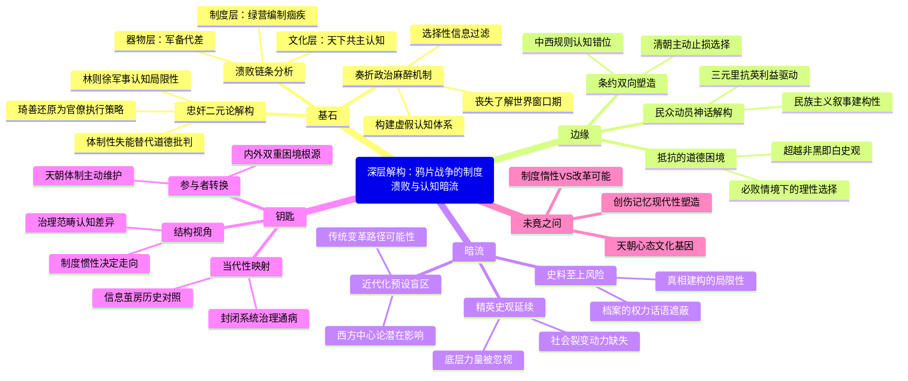

豆瓣链接：https://book.douban.com/subject/25935941/

# 深层解构

### 一、基石：被击碎的"天朝"幻象——制度性溃败的三重解剖
#### 1. 打破"忠奸二元论"的史学手术刀
茅海建的学术支点，在于用档案史料撕碎传统史观的道德滤镜。当琦善从"卖国贼"还原为执行清廷"抚夷"策略的官僚，当林则徐的"制敌方略"暴露为对西方军事认知的懵懂，作者揭示出：**鸦片战争的失败不是"奸臣误国"，而是整个官僚体系在现代国际规则前的集体失能**。这种解构极具颠覆性——传统史学习惯用道德批判简化复杂历史，而本书却将琦善、伊里布等人置于清廷"天朝体制"的惯性中观察，他们的决策本质是体制内的无奈选择，而非个人道德缺陷。

#### 2. "器物-制度-文化"的溃败链条
书中构建了清晰的分析框架：从虎门炮台"木船铁炮"的军备代差（器物层），到绿营"兵皆散处"的编制痼疾（制度层），再到道光帝"剿抚不定"背后的"天下共主"认知（文化层），层层递进揭示战败的必然性。特别值得关注的是，作者对"战争观"的文化分析——清朝将鸦片战争视为"化外蛮夷犯上"的局部冲突，而英国视为开拓市场的现代战争，**两种文明认知的错位，才是悲剧的真正开端**。

#### 3. "奏折政治"的自我麻醉机制
文档多次提到的"天朝心态"，集中体现在清廷对奏折的解读逻辑中。当林则徐用"英夷膝不能弯"的谣言强化"天朝上国"想象，当杨芳将战败归因于"夷人妖术"，作者指出：**官僚系统通过选择性呈报和扭曲事实，构建了一个让皇帝安心的虚假世界**。这种自我欺骗的机制，比军事落后更致命——它使清朝失去了主动了解世界的最后窗口期。

### 二、边缘：思想曲线的隐秘延伸——三个被轻拂的颠覆性命题
#### 1. 抵抗的道德正当性与政治理性的冲突
书中引述的"道德批判 vs 政治选择"之辩（如伊里布消极避战的讨论），实则触及现代国家的核心困境：**当抵抗注定失败时，是否应选择保全实力以图长远？** 这一命题挑战了传统史学"凡抵抗皆正义"的简单逻辑。茅海建虽未展开，但暗示了一个重要思考：近代中国的转型，需要超越非黑即白的道德判断，建立基于现实的政治理性。

#### 2. "民众动员"的神话与现实
三元里抗英的"史实与传说"一章，轻轻揭开了"人民战争"叙事的面纱。作者指出，民众的抵抗更多是基于乡土利益的自发行为，而非民族意识的自觉爆发。这一发现隐含着对近代民族主义叙事的反思：**所谓"全民抗敌"，可能是后世建构的历史神话，真实的基层反应往往更复杂、更功利**。这种对"人民性"的祛魅，为理解近代中国动员困境提供了新视角。

#### 3. "不平等条约"的双向塑造
书中在分析《南京条约》时，强调清朝官员对"协定关税""领事裁判权"的漠视，反因"免去跪拜礼"而如释重负。这一细节揭示出：**不平等条约不仅是西方强加的枷锁，也是清朝主动选择的"止损方案"**。这种双向互动视角，打破了"侵略-反抗"的单向叙事，暗示近代中国融入世界体系的复杂性——被动挨打中亦有主动适应的成分。

### 三、暗流：未被言说的历史假设——隐藏的思维河床
#### 1. "史料至上"的潜在风险
作者依赖中、英、日三国档案重构史实，却未审视史料本身的局限性：清朝奏折的"粉饰性"与英国文件的"殖民视角"，是否可能共同编织另一种"历史迷雾"？比如，琦善的"卖国罪名"是否被清廷刻意建构以推卸责任？这种对"客观史料"的信任，隐含着**"档案即真相"的史学浪漫主义**，忽视了史料背后的权力话语。

#### 2. "近代化叙事"的隐性预设
全书以"天朝崩溃"为隐喻，暗含"中国应走向近代化"的价值判断。但这一预设忽略了一个根本问题：**"近代化"是否等同于"西方化"？清朝是否有其他转型路径？** 当作者批判清廷拒绝接受国际规则时，可能无意中陷入了"西方中心论"的窠臼——这种视角让我们看到清朝的落后，却可能遮蔽传统文明内部的变革潜能。

#### 3. "精英史观"的无意识延续
尽管批判了官僚体系，但书中仍以琦善、林则徐、道光等精英人物为叙事主线，对底层民众的历史作用着墨甚少。这种"自上而下"的视角，延续了传统史学的精英主义倾向，**忽视了民众在历史进程中的真实力量——他们既是制度压迫的对象，也是变革的潜在载体**。这种视角局限，让我们难以看到鸦片战争后社会深层的裂变动力。

### 四、给读者的三把钥匙：穿透历史的三种视角
#### 1. 当"对错"退潮，看见"结构"
放下"谁该负责"的道德追问，聚焦制度如何塑造人的选择：为什么林则徐在广东能禁烟，却在浙江战败？因为前者是传统治理范畴内的"治安问题"，后者是超出清廷认知的"现代战争"。**制度的惯性，比个人的能力更能决定历史走向**。

#### 2. 从"受害者"到"参与者"的认知转换
不要只将清朝视为西方侵略的受害者，更要看到其作为"天朝体制"的主动维护者：拒绝平等外交、固守朝贡体系、压制内部改革声音。**近代中国的困境，既是外部冲击的结果，更是内部体制自我锁死的必然**。这种双重身份认知，能让我们更理性地看待历史遗产。

#### 3. 用"当代性"激活"历史性"
书中对"奏折政治""信息茧房"的剖析，分明照见现代社会的影子：当数据可以被筛选、当真相需要层层过滤，权力体系如何避免陷入自我欺骗？茅海建的批判不仅指向1840年的清朝，更叩问着所有封闭系统的治理困境。**读史的终极意义，在于在过去的镜子里看见现在的我们**。

### 五、作者的未竟之问：等待读者续写的思想拼图
茅海建用严谨的考证破除了旧史观的迷障，但留下了三个开放性命题：
- **如果清朝主动改革，能否避免崩溃？** 书中强调制度惰性，但未探讨改革的可能性——比如，林则徐若掌握实权，能否推动军事近代化？
- **"天朝心态"的文化根源何在？** 儒家天下观如何演变为封闭的体制自信？这种文化基因在当代是否仍有遗存？
- **鸦片战争的"创伤记忆"如何塑造中国现代性？** 书中提到"百年国耻"的精神创伤，但未展开这种集体记忆对中国现代化路径的复杂影响。

这些未解之谜，正是阅读的真正魅力——**伟大的历史著作从不提供答案，而是激发更深刻的提问**。当你合上书页时，或许会突然意识到：我们仍在处理1840年留下的历史遗产，而理解过去的方式，正在塑造着未来的方向。

# 章节内容
### 自序
作者阐述写作目的，通过对鸦片战争深入研究，反思历史。他运用丰富史料，以严谨态度重建史实，探讨战败原因，力求客观公正评价历史人物与事件，避免道德评判，从事实出发，引发读者对这段历史及背后深层问题的思考，展现历史研究的价值与意义。

### 绪论：由琦善卖国而想到的
1. **琦善其人**：介绍琦善生平经历与政治地位。
2. **琦善卖国罪名之否定**：依据史实分析，琦善在鸦片战争中的表现不能简单归结为卖国，其外交策略受多种因素制约，如对局势判断、道光帝指示等，应从当时情境客观看待其行为。
3. **琦善卖国说形成的原因**：探讨该说法形成背后复杂因素，包括政治需要、传统观念影响及历史研究局限等，这种简单定性反映当时人们对战争失败的片面认知与情感倾向。
4. **本书的主旨**：强调从事实出发研究鸦片战争，深入剖析战争各方面因素，揭示战败深层原因，避免简单道德评判，为正确认识历史提供依据。

### 第一章：清朝的军事力量
1. **武器装备**：对比中英双方，清朝武器落后，枪炮技术陈旧、质量差、弹药不足，海防炮台等防御工事也存在诸多问题，与英军差距明显。
2. **兵力与编制**：阐述清朝军队编制复杂、分散，绿营兵为主，兵额虽多但分散各地，难以集中优势兵力应对战争，且调兵速度慢、效率低。
3. **士兵与军官**：士兵待遇差、素质低、缺乏训练，军官选拔晋升制度不合理，导致军官队伍整体素质不高，军事指挥能力有限，影响军队战斗力。

### 第二章：骤然而至的战争
1. **从严禁吸食到严禁海口**：讲述清政府禁烟政策变化过程，早期对鸦片危害认识不足，后因形势严峻，政策从禁止吸食转向禁止海口贸易，但在执行中面临诸多困难与挑战。
2. **林则徐的禁烟活动及其评论**：详细介绍林则徐虎门销烟等禁烟活动，肯定其坚决禁烟决心与行动，同时分析其在禁烟过程中对国际形势判断及应对策略的局限性。
3. **林则徐的敌情判断**：探讨林则徐对英国情况的认识，虽有一定了解但存在偏差，低估英国军事力量与战争决心，对国际规则和外交手段认识不足，影响其后续应对策略。
4. **林则徐的制敌方略**：阐述林则徐以守为战、加强防御等制敌方略，虽有积极意义，但受当时条件制约，在面对英军强大攻势时难以有效抵御，反映清朝在军事战略上的被动与困境。

### 第三章：“剿”“抚”“剿”的回旋
1. **初战**：描述中英双方初次交战情况，清军因武器装备、战术指挥等劣势遭受失败，显示出双方军事力量差距，影响清政府对战争局势判断与应对策略选择。
2. **“剿”“抚”之变**：分析清政府在战争中“剿”“抚”策略的反复变化，受战争胜负、内部政治斗争、对英认识不足等因素影响，导致决策摇摆不定，军事行动缺乏连贯性。
3. **伊里布与浙江停战**：讲述伊里布在浙江战场的表现，他消极避战，与英军达成停战协议，其行为受多种因素影响，反映清政府内部在战争应对上的分歧与矛盾。
4. **琦善与广东谈判**：阐述琦善在广东与英军谈判过程，他在道光帝指示下试图通过谈判解决争端，但因双方立场差距大、清政府对国际形势无知等，谈判陷入僵局，最终失败。
5. **虎门大战**：详述虎门大战经过，清军虽英勇抵抗，但因军事力量悬殊，防线最终被突破，关天培等将领战死，标志着清军在广东战场重大失败，进一步暴露清朝军事体制与战略的弊端。

### 第四章：广州的“战局”
1. **杨芳的“果勇”**：讲述杨芳在广州的表现，他虽有一定军事经验，但在面对英军时采取迷信等不切实际方法，反映当时清军将领在军事观念上的落后与无奈。
2. **奕山的“靖逆”**：描述奕山指挥广州战事情况，他盲目进攻英军失败后，却谎报军情、签订屈辱停战协议，为保自身利益牺牲国家利益，体现清政府官员腐败与无能。
3. **三元里抗英的史实与传说**：区分三元里抗英的史实与传说部分，肯定民众自发抗英勇气与爱国精神，但也指出其在当时战争局势中作用有限，受多种因素制约，同时分析相关传说形成与传播原因及影响。

### 第五章：东南壁垒的倾塌
1. **璞鼎查的东来**：介绍璞鼎查接替义律成为英军侵华全权代表，他改变策略，扩大战争规模，率军北上进攻东南沿海地区，给清军带来更大压力。
2. **厦门的石壁**：讲述厦门之战，清军虽有坚固石壁防御工事，但在英军先进火炮攻击下迅速溃败，说明清朝防御体系在面对近代化军事力量时不堪一击。
3. **定海的土城**：描述定海之战，清军加强防御建设，但仍无法抵挡英军进攻，定海再次失陷，暴露清军在军事技术、战略战术及军队协同作战等方面严重不足。
4. **镇海的天险**：阐述镇海之战，清军凭借天险防守，但因指挥混乱、兵力分散等原因战败，镇海失守，使浙江沿海局势更加严峻，清军防线全面崩溃。
5. **浙东的反攻**：讲述清军组织浙东反攻却遭惨败，进一步证明清军战斗力低下、战略决策失误，清政府在军事上已陷入全面被动局面。

### 第六章：“抚”议再起
1. **“十可虑”**：分析刘韵珂提出“十可虑”奏议，指出清政府面临内忧外患严峻形势，战争已使国家财政困难、社会动荡不安，反映清政府在战争泥潭中越陷越深，对局势感到绝望。
2. **屡战屡败：从杭州湾到扬子江**：讲述英军继续进攻，清军在杭州湾、扬子江沿线连续战败，重要城市和地区相继失守，清政府已无力组织有效抵抗，只能寻求求和途径。
3. **求和的历程**：阐述清政府求和过程，从最初犹豫到被迫接受屈辱条件，派耆英、伊里布等与英军谈判，期间经历诸多波折，反映清政府在外交上的软弱与无奈，最终签订不平等条约。

### 第七章：平等与不平等
1. **中英南京条约及其引起的忧虑**：分析中英《南京条约》主要内容及影响，条约割地、赔款、开放通商口岸等条款严重损害中国主权，虽有部分人意识到不平等性，但清政府因战败无奈接受，引发对国家命运的忧虑。
2. **迈入陷阱：中英虎门条约**：讲述《虎门条约》签订情况，英国借此获取更多特权，如领事裁判权、片面最惠国待遇等，使中国在外交和司法上进一步陷入被动，为西方列强进一步侵略打开方便之门。
3. **“等价交换”？中美望厦条约**：阐述中美《望厦条约》签订过程与内容，美国通过该条约获得更多在华权益，且在某些方面扩大对中国侵略，所谓“等价交换”实则是美国对中国不平等掠夺，进一步破坏中国主权与利益。
4. **“奉献”：中法黄埔条约**：讲述中法《黄埔条约》签订，法国迫使清政府给予传教等特权，西方列强通过一系列不平等条约逐步控制中国经济、政治、外交等方面，使中国沦为半殖民地半封建社会。

### 第八章：历史的诉说
作者在这一章深入探讨了鸦片战争对中国近代历史的深远影响，以及从这场战争中应汲取的教训。他指出，鸦片战争不仅暴露了清朝军事、政治、经济等方面的落后，更揭示了传统观念和体制的弊端。通过对历史人物和事件的分析，强调应从客观事实出发看待历史，避免简单的道德评判，同时呼吁人们重视历史研究，以史为鉴，防止重蹈覆辙，思考中国在近代化进程中的发展方向与变革需求。

### 附录
附录部分包含了参考文献、人名地名索引等内容，为读者进一步研究提供了资料来源和检索便利，有助于读者深入探究书中涉及的历史事件、人物及相关学术问题，体现了本书学术研究的严谨性和规范性，也方便读者对书中内容进行拓展阅读和深入思考。