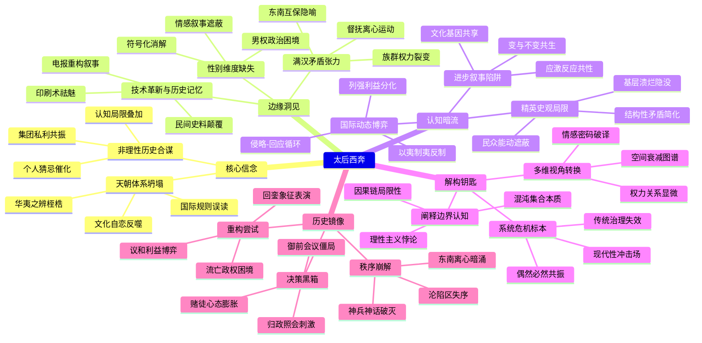

豆瓣链接：https://book.douban.com/subject/36463589/

# 深层解构

### 《太后西奔》深层解码：帝国黄昏的三重镜像

#### **一、基石：作者反复回归的核心信念**  
**1. 历史是非理性的合谋：偶然撬动必然的杠杆**  
作者以慈禧西狩为切口，撕开“理性决策主导历史”的幻象。书中揭示：庚子事变的爆发并非单纯的“反帝爱国”或“保守势力反扑”，而是慈禧个人对光绪的猜忌（戊戌政变后遗症）、保守派为保权位的“挟洋自重”、士大夫对国际规则的无知（如误判列强对废帝的态度）等多重非理性因素的共振。  
**例证**：1899年易储风波中，保守派为阻止光绪复位，不惜利用义和团“刀枪不入”的迷信对抗洋人，这种决策本质是**权力焦虑驱动的赌徒心态**，而非基于现实的战略选择。作者借此挑战“历史必然性”叙事，强调**个体认知局限与集团私利如何共同推演出家国悲剧**。

**2. 天朝体系的慢性死亡：传统秩序的结构性坍塌**  
书中隐含对“天下观”的解剖：中华帝国以“华夷之辨”构建的文化自恋，在全球化冲击下成为致命枷锁。当慈禧将列强视为“化外蛮夷”，试图用“量中华之物力，结与国之欢心”维持体面时，实则暴露了天朝体系在现代国际秩序前的**认知鸿沟**。  
**原文伏笔**：终章提到“天下观念在15世纪前尚可自洽，18世纪后在东亚圈内勉强维持”，暗示这种观念体系的**时间局限性**，而庚子事变正是其遭遇现代性碾压的集中爆发。

#### **二、边缘：被轻拂而过的改变性洞见**  
**1. 技术革新重塑历史记忆：印刷术与电报的“祛魅”作用**  
作者提到“清末印刷技术普及和电报使用，催生大量笔记、日记、报刊时文”，这些新材料打破了官方史书的垄断。但这一洞见仅作为研究方法被提及，未深入探讨：  
- 民间史料如何解构“西狩=西巡”的官方叙事？  
- 电报的即时性是否加剧了决策层的信息误判（如谎报军情）？  
**延伸思考**：技术不仅是记录工具，更是历史进程的参与者——它让权力运作从“密室政治”走向“舆论监督”，加速了清廷合法性的流失。

**2. 满汉矛盾的隐形脉络：被政治叙事遮蔽的族群张力**  
书中多次提到“满汉提防”，如荣禄对汉人官僚的猜忌、东南互保中汉族督抚的自主决策，但仅作为背景存在。事实上，庚子事变中满族亲贵（如端王载漪）的激进与汉族官员（如李鸿章、张之洞）的保守，折射出**清廷内部族群权力结构的深刻裂痕**。这种矛盾未被系统分析，却悄然决定了事变的走向（如东南互保的实质是汉族官僚对满族中央的消极抵抗）。

**3. 女性视角的缺席：慈禧作为个体的历史重量**  
作者将慈禧定位为“权力动物”，却忽略其作为女性在男权政治中的特殊困境。戊戌政变后她对光绪的控制，是否掺杂着“姨母”对“养子”的复杂情感？西狩途中的狼狈，如何被男性史官转化为“天子蒙尘”的叙事？**性别维度的缺失**，让慈禧沦为符号化的“独裁者”，而错失理解传统政治中女性掌权者的生存逻辑。

#### **三、暗流：未被审视的论证前提**  
**1. 精英史观的默认框架：谁的“仓皇与激荡”？**  
全书聚焦宫廷权谋、士大夫博弈，却鲜见底层民众的真实图景。义和团被描述为“失业者与迷信者的聚合”，但未深究他们为何甘愿成为权力博弈的炮灰：  
- 华北农民对教会特权的真实怨恨如何被激化？  
- 教案背后的土地兼并、基层治理失效等结构性矛盾是否被简化？  
**隐含假设**：历史是精英的舞台，民众只是被动的“背景板”。这种视角便利了叙事的集中性，却模糊了帝国崩溃的真正根基——**基层治理的溃烂与民心向背**。

**2. 进步史观的潜在预设：“开明-保守”二元对立的陷阱**  
作者批判传统史学将庚子事变归咎于“保守派误国”，但自身仍沿用“开明（如光绪、维新派）-保守（如慈禧、顽固派）”的二分法。事实上：  
- 光绪的“开明”是否夹杂着对权力的渴望？  
- 保守派的“守旧”是否包含对传统秩序崩坏的恐惧？  
**思维盲点**：晚清的“变”与“不变”并非简单的价值观对抗，而是农业文明与工业文明碰撞时的集体应激反应。这种二元对立简化了转型期的复杂性，忽视了改革者与保守者共享的文化基因（如对皇权的忠诚）。

**3. 国际秩序的“他者”视角：西方列强的主动性与被动性**  
书中强调“国际因素首次深度介入内政”，但默认列强是“主动侵略者”，而清廷是“被动应对者”。事实上：  
- 列强在华利益的复杂性（如英日与俄德的矛盾）是否被简化？  
- 清廷“以夷制夷”策略（如利用义和团牵制列强）如何反制了列强的决策？  
**未言前提**：国际政治是动态博弈场，清廷的每一次非理性决策（如对十一国宣战），本质上也是对列强压力的主动回应，而非单纯的“被侵略”。

#### **四、给读者的三把钥匙**  
**1. 原来这本书真正在说……**  
表面是“西狩”事件的考据，实则是**帝国晚期系统性危机的解剖标本**：当传统治理体系无法应对现代性挑战，当权力核心被个人恩怨与集团私利绑架，任何偶然事件都可能成为压垮骆驼的最后一根稻草。

**2. 如果换个角度看……**  
- **从空间史切入**：西狩路线图（北京-太原-西安）不仅是逃亡轨迹，更是清廷权威从核心向边缘衰减的缩影，沿途“官不聊生”的细节，暴露了帝国行政网络的瘫痪。  
- **从情感史切入**：光绪在西狩途中的沉默、慈禧对李鸿章的复杂依赖，这些被史书略过的微妙情绪，或许藏着权力关系的真实密码。

**3. 作者可能没意识到……**  
书中对“理性决策”的批判，本身陷入了另一种理性主义——试图用“多重因素分析”穷尽历史的因果链。但历史的本质，恰是无数非理性瞬间的混沌集合，任何解读都是“盲人摸象”式的逼近。承认这种局限性，或许更接近真相。

#### **结语：在仓皇中看见必然**  
《太后西奔》的价值，不在于提供“正确的历史解释”，而在于撕开“宏大叙事”的帷幕，让读者看见：在帝国崩塌的巨响背后，是无数微小的、非理性的、充满个人色彩的选择在共振。这些选择看似偶然，却共同指向一个必然——当旧秩序拒绝自我更新，任何个体的挣扎都将成为历史巨轮下的注脚。而我们今天重读这段历史，或许该思考的不是“谁对谁错”，而是：在时代的剧变前，如何避免让个人或集团的私利，绑架整个文明的命运。

# 章节内容
### 楔子：立储
19 世纪末，戊戌变法失败后，朝中局势发生重大变化。慈禧太后与光绪皇帝之间的矛盾因变法期间康有为鼓动的“围园杀后”事件进一步激化，虽此事细节宫闱秘而不宣，但光绪被囚于瀛台，失去人身自由，六君子匆忙被处斩于菜市口，已显示出母子间的心结已深至难以调和。慈禧大力打压朝中如康有为、梁启超等开明势力，守旧派如刚毅、徐桐等重新得势，朝堂之上风气大变。为防太后死后光绪清算，1899 年出现易储风波，立端郡王载漪之子溥儁为大阿哥，欲取代光绪。此举在朝中引起极大分歧，如孙家鼐等重臣坚决反对，认为此举违背祖制，且光绪并无大错。但慈禧执意推行，这一事件反映出晚清宫廷内部权力斗争的复杂与激烈，各方势力围绕皇位继承展开博弈，也为后续庚子事变埋下了深深的隐患，使得中外矛盾与国内宫廷矛盾相互交织，局势愈发扑朔迷离。

### 第一部：山雨欲来风满楼
 - **潜流**：戊戌变法失败后，保守派掌控朝政，他们排斥西方事物，外交上无知且盲目排外情绪浓厚。民间宗教因素也开始抬头，义和团在山东、直隶等地逐渐蔓延。义和团最初以练习拳术、宣扬“刀枪不入”等吸引民众，其成员多为农民、手工业者等底层民众，他们因长期遭受外国侵略、教会势力压迫以及国内社会矛盾激化等因素，对外国人和外国事物充满仇恨。而国际上，列强对中国的侵略野心不断膨胀，通过划分势力范围、经济掠夺等手段进一步加剧中国的半殖民地化程度，中外矛盾在这种情况下不断积累，为后续动荡埋下了伏笔。
 - **再起波澜**：慈禧等保守派与光绪皇帝矛盾未解，慈禧一方面继续打压光绪及其支持者，另一方面在国际形势面前应对失策。例如在处理教案等涉外事件时，清政府往往偏袒守旧势力，导致与列强关系愈发紧张。同时，国内经济凋敝，百姓生活困苦，各种社会矛盾一触即发，各方势力在这种复杂的局势下暗中角力，都在寻求自身利益的最大化，而整个国家却在风雨飘摇中逐渐走向危机边缘。
 - **折衷**：面对复杂局势，朝中部分官员试图在保守派与维新派之间寻求平衡，在一些政策上进行折衷处理。例如在对待西方技术和文化方面，既不敢完全接纳，也不能彻底拒绝。然而，这种折衷并未能从根本上解决问题，中外矛盾依然在持续激化，国内社会矛盾也因未能得到有效缓解而不断加深，清政府就像一艘在暴风雨中失去航向的大船，随时可能被汹涌的波涛吞没。
 - **反对者经元善**：经元善公开反对废立之事，他联合上海各界人士致电清廷，指出废立之举将引发国内国际的强烈反应，不利于国家稳定。经元善的行为展现出部分有识之士在重大国家事件上的担当与勇气，他不顾自身安危，敢于站出来表达不同意见，这在当时慈禧太后专权、保守势力当道的政治环境中显得格外突出。同时也体现出朝局并非完全被保守派掌控，仍有不同声音存在，这些声音虽然微弱，但却反映出社会中还有一股正义与理性的力量在努力抗争。
 - **谁是义和拳**：义和团成分复杂，其兴起与多种因素相关。当时北方地区干旱严重，农业收成锐减，大量农民失去生计，成为义和团发展的潜在力量。同时，外国教会势力在中国肆意扩张，与当地民众产生诸多利益冲突，例如教会强占土地、干涉司法等，引发民众强烈不满。一些失业民众、民间秘密宗教团体成员等纷纷加入义和团，他们以“扶清灭洋”为口号，在山东、直隶等地迅速壮大，引起了各方的广泛关注。清政府对义和团的态度起初摇摆不定，既想利用其对抗列强，又担心其难以控制，这种态度也使得义和团的发展趋势成为影响局势走向的重要因素。
 - **有意无意的误会**：中外之间在交流、认知等方面存在诸多误会。西方列强凭借强大的军事和经济实力，妄图在中国获取更多利益，他们往往以高高在上的姿态对待清政府，不尊重中国的文化和传统。而清政府对西方列强的政治制度、外交理念等缺乏深入了解，在处理外交事务时常常出现误解和误判。例如，在一些外交礼仪和外交文书的往来中，双方因文化差异产生摩擦。这些误会不断加深彼此间的矛盾，使得原本就紧张的中外关系愈发剑拔弩张，为冲突的爆发提供了温床。
 - **康有为这个冤家**：康有为在海外积极活动，他组织保皇会，宣扬光绪皇帝的正统性，反对慈禧太后的专权统治。他在海外华人社区中具有一定影响力，通过演讲、著书等方式传播自己的政治主张，试图争取国际舆论对光绪皇帝的支持，从而给慈禧太后和清政府施加压力。他的思想和行为，持续搅动晚清政局，使得国内政治斗争延伸到国际舞台，也让清政府在处理国内外事务时更加棘手。
 - **卜克斯之死**：英国传教士卜克斯被杀事件，成为庚子事变爆发的导火索之一。当时义和团运动在山东、直隶等地蓬勃发展，民众对外国传教士的反感和仇恨情绪高涨。卜克斯在这种紧张的局势下不幸遭遇义和团成员，最终被杀。外国势力以此为借口，对清政府施压，要求清政府严厉镇压义和团，并提出一系列苛刻的条件。清政府在处理这一事件时陷入两难境地，一方面要应对列强的压力，另一方面又要考虑国内民众的情绪和义和团的力量，这进一步激化了中外矛盾。
 - **大师兄进北京**：义和团势力进入北京后，局势更加混乱。义和团成员在京城内四处活动，他们张贴标语、焚烧教堂、攻击外国使馆人员等。清政府对义和团的态度依然摇摆不定，慈禧太后起初认为义和团或许可以成为对抗列强的一股力量，因此对其行为有所纵容。而义和团则凭借这种模糊的态度，在京城内迅速扩张，其行为逐渐失控，不仅与外国势力冲突不断升级，还与清军以及普通市民产生了诸多矛盾，预示着更大危机即将来临。
 - **火候渐熟矣**：经过一系列事件的发展，各种矛盾不断积累，庚子事变的爆发已如箭在弦上。国内民众对外国侵略的愤怒情绪达到顶点，义和团运动席卷北方多地；清政府内部在对待列强和义和团的问题上分歧严重，无法形成统一有效的应对策略；列强则不断向清政府施压，准备以武力手段进一步扩大在中国的权益。社会动荡一触即发，整个国家陷入了前所未有的危机之中。

### 第二部：闻道长安似弈棋
 - **第一次御前会议**：会议上官员们各抒己见，讨论局势应对之策。载漪等保守派主张利用义和团对抗列强，他们认为义和团“民心可用”，可以借此机会驱逐外国势力。而荣禄等一些较为理智的官员则深知义和团的战斗力有限，且与列强开战风险巨大，主张采取安抚列强、镇压义和团的策略。然而，各方利益难以协调，会议未能达成明确的决策，反映出清政府内部在面对危机时的混乱与迷茫。慈禧太后在会上也犹豫不决，她既想维护自己的统治权威，又担心与列强开战会导致不可收拾的局面，这种矛盾心理使得清政府在危机初期就陷入了决策困境。
 - **第二次御前会议**：会议继续商讨应对之策，但依然未能达成共识。慈禧太后在会上情绪激动，她对列强的干涉和国内局势的失控感到愤怒和无奈。一些官员提出的建议被轻易否决，而慈禧太后自己也没有明确的方向。清政府在决策过程中的犹豫不决，使得局势愈发难以控制。列强则在一旁虎视眈眈，不断增兵中国沿海地区，准备随时发动进攻。中外矛盾进一步激化，战争的阴云已经笼罩在整个国家上空。
 - **归政照会**：慈禧收到归政照会（真假未明），这一事件极大刺激了慈禧。据传闻，照会要求慈禧归政于光绪皇帝，这触动了慈禧的敏感神经，她认为这是列强对自己统治地位的公然挑战。慈禧太后一直以来将权力视为生命，归政意味着她将失去一切。在这种情况下，她决定孤注一掷，不顾后果地向列强宣战。这一决策虽看似冲动，但也反映出清政府在长期积怨与多种压力下的无奈之举，同时也体现出其对局势判断的严重失误。清政府没有充分认识到自身与列强之间的巨大实力差距，也没有考虑到战争可能带来的灾难性后果。
 - **决裂**：清政府最终决定与列强决裂，向多国宣战。慈禧太后颁布诏书，号召全国军民抵抗外敌。然而，这一宣战诏书并未经过深思熟虑，清政府也没有做好战争的充分准备。清军装备落后、训练不足，军队指挥系统混乱，而义和团虽然人数众多，但缺乏有效的组织和纪律。相比之下，列强则拥有先进的武器装备、训练有素的军队以及完善的军事指挥体系。双方实力悬殊，清政府的这一决策无疑是将国家推向了战争的深渊，也使得庚子事变全面爆发，中国陷入了一场巨大的灾难之中。
 - **克林德之死**：德国公使克林德被杀，引发国际轩然大波。当时京城局势混乱，义和团与清军在城内与外国使馆人员冲突不断。克林德在前往总理衙门交涉的途中，被清军士兵击毙。这一事件成为列强扩大侵略战争的重要借口，他们以此为契机，组成八国联军，加大对中国的侵略力度。清政府在国际上陷入更加孤立的境地，各国纷纷谴责清政府的行为，要求严惩凶手，并提出了更为苛刻的议和条件。克林德之死使得庚子事变的严重性进一步升级，中国面临着前所未有的外部压力。
 - **围攻东交民巷**：义和团和清军围攻东交民巷使馆区，战斗激烈，双方僵持不下。义和团成员怀着对外国侵略者的仇恨，奋勇进攻使馆区，但由于使馆区防御工事坚固，且列强凭借先进武器进行顽强抵抗，围攻行动进展缓慢。清军在围攻过程中也表现出指挥不力、作战不积极等问题。这一行动使中外矛盾达到顶点，清政府的这一决策不仅未能解决问题，反而使局势更加复杂。国际社会对清政府的行为表示强烈谴责，认为这是对国际外交准则的公然践踏，进一步加剧了清政府在国际上的孤立地位。
 - **神兵遍京城**：义和团在京城活动频繁，号称“神兵”。他们身着奇装异服，手持各种简陋武器，在京城内四处游荡，宣扬“刀枪不入”的神话。然而，在实际战斗中，他们的战斗力有限，面对列强的枪炮，往往死伤惨重。义和团的行为逐渐失控，他们不仅攻击外国使馆和教堂，还对普通市民进行骚扰和抢劫，扰乱了京城社会秩序。清政府对义和团的管理和利用失败，起初对义和团的纵容使得其势力膨胀，而当发现问题时，又难以对其进行有效控制，进一步加剧了社会的混乱局面。
 - **东南互保**：东南各省督抚与列强达成“东南互保”协议，不参与战争，保持地方稳定。以两江总督刘坤一、湖广总督张之洞等为代表的东南督抚，深知与列强开战的后果不堪设想。他们在英国等列强的支持下，与各国达成协议，承诺保护外国在华利益，换取列强不入侵东南地区。这一事件反映出地方势力在晚清政治格局中的自主性增强，中央政府对地方的控制减弱。东南地区在经济上较为发达，地方督抚们不愿意看到自己的辖区因战争而遭受破坏。“东南互保”虽然在一定程度上维持了地方稳定，但也引发了一些内部矛盾和争议，它显示出清政府在应对危机时的无力与分裂，国家在面临外敌入侵时未能形成统一的抵抗力量。
 - **斩首**：清军在战斗中失利，一些官员被斩首。清政府在战争失利后，为了平息列强的愤怒，开始追究责任。一些在战争中表现不佳或被认为与义和团有牵连的官员成为替罪羊，如裕禄等。清政府内部出现互相推诿责任的情况，军队战斗力低下，指挥混乱，无法有效应对列强侵略，统治阶层内部矛盾也在危机中暴露无遗。这种内部的混乱和矛盾进一步削弱了清政府的统治力量，使得国家在战争中更加难以自拔。
 - **北京没有保卫战**：北京最终未能组织起有效的保卫战。八国联军凭借先进的武器装备和军事战术，轻易突破了清军的防线，进入京城。慈禧太后携光绪等仓皇出逃，清政府在军事上的失败宣告了其应对庚子事变的全面溃败。清军在战争中表现出的软弱和无能，反映出清政府在军事改革方面的失败。长期以来，清政府对军事现代化重视不足，军队训练、装备更新等方面滞后于时代发展。北京的沦陷也标志着中国社会面临更深重的危机，国家主权遭受严重践踏，人民生命财产遭受巨大损失。

### 第三部：最是仓皇辞庙日
 - **出宫**：慈禧太后、光绪皇帝等在八国联军逼近北京时匆忙出宫，开始西逃之旅。出宫时场面混乱，慈禧太后和光绪皇帝仅携带少量随从和物品，在夜色中仓皇逃离紫禁城。他们一路向西，途径颐和园等地，沿途百姓惊愕不已。这一过程狼狈不堪，显示出清政府在战争面前的脆弱与慌乱，曾经高高在上的统治者如今如同丧家之犬。也象征着其统治权威的急剧衰落，失去了对京城乃至整个国家的有效控制，国家陷入了无政府状态，百姓在战乱中只能自生自灭。
 - **逃亡**：西逃途中，慈禧一行历经艰辛。道路崎岖难行，交通工具简陋，常常只能乘坐马车或步行。物资匮乏，沿途百姓生活困苦，难以提供足够的食物和住宿。慈禧太后等人不得不忍受饥饿、寒冷和疲劳。随行人员众多，包括皇室成员、官员、太监、宫女等，队伍庞大且秩序混乱，时常发生争吵和抢夺物资的情况。这反映出当时社会的动荡不安以及清政府在紧急情况下组织和保障能力的缺失，逃亡过程中不仅给慈禧太后等人带来了巨大的痛苦，也给沿途百姓带来了沉重的负担，百姓的生活因战乱和皇室逃亡而陷入绝境。
 - **官不聊生**：在逃亡过程中，官员们也面临诸多困境。他们不仅要应对各种突发情况，如寻找食物、安排住宿、保护皇室安全等，还要承受慈禧太后的不满和问责。一些官员因办事不力或被怀疑有不忠行为而受到惩处，官场秩序混乱。例如，怀来县知县吴永因接待慈禧太后有功而得到提拔，但也有许多官员在逃亡途中被革职或降职。官员们的命运也随着局势的变化而飘摇不定，他们在这种混乱的局势下难以施展自己的才能，只能在惶恐中求生，清政府的行政体系在逃亡过程中几近瘫痪。
 - **命若草芥**：普通百姓在战乱中更是命如草芥。八国联军在北京及周边地区烧杀抢掠，无恶不作。许多村庄被烧毁，百姓惨遭屠杀，妇女被强奸，财产被洗劫一空。百姓们四处逃亡，却无处可依，生命和财产得不到任何保障。社会秩序完全崩溃，百姓生活陷入绝境。例如，在廊坊、杨村等地，八国联军的暴行令人发指，无数家庭支离破碎。这体现出战争给普通民众带来的巨大灾难，他们成为了清政府与列强矛盾冲突的最大受害者，也反映出当时中国社会的黑暗与悲惨。
 - **沦陷区秩序**：北京等沦陷区社会秩序混乱不堪。八国联军进入北京后，划分占领区，对北京进行了残酷的统治。他们肆意抢夺文物古迹、珍宝财物，故宫、颐和园等皇家宫殿和园林遭到严重破坏。清政府的统治机构瘫痪，官员们纷纷逃亡，地方治安无人维护，流氓、盗贼横行。外国侵略者在中国土地上肆意妄为，给中国人民带来了沉重的伤痛，也使得中国的文化遗产遭受了难以估量的损失，这一时期成为中国近代史上最为黑暗的篇章之一。
 - **东南并不平静**：东南地区虽未直接参与战争，但因局势影响，也面临诸多问题。经济上，由于战争导致对外贸易受阻，许多工厂停工，商业活动停滞，经济陷入衰退。社会方面，因大量难民涌入，社会治安恶化，物价飞涨。“东南互保”虽维持了地方稳定，但也引发了一些内部矛盾和争议。例如，地方督抚与清政府中央之间在权力分配、财政收支等方面存在分歧。地方势力在应对危机时也面临诸多挑战，他们既要维护地方利益，又要在一定程度上遵循清政府的旨意，在这种复杂的局势下艰难维持着东南地区的稳定与发展。
 - **“国人望李傅相如望岁”**：李鸿章在当时被国人寄予厚望，希望他能在外交上挽救危局。李鸿章是晚清著名的外交家，他曾参与多次对外交涉，如签订《马关条约》等，虽然这些条约多为不平等条约，但他在国际上具有一定的知名度和影响力。在庚子事变后，国人认为他能够凭借自己的外交经验和智慧，与列强进行谈判，减少中国的损失。这反映出李鸿章在晚清外交中的重要地位以及国人对解决危机的迫切期望，然而李鸿章也深知此次外交任务的艰巨性，他在复杂的局势下承担着巨大的外交压力，面临着列强的强硬态度和国内民众的殷切期望，处境十分艰难。
 - **清官刚毅之死**：刚毅在逃亡途中染病身亡。刚毅是保守派的代表人物之一，他在戊戌变法期间坚决反对变法，支持慈禧太后的守旧政策。在庚子事变中，他积极主张利用义和团对抗列强，对局势的恶化负有一定责任。他的死亡对晚清政治格局产生一定影响，随着他的去世，保守派在政治舞台上失去了一位重要人物，其势力也受到一定削弱。同时也反映出这场事变对清政府内部人事结构的冲击，许多与事变相关的官员命运发生了巨大变化，清政府内部的权力平衡被打破，面临着重新调整和整合的局面。

### 第四部：残局
 - **议和班底**：清政府为议和组建班底，开始与列强进行谈判。李鸿章被任命为全权议和大臣，庆亲王奕劻等也参与其中。李鸿章深知此次议和任务的艰巨性，他面对的是八国联军的强大压力和列强的苛刻要求。谈判过程艰难，双方在诸多问题上存在巨大分歧。清政府处于弱势地位，不得不接受列强的各种指责和漫天要价。例如在谈判初期，列强要求清政府严惩所有与义和团有牵连的官员，包括一些地方督抚和高级将领，同时还提出巨额赔款、军事占领等要求，李鸿章等议和代表虽极力周旋，但在强大的军事压力下，回旋余地极小。
 - **第一次握手**：议和代表与列强代表开始接触，双方初步试探底线，但进展缓慢。李鸿章等试图在谈判中为清政府争取一些有利条件，如减少赔款数额、缩短军事占领期限等，但列强态度强硬，丝毫不肯让步。首次会面中，双方在礼仪和谈判程序上就存在诸多争议，列强代表以胜利者的姿态高高在上，对清政府代表多有刁难。这显示出中外在解决庚子事变问题上的巨大差距和复杂矛盾，清政府试图在谈判中维护自身利益，但面临重重困难，外交上的被动局面展露无遗。
 - **且问西东**：谈判中双方就责任认定、赔偿等问题进行激烈争论。列强将庚子事变的全部责任归咎于清政府，要求清政府承担巨额赔款以弥补列强的“损失”，包括军费、侨民伤亡赔偿等。赔款数额之巨大，远远超出了清政府的财政承受能力。同时，列强还要求清政府进行政治改革，如改革官制、加强对国内民众的控制等，企图进一步干涉中国内政。清政府虽不情愿，但在列强的武力威胁下，只能步步退让，中国在外交上的弱势地位尽显，也反映出清政府对国际形势和外交规则的懵懂无知，在谈判中处于极为不利的境地。
 - **到西安**：慈禧太后一行抵达西安，在西安继续遥控议和进程。西安成为临时的政治中心，但条件简陋，物资供应紧张。慈禧太后一方面关注议和进展，希望能尽量减少损失；另一方面也在西安进行一些政治活动，如接见地方官员、调整人事安排等，试图稳定国内局势。然而，此时的清政府已元气大伤，面临诸多内部和外部问题。财政上因战争赔款和战争破坏而极度困难，地方治理也因战乱而陷入混乱，各地治安不佳，民变时有发生，清政府在西安的流亡政府在艰难中维持运转，国家的命运依然飘摇不定。
 - **瓦德西与吴克托**：瓦德西担任八国联军统帅，他与清政府代表吴克托在谈判中交锋。瓦德西代表列强提出严厉要求，如扩大军事占领范围、增加赔款数额等，态度傲慢且坚决。吴克托虽据理力争，但因清政府的弱势地位，难以取得实质性进展。谈判陷入僵局，双方在利益诉求上的巨大差异难以调和。瓦德西的强硬态度反映出列强企图通过此次事变彻底控制中国的野心，而清政府则在尽力避免国家主权的进一步丧失，然而在实力悬殊的情况下，这种抗争显得极为艰难。
 - **红十字旗飘扬在北方上空**：红十字会等国际组织在北方开展救援活动，一定程度上缓解了战争带来的人道灾难。他们为难民提供食物、医疗救助等，在战火纷飞的北方地区成为一抹人道的亮色。但这也显示出中国在战争中的被动和依赖国际援助的局面，国家主权受损导致无法有效保护本国人民，需要借助国际力量来救助。同时也反映出国际社会对中国局势的关注和干预，列强通过国际组织在一定程度上也在展示其“文明”形象，为其侵略行为寻找一些看似合理的借口，而中国则在这种复杂的国际环境中更加艰难地谋求生存与发展。
 - **谁该负责？**：谈判中关于谁该为庚子事变负责成为焦点问题。列强试图将全部责任推给清政府，要求清政府惩办大量官员，包括一些在事变中实际并无重大过错的官员。清政府内部也存在推诿现象，慈禧太后虽为最高统治者，但也想将部分责任转嫁他人。这一问题的争论反映出各方在维护自身利益和形象方面的努力，列强为了获取更多利益和在国际舆论上占据有利地位，坚决要求清政府承担全部责任；清政府则为了避免内部矛盾激化和维护自身统治权威，在责任认定上含糊其辞。这也凸显出清政府在外交和政治上的困境，既无法与列强抗衡，又难以在国内建立起有效的责任追究机制。
 - **讨价还价**：双方在议和条款上进行艰苦的讨价还价，涉及赔款数额、领土割让、政治改革等诸多方面。列强提出的赔款数额高达数亿两白银，这将使中国的财政陷入绝境。在领土问题上，虽未进行大规模割让，但列强要求清政府开放更多口岸、允许外国军队在一些地区驻扎等，严重侵犯了中国的主权。政治改革方面，列强要求清政府仿照西方建立议会制度等，但目的是为了更好地控制中国政府。清政府为减少损失不断努力，如李鸿章试图以中国经济困难为由降低赔款数额，以国内政治稳定为由抵制一些过度的政治改革要求，但因实力悬殊，不得不做出巨大让步，在列强的步步紧逼下，国家利益不断被侵蚀。
 - **定议**：经过长时间谈判，最终达成议和协议。清政府接受了列强的苛刻条件，如巨额赔款、允许外国驻军等。赔款数额最终确定为四亿五千万两白银，分三十九年还清，本息共计约九亿八千万两。这一结果使中国进一步陷入半殖民地半封建社会的深渊，国家主权和民族利益遭受严重损害。外国驻军在中国的战略要地，如北京、天津等地，严重威胁中国的国防安全。政治上，清政府不得不按照列强要求进行一些改革，但这些改革多为表面文章，无法真正改变中国的政治困境。经济上，赔款的重压使得中国的经济发展受到极大阻碍，人民生活更加困苦，社会矛盾进一步激化，中国在近代化的道路上遭遇了沉重打击。
 - **两个小问题**：在议和过程中还涉及一些具体问题的讨论，如惩办祸首、传教士权益等。列强要求清政府严惩在庚子事变中被认为是“祸首”的官员，包括端郡王载漪、庄王载勋等，清政府最终不得不将这些官员革职、流放或赐死。在传教士权益方面，列强要求清政府进一步保护传教士在中国的传教活动，给予他们更多特权，这使得外国传教士在中国的势力进一步扩张，也引发了更多的民教冲突。这些问题的处理也反映出清政府在外交上的无奈和对列强的屈服，以及中国社会在列强压迫下的艰难处境，国家的司法主权和社会稳定都受到了严重影响。

### 第五部：棋于松底留残局
 - **大臣之死**：一些与庚子事变相关的大臣在事后死亡，有的自杀，有的被处死。例如，赵舒翘被赐死，他在庚子事变中曾参与一些决策，虽并非主要决策者，但在列强的压力下成为替罪羊。他的命运成为庚子事变的余波，反映出清政府在处理事变后续问题上的严厉态度，为了满足列强要求，不惜牺牲本国大臣。同时也显示出官员们在复杂政治局势下的无奈与悲剧，他们在朝廷的政治斗争和列强的压力下，成为牺牲品，个人命运被时代的洪流无情裹挟。
 - **端王终局**：端王载漪作为事变中的重要人物，最终被流放。他在庚子事变前因儿子溥儁被立为大阿哥而权势大增，极力主张利用义和团对抗列强，是引发事变的关键人物之一。事变失败后，他被列强列为必须严惩的对象，清政府也不得不对他进行惩处。他的结局标志着保守派在政治斗争中的失败，保守派的排外政策和盲目行动给国家带来了巨大灾难，也使得他们在政治舞台上逐渐失去地位。这也体现出清政府在经历庚子事变后试图进行一些内部整顿，但此时的清王朝已摇摇欲坠，难以挽回衰败的命运，内部整顿也只是杯水车薪，无法从根本上解决国家面临的深层次问题。
 - **“情动”董福祥**：董福祥在庚子事变中扮演重要角色，他的军队曾与八国联军作战。董福祥是西北的地方军阀，他的军队有一定战斗力。在战争中，他的部队与义和团有过合作，也与清军协同作战，但最终未能抵挡八国联军的进攻。战后其命运也备受关注，清政府对他的处理体现出在中外压力下的权衡。一方面，他在国内有一定势力，清政府不敢轻易对他严惩；另一方面，列强要求对他进行惩处。最终董福祥被革职，但仍保留一定实力。他的经历反映出晚清军事将领在复杂局势下的无奈与挣扎，他们既要服从朝廷命令，又要面对列强的军事压力，在国家衰败的大背景下，难以施展抱负，只能在各种势力的夹缝中求生存。
 - **问君何时归**：慈禧太后等在西安流亡期间，面临何时回銮的问题。这一问题涉及诸多方面的考虑，京城在八国联军占领下遭受严重破坏，需要进行大规模修复才能恢复居住条件。同时，中外关系尚未完全稳定，慈禧太后担心回銮后再次受到列强的威胁。此外，国内舆论对慈禧太后的逃亡行为也有诸多议论，她需要选择一个合适的时机回銮以重塑统治权威。清政府在回銮问题上谨慎决策，也反映出其对局势的担忧和对自身统治的不自信，曾经的天朝上国如今在列强的阴影下苟延残喘，统治者的每一个决策都充满了无奈与权衡。
 - **回銮**：慈禧太后等最终决定回銮，回銮过程依然小心翼翼。沿途清政府安排了大量的人力物力进行保障，试图展示出皇家的威严和国家的秩序正在恢复。但此时的清政府已元气大伤，沿途百姓对慈禧太后一行的态度也较为冷淡，不再有昔日的尊崇。国家的经济、军事、政治等各方面都面临着巨大的问题，社会也需要漫长时间来恢复。回銮只是一种表面上的回归，清政府的统治根基已被严重动摇，难以再恢复到庚子事变前的状态，国家依然在风雨中飘摇，面临着内忧外患的严峻考验。
 - **世间已无李傅相**：李鸿章在议和后不久去世，他的去世对晚清政治产生重大影响。李鸿章一生参与众多外交事务，在晚清外交舞台上扮演了极为重要的角色。他的离去标志着晚清外交的一个时代结束，此后清政府在外交上更加艰难，缺乏像他这样有经验和影响力的人物来应对复杂的国际局势。在庚子事变后的议和过程中，李鸿章虽尽力周旋，但因国家实力衰弱，无法改变清政府屈辱求和的命运。他的去世也反映出当时中国在国际舞台上的困境，在列强的侵略和压迫下，有识之士难以施展才华，国家的命运逐渐走向衰落，难以找到有效的挽救之策。
 - **废大阿哥**：慈禧太后回銮后废除大阿哥溥儁。溥儁被立为大阿哥原本是慈禧太后为了巩固自身权力、对抗光绪皇帝而采取的措施。但庚子事变后，形势发生了巨大变化，慈禧太后为了缓和与列强的关系，以及平息国内一些舆论压力，决定废除溥儁。这一举措进一步调整了晚清宫廷内部的权力结构，也显示出清政府在经历庚子事变后试图进行一些内部整顿，但此时的清王朝已摇摇欲坠，内部整顿难以从根本上解决问题，国家在政治、经济、社会等各方面的危机依然严峻，难以挽回衰败的命运，封建王朝的末日即将来临。

### 尾声：终章——庚子的意义
庚子事变是晚清历史的重要转折点，具有深远意义。它不仅是中外矛盾激化的结果，更是中国封建帝国晚期各种社会问题的集中爆发。从思想层面看，天下观念与华夷之别受到严重冲击，传统的天朝体系在西方列强的侵略下开始崩塌，中国被迫重新审视自己在世界中的地位。以往那种以中国为中心、周边国家为藩属的观念逐渐被打破，西方的政治、经济、文化思想开始大量涌入，促使中国有识之士开始思考学习西方、变法图强。政治上，清政府内部权力结构发生重大变化，保守派失势，地方势力崛起，中央政府的权威受到极大削弱，统治更加摇摇欲坠。例如东南互保事件，地方督抚公然违抗中央命令与列强达成协议，显示出地方势力在特殊时期对中央的离心力增强。经济上，巨额赔款使中国陷入严重的财政危机，进一步加重了人民的负担，阻碍了中国的现代化进程。赔款的重压使得清政府不得不加大对百姓的搜刮，国内经济发展所需的资金被大量挪用，工业、商业等难以得到有效的投入和发展。社会层面，战乱给百姓带来巨大灾难，社会秩序混乱，民不聊生，民族矛盾和阶级矛盾更加尖锐。义和团运动的失败使得民众对清政府的失望情绪加剧，而列强的侵略和掠夺也让民众对外国势力充满仇恨，社会矛盾在这种复杂的局势下不断积累和激化。庚子事变也促使中国有识之士开始深刻反思，寻求救国救民之路，如推动政治改革、学习西方先进技术和思想等，为中国近代化进程带来新的契机和挑战，也预示着中国社会即将发生深刻变革。一些知识分子开始倡导民主共和思想，试图从根本上改变中国的政治制度，为辛亥革命的爆发奠定了思想基础，中国也在这种内忧外患的困境中艰难地探索着民族独立和国家富强的道路。 