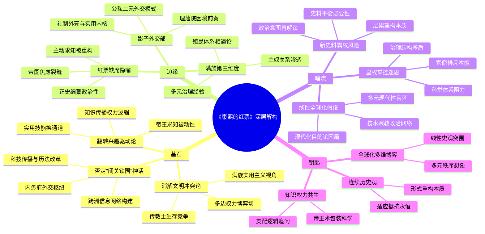

豆瓣链接：https://book.douban.com/subject/36794613/

# 深层解构

### 《康熙的红票》深层解码：在故纸堆里打捞被折叠的全球化前史

#### **一、基石：撬动传统叙事的三个支点**  
1. **否定“闭关锁国”神话：还原清朝的全球化参与度**  
   作者以康熙派往欧洲的“红票”为支点，打破“清朝自外于世界”的刻板印象。书中揭示，顺治至乾隆朝，传教士不仅是宫廷常客，更深度介入历法改革、边界谈判（如《尼布楚条约》传教士充任翻译）、科技传播（南怀仁制炮）等核心事务。康熙甚至通过教皇使团、彼得大帝使节构建跨洲信息网络，其内务府系统成为中西交流的“私属外交枢纽”。这颠覆了“朝贡体系=封闭”的简化认知，证明前现代中国与世界的互动密度远超想象。  

2. **消解“文明冲突论”：重构中西交流的权力图谱**  
   传统叙事常将“礼仪之争”定性为中西文明对抗，作者却指出其本质是**多边权力博弈**：罗马教廷试图控制在华传教权，清朝内务府借传教士制衡满汉官僚，传教士自身亦在欧洲各国教会竞争中寻求生存。书中特别强调满族统治的特殊性——作为“少数统治多数”的族群，清廷对西洋技术的吸纳更具实用主义倾向（如用火炮巩固统治），而非汉族士大夫的“华夷之辨”框架。这种视角将冲突从“文明本质”拉回到“权力技术”层面。  

3. **翻转“兴趣驱动论”：解构帝王求知的因果逻辑**  
   康熙对西学（如数学、医学）的兴趣常被归因于个人天赋，作者却尖锐指出：**先有传教士持续在场，才有帝王的求知欲**。文档原文摘录提到，“数学美感需长期学习才能领略”，康熙的“兴趣”本质是权力网络催生的结果——传教士通过历法、医疗等实用技能获取接近皇权的通道，继而构建知识权威。这一洞见戳破了“圣主开眼看世界”的浪漫想象，揭示知识传播背后的权力交换逻辑。

#### **二、边缘：那些照亮历史暗角的微光**  
1. **内务府：被忽视的“影子外交部”**  
   书中轻描淡写却极具颠覆性的细节：清朝与西方的交往主要通过**内务府（皇帝私属机构）**而非礼部（传统外交系统）。从接待教皇使团到派遣洋钦差，康熙绕过官僚体系，以“奴才”网络直接掌控涉外事务。这暴露了清廷权力结构的双重性——外朝维持“天下共主”的礼制外壳，内廷则以实用主义处理真实国际关系。这种“公私二元”模式，为理解清代外交的矛盾性（如鸦片战争前的“理藩”与“夷务”困境）提供了钥匙。  

2. **满族视角：超越“中西二分法”的第三维度**  
   作者不经意间提到的“满族文化背景”，实则暗藏范式革命。当传统研究聚焦“中国/西方”对立时，本书将满族统治作为独立变量：八旗制度下的“主奴关系”渗透到中西交往中（如传教士需以“奴才”身份觐见），而满族对蒙古、西藏的治理经验，使其对“他者”（包括西洋人）的包容度异于汉族王朝。这种视角提示：所谓“中国与西方”的碰撞，本质是**满族帝国体制与早期现代欧洲殖民体系的相遇**，而非单一文明的独白。  

3. **红票的“缺席”：正史失语的权力隐喻**  
   作为核心物证的“红票”未被正史记载，作者虽未深入阐释，却隐含深刻批判：官方叙事选择性遗忘的，恰是动摇“天朝上国”神话的关键——康熙曾主动向欧洲寻求帮助（寻找滞留罗马的钦差）。这种“缺席”暴露了史书编纂的政治逻辑：当中央集权强化，帝王的“主动求知”被重构为“怀柔远人”，而真实的跨国互动需求被消音。红票的出土，犹如在“盛世”帷幕上撕开一道裂缝，透出帝国对外部世界的真实焦虑。

#### **三、暗流：藏在论证背后的思维河床**  
1. **假设一：全球化是线性进步的单程票**  
   书中隐含“清初本可深度融入全球化，却因雍正禁教等事件错失机会”的叙事，这一假设默认“西方主导的全球化路径是唯一正途”。但未被审视的问题是：清朝的“全球化”是否必须以皈依欧洲文明为前提？其通过传教士构建的“技术—宗教—政治”多元网络，是否可能发展出不同于西方殖民体系的全球互动模式？作者批判欧洲中心主义，却不自觉陷入“现代化目的论”，这是全书最隐蔽的思想张力。  

2. **假设二：皇权能完全掌控跨国交流**  
   书中强调康熙通过内务府灵活处理中西事务，却低估了体制性障碍。例如，传教士虽得帝王信任，却始终被士大夫阶层视为“奇技淫巧”的载体；雍正禁教固然有权力斗争因素（如传教士卷入九子夺嫡），但根本上是科举官僚体系对不确定性的本能排斥。作者的“皇权中心论”，可能淡化了传统帝国治理结构（如科举、六部）对全球化的结构性阻力。  

3. **假设三：历史可以通过“新史料”完全重写**  
   红票、传教士手稿等新史料的运用令人耳目一新，但作者对传统史料（如《清实录》）的批判略显简单。任何历史书写都是“层累的建构”，红票的“真实性”虽被证实，但其政治意图（如康熙借红票向欧洲展示权威）仍需置于多重语境中解读。过度依赖“边缘史料”重构中心，可能陷入另一种史料霸权——正如当年“冲击—反应论”依赖西方档案忽视中国文本一样。

#### **四、给读者的三把钥匙**  
1. **当我们说“全球化”时，我们在忽略什么？**  
   本书提醒：全球化不是西方对非西方的单向征服，而是前现代帝国与早期现代国家的多维博弈。康熙的红票、彼得大帝的使团、教皇的传教令，本质上都是不同文明对“世界秩序”的想象投射。理解这种多元现代性，才能跳出“落后—挨打”的线性史观。  

2. **权力如何塑造知识的命运？**  
   传教士带来的数学、历法知识，在清朝不是“科学”而是“帝王之术”——南怀仁的《康熙永年历法》首先是皇权合法性的证明，其次才是科学成果。今天的“知识”同样浸润在权力网络中，这本书教会我们：任何对“纯粹知识”的崇拜，都需追问其背后的支配逻辑。  

3. **历史的“转折点”是否存在？**  
   书中暗示雍正禁教是“中西交流中断”的转折点，但换个角度看，乾隆朝仍有马戛尔尼使团访华，鸦片战争后传教士重返中国——交流从未真正中断，只是形式与权力关系不断重构。或许根本不存在“错失的机会”，只有不同文明在压力下的持续变形。历史没有转折点，只有连续的适应与抵抗。

#### **结语：在红票的朱色里，看见帝国的黄昏与黎明**  
孙立天的这本书，本质是一场“逆潮流”的书写：当多数清史研究聚焦“内陆亚洲”或“海洋史”时，他选择在紫禁城的红墙内，在传教士的手稿里，打捞被宏大叙事淹没的微观互动。红票不是传奇，而是一个隐喻——它是帝国伸向世界的指尖，也是传统中国触碰到现代性的第一缕震颤。  
阅读此书，不必纠结于“清朝是否应该更开放”，而应思考：当我们用“全球化”丈量历史时，是否正在用今天的尺度，削平过去的复杂褶皱？或许真正的启示在于：每个文明的“现代性”，都生长于其独特的传统土壤，而非对某一模板的复制。红票的褪色，不是封闭的开始，而是一个古老帝国在现代性浪潮前的一次试探性呼吸——虽浅，却真实。

# 章节内容
### 序
在这一部分，作者很可能会详细阐述其研究的时代背景，即康熙时期中西文化交流频繁碰撞的大环境。也许会提及当时欧洲传教士纷纷东来，带来了西方的科技、文化与宗教思想，而清朝作为一个庞大且具有独特文化体系的帝国，正处于政治、经济、文化发展的关键节点。作者选择“康熙的红票”这一独特视角，旨在深入挖掘这一时期隐藏在政治、外交、宗教等事件背后的深层逻辑与文化交融脉络，为读者梳理出一幅清晰且独特的历史画卷，引导读者从全新的角度去认识和理解康熙时代乃至整个清初历史的复杂性与多元性，为后续章节对具体历史事件的剖析搭建起一个宏观且具有启发性的平台。

### 第一部分 进入满人权贵圈的西洋人
#### 第一章 佟家的奴才
- **关键论点与主张**：作者试图通过对西洋人早期在满族权贵阶层中的生存状态进行细致研究，揭示出满汉文化与西方文化初次接触时的碰撞、融合过程，探究满族权贵对西洋人从陌生到接纳的态度转变及其背后的政治、文化因素，以及这一过程对天主教在中国早期传播路径和模式的深刻影响。
- **核心内容**：在明清战争的硝烟中，部分西洋人不幸成为俘虏，命运的齿轮将他们带入了满族社会，成为佟家的奴才。佟氏家族作为康熙母族，在满洲政治舞台上举足轻重，是满族权贵的典型代表。当时的满人对这些来自遥远西方的洋人认知极为有限，视其为奇异的外来者。而西洋神父们为了在这片陌生土地上立足，参与到了大炮生意之中，这成为他们与满人接触的特殊契机，也为日后的文化交流埋下了伏笔。随着时间的推移，佟氏家族与传教士的互动逐渐增多，一些传教士凭借自身的知识、技能，如精湛的天文历法知识，或是在医学领域的独特见解，赢得了家族成员的信任和尊重，从而逐渐摆脱了奴籍的束缚，获得了相对自由的身份。这一过程生动地展现了满汉文化与西方文化在清初的初步交融，体现了满族权贵对外来文化和人员态度的动态变化，也为天主教在中国的早期传播开辟了一条独特的路径，即通过与满族权贵的紧密联系，逐步渗透到中国社会的上层结构之中。
#### 第二章 满汉之争中的传教士
- **关键论点与主张**：深入剖析传教士在满汉权力斗争的政治漩涡中所处的位置和所扮演的角色，探讨满汉双方在政治、文化、宗教等多方面的观念冲突如何集中体现在对传教士的态度和处置上，以及传教士的活动对清初政治格局和文化氛围的微妙影响。
- **核心内容**：传教士在清初不幸被卷入满汉路线之争这一激烈的政治斗争中。当时的局势错综复杂，满汉势力之间的权力博弈暗流涌动，而传教士的出现成为了一个新的变量。杨光先作为传统势力的代表人物，对传教士的传教活动持有强烈的抵制态度，其背后是传统儒家文化观念与西方宗教文化的激烈碰撞。在传统中国社会，算命等迷信活动与儒家伦理、政治统治紧密相连，而汤若望等传教士参与天文历法等事务，被杨光先等视为对传统秩序的挑战，进而引发了震动朝野的历狱审判。在这一审判过程中，各方势力围绕传教士的传教行为、所传播的西方知识体系（尤其是天文历法）展开了激烈的辩论和斗争。传教士带来的西方先进天文历法与中国传统历法之间的冲突，不仅仅是科学技术层面的差异，更被政治化，与王朝统治的正统性、权威性挂钩，深刻反映出当时社会在面对外来文化冲击时，内部不同利益集团在政治权力、文化观念上的矛盾与挣扎，也凸显了传教士在清初政治文化格局中的尴尬与敏感地位。
#### 第三章 从铲除鳌拜到《尼布楚条约》谈判
- **关键论点与主张**：阐述传教士在康熙铲除鳌拜的政治斗争以及《尼布楚条约》这一重大外交事件中的关键作用和深远影响，深入分析传教士与康熙宫廷政治紧密结合的过程和方式，揭示这一时期中西文化交流在政治外交领域的具体表现和独特价值。
- **核心内容**：康熙铲除鳌拜的过程充满了政治斗争的风云变幻，传教士在这一关键时期登上了清朝政治舞台的前沿。南怀仁凭借其卓越的科学才能，尤其是在天文历法和火炮制造技术方面的专长，赢得了康熙的赏识和信任，成为康熙巩固统治的得力助手。在天文历法方面，南怀仁对传统历法进行了精确的修正和完善，为清朝的天文观测和时间计量提供了更为科学的依据，这在当时被视为关乎王朝统治合法性的重要事务；在火炮制造领域，他帮助清朝改进火炮技术，增强了军事力量，为康熙在政治斗争中提供了有力的支持。同时，传教士们作为中西文化交流的桥梁，为康熙带来了大量西方世界的信息，包括地理、政治、科技、文化等各个方面，拓宽了康熙的国际视野，使他对外部世界有了更全面、深入的认识。在《尼布楚条约》的谈判过程中，传教士更是发挥了不可或缺的作用。他们凭借自身对西方语言、文化和外交礼仪的了解，担任了翻译和顾问的重要角色。例如，在与俄罗斯使团的沟通中，传教士准确地传达了清朝的立场和诉求，同时也帮助清朝使团理解俄罗斯方面的意图和条件，为双方的谈判搭建了有效的沟通平台，促进了条约的顺利签订。这一系列事件充分展示了传教士在康熙时期政治、外交领域的重要影响力，以及他们与清朝宫廷政治之间日益紧密、相互依存的关系，标志着中西文化交流在清初政治外交舞台上迈出了重要的一步，对清朝的对外关系发展和国际地位提升产生了深远的影响。
#### 第四章 内务府的人
- **关键论点与主张**：深入研究传教士在内务府这一清朝宫廷核心管理机构中的特殊身份地位及其演变过程，探讨他们在中西文化双向交流中所承担的具体角色和发挥的实际作用，揭示清朝宫廷内部管理传教士的制度体系及其对中西文化交流的促进与制约机制。
- **核心内容**：在清朝宫廷的社会结构中，臣子与奴才有着明确的区分，而传教士在内务府中被赋予了独特的名分，这一名分决定了他们在宫廷中的活动范围、职责权限以及与皇室成员和其他宫廷人员的互动方式。随着新传教士的不断涌入，他们在内务府的管理框架下逐渐编织起了一张复杂的关系网，与宫廷内外的各级人员建立起了多样化的联系。从文化交流的角度来看，他们积极地向西方世界传播中国的文化、历史、科技等知识，同时也将西方的先进科学技术、哲学思想、艺术文化等引入中国。例如，邓玉函在欧洲原本专注于植物学和医学领域的研究，来到中国后，他深入接触了中医中药文化，对中国传统医学的理论和实践进行了详细的考察和记录，并将西方医学的知识和方法介绍给中国同行。这种跨文化的知识交流与碰撞，不仅丰富了双方的医学宝库，也为中西文化的相互理解和融合提供了宝贵的实践经验。传教士在内务府的管理体系下，犹如一根纽带，紧密地连接起了东西方文化，在促进双方文化交流的同时，也受到清朝宫廷制度的制约和影响，其活动范围、传播内容和方式都必须在清朝统治者的许可和监管之下进行，从而形成了一种独特的中西文化交流模式，对清初的文化发展和对外交流格局产生了重要而深远的影响。

### 第二部分 红票与中西交往
#### 第五章 教皇使团和康熙派出的洋钦差
- **关键论点与主张**：通过详实的史料和深入的分析，全面讲述教皇使团访华以及康熙派出洋钦差这一系列重大事件的历史背景、具体过程和深远影响，深入挖掘双方在互动过程中礼仪之争的根源、表现形式和深层文化内涵，从政治、宗教、文化、外交等多个视角全方位还原当时复杂而微妙的历史场景，探讨背后隐藏的中西文化冲突与政治博弈的实质和规律。
- **核心内容**：康熙时期，教皇使团的来访成为中西交往史上的一个关键节点。这一事件的发生，是在西方天主教会积极向东方扩张传教势力，而清朝正处于国力强盛、文化自信且对外部世界充满好奇与探索欲望的历史背景下。康熙对教皇使团的态度是复杂而多元的，既有着对西方文化和宗教的好奇与求知欲，又受到传统中国政治统治理念和文化观念的深刻影响。初次接见时，双方在礼仪规范上就出现了明显的差异和摩擦。西方的礼仪传统强调宗教仪式的独立性和纯粹性，而中国的礼仪文化则与政治秩序、社会伦理紧密相连，例如使团成员在晋见康熙时对叩拜等礼仪的态度，引发了双方的初步争议。随着交往的深入，教皇使节与传教士之间的关系变得错综复杂。多罗作为教皇使节，在华期间积极推行教皇的传教政策，强调天主教教义的正统性和纯洁性，与部分传教士在中国传教过程中采取的适应中国文化习俗的传教策略产生了激烈冲突，从而引发了更为激烈的礼仪之争。这一争论涉及到天主教教义对中国传统礼仪文化的解读与接纳问题，如祭祖、祭孔等仪式在天主教教义中的地位和合法性成为争议的焦点。传教士们由于各自的文化背景、传教理念和在中国的生活经历不同，对此持有不同的观点和立场，他们的书信、报告等记录从多个角度反映了当时紧张而复杂的局势。在辞行会见、康熙面试颜珰主教等关键事件中，领票问题成为了双方矛盾的集中爆发点。康熙要求传教士领取“红票”以表明其在中国传教的合法身份和对清朝统治的认可，而教皇方面则对此持有异议，认为这是对教会权威的侵犯。这一争议深刻反映了中西文化在宗教礼仪、政治观念、社会伦理等方面的深刻分歧，以及双方在政治、宗教层面复杂的互动与博弈，使得这一时期的中西交往充满了误解、冲突与艰难的协调，对后来中西文化交流的走向产生了深远的影响，也为我们理解东西方文化的差异与融合提供了一个经典的历史案例。
#### 第六章 彼得大帝使团和教皇新使团
- **关键论点与主张**：系统讲述康熙在等待教皇回应的漫长时期内与彼得大帝使团的往来互动情况，以及教皇新使团访华的背景、目的和结果，深入分析康熙在处理这些复杂外交事务中的战略考量、态度变化和应对策略，展现当时国际关系中各国利益交织、相互竞争又相互依存的复杂局面，揭示清朝在这一国际格局中的地位和作用。
- **核心内容**：康熙等待教皇回应的十四年，是清朝对外关系史上一段漫长而关键的时期。在此期间，康熙发出公开信，表达了清朝对西方宗教和外交事务的立场与期望，这一举动既显示了康熙在外交事务中的主动姿态和耐心，也反映了清朝作为一个大国在处理国际关系时的自信与从容。彼得大帝使团的来访，为清朝的对外交往带来了新的机遇和挑战。俄罗斯作为一个新兴的欧洲强国，正积极向东扩张势力范围，与清朝在领土、贸易等方面存在着潜在的利益冲突和合作空间。使团带来了俄罗斯的政治意图、文化特色和贸易诉求，与清朝展开了一系列的外交谈判和文化交流活动。例如，双方在边境贸易的规则制定、文化交流的形式和内容等方面进行了深入的探讨和协商，这不仅促进了两国之间的相互了解，也为后来的国际关系发展奠定了基础。与此同时，教皇新使团的到来使原本就复杂的国际关系变得更加扑朔迷离。各国使团的往来背后，隐藏着政治、经济、文化等多方面的利益考量。在政治上，各国都试图通过外交手段扩大自己的影响力，争夺在东方的势力范围；经济上，对贸易利益的追逐成为各国使团的重要使命之一，如对东方丝绸、茶叶、瓷器等奢侈品的贸易需求以及对新市场的开拓欲望；文化上，宗教传播与文化渗透相互交织，西方各国希望通过传教等方式传播自己的文化价值观，增强对东方的文化影响力。康熙在面对这些复杂的外交局势时，需要在维护清朝国家利益、保持政治稳定、促进文化交流与防范外部势力威胁之间寻求平衡，制定出灵活多变、务实有效的外交策略。他既要利用各国之间的矛盾和竞争，争取有利的外交地位，又要谨慎应对西方文化和宗教的冲击，确保清朝的文化传统和政治统治不受动摇。这一时期的外交活动充分展示了清朝在国际舞台上与不同势力交往时的多元态势和复杂心态，也反映了当时国际关系的现实状况和发展趋势，为我们研究清朝的对外关系史和世界历史的互动提供了丰富的素材和深刻的启示。

### 第三部分 荣耀后的沉寂
#### 第七章 雍正争位与禁教
- **关键论点与主张**：深入探究雍正争位这一重大历史事件与清朝禁教政策出台之间的内在逻辑联系，全面分析雍正实施禁教政策背后的政治、宗教、文化等多方面的深层原因，重新审视这一历史时期禁教政策对清朝政治、社会、文化以及中西关系发展的重大影响和深远意义，揭示历史事件背后隐藏的权力斗争、文化冲突与社会变革的复杂关系。
- **核心内容**：康熙晚年，皇位争斗陷入白热化状态，各方皇子及其背后的政治势力展开了激烈的角逐，局势错综复杂。雍正的登位过程充满了谜团和争议，至今仍是史学界研究的热点之一。传教士在这一激烈的政治漩涡中虽曾试图施加影响，但最终未能改变历史的走向。雍正继位后，迅速实施了禁教政策，这一决策背后有着深刻而复杂的原因。从政治角度看，雍正可能出于巩固自己统治地位的需要，防范外部势力（包括传教士及其背后的西方势力）对清朝内部政治事务的干涉和潜在威胁。在皇位争夺过程中，传教士与部分皇子的密切联系可能引起了雍正的警觉，他担心传教士会成为政治不稳定因素，因此采取禁教措施以切断外部势力与国内政治的潜在联系。宗教方面，天主教教义与清朝主流宗教观念（如儒家思想、佛教、道教等）存在着显著的差异，这些差异在礼仪、信仰实践、社会伦理等多个层面引发了冲突和矛盾。例如，天主教强调一神论和教会的绝对权威，与中国传统宗教文化中的多神信仰、家族祭祀等习俗格格不入，这引发了社会舆论的关注和担忧，也促使雍正采取措施规范宗教秩序。文化上，中西文化的巨大差异在这一时期愈发凸显，传教士带来的西方文化观念和生活方式对传统中国社会产生了一定的冲击，引起了部分保守势力的反感和抵制。雍正作为清朝的统治者，需要在维护传统文化根基和接纳外来文化之间做出选择，而禁教政策在一定程度上反映了他对传统文化的坚守和对西方文化冲击的防范。此外，雍正本人与佛教关系密切，其佛教居士的身份和对佛教的推崇可能也影响了他对天主教的态度，使他更倾向于支持本土宗教的发展，抑制天主教的传播。禁教政策的实施与皇位争斗之间存在着紧密的逻辑关联，这一时期的政治、宗教、文化等因素相互交织、相互作用，对清朝与西方的关系产生了重大而深远的改变。中西文化交流在这一政策的影响下陷入了低谷，传教士的活动受到了严格限制，西方文化在中国的传播渠道被大幅压缩，这不仅影响了当时的社会文化氛围，也为后来清朝的闭关锁国政策埋下了伏笔，对中国近代化进程产生了间接而深刻的影响，使中国在与西方的竞争中逐渐落后，错失了早期现代化的机遇。
