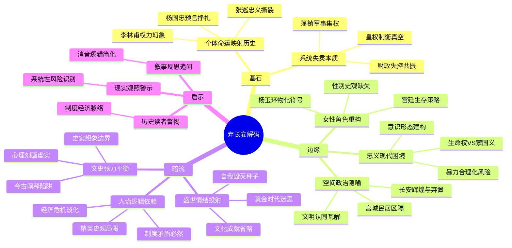

豆瓣链接：https://book.douban.com/subject/35678328/

# 深层解构

### 《弃长安》深层解码：在个体命运里照见盛唐崩陷的三重镜像

#### **一、基石：作者反复回归的核心信念**  
**1. 个体命运是历史剧变的微缩剧场**  
作者以李林甫的“盛世幻象”、杨国忠的“预言式挣扎”、安禄山的“反叛逻辑”等人物为切片，将安史之乱解构为一系列个体选择的叠加。如李林甫为皇权制衡太子，最终招致灭族（引自第一章），折射出盛唐官僚体系“皇权工具化”的致命缺陷；张巡“牙齿尽碎”的抗敌悲剧（第八章），则以极端个案凸显乱世中忠义伦理与现实生存的撕裂。  
**核心假设**：历史不是抽象的规律，而是无数具体的人在制度牢笼中的应激反应。  

**2. 盛世崩陷的本质是系统性失灵**  
书中刻意淡化传统“红颜祸水”“奸臣误国”的叙事，转而聚焦制度性矛盾：李隆基对“弱势太子”的病态需求（引自第一章），导致中枢权力真空；藩镇节度使的军事集权（安禄山身兼三镇）与中央财政失控（杨国忠理财加剧贫富分化）形成共振。作者反复暗示：盛世的崩塌，始于对“稳定表象”的集体沉迷——当颜杲卿等清醒者试图预警时（第四章），帝国精英仍在“纵情声色或麻木漠然”（第二章摘录）。  

#### **二、边缘：被轻轻掠过的思想微光**  
**1. 空间政治的隐形叙事**  
随书附赠的“手绘长安城坊图”不仅是装帧亮点，更隐含“空间权力学”：长安作为世界都市的辉煌（内容简介），与其在叛乱中迅速沦为“弃城”形成残酷对比。若深入挖掘，可探讨都城规划（如宫城与民居的区隔）如何塑造皇权象征体系，而“弃长安”的物理动作，实则是对盛唐文明认同的瓦解。  

**2. 女性角色的失语与重构**  
杨玉环的“香囊”（第六章）作为物化符号贯穿叙事，传统史书多将其视为“祸端”或“牺牲品”。但书中未触及：她作为后宫女性，是否曾利用有限权力试图影响政局？若从性别史视角切入，其悲剧或可成为透视唐代宫廷女性生存策略的切口，而非仅作为男性政治的注脚。  

**3. 忠义伦理的现代性困境**  
颜杲卿“被割舌仍骂贼”（第四章）、张巡“杀妾飨兵”（第八章）的传统忠义叙事，书中未加批判。但现代读者可能追问：当个体生命权与家国大义冲突时，这种“极端忠义”是否隐含暴力合理化的危险？作者回避了这一伦理悖论，却为读者留下反思空间：历史书写中的“英雄”，是否也是特定意识形态的建构？  

#### **三、暗流：未被言说的论证前提**  
**1. 对“人治逻辑”的路径依赖**  
全书聚焦帝王将相的决策，隐含“关键人物决定历史”的精英史观。但安史之乱的深层动因——均田制崩溃引发的经济危机、府兵制瓦解导致的军事失衡——仅作为背景存在。这种“重人物轻结构”的叙事，可能让读者忽视：即使没有李林甫或安禄山，唐代中期的制度性矛盾仍可能催生其他乱局。  

**2. 文学性与历史性的微妙张力**  
作者强调“不似冷硬的历史作品，更像文学创作”（内容简介），这种叙事策略虽增强可读性，却可能模糊“史实”与“想象”的边界。例如，书中对人物心理的细腻刻画（如李亨“中兴”的权谋算计，第七章），是否有确切史料支撑？当历史写作向文学靠拢时，如何避免陷入“以今度古”的阐释陷阱？  

**3. 盛世情结的无意识投射**  
作者坦言“最想穿越的时代是盛唐”（作者简介），这种情感倾向可能导致对“盛世”的复杂面相挖掘不足。书中虽写盛世崩陷，但对盛唐文化成就（如诗歌、科技）与制度弊端的共生关系着墨较少，容易让读者产生“盛世=美好时代”的简化认知，而忽略任何“黄金时代”都可能孕育自我毁灭的种子。  

### **解码结语：超越“弃长安”的三重启示**  
1. **对历史读者**：警惕“大人物决定论”，在个体故事中寻找制度与经济的深层脉络；  
2. **对现实观照**：盛世表象下的系统性风险往往被忽视，任何时代都需要“颜杲卿式的清醒者”；  
3. **对叙事反思**：当历史被写成“可一口气读完的故事”时，别忘了追问：哪些声音被消音？哪些逻辑被简化？  

《弃长安》的真正价值，或许不在于还原历史，而在于教会我们用“X 光视角”穿透文字，在帝王将相的权谋之外，看见更复杂的人性光谱与更隐秘的时代肌理。

# 章节内容
### 楔子：出长安记（756 年六月十三）
- **核心内容**：安史之乱的战火蔓延至潼关，守将哥舒翰兵败被俘后投降。消息传至长安，唐玄宗惊慌失措，于六月十三日凌晨，带着杨贵妃姐妹、部分皇子皇孙、杨国忠等少数亲信，在龙武大将军陈玄礼所率禁军的护卫下，秘密逃离长安。行至马嵬驿时，军队因饥饿疲惫、对杨国忠的愤恨以及对国家命运的忧虑，发生哗变。士兵们杀死杨国忠，又逼唐玄宗赐死杨贵妃。随后，唐玄宗继续逃往蜀地，而太子李亨则分道扬镳，前往朔方，唐朝的命运在此刻发生了天翻地覆的转折，曾经辉煌的盛世陷入了无尽的混乱与动荡。
- **关键论点与主张**：作者通过对唐玄宗仓皇出逃细节的描述，如“凌晨出发”“秘密逃离”等，生动地展现出盛世转衰时的仓惶与无奈。这一事件被视为唐朝命运的关键节点，后续围绕此展开的一系列故事，都旨在深入探究大唐盛世何以如此迅速地走向崩陷。唐玄宗逃离长安这一行为，不仅是个人的逃亡，更象征着唐朝统治中心的崩塌，而马嵬驿之变中各方势力的冲突与妥协，也预示着唐朝内部矛盾的全面爆发，为后续的乱世局面埋下了伏笔。

### 第一章：李林甫的盛世（736—752 年）
- **核心内容**：李林甫在唐玄宗时期长期专权。当时唐玄宗忌惮太子势力，李林甫为迎合上意，开启了与太子李亨长达十余年的政治争斗。他利用各种手段罗织罪名，构陷太子的亲党，如韦坚、皇甫惟明等众多大臣皆受牵连。在朝堂之上，李林甫为巩固自身权势，排斥异己，打压朝中正直之士，如张九龄等贤相被罢黜。同时，他为杜绝边将入相威胁自己地位，提出任用蕃将担任节度使的策略，安禄山等蕃将得以崛起，掌控大量军事力量。在他执政期间，唐朝表面呈现出歌舞升平的“盛世”景象，然而，政治腐败、权力斗争激烈，社会矛盾逐渐积累，盛世之下实则危机四伏。
- **关键论点与主张**：作者认为李林甫这类宠臣虽能在唐玄宗的支持下权倾一时，但他们的行为严重破坏了唐朝的政治生态。他们为了满足皇帝的私欲，不择手段地打压政治对手，导致朝廷内部矛盾重重。任用蕃将的举措，虽暂时解决了李林甫的个人政治危机，却使地方军事力量失去平衡，为安史之乱埋下了巨大隐患。这种盛世表象下的政治黑暗与矛盾积累，最终将唐朝推向了危险的边缘，揭示了一个看似繁荣的王朝内部可能隐藏的致命缺陷。

### 第二章：杨国忠的预言（753—755 年）
- **核心内容**：李林甫死后，杨国忠凭借杨贵妃的裙带关系成为宰相。他与安禄山之间因争权夺利矛盾日益尖锐。杨国忠为了打压安禄山，多次向唐玄宗进言，预言安禄山必反。他在政治上专权跋扈，大肆搜刮民财以满足自己的私欲，同时任用私人，导致朝廷腐败现象加剧。而此时的唐朝社会，大部分精英阶层沉浸在盛世的余晖中，或醉生梦死，或对潜在的危机视而不见。安禄山则在范阳积极扩充军备，准备叛乱。杨国忠与安禄山的激烈争斗，如同火药桶上的引线，随时可能引发一场巨大的灾难，而整个唐朝却依旧在表面的繁华中麻木不仁。
- **关键论点与主张**：作者指出在盛世将逝之际，杨国忠与安禄山的矛盾是唐朝政治危机的集中体现。杨国忠的预言虽有其争权夺利的成分，但也确实反映出安禄山势力膨胀所带来的威胁。然而，唐朝统治集团内部的腐败与大多数人的麻木，使得他们无法有效地应对危机。这种矛盾的积累和各方的不作为，最终导致安史之乱爆发，曾经辉煌的盛世大厦在瞬间开始摇摇欲坠。杨国忠与安禄山的争斗，不仅仅是个人权力的争夺，更是唐朝政治体制内部矛盾激化的表现，它揭示了唐朝在盛世表象下深层次的治理危机。

### 第三章：安禄山的鼙鼓（755 年十一月初九）
- **核心内容**：经过长期精心准备，安禄山于 755 年十一月初九，以“忧国之危”、奉密诏讨伐杨国忠为名，在范阳起兵叛乱。叛军多达十五万，且兵强马壮，一路势如破竹。由于唐朝多年来在军事制度上的变革，地方军队战斗力参差不齐，且中央军久疏战阵，面对叛军的突然袭击，各地守军纷纷溃败。河北地区多城迅速沦陷，安禄山的叛军很快就逼近洛阳。唐玄宗起初听闻安禄山造反，根本不相信，认为是谣言，直至叛军节节胜利的消息不断传来，才不得不仓促应对。但此时唐朝的军事部署已陷入混乱，盛世的安稳被彻底打破，整个国家陷入了巨大的战争危机之中。
- **关键论点与主张**：作者强调安禄山叛乱的突然性与必然性。长期以来唐朝政治的腐败，使得社会矛盾丛生，为叛乱提供了土壤。军事制度上，府兵制向募兵制的转变，导致地方军事力量过于强大，中央对地方的控制减弱，形成了外重内轻的局面，这给了安禄山可乘之机。叛乱的爆发犹如一记重锤，彻底敲碎了唐朝盛世的假象，暴露了唐朝军事、政治制度存在的严重缺陷。它不仅使唐朝陷入战火纷飞的困境，更引发了一系列连锁反应，如社会动荡、经济破坏等，使唐朝的命运急转直下，开启了一段漫长而痛苦的乱世历程。

### 第四章：颜杲卿的舌头（756 年正月初八）
- **核心内容**：安禄山叛乱后，常山太守颜杲卿坚守常山。他假意投降安禄山，暗中联合周边郡县，设计斩杀了叛将李钦凑等，夺取井陉关，与堂弟颜真卿在河北地区遥相呼应，极大地牵制了叛军的行动。然而，由于兵力悬殊，常山最终被叛军攻破，颜杲卿被俘。安禄山亲自审问，试图劝降他，但颜杲卿坚贞不屈，大骂安禄山。安禄山恼羞成怒，命人割下他的舌头，颜杲卿仍含糊不清地骂不绝口，最终壮烈牺牲。他的英勇事迹在安史之乱的黑暗时期，成为了一抹耀眼的光辉，展现出儒家忠义思想熏陶下士人的高尚气节与顽强抵抗精神。
- **关键论点与主张**：作者通过颜杲卿的事迹，深刻展现了乱世中忠臣义士的坚守与担当。在唐朝统治面临崩溃的艰难时刻，颜杲卿以一己之力在敌后顽强抗争，他的行为体现了儒家思想中“忠君爱国”“舍生取义”的理念对士人的深刻影响。他的牺牲并非无谓，在一定程度上打乱了安禄山的军事部署，为唐朝军队的反击争取了时间。同时，也反映出安史之乱时期不同人物的复杂选择，有人叛国投敌，而像颜杲卿这样的人则选择以死明志，彰显了人性在大是大非面前的不同走向，以及在乱世中正义与忠诚的力量。

### 第五章：哥舒翰的膝盖（756 年六月初八）
- **核心内容**：哥舒翰本是唐朝名将，在西北边疆战功赫赫，但此时已身患重病。安史之乱爆发后，唐玄宗任命他为统帅，率二十万大军驻守潼关。哥舒翰深知潼关地势险要，坚守不出是最佳策略，且叛军远来，久攻不下必然疲惫。然而，杨国忠因与哥舒翰有矛盾，担心他手握重兵对自己不利，便向唐玄宗进谗言，催促哥舒翰出关迎战。哥舒翰无奈之下，只得放弃坚守战略，率军出关。结果在灵宝遭遇叛军埋伏，二十万大军几乎全军覆没，哥舒翰兵败被俘。被俘后的哥舒翰，在安禄山面前屈膝投降，与他昔日的威名形成了鲜明对比，这一转变令人唏嘘不已，也深刻反映出战争的残酷与人性在极端困境下的复杂变化。
- **关键论点与主张**：作者认为哥舒翰的失败是多种因素共同作用的结果，其中政治因素的干扰起到了关键作用。杨国忠与哥舒翰的个人恩怨，导致了错误的军事决策，唐玄宗在其中未能明辨是非，也负有不可推卸的责任。潼关的失守，使唐朝失去了重要的战略屏障，叛军得以长驱直入，长安危在旦夕。哥舒翰的屈膝投降，揭示了在战争的巨大压力和生死抉择面前，人的尊严与忠诚可能面临严峻的考验。这一事件不仅改变了战争的局势，也对唐朝的士气和人心产生了极大的冲击，进一步加速了唐朝盛世的崩塌。

### 第六章：杨玉环的香囊（756 年六月十四）
- **核心内容**：马嵬驿之变成为了杨玉环命运的转折点。在军队哗变杀死杨国忠后，士兵们认为杨贵妃是祸国殃民的根源，要求唐玄宗处死她。唐玄宗虽对杨贵妃情深意重，但在士兵的逼迫下，为了平息众怒，保全自己，最终不得不赐死杨贵妃。杨贵妃被缢死在佛堂，死后仅留下一只香囊。她的香消玉殒，成为了安史之乱中的一个悲剧性象征，也反映出唐朝宫廷在战乱中的动荡不安与无奈。曾经集万千宠爱于一身的杨贵妃，在乱世的洪流中，沦为了政治斗争和权力危机的牺牲品，她的命运也从侧面映衬出唐朝盛世繁华的消逝。
- **关键论点与主张**：作者通过描述杨玉环之死，深刻揭示了安史之乱对唐朝宫廷的巨大冲击。杨贵妃的命运与唐朝的兴衰紧密相连，她的死亡标志着唐玄宗时代的结束，也象征着唐朝盛世的终结。唐玄宗在面对杨贵妃之死时的无力，体现出他在安史之乱中已失去了对局势的掌控能力，曾经高高在上的皇权在乱世中也变得脆弱不堪。这一事件不仅改变了唐玄宗个人的命运，也对唐朝的政治格局产生了深远影响，引发了后续一系列的权力争夺与政治变革。

### 第七章：李亨的中兴（756 年七月十二）
- **核心内容**：马嵬驿之变后，李亨与唐玄宗分道扬镳，在朔方军的支持下，于 756 年七月十二日在灵武即位，是为唐肃宗。唐肃宗即位后，积极组织平叛力量，重用郭子仪、李光弼等名将，调整军事战略，试图扭转唐朝在安史之乱中的劣势，实现中兴唐朝的目标。他在灵武建立朝廷，吸引了各地忠于唐朝的势力前来归附，凝聚了人心，为平叛战争奠定了一定的政治基础。然而，他的即位也引发了与唐玄宗之间的权力争夺，父子之间的矛盾在一定程度上影响了平叛的进程和唐朝内部的团结，使得唐朝在安史之乱中的局势更加复杂。
- **关键论点与主张**：作者认为李亨的即位是唐朝政治格局在安史之乱中的一次重大调整。他在国家危难之际挺身而出，展现出了一定的政治智慧和担当精神，通过任用贤能、整合力量等举措，为唐朝的延续带来了一线生机。但与唐玄宗之间的权力纠葛，反映出唐朝统治集团内部在危机时刻的利益博弈和矛盾冲突。这种内部的纷争，既分散了平叛的精力，又使得唐朝在应对安史之乱时无法形成完全统一的决策和行动，体现了唐朝在乱世中政治体制运转的复杂性和困境，也预示着唐朝在平叛过程中将面临更多的曲折与挑战。

### 第八章：张巡的牙齿（757 年十月初九）
- **核心内容**：安史之乱中，张巡坚守睢阳。睢阳地处交通要道，战略地位极为重要。张巡在城内兵少将寡、粮食匮乏的绝境下，率领军民顽强抵抗叛军。在坚守的过程中，睢阳城内发生了许多令人动容且充满争议的事件，如张巡杀妾犒赏将士，以激励士气。经过数月的苦战，睢阳最终城破，张巡被俘。被俘后的张巡宁死不屈，英勇就义。睢阳保卫战虽然以失败告终，但它对阻止叛军南下起到了极为关键的作用，为唐朝军队在南方地区组织防御和反击争取了宝贵的时间，然而张巡杀妾等极端行为也引发了后世对于战争中道德与生存、人性与大义的广泛讨论。
- **关键论点与主张**：作者通过张巡的故事，深入探讨了极端情况下人性与道德的挣扎。张巡的坚守体现了他对唐朝的忠诚以及在绝境中顽强求生、保家卫国的使命感，他的行为在一定程度上符合儒家的忠义观念。然而，杀妾犒军等行为违背了传统的人伦道德，引发了巨大的争议。这反映出在战争的残酷环境下，道德标准可能变得模糊不清，人们在生死抉择面前往往面临着两难的困境。同时，也强调了睢阳保卫战在安史之乱中的战略意义，它虽充满争议，但不可否认其对唐朝整体战局的重要影响，是唐朝在乱世中挣扎求存的一个缩影。

### 尾声：回到长安（757 年十二月初四）
- **核心内容**：经过艰难的平叛战争，唐肃宗于 757 年十二月初四收复长安。然而，此时的长安已不再是昔日繁华的模样，历经战火的洗礼，城市满目疮痍，宫殿建筑多有损毁，百姓生活困苦不堪，人口锐减，商业凋敝，经济遭到了毁灭性的打击。曾经辉煌灿烂的唐朝盛世，在安史之乱的冲击下，已经元气大伤，再也无法恢复到往昔的繁荣昌盛。曾经的歌舞升平、万国来朝，如今只剩下断壁残垣和无尽的伤痛记忆，安史之乱给唐朝带来的破坏是全方位、深层次的，它彻底改变了唐朝的历史走向，成为了中国古代历史上一个重要的转折点，给后世留下了深刻而惨痛的历史教训。
- **关键论点与主张**：作者以回到长安后的凄凉景象，深刻揭示了安史之乱对唐朝的巨大破坏。这种破坏不仅仅体现在物质层面的城市毁坏和经济崩溃，更在于社会秩序的混乱、文化的衰落以及人们精神世界的创伤。唐朝盛世的崩塌成为了不可逆转的历史进程，它表明一个王朝在经历长期的繁荣后，如果不能及时解决内部存在的政治、经济、社会等问题，一旦遭遇重大危机，就可能迅速走向衰落。安史之乱后的唐朝，虽然仍在延续，但已风光不再，陷入了藩镇割据、宦官专权等一系列新的困境，始终未能从这场浩劫中完全恢复过来，成为了历史长河中一个令人叹息的悲剧性案例。 