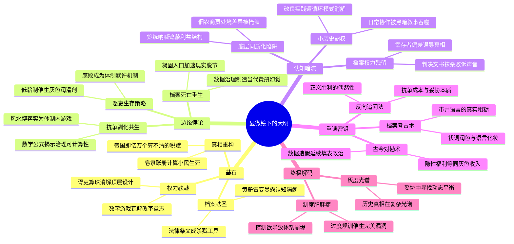

豆瓣链接：https://book.douban.com/subject/30414743/

# 深层解构

### 《显微镜下的大明》深层解码：在尘埃里看见帝国的真实肌理

#### **一、基石：被碾碎的宏大叙事——基层政治的"解剖学"宣言**  
马伯庸的核心信念藏在书名的隐喻里：他拒绝做历史的"望远镜"使用者，而是化身"病理学家"，将明代基层政治置于载玻片上。书中六个故事的真正支点，是对传统历史书写的**双重颠覆**：  
1. **权力祛魅**：朝堂上的"圣人之治"在基层化作胥吏的算盘算珠、讼师的状纸笔墨。当《徽州丝绢案》中首辅张居正的改革意志，最终被县衙书手的"数字游戏"消解时，作者悄然解构了"顶层设计决定历史"的迷思——真正的权力运作，藏在每个小吏"多算一厘或少算一毫"的指尖。  
2. **档案祛圣**：传统史观依赖的"官方文书"在这里露出裂痕。《大明黄册库》中，看似严密的户籍制度沦为"纸糊的统治"，空壳黄册堆积成山，暴露出帝国对基层的认知始终隔着一层霉变的纸页。作者用档案本身证明：**历史的"真实"从来是被筛选、被涂抹的产物**，就像杨干院庙产案中，原告与被告都能在律条中找到杀人的"合法依据"。  

**被反复低语的真相**：所谓"帝国"不是抽象的龙椅与城墙，而是亿万个"算不清的丝绢税""保不住的祖坟""填不满的黄册库"编织的巨网。当我们为"天子与士大夫共治天下"的浪漫想象感动时，书中的皂隶正蹲在县衙角落，用发霉的账册计算着每个小民的生死。

#### **二、边缘：思想曲线的远端——未被展开的三个悖论**  
作者在讲述六个故事时，不经意间触碰到可能颠覆全书的思想火花，却如蜻蜓点水般掠过：  
1. **抗争与驯化的共生**：《婺源龙脉保卫战》中，乡民看似用"风水"对抗开矿资本，实则是借用官府认可的"礼治话语"进行博弈。这暗示基层抗争的本质是**体制内的语言游戏**——百姓越懂得用帝国的规则反抗帝国，越证明这套规则已深入骨髓。正如丝绢案中，帅嘉谟用数学公式"讲理"，反而暴露了帝国治理的"可计算性"本质。  
2. **恶吏的结构性存在**：《胥吏的盛宴》里，一桩芝麻小案引出全县胥吏的集体舞弊，看似是"人性之恶"，实则是**低薪制与行政压力共同催生的生存策略**。作者若深入一步会发现：当朝廷给州县官发80石年俸（约合现代4万元），却要求完成税收、司法、教化等数十项任务时，胥吏的腐败本质是体制默许的"灰色润滑剂"。  
3. **档案的死亡与重生**：黄册库的衰败看似是管理问题，实则揭示**帝国记忆的悖论**——当朱元璋试图用黄册"凝固"天下人口面貌时，恰恰加速了档案与现实的脱节。这让人想到当代的"数据治理"：当我们追求100%精准的基层数据时，是否正在制造新的"黄册式幻觉"？  

**被轻放的钥匙**：这些故事不止是明代的切片，更是一面映照现代治理的镜子。比如丝绢案中"数据正义"与"地域公平"的冲突，恰似今天税收政策中的地区差异争议；杨干院案的"司法技术主义"，与当代某些案件中"程序正义遮蔽实质正义"异曲同工。

#### **三、暗流：未被言说的前提——藏在显微镜下的认知盲点**  
作者的叙事依赖三个隐形假设，却未加审视：  
1. **"底层"的同质性幻觉**：书中将"平民"作为统一的叙事主体，但忽略了底层内部的分化。比如《正统年间的四条冤魂》中，被裹挟的百姓是佃农、手工业者还是商人？不同阶层在政治漩涡中的处境差异极大，笼统的"底层呐喊"可能掩盖了更复杂的利益结构。  
2. **档案的"上帝视角"陷阱**：马伯庸依赖的民间档案（如诉讼文书、黄册），本质是**权力博弈的残留物**。就像杨干院案的最终判决文书，可能只记录了胜诉方的"合理诉求"，却抹去了败诉者被碾碎的真实声音。这种"幸存者偏差"，让我们误以为看到了全部真相。  
3. **"小历史"的救赎情结**：作者试图用"显微镜"对抗"宏大叙事"，但潜意识中仍相信"小历史"能抵达更真实的历史。然而，当六个故事全是"抗争-困境-无解"的循环时，另一种叙事霸权悄然形成——仿佛明代基层只有黑暗与混乱，却忽略了无数未被记录的日常协作与微小改良。  

**思维的暗门**：如果跳出"宏大vs微观"的二元对立，会发现真正的历史恰是两者的合谋。就像黄册库的崩溃，既是中央集权的失败，也是基层社会用"造假"重构生存空间的智慧。这种"上有政策下有对策"的互动，才是帝国绵延近三百年的真正密码。

#### **四、给读者的X光眼镜：三个重读建议**  
1. **反向追问法**：当看到"百姓愤起抗争"时，追问一句：抗争的成本由谁承担？《徽州丝绢案》中，帅嘉谟最终被下狱，证明个体对抗体制的代价极高。书中的"成功"案例，往往是多方利益妥协的结果，而非正义的必然胜利。  
2. **档案考古学**：试着用"怀疑论"重读史料。比如《杨干院律政风云》中，诉讼双方的状词可能都经过文人润色，真实的市井语言或许更粗粝、更直接。这种"语言的化妆"，本身就是基层政治的一部分。  
3. **古今对勘术**：将书中案例与当代社会问题对照。比如黄册库的"数据造假"与某些基层"填表政治"；胥吏的"灰色收入"与现代官僚体系中的"隐性福利"。你会发现，历史从未真正过去，只是换了身衣服。

#### **终极解码：这本书真正在说什么？**  
当我们以为《显微镜下的大明》是六部"古代基层生存指南"时，它其实在揭示一个残酷的真相：**任何试图精密控制基层的庞大帝国，最终都会陷入"制度肥胖症"——过度的规训催生过度的反抗，完美的设计滋养完美的漏洞**。马伯庸的笔尖下，每个算珠的声响、每张状纸的褶皱、每本黄册的霉斑，都是帝国体制与人性博弈的化石。  

而那个未被写出的答案是：或许真正的治理智慧，不在于设计更完美的制度，而在于承认制度的不完美——就像婺源乡民最终接受"有限开矿"，在妥协中寻找动态平衡。毕竟，历史的显微镜下，从来没有纯粹的黑与白，只有无数灰度构成的复杂光谱。

# 章节内容
好的，根据您提供的豆瓣读书链接，我将为您整理马伯庸先生的《显微镜下的大明》一书的读书笔记。

## 《显微镜下的大明》读书笔记

### 笔与灰的抉择——婺源龙脉保卫战

婺源的龙脉之争，实则是一场经济利益与风水信仰的博弈。起源于县内愈发严重的采石之风，采石破坏山体，触动了当地人对“龙脉”的信仰，认为会影响子孙后代的福祉。由此引发了长达六十四年的经济争端。作者细致地展现了一个县级官员如何在地方利益与传统观念之间寻求平衡，以及小民百姓在这种博弈中的无奈与抗争。这场旷日持久的争端，既反映了基层社会对经济发展的渴望，也体现了传统文化在民众心中的深刻影响力。 ^977c78

### 谁动了我的祖庙——杨干院律政风云

杨干院的庙产争夺案，是一出嘉靖年间的民间法律大戏。围绕着祖庙的归属，诉讼双方各显神通，用尽各种法律手段和人脉关系，展开了长达八年的激烈斗争。作者通过对诉讼过程的细致还原，展现了明代民间的法律生态和民众的维权意识。案件不仅反映了当时社会对祖产的重视，也揭示了法律在维护社会秩序和解决民间纠纷中的作用，更展现了小人物在规则之内努力争取自身权益的智慧和无奈。

### 天下透明——大明第一档案库的前世今生

大明黄册库，作为明代国家户籍管理的核心机构，见证了一个王朝的兴衰。黄册制度的建立，旨在强化对基层社会的控制，保证国家税收和徭役的征收。然而，随着时间的推移，黄册制度逐渐失效，造假舞弊现象层出不穷，最终导致了基层统治的瓦解。作者通过对黄册库从建立到衰败全过程的梳理，揭示了明代基层统治由盛转衰的历史轨迹，以及官僚体系的腐败和制度的僵化。

### 胥吏的盛宴——彭县小吏舞弊案

彭县小吏舞弊案，是一件微不足道的官司，却引出了无数贪婪胥吏的侵蚀。通过对这起小案件的剖析，作者淋漓尽致地展现了明代胥吏群体的贪婪和腐败。胥吏作为基层官府中的实际操作者，权力虽小，却能利用职务之便，上下其手，榨取百姓的血汗。这起案件深刻揭示了明代基层政治的黑暗面，以及胥吏制度对社会造成的危害。同时也反映出在皇权不下县的政治现实下，基层百姓面对胥吏的压榨，几乎没有反抗能力。

### 正统年间的四条冤魂

正统年间的四条冤魂，讲述了四个无辜百姓如何被卷入朝廷斗争的悲剧。在朝廷内部的权力倾轧中，小人物的命运如同蝼蚁般脆弱，他们可能因为一个小小的失误，或者仅仅因为身处错误的位置，就被无情地牺牲掉。作者通过对这起冤案的还原，揭示了政治斗争的残酷性和对人性的扭曲。它警示后人，在任何时代，个人的命运都与社会政治环境紧密相连，而公正和人道是维系社会稳定的基石。

Citations:
[1] https://book.douban.com/subject/30414743/

---
来自 Perplexity 的回答: pplx.ai/share