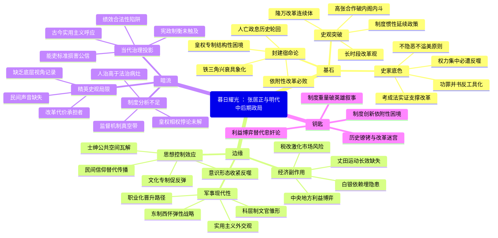

豆瓣链接：https://book.douban.com/subject/36657004/

# 深层解构

### 基石：在矛盾中寻找历史的平衡支点
#### 1. **"美恶不掩"的史家底色**
作者韦庆远的核心信念，藏在"不隐恶、不溢美"的治史原则里。当多数传记沉溺于塑造"改革英雄"或"权相奸佞"时，他偏要撕开这种二元叙事：
- **肯定之锚**：用"考成法整饬吏治""一条鞭法革新经济""俺答封贡稳定边疆"等实证，构建张居正作为"救时宰相"的基本面。赵世瑜提到的"从全局综合评价"，正是通过150余种私人笔记、65种地方志的交叉印证，让改革成效摆脱空泛赞美。
- **批判之镜**：毫不避讳张居正"专权独断""乐谀好奢"的一面。书中直指其"权力集中必遭皇权反噬"的悲剧逻辑，如万历清算时"三子高中与游七招摇"的细节，暗示威权政治的天然隐患。这种"功罪并书"的写法，本质是对"历史人物工具化"的反抗。

#### 2. **"隆万改革"的史观突破**
颠覆"张居正改革孤立论"，提出"隆庆-万历改革连续体"，是本书最硬核的基石论点：
- **合作叙事**：揭示高拱与张居正曾联手推动吏治、军事改革，如第九章所述"两个纲领性文件""重商思想共鸣"，打破"内阁必内斗"的刻板印象。
- **制度惯性**：指出万历改革实为隆庆政策的延续，例如丈田运动、驿递整顿均始于高拱时期。这种"长时段改革观"，消解了"英雄创造历史"的个人崇拜，将变革归因为制度倒逼与群体合力。

#### 3. **封建体制的宿命论**
全书反复叩问的潜台词是：在皇权专制下，任何改革者都难逃"人亡政息"的轮回。张居正"以一人之力力挽狂澜"的悲壮，本质是体制性困境的缩影——没有制度性权力制衡，改革者的权威越高，反噬的烈度越强。书中对"李、张、冯铁三角"兴衰的刻画，正是这种宿命的具象化：依赖皇权的改革，终将被皇权碾碎。

### 边缘：被主线照亮的思想飞地
#### 1. **军事改革的现代性曙光**
当主线聚焦政治斗争时，第九章不经意间露出的军事思想，堪称惊鸿一瞥：
- **专业化建军**：张居正提出"储养本兵大臣，当自兵部司属始"，主张军事官僚职业化（"专官于此，练习事务，不复他迁"），甚至设计"司属→兵备→巡抚→总督"的晋升路径。这种科层制思维，暗合现代文官制度逻辑。
- **弹性战略观**："东制西怀"分化鞑靼、"穷剿海盗"结合海防，显示其突破"华夷之辨"的实用主义。对比同时期欧洲的"均势外交"，这种战略灵活性颇具跨时空对照价值。

#### 2. **经济改革的副作用清单**
一条鞭法的光芒下，藏着作者未深掘的隐性矛盾：
- **货币化风险**：将赋役合并征银，看似简化税制，却加剧了农民对市场的依赖。当白银外流（如晚明全球贸易波动），底层破产风险陡增——这或许是"明实亡于万历"的经济伏笔。
- **地方抵抗机制**：书中提到"正德到隆庆丈田屡行屡败"，暗示中央与地方的利益博弈从未停止。张居正强势推进的"万历清丈"，虽暂时解决土地兼并，却未建立长效监督机制，为后世反弹埋下隐患。

#### 3. **思想控制的蝴蝶效应**
第十八章"反对讲学""文化专制"的轻描淡写，实则触及明代社会的精神裂痕：
- **士绅离心力**：禁止讲学看似压制"清议"，却瓦解了士大夫的公共讨论空间，加速官僚体系的思想僵化。当东林党后来掀起议政浪潮时，某种意义上是对这种压制的报复性反弹。
- **民间信仰的替代路径**：官方意识形态的收紧，可能促使民间宗教（如白莲教）加速传播，成为底层情绪的宣泄口。这种"正道不畅，邪路必猖"的社会心理，在明末民变中清晰显现。

### 暗流：沉默的前提与未竟的对话
#### 1. **精英史观的隐形枷锁**
全书聚焦帝王将相、内阁争斗，却鲜见底层视角：
- **改革的代价承担者**：丈田、征税、驿役改革中，普通农民、驿卒的具体处境如何？书中提到"痛论时政"时多引官员奏疏，却缺乏民间文献的声音。这种"上层叙事"，无意中延续了传统史学"只见树木，不见森林"的局限。

#### 2. **制度分析的半截子工程**
作者敏锐指出"权力集中导致悲剧"，却未深究制度根源：
- **皇权与相权的永恒悖论**：张居正的"柄政"本质是"代行皇权"，但书中未对比唐宋宰相制度（如三省分权），错失探讨"明代内阁为何无法演化出近代内阁制"的契机。
- **监督机制的真空地带**：考成法强化了行政效率，却未建立独立监察体系。张居正依赖"圣眷"推行改革，反而证明传统治理中"人治高于法治"的深层病灶——这一缺陷至今仍具警示意义。

#### 3. **改革评价的当代投影**
书中对"干净的庸吏vs贪腐的能吏"的叩问，实则是古今治理困境的镜像：
- **绩效合法性的陷阱**：张居正用"能吏"标准突破常规（如重用贪腐但善战的将领），短期内挽救危局，却损害制度公信力。这种"实用主义至上"的逻辑，与当代"唯GDP论"存在微妙呼应。
- **历史周期律的现代解**：作者感叹"如何走出人亡政息怪圈"，却未触及"宪政制衡"这一现代方案。传统史学的"经验总结"，与现代政治科学的对话空间，在此处悄然敞开。

### 给读者的三把钥匙
1. **当传奇退潮，看见制度的重量**  
   别被"权相力挽狂澜"的戏剧感迷惑，真正的主角是明代中后期的财政崩溃、边防糜烂、士风败坏。张居正只是试图修补破船的水手，而船本身的设计缺陷（皇权专制）才是沉疴所在。

2. **在善恶之外，寻找利益的形状**  
   张居正与冯保的"阉相联盟"、与高拱的"合作-决裂"，与其用"忠奸"解释，不如视为不同利益集团的动态博弈。书中提到的"言官攻讦""阁臣学术分歧"，本质是文官集团内部的资源再分配之争。

3. **以史为镜，先破镜再重圆**  
   作者揭示的"改革者必遭清算"定律，不是让我们哀叹历史循环，而是追问：如何让制度创新摆脱"依附性生存"？当今天我们谈论"容错机制""长效治理"时，或许该回头看看，四百年前的那场改革卡在了哪道制度关口。

这本书的真正价值，不在复述张居正的故事，而在撕开"改革神话"的表皮，让我们看见：所有改天换地的努力，都带着时代的镣铐；所有力挽狂澜的英雄，都困在制度的迷宫。读懂这些，才是真正的"以史为鉴"。

# 章节内容
### 绪论：有关张居正研究的若干问题
此章中，作者探讨了张居正研究中的诸多问题，为后续深入剖析张居正及其时代背景奠定基础。作者强调运用丰富史料深入研究的重要性，通过对前人研究的梳理，引出本书对张居正更为全面、深入且公正的研究视角，旨在从宏观角度对张居正及其所处的明代中后期政局进行系统解读。
### 第一章：早岁峥嵘
- **第一节：护卫卒的孙子，起自“苦笃贫家”的神童**：张居正出身贫寒，其祖父为护卫卒。他自幼聪慧过人，展现出神童特质，在艰苦环境中成长，家庭背景对其性格和早期价值观的形成产生了深远影响。
- **第二节：备受器识与孳生恩怨**：他因才华出众备受器重，但也因此在人际关系中滋生了恩怨。这种成长经历塑造了他复杂的性格，为日后在政治舞台上的行为和决策埋下伏笔。
- **第三节：修竹的风格和早年的人生追求**：张居正性格内敛深沉，如修竹般坚韧且有节。早年便怀有远大抱负，其个人风格和追求贯穿一生，影响着他在政治生涯中的种种选择。
- **第四节：荆州，这一片热土**：家乡荆州的风土人情和社会环境，对张居正有着深刻的烙印，成为他思想和情感的重要源泉，在一定程度上塑造了他对社会民生的关注视角。
### 第二章：生于忧患
- **第一节：一个灾难深重的年代，一个擅权执拗的皇帝**：当时明朝面临诸多困境，自然灾害频发、社会矛盾激化等问题层出不穷。而在位的皇帝擅权执拗，其统治方式加剧了社会的动荡不安，为张居正所处的时代背景增添了浓重的忧患色彩。
- **第二节：哀民生之多艰**：作者通过描述百姓在苛政、天灾等多重压迫下艰难求生的惨状，深刻反映出当时社会民生的凋敝。这不仅揭示了明朝中叶社会的严重危机，也进一步凸显了张居正改革的紧迫性和必要性，为其日后致力于改善民生的政治作为提供了现实依据。
### 第三章：科举道路和翰苑生涯
- **第一节：经世实学与八股时文的冲突—参加会试的一次挫折**：张居正参加会试时，他所秉持的经世致用的实学理念与僵化的八股时文要求产生冲突，导致他在科举道路上遭遇挫折，这一经历反映出当时教育和选拔制度的弊端。
- **第二节：身在翰苑，忧思天下**：在翰苑任职期间，他虽身处宫廷文化机构，但心怀天下，时刻关注国家大事，体现出超越本职工作的政治视野和责任感。
- **第三节：激切进言，痛论时政**：张居正积极进言，对时政问题进行深入剖析和痛切批判，展现出他对国家政治现状的敏锐洞察力和改革的强烈愿望，试图通过言论影响朝廷决策。
- **第四节：对嘉靖其人和嘉靖朝政事的反思**：他深刻反思嘉靖皇帝的统治方式以及嘉靖朝的政治事务，对朝廷的腐败、政治斗争等问题有了更清晰的认识，为日后改革积累了思想基础。
### 第四章：政治上的失落和彷徨
- **第一节：失意于污秽混浊的官场**：张居正目睹官场的腐败、倾轧和黑暗，深感失望和无奈，对官场的丑恶现象产生强烈反感，这种情绪影响着他在官场中的行为和心态。
- **第二节：接触到险恶起伏的政潮和对夏（言）严（嵩）斗争的思考**：他亲身经历了政治斗争的险恶，见证了夏言与严嵩之间激烈的权力角逐。这使他对政治斗争的本质和规律有了更深刻的认识，开始思考在复杂政治环境中的生存和应对策略。
- **第三节：善处于严（嵩）徐（阶）斗争之间**：在严嵩与徐阶的权力斗争中，张居正巧妙周旋，既避免卷入过深而遭受迫害，又能在双方之间保持一定的影响力，展现出他在复杂政治局势中的灵活应变能力。
- **第四节：周旋于政争漩涡之中与对徐阶的期许**：他在政治漩涡中不断周旋，在与各方势力的互动中逐渐成熟。同时，他对徐阶寄予一定期望，希望徐阶能够引领朝廷走向清明，但最终徐阶未能完全实现他的期望，促使张居正重新审视自己在政治舞台上的角色和使命。
### 第五章：山居未敢忘忧国
- **第一节：隐晦待时，惆怅南归**：张居正感到在政治上难以施展抱负，选择隐晦待时，惆怅地回到南方家乡。这一时期他暂时远离政治中心，但内心的政治热情并未熄灭，而是在等待合适时机重新出山。
- **第二节：山居六载，寄情山水**：隐居期间，他表面上寄情山水，享受田园生活，但实际上始终关注着朝廷动态和国家命运，内心的忧虑和责任感从未消失。
- **第三节：人在江湖，情系社稷**：尽管身处江湖之远，他却心系国家社稷，不断思考国家面临的问题和解决方案，为重返政治舞台积累智慧和力量，体现出他对国家的忠诚和责任感超越了个人得失。
- **第四节：出山回朝，面对变局**：朝廷局势发生变化，张居正抓住机会出山回朝。他怀着对国家命运的担当精神，勇敢面对复杂多变的政治局面，准备再次投身于政治改革的浪潮中，展现出他敏锐的政治洞察力和积极的政治态度。
### 第六章：重新投入政治的漩涡
- **第一节：徐阶倒严的彻底胜利**：徐阶成功扳倒严嵩，取得了政治斗争的胜利。这一事件改变了朝廷的权力格局，为张居正等政治人物提供了新的政治空间和机遇，也标志着朝廷政治风向的转变。
- **第二节：徐阶当国后的政局**：徐阶掌权后对政局进行了一系列调整，试图稳定朝纲、改善政治风气。然而，其施政效果存在一定局限性，未能从根本上解决明朝面临的诸多问题，张居正在此背景下逐渐崭露头角。
- **第三节：徐阶对海瑞上疏等问题的调息**：徐阶在处理海瑞上疏等敏感问题时采取了调息策略，旨在平衡各方利益、维护朝廷稳定。这一过程反映出当时朝廷内部复杂的政治关系和利益博弈，张居正从中观察和学习到了政治运作的技巧和平衡之道。
- **第四节：张居正在嘉靖末期地位的变迁和“应变”准备**：随着政局变化，张居正的地位逐渐发生变迁。他积极适应局势，为应对未来的政治挑战做好准备，包括积累政治人脉、提升自身影响力等，为后续的政治崛起奠定基础。
- **第五节：与高拱“相期以相业”**：张居正与高拱相互期许，希望共同成就一番伟大的政治事业。他们在政治理念和抱负上有一定共识，开始携手合作，在朝廷中形成一股新兴的政治力量，共同推动一些政策的实施和改革的尝试。
### 第七章：嘉隆交替与张居正入阁
- **第一节：一个心理变态、庸碌猥琐的皇帝**：嘉靖皇帝去世后，隆庆皇帝继位。隆庆皇帝性格存在缺陷，心理状态不稳定，且在政治上表现庸碌猥琐，缺乏雄才大略。这一性格特点对朝廷政治产生了直接影响，导致朝廷决策效率低下、政治斗争加剧等问题。
- **第二节：《嘉靖遗诏》的发布和治道转轨**：《嘉靖遗诏》的发布标志着朝廷政策和治理方向的重大转变，试图纠正嘉靖朝的一些弊端，为新朝的政治改革和治理提供了契机，也为张居正入阁后的政治作为提供了政策依据和方向指引。
- **第三节：张居正破格入阁和伸展抱负**：张居正凭借自身才华和政治能力，在嘉隆交替之际破格进入内阁。入阁后，他积极伸展政治抱负，试图在新的政治舞台上施展才华，推动改革，以挽救明朝的危机局势，开启了他政治生涯的重要阶段。
### 第八章：隆庆内阁的矛盾斗争与张居正地位的上升
- **第一节：嘉隆时期内阁地位的提高和首辅制的形成**：嘉隆时期，内阁在政治体制中的地位逐渐提高，首辅制开始形成。这一制度变化导致内阁内部权力争夺加剧，首辅的权力和影响力增大，成为各方政治势力角逐的焦点，张居正身处其中，面临着复杂的政治环境和激烈的权力竞争。
- **第二节：隆庆内阁与“九相”的浮沉**：隆庆内阁期间，众多阁臣如“九相”般起起落落。他们之间的权力斗争、政治分歧和个人恩怨交织在一起，使得内阁局势动荡不安。张居正凭借自身的政治智慧和策略，在这场政治风云中逐渐崭露头角，地位稳步上升。
- **第三节：徐阶、高拱的角逐与徐阶的败北**：徐阶和高拱之间展开激烈的权力角逐，最终徐阶败北。这场斗争不仅改变了内阁的权力结构，也为张居正提供了更多的政治空间和机会，使他在政治舞台上能够发挥更大的作用，进一步推动了他在政治生涯中的发展。
- **第四节：高拱与赵贞吉的斗争及阁权归高拱**：高拱与赵贞吉之间发生权力斗争，经过一系列政治博弈，阁权最终归高拱所有。这一过程反映出内阁内部权力平衡的不断变化，张居正置身其中，继续周旋并积累政治资本，等待时机进一步施展自己的政治抱负。
- **第五节：张居正在内阁内讧中的角色与高张并相**：在内阁的多次内讧中，张居正扮演了复杂的角色。他既与高拱合作，又保持一定的独立性，最终实现了高张并相的局面。这一时期，张居正通过与高拱的合作与竞争，不断提升自己的政治地位和影响力，为日后独揽朝纲奠定了基础。
- **第六节：阁员学术分歧在政治上的反映**：内阁成员之间存在学术分歧，如对理学、实学等不同学术思想的倾向，这些分歧在政治决策和施政过程中有所体现，影响了内阁的政策走向和政治氛围，张居正也在这种学术与政治交织的环境中，坚持自己的政治理念并寻求政治突破。
- **第七节：高拱、张居正的实学思想和对理学末流的批判**：高拱和张居正都秉持实学思想，他们对当时流行的理学末流进行批判，主张学以致用、经世致用的理念。这种思想观念影响了他们的政治决策和改革措施，试图通过务实的政治手段解决国家面临的实际问题，推动明朝社会的发展和进步。
### 第九章：隆庆内阁的成就和张居正的作用
- **第一节：两个纲领性文件的提出**：隆庆内阁提出了两个纲领性文件，为朝廷的施政提供了总体指导方针和方向框架。这些文件涵盖了政治、经济、军事等多个方面，体现了内阁对国家治理的整体规划和战略思考，张居正积极参与其中，为文件的制定和实施贡献了力量。
- **第二节：张居正在隆庆前期的地位和作用**：在隆庆前期，张居正凭借其卓越的政治才能和敏锐的洞察力，在内阁中发挥了重要作用。他积极参与各项政务决策，推动一些政策的实施，为解决当时面临的社会问题提供了思路和方案，逐渐成为内阁中的核心人物之一。
- **第三节：高拱、张居正的知人和用人**：高拱和张居正都重视人才的选拔和任用，他们善于发现和培养有才能的官员，不拘一格地提拔人才，为朝廷组建了一支较为得力的官员队伍。这一举措提高了政府的行政效率和治理能力，为改革的推进提供了人才支持，张居正在此过程中发挥了重要的影响力。
- **第四节：高拱对人事制度的整顿改革**：高拱对人事制度进行了大刀阔斧的整顿改革，包括官员选拔、考核、晋升等方面。他试图建立更加公正、合理、有效的人事制度，以提高官员素质和政府效能，张居正积极配合并参与其中，共同推动了人事制度的优化和完善。
- **第五节：促成俺答封贡的实现**：在处理与北方少数民族俺答的关系上，高拱和张居正共同努力，促成了俺答封贡的实现。这一外交成果缓解了明朝与北方的紧张关系，实现了一定时期的和平稳定，促进了双方的经济文化交流，张居正积极参与外交决策和谈判，为和平局面的达成发挥了关键作用。
- **第六节：取得擒斩汉奸赵全和瓦解板升叛乱势力的胜利**：在军事方面，针对汉奸赵全和板升叛乱势力，高拱和张居正策划并实施了有效的军事行动，成功擒斩赵全，瓦解了叛乱势力。这一胜利维护了明朝边境的安全和稳定，展示了他们在军事战略和指挥上的能力，张居正参与军事决策和协调，为军事胜利提供了有力支持。
- **第七节：高拱、张居正的重商思想**：高拱和张居正都具有重商思想，他们认识到商业对国家经济发展的重要性，主张采取一系列措施促进商业发展，如减轻商税、鼓励贸易等。这种思想在当时具有一定的前瞻性，对明朝经济的复苏和发展起到了积极的推动作用，张居正积极推动重商政策的实施，促进了经济繁荣。
### 第十章：隆万交替与张居正独揽朝纲
- **第一节：隆庆末叶高拱张居正矛盾的激化**：隆庆末年，高拱和张居正之间的矛盾逐渐激化。这一矛盾源于政治理念、权力争夺等多方面因素，导致两人关系紧张，内阁内部局势不稳定，为后续的政治变动埋下伏笔。
- **第二节：朝臣角逐与宦官矛盾的交错盟合**：朝臣之间的权力角逐与宦官势力的矛盾相互交织，各方势力形成复杂的联盟关系。在这种政治格局下，张居正巧妙应对，利用各方矛盾，逐渐扩大自己的政治势力，为独揽朝纲创造条件。
- **第三节：《隆庆遗诏》与高拱被逐**：《隆庆遗诏》的发布引发了一系列政治变动，高拱在权力斗争中失败被逐出朝廷。这一事件标志着朝廷权力格局的重大调整，张居正成为最大受益者，为他独揽朝纲扫除了重要障碍，也改变了朝廷的政治走向。
- **第四节：以构陷高拱为中心的壬申政变**：围绕高拱被逐，发生了壬申政变，这是一场政治权力的重新洗牌。张居正通过一系列政治手段，成功巩固了自己的地位，实现了对朝廷权力的高度掌控，成为明朝政治的核心人物，开启了他独揽朝纲的时期。
- **第五节：张居正接任首辅与李、张、冯政治铁三角的形成**：张居正接任首辅后，与宦官冯保、内阁成员李春芳等形成了政治铁三角关系。他们相互支持、配合，共同掌握朝廷大权，张居正得以在政治上大展拳脚，全面推行自己的政治改革，对明朝政治产生了深远影响。
### 第十一章：幼年万历与张居正特殊形式的君臣关系
- **第一节：幼年万历身份地位和心理的巨大变化**：万历皇帝幼年即位，身份地位发生了巨大变化。从原本的皇子成为天子，这种转变给他带来了巨大的心理冲击，对其性格和行为产生了深远影响，也为他与张居正的君臣关系奠定了特殊的基础。
- **第二节：万历皇帝“小时了了”**：幼年万历在初期展现出一定的聪慧和天赋，张居正因此对他寄予厚望，希望将他培养成一代明君，君臣之间在早期形成了一种积极的互动关系，张居正致力于为万历皇帝提供良好的教育和政治引导。
- **第三节：君臣关系的蜜月期**：在万历皇帝幼年时期，他对张居正十分敬重和依赖，君臣关系处于蜜月期。张居正得以充分施展自己的政治抱负，全面主持朝廷政务，推行一系列改革措施，而万历皇帝也积极配合，朝廷政治呈现出一定的稳定和发展态势。
- **第四节：张居正为“致君尧舜上”的努力**：张居正怀着“致君尧舜上”的政治理想，全身心投入到对万历皇帝的教育和培养中，试图塑造一个圣明的君主，使明朝走向繁荣昌盛。他从品德修养、治国理政等多方面对万历皇帝进行教导，严格要求皇帝遵循儒家规范，积极参与国家事务管理，在这一时期对明朝政治产生了主导性影响。
### 第十二章：“江陵柄政”首重整饬吏治
- **第一节：“江陵柄政”的主要内容**：“江陵柄政”时期，张居正推行了一系列全面而深入的改革措施，涉及政治、经济、军事、文化等多个领域。整饬吏治是其中的核心内容之一，旨在建立一个高效、廉洁、公正的官僚体系，为其他改革的顺利推进提供保障。
- **第二节：以整饬吏治作为推动全面改革的杠杆**：张居正认识到吏治的好坏直接关系到国家的兴衰，因此将整饬吏治作为推动全面改革的关键杠杆。通过整顿吏治，提高官员素质和行政效率，确保各项政策能够得到有效执行，从而为其他领域的改革创造有利条件，体现了他在改革策略上的整体性思维。
- **第三节：以戒谕和考察百官作为整饬吏治的起步**：张居正首先采取戒谕百官的方式，强调官员的职责和纪律，引导官员廉洁奉公、勤勉政务。同时，加强对百官的考察工作，建立严格的考核制度，根据官员的表现进行奖惩，以此激励官员积极工作，淘汰不合格官员，为吏治整顿奠定基础。
- **第四节：启迪万历，首重选贤任能**：张居正注重对万历皇帝的政治教育，引导他认识到选贤任能的重要性。在官员选拔任用方面，坚持以德才兼备为标准，选拔优秀人才充实官僚队伍，为朝廷注入新鲜血液，培养年轻有为之士，确保国家治理人才的质量和可持续性。
- **第五节：调整中枢人事，健全朝廷班底**：在中枢机构层面，张居正进行了人事调整，优化内阁和六部等重要部门的人员配置。选拔忠诚能干的官员担任关键职位，建立起一个高效协作的朝廷决策和执行班子，提高了朝廷中枢的决策能力和行政效率，确保各项政策能够迅速、准确地传达和执行。
- **第六节：创立和推行“考成法”**：张居正创立了“考成法”这一重要制度。通过明确各级官员的职责和任务，规定期限，严格考核，对未能按时完成任务的官员进行问责。“考成法”极大地提高了行政效率，增强了官员的责任感和执行力，使政府机构能够高效运转，有效解决了官僚体系中长期存在的推诿、拖延等问题。
- **第七节：修改和充实吏治律例**：为了使吏治有法可依、有章可循，张居正修改和充实了吏治律例。对官员的行为规范、奖惩措施等方面进行了详细规定，使吏治制度更加完善和严格。这些律例为官员的行为提供了明确的标准，也为惩治腐败和不法行为提供了有力的法律依据。
- **第八节：奖勤罚怠，倡廉惩贪**：在整饬吏治过程中，张居正坚决贯彻奖勤罚怠、倡廉惩贪的原则。对勤勉奉公、政绩突出的官员给予表彰和奖励，包括晋升、赏赐等；对懒惰懈怠、贪污腐败的官员则严厉惩处，毫不留情。这一举措营造了良好的官场风气，激励官员积极向上，遏制了腐败现象的蔓延。
- **第九节：在整饬吏治中存在的恩怨问题**：尽管张居正整饬吏治取得了显著成效，但在实施过程中也不可避免地产生了一些恩怨问题。他的严格措施触动了部分官员的利益，遭到了一些人的反对和抵制。这些恩怨问题在一定程度上影响了改革的推进，但张居正总体上坚定地推行改革，维护了整饬吏治的大局。

### 第十三章：为天下理财
- **第一节：开源节流，扭转“国匮库竭”困境**：面对明朝“国匮库竭”的严峻经济形势，张居正提出开源节流的策略。在开源方面，积极推动商业发展，鼓励贸易活动，增加税收来源；在节流方面，严格控制政府开支，削减不必要的费用，减少浪费，通过这一系列措施努力改善国家财政状况。
- **第二节：面对严重赋役不均的社会经济现状**：当时社会存在严重的赋役不均问题，贫富差距悬殊，普通百姓负担过重。张居正深刻认识到这一问题对社会稳定和经济发展的危害，决心进行改革，以实现赋役公平合理的分配，促进社会经济的健康发展。
- **第三节：着手处理里甲、经催、投靠、优免四大问题**：张居正针对里甲制度的混乱、赋税征收过程中的经催问题、人口投靠权贵逃避赋役以及权贵阶层不合理的优免特权等四大问题，采取了一系列针对性措施。旨在规范制度，堵塞漏洞，确保赋税公平征收，减轻百姓负担，同时增加国家财政收入。
- **第四节：从正德到隆庆丈田的屡行屡败**：回顾从正德到隆庆年间，多次尝试推行丈田政策但均以失败告终。这些失败的经历为张居正的改革提供了宝贵的经验教训，他深入分析前人失败的原因，总结出一套更为可行的丈田方案，以确保此次改革能够成功实施。
- **第五节：万历初年在全国推行的丈田运动**：万历初年，张居正大力推行丈田运动，在全国范围内进行土地丈量。这一举措旨在准确掌握全国土地数量和分布情况，为合理征收赋税提供依据，打击土地兼并现象，促进土地资源的合理利用，是其经济改革中的重要一环。
- **第六节：万历清丈的过程、特点和评价**：详细阐述了万历清丈的过程，包括组织实施、技术方法等方面。其特点是规模大、范围广、执行严格。这次清丈取得了显著成效，增加了国家赋税收入，一定程度上缓解了赋役不均问题，但在实施过程中也存在一些不足之处，如部分地区执行偏差等，总体上对明朝经济发展具有重要意义。
- **第七节：嘉靖初年到隆庆时期一条鞭法的屡试屡止**：梳理了嘉靖初年到隆庆时期一条鞭法的试行历程，该法多次尝试推行但均未能持续。原因包括各方利益冲突、技术难题以及传统观念的阻碍等，这些因素导致一条鞭法难以在全国范围内长期稳定实施。
- **第八节：万历初年一条鞭法在全国的推行**：张居正凭借强大的政治决心和手段，在万历初年成功将一条鞭法在全国推行。一条鞭法将各种赋役合并为一，统一征收白银，简化了税收制度，促进了商品经济发展，提高了税收效率，对明朝经济结构和社会发展产生了深远影响。
- **第九节：推行一条鞭法对改善民生国计的重大贡献**：一条鞭法的推行在改善民生方面，减轻了农民的负担，减少了中间剥削环节；在国计方面，增加了国家财政收入，稳定了经济秩序，促进了农业和商业的发展，对明朝经济的复苏和繁荣起到了关键作用，是张居正经济改革的核心成果之一。
- **第十节：改行一条鞭法的历史意义**：从历史发展的角度看，改行一条鞭法是中国古代赋役制度的一次重大变革，具有深远的历史意义。它标志着中国古代税收制度从实物税向货币税的转变，适应了当时商品经济发展的趋势，为后世税收制度的改革提供了重要的借鉴范例。

### 第十四章：申严军政，发挥卓越的军事指挥才能
- **第一节：亦相亦帅，掌握战和全局**：张居正身兼内阁首辅和军事指挥者的双重角色，全面掌握国家战和的战略决策。他能够从宏观角度审视军事形势，权衡战争与和平的利弊，根据国家利益制定相应的军事战略，确保明朝在军事上的主动地位。
- **第二节：区别鞑靼各部，采取“东制西怀”的战略部署**：针对北方鞑靼各部的不同情况，张居正采取了“东制西怀”的战略部署。在东部地区加强军事防御和控制，遏制鞑靼的侵扰；在西部地区则采取怀柔政策，通过外交手段和经济交流等方式，缓和与鞑靼的关系，稳定边疆局势，体现了他灵活多变的军事策略。
- **第三节：穷剿海盗，遏止“倭寇”侵扰**：面对沿海地区海盗“倭寇”的严重侵扰，张居正坚决支持军事围剿行动。他调配军事资源，任命得力将领，加强沿海防御力量，组织了一系列有效的军事打击行动，成功遏止了“倭寇”的猖獗势头，保护了沿海地区人民的生命财产安全和经济发展。
- **第四节：对少数民族反抗活动的血腥镇压**：对于少数民族地区的反抗活动，张居正采取了坚决镇压的态度。虽然这种手段在一定程度上维护了明朝的统治秩序，但也反映出当时民族关系的紧张和封建统治的残酷性，对民族关系的长远发展产生了复杂影响。
- **第五节：慎选善用，充分发挥戚继光、李成梁等人的将帅之才**：张居正深知人才对于军事的重要性，他慎重选拔和任用戚继光、李成梁等杰出将领。给予他们充分的信任和支持，让他们能够在军事指挥中发挥自己的才能，打造了一支强大的军事力量，有效提升了明朝军队的战斗力和边防防御能力。

### 第十五章：厉行法治，刑期无刑
- **第一节：明中叶以来的法弛刑滥**：自明中叶以来，由于政治腐败、司法制度不完善等原因，法律松弛，刑罚滥用现象严重。官员贪污受贿、徇私枉法现象屡见不鲜，导致社会秩序混乱，百姓对法律失去信任，正义难以得到伸张，严重影响了社会的稳定和发展。
- **第二节：法一律恒，有法必依**：张居正强调法律的统一性和稳定性，主张“法一律恒”，即法律一旦制定，就必须严格执行，不能随意更改或因人而异。他认为只有确保法律的权威性和公正性，才能维护社会秩序，实现长治久安，这一理念贯穿于他的法治改革实践中。
- **第三节：“治乱国，用重典”，“严治为善爱”**：针对当时社会混乱的局面，张居正提出“治乱国，用重典”的思想，主张对违法犯罪行为采取严厉的惩处措施。他认为严厉治理是对国家和人民的真正爱护，通过严刑峻法来威慑犯罪分子，整顿社会风气，恢复社会秩序，体现了他在特定历史时期的法治策略选择。
- **第四节：明刑执法，注意慎刑**：在强调严刑峻法的同时，张居正也注重慎刑原则。他要求司法官员在执法过程中必须审慎对待案件，确保判决公正合理，避免冤假错案的发生。这种平衡既体现了他对法律公正的追求，也反映出他在法治实践中的理性思考，力求在严厉打击犯罪和保障人权之间找到平衡。

### 第十六章：对驿递制度的整顿和改革
- **第一节：明代的驿递制度及其中叶以后的败坏**：介绍明代驿递制度的基本情况，其最初设立的目的是为了保证政务信息传递、官员公务出行等方面的需要。然而到了中叶以后，由于管理不善、官员滥用等原因，驿递制度逐渐败坏，成为官员贪污腐败、浪费国家资源的温床，加重了百姓负担，影响了政府行政效率。
- **第二节：修订法规，严申纲纪，彻底整顿驿递制度**：张居正针对驿递制度的问题，主持修订相关法规，严格申明纲纪。明确规定了驿递的使用范围、接待标准等，加强对驿递事务的管理和监督，严禁官员滥用驿递资源，对违规行为进行严厉惩处，从制度层面入手，彻底整顿驿递制度。
- **第三节：驿役从民当转为官募官当，逐步纳入一条鞭法**：为了减轻百姓负担，张居正推动驿役制度改革，将驿役从原来的民间征派转变为由官府招募人员承担。同时，逐步将驿递费用纳入一条鞭法统一征收管理，使驿递制度更加规范、合理，提高了驿递服务的效率和质量，同时也促进了财政制度的统一和完善。

### 第十七章：整治漕运和高拱、张居正的分歧
- **第一节：明代前期漕运的演变**：梳理明代前期漕运的发展演变过程，包括漕运路线的规划、运输方式的变化等方面。漕运在明朝的经济体系中占据重要地位，其演变反映了国家经济发展需求和政治局势的变化，为理解高拱、张居正整治漕运的分歧提供了历史背景。
- **第二节：高拱与张居正对整治漕运的分歧**：高拱和张居正对于整治漕运存在不同的观点和方法。在漕运管理体制、资金投入、运输方式等方面存在分歧，这些分歧源于他们对漕运问题的不同认识和政治考量，反映出两人在治国理政上的差异，也在一定程度上影响了漕运整治的进程和效果。
- **第三节：高拱与张居正对恢复海运的分歧**：在是否恢复海运这一问题上，高拱和张居正也持有不同意见。高拱主张积极恢复海运，认为其具有成本低、运输量大等优势；而张居正则对恢复海运持谨慎态度，考虑到海运风险大、技术条件不成熟等因素。双方的分歧体现了在面对重大决策时不同的思考角度和风险评估。
- **第四节：修订规章，严厉整饬漕政**：尽管存在分歧，但张居正仍致力于整治漕政。他修订了一系列漕运规章，加强对漕运官员的管理和监督，严厉打击漕运中的贪污腐败、违规操作等行为，提高漕运效率，确保漕粮按时足额运输，保障了京师及北方地区的粮食供应。
- **第五节：采纳潘季驯“束水攻沙”之法，整治漕河取得成效**：张居正采纳了水利专家潘季驯的“束水攻沙”法治理漕河。通过修筑堤坝、约束水流等措施，成功解决了漕河泥沙淤积问题，改善了漕运河道的通航条件，保障了漕运的安全畅通，这一举措体现了张居正善于听取专业意见、务实解决问题的能力。

### 第十八章：敦本务实的学术思想和执行文化专制政策
- **第一节：在明中叶斑驳陆离的学术思潮中独树一帜**：在明中叶学术思潮纷繁复杂的背景下，张居正的学术思想独树一帜。他强调敦本务实，注重学以致用，与当时流行的一些空谈性理的学术流派形成鲜明对比，其思想更关注现实社会问题的解决，对当时的学术风气产生了一定的冲击和影响。
- **第二节：“端正士气”，反对讲学**：张居正认为当时的讲学之风盛行，一些学者空谈义理，不务实际，对社会风气和政治稳定产生了不良影响。因此，他主张“端正士气”，反对过度讲学，试图引导学者和官员关注实际政务，将精力投入到国家治理和社会发展中，体现了他对学术与政治关系的独特理解。
- **第三节：执行文化专制政策**：张居正为了推行自己的政治改革和统一思想，执行了文化专制政策。他对一些不符合官方意识形态的思想言论进行限制和打压，加强对文化教育领域的控制。这一政策在一定程度上有利于稳定社会秩序、推动改革实施，但也对思想文化的自由发展产生了抑制作用，反映出封建统治阶级在思想文化领域的保守性。

### 第十九章：以夺情事件为中心的反张高潮
- **第一节：夺情事件发生前夕的斗争**：在夺情事件发生前夕，朝廷内部围绕张居正是否应该夺情守制展开了激烈的斗争。传统儒家观念强调官员在父母去世时应守制三年，但张居正因政务繁忙等原因面临夺情的抉择，这一问题引发了各方势力的利益博弈和政治立场的碰撞。
- **第二节：夺情事件发展为夺权和反夺权斗争**：夺情事件逐渐演变为一场夺权和反夺权的政治斗争。反对张居正夺情的官员以维护儒家伦理道德为名，实则试图削弱张居正的权力；而张居正及其支持者则为了维护改革大局和自身地位，坚决捍卫夺情决定。这场斗争使朝廷内部矛盾进一步激化，政治局势更加复杂。

### 第二十章：屹立在权势的巅峰上
- **第一节：专权独断，骄盈自用**：随着权力的不断集中，张居正逐渐表现出专权独断、骄盈自用的倾向。他在决策过程中独揽大权，较少听取他人意见，对反对声音采取压制态度，这种行为引发了一些官员和士人的不满，也为他日后的政治危机埋下了隐患。
- **第二节：乐谀好奢，富贵移人**：张居正生活作风逐渐奢侈，喜好阿谀奉承之词，追求物质享受。他的这种变化与其早期的政治抱负和道德操守形成鲜明对比，财富和地位的提升对他产生了腐蚀作用，损害了他在官场和民间的形象，加剧了社会对他的批评。
- **第三节：三子高中与游七招摇**：张居正的三个儿子在科举考试中高中，引发了广泛质疑，被认为存在舞弊行为。同时，他的家仆游七在外招摇撞骗，利用张居正的权势谋取私利，这些事件进一步加剧了社会对张居正及其家族的不满情绪，削弱了他的政治公信力。
- **第四节：君臣关系的逆转**：随着时间推移，幼年万历皇帝逐渐长大，对张居正的专权行为产生不满，君臣关系开始发生逆转。万历皇帝对张居正的信任逐渐动摇，张居正失去了皇帝的全力支持，其政治地位变得岌岌可危，预示着一场政治风暴即将来临。

### 第二十一章：张居正去世与政局大变
- **第一节：张居正去世前后的微妙局势**：张居正去世前，身体状况不佳，朝廷内部局势微妙。各方势力开始蠢蠢欲动，对张居正权力交接后的政治格局进行揣测和谋划，政治暗流涌动，为后续的政治变动埋下伏笔。
- **第二节：对张居正、冯保的总清算**：张居正去世后，万历皇帝对他和宦官冯保进行了总清算。这一清算行动涉及政治、经济、道德等多个方面，张居正被剥夺官职、抄家，其改革政策也受到冲击，标志着张居正时代的结束和朝廷政治格局的重大转变。
- **第三节：万历皇帝原形毕露**：在清算张居正的过程中，万历皇帝的性格特点和统治方式暴露无遗。他贪婪自私、任性妄为，对张居正的清算更多地出于个人私欲和对权力的掌控，而非基于公正的政治考量，这使得明朝政治陷入更深的混乱。
- **第四节：改革夭折，变乱蜂起**：张居正的改革随着他的去世和被清算而夭折，许多改革措施未能持续下去。朝廷政治陷入混乱，社会矛盾再次激化，各种变乱如农民起义、边疆战事等频繁发生，明朝统治面临严重危机，国家命运急转直下。

### 第二十二章：功罪凭公论，青史有是非
- **第一节：在清算张居正狂潮中涌现的清醒言论**：在对张居正进行清算的狂潮中，仍有一些官员和士人保持清醒，他们对张居正的功过进行客观评价。这些言论指出张居正改革在整顿吏治、改善财政、加强边防等方面取得的显著成就，认为不应因个人道德瑕疵而全盘否定其历史贡献，体现了历史评价的多元性和复杂性。
- **第二节：“古今兴废事，掩卷三太息”**：作者通过对张居正一生及其所处时代的叙述，引发读者对历史兴衰的感叹。张居正的改革努力及其最终失败，反映了封建王朝在政治、经济、社会等方面的深层次问题，以及历史发展的曲折性和必然性，促使人们对历史进行深入思考，从中汲取经验教训。