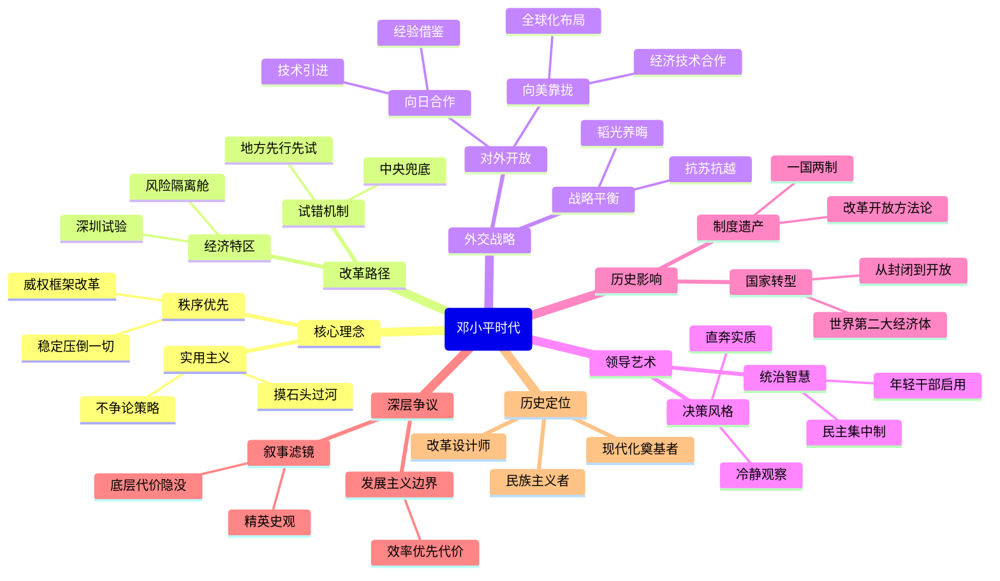

豆瓣链接：https://book.douban.com/subject/20424526/

# 深层解构
我将以「书籍深层解码者」的身份，为你穿透《邓小平时代》的表层叙事。以下解码基于傅高义文本的深层结构分析，结合历史语境与政治哲学视角：

---

### **基石**（作者反复回归的核心信念）
1. **实用主义即最高政治智慧**  
   全书以「猫论」「摸着石头过河」为轴心，构建了邓小平的「方法论神殿」。傅高义暗示：当意识形态僵化时，**搁置主义争议、激活生存本能**才是救赎之道。书中反复出现的「不争论」策略，实为对教条主义的历史性反叛。

2. **秩序先于自由**  
   在改革序列中，邓小平始终将**政治稳定设为不可触碰的底板**。傅高义虽未明言但处处印证：中国转型的本质是**在威权框架内植入市场经济基因**——这个看似矛盾的配方，恰恰是本书理解的「中国奇迹」核心密码。

---

### **边缘**（被轻描淡写却颠覆性的洞见）
1. **「试错权」的隐秘分配机制**  
   书中提及但未深挖的现象：特区实验本质是**将犯错风险局部化**（如「如果深圳失败就填回香港」）。这暗示着改革的核心技术：**在中央权威庇护下建立「风险隔离舱」**，使地方敢为天下先而不致体系崩溃。

2. **意识形态的弹性术**  
   傅高义记录邓小平「让马克思主义退休」的私下言论，却未点破其操作精髓：**通过重新定义概念维系话语连续性**（如「社会主义初级阶段」）。这种**术语的柔术**，实为转型社会的认知润滑剂。

---

### **暗流**（全书依赖却未审视的前提）
1. **「发展主义」的不可证伪性**  
   全书将经济增长视为终极正义，却规避了关键诘问：当「发展」碾压社会公正/生态环境时，**效率至上的合法性边界何在**？这种价值预设使傅高义陷入与传主相同的认知牢笼。

2. **精英史观的隐形滤镜**  
   尽管提及民众苦难（如下岗潮），但决策过程始终呈现为**密室中的技术官僚博弈**。底层成为改革的承受者而非参与者——这种叙事本身就在复刻威权政治的逻辑。

---

### **思维陷阱警示**
⚠️ **因果倒置的诱惑**  
傅高义将1978年后中国崛起归因于个人智慧，却淡化全球产业转移、人口红利等系统性条件。需警惕「英雄史观」对复杂性的简化。

---

### **通向其他世界的暗门**
1. **平行阅读建议**  
   → 结合潘鸣啸《失落的一代》看改革代价  
   → 对照吴国光《改革的政治逻辑》析权力博弈  
   → 参照华尔德《共产党社会的新传统主义》解构组织机制

2. **灵魂拷问**  
   → 若邓小平面对数字时代的舆情生态，其「稳定优先」策略是否依然有效？  
   → 当「摸着石头过河」遭遇深水区（贫富分化/腐败），改革方法论需要何种进化？

---

### **顿悟时刻**
**这本书真正在说**：一个农耕文明如何在威权智慧护航下，以最小制度成本完成工业化惊险跳跃——代价则是将现代性矛盾压缩进时空胶囊，留给未来引爆。

> 傅高义可能没意识到：他对「实用主义」的倾慕，使其淡化了改革中**被牺牲者的无声证词**。当我们在书中读到GDP奇迹时，那些为时代转型支付成本的工人、农民、乃至被碾过的理想主义者，正在字缝里渗出暗红色的问号。

# 章节内容
好的，现在我将根据您提供的书籍《邓小平时代》的内容，为您创作一份详细的读书笔记。

## 邓小平时代 读书笔记

### 导言：这个人以及他的使命

傅高义在导言中，开宗明义地阐述了邓小平对于中国乃至世界历史的深远影响。他认为，要理解当代中国，就必须深入解读邓小平的政治生涯及其行为逻辑。本书旨在通过翔实的史料、研究成果和访谈，对邓小平的一生和中国改革开放之路进行全景式描述，力求呈现一个既符合历史情境又引人深思的邓小平形象。邓小平的改革开放政策不仅深刻改变了中国，也影响了全球格局，理解他，才能更好地理解中国的现在和未来。

### 第一章：革命者、建设者、改革者，1904—1969

本章详细回顾了邓小平从1904年到1969年的人生历程，将其定位为革命者、建设者和改革者。 青年邓小平投身革命，在战争年代表现出卓越的军事才能和坚定的革命意志。建国后，他积极参与经济建设，积累了丰富的执政经验。 然而，在“文革”中，邓小平遭受了政治迫害，这期间的沉浮经历为他后来的改革开放提供了深刻的思考。 邓小平早期的革命和建设生涯，为他日后成为改革开放的总设计师奠定了坚实的基础。

### 第二章：放逐与回归，1969—1974

在1969年至1974年期间，邓小平经历了被放逐和逐渐回归的过程。 在江西的下放劳动，使他对中国社会有了更深刻的认识，也更加坚定了改革的信念。 尽管身处逆境，邓小平始终没有放弃对国家命运的思考，他通过各种方式保持与中央的联系，等待时机。 毛泽东在一定程度上肯定了邓小平的能力，为他日后的复出埋下了伏笔。 邓小平的这段经历充分展现了他坚韧不拔的意志和卓越的政治智慧。

### 第三章：整顿，1974—1975

1974年至1975年，邓小平复出后主持国务院工作，着手进行全面整顿。 他在经济、科技、教育等领域采取了一系列有力措施，试图扭转“文革”造成的混乱局面。 邓小平的整顿触及了“文革”的根本问题，引起了党内保守势力的强烈反弹。 尽管整顿最终未能完全实现，但邓小平的务实作风和改革思路已经开始显现，为后来的改革开放奠定了基础。 此次整顿是邓小平复出后的一次重要尝试，也是他与保守势力的一次正面交锋。

### 第四章：向前看，1975

1975年，尽管面临重重阻力，邓小平仍然坚持“向前看”，强调发展经济和改善人民生活。 他提出了一系列具有前瞻性的思想，例如重视科技和教育，加强国际交流等。 这些思想反映了邓小平对中国未来发展方向的深刻思考，也为后来的改革开放提供了重要的理论指导。 邓小平的“向前看”不仅是一种政治姿态，更是一种对国家和民族未来的责任担当。

### 第五章：靠边站，1976

1976年，由于政治斗争的加剧，邓小平再次被打倒，被迫“靠边站”。 “四五”运动后，邓小平被错误地认为是幕后黑手，失去了政治权力。 尽管身处困境，邓小平始终保持着冷静和清醒，坚信自己的信念是正确的。 这段时期，邓小平的政治生涯再次跌入低谷，但也更加磨砺了他的意志和决心。

### 第六章：复出，1977—1978

1977年至1978年，邓小平在人民的呼唤和党内的支持下，再次复出。 他的复出是人心所向，也标志着中国即将迎来新的历史时期。 邓小平抓住时机，拨乱反正，平反冤假错案，为改革开放创造了有利的政治环境。 邓小平的复出，不仅是他个人命运的转折，更是中国历史的重要转折点。

### 第七章：三个转折点，1978

1978年是具有历史意义的一年，邓小平领导中国迎来了三个重要的转折点。 首先，关于真理标准问题的大讨论，打破了长期以来的思想禁锢，为改革开放奠定了思想基础。 其次，十一届三中全会的召开，确立了以经济建设为中心，实行改革开放的战略决策。 最后，邓小平访问新加坡和泰国，学习了亚洲四小龙的成功经验，为中国经济发展提供了借鉴。 这三个转折点相互关联，共同开启了中国改革开放的新时代。

### 第八章：为自由设限，1978—1979

在推进改革开放的过程中，邓小平也清醒地认识到，必须“为自由设限”。 他强调，改革开放必须坚持社会主义方向，维护社会稳定。 邓小平一方面鼓励思想解放和经济发展，另一方面也坚决反对资产阶级自由化，维护党的领导和社会主义制度。 邓小平的“为自由设限”体现了他对中国国情的深刻理解和对国家命运的责任担当。

### 第九章：苏联—越南的威胁，1978—1979

1978年至1979年，中国面临着来自苏联和越南的威胁。 邓小平果断决策，对越南发动自卫反击战，维护了国家主权和安全。 与此同时，邓小平加强与西方国家的合作，寻求国际支持，共同对抗苏联的扩张。 邓小平的强硬外交和军事行动，为中国改革开放创造了和平稳定的外部环境。

### 第十章：向日本开放，1978

1978年，邓小平推动中日关系正常化，并积极引进日本的资金和技术。 他看到了日本经济发展的成功经验，认为这对中国的现代化建设具有重要的借鉴意义。 邓小平的开放政策，为中国经济发展注入了新的活力，也促进了中日两国的交流与合作。

### 第十一章：向美国开放，1978—1979

1978年至1979年，邓小平实现了中美关系正常化，并积极寻求美国的经济和技术支持。 他看到了美国在经济、科技和教育方面的优势，认为这对中国的现代化建设至关重要。 邓小平的开放政策，为中国融入世界经济体系打开了大门，也为中美两国的合作奠定了基础。

### 第十二章：重组领导班子，1979—1980

1979年至1980年，邓小平着手重组领导班子，提拔了一批具有改革意识和务实精神的干部。 他打破了论资排辈的传统，大胆启用年轻人，为改革开放提供了组织保障。 邓小平的用人策略，为中国政治注入了新的活力，也为改革开放的顺利推进提供了重要支持。

### 第十三章：邓小平的统制术

本章深入分析了邓小平的领导艺术和统治策略。 邓小平善于运用集体的智慧，充分发挥各个方面的积极性。 他强调民主集中制，既尊重多数人的意见，又坚持集中统一领导。 邓小平还非常注重调查研究，深入了解实际情况，为决策提供依据。 邓小平的统制术是他取得成功的重要保证，也是他留给后人的宝贵经验。

### 第十四章：广东和福建的试验，1979—1984

1979年至1984年，邓小平批准在广东和福建设立经济特区，进行改革开放的试验。 经济特区实行特殊的经济政策和管理体制，吸引外资，发展外向型经济。 广东和福建的试验取得了显著成效，为全国的改革开放提供了示范和借鉴。 邓小平的特区战略，是中国改革开放的重要突破，也为中国经济的腾飞奠定了基础。

### 第十五章：经济调整和农村改革，1978—1982

1978年至1982年，中国进行了经济调整和农村改革。 在农村，实行家庭联产承包责任制，极大地提高了农民的生产积极性。 在城市，进行经济体制改革，扩大企业自主权，鼓励发展多种所有制经济。 这些改革措施，为中国经济注入了新的活力，也为后来的全面改革开放奠定了基础。

### 第十六章：加快经济发展和开放步伐，1982—1989

1982年至1989年，中国加快了经济发展和对外开放的步伐。 邓小平提出了“发展才是硬道理”的著名论断，强调以经济建设为中心，不断提高人民生活水平。 他进一步扩大对外开放，吸引更多的外资和技术，推动中国经济融入世界经济体系。 邓小平的战略决策，使中国经济取得了举世瞩目的成就，也为中国崛起奠定了坚实的基础。

### 第十七章：台湾、香港以及西藏问题

邓小平始终关注台湾、香港和西藏问题，并提出了“一国两制”的伟大构想。 他主张通过和平方式解决台湾问题，实现国家统一。 他尊重香港的历史和现实，承诺在香港实行高度自治。 他重视西藏的稳定和发展，改善民族关系，维护国家统一。 邓小平的“一国两制”构想，体现了他对国家统一和民族团结的坚定信念，也为解决类似问题提供了新的思路。

### 第十八章：为军事现代化做准备

邓小平认识到，要维护国家安全和发展利益，必须加强国防建设，实现军队现代化。 他提出，军队要服从服务于经济建设大局，同时也要不断提高战斗力。 邓小平推动军队进行了一系列改革，加强军事训练，提高武器装备水平。 邓小平的军事战略，为中国维护国家主权和安全提供了坚强后盾。

### 第十九章：政治的潮起潮落

本章回顾了邓小平在政治上的沉浮，以及中国政治体制改革的探索。 邓小平既坚持四项基本原则，维护党的领导和社会主义制度，又积极推进政治体制改革，扩大民主，加强法制。 然而，由于种种原因，政治体制改革的步伐相对滞后，未能完全适应经济发展的需要。 邓小平的政治探索，为中国未来的政治发展提供了宝贵的经验和教训。

### 第二十章：北京，1989

1989年春夏之交，北京发生了一场政治风波。 邓小平果断采取措施，平息了事态，维护了社会稳定。 他强调，稳定是压倒一切的，没有稳定，什么事情也干不成。 邓小平的处理方式在国内外引起了争议，但也为中国继续推进改革开放创造了条件。

### 第二十一章：稳住阵脚，1989—1992

1989年至1992年，中国面临着严峻的国内外形势。 邓小平强调，要稳住阵脚，坚持以经济建设为中心，继续推进改革开放。 他提出，要坚定不移地走自己的路，不受外界干扰。 邓小平的稳定政策，为中国度过难关，继续发展奠定了基础。

### 第二十二章：邓小平的终曲：南方之行，1992

1992年，邓小平进行了著名的南方之行。 他在南方发表了一系列重要讲话，强调要解放思想，大胆探索，加快改革开放的步伐。 邓小平的南方之行，为中国改革开放注入了新的动力，也为中国经济的腾飞指明了方向。 邓小平的南方谈话，是他留给中国人民的宝贵精神财富，也激励着一代又一代中国人为实现中华民族伟大复兴而努力奋斗。

### 第二十三章：转型的中国

在本书的最后一章，傅高义总结了邓小平时代对中国的深刻影响。 邓小平的改革开放政策，使中国从一个贫穷落后的国家，发展成为世界第二大经济体。 中国人民的生活水平得到了极大的提高，综合国力显著增强。 邓小平不仅改变了中国，也影响了世界。 傅高义认为，邓小平是中国历史上最伟大的领导人之一，他的思想和legacy将继续影响着中国和世界。

### 邓小平的历史地位

邓小平毫无疑问对中国和世界产生了深远的影响。他所提倡的改革开放政策，使中国经济得到了前所未有的发展，人民生活水平显著提高。尽管他的政治生涯也伴随着争议，但不可否认的是，他为中国的现代化建设奠定了坚实的基础。他的“一国两制”构想，为解决历史遗留问题提供了新的思路。邓小平的历史地位是复杂而多面的，需要全面、客观地评价。

Citations:
[1] https://book.douban.com/subject/20424526/

---
来自 Perplexity 的回答: pplx.ai/share