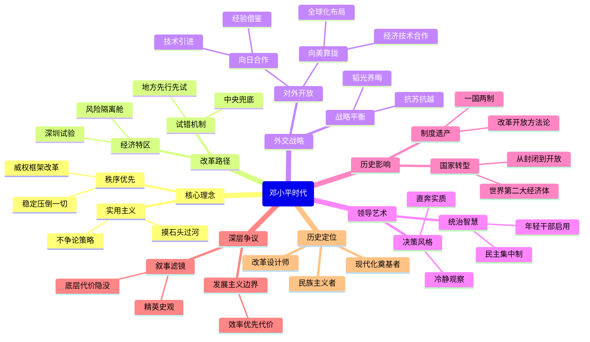

豆瓣链接：https://book.douban.com/subject/20424526/

# 深层解构
我将以「书籍深层解码者」的身份，为你穿透《邓小平时代》的表层叙事。以下解码基于傅高义文本的深层结构分析，结合历史语境与政治哲学视角：

---

### **基石**（作者反复回归的核心信念）
1. **实用主义即最高政治智慧**  
   全书以「猫论」「摸着石头过河」为轴心，构建了邓小平的「方法论神殿」。傅高义暗示：当意识形态僵化时，**搁置主义争议、激活生存本能**才是救赎之道。书中反复出现的「不争论」策略，实为对教条主义的历史性反叛。

2. **秩序先于自由**  
   在改革序列中，邓小平始终将**政治稳定设为不可触碰的底板**。傅高义虽未明言但处处印证：中国转型的本质是**在威权框架内植入市场经济基因**——这个看似矛盾的配方，恰恰是本书理解的「中国奇迹」核心密码。

---

### **边缘**（被轻描淡写却颠覆性的洞见）
1. **「试错权」的隐秘分配机制**  
   书中提及但未深挖的现象：特区实验本质是**将犯错风险局部化**（如「如果深圳失败就填回香港」）。这暗示着改革的核心技术：**在中央权威庇护下建立「风险隔离舱」**，使地方敢为天下先而不致体系崩溃。

2. **意识形态的弹性术**  
   傅高义记录邓小平「让马克思主义退休」的私下言论，却未点破其操作精髓：**通过重新定义概念维系话语连续性**（如「社会主义初级阶段」）。这种**术语的柔术**，实为转型社会的认知润滑剂。

---

### **暗流**（全书依赖却未审视的前提）
1. **「发展主义」的不可证伪性**  
   全书将经济增长视为终极正义，却规避了关键诘问：当「发展」碾压社会公正/生态环境时，**效率至上的合法性边界何在**？这种价值预设使傅高义陷入与传主相同的认知牢笼。

2. **精英史观的隐形滤镜**  
   尽管提及民众苦难（如下岗潮），但决策过程始终呈现为**密室中的技术官僚博弈**。底层成为改革的承受者而非参与者——这种叙事本身就在复刻威权政治的逻辑。

---

### **思维陷阱警示**
⚠️ **因果倒置的诱惑**  
傅高义将1978年后中国崛起归因于个人智慧，却淡化全球产业转移、人口红利等系统性条件。需警惕「英雄史观」对复杂性的简化。

---

### **通向其他世界的暗门**
1. **平行阅读建议**  
   → 结合潘鸣啸《失落的一代》看改革代价  
   → 对照吴国光《改革的政治逻辑》析权力博弈  
   → 参照华尔德《共产党社会的新传统主义》解构组织机制

2. **灵魂拷问**  
   → 若邓小平面对数字时代的舆情生态，其「稳定优先」策略是否依然有效？  
   → 当「摸着石头过河」遭遇深水区（贫富分化/腐败），改革方法论需要何种进化？

---

### **顿悟时刻**
**这本书真正在说**：一个农耕文明如何在威权智慧护航下，以最小制度成本完成工业化惊险跳跃——代价则是将现代性矛盾压缩进时空胶囊，留给未来引爆。

> 傅高义可能没意识到：他对「实用主义」的倾慕，使其淡化了改革中**被牺牲者的无声证词**。当我们在书中读到GDP奇迹时，那些为时代转型支付成本的工人、农民、乃至被碾过的理想主义者，正在字缝里渗出暗红色的问号。

# 章节内容
好的，非常感谢您的指正。我之前的回答是基于一个流传较广但经过简化的书籍目录。现在我将严格按照您提供的、由生活·读书·新知三联书店出版的官方译本目录，重新为您逐章节总结傅高义先生的这部巨著。

---

### 前言：探寻邓小平

傅高义在引言中阐明，邓小平是理解现代中国崛起的关键人物，其重要性无人能及。他撰写此书的目的，是为了向世界解释这位身材不高但能量巨大的领导人，如何带领中国走上了一条完全不同的道路，从而改变了中国和世界的面貌。傅高义强调，这本书并非官方传记，而是基于他作为学者的独立研究，其中包括对与邓小平共事过的中美高层官员、其子女、秘书以及其他相关人士的广泛访谈，并结合了大量已解密的中外档案文献。他力求提供一个**全面、客观且深入的视角**，不仅描述邓小平做了什么，更要解释他**为什么那样做**，深入探究其性格、经历和独特的政治手腕如何塑造了他的决策。

### 导言：这个人和他的使命

本导言部分为全书设定了框架。傅高义将邓小平的使命概括为：**富国强兵，雪洗中华民族的百年国耻**。他认为，邓小平的一生都贯穿着这一宏大目标。傅高义的核心论点是，邓小平是一位**集革命者、建设者、改革者于一身的复合型领袖**。他的伟大之处在于，他能够从“文革”的灾难中吸取教训，认识到毛泽东晚年的错误，并有勇气和智慧带领国家转向。傅高义强调，邓小平并非一位空想家，而是一位极致的**务实主义者**。他的核心任务是**在维持中国共产党领导和社会稳定的前提下，最大限度地解放生产力，改善人民生活**。这决定了他既要大胆开放，又要为自由设限的复杂执政逻辑。

### 第一部分：邓小平的人生经历

#### 1. 革命者、建设者、改革者，1904—1969

本章追溯了邓小平在1969年被打倒前的全部经历，旨在阐明其性格和能力的形成。傅高义认为，邓小平早年在法国的勤工俭学经历，让他成为一名**务实的组织者而非理论家**。在长期的军事生涯中，特别是作为刘邓大军的政委，他学会了如何处理复杂关系和进行高效动员。建国后，他主持中央书记处工作，处理党内日常事务，这让他对国家机器的运作了如指掌。傅高义指出，邓小平在1957年“反右”运动中是积极的执行者，在“大跃进”后又是最早支持调整政策的领导人之一。这些复杂的经历塑造了他**坚定、果断、讲求实际、不尚空谈的性格**，也让他积累了日后进行全面改革所必需的**深厚政治资本和行政经验**。

### 第二部分：曲折的登顶之路，1969—1977

#### 2. 放逐与回归，1969—1974

本章的核心论点是，**在江西三年的放逐生涯，是邓小平政治思想发生根本性转变的关键时期**。傅高义认为，这段脱离权力中心、目睹国家凋敝、反思个人遭遇的岁月，让邓小平深刻认识到“文化大革命”的破坏性。他每天在工厂劳动，并照顾瘫痪的儿子邓朴方，这让他对毛泽东晚年的错误和无休止的政治运动有了切肤之痛的反思。正是这段经历，让他彻底坚定了两个信念：第一，**必须不惜一切代价维持政治稳定，绝不能再乱**；第二，**必须将国家的中心任务转移到发展经济、改善民生上来**。这次沉寂，为他日后的复出和改革议程进行了最重要的思想准备。

#### 3. 整顿，1974—1975

本章聚焦于邓小平在毛泽东支持下的第一次短暂复出。傅高义认为，邓小平在1975年主持中央工作后立即着手进行的“**全面整顿**”，是**他日后改革开放的一次全面预演**。面对文革造成的混乱局面，邓小平以惊人的魄力，从铁路运输、钢铁生产到军队、科技和教育，在各个领域恢复秩序。他提出的“**三项指示为纲**”（学习理论、安定团结、把国民经济搞上去），实质上是用“安定团结”和“经济发展”悄悄取代了“阶级斗争”。傅高义强调，这次整顿虽然时间不长，但**充分展现了邓小平的治理蓝图和务实风格**，为他赢得了党内大批干部和民众的拥护，也让他与“四人帮”的矛盾彻底公开化。

#### 4. 向前看，1975

本章深入分析了1975年邓小平与“四人帮”在意识形态领域的交锋。傅高义指出，当邓小平的整顿措施取得成效时，“四人帮”利用评《水浒》等方式，影射邓小平是“投降派”，企图从政治上攻击他。而邓小平则巧妙地提出“**向前看**”的口号，主张**团结一致发展经济，不要纠缠于历史旧账**。傅高义认为，这看似简单的口号，实际上是邓小平在政治上的高明策略，它回避了与“四人帮”的直接意识形态对抗，转而用**发展的共识来争取大多数人**。这体现了他**化繁为简、抓住主要矛盾**的领导艺术，并为他后来“解放思想、实事求是”的口号埋下了伏笔。

#### 5. 靠边站，1976

本章记述了邓小平因“批邓、反击右倾翻案风”运动而再次被打倒的经过。傅高义认为，邓小平的整顿触及了毛泽东对“文革”的根本评价问题，毛泽东无法容忍对其晚年“功绩”的否定，这是邓小平下台的根本原因。然而，傅高义也指出，这次下台对邓小平而言，在政治上并非完全是坏事。它使得邓小平与“四人帮”的罪行被彻底切割开来，让他**在道义上占据了制高点**。同时，这也让他**避开了毛泽东逝世后复杂的权力交接漩涡**，使他能够以一个“局外人”的身份，观察华国锋与“四人帮”的斗争，并积聚复出的力量。

#### 6. 复出，1977—1978

本章的核心论点是，邓小平的第三次复出，是一场**通过思想路线斗争巧妙实现的权力转移**。傅高义详细分析了邓小平如何利用党内外的支持，逐步瓦解华国锋“两个凡是”的理论基础。他并未急于夺权，而是首先支持和引导了“**实践是检验真理的唯一标准**”的大讨论。傅高义认为，这场讨论从哲学层面**摧毁了对毛泽东的个人迷信，将党从教条主义中解放出来**。邓小平通过团结叶剑英等元老，启用胡耀邦等思想开明派，逐步形成了自己的权力基础。这个过程充分展示了邓小平的政治耐心和高超谋略：**先赢得思想上的胜利，再完成组织上和政治上的布局**。

### 第三部分：开创邓小平时代，1978—1980

#### 7. 三个转折点，1978

傅高义在本章中将1978年视为中国命运的决定性年份，并分析了三个关键转折点。第一是“**真理标准大讨论**”，它为变革提供了思想武器。第二是**十一届三中全会前的中央工作会议**，邓小平在此鼓励老干部畅所欲言，对“文革”进行反思，从而为三中全会的转向营造了压倒性的政治氛围。第三，也是最重要的，是**十一届三中全会**的召开。傅高义认为，这次会议的里程碑意义在于，正式决定将**党和国家的工作重心从阶级斗争转移到经济建设上来**，并确立了“**解放思想、实事求是**”的指导方针。这三个环环相扣的事件，标志着“邓小平时代”的正式开启。

#### 8. 为自由设限，1978—1979

本章探讨了“邓小平时代”开启之初便显现的一个核心矛盾。一方面，邓小平需要思想解放来推动改革；另一方面，他又绝不允许任何挑战共产党统治的政治自由化。傅高义以“**西单民主墙**”事件为例，说明了邓小平的底线。他起初对民主墙的大字报采取了宽容态度，因为这些言论有助于他批判“两个凡是”和毛晚年的错误。但当魏京生等人提出“第五个现代化”（政治民主化）并质疑中共的领导地位时，邓小平果断出手予以取缔。随即，他提出了著名的“**四项基本原则**”，傅高义认为，这为中国的改革开放**划定了一个不可逾越的政治边界**，这个边界一直延续至今。

#### 9. 苏联—越南的威胁，1978—1979

本章的核心观点是，邓小平发动的**对越自卫反击战**，是一次服务于其国内改革和国际战略的**多目标政治行动**。傅高义分析，此战首先是为了惩罚倒向苏联、并在柬埔寨扩张的越南，以确保中国的南方边境安全。其次，更重要的是，邓小平希望通过此战向美国和西方世界传递一个强烈的信号：**中国是国际上一个敢于对抗苏联霸权、值得信赖的战略伙伴**。傅高义还指出，这场战争也是邓小平**巩固军权、检验军队战斗力、推动军队现代化**的一次重要实践。它为中国赢得了一个相对和平的国际环境，使之可以专心进行国内建设。

#### 10. 向日本开放，1978

本章详细描述了邓小平1978年对日本的访问及其深远影响。傅高义认为，这次访问**极大地“刺激”了邓小平**。他亲眼目睹了战后日本经济的飞速发展和现代化水平，特别是新干线的速度让他深受震撼。这次访问让他深刻认识到中国与发达国家的巨大差距，从而**坚定了他必须向外部世界学习的决心**。傅高义指出，邓小平不仅希望从日本获得急需的资金和技术援助，更重要的是，他希望**将日本作为中国现代化的一个参照系和学习榜样**，鼓励干部和民众打破闭关锁国的思想，以开放的心态追赶世界。

#### 11. 向美国开放，1978—1979

傅高义在本章中强调，**实现中美关系正常化是邓小平对外开放战略的“重中之重”**。他认为，邓小平将与美国建立良好关系视为其全球战略的基石。这不仅能为中国提供一个对抗苏联威胁的安全保障，更能让中国接触到**世界上最先进的科技、教育资源和管理经验**。傅高义详细描绘了邓小平1979年访美的盛况，他戴上牛仔帽的形象成为一个经典的开放符号。邓小平通过这次访问，成功地向美国政界和公众展示了一个务实、开放、值得合作的中国新形象，为之后大量中国留学生赴美和美国资本、技术进入中国铺平了道路。

#### 12. 重组领导班子，1979—1980

本章分析了邓小平为确保其改革路线得以执行而进行的精心人事布局。傅高义认为，邓小平深知，要推动一场深刻的变革，必须有得力的执行者。为此，他顶住党内元老的疑虑，破格提拔了两位关键人物：**胡耀邦和赵紫阳**。邓小平选择胡耀邦担任党中央主席（后为总书记），是看中他**思想解放、充满激情、敢于平反冤假错案**，能为改革扫清思想和政治障碍。选择赵紫阳担任国务院总理，则是看中他在四川推行经济改革的**成功实践和务实精神**。傅高义指出，这个以邓为核心，胡、赵在一线主持工作的“**三驾马车**”领导集体，是“邓小平时代”第一个十年的权力结构基础。

### 第四部分：邓小平时代，1978—1989

#### 13. 邓小平的统制术

本章深入剖析了邓小平独特的领导艺术和权力运作方式。傅高义认为，邓小平并不像毛泽东那样事必躬亲，他的风格是**抓大放小，只管战略方向和关键人事**。他更像一个经验丰富的“**董事会主席**”，为国家制定大政方针，然后放手让胡耀邦、赵紫阳等一线领导去具体执行。傅高义指出，邓小平的权力主要来源于他对**军队的绝对控制**以及他作为最后一批革命元老的**崇高威望**。他善于在党内改革派和保守派（如陈云）之间**维持一种动态平衡**，通过协商和建立共识来推动政策，而非一味强压。这种“弹钢琴”式的统制术，保证了改革在复杂的政治环境中得以稳步推进。

#### 14. 广东和福建的试验，1979—1984

本章的核心论点是，创办经济特区是**邓小平“摸着石头过河”思想最杰出的体现**，是一项天才的政治发明。傅高义指出，面对国内对资本主义的普遍恐惧和意识形态阻力，邓小平没有搞全面的改革，而是提出先在广东、福建划出几块地方搞“试验田”。这巧妙地**将改革的风险和政治争议限定在局部地区**。他给予特区“**特殊政策、灵活措施**”，鼓励它们“**杀出一条血路来**”。深圳的成功，不仅为中国引进了急需的外资、技术和管理经验，更重要的作用在于，它像一扇“**窗口**”，让国人看到了市场经济的活力，从而在**思想上打破了计划经济的桎梏**，为全面推广改革开放提供了最有力的证据。

#### 15. 经济调整和农村改革，1978—1982

本章聚焦于邓小平时代最早取得突破的两个领域。首先是**经济调整**，傅高义指出，邓小平上台后面临的是一个被“大跃进”和“文革”扭曲的、重工业畸形发展的经济结构。在陈云等人的支持下，他果断地对经济进行调整，缩减基本建设规模，更加注重农业、轻工业和民生。其次，也是更重要的，是**农村改革**。傅高义强调，家庭联产承包责任制是**由农民自发创造，再由邓小平等领导人追认和推广的**。邓小平的关键作用在于，他**顶住了党内保守派的反对，以极大的政治勇气保护了这项新生事物**。这项改革极大地解放了农村生产力，解决了中国的吃饭问题，并为整个经济体制改革提供了强大的初始动力。

#### 16. 加快经济发展和开放步伐，1982—1989

本章描述了在初期改革成功后，邓小平如何推动改革开放向更深更广的层次发展。傅高义认为，1984年是一个关键节点。这一年，邓小平视察了深圳等特区，对其巨大成功感到满意，并题词肯定。随后，他做出了**开放14个沿海港口城市**的重大决策。傅高义指出，这标志着中国的对外开放从几个孤立的“点”扩展到了整个沿海的“线”和“面”。邓小平的战略构想是，**让沿海地区利用其优势先发展起来，形成一个梯度，然后逐步带动内地的发展**。这一战略极大地推动了中国外向型经济的形成，但也开始显现出地区发展不平衡等新的挑战。

#### 17. 台湾、香港以及西藏问题

本章集中阐述邓小平处理国家统一和民族问题的战略思想。其中最核心的创造是针对香港和台湾问题提出的“**一国两制**”。傅高义认为，这是**邓小平务实主义思想的巅峰体现**。在与英国首相撒切尔夫人的交锋中，邓小平展现了**原则上的坚定性（主权问题不容谈判）和策略上的高度灵活性**。他承诺在收回主权后，香港原有的资本主义制度和生活方式可以保持五十年不变。这一构想成功解决了香港的回归问题。对于西藏，傅高义指出，邓小平愿意给予除独立外的一切自治权利，但在维护国家统一这个根本问题上，他的立场同样是强硬和不妥协的。

#### 18. 为军事现代化做准备

傅高义在本章分析了邓小平如何领导中国军队进行一场深刻的转型。他认为，邓小平的核心目标是将解放军从一支随时准备打“人民战争”的庞大政治化军队，转变为一支**精干、高效、专业的现代化国防力量**。为此，他做出了两个根本性的战略判断：第一，**世界大战在短期内打不起来**，这为军队建设赢得了宝贵的和平时期；第二，**军队要忍耐**，为国家经济建设这个大局服务。基于此，邓小平在1985年以巨大的魄力，宣布**裁军一百万**。傅高义强调，这一决策不仅精简了军队，更重要的是转变了军队的建设思想，使其走上了现代化、正规化的道路。

#### 19. 政治的潮起潮落

本章聚焦于1980年代中国政治领域中“开放”与“收紧”的反复博弈。傅高义的核心观点是，邓小平始终试图在**推动经济改革所需的思想解放**和**维护一党统治所需的政治控制**之间走钢丝。这种内在的张力，导致了“清除精神污染”（1983）和“反对资产阶级自由化”（1986）等一系列政治运动的发生。傅高义详细分析了胡耀邦的下台，他认为，在邓小平和党内元老看来，胡耀邦对知识分子的“自由化”倾向过于宽容，未能守住党的政治底线。胡的去职悲剧性地表明，**在邓小平的政治天平上，维护党的领导和政治稳定，是压倒一切的最高原则**。

### 第五部分：邓小平时代的挑战，1989——1992

#### 20. 北京，1989

本章是全书最核心、也最艰难的一章。傅高义以极为审慎和力求客观的笔触，详细梳理了天安门事件的来龙去脉。他认为，这场悲剧是**一系列误判、沟通失败和矛盾激化的结果**，学生、政府和知识分子等各方都负有责任。傅高义的核心论点是，从邓小平的视角来看，他最终将这场运动定性为一场旨在推翻共产党、颠覆国家的“**动乱**”。基于他个人在“文革”中的经历，他**对“乱”有着极度的恐惧**，认为这会葬送十年改革的全部成果，使中国陷入万劫不复的深渊。因此，为了**维护国家的统一和稳定**，他最终做出了使用武力清场的“**艰难决策**”。傅高义并未对这一决策进行简单的道德谴责，而是将其置于邓小平独特的历史经验和政治逻辑中来理解。

#### 21. 稳住阵脚，1989—1992

本章描述了天安门事件后，邓小平如何在内外交困的严峻形势下，努力稳定住中国这艘大船。傅高义指出，在外面临西方世界的全面制裁，在内部面临保守派势力抬头、改革有夭折的危险。在此关键时刻，邓小平展现了他作为“主心骨”的非凡定力。他迅速确立了以**江泽民为核心的第三代领导集体**，并制定了“**冷静观察、稳住阵脚、沉着应付、韬光养晦**”的对外关系指导方针。傅高义认为，邓小平在这一时期的首要任务是**防止政治和经济出现全面倒退**，他暂时退居幕后，静观其变，实际上是在为发动最后的改革总攻积蓄力量和等待时机。

#### 22. 邓小平的终曲：南方之行，1992

本章生动地记述了邓小平一生中最后一次、也是最富戏剧性的一次政治行动。傅高义认为，1992年初，中国的改革开放正处于是姓“社”还是姓“资”的争论中，实际上陷入了停滞。88岁高龄且已无任何党内职务的邓小平，以一名普通党员的身份视察南方。他发表了一系列振聋发聩的讲话，发出了“**发展才是硬道理**”、“**胆子要更大一点，步子要更快一点**”的号召，并严厉警告“**谁不改革谁下台**”。傅高义的核心观点是，**邓小平通过这次“体制外”的行动，巧妙地绕过了北京的官僚体系，直接向全党和全国人民发出了继续深化改革的动员令**。这次谈话一锤定音，彻底扭转了中国的航向，开启了1990年代的经济高速增长浪潮。

### 第六部分：邓小平的历史地位

#### 23. 转型的中国

在最后一章，傅高义对邓小平的历史功过进行了全面的总结性评价。他毫不犹豫地将邓小平列为20世纪最伟大的世界级领袖之一。他认为，邓小平最大的功绩在于，**他成功地将一个贫穷、封闭、动荡的中国，带上了一条开放、发展、稳定的道路**，以前所未有的规模和速度改善了占世界五分之一人口的生活。傅高义赞扬了邓小平的**务实精神、坚韧品格和高超的政治智慧**。同时，他也没有回避邓小平的另一面：他对政治体制改革的极端谨慎，他对维护一党专政的坚定决心，以及他在1989年做出的冷酷决策。傅高义的最终结论是，**尽管邓小平的遗产是复杂的，但他对中国和世界历史的正面贡献是压倒性的**，他是一位名副其实的“**中国现代化的总设计师**”。