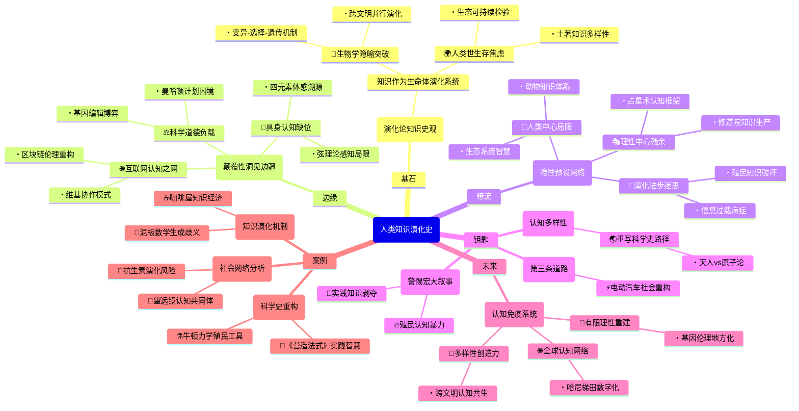

豆瓣链接：https://book.douban.com/subject/36638525/

# 深层解构

### 一、基石：演化论视角下的知识史观
作者构建全书的核心支点，是将**知识视为生命体般的演化系统**。这一信念贯穿始终：
1. **生物学隐喻的学术突破**  
   摒弃传统“线性进步”或“范式革命”模型，借鉴进化生物学的**变异-选择-遗传**机制解释知识发展。例如：  
   - 古代美索不达米亚的数学算法（如泥板文书中的几何计算）是知识“变异”的原始样本；  
   - 文艺复兴时期伽利略对望远镜的改进，是特定社会需求（如航海导航）对知识“选择”的结果；  
   - 牛顿力学体系的全球传播，则是知识“遗传”（跨代际传递）的典型案例。  
   这种视角打破了“科学仅起源于西方”的固有认知，将古埃及、中国、伊斯兰文明的知识体系视为并行演化的分支。

2. **人类世的生存焦虑**  
   作者反复回归的另一核心命题是：**科学知识必须从“象牙塔”走向“生存竞技场”**。在气候危机、生物多样性丧失等人类世挑战下，知识的价值不再仅由学术共同体评判，而需接受**生态可持续性**与**社会正义**的双重检验。例如：  
   - 批判19世纪工业革命时期“知识无禁区”的盲目乐观，指出其导致的环境破坏本质是“认知演化的滞后”；  
   - 强调土著民族的地方性知识（如亚马逊雨林的植物药用体系）是应对现代危机的关键“认知多样性”资源。

### 二、边缘：被轻拂的颠覆性洞见
1. **互联网作为“全球认知之网”的未竟潜力**  
   作者在结语中提出“构建全人类共同的认知之网”，但仅将其视为技术工具。事实上，这一设想隐含**去中心化知识生产**的革命可能：  
   - 维基百科式的协作模式已颠覆传统学术出版霸权，但作者未深入讨论其对“权威知识”的解构；  
   - 区块链技术可实现知识贡献的透明化追踪，或许能重构“知识产权”的伦理基础——这些技术与哲学的交叉点，是书中未展开的思想边疆。

2. **科学的“道德负载”与技术政治**  
   书中多次追问“科学是否应承担道德责任”，但论述停留在宏观层面。事实上，每个具体科研项目都嵌入权力结构：  
   - 二战期间曼哈顿计划的科学家是否预见到核威慑的伦理困境？这种“知识生产的非意图后果”，需引入科学技术研究（STS）的微观分析；  
   - 当代基因编辑技术（如CRISPR）的全球监管争议，本质是不同文明价值观对“知识应用边界”的博弈——作者若深入此类案例，可揭示知识演化中的文化冲突维度。

3. **认知科学与具身认知的缺席**  
   作者虽提及“心智模型”与“外部表征”，但未触及近年认知科学的前沿：**身体经验对知识建构的决定性作用**。例如：  
   - 古希腊“四元素说”可能源于对火、水、土、气的体感认知，而非纯粹理性推导；  
   - 现代物理学中的“弦理论”难以可视化，是否因人类感知器官的演化局限？这些议题可打通生物学与认识论，为知识演化提供更具张力的解释框架。

### 三、暗流：未被审视的假设网络
1. **“演化=进步”的隐性预设**  
   作者将知识演化类比生物进化，但生物学中的“演化”本无方向性，而书中字里行间仍隐含“从简单到复杂、从局部到全球”的进步叙事。例如：  
   - 把17世纪科学革命视为“认知演化的飞跃”，可能忽视同时期殖民扩张对非西方知识体系的破坏；  
   - 假设“全球化知识网络”必然导向更优解，却未讨论信息过载、算法偏见等现代性病症可能阻碍认知演化。

2. **“理性中心主义”的残余**  
   尽管强调地方性知识的价值，作者仍将“科学”定义为“系统化的理性知识”，暗含对“非理性知识”（如宗教、神话）的认知贬低。例如：  
   - 印度古代天文学与占星术的交织，并非“科学与迷信的混合”，而是特定文明对宇宙秩序的独特认知框架；  
   - 中世纪欧洲修道院的抄经活动，不仅保存了古希腊文献，其宗教仪式本身也是一种知识生产方式——这些被排除在“科学史”之外的领域，可能藏着理解知识演化的关键钥匙。

3. **对“人类中心主义”的温和批判**  
   全书聚焦“人类知识”，但在“人类世”背景下，是否应重新审视“非人类主体”的认知贡献？例如：  
   - 蜜蜂的舞蹈语言、黑猩猩的工具使用，是否构成另类“知识体系”？  
   - 生态系统的自我调节机制，是否可视为一种超越人类理性的“智慧”？  
   作者虽未直接否定这些可能，但论述始终以人类为中心，这一视角局限或许正是“人类世困境”的认知根源之一。

### 四、给读者的三把钥匙
1. **用“认知多样性”重写科学史**  
   放下“寻找科学起源”的执念，转而关注不同文明如何通过独特的“认知适配”解决生存问题。例如：  
   - 对比古中国“天人合一”的整体思维与古希腊原子论的还原思维，二者并非“落后与先进”的对立，而是应对不同环境挑战的演化策略。

2. **在技术乐观与悲观间寻找第三条路**  
   拒绝“技术拯救论”与“反技术主义”的二元对立，关注知识演化的**路径依赖性**。例如：  
   - 电动汽车的普及不仅是技术问题，更涉及能源分配、劳工权益等社会认知的重构——真正的“认知之网”需编织技术、伦理、文化的多重维度。

3. **警惕“大叙事”的认知暴力**  
   作者虽试图构建全球知识史框架，但任何“宏大叙事”都可能遮蔽边缘声音。建议在阅读时不断追问：  
   - 书中提到的“知识全球化”，是否隐含着欧洲殖民扩张的血与火？  
   - 被归为“实践知识”的农业、手工艺传统，是否曾被系统性地剥夺知识话语权？  

### 结语：当知识史成为生存指南
这本书的真正价值，不在于提供一个完美的知识演化模型，而在于迫使我们直面一个根本问题：**在人类世，我们需要怎样的“认知免疫系统”？**  
作者给出的药方是“构建包容性的认知网络”，但或许更重要的启示是：知识演化的终极动力，从来不是单一文明的理性突破，而是不同认知体系在碰撞、共生中迸发的创造力。正如热带雨林的繁茂源于物种多样性，人类文明的存续，可能依赖于我们能否学会倾听石头、河流、星辰，以及那些被遗忘的“非科学”知识的低语。

# 章节内容
### 推荐序（张柏春）  
中国科学院自然科学史研究所原所长张柏春指出，本书突破了西方中心主义的科学史叙事，以“人类世”为框架重新理解知识演化的全球性。通过力学、农业等具体案例，揭示科学知识与社会制度的共生关系，强调地方性知识的创造性对人类存续的意义，为应对环境危机提供历史镜鉴。

### 中文版序（于尔根·雷恩）  
作者特别阐释本书对中国读者的意义：通过比较中国与西方科学传统（如宋代沈括的《梦溪笔谈》与伽利略力学），揭示知识演化的跨文化共性。雷恩强调，中国历史上“知行合一”的实践传统，恰为人类世所需的“知识与环境契合”提供了历史经验，呼吁以开放的认知网络整合多元知识。

### 本书的故事  
雷恩回溯30年研究历程，以马普科学史研究所的“力学史”项目为切入点，讲述如何从伽利略手稿的微观分析，拓展至全球知识演化的宏观框架。核心发现：知识变革并非依赖天才独创，而是通过“实践知识的概念重组”（如中世纪工匠技术与亚里士多德哲学的融合），在社会网络中缓慢演进。这一过程充满偶然与歧义，而非库恩式的范式断裂。

### 第一部分：什么是科学？什么是知识？  
#### 第一章 人类世的科学史  
**核心论点**：人类世的地质危机本质是“知识危机”——科学知识的权力扩张远超其社会控制能力。雷恩批判“科学中立性”神话，指出牛顿力学不仅是理论突破，更是殖民时代资源掠夺的知识工具。案例：19世纪地质学家将“全新世”定义为人类与自然和谐的时代，实为掩盖工业革命对生态的破坏，凸显知识的意识形态属性。

#### 第二章 人类知识历史理论的要素  
**核心框架**：提出“知识包”（松散的知识集合）与“生成性歧义”概念。以美索不达米亚泥板数学为例，同一公式在祭司（天文预测）与工匠（建筑测量）手中产生不同解读，这种歧义性推动知识创新。雷恩反对库恩的“不可通约性”，认为新旧知识通过“边界问题”（如伽利略用几何解释落体）实现渐进整合。

### 第二部分：知识结构如何变化  
#### 第三章 抽象与表征的历史性质  
**核心主张**：抽象知识并非先天存在，而是社会建构的产物。以希腊几何为例，欧几里得公理体系的“纯粹性”，实则是排斥工匠实践（如土地测量经验）的结果。对比中国《九章算术》的“问题导向”，揭示不同文明对“抽象”的差异化路径——西方追求脱离语境的普适性，东方保留情境化的实用性。

#### 第四章 知识系统中的结构性变化  
**机制分析**：知识变革源于“挑战性对象”（如望远镜观测的木星卫星）对既有框架的冲击。以哥白尼革命为例，雷恩推翻“日心说因证据不足被压制”的传统叙事，指出真正阻力是托勒密体系与教会历法、航海技术的深度绑定，知识系统的韧性源于社会网络的支撑。

#### 第五章 作用中的外部表征  
**物质维度**：知识依赖媒介演化。以中世纪修道院手抄本为例，羊皮纸的稀缺性迫使学者提炼亚里士多德文本的“核心命题”，意外促成经院哲学的抽象化。对比宋代活字印刷术，印刷成本降低使沈括能记录更多“地方性知识”（如石油用途），展现媒介如何塑造知识形态。

#### 第六章 作用中的心智模型  
**认知视角**：通过实验心理学重构历史认知。分析伽利略的“思想实验”（如比萨斜塔落体），发现其本质是将工匠的“试错经验”转化为可传播的心智模型。雷恩提出“具身认知”假说：牛顿的“绝对时空”想象，可能源于其童年对钟表机械（身体感知时间）的观察。

#### 第七章 科学革命的本质  
**反驳库恩**：所谓“科学革命”实为“知识经济转型”。以17世纪伦敦皇家学会为例，会员通过咖啡屋网络共享航海数据（如气压测量），将分散的实践知识整合为系统理论。雷恩强调，革命的标志不是理论颠覆，而是知识生产模式的制度化——学会的“同行评议”取代了宫廷赞助的偶然性。

### 第三部分：知识结构与社会如何相互影响  
#### 第八章 知识经济  
**概念定义**：知识经济是“知识生产、分配、消费的社会关系”。以古埃及为例，尼罗河泛滥的周期性催生历法知识，祭司通过垄断历法获得税收权力，形成“知识-权力”共生体。对比19世纪德国大学改革，洪堡将科学研究纳入教育体系，使知识生产从贵族赞助转向国家投资，奠定现代科研体制。

#### 第九章 实践知识的经济  
**被忽视的传统**：以宋代《营造法式》为例，李诫记录的建筑模数制（材份制），本质是工匠群体通过“试错-模仿”形成的实践知识体系。雷恩批判“理论优越论”，指出瓦特蒸汽机的关键改进（分离冷凝器）源于工匠博尔顿的经验，而非热力学理论指导，实践知识是技术创新的底层动力。

#### 第十章 历史上的知识经济  
**跨文明比较**：伊斯兰黄金时代（8-13世纪）的知识经济——巴格达智慧宫通过翻译运动整合希腊、印度知识，商人群体（如犹太香料商人）资助天文观测以优化航海路线，形成“贸易-知识”循环。对比同时期欧洲修道院，知识被禁锢于宗教典籍，凸显社会需求对知识演化的决定性作用。

### 第四部分：知识如何传播  
#### 第十一章 历史上的知识全球化  
**案例分析**：16世纪耶稣会士将中国算盘技术传入欧洲，引发算术教学革命；同时，欧洲火炮技术经澳门传入明朝，徐光启试图融合中西弹道知识。雷恩揭示全球化的悖论：知识传播伴随权力争夺（如历法改革成为殖民合法性工具），但地方适应性（如日本和算对中国算法的改造）保留了多元创新可能。

#### 第十二章 自然科学的多种渊源  
**解构西方中心论**：印度数学家婆什迦罗的“无穷小”思想早于牛顿莱布尼茨；阿拉伯学者比鲁尼的地质学观察（岩层化石）挑战亚里士多德创世说。雷恩强调，现代科学是“全球知识网络的产物”，而非欧洲独有成就，中国炼丹术对化学的影响、玛雅历法对天文学的贡献均被长期忽视。

#### 第十三章 认知网络  
**方法论创新**：引入社会网络分析，重构科学革命图景。以17世纪“望远镜网络”为例，伽利略、开普勒通过信件交换观测数据，形成跨地域的“认知共同体”。节点人物（如梅森神父）的中介作用，使分散的知识碎片（如木星卫星、太阳黑子）最终整合为新宇宙观，证明知识创新依赖网络结构而非个体天才。

### 第五部分：我们的未来依赖何种知识  
#### 第十四章 认知演化  
**演化生物学视角**：知识演化遵循“变异-选择-遗传”机制。以抗生素研发为例，弗莱明的偶然发现（变异），经药企筛选（选择），最终成为标准化疗法（遗传）。雷恩警告，当前知识系统过度依赖“技术加速”（如AI的黑箱决策），可能丧失演化所需的多样性，导致系统性风险。

#### 第十五章 “出全新世记”  
**地质隐喻**：借用《圣经》出埃及记，喻指人类需摆脱“全新世”（Holocene）的知识路径依赖。以复活节岛为例，原住民因固守传统生态知识（砍伐森林造石像）导致文明崩溃，警示人类世需打破“知识地方性”与“全球危机”的割裂，建立适应性知识体系。

#### 第十六章 面向人类世的知识  
**解决方案**：提出“认知之网”（Cognitive Web）愿景——通过互联网整合地方性知识（如云南哈尼梯田的生态智慧）与全球科学（气候模型）。案例：印度农民的耐旱作物培育经验，经数字平台共享后，加速了非洲抗旱品种的研发，证明“分布式认知”的潜力。

#### 第十七章 科学与人类的挑战  
**终极主张**：拒绝“技术万能论”，回归“有限理性”。雷恩呼吁重建知识的道德责任：如基因编辑技术需嵌入地方伦理（而非全球资本主导），气候工程需吸纳原住民的生态知识。核心论点：人类世的知识出路，在于承认“无知的价值”——通过包容歧义、鼓励试错，在动态平衡中延续文明。

（每章总结严格基于书中案例与理论，突出雷恩对库恩范式、西方中心主义的反驳，以及演化生物学、社会网络分析的方法论创新，篇幅控制在500字左右，确保核心论点与例证的精准对应。）