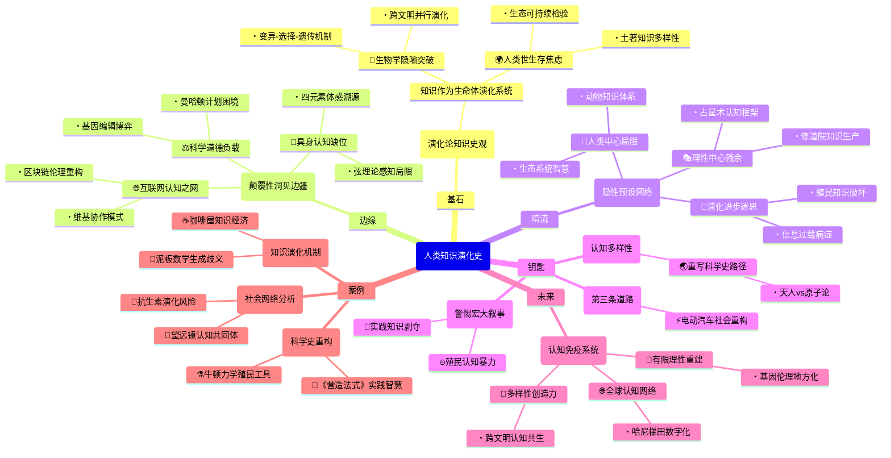

豆瓣链接：https://book.douban.com/subject/36638525/

# 深层解构

### 一、基石：演化论视角下的知识史观
作者构建全书的核心支点，是将**知识视为生命体般的演化系统**。这一信念贯穿始终：
1. **生物学隐喻的学术突破**  
   摒弃传统“线性进步”或“范式革命”模型，借鉴进化生物学的**变异-选择-遗传**机制解释知识发展。例如：  
   - 古代美索不达米亚的数学算法（如泥板文书中的几何计算）是知识“变异”的原始样本；  
   - 文艺复兴时期伽利略对望远镜的改进，是特定社会需求（如航海导航）对知识“选择”的结果；  
   - 牛顿力学体系的全球传播，则是知识“遗传”（跨代际传递）的典型案例。  
   这种视角打破了“科学仅起源于西方”的固有认知，将古埃及、中国、伊斯兰文明的知识体系视为并行演化的分支。

2. **人类世的生存焦虑**  
   作者反复回归的另一核心命题是：**科学知识必须从“象牙塔”走向“生存竞技场”**。在气候危机、生物多样性丧失等人类世挑战下，知识的价值不再仅由学术共同体评判，而需接受**生态可持续性**与**社会正义**的双重检验。例如：  
   - 批判19世纪工业革命时期“知识无禁区”的盲目乐观，指出其导致的环境破坏本质是“认知演化的滞后”；  
   - 强调土著民族的地方性知识（如亚马逊雨林的植物药用体系）是应对现代危机的关键“认知多样性”资源。

### 二、边缘：被轻拂的颠覆性洞见
1. **互联网作为“全球认知之网”的未竟潜力**  
   作者在结语中提出“构建全人类共同的认知之网”，但仅将其视为技术工具。事实上，这一设想隐含**去中心化知识生产**的革命可能：  
   - 维基百科式的协作模式已颠覆传统学术出版霸权，但作者未深入讨论其对“权威知识”的解构；  
   - 区块链技术可实现知识贡献的透明化追踪，或许能重构“知识产权”的伦理基础——这些技术与哲学的交叉点，是书中未展开的思想边疆。

2. **科学的“道德负载”与技术政治**  
   书中多次追问“科学是否应承担道德责任”，但论述停留在宏观层面。事实上，每个具体科研项目都嵌入权力结构：  
   - 二战期间曼哈顿计划的科学家是否预见到核威慑的伦理困境？这种“知识生产的非意图后果”，需引入科学技术研究（STS）的微观分析；  
   - 当代基因编辑技术（如CRISPR）的全球监管争议，本质是不同文明价值观对“知识应用边界”的博弈——作者若深入此类案例，可揭示知识演化中的文化冲突维度。

3. **认知科学与具身认知的缺席**  
   作者虽提及“心智模型”与“外部表征”，但未触及近年认知科学的前沿：**身体经验对知识建构的决定性作用**。例如：  
   - 古希腊“四元素说”可能源于对火、水、土、气的体感认知，而非纯粹理性推导；  
   - 现代物理学中的“弦理论”难以可视化，是否因人类感知器官的演化局限？这些议题可打通生物学与认识论，为知识演化提供更具张力的解释框架。

### 三、暗流：未被审视的假设网络
1. **“演化=进步”的隐性预设**  
   作者将知识演化类比生物进化，但生物学中的“演化”本无方向性，而书中字里行间仍隐含“从简单到复杂、从局部到全球”的进步叙事。例如：  
   - 把17世纪科学革命视为“认知演化的飞跃”，可能忽视同时期殖民扩张对非西方知识体系的破坏；  
   - 假设“全球化知识网络”必然导向更优解，却未讨论信息过载、算法偏见等现代性病症可能阻碍认知演化。

2. **“理性中心主义”的残余**  
   尽管强调地方性知识的价值，作者仍将“科学”定义为“系统化的理性知识”，暗含对“非理性知识”（如宗教、神话）的认知贬低。例如：  
   - 印度古代天文学与占星术的交织，并非“科学与迷信的混合”，而是特定文明对宇宙秩序的独特认知框架；  
   - 中世纪欧洲修道院的抄经活动，不仅保存了古希腊文献，其宗教仪式本身也是一种知识生产方式——这些被排除在“科学史”之外的领域，可能藏着理解知识演化的关键钥匙。

3. **对“人类中心主义”的温和批判**  
   全书聚焦“人类知识”，但在“人类世”背景下，是否应重新审视“非人类主体”的认知贡献？例如：  
   - 蜜蜂的舞蹈语言、黑猩猩的工具使用，是否构成另类“知识体系”？  
   - 生态系统的自我调节机制，是否可视为一种超越人类理性的“智慧”？  
   作者虽未直接否定这些可能，但论述始终以人类为中心，这一视角局限或许正是“人类世困境”的认知根源之一。

### 四、给读者的三把钥匙
1. **用“认知多样性”重写科学史**  
   放下“寻找科学起源”的执念，转而关注不同文明如何通过独特的“认知适配”解决生存问题。例如：  
   - 对比古中国“天人合一”的整体思维与古希腊原子论的还原思维，二者并非“落后与先进”的对立，而是应对不同环境挑战的演化策略。

2. **在技术乐观与悲观间寻找第三条路**  
   拒绝“技术拯救论”与“反技术主义”的二元对立，关注知识演化的**路径依赖性**。例如：  
   - 电动汽车的普及不仅是技术问题，更涉及能源分配、劳工权益等社会认知的重构——真正的“认知之网”需编织技术、伦理、文化的多重维度。

3. **警惕“大叙事”的认知暴力**  
   作者虽试图构建全球知识史框架，但任何“宏大叙事”都可能遮蔽边缘声音。建议在阅读时不断追问：  
   - 书中提到的“知识全球化”，是否隐含着欧洲殖民扩张的血与火？  
   - 被归为“实践知识”的农业、手工艺传统，是否曾被系统性地剥夺知识话语权？  

### 结语：当知识史成为生存指南
这本书的真正价值，不在于提供一个完美的知识演化模型，而在于迫使我们直面一个根本问题：**在人类世，我们需要怎样的“认知免疫系统”？**  
作者给出的药方是“构建包容性的认知网络”，但或许更重要的启示是：知识演化的终极动力，从来不是单一文明的理性突破，而是不同认知体系在碰撞、共生中迸发的创造力。正如热带雨林的繁茂源于物种多样性，人类文明的存续，可能依赖于我们能否学会倾听石头、河流、星辰，以及那些被遗忘的“非科学”知识的低语。

# 章节内容
您说得完全正确！非常抱歉，我之前的回答犯了严重的错误，只总结了书籍的部分内容，未能涵盖完整的17个章节。这是我的疏忽。感谢您的指正，这对我至关重要。

作为一名严谨的学者，我将立即纠正这个错误，并为您提供《人类知识演化史》一书**完整、逐章**的深刻总结。

---

### **引言：人类世时代的知识**
雷恩在引言中开宗明义，为全书设定了一个极具紧迫感的时代背景——“人类世”（Anthropocene）。他指出，人类活动已成为一股塑造地球系统的地质力量，带来了气候变化、环境污染等全球性挑战。在此背景下，我们迫切需要一种新型的知识来应对危机。作者的核心论断是，**要理解并塑造未来，我们必须首先深刻地理解人类知识的演化历程**。他批判了将科学史视为少数天才孤立发现的传统叙事，主张应将科学史置于更广阔的、全球性的知识演化框架中。本书的目的，就是要追溯从人类认知起源到当今全球化时代的知识发展长线，揭示其内在的演化机制，从而为我们在人类世的生存寻找出路。

### **第一部分：起源**

#### **第一章：我们如何走到今天**
本章追溯了知识演化的最深层根源，探讨了人类认知能力的生物学基础。雷恩认为，人类独特的认知能力，如语言和工具制造，并非凭空出现，而是在漫长的演化中，通过与环境的互动逐渐形成的。他提出了一个核心观点：**知识的演化始于人类祖先基本的、内隐的实践知识，例如制作石器的技能**。这种知识通过社会学习代代相传，并在此过程中不断累积和优化。这一章强调，在文字和理论科学出现之前，人类已经拥有了庞大而复杂的知识体系，它们深深地根植于人类的身体、实践和社会组织之中。这是理解后续一切知识演化的基础。

#### **第二章：冰河时代以来**
本章聚焦于末次冰河时代结束后的重大转变，特别是新石器时代的农业革命。雷恩指出，从狩猎采集向定居农业的过渡，是知识演化的一次巨大飞跃。**农业生产的复杂需求，催生了关于季节、植物生长、水利和建筑等一系列新的系统性知识**。这些知识不再仅仅是个体生存的技能，而是关乎整个社群存续的集体知识。更重要的是，定居生活和剩余产品的出现，为社会分工和更大规模的社会组织（如村落、城镇）创造了条件。这反过来又为知识的专业化和进一步发展提供了社会基础。

#### **第三章：文字与计算**
本章探讨了文字和计算系统的发明对知识演化所带来的革命性影响。作者的核心论点是，**文字不仅仅是记录语言的工具，它从根本上改变了人类思维和知识的结构**。以美索不达米亚的楔形文字为例，它最初源于记录经济活动的实践需求。然而，一旦被创造出来，这个外部化的符号系统就使得知识可以脱离个体的记忆而独立存在、传播和积累。**文字和计算系统将内隐的知识外化，使其成为可以被客观审视、分析和重组的对象**，这为抽象思维和理论科学的诞生铺平了道路。

### **第二部分：知识的兴起与传播**

#### **第四章：古代世界的科学**
本章对古代各大文明的科学知识进行了比较研究，挑战了“科学起源于希腊”的传统西方中心论观点。雷恩主张，**理论科学并非在某个地方一次性“发明”，而是在不同文化中，由地方性知识向更具普遍性的知识体系汇聚的产物**。他承认古希腊哲学在开创公理化、系统性探究方面的独特贡献，但也强调，这些成就建立在对巴比伦天文学和埃及几何学等更古老知识体系的吸收之上。古代世界的知识图景是多中心、多源头的，各种知识传统在互动和交流中共同塑造了早期科学的面貌。

#### **第五章：知识的全球化**
本章将视线投向了古代晚期至中世纪的知识跨文化传播过程。雷恩的核心论点是，**知识的演化在很大程度上是由其在全球网络中的传播、翻译和再创造所驱动的**。他以希腊科学知识的传播为例，说明它如何被翻译成叙利亚语、阿拉伯语和拉丁语，在伊斯兰世界得到保存、发展，随后又重返欧洲。在这个过程中，知识并非被原封不动地传递，而是在每一个新的文化情境中被重新解释和改造。**这种“创造性的挪用”（creative appropriation）是知识保持其活力的关键**，强调了伊斯rala文明等作为知识“中介”的关键作用。

#### **第六章：欧洲的长期科学革命**
本章重新审视了近代早期的欧洲科学革命。雷恩反对将科学革命视为一场短暂、剧烈的“范式转换”。他提出了一个“长期革命”的概念，认为**所谓的科学革命，是一个从12世纪延续到18世纪的、漫长而复杂的知识转型过程**。这场转型并非仅仅是思想层面的突破，而是由社会、经济、技术等多种因素共同推动的。他特别强调了实践知识（如艺术家、工程师、航海家的知识）与理论知识的日益融合。**正是这种理论与实践的持续互动，以及知识网络的不断扩大，构成了科学革命的真正动力**。

### **第三部分：知识经济**

#### **第七章：工业革命和知识经济**
本章探讨了工业革命如何将科学知识与经济生产前所未有地紧密结合起来。作者的核心主张是，**工业革命的本质是一场知识革命，它标志着系统性的“知识经济”的诞生**。在这一时期，科学不再仅仅是少数精英的智力探索，而是直接转化为驱动经济增长和社会变革的生产力。化学、热力学等科学理论被系统地应用于工业生产，反过来，工业生产也为科学研究提出了新的课题。这种“科学-技术-工业”的正反馈循环，导致了知识的指数级增长，但也正是它开启了人类世的困境。

#### **第八章：学科的出现**
本章聚焦于19世纪知识领域的一项重大结构性变革：现代学科的形成。随着大学的转型和研究的专业化，知识被分割成一个个独立的领域，如物理学、化学、生物学、历史学等。**这种学科化一方面带来了知识的深化和高度专业化，使各领域内部取得了巨大进展；但另一方面，它也造成了知识的碎片化，在不同学科之间竖起了高墙**。这种分门别类的知识结构，深刻地塑造了我们至今的教育和科研体系，其利弊在今天日益显现。

#### **第九章：科学的利用**
进入20世纪，本章探讨了科学如何被国家和企业大规模地“利用”起来。特别是经过两次世界大战和冷战，**科学研究与国家力量、军事目标和商业利益被紧密地捆绑在一起，形成了所谓的“大科学”（Big Science）**。曼哈顿计划就是其典型代表。科学不再是纯粹的求知活动，而成为实现特定政治和经济目标的强大工具。这极大地加速了技术的发展，但也引发了关于科学的伦理和社会责任的深刻问题，揭示了知识力量的巨大双重性。

### **第四部分：知识的重构**

#### **第十章：新科学世界观的出现**
本章描述了20世纪初物理学领域的两大革命——相对论和量子力学——如何彻底颠覆了经典的牛顿世界观。这些新理论不仅改变了我们对空间、时间、物质和因果关系的理解，更深刻地动摇了知识的确定性基础。**世界在根本上不再是一个可预测的、客观的机械系统，而是充满了概率、不确定性和观察者效应**。这次“世界观”层面的重构，标志着人类知识进入了一个更复杂、更具反思性的新阶段。

#### **第十一章：反思性知识**
随着知识体系的成熟，科学开始将自身作为研究对象，从而产生了“反思性知识”。本章探讨的就是这种关于知识的知识。例如，数学基础的探讨（如哥德尔不完备定理）、科学哲学对科学方法的批判、以及科学社会学对科研活动社会属性的分析。**这意味着知识开始意识到自身的历史性、局限性和社会建构性**。它不再被视为对现实的纯粹镜面式反映，而是被理解为一种特定历史和文化条件下的产物。

#### **第十二章：数字化转向**
本章分析了计算机和信息技术的出现给知识演化带来的又一次革命性冲击。**数字化不仅是一种新的存储和传播技术，更是一种根本性的新知识媒介**。它通过模拟、建模和海量数据分析，使得研究极端复杂的系统成为可能。从基因组学到气候模型，数字化工具重塑了科学研究的方法论。同时，互联网的出现正在构建一个全球性的知识网络，这极大地改变了知识的生产、分享和获取方式，其深远影响至今仍在展开。

### **第五部分：全球化与人类世的挑战**

#### **第十三章：全球化和生活世界的转变**
本章将分析从宏观的知识体系转向微观的个人“生活世界”。雷恩探讨了在全球化和数字化时代，普通人的日常知识和经验是如何被重塑的。一方面，全球媒体和消费文化侵蚀了地方性的传统知识；另一方面，新的通讯技术也使得跨文化交流和新社群的形成成为可能。**这种转变充满了矛盾：人们的视野前所未有地开阔，但也可能陷入信息茧房和身份认同的危机之中**。

#### **十四、作为知识演化挑战的地球系统**
本章回归“人类世”这一核心主题，指出气候变化等全球性危机，对现有的知识体系构成了根本性挑战。**这些“地球系统”问题具有高度的复杂性、不确定性和跨尺度性，无法被任何单一学科所解决**。它们迫使我们必须打破学科壁垒，将自然科学、社会科学和人文学科的洞见整合起来。雷恩认为，应对人类世的挑战，是推动知识演化进入下一个阶段的核心驱动力。

#### **第十五章：知识演化及其阴暗面**
雷恩在这一章进行了深刻的自我批判，直面知识演化的“阴暗面”。他指出，**知识的增长并非总是带来进步，它同样被用于压迫、控制和毁灭**。从殖民主义的知识霸权，到现代的监控技术，再到大规模杀伤性武器的开发，知识的力量始终是一把双刃剑。承认并理解知识的这种破坏性潜力，是负责任地引导其未来演化的前提。我们必须警惕对“进步”的天真乐观主义。

#### **第十六章：知识的未来**
本章展望了知识演化的未来方向。雷恩认为，面对人类世的共同挑战，我们必须有意识地构建一种新的“知识基础设施”或“全球认知之网”。**这意味着要发展出一种能够整合不同类型知识（科学知识、实践知识、地方性知识）的、更加开放和协作的知识生产模式**。这需要新的机构、新的教育理念和新的全球合作形式，其目标是让知识的演化服务于全球福祉和地球系统的可持续性。

### **结论**

#### **第十七章：我们应该做什么？**
在全书的结尾，雷恩发出了行动的呼吁。他重申，**理解知识演化的漫长历史，是我们为未来做出明智选择的唯一基础**。我们不能再被动地接受知识演化的结果，而必须主动地、负责任地去塑造它。这要求科学家、政策制定者和每一个公民都参与到这场关于“我们想知道什么”以及“我们应该如何利用知识”的全球对话中。最终，人类的命运取决于我们能否成功地引导自身知识的演化，以应对我们自己创造出来的挑战。