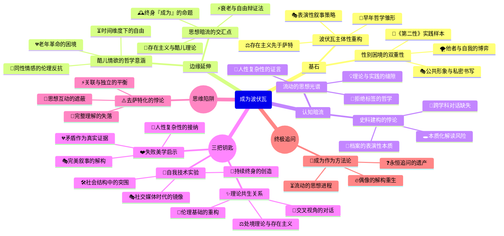

豆瓣链接：https://book.douban.com/subject/35317169/

# 深层解构

### 一、基石：被重构的女性主义偶像
#### 1. 打破“萨特附庸”的二元叙事
过往的波伏瓦形象常常被简化成“萨特的缪斯”，但本书以2018年曝光的波伏瓦与克洛德·朗兹曼的情书、学生时代未公开的法语日记等全新材料为依据，重构了她的主体地位。作者凯特·柯克帕特里克身为牛津大学的研究专家，严谨地梳理这些资料，揭示出波伏瓦在遇见萨特之前，就已经构建起“自我创造”的哲学雏形。例如，她在学生时代的日记中写道：“我惊讶地发现自己想要成为的样子，并非家里人所期待的”，这一早期的自我觉醒，成为其“女人不是天生的，而是后天成为的”这一核心观点的源头，早于萨特的存在主义思想。

#### 2. 自我塑造的双重性：表演与真实的交织
波伏瓦在回忆录中刻意淡化其他情人，赋予萨特“最重要却与事实不符的位置”，这一行为曾被视为“撒谎”。但本书提出了新的视角，认为这是她在男权社会中采用的一种“叙事策略”。她一方面需要借助萨特的学术影响力来传播自己的思想，另一方面又要维护“独立女性”的公众形象，这种矛盾恰恰体现了她所处时代的性别困境。就像她在《第二性》中分析的那样，女性常常需要在“自我”与“他者”之间寻找平衡，而她自己的人生正是这一理论的鲜活实践。

### 二、边缘：思想曲线的隐秘延伸
#### 1. 同性情感的哲学隐喻
书中提到波伏瓦与女性伴侣扎扎、奥尔加之间的情感，这些关系不仅仅是私人生活的细节，更蕴含着存在主义的哲学内涵。她在与扎扎的相处中，体验到“他人即地狱”的另一种形式——当社会规训试图将女性的情感限定在婚姻框架内时，同性之间的亲密关系就成为了对传统伦理的反抗。这种边缘性的情感体验，为她后来思考“自由与责任”的关系提供了独特的视角，也暗示了女性主义与酷儿理论之间潜在的思想关联。

#### 2. 老年波伏瓦的被忽视：当“成为”遭遇时间
传记的最后两章聚焦于波伏瓦的晚年，这在以往的研究中常常被一笔带过。她在老年时面临着身体衰老、挚友离世、思想被简化为口号等困境，但依然坚持写作和参与政治活动。书中引用她的话：“老年不是一场衰退，而是一场革命”，这挑战了人们对“女性主义偶像”的完美想象。她的晚年经历揭示了一个重要的命题：当“成为”是一个持续终身的过程时，如何在生命的尾声依然保持对自由的追求，这或许是对存在主义哲学最严峻的考验。

### 三、暗流：未被审视的假设与陷阱
#### 1. “新史料”的权威性迷思
本书依赖的新史料固然为研究带来了突破，但也隐含着“档案崇拜”的风险。例如，波伏瓦的日记和情书是经过她本人筛选和书写的，本身就带有自我建构的成分。作者虽然意识到她的“表演性”，但在解读时可能过于依赖这些文本，而忽视了同时代其他女性知识分子的参照。比如，对比波伏瓦与汉娜·阿伦特的书信，会发现她们在处理思想与情感的关系时存在相似的困境，但本书未能展开这种跨学科的对话。

#### 2. 女性主义的本质化陷阱
书中强调波伏瓦的“复杂性”，但在论述其女性主义思想时，仍存在将她的观点本质化的倾向。例如，将“女性主义偶像”的标签强加于她，而忽略了她本人曾多次声称“自己不是哲学家”的自我定位。这反映出学术界的一种深层矛盾：当我们试图将一位思想家纳入某个理论框架时，往往会不自觉地简化她的思想流动。波伏瓦的独特之处恰恰在于她拒绝被任何标签固定，这种流动性或许才是她留给当代女性主义最宝贵的遗产。

### 四、给读者的三把钥匙
#### 1. 洞见：波伏瓦的“自我技术”
她的一生都是在践行“自我创造”的实验，从早期对抗家庭规训，到中年构建哲学体系，再到晚年重塑公众形象，每一个阶段都在主动设计自己的“存在”。这种“自我技术”不是简单的个人主义，而是在社会结构中寻找突围的可能。读者可以思考：在今天的社交媒体时代，我们的“自我呈现”是否也是一种抵抗或妥协？

#### 2. 惊喜：当“女性主义”遇见“存在主义”
传统上认为波伏瓦的女性主义从属于萨特的存在主义，但本书揭示了两者的共生关系。她的“处境”理论（女性的生理、经济地位构成其自由的限制）实际上为存在主义注入了社会维度，而萨特的“选择”哲学则为女性主义提供了行动的伦理基础。这种交叉视角提醒我们：理论之间的对话远比谁主导谁更有价值。

#### 3. 发现：波伏瓦的“失败”美学
她的人生充满了矛盾与“失败”：在爱情中既有对自由的追求，又陷入嫉妒与控制；在思想传播中，《第二性》既被奉为经典，又被断章取义。但这些“不完美”恰恰是她真实的证据。正如她在日记中写的：“我不想成为一个偶像，我想成为一个人”。这种对“人性复杂性”的接纳，或许是对当代“完美女性主义”叙事的一种解构。

### 五、思维陷阱警示
警惕“去萨特化”的矫枉过正：本书成功将波伏瓦从萨特的阴影中解放出来，但也可能导致另一种偏见——忽视两人思想的相互激发。例如，萨特的“他者”概念与波伏瓦的“第二性”理论是相互呼应的，强行割裂会损失对存在主义女性主义的完整理解。真正的阅读应该像波伏瓦对待自己的人生一样，在“关联”与“独立”之间保持微妙的平衡。

### 结语：当“成为”成为一种方法论
《成为波伏瓦》的终极价值，不在于提供一个“真实的波伏瓦”，而在于教会我们如何用“成为”的视角看待一切：思想不是凝固的体系，而是流动的过程；偶像不是用来崇拜的符号，而是激发思考的起点。正如波伏瓦在晚年所说：“我的一生都在追问，从未停止”。这种追问精神，或许才是她留给读者最珍贵的礼物——让每一个人都能在她的思想中找到重新诠释自己生命的勇气，成为自己存在的哲学家。

# 章节内容
## 《成为波伏瓦》各章节内容总结

### 前言：西蒙娜·德·波伏瓦——她是谁？

在本传记的开篇，作者凯特·柯克帕特里克明确提出了核心问题：“西蒙娜·德·波伏瓦是谁？”并挑战了将她仅仅视为萨特伴侣或存在主义运动陪衬的传统看法。柯克帕特里克指出，**波伏瓦是一位独立的、原创性的哲学家**，其思想的形成早于并深刻影响了萨特。本章引用了最新发现的波伏瓦日记和信件，旨在揭示一个更为真实和复杂的波伏瓦形象。作者主张，理解波伏瓦的关键在于认识到她的人生和哲学是密不可分的，她的生活本身就是一场对存在主义理念的实践。柯克帕特里克批判了以往传记中存在的将波伏瓦浪漫化或妖魔化的倾向，承诺将基于坚实的证据，重新审视她的思想、情感与人际关系，特别是她与萨特之间复杂且常被误解的契约关系。本前言为全书奠定了基调：将波伏瓦从萨特的阴影中解放出来，让她作为一位独立的思想家和女性主义的先驱，站在属于自己的聚光灯下。

### 第一章：像个女孩一样长大

本章聚焦于波伏瓦的童年和少女时代，探讨了她早年家庭环境、宗教信仰和教育经历如何塑造了她最初的世界观。柯克帕特里克详细描绘了波伏瓦在一个传统、笃信天主教的资产阶级家庭中的成长过程。她的父亲富有魅力但思想保守，母亲则严格遵循宗教教义，这种环境在给予她智识启蒙的同时，也带来了压抑。**本章的关键论点在于，波伏瓦早年就表现出对知识的强烈渴望和对社会规范的敏锐质疑**。作者通过分析波伏瓦的早期日记，揭示了她内心的矛盾与挣扎：一方面，她渴望成为父母眼中的“好女孩”；另一方面，她又对既定的性别角色和宗教信条感到困惑和反抗。柯克帕特里克认为，正是这种早期的内心冲突，点燃了波伏瓦日后哲学思想的火花，特别是她对自由、选择和“成为”自我等核心议题的思考。本章还强调了阅读在波伏瓦成长过程中的重要性，书籍为她打开了一个超越家庭和教会束缚的新世界，让她开始想象一种不同的、由自己创造的人生道路。

### 第二章：端方淑女

本章深入探讨了波伏瓦在青春期所面临的社会期待与内心自我之间的激烈冲突。随着年龄的增长，社会对“端方淑女”的规训变得愈发严苛，这与波伏瓦日益觉醒的独立意识和智识野心产生了尖锐的对立。柯克PA特里克指出，**波伏瓦在这一时期的核心挣扎，是拒绝被塑造成一个仅仅为了婚姻和家庭而存在的、顺从的资产阶级女性**。作者详细描述了波伏瓦如何抵制家庭为她安排的社交活动和婚姻前景，她将这些视为对个人自由的扼杀。在学校，尤其是在德西尔学院的学习经历，成为她反抗的阵地。她对哲学和文学的热爱，不仅是智力上的追求，更是一种寻找自我、定义自我的方式。本章引用了波伏瓦与挚友扎扎（伊丽莎白·马比耶）的交往，扎扎的悲剧性命运——因无法调和个人愿望与家庭压力而最终夭折——对波伏瓦产生了深远的影响。**扎扎之死，让波伏瓦更加坚信，传统的女性命运是一条通往毁灭的道路，这促使她下定决心要通过智识和经济上的独立来掌控自己的人生**。

### 第三章：信仰上帝还是相信自己？

本章集中论述了波伏瓦青年时期最重大的思想转变——从一位虔诚的天主教徒转变为坚定的无神论者。柯克帕特里克认为，**这次信仰的崩塌是波伏瓦“成为”自己的关键一步，是她走向存在主义思想的必然结果**。作者通过分析波伏瓦的日记和信件，追溯了她信仰动摇的整个过程。最初，波伏瓦试图在宗教教义中为自己的智识追求和独立人格找到合理性，但最终发现，教会所要求的顺从与她对自由和真理的渴望根本无法相容。她开始质疑上帝的存在，并逐渐意识到，人生的意义并非由神预设，而需要由个体自己来创造。**“如果上帝不存在，那么一切都是被允许的”**——这个陀思妥耶夫斯基式的命题，对波伏瓦而言并非导向虚无，而是开启了通往绝对自由和责任的大门。柯克帕特里克强调，波伏瓦的无神论并非简单的否定，而是一种积极的肯定：**她选择相信自己，相信人类有能力通过行动和选择来定义自身的存在**。这一转变，为她后来与萨特的相遇以及存在主义哲学的构建奠定了坚实的思想基础。

### 第四章：传奇之前的爱恋

本章将目光投向波伏瓦与萨特相遇之前的个人情感世界，特别是她与表哥雅克·尚皮涅的恋情。柯克PA特里克旨在打破“波伏瓦的情感生活完全围绕萨特展开”的刻板印象，揭示她在情感上的独立探索和早期思考。作者认为，**与雅克的这段恋情，是波伏瓦对爱情、婚姻和两性关系进行初步哲学反思的实践场**。雅克代表了波伏瓦所熟悉的那个资产阶级世界——稳定、传统，但同时也充满了限制。波伏瓦在与他的交往中，深刻体会到传统婚恋模式对女性智识和精神独立的潜在威胁。她渴望一种能够与伴侣在智识上平等对话、在精神上相互尊重的关系，而这在当时的社会框架下几乎是不可能的。**本章的核心论点在于，波伏瓦在拒绝雅克的求婚时，实际上已经做出了一个存在主义式的选择：她选择了忠于自我，选择了不确定的未来，而不是安逸但会磨灭自我的生活**。这段经历让她更加明确了自己对于“偶然之爱”和“必然之爱”的思考，为她日后与萨特建立非传统伴侣关系铺平了道路。

### 第五章：女神和花花公子

本章详细描述了波伏瓦与萨特在巴黎高等师范学院的相遇，以及他们传奇关系的开端。柯克PA特里克挑战了萨特是这段关系中绝对主导者的传统叙事，强调了波伏瓦在智识上的独立和对萨特的深刻影响。本章的标题“女神和花花公子”概括了他们初遇时在同学眼中的形象，也暗示了他们各自在关系中扮演的角色。作者指出，**他们关系的基石是建立在智识上的相互吸引和哲学上的共鸣**。他们在哲学教师资格考试中的竞争与合作（波伏瓦名列第二，萨特第一），奠定了他们一生对话的基础。**柯克PA特里克的核心观点是，他们之间著名的“两年契约”——承诺保持彼此关系的核心地位，但允许各自拥有“偶然之爱”——并非萨特的单方提议，而是双方共同构建的一种旨在平衡自由与忠诚的存在主义实践**。这一契约反映了他们共同的信念：**个体的自由是绝对的，任何关系都不应成为其束缚**。本章通过分析波伏瓦的视角，展现了她在接受这一契约时的考量与决心，将其视为一种既能保持亲密关系又能维护个人独立性的激进尝试。

### 第六章：她自己的房间

本章聚焦于波伏瓦在离开家庭、开始独立生活和执教生涯后的经历，呼应了弗吉尼亚·伍尔夫的著名论断。柯克PA特里克强调了经济独立和拥有个人空间对于波伏瓦“成为”自己的重要性。**获得一份教职，意味着波伏瓦彻底摆脱了对家庭的依赖，获得了定义自己生活的物质基础**。本章详细描述了她在马赛、鲁昂等地执教的经历，以及她如何在这段时期里努力平衡教学工作、个人写作和与萨特的远距离关系。作者认为，这段独居的经历，让波伏瓦有机会将她的哲学思考付诸实践。**她开始在日常生活中探索自由的真正含义，直面孤独、责任和选择的重负**。柯克PA特里克指出，波伏瓦在这一时期创作了她的小说《女宾》，这部作品深刻反映了她对于自我、他者以及嫉妒等问题的哲学思考，其思想内核甚至早于萨特在《存在与虚无》中对相关问题的阐述。**拥有“自己的房间”，不仅是物理空间上的独立，更是精神和思想上的自主，是她作为一名作家和哲学家真正诞生的标志**。

### 第七章：原本是四角恋的三角恋

本章深入剖析了波伏瓦与萨特关系中最具争议的方面之一：他们与学生奥尔加·科扎凯维奇和万达·科扎凯维奇姐妹的复杂关系。柯克帕特里克没有回避其中的伦理争议，而是试图通过新发现的信件和日记，更细致地还原事件的经过和波伏瓦的内心世界。**作者的核心论点是，这段所谓的“三角恋”或“四角恋”，是波伏瓦和萨特将他们的存在主义自由理念推向极致的一次危险实验，但其后果却远比他们预想的复杂和痛苦**。柯克帕特里克指出，波伏瓦最初试图将这种关系理论化，视为一种对传统道德的超越和对他者自由的尊重。然而，现实中的情感纠葛——嫉妒、占有欲和权力不平衡——使得这个实验最终走向失控。**波伏瓦在其中既是理论的构建者，也是情感的承受者，她深刻体验到了自由选择与他人痛苦之间的矛盾**。这段经历迫使她重新审视自己关于自由和责任的哲学观念，认识到**抽象的哲学原则在具体的人际关系中可能带来的伤害**。这一痛苦的过程，也成为她日后创作《女宾》和《他者之血》等作品的重要素材，反映了她对存在主义伦理学更深层次的思考。

### 第八章：内心的战争，外界的战争

本章将波伏瓦的个人生活与第二次世界大战这一宏大的历史背景相结合，探讨了战争如何深刻地影响了她的生活和思想。柯克帕特里克指出，**战争的爆发，迫使波伏瓦和萨特等存在主义者从对个体自由的内向探索，转向对历史、政治和集体责任的思考**。作者描述了战争初期的混乱以及波伏瓦在巴黎沦陷后的生活，她失去了教职，生活陷入困顿。这段经历让她切身体会到历史的“境况”对个人自由的巨大限制。**本章的关键论点是，战争是波伏瓦政治意识全面觉醒的催化剂**。她和萨特等人组建了抵抗小组“社会主义与自由”，尽管其实际行动有限，但这标志着他们试图将存在主义的“介入”理念付诸政治实践。柯克帕特里克强调，战争让波伏瓦意识到，**个体的存在并非孤立的，而是与他人的命运紧密相连的；个人的自由，只有在为所有人的自由而奋斗时，才具有真正的意义**。这种思想的转变为她战后成为一名积极的公共知识分子奠定了基础。

### 第九章：被遗忘的哲学

本章旨在为波伏瓦作为一位原创性哲学家的地位进行有力的辩护，直接挑战了她长期以来被视为“萨特的信徒”或仅仅是其思想阐释者的观点。柯克帕特里克通过细致的文本分析，论证了**波伏瓦在多部作品中，特别是在《皮洛士与齐纳斯》和《模糊性的道德》中，发展出了一套独立于萨特且具有原创性的存在主义伦理学**。作者指出，早在萨特的《存在与虚无》出版之前，波伏瓦就已经在自己的日记和早期作品中探讨了“为我”与“为他”的存在模式。**柯克帕特里克的核心主张是，波伏瓦的伦理学比萨特的更为具体和贴近人类经验，她更关注个体在具体情境中如何做出选择，以及如何处理自由与他人之间的关系**。波伏瓦强调了“模糊性”——即人类存在是精神与肉体、自由与事实性相结合的矛盾统一体——并认为**伦理学的任务正是要直面这种模糊性，在不确定的世界中为自己的行动创造价值**。本章的论述，旨在将波伏瓦从哲学史的边缘拉回到中心，确立她作为一位独立思想家的合法地位。

### 第十章：存在主义女王

本章描绘了二战后，存在主义在巴黎乃至全世界声名鹊起，波伏瓦和萨特成为文化偶像的景象。柯克帕特里克并没有将这一时期简单地描绘为成功的辉煌，而是深入探讨了**成为“存在主义女王”给波伏瓦带来的机遇与困境**。作者指出，一方面，波伏瓦获得了前所未有的公共平台，她和萨特共同创办的《现代》杂志成为当时法国最重要的思想阵地之一，她得以通过写作和演讲，将自己的哲学和政治观点传播给更广泛的公众。但另一方面，**盛名之下，她的个人生活和思想都被过度简化和标签化**。媒体将她塑造成萨特身边的缪斯，或是离经叛道的女性代表，而她在哲学上的原创性贡献则常常被忽视。**柯克帕特里克认为，波伏瓦在这一时期面临的核心挑战是如何在公共角色和个人创作之间保持平衡，以及如何应对外界对她个人生活和情感关系的窥探与误读**。本章展现了波伏瓦如何利用自己的声望来“介入”社会，同时又如何在内心深处与这个强加给她的“女王”形象进行抗争，坚持自己作为一名严肃作家和思想家的身份。

### 第十一章：美国困境

本章详细记述了波伏瓦在1947年的美国之行，以及这次旅行为她带来的思想冲击和情感经历。柯克帕特里克将这次旅行视为波伏瓦人生和创作的一个重要转折点。**作者的核心论点是，美国之行让波伏瓦第一次直观地、深刻地感受到了两种“他者”的处境：一是作为一名独立的欧洲女性在美国社会中的体验，二是对美国种族隔离制度下非裔美国人状况的观察**。在美国，她既享受了作为名人的自由，也感受到了作为一个单身女性所面临的无形压力。更重要的是，她对美国根深蒂固的种族歧视感到震惊，这让她对自己之前关于“他者”的哲学思考进行了深刻的反思。**本章的另一个重点是波伏瓦与美国作家尼尔森·阿尔格伦的相遇和热恋**。这段炽热的情感关系，让她体验到了一种与萨特的关系截然不同的爱情模式，也让她对女性在爱情中的依赖、独立和牺牲等问题有了切肤之痛的理解。**柯克帕特里克认为，美国之行及其引发的思考，直接促使波伏瓦开始构思她一生中最重要的作品——《第二性》**。

### 第十二章：备受诽谤的《第二性》

本章集中阐述了波伏瓦的里程碑式著作《第二性》的创作背景、核心论点及其在出版后引发的巨大争议。柯克帕特里克强调，**《第二性》并非一部简单的女性抱怨录，而是一部运用了存在主义、历史学、生物学和社会学等多种工具，对“女性”这一概念进行颠覆性分析的哲学巨著**。本章详细解读了《第二性》的核心论点：**“女人不是天生的，而是后天成为的。”** 波伏瓦系统地论证了社会、历史和文化如何将女性建构为“他者”，即相对于男性主体而存在的“第二性”。她揭示了从童年到老年，女性如何在“男性中心”的世界中被剥夺主体性，并内化这种从属地位。柯克帕特里克指出，该书一出版就引发了剧烈的社会震动，从梵蒂冈到法国共产党，几乎所有男性主导的机构都对其进行了猛烈的抨击，指责波伏瓦“攻击法国男人的性能力”、“仇恨男人”。**作者认为，这种强烈的反弹恰恰证明了波伏瓦的论点击中了父权社会的核心，挑战了其最根本的权力结构和性别迷思**。

### 第十三章：再次面对爱情

本章探讨了在《第二性》出版后，波伏瓦在个人情感生活中面临的新挑战，特别是她与萨特、阿尔格伦以及新出现的年轻情人克洛德·朗兹曼之间的复杂关系。柯克帕特里克旨在揭示**波伏瓦在实践其非传统情感理念时所经历的真实痛苦与矛盾**。尽管她在理论上倡导女性的独立和自由，但在现实中，她依然要面对嫉妒、依赖和心碎。**本章的核心论点是，波伏瓦并非一个超然于情感之外的“铁娘子”，她的生活本身就是对其哲学理念的持续检验和修正**。与阿尔格伦的跨洋恋情，因无法在“自由”与“承诺”之间找到平衡而最终破裂，给她带来了巨大的创伤。而与朗兹曼的长期关系，则让她在晚年重新体验了激情，但也让她再次面对年龄、权力和情感依赖等复杂问题。柯克帕特里克通过分析波伏瓦写给这些情人的信件，展现了一个脆弱、充满激情但又始终在反思的女性形象。**她的一生，都在试图诚实地面对爱的“模糊性”，即爱既是自由的赠予，也可能成为依赖的枷锁**。

### 第十四章：感觉被欺骗了

本章聚焦于波伏瓦步入中年后的失落感与幻灭感，这种情绪在她的小说《名士风流》中得到了深刻的体现。柯克帕特里克指出，这部荣获龚古尔奖的作品，不仅是对战后法国左翼知识分子圈的描绘，更是波伏瓦对自己和同代人政治理想与个人生活的一次深刻反思。**本章的核心论点是，波伏瓦感到“被欺骗”，既有来自政治上的幻灭，也有个人关系上的痛苦**。在政治上，她看到曾经的抵抗英雄们在战后的政治斗争中逐渐迷失方向，理想主义褪色。在个人生活上，她与萨特的关系进入了一个更为复杂和艰难的阶段，特别是萨特与其他女性的关系给她带来了持续的伤害。**“感觉被欺骗了”这句话，直接引自波伏瓦的日记，精准地捕捉了她当时的心境**。柯克帕特里克认为，波伏瓦通过写作来处理这种幻灭感，她开始转向自传性写作，试图通过回顾和整理自己的一生来寻找意义。**这种转向标志着她开始更加关注个体生命经验的独特性，并试图从个人的历史中去理解更宏大的历史**。

### 第十五章：老年

本章探讨了波伏瓦晚年对衰老和死亡这两个存在主义终极问题的思考和书写，其代表作是《论老年》。柯克帕特里克指出，与《第二性》相似，**波伏瓦再次将一个被社会边缘化和污名化的群体——老年人——带入公众视野，并对其处境进行了深刻的哲学和社会学分析**。作者的核心论点是，**波伏瓦批判了现代社会对待老年人的方式，揭示了社会如何通过将老年人视为无用、无价值的“他者”来剥夺他们的尊严和主体性**。她认为，对衰老的恐惧，源于对丧失自由和被社会抛弃的恐惧。波伏瓦不仅从外部观察老年问题，也结合自己的亲身经历，坦诚地描绘了身体衰老带来的种种挑战。**她主张，对抗衰老的唯一方式，就是继续“介入”生活，保持好奇心，坚持自己的计划和事业，直到生命的最后一刻**。本章展现了波伏瓦如何以惊人的坦诚和智识勇气，直面人类存在的最终限制，并试图在不可避免的衰亡中，依然肯定生命和自由的价值。

### 第十六章：风烛残年

本章是全书的结尾部分，记述了波伏瓦生命的最后岁月，特别是萨特去世后她的生活以及她本人的离世。柯克帕特里克描绘了一个既坚强又脆弱的晚年波伏瓦形象。**萨特的去世，对波伏瓦是沉重的打击，但也开启了她人生的一个新阶段**。**本章的核心论点是，即使在生命的最后阶段，波伏瓦依然在“成为”的路上**。她整理并出版了与萨特的战时书信，写下了感人至深的《告别仪式》，以自己的方式为他们传奇的一生作结。这本书因其毫不避讳地描绘萨特晚年的病痛与衰弱而引发争议，但柯克帕特里克认为，这正是波伏瓦坚持“真实”的体现，她拒绝将萨特神化，而是选择呈现一个完整的、有血有肉的人。同时，波伏瓦在晚年更加积极地投身于女权主义运动，成为年轻一代女性主义者的精神导师。**她的一生，从反抗资产阶级家庭的少女，到存在主义哲学家，再到女权运动的旗手，完美地诠释了她自己的名言：人不是静止的“存在”，而是一个永不停止的“成为”的过程**。

### 后记：西蒙娜·德·波伏瓦将会成为什么？

在后记中，柯克帕特里克回归了全书开篇时提出的问题，并对其进行了展望。作者认为，波伏瓦的遗产是开放性的，随着新材料的不断发现和新一代读者的解读，**“波伏瓦将会成为什么”依然是一个面向未来的问题**。柯克帕特里克总结道，她的这部传记试图做的，就是打破围绕波伏瓦的种种神话和误解，将她从萨特的附庸、存在主义的缪斯或是完美的女权偶像等多重标签中解放出来。**作者强调，波伏瓦最重要的遗产，或许不在于她给出了最终的答案，而在于她提出了一系列至今仍然至关重要的问题**：关于自由与责任，关于自我与他者，关于女性的处境，关于爱与衰老。波伏瓦以她自己的一生，展示了直面存在之“模糊性”的勇气。**她留给后人的，不是一个需要被模仿的“榜样”，而是一种永不停止的、自我创造的生命姿态**。最终，每一代读者都将根据自身的境况，在与波伏瓦的对话中，重新发现和创造属于他们自己的波伏瓦。