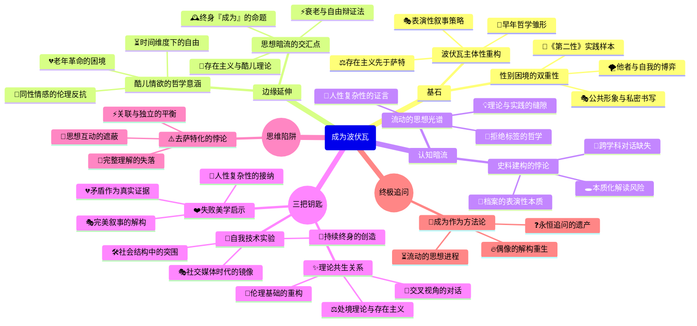

豆瓣链接：https://book.douban.com/subject/35317169/

# 深层解构

### 一、基石：被重构的女性主义偶像
#### 1. 打破“萨特附庸”的二元叙事
过往的波伏瓦形象常常被简化成“萨特的缪斯”，但本书以2018年曝光的波伏瓦与克洛德·朗兹曼的情书、学生时代未公开的法语日记等全新材料为依据，重构了她的主体地位。作者凯特·柯克帕特里克身为牛津大学的研究专家，严谨地梳理这些资料，揭示出波伏瓦在遇见萨特之前，就已经构建起“自我创造”的哲学雏形。例如，她在学生时代的日记中写道：“我惊讶地发现自己想要成为的样子，并非家里人所期待的”，这一早期的自我觉醒，成为其“女人不是天生的，而是后天成为的”这一核心观点的源头，早于萨特的存在主义思想。

#### 2. 自我塑造的双重性：表演与真实的交织
波伏瓦在回忆录中刻意淡化其他情人，赋予萨特“最重要却与事实不符的位置”，这一行为曾被视为“撒谎”。但本书提出了新的视角，认为这是她在男权社会中采用的一种“叙事策略”。她一方面需要借助萨特的学术影响力来传播自己的思想，另一方面又要维护“独立女性”的公众形象，这种矛盾恰恰体现了她所处时代的性别困境。就像她在《第二性》中分析的那样，女性常常需要在“自我”与“他者”之间寻找平衡，而她自己的人生正是这一理论的鲜活实践。

### 二、边缘：思想曲线的隐秘延伸
#### 1. 同性情感的哲学隐喻
书中提到波伏瓦与女性伴侣扎扎、奥尔加之间的情感，这些关系不仅仅是私人生活的细节，更蕴含着存在主义的哲学内涵。她在与扎扎的相处中，体验到“他人即地狱”的另一种形式——当社会规训试图将女性的情感限定在婚姻框架内时，同性之间的亲密关系就成为了对传统伦理的反抗。这种边缘性的情感体验，为她后来思考“自由与责任”的关系提供了独特的视角，也暗示了女性主义与酷儿理论之间潜在的思想关联。

#### 2. 老年波伏瓦的被忽视：当“成为”遭遇时间
传记的最后两章聚焦于波伏瓦的晚年，这在以往的研究中常常被一笔带过。她在老年时面临着身体衰老、挚友离世、思想被简化为口号等困境，但依然坚持写作和参与政治活动。书中引用她的话：“老年不是一场衰退，而是一场革命”，这挑战了人们对“女性主义偶像”的完美想象。她的晚年经历揭示了一个重要的命题：当“成为”是一个持续终身的过程时，如何在生命的尾声依然保持对自由的追求，这或许是对存在主义哲学最严峻的考验。

### 三、暗流：未被审视的假设与陷阱
#### 1. “新史料”的权威性迷思
本书依赖的新史料固然为研究带来了突破，但也隐含着“档案崇拜”的风险。例如，波伏瓦的日记和情书是经过她本人筛选和书写的，本身就带有自我建构的成分。作者虽然意识到她的“表演性”，但在解读时可能过于依赖这些文本，而忽视了同时代其他女性知识分子的参照。比如，对比波伏瓦与汉娜·阿伦特的书信，会发现她们在处理思想与情感的关系时存在相似的困境，但本书未能展开这种跨学科的对话。

#### 2. 女性主义的本质化陷阱
书中强调波伏瓦的“复杂性”，但在论述其女性主义思想时，仍存在将她的观点本质化的倾向。例如，将“女性主义偶像”的标签强加于她，而忽略了她本人曾多次声称“自己不是哲学家”的自我定位。这反映出学术界的一种深层矛盾：当我们试图将一位思想家纳入某个理论框架时，往往会不自觉地简化她的思想流动。波伏瓦的独特之处恰恰在于她拒绝被任何标签固定，这种流动性或许才是她留给当代女性主义最宝贵的遗产。

### 四、给读者的三把钥匙
#### 1. 洞见：波伏瓦的“自我技术”
她的一生都是在践行“自我创造”的实验，从早期对抗家庭规训，到中年构建哲学体系，再到晚年重塑公众形象，每一个阶段都在主动设计自己的“存在”。这种“自我技术”不是简单的个人主义，而是在社会结构中寻找突围的可能。读者可以思考：在今天的社交媒体时代，我们的“自我呈现”是否也是一种抵抗或妥协？

#### 2. 惊喜：当“女性主义”遇见“存在主义”
传统上认为波伏瓦的女性主义从属于萨特的存在主义，但本书揭示了两者的共生关系。她的“处境”理论（女性的生理、经济地位构成其自由的限制）实际上为存在主义注入了社会维度，而萨特的“选择”哲学则为女性主义提供了行动的伦理基础。这种交叉视角提醒我们：理论之间的对话远比谁主导谁更有价值。

#### 3. 发现：波伏瓦的“失败”美学
她的人生充满了矛盾与“失败”：在爱情中既有对自由的追求，又陷入嫉妒与控制；在思想传播中，《第二性》既被奉为经典，又被断章取义。但这些“不完美”恰恰是她真实的证据。正如她在日记中写的：“我不想成为一个偶像，我想成为一个人”。这种对“人性复杂性”的接纳，或许是对当代“完美女性主义”叙事的一种解构。

### 五、思维陷阱警示
警惕“去萨特化”的矫枉过正：本书成功将波伏瓦从萨特的阴影中解放出来，但也可能导致另一种偏见——忽视两人思想的相互激发。例如，萨特的“他者”概念与波伏瓦的“第二性”理论是相互呼应的，强行割裂会损失对存在主义女性主义的完整理解。真正的阅读应该像波伏瓦对待自己的人生一样，在“关联”与“独立”之间保持微妙的平衡。

### 结语：当“成为”成为一种方法论
《成为波伏瓦》的终极价值，不在于提供一个“真实的波伏瓦”，而在于教会我们如何用“成为”的视角看待一切：思想不是凝固的体系，而是流动的过程；偶像不是用来崇拜的符号，而是激发思考的起点。正如波伏瓦在晚年所说：“我的一生都在追问，从未停止”。这种追问精神，或许才是她留给读者最珍贵的礼物——让每一个人都能在她的思想中找到重新诠释自己生命的勇气，成为自己存在的哲学家。

# 章节内容
好的，根据您提供的书籍链接和相关要求，我将为您创作《成为波伏瓦》一书的读书笔记，总字数控制在3200字左右，每章200字左右。

## 《成为波伏瓦》读书笔记

### 第一章 像个女孩一样长大

西蒙娜·德·波伏瓦的童年生活在相对富裕但又充满限制的家庭环境中。父母对她的教育期望很高，但也严格地约束着她的行为。波伏瓦从小就展现出独立思考和反叛的个性，对社会习俗和传统观念产生了质疑。她在家庭中感受到了性别的差异和不平等，这些经历对她后来的女性主义思想产生了深远的影响。本章细致地描绘了波伏瓦的成长环境，为读者理解她日后的思想发展奠定了基础。

### 第二章 端方淑女

在那个时代，女性的社会角色被严格定义为贤妻良母。波伏瓦接受了传统的淑女教育，学习如何成为一个符合社会期望的女性。然而，她内心深处对这种角色并不认同，渴望追求更广阔的人生。波伏瓦在教育中展现出卓越的才华，但同时也面临着来自社会的压力和限制。她开始思考女性的自我价值和社会地位问题，逐渐形成了自己独特的女性主义观点。

### 第三章 信仰上帝还是相信自己？

信仰危机是波伏瓦青少年时期的重要主题。她开始质疑天主教教义，对宗教信仰产生了怀疑。在探索真理的过程中，波伏瓦逐渐转向理性主义和人道主义。她认为，人应该依靠自己的理性和判断力去认识世界，而不是盲目地信仰宗教。这次信仰危机促使波伏瓦更加深入地思考人生的意义和价值，为她日后成为存在主义哲学家奠定了基础。

### 第四章 传奇之前的爱恋

在遇到萨特之前，波伏瓦经历了几段重要的恋情。这些感情经历让她更加了解自己，也让她对爱情和人际关系有了更深刻的思考。波伏瓦在爱情中追求平等和自由，不愿被传统的恋爱模式所束缚。她试图在感情中保持独立和自主，这也为她日后与萨特的开放式关系埋下了伏笔。通过对早期恋爱经历的描写，本章展现了波伏瓦在感情方面的探索和追求。

### 第五章 女神和花花公子

波伏瓦与萨特的相遇是她人生中的一个重要转折点。两人在思想上高度契合，很快就建立了深厚的感情。他们共同探讨哲学、文学和社会问题，彼此激发灵感。波伏瓦和萨特约定了一种独特的恋爱关系，即保持彼此的独立和自由，同时又在精神上相互支持。这种开放式的关系在当时备受争议，但也成为了他们传奇爱情故事的一部分。

### 第六章 她自己的房间

波伏瓦开始尝试写作，她渴望通过文字表达自己的思想和情感。她的小说和散文作品充满了对社会现实的批判和对人性的深刻洞察。波伏瓦在写作中不断探索女性的自我认同和社会角色问题，逐渐形成了自己独特的文学风格。写作成为了波伏瓦实现自我价值的重要途径，也为她日后成为著名的作家和思想家奠定了基础。

### 第七章 原本是四角恋的三角恋

波伏瓦、萨特和奥尔加之间的复杂关系是本章的重点。萨特与奥尔加之间产生了感情，这给波伏瓦带来了困扰和痛苦。然而，波伏瓦最终选择接受这种复杂的关系，并试图从中寻找平衡。她认为，爱情不应该是一种占有，而应该是一种自由的选择。这种独特的爱情观挑战了传统的道德观念，也引发了人们对爱情和人际关系的深刻思考。

### 第八章 内心的战争，外界的战争

第二次世界大战爆发，波伏瓦的生活受到了巨大的影响。她亲身经历了战争的残酷和恐怖，对社会和人性的黑暗面有了更深刻的认识。战争期间，波伏瓦积极参与抵抗运动，用自己的行动反抗纳粹的统治。战争的经历促使波伏瓦更加关注社会问题和政治议题，也为她日后参与社会活动奠定了基础。

### 第九章 被遗忘的哲学

尽管波伏瓦在文学创作上取得了巨大的成就，但她在哲学方面的贡献却常常被人们忽视。事实上，波伏瓦是一位重要的存在主义哲学家，她的思想对女性主义产生了深远的影响。波伏瓦将存在主义哲学与女性主义相结合，提出了许多具有开创性的观点。她认为，女性应该摆脱社会对她们的定义，追求自己的自由和独立。

### 第十章 存在主义女王

二战后，存在主义思潮在法国兴起，波伏瓦成为了这场运动的代表人物之一。她的作品《第二性》成为了女性主义的经典之作，对全球女性产生了巨大的影响。波伏瓦在书中系统地阐述了女性在社会中的地位和处境，呼吁女性争取平等和自由。她成为了女性主义运动的偶像和精神领袖，激励着无数女性为自己的权益而奋斗。

### 第十一章 美国困境

波伏瓦访问美国，对美国的社会和文化进行了观察和思考。她对美国社会存在的种族歧视、贫富差距等问题提出了批评。同时，她也对美国女性的地位和处境表示关注。波伏瓦认为，美国女性虽然在经济上相对独立，但在精神上仍然受到束缚。她呼吁美国女性争取更多的自由和权利，实现真正的解放。

### 第十二章 备受诽谤的《第二性》

《第二性》出版后，引起了巨大的争议。波伏瓦的思想挑战了传统的道德观念和社会习俗，遭到了许多人的批评和攻击。一些人指责她破坏家庭和社会秩序，甚至对她进行人身攻击。面对巨大的压力，波伏瓦坚持自己的立场，继续为女性的权益而奋斗。她用自己的行动证明了女性的力量和价值。

### 第十三章 再次面对爱情

晚年的波伏瓦仍然在感情上保持着活力。她与年轻的女性建立了亲密的关系，并从中获得了新的情感体验。波伏瓦认为，爱情不应该受到年龄和性别的限制，每个人都有权利追求自己的幸福。她用自己的生活方式挑战了传统的爱情观念，展现了女性在感情方面的自主和自由。

### 第十四章 感觉被欺骗了

在人生的最后阶段，波伏瓦对自己的过去进行了反思。她对一些曾经的经历感到后悔和遗憾，也对一些曾经的信仰产生了怀疑。波伏瓦坦诚地面对自己的内心，勇敢地承认自己的错误和不足。她用自己的真实经历告诉人们，人生充满了挑战和变化，每个人都会犯错，但重要的是要从中吸取教训，不断成长。

### 第十五章 老年

老年生活对波伏瓦来说是一个新的挑战。她的身体逐渐衰弱，行动变得迟缓。然而，她仍然保持着对生活的热情和对思想的追求。波伏瓦继续写作和思考，关注社会问题和政治议题。她用自己的行动证明了，即使在老年，人仍然可以保持活力和创造力。

### 第十六章 风烛残年

在生命的最后时刻，波伏瓦平静地面对死亡。她回顾自己的一生，对自己的成就感到自豪，同时也对自己的不足感到遗憾。波伏瓦用自己的生命诠释了存在主义的哲学思想，即人应该为自己的选择负责，并努力实现自己的价值。她的去世标志着一个时代的结束，但她的思想和精神将永远激励着人们。

### 后记：西蒙娜·德·波伏瓦将会成为什么？

波伏瓦的一生充满了传奇色彩。她是一位杰出的作家、哲学家和女性主义者，她的思想和作品对世界产生了深远的影响。波伏瓦用自己的行动证明了女性的力量和价值，激励着无数女性为自己的权益而奋斗。她成为了女性主义运动的象征，她的名字将永远被人们铭记。波伏瓦的传奇人生告诉我们，每个人都可以通过自己的努力，成为自己想成为的人。

Citations:
[1] https://book.douban.com/subject/35317169/

---
来自 Perplexity 的回答: pplx.ai/share