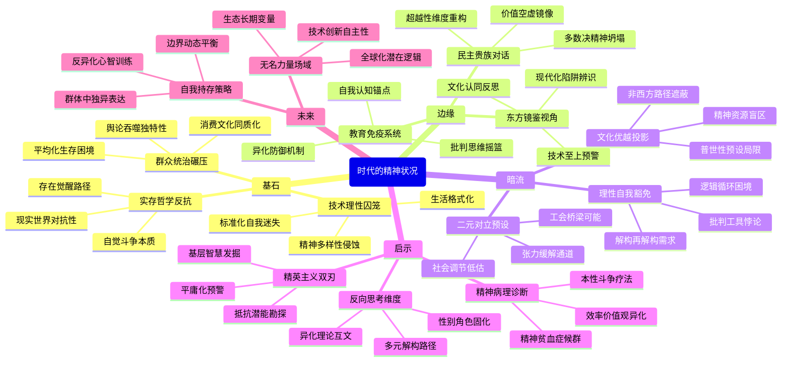

豆瓣链接：https://book.douban.com/subject/23774527/

# 深层解构

### 一、基石：存在之痛与自我救赎的永恒博弈
雅斯贝斯以存在主义哲学为支点，构建起对现代性的批判大厦，其核心信念渗透于全书的字里行间。
- **技术理性的囚笼**：在书中，作者把技术和机器视为现代生活秩序的决定性力量，它们如同一张无形的巨网，将人类的生活全面格式化。流水线生产不仅重塑了物质生产模式，更悄然侵蚀了人类精神世界的多样性，就像文档中提到的“技术和机器成为群众生活的决定因素”，人们在标准化的生活节奏中逐渐迷失自我。
- **群众统治的同质化碾压**：“群众”在雅斯贝斯笔下并非简单的人群集合，而是一股具有强大吞噬力的力量，它通过舆论、消费文化等多种形式，将个体的独特性消磨殆尽，导致“平均化”成为社会的显著特征，这与“群众统治”下个体的生存困境相呼应。
- **实存哲学的反抗号角**：面对技术与群众统治的双重压迫，雅斯贝斯大声疾呼个体必须进行“自觉的斗争”。他认为，个体只有在对现实世界的反抗中，才能真正触及自身存在的本质，这正如原文摘录中所说“个体自我或自我实存，最初即来自他在世中而对此世之反抗”。

### 二、边缘：被轻拂的思想星火
书中有一些观点，作者虽未浓墨重彩地展开论述，但却如星火般蕴含着改变思维的巨大能量。
- **民主与贵族精神的隐秘对话**：当书中探讨民主政治与贵族理想的对立时，实则隐藏着对现代性价值空虚问题的深刻洞察。贵族精神所代表的超越性追求，在民主的“多数决”逻辑中逐渐式微，这暗示着现代社会可能正面临着精神维度的坍塌危机。
- **教育作为文明免疫系统的可能**：在“整体中的意志”部分，教育被提及却未深入探讨。实际上，教育或许是抵御技术异化的关键防线，它有可能成为培养个体批判性思维的摇篮，帮助人们在同质化的浪潮中保持清醒的自我认知，这与文档中教育在整体中的作用相呼应。
- **东方视角的镜像价值**：文档中提到该书对中国现代化具有借鉴意义，这一提示极具启发性。雅斯贝斯对西方现代性的批判，如同一面镜子，让我们在审视自身现代化进程时，能够警惕技术至上、文化认同缺失等类似陷阱，为我们提供了宝贵的反思视角。

### 三、暗流：未被审视的思维地基
在雅斯贝斯的论述背后，存在着一些未被明确言说的前提假设，这些假设如同隐藏在水下的冰山，支撑着整个论证体系。
- **文化优越论的无意识投射**：作者在剖析西方文化传统与现代性的冲突时，不自觉地将西方经验视为具有普世性的模板。这种视角忽视了非西方文明在现代化进程中可能拥有的独特路径和精神资源，带有一定的文化局限性。
- **个体与社会的二元对立预设**：书中过于强调个体与技术化社会之间的对抗关系，却在一定程度上低估了社会结构内部自我调节的可能性。例如，工会组织、公益运动等社会力量，有可能在个体与技术社会之间搭建起沟通的桥梁，缓解二者的紧张关系。
- **理性批判的自我豁免**：雅斯贝斯对技术理性进行了深刻批判，但他的哲学论述本身仍依赖于理性逻辑。这种理性的自我指涉问题，暴露出存在主义哲学在批判现代性时可能存在的内在矛盾，即如何在运用理性的同时避免陷入理性的窠臼。

### 四、给读者的三重启示
- **顿悟：现代性的精神病理报告**：这本书本质上是一份关于现代社会的精神病理诊断书。它揭示出，当技术成为衡量一切的标准，当“效率”“成功”成为主流价值观时，人类正在经历一场“精神贫血症”。而治愈的关键，就在于文档中所说的“自觉地为自己的真实本性而斗争”，重新找回被现代性淹没的个体存在的独特光芒。
- **惊喜：反向思考的可能性**：如果我们引入马克思的异化理论来审视书中观点，会发现雅斯贝斯所批判的精神困境，与劳动异化存在着深刻的内在关联。从女性主义视角出发，还能进一步思考性别角色在技术化社会中的固化问题，为理解现代性困境提供更多元的维度。
- **发现：精英主义的双刃剑**：雅斯贝斯对“群众”的批判，暗含着精英主义的价值取向。这种取向虽然有助于我们警惕大众文化的平庸化趋势，但也可能导致对普通民众实践智慧的忽视。事实上，基层社会中蕴含着丰富的抵抗技术异化的智慧和力量，等待着我们去发现和挖掘。

### 五、思想接力的下一棒
雅斯贝斯的深刻洞见为我们理解现代性提供了宝贵的钥匙，但同时也留下了未竟的课题：在技术深度嵌入生活的今天，个体如何在不脱离社会的前提下实现真正的自我？当全球化使不同文明相互碰撞时，雅斯贝斯的理论又该如何调整以适应多元文化的语境？这些问题，正是需要我们在阅读之后继续思考和探索的方向，让这本书所引发的思想共鸣，成为我们走向更深刻认知的新起点。

# 章节内容
### 英译本重印前言
此部分着重凸显了《时代的精神状况》这本书在理解现代西方人的精神境遇方面所具有的关键价值，解释了重印此书对于深入探究现代社会精神文化演变历程的重要意义，为后续深入解读文本搭建了一个基础框架，让读者初步感知到本书在研究现代精神状况领域的独特地位与不可替代性。

### 导言
深入剖析了时代意识的起源，细致阐述了西方社会在现代化浪潮汹涌推进的过程中，其精神文化领域遭遇了前所未有的巨大变革。多种复杂因素相互交织，共同对人们的精神状况施加影响，如工业化进程、社会结构变迁、思想观念的更迭等。这一章节为后续全面且深入地探讨现代精神状况的各个层面与维度，进行了理论与背景的铺垫，引导读者逐步走进作者所构建的关于时代精神状况的深度剖析体系之中。

### 第一篇 生活秩序的界限
 - **第一章 技术和机器成为群众生活的决定因素**
    - 关键论点：技术与机器的迅猛发展已然彻底重塑了人们的生活模式，并且在现代社会中强势占据了群众生活的主导地位，成为左右人们生活走向的关键力量。
    - 主张：技术进步在极大程度上提升了物质生活水平，为人们带来了诸多便利与舒适。然而，与此同时，人在高度发达的技术体系面前逐渐丧失了自主性，沦为技术的附庸，生活的各个方面被技术所左右，失去了对自身生活节奏与方式的自主掌控权，陷入一种被技术异化的困境之中。例如，人们过度依赖各种技术设备，生活作息被电子设备所支配，社交方式被网络技术所限定等。
 - **第二章 群众统治**
    - 关键论点：在现代社会的演进历程中，群众的力量不断崛起并日益壮大，逐渐成为一股对社会各个层面均产生深远影响的重要势力，由此引发了一系列全新的社会现象与变革趋势。
    - 主张：群众的兴起从根本上改变了传统的社会结构与权力格局。一方面，它有力地推动了民主进程的拓展与平等观念的普及，使得更多的个体能够参与到社会事务之中，表达自身的诉求与意愿；另一方面，群众运动也可能潜藏着盲目性与无理性的风险，容易在某些特定情境下被误导或陷入极端化，进而对社会秩序与稳定造成冲击。例如，一些大规模的群众集会或网络舆论浪潮，可能在缺乏理性思考与深入分析的情况下，迅速蔓延并引发社会动荡或不公正的现象。
 - **第三章 技术性的群众秩序与人的生活之间的张力**
    - 关键论点：现代生活秩序在技术与群众力量的双重塑造下，与个体独特的生活体验和需求之间产生了显著且尖锐的矛盾冲突，这种张力构成了现代精神状况的重要特征之一。
    - 主张：技术性的群众秩序以追求效率、标准化和大规模生产为主要导向，强调统一性与规范性。而与之相对的是，人的生活本身蕴含着丰富的多样性、个体性与独特性，每个人都有着不同的情感、价值观和生活目标。这种差异导致了两者之间难以避免的张力，使得人们在遵循生活秩序的同时，往往感到内心的压抑与自我的迷失，精神层面陷入一种挣扎与困惑的状态。例如，在工业化生产体系中，工人可能在流水线上机械地重复着相同的动作，个人的创造力与个性被极大地压抑，难以在这种标准化的秩序中找到生活的真正意义与价值。
 - **第四章 稳定不变的生活秩序的不可能性**
    - 关键论点：现代社会的生活秩序处于持续不断的动态变化过程之中，受到众多复杂因素的交互影响，根本无法维持一种绝对稳定、静止不变的状态。
    - 主张：社会的政治变革、经济波动、文化思潮的涌动以及科技的飞速创新等诸多因素，都在时刻推动着生活秩序的调整与演变。这种变化性既是现代社会发展的必然结果，也是其活力与进步的体现。然而，对于个体而言，却需要不断地适应这种瞬息万变的生活秩序，在变动的浪潮中努力寻找自身的定位与意义。例如，随着互联网技术的迅猛发展，传统的商业模式、社交模式以及就业模式都发生了翻天覆地的变革，人们必须不断学习新的技能与知识，才能在新的生活秩序中谋求生存与发展，否则就容易被时代所淘汰。
 - **第五章 企图证明被当作绝对而表述的生活秩序能够建立的种种尝试（现代诡辩）**
    - 关键论点：对那些试图构建一种绝对化、固定不变的生活秩序的错误观念与理论进行了深刻批判与剖析，揭示了其内在的荒谬性与不切实际性。
    - 主张：某些理论学说或社会思潮试图以一种单一的、普适性的模式来构建整个社会的生活秩序，将其视为绝对真理而强行推广与实施。然而，这种做法完全忽视了现实世界的复杂性、多样性以及变化性，没有认识到不同地区、不同群体、不同文化背景下的人们有着各自独特的生活需求与价值观念。这种绝对化的构建尝试最终只能是空中楼阁，无法真正落地生根并有效运行，反而可能引发更多的社会矛盾与问题。例如，一些极端的乌托邦式的社会构想，在实践过程中往往因为无法适应现实的复杂情况而导致失败，给社会带来巨大的动荡与灾难。
 - **第六章 当代生活秩序的危机状况**
    - 关键论点：全面而深入地揭示了当代生活秩序所面临的重重危机及其在各个层面的具体表现形式，为深入理解现代社会的困境与挑战提供了清晰的视角。
    - 主张：在现代社会中，价值失落成为一个极为突出的危机表现，传统的价值体系在现代思潮与物质追求的冲击下逐渐瓦解，人们陷入一种价值迷茫与信仰缺失的状态；人际关系淡漠也是危机的重要体现之一，随着城市化进程的加速与社会竞争的加剧，人与人之间的情感联系变得日益脆弱，社会信任度降低，孤独感与疏离感在人群中蔓延。这些危机的根源在于生活秩序的失衡，过度追求物质利益与效率而忽视了精神层面的滋养与人文关怀。人们迫切需要对这种现状进行深刻反思，并积极探寻有效的解决之道，以重建健康、和谐的生活秩序。例如，在现代都市中，邻里之间往往互不相识，人们更多地关注自身的利益与发展，缺乏对他人的关心与帮助，社区凝聚力低下，这种人际关系的淡漠对个人的心理健康与社会的稳定发展都产生了负面影响。

### 第二篇 整体中的意志
 - **第一章 国家**
    - 关键论点：深入探讨了国家在现代社会复杂体系中所扮演的核心角色以及所发挥的多方面重要作用，分析了国家权力在现代社会中的扩张趋势及其对个人与社会整体产生的深远而广泛的影响。
    - 主张：在现代社会，国家权力呈现出不断扩张的态势，它广泛渗透到政治、经济、文化等各个领域，成为影响社会运行与个人生活的关键力量。国家通过制定法律法规、实施政策调控、提供公共服务等多种方式，对社会资源进行分配与整合，塑造着社会的发展方向与结构形态。然而，这种权力的扩张也引发了诸多争议与思考，如国家权力与个人自由之间的平衡问题，国家在推动经济发展过程中可能出现的干预过度或失灵现象，以及国家在文化领域的引导与管控对文化多样性和思想自由的潜在影响等。例如，在某些国家，政府对经济的过度干预可能导致市场机制的扭曲，影响企业的创新活力与经济的可持续发展；而在文化方面，过度的审查制度可能限制了艺术创作的自由与文化的多元交流，阻碍文化的繁荣与创新。
 - **第二章 教育**
    - 关键论点：细致分析了教育在现代社会中的实际状况以及所面临的诸多严峻问题，强调了教育本应肩负的培养全面发展的人的重要使命与现实之间的差距。
    - 主张：教育的初衷与理想目标是促进人的全面发展，包括知识技能的传授、道德品质的培养、人格精神的塑造以及创造力与批判性思维的激发等多个维度。然而，在现代社会的现实语境下，教育却面临着诸多困境。教育的功利化倾向日益严重，过于注重考试成绩、升学就业等功利性目标，而忽视了学生的个性发展与综合素质的提升；教育的标准化模式也在一定程度上束缚了学生的创造力与独特性，课程设置、教学方法等方面的统一化要求难以满足不同学生的多样化学习需求。这种现状不仅影响了学生个体的成长与发展，也对整个社会的创新能力与文化传承产生了负面影响。例如，许多学校为了提高升学率，大量增加学生的课业负担，减少了学生参与社会实践、艺术体育活动的时间与机会，导致学生在知识学习与应试技巧方面可能有所提升，但在社会责任感、团队协作能力、创新思维等方面却相对薄弱，难以适应未来社会复杂多变的需求。
 - **第三章 整体的不可理解性**
    - 关键论点：明确指出在现代社会的宏观视野下，整体世界由于其高度的复杂性、多样性以及快速的变化节奏，已经变得愈发难以被个体所全面理解与把握，这给人们的认知与精神世界带来了巨大的困惑与挑战。
    - 主张：现代社会中，科技的飞速发展使得知识信息呈爆炸式增长，各个领域的专业分化日益精细，不同学科、不同文化、不同社会现象之间的相互交织与影响错综复杂。个体在面对如此庞大而繁杂的整体世界时，往往感到力不从心，难以凭借自身的有限认知能力与经验去构建一个完整、清晰的世界图景。这种对整体的不可理解性不仅影响了人们对外部世界的认识与判断，也在一定程度上导致了人们内心的焦虑与不安，促使人们在精神层面不断寻求新的认知方式与意义建构途径。例如，在全球化的背景下，国际政治经济格局的风云变幻、跨国文化交流与冲突的频繁发生、新兴科技如人工智能、基因工程等领域的快速突破，都使得普通民众难以跟上时代的步伐，理解这些现象背后的深层次逻辑与影响，从而在思想上产生迷茫与困惑，对自身在世界中的定位与未来的发展方向感到不确定。

### 第三篇 精神的衰亡与可能性
 - **第一章 教化**
    - 关键论点：深入探讨了教化在现代社会中的逐渐衰落现象及其对个人与社会所产生的广泛而深刻的影响，揭示了这一现象背后所蕴含的文化危机与精神困境。
    - 主张：传统的教化方式在现代社会中面临着诸多挑战与困境，其影响力与有效性逐渐式微。在现代文化多元、价值多元以及信息传播快速便捷的背景下，传统的以家庭、学校、社会为主要载体的教化模式难以适应新的社会环境。一方面，家庭结构的变迁、家庭教育功能的弱化使得传统的家庭教化在传承道德观念、文化习俗等方面的作用大打折扣；另一方面，学校教育在功利化的导向下，对学生的精神素养与文化内涵的培养不够重视，过于注重知识技能的传授而忽视了人格的塑造与价值观的引导。这种教化的衰落导致人们在精神素养方面出现滑坡，对传统文化的认同感与归属感降低，文化传承面临断裂的危险，社会的道德风尚与人文精神也受到不同程度的侵蚀。例如，一些传统的礼仪文化、道德规范在现代社会中逐渐被遗忘或漠视，人们在公共场合缺乏基本的文明礼仪，社会责任感淡薄，个人主义、功利主义盛行，这些现象都与教化的衰落有着密切的关联。
 - **第二章 精神的创造**
    - 关键论点：着重强调了精神创造在当代社会背景下所具有的至关重要的意义与价值，以及在困境中实现精神创造的可能性与途径，为突破现代精神困境提供了一种积极的思考方向。
    - 主张：尽管现代社会面临着诸多精神层面的困境与挑战，如价值迷失、文化冲突、精神异化等，但精神创造依然是人类摆脱困境、寻求新的意义与价值的关键所在。精神创造能够激发个体的内在潜能与创造力，促使人们在面对复杂多变的现实世界时，以独特的视角、创新的思维去探索未知、表达自我、构建新的文化与价值体系。它不仅有助于个人在精神层面实现自我超越与成长，也能够为整个社会注入新的活力与创造力，推动社会的文化进步与精神文明建设。例如，在文学、艺术、哲学等领域，艺术家、作家、思想家们通过不断的精神创造，创作出众多具有深刻思想内涵与独特艺术魅力的作品，这些作品不仅反映了当代社会的精神风貌与问题，也为人们提供了新的思考角度与精神滋养，激发了更多人对精神世界的关注与探索，从而在一定程度上缓解了现代社会的精神危机，为社会的发展提供了精神动力与文化支撑。

### 第四篇 当代关于人的实存的观念
 - **第一章 关于人的科学**
    - 关键论点：深入剖析了关于人的科学研究在现代学术语境下的发展状况、研究方法及其所固有的局限性，揭示了其在全面理解人的本质与存在意义方面的不足与困境。
    - 主张：人的科学，包括心理学、社会学、人类学等多个学科领域，试图运用实证研究方法、量化分析手段以及科学理论模型来客观地研究人，揭示人类行为、心理、社会关系等方面的规律与特征。然而，人作为一种具有高度复杂性、主观性与独特性的存在，其本质与存在意义难以被完全还原为科学研究中的数据与模型。人的情感、意志、信仰、价值观等精神层面的因素以及个体在不同情境下的自由选择与创造性行为，往往超出了科学研究的范畴与解释能力。因此，在认识人的过程中，我们应当充分认识到人的科学研究方法与结论的相对性，避免过度依赖科学研究而忽视了人的精神性与超越性的一面。例如，在心理学研究中，虽然能够通过实验研究揭示人类某些心理现象的普遍性规律，但对于个体在特定生活经历下所形成的独特心理体验与情感反应，却难以做到精准的把握与全面的理解；社会学研究在分析社会结构与群体行为时，也往往难以涵盖个体在社会变革过程中的自主选择与创新行动对社会发展的独特影响。
 - **第二章 实存哲学**
    - 关键论点：系统阐述了实存哲学的核心内涵、基本理念及其在当代社会理解人的实存状况方面所具有的独特意义与价值，为深入探究人的存在本质提供了一种不同于传统科学研究的哲学视角。
    - 主张：实存哲学将关注的焦点聚焦于人的个体存在、自由与选择，强调人在世界中的独特地位与主观能动性。它认为人并非仅仅是被外部环境所决定的被动存在，而是具有自我意识、自我选择与自我超越能力的主体。实存哲学鼓励人们在面对生活的困境与不确定性时，深入反思自身的存在状态，积极探索生命的意义与价值，通过个体的自由选择与行动来塑造自己的人生。在当代社会，实存哲学为人们在物质主义、功利主义盛行的环境中，提供了一种回归内心、关注自我存在的精神指引，帮助人们在纷繁复杂的世界中寻找自我、坚守自我，避免在社会潮流的裹挟下迷失方向。例如，在现代社会的职业选择与人生规划中，实存哲学提醒人们不应仅仅被社会地位、经济利益等外在因素所左右，而应充分考虑自己的兴趣、才能、价值观等内在因素，做出符合自己内心真实意愿的选择，以实现个体存在的独特价值与意义。

### 第五篇 人类可能的未来
 - **第一章 无名的力量**
    - 关键论点：深入探讨了在现代社会与未来发展进程中，那些难以被明确界定、却又对人类未来走向产生深远影响的无名力量，分析了其作用机制、表现形式以及所蕴含的不确定性与挑战。
    - 主张：在现代社会的复杂体系中，存在着诸多无名力量，如技术创新的自发演进、经济全球化的潜在逻辑、社会文化思潮的悄然涌动以及生态环境变化的长期影响等。这些力量虽然没有明确的主体或单一的控制中心，但却在潜移默化中塑造着人类的未来。技术创新在推动社会进步的同时，也可能带来诸如人工智能伦理问题、生物技术安全隐患等不确定性风险；经济全球化在促进资源优化配置与文化交流的过程中，也引发了全球经济失衡、文化冲突加剧等问题；社会文化思潮的变化影响着人们的价值观与生活方式，但也可能导致社会分化与思想混乱。人类需要敏锐地感知这些无名力量的存在，深入研究其运行规律，以便更好地应对其带来的不确定性与挑战，在未来的发展中掌握主动。例如，随着人工智能技术的快速发展，人们担心机器智能可能会超越人类智能，导致就业结构的巨大变革、社会伦理秩序的混乱等问题，但由于技术创新的复杂性与自主性，很难有一个单一的主体能够完全掌控其发展方向，这就需要全球范围内的跨学科合作与社会各界的共同参与，来探讨应对之策。
 - **第二章 个体自我在当代状况中的维持**
    - 关键论点：着重强调了在当代社会复杂多变、充满各种压力与挑战的状况下，个体保持自我独立性、自主性与独特性的重要性，并探讨了实现这一目标的有效方法与途径。
    - 主张：现代社会中，个体面临着来自社会、文化、经济等多方面的压力与诱惑，如社会竞争的激烈、消费文化的侵蚀、群体舆论的压力等，这些因素都可能导致个体自我的迷失与异化。个体自我的维持对于个人的心理健康、人格健全以及人生价值的实现具有至关重要的意义。个体需要通过不断的自我反思、自我认知，明确自己的价值观、兴趣爱好与人生目标，在面对外界的干扰与诱惑时，坚守自己的内心底线与原则。同时，个体还需要积极培养自己的批判性思维能力与独立思考能力，不盲目跟从社会潮流，勇于在群体中表达自己的独特见解与观点，通过与他人的交流与互动，在保持自我的同时，也能够拓展自己的视野与认知边界。例如，在消费文化盛行的当下，个体需要警惕过度消费对自我价值观的扭曲，不被广告宣传与时尚潮流所左右，根据自己的实际需求与经济能力进行理性消费；在社交网络时代，个体要学会在海量信息与多元观点的冲击