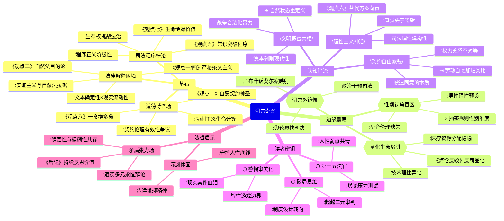

豆瓣链接：https://book.douban.com/subject/35183164/

# 深层解构

### 《洞穴奇案》深层解码：当法律遇见人性的深渊

#### 一、基石：在虚构案件中叩问正义的本质
作者彼得·萨伯延续富勒的思想实验，以洞穴探险者食人案为支点，构建了一个法律哲学的"角斗场"。其核心信念藏在十四位法官的唇枪舌剑中：
- **法律解释的永恒困境**：从观点一"尊重法律条文"的实证主义（首席大法官特鲁派尼）到观点十"生命的绝对价值"的自然法思想（戈德法官），法官们反复拉扯的核心，是**法律文本的确定性与社会现实的流动性之间的永恒张力**。正如富勒借法官之口所说："成文法的古老语言与现实的尖锐矛盾，需要我们在忠实文本与回应正义之间寻找平衡。"
- **道德哲学的具象化博弈**：功利主义（塔利法官"一命换多命"）、契约论（汉迪法官"设身处地"）、责任伦理（弗兰克法官"我愿承担罪名"）等理论不再是抽象概念，而是通过具体案情转化为可触摸的选择。作者真正想传递的是：**法律从来不是纯粹的技术推演，而是不同道德观争夺解释权的战场**。
- **司法程序的神圣性悖论**：所有法官都默认"通过辩论达成正义"的程序正当性，但书中隐藏着一个残酷现实——**当生存底线被突破时，法律程序本身可能成为压迫的工具**。正如救援中牺牲的十位工人与洞穴中牺牲的一人形成镜像，法律在不同场景下对"必要牺牲"的双重标准，暴露了程序正义的阶级性底色。

#### 二、边缘：被轻描淡写的颠覆性洞见
书中那些看似轻掠而过的细节，实则埋着改变思维范式的炸药：
- **生命价值的量化陷阱**：塔利法官用"五大于一"的功利计算看似合理，却被海伦法官反驳："当我们用数字衡量生命时，是否正在把人降格为可以交易的商品？"这个冲突指向现代社会的深层危机——**技术理性对人性价值的吞噬**。书中未深入的是，这种量化思维早已渗透到医疗资源分配、环保政策等领域，洞穴案只是放大了这一矛盾。
- **性别视角的缺席地震**：十四位法官全为男性，当案件涉及"生存本能与道德禁忌"时，女性的身体经验与伦理视角完全被排除。试想，若有女性法官，是否会对"抽签决定生死"这种充满男性竞争色彩的规则提出质疑？这种性别盲区暗示：**传统法理学可能建立在"理性男性"的假定之上，忽视了情感、孕育等女性经验对正义观的影响**。
- **洞穴外的世界镜像**：案件设定在虚构的"纽卡斯国"，但救援过程中政府的决策、媒体的舆论压力等外部因素被简化。事实上，现实中的司法判决从不可能脱离政治环境——这让人联想到美国最高法院的"布什诉戈尔案"，法律裁决如何成为权力博弈的遮羞布。作者回避的"洞穴外因素"，恰是理解真实司法的关键。

#### 三、暗流：沉默的前提与危险的假设
在精密的法律推理之下，藏着作者未加审视的思维地基：
- **理性主义的致命自负**：所有法官都相信通过逻辑辩论可以趋近正义，但现实中，司法判决常受直觉、偏见甚至个人情绪影响。书中"以常识判断"的黑尔法官看似反理性，实则揭示一个真相：**法律理性可能是一种事后建构的神话，真正驱动判决的往往是前理性的价值判断**。这种对理性的盲目信仰，恰是现代法治的"皇帝的新衣"。
- **契约自由的阶级滤镜**：观点十一"契约与认可"强调探险者自愿参与抽签的契约有效性，但忽略了一个前提——**当人们处于极端不平等的权力关系中（如洞穴中的封闭环境），所谓'自愿'可能是被迫的同意**。这让人想起劳动法中的"自愿加班"、消费主义中的"自由选择"，契约自由如何成为强者剥削弱者的合法化工具，书中的讨论浅尝辄止。
- **文明与野蛮的虚假二分**：法官们争论"洞穴是否属于文明社会"，但现代社会的战争、集中营、资本剥削等现象表明：**文明的外衣下从未彻底根除野蛮**。洞穴案不是文明与野蛮的对立，而是文明内部的矛盾激化——当法律无法保障基本生存权时，人是否有权退回"自然状态"？这个问题挑战着所有文明社会的合法性根基。

#### 四、给读者的三把钥匙
- **用"非此即彼"的思维破局**：不要纠结于"是否有罪"的二元判断，而要追问：当法律条文与道德直觉冲突时，我们该如何设计制度来减少这类悲剧？这才是超越个案的现实思考。
- **把自己放进"第十五个法官"的席位**：假设你是新任大法官，面对社交媒体的舆论压力、受害者家属的诉求、探险者家庭的哭声，你是否还能保持纯粹的"法律理性"？这种代入能帮你看见法理之外的真实人性。
- **警惕"思想实验的审美化"**：书中的思辨充满智性美感，但现实中的同类案件（如1884年英国"米尼奈特号案"）充满血腥与痛苦。当我们欣赏逻辑之美时，别忘了思想实验的尽头，是真实的生死抉择。

#### 结语：比答案更重要的，是保持提问
《洞穴奇案》的终极价值，不是给出正义的标准解，而是教会我们在确定与不确定之间保持张力。正如萨伯在序言中所说："真正的智慧，是学会与矛盾共存。"当你合上书卷，若能对"合法"与"合理"、"个体"与"集体"、"程序"与"结果"产生新的困惑，便是这场思想冒险的真正开始——毕竟，法律的终极命题，从来不是征服理性，而是守护人类在深渊边缘的体面。

# 章节内容

### **《洞穴奇案》核心内容与论证结构大纲**

#### **引子：案情概述 (The Foundational Case)**

*   **事件**: 五名探险者被困，为生存抽签杀死并分食了提议者威特摩尔。
*   **法律困境**: 幸存的四人被控谋杀，初审依据**任何故意剥夺他人生命者应处死刑**的法条判处有罪。
*   **核心问题**: 法律条文应否在极端情境下被僵化适用？法律、道德与生存之间的冲突如何解决？

---

### **第一部分：富勒的五种经典司法意见 (The Classic Judicial Divide)**

*   **第一层：法律与道德的分野**

    1.  **首席法官特鲁派尼 (Chief Justice Truepenny): 严格的法律实证主义 + 行政赦免**
        *   **核心主张**: 法院职责是**严格适用法律条文**，因此判决有罪。
        *   **解决方案**: 通过司法体系外的**行政赦免**来达成实质正义，维护权力分立。

    2.  **基恩法官 (Justice Keen): 纯粹的法律实证主义**
        *   **核心主张**: 彻底分离法律与个人道德，**法官的唯一任务是忠于立法者的文本**。
        *   **关键论点**: 探究“法律目的”是篡夺立法权，必须进行**字面解释**以维护法治。

    3.  **福斯特法官 (Justice Foster): 自然法学派**
        *   **核心主张**: 实在法在此案中失效，应适用更高的法律原则。
        *   **关键论点**:
            *   **论点一 (空间维度)**: 洞穴内是**自然状态”**，受社会契约而非实在法规制。
            *   **论点二 (精神维度)**: 法律应做**目的性解释**，避免荒谬结果，法律必须服务于人之常情。

*   **第二层：现实与理论的拉扯**

    4.  **汉迪法官 (Justice Handy): 法律现实主义**
        *   **核心主张**: 法律是解决社会问题的工具，应**注重实际后果和公众感受**。
        *   **关键论点**: 判决应符合**常识和90%的民意**，以维护公众对法律体系的信任。

    5.  **唐丁法官 (Justice Tatting): 司法过程的困境**
        *   **核心主张**: 各种法律原则相互冲突，无法做出合乎逻辑的决定。
        *   **解决方案**: 因无法解决内心的**理智与情感冲突**，选择**回避判决**。

---

### **第二部分：萨伯的九种现代法学视角 (Modern Jurisprudential Expansion)**

*   **第三层：深入道德与社会批判**

    6.  **伯纳姆法官 (Justice Burnham): 精细的道德哲学**
        *   **核心工具**: 区分**证成”(Justification) 与 “宽恕”(Excuse)**。
        *   **关键论点**: 杀人行为是错误的，但在极端胁迫下是**可宽恕的**。

    7.  **斯普林汉姆法官 (Justice Springham): 女权主义法学**
        *   **核心工具**: **关怀伦理 (Ethic of Care)**。
        *   **关键论点**: 批判案件中基于对抗和暴力解决问题的“男性逻辑”，主张法律应体现关怀与责任。

    8.  **塔利法官 (Justice Tally): 批判性理论**
        *   **核心视角**: 法律是**权力的体现**。
        *   **关键论点**: “抽签”程序掩盖了权力不平等，判决应旨在**引发社会对法律背后权力结构的反思**。

*   **第四层：非传统视角的应用**

    9.  **戈尔丁法官 (Justice Goulding): 法律经济学分析**
        *   **核心标准**: **效率 (Efficiency)** 与社会总福利最大化。
        *   **关键论点**: 牺牲一人保全四人是**有效率的”**，实现了生命价值最大化。

    10. **弗兰克法官 (Justice Frank): 心理分析现实主义**
        *   **核心主张**: 司法判决的根源是**法官个人的潜意识心理**。
        *   **关键论点**: 法律理论是外衣，法官应坦诚面对主观性，并最终依赖社会常识。

    11. **翁法官 (Justice Wun): 东方/儒家思想**
        *   **核心目标**: **恢复和谐 (Harmony)** 与关系修复。
        *   **关键论点**: 法律不应仅是裁决，更应是教化与重建社会伦理的工具。

*   **第五层：法律工艺与原则的重塑**

    12. **卢埃林法官 (Justice Llewellyn): 情境主义与法律工艺**
        *   **核心理念**: 法官是**法律的工匠 (Law-craft)**。
        *   **关键论点**: 灵活运用和重塑法律工具，以达成**情境中的正义”**。

    13. **特朗佩特法官 (Justice Trumpett): 程序正义**
        *   **核心主张**: 在实体正义不明时，**程序的公平性是唯一的依靠**。
        *   **关键论点**: 洞穴中的抽签是一个公平程序，其产生的结果应被尊重。

    14. **邦德法官 (Justice Bond): 现代强硬自然法**
        *   **核心主张**: 存在超越实在法的客观道德法则。
        *   **关键论点**: 被告的行为不仅可宽恕，更是被**最大多数人生存权**这一更高法则所**证成的 (Justified)**。

---

好的，作为历史和文化领域的学者，我将为您逐章节总结彼得·萨伯所著的《洞穴奇案》一书。本书的核心结构是建立在法理学家富勒（Lon L. Fuller）于1949年提出的经典假想公案之上的。萨伯在富勒原有的五位法官意见基础上，续写了九个全新的法官意见，极大地拓展了案件的思辨深度。

因此，本书的“章节”实际上是每一位法官的判决意见。我将首先概述案情，然后依次总结富勒笔下的五位法官和萨伯续写的九位法官的意见。

### 案情概述：纽卡斯联邦最高法院，公元4300年

五名洞穴探险协会的成员在探险时，因洞口塌方被困于一个偏远的洞穴中。救援行动异常艰难且代价高昂，先后有十名救援人员在救援过程中丧生。被困二十多天后，探险者们通过无线电与外界取得了联系，得知若无食物，他们将无法撑到获救之时。在询问医生、法官、政府官员和神职人员后，他们均未得到关于能否通过抽签吃掉一人以保全其余四人的建议。此后，无线电通讯中断。在洞穴中的第三十二天，四名探险者获救，而另一名成员罗杰·威特摩尔已被杀害并分食。据幸存者陈述，是威特摩摩本人提议通过掷骰子决定牺牲者，但在最后一刻他表示撤回，其余人则执意为他掷了骰子，最终威特摩尔“不幸”中选，被杀害并吃掉。四名幸存者被起诉，初审法庭依据“任何故意剥夺他人生命者应处以死刑”的法律条文，判决四人有罪并处以绞刑。案件上诉至纽卡斯联邦最高法院，由五位（在萨伯的书中扩展为十四位）法官进行审理。

***

### 第一部分：富勒的五种经典意见

#### 第一章：首席法官特鲁派尼的意见

特鲁派尼法官的意见代表了**严格的法律实证主义和司法克制**。他认为，作为法官，其职责非常简单：忠实地适用国会制定的法律条文。本案中，法律条文“任何故意剥夺他人生命者应处以死刑”的措辞是明确无误的，不存在任何例外条款可以适用于此案。被告们确实故意夺走了威特摩尔的生命，因此，根据法律，他们有罪。特鲁派尼法官拒绝在司法层面考虑任何道德、情感或情境因素，他认为这些都超出了法官的权限。然而，他也深知，如果严格执行这一判决，将导致一个令公众难以接受的、不公正的结果。因此，他的核心主张是，**法庭应当维持有罪判决，但同时全体法官应联名向行政首长请愿，请求对四名被告予以行政赦免**。通过这种方式，既维护了法律的尊严和稳定性（司法克制），又能通过法律体系外的机制（行政权）来实现个案的实质正义。他的观点体现了一种典型的权力分立思想，即司法部门负责解释法律，而仁慈与豁免的权力则属于行政部门。

#### 第二章：福斯特法官的意见

福斯特法官的意见是本书中自然法学派的经典代表，他激烈地反对特鲁派尼的观点，主张被告无罪。他的论证分为两个层面。**第一，他认为当这五名探险者被完全隔绝于纽卡斯联邦的法律秩序之外时，他们实际上已经脱离了实在法的管辖范围，进入了“自然状态”**。在洞穴那个“微型社会”里，通行的法律不再是纽卡斯联邦的法律，而是基于生存需要而产生的社会契约。他们通过抽签决定牺牲者，正是他们在新环境下订立的“法律”。因此，用纽卡斯联邦的法律来评判他们在“自然状态”下的行为，是根本不适用的。**第二，即便认为实在法仍然适用，法官也应当进行目的性解释，而非僵化的字面解释**。福斯特认为，所有法律都有其目的，而刑法的目的之一在于威慑。但在这种极端情境下，为了活命而杀人，法律的威慑力将完全失效。因此，如果一个法律的字面解释会导向荒谬、违背其根本目的的结果，那么法官就应该超越字面含义，探寻法律的“精神”。他强调，**法律必须与人之常情和理性相结合，否则就会变成一部杀人的机器**。

#### 第三章：唐丁法官的意见

唐丁法官的意见代表了**司法过程中的困惑、矛盾与不可知论**。他发现自己完全无法做出决定，因此最终选择退席，放弃投票。他的困惑主要来源于情感与理智、不同法律原则之间的剧烈冲突。一方面，他情感上极度同情被告，认为他们已经遭受了无与伦比的苦难，并且在道德上难以严苛指责。但另一方面，作为法官，他又无法接受福斯特法官的论证。他尖锐地批评了福斯特的“自然状态”理论，认为根本无法界定“自然状态”的起点和终点，而且洞穴内的“契约”也存在瑕疵（威特摩尔最后撤回了同意）。他也无法接受福斯特的目的性解释，因为杀人法案除了威慑，还有惩罚和矫正等多种目的。同时，他又对严格适用法律条文所带来的残酷后果感到厌恶，并且预见到，如果判定有罪，关于何为“故意”的法律界定也会引发无休止的争论。**唐丁法官的意见深刻地揭示了，当相互冲突的法律原则和价值判断同时出现时，一个诚实的法律人可能陷入的智识与情感的双重困境**。他的退席，本身就是一种表态：**本案已经超出了现有法律框架能够完美解决的范畴**。

#### 第四章：基恩法官的意见

基恩法官是法律实证主义的另一位坚定捍卫者，但他比特鲁派尼更为强硬和纯粹。他严厉地批评了所有试图将道德情感和个人好恶代入判决的法官。**他的核心主张是，法官的唯一职责就是适用立法机关制定的法律，法官的个人道德观、智慧或对错判断都与此无关**。他明确表示，自己作为个人，可能会赦免这些人，但这与他作为法官的角色完全是两回事。他逐一驳斥了福斯特的论点，认为所谓“法律的目的”是虚无缥缈的，一部法律往往有多个甚至相互冲突的目的，法官去猜测立法目的，实际上是在用自己的观点篡夺立法权。他坚持，**法律的忠诚解释就是字面解释，这是维护法治、防止司法滥权的最重要防线**。对于“故意”一词，他认为其法律含义就是指行为人知道其行为会导致他人死亡，被告完全符合此定义。因此，尽管他个人可能觉得结果令人遗憾，但他作为法官，必须毫不动摇地得出有罪的结论。至于是否赦免，那是行政首长的事，与司法审判无关。基恩的意见代表了**对法治形式主义的极致追求，强调法律的确定性和可预测性高于个案的实质正义**。

#### 第五章：汉迪法官的意见

汉迪法官是法律现实主义的代表。他嘲笑了其他法官的“玄奥的”法律推理，认为这些都脱离了现实世界。**他的核心主张是，法律只是人类用来解决社会问题的工具，法官应该运用常识和智慧，采取最务实、最能被公众接受的方法来处理案件**。他认为，政府是人民的工具，法官也是政府的一部分，因此必须考虑现实世界的情理和后果。他引用了民意调查，指出90%的民众都希望对这四个人从宽处理或直接释放。汉迪法官认为，**如果判决结果与社会普遍的共识和正义感相去甚远，那么这个判决就是失败的，它会损害公众对整个法律体系的信任**。他主张，法官应该抛开那些复杂的法律技术细节和理论争辩，直接宣告被告无罪。因为这是解决这个棘手案件最简单、最有效、最符合人情的方法。他的观点强调了**法律的社会功能和实用性，认为抽象的法律原则必须服务于现实生活中的具体的人和事**。

***

### 第二部分：萨伯的九种新增意见

（以下章节名为方便理解所加，原书为直接呈现法官意见）

#### 第六章：伯纳姆法官的意见（道德哲学与法律）

伯纳姆法官引入了**更为精细的道德哲学分析**。他认为，此案不能简单地在“法律”与“道德”之间做选择，而应该深入到道德推理的内部。他主张，虽然被告的行为在形式上构成了谋杀，但在道德上是“可宽恕的”。他区分了“证成”（justification）和“宽恕”（excuse）两个概念。一个行为得到“证成”，意味着它是正确的；而得到“宽恕”，意味着它虽然是错误的，但行为人因受到胁迫等因素影响，不应为此承担全部责任。他认为，**杀害威特摩尔是道德上错误的行为，但被告是在极端胁迫下做出的，因此应该得到宽恕**。他进一步提出，法律中应该包含这种道德上的“宽恕”原则。他认为，虽然法律条文没有明确写出“紧急避险”的条款，但法律的精神和许多判例都蕴含了对极端胁迫下行为的宽容。因此，他主张撤销有罪判决，宣判被告无罪，其理由并非他们的行为是对的，而是**法律应当承认并吸纳这种深刻的道德困境下的“可宽恕性”**。

#### 第七章：斯普林汉姆法官的意见（女权主义法学）

斯普林汉姆法官从**女权主义法学的视角**对案件进行了全新的解读。她尖锐地指出，整个案件的讨论都建立在一个由男性主导的、崇尚抽象规则和竞争逻辑的视角之上。她批评了洞穴探险者们诉诸掷骰子这种“雄性”的、基于概率和暴力的解决方案。她认为，一种基于**关怀伦理（ethic of care）**的视角可能会导向完全不同的结果。或许，他们应该共同分担痛苦，一起面对死亡，而不是通过牺牲一人的方式来求生。她还指出，本案中被吃掉的威特摩尔是“游戏的发起者”，这本身就充满了男性气质的竞争和冒险隐喻。斯普林汉姆法官认为，**法律不应仅仅是冰冷的规则，还应体现关怀、沟通和责任等价值**。她主张，虽然无法改变已经发生的悲剧，但在判决中，法庭应该承认并反思这种“男性中心”的解决问题模式的局限性。最终，她认为现有的法律框架无法处理这种深层次的伦理问题，因此倾向于一种既能承认被告行为的错误，又不对他们施加最严酷惩罚的中间道路，例如判定罪名成立但建议立即假释。

#### 第八章：塔利法官的意见（批判性种族理论视角）

塔利法官运用了**批判性种族理论和后殖民理论**的视角。他指出，纽卡斯联邦的法律体系并非像其他法官所宣称的那样普适和中立，而是建立在特定历史和权力结构之上的。他将洞穴中的探险者类比为历史上的殖民者或开拓者，他们在“新大陆”上制定自己的规则，并以牺牲“他者”（在此案中是威特摩尔）为代价来确保自身的生存和繁荣。他认为，**“抽签”这种看似公平的程序，往往掩盖了背后深刻的权力不平等**。他质疑，如果威特摩尔属于某个少数族裔或弱势群体，我们是否还会如此轻易地接受这个“契约”的合法性？塔利法官主张，法律判决必须揭示并挑战这些隐藏在法律语言背后的权力关系。他认为，简单地宣判有罪或无罪，都无法触及问题的核心。他倾向于做出一个能够**引发社会反思的判决，即承认法律在处理此类根植于权力与牺牲的事件时的局限性，并呼吁社会对自身历史和法律的正当性进行更深刻的批判**。他的结论可能是模糊的，因为他认为司法判决的目标不应是终结争议，而是开启更广泛的社会对话。

#### 第九章：戈尔丁法官的意见（法律经济学分析）

戈尔丁法官完全从**法律经济学**的角度来分析此案。他认为，法律的核心目的在于**促进社会资源的最有效利用，实现社会总福利的最大化**。在此案中，问题可以被转化为一个简单的成本效益计算。如果不杀威特摩尔，结果将是五个人死亡；如果杀了他，结果是一个人死亡，四个人存活。从功利主义和经济效率的角度看，后者的结果显然更优，因为它保全了四个人的“人力资本”，实现了“帕累托最优”式的改进（尽管是以牺牲一人为代价）。戈尔丁法官主张，**法律规则应当被设计成能够激励人们在未来做出能够最大化社会价值的选择**。因此，判决被告有罪，将会在未来阻止处于类似绝境的人们采取最优的自救措施，从而导致更大的社会福利损失。他认为，**威特摩尔的生命虽然宝贵，但在这种特定情境下，与其他四个人的生命相比，牺牲他是“有效率的”**。因此，他基于效率原则，主张被告无罪。

#### 第十章：弗兰克法官的意见（心理分析与司法过程）

弗兰克法官是一位**法律现实主义者，但更侧重于法官的个人心理分析**。他继承了汉迪法官的现实主义精神，但将其推向了更深的层次。他认为，所有法官的判决，表面上是基于高深的法律理论，但**实际上都源于他们无法言明的、潜意识的个人偏好、情感经历和心理特质**。他逐一“解剖”了前面几位法官的意见，指出特鲁派尼的保守、福斯特的理想主义、基恩的刻板、唐丁的优柔寡断，都不过是他们个人性格在司法意见上的投射。弗兰克法官坦率地承认，他自己也无法免俗。他认为，法官应该做的，不是假装客观，而是**诚实地面对自己的主观性，并努力去理解这些主观偏见如何影响自己的判断**。在承认了这种不可避免的主观性之后，他认为最可靠的指南针，反而是汉迪法官所说的“公众情感”和“常识”。因为这至少代表了一种集体的、经过社会检验的直觉。因此，他也主张被告无罪，其理由并非基于某个宏大的法律理论，而是基于对司法过程“去魅”后的坦诚。

#### 第十一章：翁法官的意见（儒家思想与和谐）

翁法官（Judge Wun，明显带有东方色彩的名字）引入了**一种非西方的、类似于儒家思想的视角**。他批评了整个法庭辩论充满了对抗性和零和博弈的思维。他认为，法律的最高境界不应是裁决对错，而应是**恢复和谐、教化人心**。他指出，探险者们在洞穴中的行为，无论从哪个角度看，都是一场深刻的悲剧，破坏了人与人之间的和谐关系。西方法律体系执着于权利、规则和惩罚，却忽略了修复关系和促进德性的功能。翁法官认为，**一个理想的判决，不应是简单的有罪或无罪，而应是一个能够让被告真心忏悔、让社会从中吸取教训、最终重归和谐的方案**。他可能会提出一些非常规的解决方案，例如，要求四名幸存者用余生为威特摩尔的家庭服务，或者建立一个基金来纪念所有在此次事件中死去的人（包括救援人员）。他的最终判决可能会是“有罪，但暂缓执行”，附带一系列旨在实现“关系修复”和“道德重建”的条件。这种观点，将法律视为一种促进社会伦理和和谐的工具，而非仅仅是权利的裁判者。

#### 第十二章：卢埃林法官的意见（情境主义与法律工艺）

卢埃林法官（向现实主义法学家卡尔·卢埃林致敬）代表了**情境主义和对“法律工艺”（Law-craft）的精妙运用**。他认为，之前的法官都陷入了“大理论”的陷阱，而忽略了作为法律工匠的具体操作。他主张，没有一成不变的法律规则可以适用于所有情境。**法官的技艺在于，根据具体案情，灵活地选择和重塑现有的法律工具，以达到一个“情境中的正义”**。他可能会深入分析“故意”、“胁迫”、“紧急避险”等法律概念在不同历史判例中的演变，展示这些概念本身就是灵活和动态的。他认为，法律条文并非僵死的命令，而是一堆可供法官选择和打磨的“原材料”。在此案中，他可能会论证，尽管没有明确的“紧急避险”杀人条款，但他可以通过解释先例和法律原则，巧妙地“构建”出一个适用于本案的免责规则。卢埃林的重点不在于结果，而在于**展示法官如何通过高超的法律技艺，在不公然违反法律条文的情况下，达成一个实质上公正的判决**。他宣判无罪，并会附上一篇技术性极强、充满判例分析的判决书，以显示其判决的“合法工艺”。

#### 第十三章：特朗佩特法官的意见（程序正义）

特朗佩特法官（Judge Trumpett）将焦点完全放在了**程序正义**上。他认为，案件的实质内容（杀人吃人）已经超出了法律能够优雅处理的范畴，因此，我们唯一能够依赖和评判的，就是**程序本身是否正当**。他详细审查了洞穴中决议的过程：是威特摩尔本人提议的，使用了公认的随机方式（掷骰子），每个人都有同等的机会被选中。尽管威特摩尔最后试图退出，但在那个极端环境下，契约一旦订立，是否允许单方面退出就是一个极具争议的问题。特朗佩特法官认为，**只要程序是公平的、理性的，并且是当时环境下所能采取的最不坏的选择，那么这个程序产生的结果就应该被尊重**。他将法律的关注点从“结果正义”转向了“程序正义”。他主张，在一个我们无法就实体对错达成共识的“硬案”（hard case）中，对一个公平程序的忠诚，是我们维护法治的最后防线。因此，他认为洞穴中的“审判”程序（即掷骰子）是有效的，被告的行为是在执行一个合法程序的结果。据此，他宣判被告无罪。

#### 第十四章：邦德法官的意见（现代自然法学）

邦德法官（向007致敬，暗示其拥有“杀人执照”的权威）代表了一种**现代、更为强硬的自然法学**。他同意福斯特法官关于“自然状态”的观点，但将其推向了更激进的结论。他认为，生命权固然是基础权利，但**在极端状态下，更高的自然法原则——即“最大多数人的生存权”——压倒了个体的生命权**。他认为，这并非一个需要道歉或宽恕的“错误”行为，而是在那种特定条件下唯一“正确”的行为。邦德法官可能会引用战争法中的例子，即为了保全国家可以牺牲士兵的生命。他认为，洞穴中的情况就是一场微型的“生存之战”。**他主张，存在着某种超越实在法的、客观的道德实在，法官有责任去发现并适用这些更高的法则**。当实在法与这种根本的自然法相冲突时，实在法必须让步。他严厉批评了那些试图通过法律技术或行政赦免来回避核心道德问题的法官，认为他们是懦弱的。邦德法官会毫不犹豫地宣判被告无罪，其理由是，他们的行为不仅是可原谅的，而且是**在道德上被证成的（justified）**。