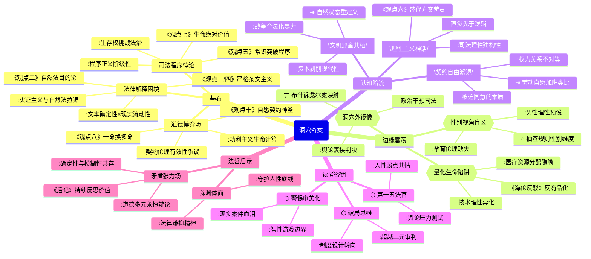

豆瓣链接：https://book.douban.com/subject/35183164/

# 深层解构

### 《洞穴奇案》深层解码：当法律遇见人性的深渊

#### 一、基石：在虚构案件中叩问正义的本质
作者彼得·萨伯延续富勒的思想实验，以洞穴探险者食人案为支点，构建了一个法律哲学的"角斗场"。其核心信念藏在十四位法官的唇枪舌剑中：
- **法律解释的永恒困境**：从观点一"尊重法律条文"的实证主义（首席大法官特鲁派尼）到观点十"生命的绝对价值"的自然法思想（戈德法官），法官们反复拉扯的核心，是**法律文本的确定性与社会现实的流动性之间的永恒张力**。正如富勒借法官之口所说："成文法的古老语言与现实的尖锐矛盾，需要我们在忠实文本与回应正义之间寻找平衡。"
- **道德哲学的具象化博弈**：功利主义（塔利法官"一命换多命"）、契约论（汉迪法官"设身处地"）、责任伦理（弗兰克法官"我愿承担罪名"）等理论不再是抽象概念，而是通过具体案情转化为可触摸的选择。作者真正想传递的是：**法律从来不是纯粹的技术推演，而是不同道德观争夺解释权的战场**。
- **司法程序的神圣性悖论**：所有法官都默认"通过辩论达成正义"的程序正当性，但书中隐藏着一个残酷现实——**当生存底线被突破时，法律程序本身可能成为压迫的工具**。正如救援中牺牲的十位工人与洞穴中牺牲的一人形成镜像，法律在不同场景下对"必要牺牲"的双重标准，暴露了程序正义的阶级性底色。

#### 二、边缘：被轻描淡写的颠覆性洞见
书中那些看似轻掠而过的细节，实则埋着改变思维范式的炸药：
- **生命价值的量化陷阱**：塔利法官用"五大于一"的功利计算看似合理，却被海伦法官反驳："当我们用数字衡量生命时，是否正在把人降格为可以交易的商品？"这个冲突指向现代社会的深层危机——**技术理性对人性价值的吞噬**。书中未深入的是，这种量化思维早已渗透到医疗资源分配、环保政策等领域，洞穴案只是放大了这一矛盾。
- **性别视角的缺席地震**：十四位法官全为男性，当案件涉及"生存本能与道德禁忌"时，女性的身体经验与伦理视角完全被排除。试想，若有女性法官，是否会对"抽签决定生死"这种充满男性竞争色彩的规则提出质疑？这种性别盲区暗示：**传统法理学可能建立在"理性男性"的假定之上，忽视了情感、孕育等女性经验对正义观的影响**。
- **洞穴外的世界镜像**：案件设定在虚构的"纽卡斯国"，但救援过程中政府的决策、媒体的舆论压力等外部因素被简化。事实上，现实中的司法判决从不可能脱离政治环境——这让人联想到美国最高法院的"布什诉戈尔案"，法律裁决如何成为权力博弈的遮羞布。作者回避的"洞穴外因素"，恰是理解真实司法的关键。

#### 三、暗流：沉默的前提与危险的假设
在精密的法律推理之下，藏着作者未加审视的思维地基：
- **理性主义的致命自负**：所有法官都相信通过逻辑辩论可以趋近正义，但现实中，司法判决常受直觉、偏见甚至个人情绪影响。书中"以常识判断"的黑尔法官看似反理性，实则揭示一个真相：**法律理性可能是一种事后建构的神话，真正驱动判决的往往是前理性的价值判断**。这种对理性的盲目信仰，恰是现代法治的"皇帝的新衣"。
- **契约自由的阶级滤镜**：观点十一"契约与认可"强调探险者自愿参与抽签的契约有效性，但忽略了一个前提——**当人们处于极端不平等的权力关系中（如洞穴中的封闭环境），所谓'自愿'可能是被迫的同意**。这让人想起劳动法中的"自愿加班"、消费主义中的"自由选择"，契约自由如何成为强者剥削弱者的合法化工具，书中的讨论浅尝辄止。
- **文明与野蛮的虚假二分**：法官们争论"洞穴是否属于文明社会"，但现代社会的战争、集中营、资本剥削等现象表明：**文明的外衣下从未彻底根除野蛮**。洞穴案不是文明与野蛮的对立，而是文明内部的矛盾激化——当法律无法保障基本生存权时，人是否有权退回"自然状态"？这个问题挑战着所有文明社会的合法性根基。

#### 四、给读者的三把钥匙
- **用"非此即彼"的思维破局**：不要纠结于"是否有罪"的二元判断，而要追问：当法律条文与道德直觉冲突时，我们该如何设计制度来减少这类悲剧？这才是超越个案的现实思考。
- **把自己放进"第十五个法官"的席位**：假设你是新任大法官，面对社交媒体的舆论压力、受害者家属的诉求、探险者家庭的哭声，你是否还能保持纯粹的"法律理性"？这种代入能帮你看见法理之外的真实人性。
- **警惕"思想实验的审美化"**：书中的思辨充满智性美感，但现实中的同类案件（如1884年英国"米尼奈特号案"）充满血腥与痛苦。当我们欣赏逻辑之美时，别忘了思想实验的尽头，是真实的生死抉择。

#### 结语：比答案更重要的，是保持提问
《洞穴奇案》的终极价值，不是给出正义的标准解，而是教会我们在确定与不确定之间保持张力。正如萨伯在序言中所说："真正的智慧，是学会与矛盾共存。"当你合上书卷，若能对"合法"与"合理"、"个体"与"集体"、"程序"与"结果"产生新的困惑，便是这场思想冒险的真正开始——毕竟，法律的终极命题，从来不是征服理性，而是守护人类在深渊边缘的体面。

# 章节内容

好的，已收到您提供的书籍链接。我将仔细研读《洞穴奇案》的内容，深度总结归纳各章节内容，并按照章节顺序为您精心创作一份完整的读书笔记。请您耐心等待。

## 《洞穴奇案》读书笔记

### 导读（一） 摆脱掩耳盗铃的法律形式主义

本部分导读主要批判了法律形式主义，强调法律不能脱离社会现实与伦理道德。形式主义者常常将法律视为一套自洽的体系，忽略了法律的社会效果和公正性。文章呼吁法律人摆脱这种“掩耳盗铃”式的思维，关注法律的实质正义，而不能仅仅满足于法律条文的字面解释。法律的生命在于经验，在于对社会需求的敏锐回应。

### 导读（二） 思想的能力与司法技艺

导读（二）探讨了思想在法律实践中的重要性，以及司法技艺的运用。法律不仅仅是规则的堆砌，更是思想的体现和运用。法官需要具备高超的司法技艺，才能将抽象的法律原则适用于具体的案件，实现个案正义。同时，法官还需要拥有独立思考的能力，敢于挑战传统观念，推动法律的进步和发展。司法技艺与思想能力是相辅相成的，共同构成了卓越的法律实践。

### 序言 史上最伟大的法律虚构案

《洞穴奇案》被誉为“史上最伟大的法律虚构案”，其价值在于引发了深刻的法理思考。序言指出，此案并非简单的法律难题，而是对法律本质、道德伦理以及人类处境的深刻拷问。通过五个探险者在极端情境下的自救行为，引发了关于法律适用、道德判断和人性边界的讨论。这个虚构的案例，成为了法学界重要的思想实验，激发了无数法律人的思考和探索。

### 导言 奇案背后的法理思考

### 引言：虚构案件的法哲学实验

本书以虚构的“洞穴探险者食人案”为载体，构建了一个法律哲学的思想实验。案件背景设定在4300年的纽卡斯国，五名探险者因山崩被困洞穴，在食物耗尽后通过抽签杀死同伴威特莫尔分食求生。获救后，四名幸存者被控谋杀罪，引发最高法院十四位法官的激烈辩论。作者通过十四份截然不同的判决书，展现了实证主义、自然法、功利主义、契约论等多种法律哲学流派的交锋，核心在于探讨法律条文与道德伦理、程序正义与实质正义的冲突。

### 观点一：尊重法律条文（特鲁派尼首席法官）

特鲁派尼主张严格遵循《纽卡斯联邦法典》第十二条A款“任何故意剥夺他人生命者必须被判处死刑”的规定，认定被告有罪。他强调法官的职责是忠实适用法律文本，而非以个人道德或社会舆论干预司法。尽管承认案件的极端性，他仍坚持法律的刚性，认为赦免权应属于行政系统，法官需维护司法权威。这一立场体现了实证主义法学的核心原则——法律与道德分离，形式正义优先于个案情感。

### 观点二：探究立法精神（福斯特法官）

福斯特提出“自然状态”理论，认为洞穴环境下实定法失效，探险者处于“自然法”管辖的原始状态。他主张法律的目的是促进人类共存，被告的行为是为了生存而采取的必要手段，符合立法精神。福斯特通过目的解释法论证被告无罪，强调法律应适应特殊情境，而非机械适用条文。这一观点代表自然法学派，认为法律需与道德伦理相协调，正义的实现需超越文本字面意义。

### 观点三：法律与道德的两难（唐丁法官）

唐丁法官陷入法律与道德的双重困境。他承认紧急避难抗辩的合理性，但认为饥饿不能成为杀人的正当理由，且探险者未穷尽所有生存可能（如等待自然死亡或自残）。同时，他质疑福斯特的“自然状态”理论，认为洞穴与文明社会的界限模糊。最终，唐丁因无法调和矛盾而选择弃权，揭示了法律实证主义与自然法在极端情境下的不可调和性。

### 观点四：维持法治传统（基恩法官）

基恩法官坚决反对福斯特的自然法观点，主张法官必须严守“立法至上”原则，忠实于法律条文。他强调司法权与立法权的界限，认为法官无权通过道德解释创造法律。基恩批判特鲁派尼建议行政赦免的做法，认为这是对司法独立性的侵蚀。这一立场强化了实证主义法学的权威性，主张法律的确定性高于个案正义。

### 观点五：以常识判断（汉迪法官）

汉迪法官从实用主义出发，认为法律应反映社会常识与民意。他援引民意调查结果（90%民众支持宽恕被告），主张司法需贴近公众情感，避免脱离现实。汉迪强调“法律为人服务”，认为在极端困境下，常识判断比机械法条更具合理性。这一观点体现了法律现实主义的倾向，主张司法需考虑社会效果与公众接受度。

### 观点六：紧急避难抗辩不成立（伯纳姆法官）

伯纳姆法官延续实证主义立场，认为紧急避难抗辩需满足严格条件（如无其他选择、危险紧迫性）。他指出探险者未穷尽替代方案（如等待救援或先食用自身组织），且抽签程序存在瑕疵（威特莫尔撤回同意）。伯纳姆强调法律不能为违法行为开绿灯，否则将鼓励更多人以紧急避难为名犯罪。这一观点强化了法律的刚性，否定极端情境下道德对法律的修正。

### 观点七：生命的绝对价值（特朗派特法官）

特朗派特法官主张生命具有不可量化的绝对价值，反对任何形式的“一命换多命”功利计算。他认为杀人行为本身违背道德伦理，无论结果如何都不可宽宥。特朗派特强调法律应维护生命尊严，即使在绝境中也不能妥协。这一立场体现了义务论伦理学的核心，将道德原则置于结果考量之上。

### 观点八：一命换多命（塔利法官）

塔利法官从功利主义出发，认为牺牲一人拯救四人是“划算的交易”。他通过数学计算论证生命价值的量化合理性，主张法律应追求社会总福利最大化。塔利批判特朗派特的绝对主义，认为在资源有限的情况下，必要牺牲是理性选择。这一观点代表功利主义法学，将结果导向作为司法裁判的核心标准。

### 观点九：动机与选择（海伦法官）

海伦法官关注被告的主观动机，认为其行为是在“死亡胁迫”下的非自愿选择。她区分“故意杀人”与“情境强制”，主张紧急避难抗辩成立。海伦批判伯纳姆对替代方案的苛求，认为在极端虚弱状态下，探险者无法实施其他行为。这一观点强调主观意志对责任认定的影响，体现了主观主义法学的倾向。

### 观点十：契约与认可（戈德法官）

戈德法官从契约论角度出发，认为探险者通过抽签达成的契约具有法律效力。他主张自愿参与抽签即意味着接受结果，威特莫尔的撤回行为破坏了契约完整性。戈德强调法律需保护契约自由，即使在极端情境下，承诺的履行也是正义的基础。这一观点将契约伦理引入司法裁判，强化了意思自治的法律价值。

### 观点十一：设身处地（弗兰克法官）

弗兰克法官采取共情视角，假设自己处于相同情境下可能做出同样选择。他主张法律应考虑人性弱点，对绝境中的行为给予宽恕。弗兰克批判法律的冷酷理性，认为司法需保留对人类脆弱性的理解。这一观点体现了情感主义法学的倾向，强调道德直觉对法律判断的影响。

### 观点十二：判决的道德启示（雷肯法官）

雷肯法官强调法律的道德教化功能，认为有罪判决能警示社会，避免鼓励暴力。他批判海伦法官的主观主义，认为法律不能因个人困境而降低标准。雷肯主张严格执法是维护法治的前提，即使结果残酷，也需坚守法律底线。这一立场强化了法律的威慑作用，将社会秩序置于个体同情之上。

### 观点十三：利益冲突（邦德法官）

邦德法官因个人经历（曾参与类似案件）选择回避，认为存在潜在利益冲突。他强调司法中立性，主张法官需避免主观偏见。邦德的弃权凸显了司法程序中回避制度的重要性，以及个人经验对裁判客观性的影响。

### 观点十四：理性与情感（斯普林汉姆法官）

斯普林汉姆法官试图调和法律与道德，主张在严格审查紧急避难条件的基础上给予宽恕。他认为探险者的行为符合紧迫性、必要性和比例原则，应认定无罪。斯普林汉姆强调法律需兼顾理性与情感，在维护秩序的同时体现人文关怀。这一观点代表了折中主义法学，试图在实证主义与自然法之间寻求平衡。

### 后记：法律的永恒张力

萨伯在结语中指出，洞穴奇案的价值不在于得出标准答案，而在于揭示法律体系的内在矛盾。十四位法官的分歧暴露了法律文本的模糊性、道德伦理的多元性以及司法裁判的复杂性。作者强调，真正的法治精神在于保持对这些矛盾的持续反思，而非追求绝对确定性。洞穴奇案作为思想实验，为读者提供了一个观察法律哲学演变的窗口，也提醒我们在极端困境中，法律与人性的博弈永无止境。