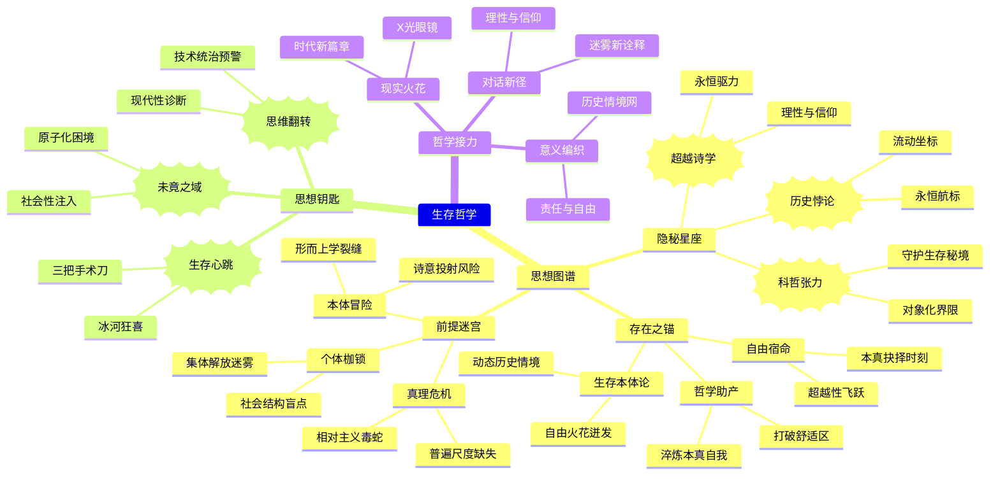

豆瓣链接：https://book.douban.com/subject/23038656/

# 深层解构

# 穿透存在之雾：雅斯贝斯《生存哲学》的三重思想图谱
## 一、基石：震颤的存在之锚
### 1. 生存高于一切的本体论宣言
雅斯贝斯将“生存”（Existenz）从存在的深渊中打捞出来，使其成为哲学的绝对原点。在他看来，传统哲学对“存在”的抽象思辨如同在迷雾中堆砌积木，而生存则是穿透迷雾的灼热焦点——它不是静态的“是什么”，而是动态的“如何是”，是每个人在具体历史情境中迸发的自由火花。这种对生存本体论地位的绝对确立，恰似在虚无主义的废墟上竖起一面燃烧的旗帜，宣告人之为人的尊严不可消解。

### 2. 自由作为生存的宿命之光
在法西斯铁蹄践踏人性的黑暗时刻，雅斯贝斯以哲学家的冷峻与诗人的激情，将“自由”铸造成生存的本质属性。他认为，自由不是放任自流的任性，而是人在面对“大全”（das Umgreifende）时的本真抉择——当人意识到自己被抛入这个世界的偶然与有限，却依然能以“内心行为”突破经验的牢笼，向超越性存在飞跃，这便是自由的终极绽放。这种自由观如同一把双刃剑，既劈开了极权主义的枷锁，也斩断了一切逃避责任的借口。

### 3. 哲学作为生存的助产术
雅斯贝斯拒绝将哲学视为封闭的知识体系，而是将其比作催生生存觉醒的助产士。在他眼中，哲学的任务不是提供现成的真理，而是通过对“存在”“真理”“现实”等问题的持续追问，打破人们习以为常的“舒适区”，迫使灵魂在思想的激流中淬炼本真的自我。这种对哲学本质的重新定义，彻底颠覆了传统学院哲学的傲慢，将哲学从云端拉回每个人的生存现场。

## 二、边缘：思想星图的隐秘星座
### 1. 科学与哲学的微妙张力
雅斯贝斯一面承认科学是哲学思维的必要条件，另一面又尖锐地指出科学的界限——科学只能触及“对象化”的存在，却永远无法抵达生存的深渊。这种对科学理性的辩证态度，暗含着对现代性危机的深刻洞察：当科学主义试图垄断真理话语权时，哲学必须守护那片不可对象化的生存秘境。这一洞见如同一束微光，照亮了科学理性统治下日益干涸的精神荒原。

### 2. 历史性生存的悖论之光
雅斯贝斯深刻揭示了生存的历史性困境：人既无法逃离历史的枷锁，又不能在任何历史形态中找到终极归属。理想人生的形象如同闪烁的航标，指引着生存的航程，却永远不是可以停靠的港湾。这种对历史性生存的辩证理解，打破了一切历史决定论的迷梦，同时也为个体在流动的历史长河中锚定了自由抉择的坐标。

### 3. 超越性存在的模糊诗学
雅斯贝斯对“超越存在”（Transzendenz）的论述充满了神秘主义的诗学色彩。他既拒绝将其等同于传统宗教的人格神，又不愿将其消解为纯粹的虚无，而是将其视为生存超越自身的永恒驱力。这种对超越性存在的模糊界定，看似是哲学论述的“缺陷”，实则是对理性局限性的坦诚承认，为信仰与哲学的对话留下了微妙的空间。

## 三、暗流：沉默的前提迷宫
### 1. 个体主义的隐形枷锁
雅斯贝斯将生存的自由与责任完全赋予个体，却在不经意间忽略了社会结构对生存的深刻制约。在他的哲学图景中，仿佛每个人都能凭借“内心行为”突破一切现实束缚，却未充分审视阶级、种族、性别等社会维度对生存可能性的巨大限定。这种隐含的个体主义假设，如同一条暗流，既赋予了个体无限的自由尊严，也可能遮蔽集体解放的现实路径。

### 2. 超越性存在的本体论冒险
尽管雅斯贝斯试图避免将“超越存在”实体化，但他对其的论述依然依赖于某种隐性的本体论预设。这种预设如同哲学大厦下的隐秘地基，虽然支撑起了生存超越的逻辑链条，却也面临着陷入形而上学独断论的风险。当我们追问“超越存在”究竟是真实的本体论存在，还是人类精神的诗意投射时，雅斯贝斯的哲学便暴露出了其无法完全缝合的思想裂缝。

### 3. 真理多元论的潜在危机
雅斯贝斯强调真理含义的多样性，反对任何一种真理垄断话语权，这固然体现了对多元价值的尊重。但与此同时，他也面临着相对主义的潜在威胁——当所有真理都被视为平等有效的时候，是否存在一种超越具体历史情境的普遍价值尺度？这种真理多元论与普遍主义的张力，如同一条隐藏的毒蛇，始终在哲学论述的草丛中游走。

## 四、给读者的三把思想钥匙
### 1. 顿悟：当哲学成为生存的心跳
这本书真正在说的，是哲学不应是书架上的精致摆件，而应是每个人生存的心跳本身。雅斯贝斯用三把思想手术刀——存在论、真理论、现实论，剖开了日常生活的坚硬外壳，让我们看到生存本身就是一场永不停息的超越之旅。阅读此书，如同在思想的冰河中游泳，初觉刺骨，继而清醒，最终感受到生命在存在之海中自由舒展的狂喜。

### 2. 惊喜：从“洞穴”到“大全”的思维翻转
如果换个角度看，雅斯贝斯的哲学不仅是对个体生存的唤醒，更是对现代性危机的一种诊断。当我们将他对“科学界限”“历史性生存”的论述置于当代技术统治、价值虚无的语境中，会发现他早已为我们埋下了批判的种子。原来，在存在主义的激情背后，隐藏着对人类文明走向的深沉忧虑与清醒洞察。

### 3. 发现：雅斯贝斯的未竟之域
作者可能没意识到，他对个体自由的极致强调，恰恰为我们打开了反思现代个体性困境的大门。在这个原子化的时代，当“自由”逐渐异化为孤独与焦虑的同义词，我们是否需要在雅斯贝斯的生存哲学中注入更多社会性维度？这种反思不是对其哲学的否定，而是思想接力的自然延伸——正如雅斯贝斯自己所说：“哲学的道路是漫长和艰苦的，只有少数人真正走过它，但它的确是切实可行的。”而我们，正是这条路上的新行者。

## 五、思想接力的下一棒
雅斯贝斯的《生存哲学》不是终点，而是起点。他用哲学的火把照亮了生存的深渊，却也在我们心中种下了新的疑问：当自由成为不可逃避的责任，我们该如何在具体的历史情境中编织生存的意义之网？当超越性存在的迷雾始终笼罩着人类精神的天空，我们是否需要在理性与信仰之间寻找新的对话方式？这些未竟的课题，正是哲学永恒的魅力所在。

愿每位读者都能带着从书中获得的“X光眼镜”，不仅看透文字的骨架，更能在自己的生存现场，续写属于这个时代的生存哲学新篇章。毕竟，真正的哲学，永远发生在思想与现实碰撞的火花之中。

# 章节内容
### 导言
在导言里，作者对哲学与科学的关系进行了深度剖析。他指出科学在发展进程中尽管取得了巨大成就，但始终存在着无法突破的边界。例如，科学能精准地剖析物质的微观结构，却难以阐释人类存在的意义与价值等深层次问题。哲学的起源独立于科学，它在科学的边界处开始对人类存在、世界本质等根本性命题进行沉思。作者回顾了近几十年哲学的发展轨迹，提及众多哲学思潮的兴衰交替。如逻辑实证主义曾盛极一时，试图以逻辑和实证手段构建哲学体系，但最终也暴露出局限性。生存哲学则脱颖而出，它概括了雅斯贝斯从前期到后期的哲学思想脉络。译者王玖兴在哲学领域的深入钻研与卓越贡献，也为这本著作的传播与理解提供了有力支撑，为后续对生存哲学的深度挖掘构建了基础框架。

### 第一讲存在论
此讲围绕存在这一核心问题展开全面且深入的探讨。雅斯贝斯极力倡导从大全体验切入哲学思考。他阐述了哲学基本活动的深刻内涵，大全涵盖世界、人、超越存在等丰富多样的样式。以世界为例，它犹如一个巨大而复杂的网络，包含了自然万物、社会现象等诸多元素，是我们感知与认知的宏大外部环境整体；而人作为独特的存在个体，具有自我意识、情感体验与主观能动性。他着重强调通过内心的深度体验与反思来把握现实。比如在面对道德两难困境时，是遵循传统道德规范还是依据个人内心的正义直觉做出抉择，这就需要人在哲学活动的深刻抉择过程中不断探索。就如同在历史长河中，无数思想家在对人生意义的探寻中，逐步实现向超越存在的精神飞跃，从而清晰地理解存在意识的动态变化以及可知性的内在含义，有力地引导读者深入思考人的本质与多元存在方式。

### 第二讲真理论
重点聚焦于复杂且深邃的真理问题。真实性问题呈现出千变万化、错综复杂的特性。真理的含义具有多元维度，在例外层面，某些罕见且违背常规认知逻辑的特殊现象往往隐藏着独特的真理因子。例如，在科学史上，哥白尼提出日心说，这一与当时主流认知相悖的理论最初被视为例外，但最终却揭示了宇宙运行的真实规律。在权威层面，传统习俗、宗教教义或社会公认的权威所传达的观念在特定历史时期与文化语境下被大众奉为真理。像中世纪时期，教会的教义在欧洲社会被当作绝对权威的真理标准。在理性层面，通过严谨的逻辑推理、科学实验与理性思考所推导出的结论被认定为真理的重要体现。例如牛顿力学体系的建立，是基于大量科学实验与理性分析得出的真理成果，深刻地影响了人类对物理世界的认知。通过对这些不同层面的深入探讨，全方位地剖析了真理在各异情境与多元观念影响下的表现形式与深刻意义，从而启发人们深入反思真理的本质究竟为何。

### 第三讲现实论
本讲核心聚焦于现实这一关键主题。深入探讨了现实的后退与超越现象，作者明确指出，缺乏可能性的现实性犹如一潭死水，毫无生机与活力。例如，一个人若仅仅机械地重复每日既定的生活流程，毫无对未来的憧憬、创新的尝试或改变的勇气，其生活就只是单调的循环，不具备深度与广度。作者着重强调历史性和统一性在现实中的重要意义。从人类社会发展的宏观视角来看，历史的演进是一个连续且具有内在逻辑统一性的过程，如从原始社会到现代文明社会的漫长发展历程，各个阶段相互关联、传承与变革。同时深入分析了对超越的体验，鲜明地提出哲学基本抉择在于封闭自我于固有现实还是勇敢突破、是消极出世还是积极入世。在谈及宗教的现实时，涉及纯粹的天启、历史性和内在化统一性等多方面内容。例如基督教教义的传承与发展，一方面有着源自宗教经典所记载的天启神圣起源，另一方面在两千多年的历史长河中不断演变、适应不同文化与社会环境，在广大信众内心深处逐渐形成一种内在化的统一信仰体系，深刻地影响着信众的价值观与行为方式，有力地促使人们深入思考现实的本质以及人类在现实世界中的定位与抉择方向。 