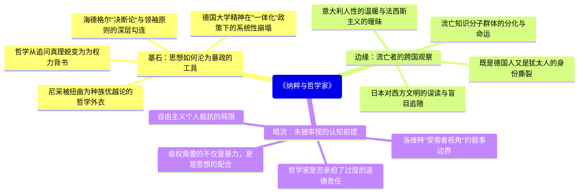

---
tags:
  - 纳粹极权
  - 知识分子流亡
  - 哲学与政治
  - 海德格尔批判
  - 德国思想史
douban_link: https://book.douban.com/subject/37324442/
score: 5
cover: https://img1.doubanio.com/view/subject/s/public/s34933928.jpg
create_time: 2026-06-20
---

# 深层解构

# 《纳粹与哲学家》深度解码：当哲学穿上冲锋队的制服

## 一、基石：思想如何沦为暴政的工具

卡尔·洛维特的核心追问，藏在他对老师海德格尔那句冰冷的指责里——**"海德格尔倒向纳粹，不是偶然的政治失误，而是其哲学体系的必然结果。"** 这不仅是个人恩怨，更是一个穿透整个20世纪的命题：**哲学，这门追问真理的最古老技艺，为何会在1933年的德国，如此轻易地为极权披上思想的外衣？**

**大众认知的误区**在于：人们倾向于将纳粹的崛起归结为经济危机、凡尔赛条约的屈辱或希特勒的个人魅力——简言之，是政治和社会层面的悲剧。但洛维特撕开了另一个伤口：**德国知识界——尤其是哲学界——在这场灾难中从未清白。** 当海德格尔在弗赖堡大学校长就职演讲中宣称"元首本人就是德国的现实与法则"，当尼采的"权力意志"被纳粹理论家改造为种族屠杀的哲学辩护，哲学已不再是真理的仆人，而成了权力的婢女。

**底层逻辑**可以追溯到海德格尔哲学中的**"决断论"**——这一概念强调，存在的本真性在于个体对自身处境的"决断"（Entschlossenheit），而非理性审议或道德考量。洛维特以手术刀般的精准揭示了危险所在：当这种排斥理性、强调"决断"本身即价值的思维方式从个人层面被"转译"到民族政治层面，**"本己的此在"就顺理成章地变成了"德意志的此在"**，个人对命运的决断变成了民族对领袖的服从。海德格尔的语言——"此在""被抛""决断""命运共同体"——本身就为纳粹的"领袖原则"提供了哲学语法。

更令人胆寒的是，洛维特指出，尼采的"权力意志"在被纳粹化之前，已经被其妹妹伊丽莎白系统地篡改和编辑；黑格尔的历史哲学被扭曲为"德意志此在"扩张叙事的先声；就连马克斯·韦伯的"价值中立"也被用作知识分子在政治高压下保持沉默的借口。**哲学史不是纳粹的偶然工具，而是被系统地改造为极权意识形态的合法性来源。**

## 二、边缘：被轻描淡写的三个洞见

### （一）流亡的跨国棱镜：意大利的人性，日本的盲从

大多数对纳粹时期知识分子的研究聚焦于德国本土或英美流亡者，但洛维特18年流亡中在**意大利和日本**的经历，打开了一扇独特的观察窗口。在意大利，洛维特感受的不是墨索里尼政权的压迫，而是**意大利人那种"不把政治当真"的生活态度**——法西斯主义在意大利从未像在德国那样深入骨髓。这一对比本身就是一个尖锐的反问：为什么同样面对极权，德国人选择"彻底投入"，而意大利人选择"阳奉阴违"？

在日本，洛维特看到了另一种更深刻的危险：**东方国家对西方文明的"误读式崇拜"**。他发现日本知识分子热衷于引进海德格尔和纳粹思想，但完全剥离了其历史语境，将其当作纯粹的"精神产品"消费。这种知识上的天真——以为思想可以脱离其政治土壤而独立存在——恰恰与德国知识分子当年对纳粹的"天真"形成镜像。洛维特用"日本人的天真与德国人的天真"这一章节标题，暗示了一种普遍规律：**非政治化的知识态度，本身就是政治灾难的前奏。**

### （二）既是德国人又是犹太人：被拒绝的归属

书中贯穿一条身份撕裂的暗线。洛维特是一战老兵，曾为德国浴血奋战；他是海德格尔最优秀的学生，深嵌于德国哲学传统；他在文化上完全是德国人。但纳粹的法律说他是犹太人，于是一夜之间，所有归属感都被剥夺。洛维特拒绝将自己的身份简化为"受害者"，也拒绝放弃"德国性"——**这种拒绝本身，就是对纳粹种族分类的最深刻抵抗。**

他在书中记录了一个令人动容的细节：流亡意大利时，一位意大利人问他"你是德国人还是犹太人"，他回答"**两者都是**"。这个看似简单的回答实则是一个哲学立场——**身份不是本质主义的分类，而是一个人可以同时拥有多重归属**。纳粹的政治暴行，始于用一条法律将人分割为不可兼容的类别。

### （三）通货膨胀：被遗忘的社会土壤

洛维特用整整一节描述**1920年代德国的恶性通货膨胀**如何"将现存的一切吞噬殆尽"。这个看似经济学的篇章，实则揭示了极权崛起最关键的社会心理基础：**当货币失去价值，一切积蓄化为乌有，人们对"稳定的秩序"的渴望会压倒所有理性判断。** 洛维特写道，通货膨胀不仅摧毁了中产阶级的经济基础，更摧毁了他们对"渐进改革"和"自由主义"的信念。希特勒提供的不是理性方案，而是**一种可感知的"振兴"**——这正是1933年德国人愿意交出自由的根本原因。

## 三、暗流：未被审视的三个认知前提

### （一）洛维特本人的叙事边界

洛维特的回忆录充满力量，但他作为**既是受害者又是批判者的双重身份**，也限定了他所能看到的东西。他对海德格尔的批判深刻而有力，但他是否有意无意淡化了自己早年间对海德格尔的崇敬？他在1920年代曾是海德格尔最亲密的追随者之一——这种个人情感上的"背叛感"是否强化了他对海德格尔哲学层面的批判？**当我们读一个被背叛的学生对老师的指控时，必须意识到这份证词既有哲学的锐度，也有情感的重量。**

### （二）哲学家的责任是否被过度放大？

洛维特将大量篇幅用于批判海德格尔和尼采的思想与纳粹的勾连，这固然重要，但也隐含一个前提：**哲学家应该为政治灾难承担特殊责任。** 但反过来说，工程师建造了毒气室，律师起草了纽伦堡法案，医生执行了安乐死计划——为什么我们特别追问哲学家？也许恰恰是因为，**哲学声称自己追求真理和智慧，所以它背叛自己的使命时，显得尤为可耻。** 但这种"特殊责任论"本身也值得反思：它是否无意中抬高了哲学的地位，而忽略了其他知识领域同样深刻的共谋？

### （三）"个体良知"抵抗的浪漫化

洛维特以自身的流亡经历展示了一种道德坚守——他没有加入纳粹，他流亡了，他批判了。但这种叙事可能让人忽略了另一个更残酷的事实：**绝大多数德国知识分子既没有成为纳粹的帮凶，也没有成为洛维特式的流亡者，他们选择的是"内部移民"——在体制内保持沉默。** 洛维特对这种灰色地带的处理相对简洁，而历史研究表明，正是这种"沉默的大多数"构成了极权最坚实的社会基础。

## 四、给读者的三把钥匙

1. **这本书真正在说什么**：这不是一本关于"好人如何受害"的回忆录，而是一份关于"思想如何死亡"的解剖报告。洛维特追问的不是"纳粹有多坏"，而是"为什么最聪明的人——哲学家——会为它背书"。答案令人不安：因为哲学本身包含了一种危险的可能性——当它放弃对理性的忠诚，转而崇拜"决断""意志"和"命运"时，它就成了权力的完美伴侣。

2. **如果换个角度看**：从海德格尔的视角重新审视这段历史——他也许真诚地相信，纳粹的"革命"可以实现他哲学中呼唤的"存在的本真性"。这不是为他开脱，而是理解问题的深度：一个哲学家可以同时是伟大的思想者和政治上的盲人。**思维深度和政治判断力并不成正比**——这是这本书最令人不安的启示。

3. **这本书与当下的关系**：在民粹主义复兴、知识分子再次面临"介入还是沉默"选择的今天，洛维特的问题变得更加紧迫。他暗示的答案既不是激进的"介入一切"，也不是犬儒的"退回书斋"，而是：**保持对权力的持续质疑，同时对任何声称拥有"终极答案"的意识形态保持警惕——无论它来自左翼还是右翼。**

# 章节内容

## 第一部分：1914—1936

### 引言

洛维特以冷静的笔触交代本书的由来：1940年流亡日本期间，应哈佛大学有奖征文而作，题为《1933年1月30日之前与之后我在德国的生活》。稿件未被选用，在作者去世后被遗孀发现，1986年首次出版。这段"被遗忘的手稿"本身就构成一个隐喻——**历史的真相常常被埋藏，直到时机成熟才重见天日。**

### 一战与战俘经历

1914年，17岁的洛维特受德国青年运动的感召投身一战。他不是冲锋陷阵的英雄，而是被俘后在战俘营中度过了战争的后半段。这段经历奠定了他日后思想的底色：**战争的荒诞性不在于战败，而在于它让一代人相信"牺牲"本身就具有意义。** 他在战俘营中接触了不同国籍的士兵，第一次意识到"敌人"也是普通人——这种超越民族主义的人类意识，后来成为他批判纳粹的思想基础。

### 希特勒之前与之后的尼采

本章是全书最关键的思想史章节之一。洛维特追溯了尼采哲学如何在德国思想界被逐步"纳粹化"。他区分了**"希特勒之前的尼采"和"希特勒之后的尼采"**——前者是一个挑战西方形而上学传统的激进思想家，后者则被其妹妹伊丽莎白和纳粹理论家阿尔弗雷德·博伊姆勒改造为德意志种族优越论的先知。洛维特特别指出，尼采本人对德意志民族主义和反犹主义持明确的批判态度，但纳粹通过**选择性编辑和系统性误读**，将尼采建构成"第三帝国的官方哲学家"。这一章的核心论点是：**思想的腐败往往不是来自直接篡改，而是来自有选择性的强调和系统性的去语境化。**

### 归乡之遇与"前线条款"

一战结束后，洛维特回到德国，面对的是一片废墟——不仅是物质上的，更是精神上的。他记录了"前线条款"——政府对退伍军人的冷漠，社会对失败的不愿面对，以及弥漫在德国知识界的某种"被背叛感"。这种情绪后来成为纳粹"背后一刀"神话的土壤。洛维特敏锐地观察到：**德国人没有真正接受战败，而是将其解释为内部敌人的阴谋——这正是反犹主义在未来得以爆发的心理基础。**

### 格奥尔格圈与纳粹意识形态

诗人斯特凡·格奥尔格及其追随者代表了20世纪初德国知识界的一种精英主义文化理想——"精神王国"的建立。洛维特以亲历者的身份记录了格奥尔格圈如何从一种美学-精神的精英团体，演变为部分成员（如克劳斯·冯·施陶芬贝格）投身抵抗、而另一些成员则在思想上为纳粹提供了养料。这里的关键洞见是：**精英主义的"精神追求"与大众政治之间存在着一条危险的通道——当"精神精英"转而崇拜"力量"和"意志"时，美学上的激进主义很容易滑向政治上的极权主义。**

### 弗赖堡大学时代：追随胡塞尔，批判海德格尔

洛维特在这两章中详细描绘了他在弗赖堡大学师从胡塞尔和海德格尔的经历。对胡塞尔，他充满敬意——这位现象学创始人始终坚持哲学作为"严格科学"的理念，拒绝将哲学与政治混合。对海德格尔，他的情感更加复杂：**他一方面承认海德格尔是"天才"，另一方面却清晰地看到其思想中潜藏的危险。**

洛维特重点分析了海德格尔的《存在与时间》（1927年），指出其中**"此在"的分析虽然深刻，却完全缺乏伦理学维度**。"决断"被赋予了至高价值，但"向什么决断"这个问题被悬置了。在洛维特看来，这使得海德格尔的哲学成为一个完美的空壳——可以被任何政治力量填充。1933年的海德格尔不过是往这个空壳里填入了纳粹的内容。

### 海德格尔将"本己的此在"转译为"德意志的此在"

这一章是全书的理论核心。洛维特追踪了海德格尔如何在1933年之后，将他早期哲学中的核心概念从个人层面"转译"到民族-政治层面。**"本己的此在"（das eigene Dasein）变成了"德意志的此在"（das deutsche Dasein）；个人的"向死而生"变成了民族的"牺牲精神"；"常人"（das Man）的批判变成了对民主制度和公共舆论的蔑视。** 洛维特的论证冷峻而有力：这不是海德格尔对自己哲学的背叛，而是其哲学本身的逻辑延伸——因为当"决断"本身成为最高价值，而决断的内容——是民主还是极权——被排除在哲学考量之外时，政治灾难就已经被预埋了。

### 海德格尔的人格

洛维特用近乎小说的笔法描绘了海德格尔的外貌、举止和教学风格。他写道，海德格尔被学生戏称为"梅斯基希来的小魔术师"——**"先把某某东西指出来，随即在听众面前让这东西消失不见"**。海德格尔的矮小身材、黑森林农夫夹克、介于市民常服与冲锋队制服之间的着装——这些细节都被洛维特赋予了一层象征意义：**一个试图通过外表和言辞来超越自己卑微出身的人，最终在政治中寻找到了他在哲学中一直追求的"本真性"的替代品。**

### 政变的三个预兆与1933年的"振兴"

洛维特记录了1933年纳粹上台前夕的氛围。他指出三个预兆：大学里犹太同事被逐步边缘化而不被抗议、学生们日益激进的民族主义情绪、"一体化"（Gleichschaltung）政策对学术自由的侵蚀。**最令人不安的是，这些变化不是突然发生的，而是一步步推进——每一步都小到让人觉得"不值得反抗"。**

1933年，洛维特在马尔堡大学做了最后一次演讲，随后被迫离开。他描述了一种诡异的"振兴"氛围——许多德国人真心相信纳粹带来了秩序、尊严和民族复兴。**"绝大多数人不是受害者，也不是迫害者，而是相信者"**——这一观察打破了"好德国人vs坏纳粹"的简单二分法。

## 第二部分：1934—1936

### 告别马尔堡，流亡意大利

洛维特被迫离开马尔堡大学，前往意大利。作为洛克菲勒基金会的资助对象，他在罗马度过了一段相对平静的时光。他记录了一个讽刺性的场景：**在罗马的纳粹教授——一位被派往意大利进行"文化外交"的德国学者——在当地反而被意大利人视为可笑的对象。** 法西斯意大利与纳粹德国之间的微妙差异，被他捕捉得入木三分。

### 德国流亡者在罗马

洛维特描绘了罗马流亡者群体的众生相：有坚持继续学术工作的，有陷入绝望的，有试图通过政治活动改变局势的。他特别记录了一个细节：**流亡者之间的政治分歧往往比他们与纳粹的分歧更加激烈——左派流亡者和自由派流亡者彼此厌恶，犹太流亡者和"雅利安"反纳粹流亡者互不信任。** 这不仅是那个人群的特点，更是政治流亡本身的困境：共同的外部敌人并不自动产生内部的团结。

### 在布拉格的哲学家大会上（1934）

洛维特参加了1934年在布拉格举行的国际哲学大会，这是纳粹上台后他第一次重返国际舞台。他注意到一个令人心寒的现象：**绝大多数与会哲学家——无论是来自民主国家还是法西斯国家——都对德国发生的事情保持沉默。** "哲学"的世界性和"政治"的国别性被严格切割，仿佛第三帝国的迫害与哲学无关。这种沉默本身，在洛维特看来，就是一种共谋。

### 聘书被撤销，德国之旅

洛维特的马尔堡大学教职被正式撤销。他冒险短暂返回德国处理个人事务，在边境和火车上经历了纳粹检查站的日常恐惧。他对德国社会的观察令人不寒而栗：**普通德国人的生活已经"正常化"——迫害在继续，但大多数人已经习惯，甚至觉得"如果不涉政治，日子还是可以过的"。**

## 第三部分：1936—1939

### 抵达日本，东方视角

1936年，洛维特受聘前往日本东北帝国大学（仙台）任教。这一章展示了一种独特的跨文化视角：**他对日本的观察并非猎奇，而是将其作为理解德国灾难的一面镜子。** 他发现日本知识分子对海德格尔哲学狂热追捧，却对其政治含义毫无察觉——"日本人的天真"与"德国人的天真"在本质上是一回事：相信思想可以脱离其历史和政治条件而独立存在。

### 日本的德国流亡者与轻井泽的纳粹

洛维特记录了日本德国流亡者社区的生活，以及在避暑地轻井泽遇到的纳粹支持者。**最令人深思的场景是：流亡者和纳粹支持者在日本这个"中立"空间中共处，彼此礼貌地避免谈论政治。** 这种"文明人的沉默"引发了洛维特的终极追问：文明的外表下，暴力的共谋究竟在多大程度上是被默许的？

### 德国局势（1936—1939）：既是德国人又是犹太人

全书的情感高潮。洛维特追问自己身份的终极问题：**对于一个在文化上完全认同德国的人来说，当国家宣布他不属于这个民族时，他是谁？** 他的回答是拒绝做选择题——他既是德国人，也是犹太人。这一立场在当时的语境下既是哲学上的抵抗，也是政治上的挑衅。**身份的政治化是极权的起点，而拒绝被单一定义，是个人对抗极权的最后堡垒。**

### 后记与补记

洛维特的两篇后记试图总结这段经历的意义。他拒绝给出简单的"教训"，而是将结论留给了历史本身。**"德国之简化，德国之抗议"**——这组对立概念概括了他对德国的复杂态度：纳粹将德国简化为一个种族概念，而真正的德国精神恰恰存在于对这种简化的抗议中。

最终，洛维特于1952年受邀返回德国，在海德堡大学哲学系任教至退休。**他的一生轨迹——从一战青年到流亡者，从海德格尔的学生到海德格尔最严厉的批判者——本身就是20世纪欧洲思想史的一个缩影。**

---

Citations:
[1] https://book.douban.com/subject/37324442/
[2] https://baike.baidu.com/item/纳粹与哲学家：一个人的流亡史/65763299
