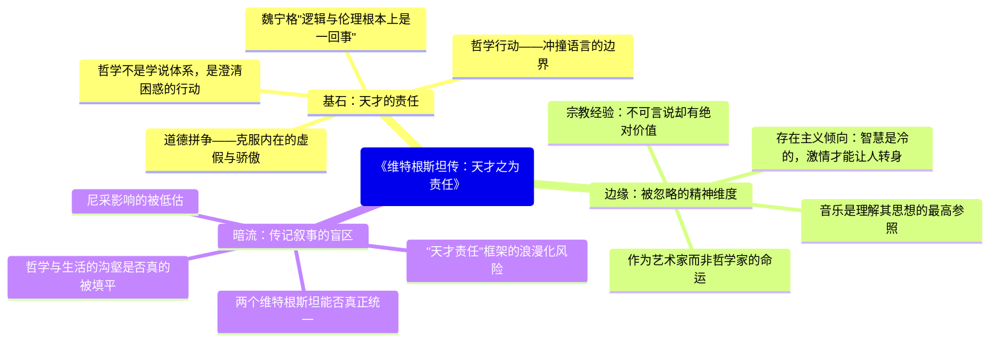

---
tags:
  - 语言哲学
  - 天才与责任
  - 逻辑与伦理
  - 传记
  - 分析哲学
douban_link: https://book.douban.com/subject/6152040/
score: 5
cover: https://img1.doubanio.com/view/subject/s/public/s6823238.jpg
create_time: 2026-06-20
---

# 深层解构

# 《维特根斯坦传》深度解码：逻辑哲学的背后，是一颗受难者的灵魂

## 一、基石：天才之为责任——不是天赋的炫耀，而是自我的审判

瑞·蒙克以**"天才的责任"**（The Duty of Genius）统领全书，这个概念来自奥地利哲学家奥托·魏宁格——**"逻辑和伦理根本上是一回事，它们无非是对自己的责任。"** 这句被印在扉页上的话，是理解维特根斯坦一生的密钥。

**大众认知的误区**在于：人们倾向于将维特根斯坦视为一个"怪人天才"——出身维也纳最富有的家族之一，在剑桥与罗素激辩，写出20世纪最重要的哲学著作，却又跑去当乡村小学教师，把巨额遗产全部送人。这些奇闻轶事的流传让维特根斯坦成了一个文化符号，但却遮蔽了最核心的问题：**为什么一个拥有如此智力天赋的人，终其一生都在与自己的灵魂搏斗？**

蒙克的传记给出了斩钉截铁的回答：**维特根斯坦不是在"做哲学"，而是在"活哲学"。** 对他来说，哲学不是职业，不是学科，而是一种**自我审判的行动**。"天才"不是他可以炫耀的资本，而是他必须履行的义务——如果一个人被赋予了看清事物本质的能力，那么他**有责任**彻底诚实、一丝不苟地使用这种能力，无论在逻辑上还是在生活上。

维特根斯坦的哲学行动可以用两个核心短语概括：

**"冲撞语言的边界"**——他在伦理学讲座中说："我的整体倾向是冲撞语言的边界……这种对我们笼子的墙壁的冲撞完全地、绝对地无望。但那是人心的一种倾向的证供，这种倾向，我个人禁不住深深地尊重它。"维特根斯坦认为，真正重要的东西——伦理、宗教、艺术、生命的意义——恰恰是语言无法言说的。哲学的任务不是建立关于这些事物的理论（那是不可能的），而是**用逻辑的精确性为可言说的划定边界，从而让不可言说的东西自己显现**。这就是《逻辑哲学论》那句著名的结语："对于不可言说的东西，我们必须保持沉默。"

**"道德拼争"**——维特根斯坦对弟子德鲁里说，他最关心的东西在他的哲学著作里找不到直接的表达。这"最关心的东西"就是**如何做一个"得体的人"（decent human being）**：克服骄傲与虚荣带来的做不诚实之人的诱惑。他的日记里充满了对自身"内在邋遢"的无情挑剔——这在常人看来几乎是一种自虐，但对他来说，哲学上的精确和生活上的诚实是一回事。**逻辑不容模糊，灵魂也不容。**

## 二、边缘：三个被轻描淡写的维度

### （一）作为艺术家而非哲学家的命运

弗雷格读完《逻辑哲学论》后说了一句令人玩味的评价："**与其说这本书是一个科学上的成就，倒不如说它是艺术上的成就**。"罗素称其为"神秘主义"。维特根斯坦自己则认为，他的著作应该像理解音乐一样来理解——不是通过论证和推导，而是通过形式本身的"显示"来传达不可言说的内容。

这就引出了一个根本性的身份问题：**维特根斯坦究竟是哲学家还是艺术家？** 有人精辟地总结：把《逻辑哲学论》视为哲学作品，它太艺术了；把它视为艺术作品，它太哲学了。维特根斯坦的一生也像艺术家的命运——孤独、贫困、不被理解、在创造的高峰和精神的深渊之间摇摆——而不是哲学教授的安逸轨迹。他告诉朋友，**音乐在他生命中意味着一切**，却无法用一个词在书里说出来。

这个维度之所以被轻描淡写，是因为分析哲学的传统倾向于把"哲学"和"文学/艺术"严格区分，而维特根斯坦恰恰生活在两者的边界线上。**读懂他，需要同时打开两种感知器官：逻辑的精确和审美的直觉。**

### （二）宗教经验：不可言说却有绝对价值

维特根斯坦不是传统意义上的教徒，但他终身被宗教问题缠绕。一战期间，他在战壕里读托尔斯泰的《福音书摘要》，称其"让我活了下来"。他相信基督教的这个说法："**纯正的教义全然无用。你必须改变你的生活。**"

蒙克揭示了一个被严重低估的事实：维特根斯坦对宗教的态度与他哲学的核心命题完全一致。宗教经验的"绝对价值"不在事实世界之内，因此无法用事实性的语言来言说——但这恰恰证明了它的真实性。**"不可言说"不是否认，而是对更高维度存在的尊重。** 这种立场使他既区别于传统的宗教信徒（他们试图用教义来言说不可言说之物），也区别于无神论者（他们因为不可言说而否认其存在）。

### （三）存在主义倾向：克尔凯郭尔的隐秘传人

维特根斯坦很少提尼采，但多次谈到克尔凯郭尔，称其为"19世纪最深刻的思想家"。他的这段笔记揭示了其存在主义底色："**智慧是没有激情的。你不能像遵循医生处方那样遵循它。你必须让某种东西把你抓住，让你转身。一旦转过身来，你就必须坚持这个转身。**"

这与克尔凯郭尔的"信仰的跳跃"如出一辙。维特根斯坦的"道德拼争"不仅是克服骄傲，更是一种**存在主义式的诘难**——将思维的主体置于一切陈词滥调的对立面，拒绝任何形式的"温室安全感"和"理性的自洽"。这一点在主流分析哲学对维特根斯坦的解读中被严重边缘化，但蒙克的传记让这条暗线重见天日。

## 三、暗流：三个未被审视的叙事前提

### （一）"天才责任"框架的浪漫化风险

蒙克用"天才的责任"作为统摄全书的叙事线索，确实赋予了传记高度的统一性和感染力。但这个框架本身隐含一个危险：**它可能将维特根斯坦的自我折磨浪漫化，将一种可能具有病理性质的精神痛苦美化为天才的必然代价。**

维特根斯坦多次考虑自杀，与家人关系紧张，在人际关系中表现出极度的不稳定。蒙克将这些归因于"天才的责任"带来的道德紧张，但这种解释是否回避了更简单的可能性——**维特根斯坦可能确实患有某种精神疾病，而"天才责任"只是他用来理解和合理化自己痛苦的一种叙事？** 一个合格的传记不需要在这两种解释之间做非此即彼的选择，但读者需要意识到这个框架的叙事引力。

### （二）哲学与生活的"沟壑"真的被填平了吗？

蒙克在序言中宣称，本书的目标是"为这条沟壑架上桥梁"——将维特根斯坦的生活和工作统一起来解读。他确实做得非常出色。但值得追问的是：**这种统一是否在某些地方显得过于平滑？**

维特根斯坦的前后期哲学转变（从《逻辑哲学论》的"语言图像论"到《哲学研究》的"语言游戏说"）是否真的与他的生活经历如此紧密对应？蒙克将转向归因于他在乡村教师生涯中与儿童的互动经历，但这可能简化了哲学转变的复杂性。**哲学内部的逻辑驱动力和生活的外部刺激之间的关系，远比"架桥"隐喻所暗示的要更加纠缠和不确定。**

### （三）"两个维特根斯坦"的统一问题

书评人许志强提出了一个尖锐的问题：是否存在"两个维特根斯坦"——一个是逻辑哲学和日常语言分析哲学的维特根斯坦，一个是文化艺术和伦理宗教的维特根斯坦？蒙克的传记试图将两者统一在"天才的责任"之下，但这种统一是否成功？

事实上，连维特根斯坦自己都承认他的哲学著作没有真正表达他最深切的关切。他对德鲁里说："要我在书里用一个词说出音乐在我生命中意味着的一切是不可能的，那么我怎么可能期望得到理解呢？" 如果哲学家的自我认知中都存在这种分裂，那么传记作者填平沟壑的努力，是否可能只是在沟壑上铺了一层好看的草皮？

## 四、给读者的三把钥匙

1. **这本书真正在说什么**：这不是一本"哲学家の奇妙冒险"的故事书，而是一部**灵魂的解剖报告**。蒙克的目标不是让你感叹"维特根斯坦真是一个有趣的怪人"，而是让你理解：**真正的哲学从来不是智力的游戏，而是整个人的存在方式。** 维特根斯坦用一生证明，逻辑的精确和生活的诚实是同一种能力在两条轨道上的运行。

2. **如果换个角度看**：从存在主义的视角重新审视维特根斯坦，会发现他是克尔凯郭尔在20世纪分析哲学传统的隐秘传人。他的"语言游戏""生活形式""遵守规则"这些貌似冷僻的概念，实际上都在回应同一个问题：**人如何在语言编织的世界中，过一种真正诚实的生活？**

3. **这本书与当下的关系**：在一个哲学日益学院化、专业化、与生活脱节的时代，维特根斯坦的存在本身就是一记重锤。他告诉我们：**如果你不在生活中践行你的哲学，你就不曾真正拥有它。** 这对任何声称有"价值观"的人——无论是学者、企业家还是普通人——都是一个无法回避的追问。

# 章节内容

## 第一部分：1889-1919

### 第一章 自我毁灭的试验场

维特根斯坦出生于维也纳最富有的工业家族之一——父亲卡尔·维特根斯坦是奥匈帝国的钢铁巨头。这个家庭是维也纳文化精英圈的核心，勃拉姆斯、马勒、克里姆特都是常客。但蒙克揭示了这个金色牢笼的阴暗面：父亲是一个暴君式的家长，用极高的标准要求八个子女。**维特根斯坦的三个哥哥相继自杀**，这个家庭本身就是"自我毁灭的试验场"。路德维希是八个孩子中最小的，从小就被一种不可言说的恐惧笼罩——**他是否也会走上兄长的道路？** 蒙克指出，这种童年经历是理解维特根斯坦终身与绝望斗争的起点。

### 第二章 曼彻斯特

维特根斯坦最初学习的是航空工程，在曼彻斯特大学研究风筝飞行和喷气发动机。正是在对螺旋桨设计的数学探索中，他第一次遭遇了**数学基础问题**——这将他引向了哲学。蒙克生动地描述了维特根斯坦如何从工程师一步步转向逻辑哲学：他读了罗素的《数学原理》，被弗雷格的逻辑主义吸引，最终决定去耶拿面见弗雷格本人。弗雷格建议他去剑桥跟随罗素学习。**一个航空工程学生的偶然转向，改变了20世纪哲学的版图。**

### 第三章 罗素的爱徒

1911年，维特根斯坦来到剑桥三一学院，直接找到罗素。第一次见面后，罗素在日记里写道："我的德国朋友有可能是个天才。"短短一个学期后，关系发生了逆转——**罗素开始将维特根斯坦视为比自己更深刻的思想者**。蒙克生动记录了这段哲学史上最著名的师徒关系：维特根斯坦会在罗素的房间里来回踱步数小时，激烈地讨论逻辑问题，拒绝离开，直到罗素不得不要求他停下。罗素后来说："他对哲学的热情比我的更强烈，他对问题之刺痛的感受比我的更深刻。"

### 第四章 罗素的导师

关系的反转正式完成。罗素在哲学上的某些核心项目——比如"判断理论"——被维特根斯坦彻底摧毁后，罗素承认自己在逻辑领域的创造力已经枯竭。维特根斯坦开始发展自己的逻辑体系，**提出"逻辑命题是重言式"这一革命性观点**——逻辑真理并非描述了世界中的事实，而是语言本身的形式属性的呈现。这成为《逻辑哲学论》的基石之一。蒙克同时揭示了罗素的失落：一个曾经被视为下一代哲学领袖的人，在自己学生面前变成了"前浪"。

### 第五章 挪威

为了远离剑桥的社交干扰，维特根斯坦孤身前往挪威峡湾，在一个偏远村庄建造了一间小屋。**这是维特根斯坦最具生产力的时期之一**——他在绝对的孤寂中厘清了逻辑哲学的核心架构。蒙克描述了他在挪威的生活：白天在峡湾边散步思考，晚上在油灯下写作，偶尔给罗素写长信阐述自己的想法。**"挪威时期"形成了维特根斯坦的经典写作风格：格言式的、神谕般的、不需要论证的断言**——这种风格后来让《逻辑哲学论》被弗雷格误认为是"艺术作品"。

### 第六章 火线之后

1914年一战爆发，维特根斯坦自愿参军——不是因为爱国（他对奥匈帝国没有好感），而是因为他相信**面对死亡是测试自己灵魂的唯一方式**。蒙克揭示了维特根斯坦参战的真正动机：他需要知道自己是否是一个"得体的人"，而只有在面临死亡的极端处境中，一个人才能知道自己是什么。他被分配到最危险的岗位——炮兵观察哨——因为他拒绝了军官职位。在炮火中，他继续写作《逻辑哲学论》，**手稿就装在他的背包里。**

### 第七章 在前线

维特根斯坦在东线和意大利前线经历了战争的残酷。蒙克描述了两个关键的转折：第一，他在加里西亚的一家书店里偶然发现托尔斯泰的《福音书摘要》，这本书给了他活下去的精神力量——**"它让我活了下来，仿佛是从我的灵魂中写出来的"**。第二，战争接近尾声时，他在意大利被俘，在战俘营中完成了《逻辑哲学论》的最后部分。**这本书的核心张力——逻辑的冷峻与伦理的炽热——正是在战壕和战俘营的极端处境中形成的。**

## 第二部分：1919-1928

### 第八章 印不出的真理

战争结束后，维特根斯坦面临一个荒诞的困境：他相信自己已经解决了哲学的全部问题（《逻辑哲学论》的序言宣称"这些问题的解决是最终的"），却找不到出版社愿意出版这本书。**出版商要求罗素写导言才有商业价值，罗素写了，但维特根斯坦对罗素的导言极度不满**，认为它误解了书的核心。最终在罗素的坚持下，该书的德文版于1921年发表在《自然哲学年鉴》上。出版后，维特根斯坦认为自己的哲学使命已经完成，决定彻底离开哲学。

### 第九章 "一个纯农村的岗位"

这是维特根斯坦一生中最被津津乐道也最被误解的时期。他放弃了家族遗产（分给了兄弟姐妹），去奥地利最偏远的乡村当小学教师。**大众传说是"天才厌倦哲学去当农民"——但这完全错了。** 蒙克揭示的真相更加复杂：维特根斯坦去教书，恰恰是因为他相信**教育是最重要的道德行动**。他认为维也纳的精英教育是腐败的，真正的启蒙应该从最底层的孩子开始。但现实是残酷的：他与当地农民格格不入，教学方法过于严苛，最终因为殴打一名学生引发丑闻而被迫离开。**理想主义的教育实验以灾难告终。**

### 第十章 走出荒野

维特根斯坦回到维也纳，短暂从事建筑工作——为姐姐设计了一栋极简主义风格的房子（至今仍是现代主义建筑的经典案例）。正是在这期间，他与维也纳学派的逻辑实证主义者有了接触。石里克和魏斯曼读了他的《逻辑哲学论》，将其奉为圣经。但维特根斯坦本人却对这些"追随者"态度冷漠——**他认为他们根本没有理解他书中最重要的部分（伦理学的部分），只是抓住了一些技术性的论点。** 与维也纳学派的对话让他重新被哲学吸引，他开始怀疑自己是否还有工作要做。1929年，在凯恩斯的鼓励下，他决定返回剑桥。

## 第三部分：1929-1941

### 第十一章 第二次到来

维特根斯坦以博士身份回到剑桥——他提交的博士论文就是《逻辑哲学论》，答辩委员是罗素和摩尔。答辩结束时，维特根斯坦拍了拍两位考官的肩说："别担心，我知道你们永远不会懂。" 他获得了博士学位和三一学院的研究员职位。但更重要的是，他很快意识到自己早期哲学的局限性——**"语言图像论"过于狭隘，无法涵盖人类语言的实际使用。** 转折开始了。

### 第十二章 "证实主义阶段"

在短暂地与逻辑实证主义有过接触后，维特根斯坦很快超越了证实原则。他开始发展一个新的洞见：**语句的意义不是由它与事实的对应关系决定的，而是由它在"语言游戏"中的使用决定的。** 这个转向标志着分析哲学从"理想语言"到"日常语言"的范式转变。蒙克同时记录了他与经济学圈子的交往——凯恩斯、斯拉法、拉姆齐。尤其是意大利经济学家皮耶罗·斯拉法，用一个著名的动作启发了维特根斯坦：斯拉法将手掌在颏下一划（意大利式的"我不在乎"），问道"这个手势的逻辑形式是什么？"——这个问题让维特根斯坦意识到，**并非所有的意义都可以用逻辑图像来捕捉。**

### 第十三至十四章 迷雾散去 / 一个新的开始

维特根斯坦开始系统性地摧毁自己早期的哲学体系。他不再认为语言有一个统一的本质，转而提出"语言游戏""家族相似""遵守规则"等概念。**规则的悖论（一条规则似乎能决定行动，但任何行动都可以被解释为遵守规则）** 成为他后期哲学的核心疑难。他在课堂上对学生说："我教给你们的是一个新的思维方式，不是新的教条。"

### 第十五至十六章 弗朗西斯 / 语言游戏

维特根斯坦在剑桥开了一门课，向学生口授了后来被称为《蓝皮书》和《棕皮书》的讲义——这些构成了《哲学研究》的雏形。**他与学生弗朗西斯·斯金纳建立了深厚的感情**（斯金纳后来成为他的伴侣），这段关系给维特根斯坦带来了罕见的平静。但斯金纳在1941年因小儿麻痹症突然去世，对维特根斯坦造成了毁灭性打击。**爱与丧失在他哲学最成熟的时期同时降临。**

### 第十七至二十章 投身行伍 / 忏悔 / 奥地利终结 / 不情愿的教授

1936年，维特根斯坦再次离开剑桥——这次是去挪威独居，写作《哲学研究》。他与诺尔曼·马尔康姆的友谊始于这个时期。1938年，纳粹吞并奥地利后，维特根斯坦的犹太血统使他面临危险；他利用家族财富和影响力为姐姐们获取"雅利安人"身份认证——这一道德困境让他备受煎熬。1939年，摩尔退休后，维特根斯坦被任命为剑桥哲学教授。**但他在就职演讲中没有谈论分析哲学，而是谈论了"哲学的困难"**——一个人的思想受到他的语言的束缚，哲学的工作就是与这种束缚搏斗。

## 第四部分：1941-1951

### 第二十一至二十三章 战时工作 / 斯旺西 / 这个时代的黑暗

二战期间，维特根斯坦离开剑桥，去伦敦的盖伊医院做搬运工和实验室助手。他认为在战时坐而论道是不可容忍的。后来他转到纽卡斯尔的一个医学研究团队，参与了创伤性休克的研究——他的工程师训练再次派上了用场。在威尔士的斯旺西，他与学生拉什·里斯建立了深厚的友谊，里斯后来成为他的遗嘱执行人之一。维特根斯坦称这个时代为"黑暗的时代"，不仅是战争的黑暗，更是文化精神的黑暗。

### 第二十四章 一种面相的转变

本章标题取自维特根斯坦后期哲学的一个核心概念——"面相的转变"（Aspektwechsel）。他使用鸭兔图来说明：同样的东西，在不同的"看"的方式下呈现出完全不同的面貌。**这与他的整个哲学转向一脉相承：不是发现了新的事实，而是学会了用新的方式看旧的事实。** 蒙克指出，这个概念不仅是哲学方法论，也是维特根斯坦理解自己人生的方式——同样的生命经历，在"天才的责任"这个面相下获得了截然不同的意义。

### 第二十五至二十六章 爱尔兰 / 无所归属之民

1947年，维特根斯坦辞去剑桥教授职务，独自搬到了爱尔兰西海岸的偏远地区。他在一座孤零零的小屋里继续写作，与当地渔民为邻。**他从未在任何地方找到真正的归属感**——不是维也纳人（反犹的奥地利排斥他），不是英国人（剑桥的氛围让他窒息），不是哲学家（他的哲学太像艺术），不是艺术家（他的创作又太像哲学）。这种"无归属"是他毕生痛苦的根源，也是他能够保持思想独立的代价。

### 第二十七章 故事终

1951年，维特根斯坦被诊断为前列腺癌。他拒绝住院治疗，选择在朋友比万医生的家中度过最后的日子。在生命的最后几天，他口授了一些笔记，继续推进《哲学研究》中的问题。临终前，他对守护在床边的比万夫人说了一句著名的遗言：**"告诉他们，我过了美好的一生。"** 蒙克的处理克制而有力——一个终其一生都在与绝望、自我怀疑、道德煎熬搏斗的人，在生命的终点，给出了这样一句肯定。这不是哲学的证明，而是存在的完成。

---

Citations:
[1] https://book.douban.com/subject/6152040/
[2] https://baike.baidu.com/item/维特根斯坦传/61593250
