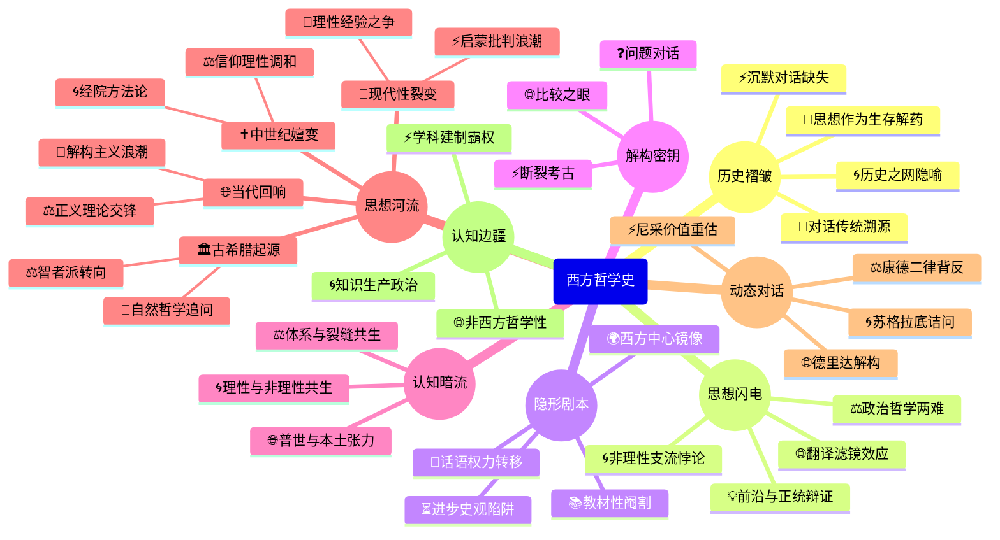

豆瓣链接：https://book.douban.com/subject/34447865/

# 深层解构

### 一、基石：在历史褶皱里打捞理性的火种
本书的核心支点，藏在贯穿全书的"历史之网"隐喻中。作者像一位哲学考古学家，坚信每个时代的思想都是特定土壤的产物——从古希腊城邦的政治辩论催生苏格拉底的诘问法，到中世纪经院哲学与神学的博弈孕育托马斯·阿奎那的体系，再到启蒙运动的科学理性瓦解宗教权威，哲学始终是"时代精神的精华"。这种将思想还原到具体历史语境的叙事策略，暗含着一个重要信念：**哲学不是空中楼阁，而是人类在不同生存困境中开出的解药**。

书中反复出现的"对话传统"，则是另一个隐形锚点。从柏拉图的对话录到康德的"理性法庭"，作者试图证明：哲学的生命力在于永不停息的质疑与答辩。哪怕是最艰深的形而上学体系（如黑格尔的绝对精神），本质上也是对前人问题的回应。这种"对话史观"消解了哲学的神秘感，却也埋下一个伏笔——当我们追溯思想链条时，是否忽略了那些未被记录的"沉默对话"？比如女性哲学家的声音、非西方文明的哲学基因？

### 二、边缘：被轻轻带过的思想闪电
1. **政治哲学的蜻蜓点水**  
   新版在第20章新增的"政治哲学"小节，用短短数页勾勒罗尔斯与诺齐克的理论交锋，看似是对当代思潮的补足，实则暴露了一个有趣的张力：当哲学史教科书试图纳入争议性议题（如分配正义）时，必然面临"平衡性"与"深度"的两难。作者选择用"克制的篇幅"呈现，反而凸显了哲学教育中的一个普遍困境——如何在共识与批判之间找到支点？或许这正是引导读者深入思考的切口：**当我们说某种理论是'前沿'时，是否意识到它可能正在成为新的正统？**

2. **非理性主义的阴影**  
   书中对克尔凯郭尔、尼采的论述，虽承认其对理性主义的冲击，却始终将他们定位为"近代哲学的反叛者"。这种归类暗含着一种学科惯性：将非理性主义视为主流叙事的"支流"。但如果换个视角，这些"边缘者"或许揭示了哲学的另一种可能——**当理性试图构建完整体系时，是否本身就带有非理性的信仰？**比如康德预设"物自体"的存在，不正是理性的自我限界吗？

3. **翻译背后的思想滤镜**  
   邓晓芒的翻译以精准著称，但译者的学术背景（尤其他对德国哲学的深耕）可能在无形中强化了某些解读。例如对康德"物自体"的译介，是否下意识地偏重了认识论维度，而弱化了其伦理学指向？这种"专业眼光"既是桥梁，也是屏障——**当我们通过二手文本接近原著时，是否该追问译者的问题意识？**

### 三、暗流：藏在哲学史背后的"隐形剧本"
1. **西方中心主义的镜像**  
   尽管书名已限定"西方"，但叙述中仍不自觉流露出"哲学=西方专利"的潜意识。比如将印度哲学、中国哲学视为"他者"，仅在对比时偶尔提及。这种框架背后，是学科史的深层惯性：现代哲学学科本身就是西方学术体系的产物。但这带来一个值得警惕的假设：**非西方文明的思想体系是否天然缺乏"哲学性"？当我们用"理性""逻辑"等概念切割世界时，是否正在复制一种认知霸权？**

2. **进步史观的陷阱**  
   从"古希腊起源→中世纪过渡→近代成熟→现代多元"的线性叙事，暗含着"哲学不断逼近真理"的进步论。但书中提到的怀疑主义（如休谟对因果律的解构）、后现代哲学（如德里达对逻各斯中心主义的批判），恰恰在质疑这种线性逻辑。作者将这些思潮纳入"晚近哲学"章节，看似是包容，实则维持了"主流-支流"的结构。这里藏着一个未被审视的前提：**哲学的"发展"是否只是话语权力的转移？**

3. **教材性的自我阉割**  
   作为大学入门教材，书中刻意淡化了许多哲学理论的内在矛盾。比如柏拉图"理念论"与"洞穴隐喻"的张力，马克思历史唯物主义中的决定论与能动性争议，都被简化为"理论要点"。这种处理固然降低了学习门槛，却也掩盖了哲学最珍贵的特质——**思想的裂痕往往比缝合更有价值**。当我们记住"康德区分现象与本体"时，是否忘记追问：这种区分本身是否陷入了新的二元论？

### 四、给读者的三把钥匙
1. **用"比较之眼"读史**  
   当读到亚里士多德的"四因说"时，不妨联想同时期中国哲学的"五行论"，思考不同文明如何用概念系统解释世界；看到尼采的"超人哲学"，可对比《庄子》的"逍遥游"，观察对"超越性"的不同想象。这种跨文明参照，能打破"西方哲学=普世真理"的幻觉。

2. **在"断裂处"停驻**  
   书中每次时代转折（如从中世纪到文艺复兴）都伴随着思想断层，试着追问：被抛弃的旧理论真的"错误"吗？经院哲学对概念的精微分析，是否为近代科学提供了方法论雏形？这种"逆向考古"能发现主流叙事遗漏的思想基因。

3. **带着"问题"去对话**  
   不要把书中观点当作"答案"，而要视为"提问的起点"。比如读苏格拉底"美德即知识"时，可反问：现代心理学中的"知行分离"现象，是否颠覆了这一命题？或者，是否存在"明知故犯"的道德勇气？这种主动质疑，正是哲学思维的真正开端。

### 尾声：当哲学史成为"问题史"
这本书的真正价值，不在于提供一幅完整的哲学地图，而在于邀请读者成为地图的修订者。那些被标记为"经典"的理论，不过是思想长河中的渡口，真正的航行需要你带着自己的问题重新出发。正如书中引用的苏格拉底名言："我唯一知道的，就是我一无所知。"或许，这才是哲学最动人的秘密——**它永远在等待下一个提问的人**。

# 章节内容
好的，我们来逐章节的总结《西方哲学史（第9版）》这本书。

### 第一部分：希腊哲学

#### 第一章：苏格拉底的前辈

本章探讨了西方哲学思想的源头，即那些在苏格拉底之前，试图用理性来解释世界本质的哲学家们。他们的核心关切在于**“什么东西是永恒存在的？”**。

*   **泰勒斯、阿那克西曼德、阿那克西米尼：** 这三位米利都学派的哲学家是西方最早的哲学家。他们试图寻找构成万物的基本“始基”（arche）。
    *   **泰勒斯**认为是**水**，因为水有固、液、气三种形态，且生命离不开水。
    *   **阿那克西曼德**提出了一个更抽象的概念——**“阿派朗”（apeiron）**，即无定形、无限的物质，他认为万物从中产生，又复归于此。
    *   **阿那克西米尼**则认为是**气**，通过气的稀疏和凝聚过程，形成了不同形态的物质。

*   **毕达哥拉斯：** 他将哲学的焦点转向了数学。毕达哥拉斯学派认为**“万物的数学基础”**才是世界的本质。他们相信，宇宙的秩序和和谐都可以通过数学关系来解释，**“万物皆数”**是他们的核心主张。

*   **赫拉克利特、巴门尼德、芝诺：** 这几位哲学家着重探讨了“变化”的问题。
    *   **赫拉克利特**主张**“万物皆流，无物常住”**，他用“火”来比喻世界的本质，认为世界处于永恒的流动和变化之中。他的名言“人不能两次踏进同一条河流”深刻地表达了这一思想。
    *   与此相反，**巴门尼德**通过严密的逻辑推理，提出了**“存在”**是唯一的、永恒的、不变的、不动。他认为变化和多样性都是感官带来的假象，理性告诉我们，**“存在者存在，非存在者不存在”**。
    *   **芝诺**是巴门尼德的学生，他提出了一系列著名的悖论（如“飞矢不动”），来证明运动和变化是不可能的，以此来捍卫其老师的学说。

*   **恩培多克勒、阿那克萨戈拉、原子论者：** 他们试图调和赫拉克利特和巴门尼德的矛盾。
    *   **恩培多克勒**提出了**“四根说”**，认为万物由**土、水、火、气**四种基本元素构成，由**“爱”**和**“恨”**这两种力量的相互作用而结合或分离。
    *   **阿那克萨戈拉**提出了**“种子说”**，认为世界由无数种性质不同的“种子”构成，而**“努斯”（nous）**，即“心灵”或“理性”，是驱动这一切运动和组合的始因。
    *   **德谟克利特**为代表的**原子论者**提出了**“原子和虚空”**的学说。他们认为，世界由无数不可再分的、永恒运动的“原子”在“虚空”中组合而成。原子的不同形状、排列和位置决定了事物的多样性。这一理论为后来的唯物主义哲学奠定了重要基础。

#### 第二章：智者派与苏格拉底

本章的焦点从对自然世界的探索引向了对人类自身、知识和道德的思考，开启了西方哲学的“人之转向”。

*   **智者派：** 他们是古希腊的巡回教师，以传授修辞学、政治和论辩术为生。智者派的核心思想在于他们的**相对主义和怀疑主义**。
    *   最著名的智者**普罗泰戈拉**提出了**“人是万物的尺度”**这一核心论点，认为没有客观的真理，真理是相对于个人的感觉和信念而言的。
    *   智者派普遍认为，法律和道德规范（nomos）并非源于神或自然，而是人类社会约定俗成的产物，因此也是相对的。
    *   他们对知识的确定性持怀疑态度，强调论辩技巧，有时甚至被批评为玩弄辞藻、颠倒黑白。但他们**将哲学的重心转向人**，强调人的主体性，对后世哲学产生了深远影响。

*   **苏格拉底：** 他被视为西方哲学的奠基人之一，尽管他本人没有留下任何著作，其思想主要通过其学生柏拉图的对话录得以流传。苏格拉底强烈反对智者派的相对主义，**他坚信存在普遍的、客观的真理和道德标准**。
    *   苏格拉底的方法是**“诘问法”或“精神助产术”**，通过不断的对话和提问，揭示对方思想中的矛盾，帮助人们认识到自己的无知，从而激发对真理的追求。**“我唯一知道的就是我一无所知”**是他的名言，这并非宣扬无知，而是强调一种谦逊和不断探索的哲学精神。
    *   他认为，**美德即知识**。人之所以作恶，是因为无知，不知道什么是真正的善。如果一个人真正认识到善是什么，他就必然会去行善。因此，追求知识和完善德性是人生的首要任务。
    *   苏格拉底主张**“认识你自己”**，认为未经审视的人生是不值得过的。他将哲学从对自然的研究拉回到了对人自身的关切，关注人的灵魂、德性和城邦的善。最终，他因“腐蚀青年”和“不敬神”的罪名被雅典民主法庭判处死刑，但他坦然赴死，用生命捍卫了自己的哲学信念。

#### 第三章：柏拉图

柏拉图是苏格拉底最杰出的学生，也是西方哲学史上最具影响力的思想家之一。他建立了一个庞大而系统的哲学体系，其核心是他的**“理念论”（Theory of Forms/Ideas）**。

*   **知识理论：** 柏拉图区分了两个世界：**可感的现象世界**和**可知的理念世界**。
    *   现象世界是我们通过感官所接触到的，是流变不居、不真实的，只能产生**“意见”（opinion）**，而非真正的知识。
    *   理念世界是永恒不变、完美真实的，是现象世界所模仿的原型。只有通过**理性**，我们才能把握理念，获得真正的**“知识”（knowledge）**。例如，现实世界中没有一把椅子是完美的，但我们心中有一个完美的“椅子的理念”，所有具体的椅子都是对这个理念的摹本。
    *   **“洞穴比喻”**生动地阐释了他的知识论：囚徒们生活在洞穴中，只能看到墙壁上摇曳的影子（现象），误以为是真实。只有挣脱枷锁、走出洞穴，沐浴在阳光下（理念世界的光芒），才能认识到真理。

*   **道德哲学：** 柏拉图认为，**善的理念**是所有理念中最高的理念，如同太阳之于可见世界。人的德性在于**灵魂的和谐**。
    *   他将灵魂分为三个部分：**理性（reason）、激情（spirit）和欲望（appetite）**。
    *   一个正义的人，其灵魂的三个部分各司其职，由理性来统治激情和欲望，从而达到内在的和谐与统一。**正义即灵魂的健康状态**。

*   **政治哲学：** 柏拉图的政治哲学集中体现在他的《理想国》中。他认为，**城邦是放大了的个人**，一个理想的城邦也应该具备正义的结构。
    *   他主张建立一个由**“哲学王”（Philosopher-King）**来统治的城邦。哲学王因为认识了善的理念，拥有最高的智慧，所以最有资格来治理国家。
    *   城邦的公民被分为三个等级，分别对应灵魂的三个部分：
        *   **统治者（哲学王）**：以理性为美德，代表智慧。
        *   **护卫者（军人）**：以激情为美德，代表勇敢。
        *   **生产者（平民）**：以欲望为美德，代表节制。
    *   当这三个等级的人各安其位，各司其职，整个城邦就实现了**正义**。柏拉图设计的理想国是一个精英主义的、高度管制的社会，甚至主张废除私有财产和家庭，以确保统治者的纯洁性。

*   **宇宙观：** 柏拉图在《蒂迈欧篇》中描绘了他的宇宙生成论。他认为，一位善良的**“造物主”（Demiurge）**参照永恒的理念，将混乱的原始质料塑造成一个有序的、和谐的宇宙。这个宇宙是一个有灵魂的、理性的生命体，是“可感的神”。

#### 第四章：亚里士多德

亚里士多德是柏拉图的学生，但他的哲学思想与老师有显著不同，他更注重经验观察和逻辑分析，被誉为“百科全书式的学者”。

*   **逻辑学：** 亚里士多德被认为是**形式逻辑的创始人**。他系统地研究了**三段论**，即由两个前提推出一个结论的演绎推理方法。他的逻辑学工具为后世的科学和哲学研究提供了严谨的思维框架。

*   **形而上学：** 与柏拉图将理念世界与现象世界截然分开不同，亚里士多德认为**理念（形式）内在于具体事物之中**。
    *   他提出了**“四因说”**来解释事物的构成和运动：
        *   **质料因（Material Cause）：** 构成事物的材料，如雕像的大理石。
        *   **形式因（Formal Cause）：** 事物的本质或定义，如雕像的设计蓝图。
        *   **动力因（Efficient Cause）：** 造成事物变化运动的原因，如雕刻家的活动。
        *   **目的因（Final Cause）：** 事物所追求的目标或存在的意义，如雕像被创作出来的目的。
    *   **“潜能”与“现实”**是其形而上学的另一对核心概念。事物的发展过程就是从潜能（potentiality）转化为现实（actuality）的过程。例如，橡树的种子是潜能中的橡树，长成参天大树则是其现实化。
    *   宇宙万物的运动最终可以追溯到一个**“不动的推动者”（Unmoved Mover）**，它本身不运动，却是所有运动的最终原因。这个“不动的推动者”是纯粹的形式、纯粹的现实，是神圣的、永恒的理性。

*   **伦理学：** 亚里士多德的伦理学是一种**“幸福论”**。他认为，人生的最高善就是**“幸福”（Eudaimonia）**，而幸福在于**灵魂合乎德性的现实活动**。
    *   他将德性分为**理智德性**（如智慧、明智）和**道德德性**（如勇敢、节制）。理智德性可以通过教导获得，而道德德性则需要通过实践和习惯养成。
    *   **“中道”（Golden Mean）**是其道德哲学的核心。他认为，道德德性就是两种极端（过度与不及）之间的中间状态。例如，勇敢是懦弱（不及）和鲁莽（过度）之间的中道。

*   **政治学：** 亚里士多德认为，**“人天生就是政治的动物”**，只有在城邦（polis）中，人才能实现其本性，过上幸福的生活。
    *   他考察了当时希腊的各种政体，并将其分为三类正宗政体（君主制、贵族制、共和制）和三种变态政体（僭主制、寡头制、平民制）。
    *   他认为，**共和制（polity）**是最好的政体，因为它混合了寡头制和民主制的优点，由中产阶级掌权，能够保持稳定和正义。

*   **艺术哲学：** 在《诗学》中，亚里士多德提出了**“模仿说”**，认为艺术是对现实的模仿。但他认为这种模仿并非简单的复制，而是能揭示出现实背后的普遍性和必然性。悲剧通过引起观众的**怜悯和恐惧**，能够使他们的情感得到**“净化”（catharsis）**，从而达到心理的平衡和道德的提升。

### 第二部分：希腊化时期和中世纪的哲学

#### 第五章：亚里士多德以后的古代哲学

随着亚历山大大帝的征服和希腊城邦的衰落，哲学的主题从对城邦公共生活的探讨转向了对**个人内心安宁和处世之道的追求**。

*   **伊壁鸠鲁主义：** 由伊壁鸠鲁创立，其核心目标是追求**“快乐”（pleasure）**。
    *   但这种快乐并非指感官的放纵，而是**“身体的无痛苦和灵魂的无纷扰”**（Ataraxia）。他认为，要达到这种宁静，人需要摆脱对死亡和神灵的恐惧。
    *   他继承了原子论，认为世界由原子构成，灵魂也是由精细的原子组成，人死后灵魂随之消散，因此**死亡不足为惧**。
    *   他主张一种简朴、节制的生活，认为最持久的快乐来自于朋友间的友谊和哲学的沉思。

*   **斯多葛主义：** 创始人是芝诺（与提出悖论的芝诺不同）。斯多葛派认为，宇宙是一个由神圣的**“逻各斯”（Logos）**或理性所主宰的、有序的整体。
    *   **“顺应自然而生活”**是其核心伦理主张。这意味着人应该按照理性去生活，接受命运的安排，因为宇宙的一切都是由神圣的逻各斯所决定的。
    *   他们认为，人唯一能控制的是自己的判断和态度。真正的善恶在于人的德性，而外在的事物（如健康、财富、生死）都是**“无关紧要的”（indifferent）**。
    *   斯多葛主义者追求的是一种**“不动心”（Apatheia）**的境界，即不为任何情感所动摇的内心平静。这种哲学强调责任、德性和世界公民的理念。

*   **怀疑主义：** 以皮浪为代表，他们对人类能否获得确定性知识持根本的怀疑态度。
    *   他们认为，对于任何一个命题，我们都可以找到与之对立的、同样有说服力的命题。因此，明智的做法是**“悬置判断”（epoché）**。
    *   通过悬置判断，人们可以从无休止的争论和独断论中解脱出来，达到内心的宁静（Ataraxia）。怀疑主义挑战了此前所有哲学体系的确定性主张。

*   **普罗提诺：** 他是**新柏拉图主义**的集大成者。他的哲学体系具有强烈的神秘主义色彩，描绘了一个由最高实在逐级流溢而出的等级世界。
    *   最高的存在是**“太一”（The One）**，它是绝对的、超越一切规定性的、不可言说的终极实在。
    *   从“太一”流溢出**“努斯”（Nous）**，即理智或心智，它包含了柏拉图的理念世界。
    *   从“努斯”再流溢出**“世界灵魂”（World Soul）**，它构成了感性世界的秩序和生命力。
    *   最低的层次是**“质料”（Matter）**，它本身是黑暗、邪恶的来源。
    *   人的灵魂是不朽的，但堕入了质料的束缚。人生的目标就是通过**净化和沉思**，摆脱肉体的束缚，逐级回归，最终与“太一”达到**神秘的合一**。

#### 第六章：奥古斯丁

奥古斯丁是早期基督教最伟大的神学家和哲学家，他成功地将**新柏拉图主义哲学与基督教信仰**结合起来，构建了中世纪基督教神学的基本框架。

*   **人类知识：** 奥古斯丁认为，真正的知识来自于**上帝的“光照”（illumination）**。
    *   他提出了**“信仰寻求理解”（fides quaerens intellectum）**的原则，认为信仰是通向理解的前提。**“除非我相信，否则我无法理解”**是他的核心观点。
    *   他通过“我思故我在”式的论证（“如果我怀疑，那么我就存在”）来反驳怀疑主义，确立了自我意识的确定性。

*   **上帝：** 上帝是**绝对的、永恒的、至善的存在**。奥古斯丁接受了基督教“从无中创造”（creatio ex nihilo）的教义，认为上帝凭其自由意志创造了整个世界。
    *   他深刻地探讨了**时间**的本质，认为时间是上帝创造的，是心灵的一种伸展。过去是记忆，未来是期望，现在是直观。

*   **道德哲学与恶的起源：** 奥古斯丁面临的一个核心问题是：如果上帝是全善的，为何世界上会存在恶？
    *   他认为，**恶并非一种实体，而是善的缺失**。
    *   道德上的恶源于**自由意志的滥用**。人类的始祖亚当滥用自由意志，背离了上帝，从而导致了**“原罪”**，这种罪性遗传给了所有后代。
    *   因此，人类靠自身无法行善，必须依赖**上帝的恩典（grace）**才能得救。这奠定了后世神学中“预定论”的基础。

*   **历史和两座城：** 在《上帝之城》中，奥古斯丁提出了一个宏大的历史神学。
    *   他认为，人类历史是**“上帝之城”（City of God）**和**“地上之城”（City of Man）**之间斗争的历史。
    *   地上之城建立在对自己的爱之上，追求世俗的权力和荣耀；上帝之城则建立在对上帝的爱之上，追求永恒的和平与救赎。
    *   历史的终极目标是上帝之城的最终胜利，实现上帝的拯救计划。这一理论深刻地影响了西方历史观。

#### 第七章：中世纪早期的哲学

本章探讨了从奥古斯丁到12世纪，西方哲学在“黑暗时代”中的发展。哲学的核心任务是**保存、注释和理解古代的智慧**，并处理**信仰与理性的关系**。

*   **波爱修斯：** 被誉为“最后一位罗马哲学家，第一位经院哲学家”。他在狱中写下《哲学的慰藉》，试图用哲学来证明即使在逆境中，善也能获得回报。他将亚里士多德的逻辑学著作翻译成拉丁文，为中世纪早期保留了重要的思想资源。

*   **伪狄奥尼修斯：** 他的著作将新柏拉图主义的“流溢说”和等级观念引入基督教神学，提出了**“肯定神学”**（通过上帝的创造物来描述上帝）和**“否定神学”**（认为上帝超越一切人类语言和概念，只能说“上帝不是什么”）的区分。

*   **爱留根纳：** 他是一位爱尔兰思想家，深受新柏拉图主义和伪狄奥尼修斯的影响。他认为**哲学与真正的宗教是一回事**。他将整个实在界看作是上帝的展现或“神显”（theophany），并将其分为四个阶段：创造而未被创造的自然（上帝）、被创造而又创造的自然（理念）、被创造而又不创造的自然（现象世界）、既不创造也未被创造的自然（万物复归于上帝）。

*   **共相问题：** 这是中世纪早期最重要的哲学争论，即关于普遍概念（如“人”、“马”）是否真实存在的问题。
    *   **实在论（Realism）：** 认为共相独立于个别事物而真实存在（如柏拉图主义）。
    *   **唯名论（Nominalism）：** 认为共相只是一个名称或符号，真实存在的只有个别事物。
    *   **温和实在论（Moderate Realism）：** 以阿伯拉尔为代表，认为共相存在于个别事物之中，并通过人的心灵抽象出来。

*   **安瑟伦的本体论证明：** 安瑟伦试图用纯粹理性的方法证明上帝的存在。
    *   他的论证是：我们在心中有一个“我们能够想象到的最伟大的存在”的观念。如果这个存在仅仅存在于心中，那它就不是最伟大的，因为一个同时存在于心中和现实中的存在会更伟大。因此，**上帝必然在现实中存在**。这个证明引发了后世长达数百年的争论。

*   **穆斯林和犹太思想：** 阿拉伯世界的思想家（如阿维森纳、阿威罗伊）保存和注释了大量希腊哲学著作，特别是亚里士多德的著作。他们关于**灵魂不朽、理性和信仰关系**的探讨，深刻地刺激和影响了后来基督教经院哲学的发展。犹太思想家迈蒙尼德也试图调和《圣经》与亚里士多德哲学。

#### 第八章：阿奎那和他的中世纪晚期的继承者

本章聚焦于13世纪经院哲学的顶峰——托马斯·阿奎那的体系，以及随后出现的挑战其体系的思想家。

*   **阿奎那：** 他是中世纪最伟大的神学家和哲学家，成功地将**亚里士多德哲学与基督教神学**进行了一次伟大的综合。
    *   **哲学与神学：** 阿奎那明确区分了哲学（理性）和神学（启示）的领域。他认为，有些真理（如上帝存在）既可以通过理性证明，也可以通过信仰接受；而有些真理（如三位一体、道成肉身）则只能通过信仰启示才能获知。**“哲学是神学的婢女”**，但二者并不矛盾，**恩典成全自然，而非摧毁自然**。
    *   **上帝存在的证明：** 阿奎那拒绝了安瑟伦的先天本体论证明，提出了五种后天（基于经验）的证明上帝存在的方法，即**“五路证明”**：从事物的运动、动力的系列、偶然性与必然性、事物的等级以及世界的目的性出发，最终都指向一个最初的推动者、第一因、必然存在、最高的善和智慧的设计者——上帝。
    *   **道德和自然法：** 阿奎那的伦理学建立在**自然法**理论之上。他认为，上帝在创造万物时，赋予了它们趋向自身目的的自然倾向。对于理性受造物的人类而言，自然法就是**“行善避恶”**。人类通过理性可以认识到自然法的基本原则（如保存生命、繁衍后代、追求真理、过社会生活）。国家的实在法必须以自然法为基础，否则就是不义之法。
    *   **人的本性和知识：** 他采纳了亚里士多德的观点，认为人是**“身体与灵魂的统一体”**。知识起源于感官经验，心灵通过**“抽象作用”**从具体事物中提取出普遍的形式或本质。

*   **司各脱、奥卡姆和艾克哈特：**
    *   **邓斯·司各脱：** 他强调**上帝的意志**高于其理智，认为事物的善恶根本上取决于上帝的自由规定。他也强调**个别性**的重要性。
    *   **奥卡姆的威廉：** 他是唯名论的坚定支持者，提出了著名的**“奥卡姆剃刀”**原则，即**“如无必要，勿增实体”**。他认为，共相只是符号，只有个别事物是真实存在的。这一思想削弱了阿奎那体系的形而上学基础，将信仰与理性的领域彻底分离开来，为近代科学的兴起开辟了道路。
    *   **艾克哈特大师：** 他是德国的一位神秘主义者，其思想带有泛神论色彩。他追求在灵魂深处与上帝的直接合一，强调一种内在的、个人的宗教体验，而非教会的仪式和教条。

### 第三部分：近代早期的哲学

#### 第九章：文艺复兴时期的哲学

文艺复兴标志着中世纪的结束和近代的开端，其核心精神是**人文主义**，即对人的价值、尊严和潜能的重新肯定。哲学从对神学的依附中解放出来，展现出多样化的面貌。

*   **人文主义的兴起：** 文艺复兴时期的思想家们重新发掘、研究和推崇古希腊罗马的古典文化，反对中世纪经院哲学的僵化和抽象。他们更关注**现世的人生、人性和人的成就**。
*   **政治哲学：**
    *   **马基雅维利**是近代政治哲学的奠基人之一。在《君主论》中，他将**政治与道德、宗教彻底分离**，从现实主义的权力政治角度出发，探讨君主如何获取和维持权力。他认为，为了达到政治目的，君主可以使用任何必要的手段，包括暴力和欺骗。**“目的证明手段正确”**是其思想的通俗概括。
*   **科学的兴起：**
    *   **哥白尼**提出了**“日心说”**，颠覆了统治西方一千多年的“地心说”，对人类的宇宙观和自我认知产生了革命性的冲击。
    *   **开普勒**发现了行星运动的三大定律。
    *   **伽利略**通过天文观测为日心说提供了有力的证据，并奠定了近代力学的基础。他强调**数学是自然的语言**，主张通过实验和数学来研究自然。
    *   **弗朗西斯·培根**是近代实验科学的倡导者。他提出了**“知识就是力量”**的口号，强调科学的实践功用。他批判了阻碍人们认识真理的四种**“假相”（Idols）**，并提倡使用**归纳法**，即从大量具体的经验观察中总结出普遍的规律。

#### 第十章：大陆理性主义

17世纪的欧洲哲学以**理性主义**为主流，其代表人物是笛卡尔、斯宾诺莎和莱布尼茨。他们相信，**理性是知识的最终来源**，可以通过纯粹的理性演绎，建立起如同数学一样确定无疑的哲学体系。

*   **笛卡尔：** 被誉为“近代哲学之父”。
    *   **方法论怀疑：** 笛卡尔的出发点是寻求一个绝对确定、不可怀疑的知识基础。为此，他运用**普遍怀疑**的方法，怀疑一切感官经验、甚至数学真理的可靠性。
    *   **“我思故我在”（Cogito, ergo sum）：** 在普遍怀疑的过程中，笛卡尔发现，有一件事是无法怀疑的，那就是“我正在怀疑”这个事实本身。既然我在怀疑、在思考，那么作为思考主体的“我”必然存在。**“我思故我在”**成为了他整个哲学体系的阿基米德点。
    *   **心物二元论：** 笛卡尔将世界划分为两种截然不同的实体：**心灵实体（res cogitans）**，其本质是思想；和**物质实体（res extensa）**，其本质是广延（即占据空间）。这种**身心二元论**深刻地影响了后世哲学，但也带来了“身心如何相互作用”的难题。
    *   他通过证明上帝的存在来保证外部世界的真实性。因为上帝是至善的，所以不会欺骗我们，我们清晰分明地感知到的外部世界是真实存在的。

*   **斯宾诺莎：** 他是一位犹太哲学家，其哲学体系具有强烈的泛神论色彩。
    *   **实体一元论：** 斯宾诺莎反对笛卡尔的二元论，认为宇宙中只存在**一个实体，那就是“神即自然”（Deus sive Natura）**。这个实体是无限的、自因的、永恒的。思想和广延只是这唯一实体的两种不同属性。
    *   **泛神论：** 他认为，**万物都在神之内**，神就是宇宙万物的内在原因，而非外在的创造者。
    *   **伦理学：** 斯宾诺莎的伦理学目标是追求**“理智的爱”**。他认为，人的情感和欲望都遵循自然的因果律。通过理性，我们可以理解这种必然性，从而摆脱情感的奴役，达到内心的自由和幸福。这种对神的理智的爱，能带来最高的宁静和喜悦。

*   **莱布尼茨：** 他是一位百科全书式的天才，在数学、哲学等领域都有巨大贡献。
    *   **单子论（Monadology）：** 莱布尼茨认为，构成宇宙的最终实体是无数个**“单子”（monad）**。单子是精神性的、没有广延的“力”的中心，它们是“没有窗户的”，即彼此之间不直接发生作用。
    *   **前定和谐（Pre-established Harmony）：** 既然单子之间没有相互作用，宇宙的秩序和和谐是如何可能的？莱布尼茨认为，是上帝在创造之初，就预先设定了所有单子状态的和谐。宇宙就像无数个预先上好发条的钟表，虽然各自独立运行，但步调完全一致。
    *   **充足理由律和最好的世界：** 他提出了**充足理由律**，即任何事物的存在都有其存在的充足理由。基于此，他认为，我们所生活的这个世界，是上帝在所有可能的世界中选择的**“最好的一个可能世界”**。世界上的恶是实现更大善所必需的。

#### 第十一章：英国经验主义

与大陆理性主义相对，英国经验主义者洛克、贝克莱和休谟认为，**一切知识都起源于经验**，心灵在出生时如同一块**“白板”（tabula rasa）**。

*   **洛克：**
    *   **观念的来源：** 洛克认为，我们的一切观念都来自两个源泉：**感觉（sensation）**，即外部世界作用于感官所产生的观念；和**反省（reflection）**，即心灵对自身活动的观察所产生的观念。
    *   **第一性质和第二性质：** 他区分了物体的两种性质。**第一性质**是物体本身固有的，不依赖于我们感知的性质，如广延、形状、运动。**第二性质**是物体作用于我们感官而产生的感觉，如颜色、声音、味道，它们存在于我们的心灵中。
    *   **政治哲学：** 在《政府论》中，洛克提出了**天赋人权**（生命、自由和财产权）、**社会契约**和**有限政府**的学说，深刻地影响了美国独立宣言和法国大革命，被视为自由主义的奠基人。

*   **贝克莱：** 他将洛克的经验主义推向了极致，提出了激进的唯心主义主张。
    *   **“存在就是被感知”（Esse est percipi）：** 贝克莱取消了洛克关于第一性质和第二性质的区分，认为所有性质都依赖于感知而存在。我们所说的“物质”，不过是观念的集合。一张桌子，就是我们看到的颜色、摸到的硬度等观念的集合体。
    *   **唯心主义：** 他认为，世界上只存在两种东西：**能动的心灵（spirits）和被动的观念（ideas）**。既然事物的存在依赖于被感知，那么当我们不感知它们时，它们还存在吗？贝克莱认为，它们持续存在，因为有一个永恒的、无所不在的心灵——**上帝**在感知着一切。

*   **休谟：** 他是经验主义最彻底的怀疑论者。
    *   **知觉的分类：** 休谟将心灵内容分为**印象（impressions）**和**观念（ideas）**。印象是生动的感觉和情感，观念则是对印象的微弱的摹本。一切观念最终都必须追溯到其来源的印象。
    *   **对因果关系的批判：** 这是休谟哲学最具颠覆性的部分。他指出，我们所谓的**因果关系，并非客观存在的必然联系，而仅仅是我们内心中一种习惯性的联想**。我们看到A事件之后总是有B事件发生，便在心理上形成了从A联想到B的习惯，并误以为它们之间有必然联系。我们能观察到的只是“恒常联结”，而非“必然联系”。
    *   **对自我和外部世界的怀疑：** 基于同样的逻辑，休谟认为我们无法证明一个持久统一的“自我”的存在，我们所体验到的“自我”只是一系列前后相继的知觉之束。同样，我们也无法确证独立于我们知觉之外的外部世界的存在。休谟的怀疑论彻底动摇了传统形上学的基础，并深刻地影响了后来的康德哲学。

#### 第十二章：启蒙哲学

18世纪的启蒙运动是一场波澜壮阔的思想解放运动，其核心是**高扬理性、倡导科学、追求自由、平等和人权**。启蒙思想家们相信，理性可以驱散愚昧和迷信的黑暗，建立一个更公正、更人道的社会。

*   **法国启蒙思想家：**
    *   **伏尔泰：** 他是启蒙运动的领袖和旗手，以其犀利的文笔猛烈抨击天主教会的专制和不宽容。他倡导**宗教宽容、言论自由和开明君主制**。
    *   **孟德斯鸠：** 在《论法的精神》中，他提出了**三权分立**学说，主张将国家的立法、行政和司法权分别由不同机关掌握，以形成权力的制衡，防止专制。这一学说成为现代民主国家宪法设计的核心原则。
    *   **卢梭：** 他的思想充满了革命性的激情。在《社会契约论》中，他提出了**“人民主权”**和**“公意”（general will）**的学说。他认为，国家是建立在全体人民自由订立的契约之上的，国家的权力属于人民，政府只是人民的代理人。**“公意”是全体人民共同利益的体现，是法律和正义的最终来源**。他的思想成为法国大革命最直接的思想武器。在《爱弥儿》中，他提出了顺应自然的教育思想。

*   **德国启蒙运动：** 虽然不如法国激进，但也强调理性的运用。莱辛、赫尔德等人都在各自领域推动了启蒙思想的传播。

### 第四部分：近代晚期和19世纪哲学

#### 第十三章：康德

伊曼努尔·康德是西方哲学史上划时代的思想家，他发动了一场**“哥白尼式的革命”**，试图调和大陆理性主义和英国经验主义的对立，并为知识、道德和宗教信仰重新奠定基础。

*   **批判哲学：** 康德的哲学被称为“批判哲学”，他要考察的是**理性自身的能力、范围和界限**。他提出了三个核心问题：我能知道什么？（知识论）我应该做什么？（伦理学）我可以希望什么？（宗教）
*   **知识论（《纯粹理性批判》）：**
    *   **“哥白尼式的革命”：** 康德提出，不是我们的认识去符合对象，而是**对象来符合我们的认识能力**。我们所认识的世界，并非独立于我们心灵的“物自体”（thing-in-itself），而是经过我们心灵先天的认识形式整理和构造过的**“现象”（phenomenon）**。
    *   **先天综合判断如何可能：** 他认为，知识是感性经验（质料）和心灵先天形式（形式）的结合。心灵的先天形式包括：
        *   **感性阶段的“时空”直观形式**。
        *   **知性阶段的12个“范畴”**（如因果性、实体性等）。
    *   因此，我们能够拥有关于经验世界的普遍必然的知识（如牛顿物理学），因为这个世界本身就是由我们心灵的先天结构所塑造的。但同时，我们的知识被严格**限定在现象界之内**，对于超越经验的**“物自体”**（如上帝、自由、灵魂不朽），我们无法获得任何理论知识。

*   **伦理学（《实践理性批判》）：**
    *   **善良意志：** 康德认为，世界上唯一无条件善的东西就是**“善良意志”（Good Will）**。一个行为的道德价值不在于其结果，而在于其动机——即**“为义务而义务”**。
    *   **绝对命令（Categorical Imperative）：** 这是康德伦理学的核心。它是一条无条件的、普遍的道德律令。它有两种主要表述：
        1.  **“要只按照你同时认为也能成为普遍规律的准则去行动。”** （普遍法则公式）
        2.  **“你的行动，要把你自己人身中的人性和其他人人身中的人性，在任何时候都同样看作是目的，永远不能只看作是手段。”** （人是目的公式）
    *   **意志自律：** 真正的道德是**“自律”（autonomy）**，即理性为自己立法，并服从自己所立的法则。

*   **美学与目的论（《判断力批判》）：** 康德试图在前两部批判之间架起一座桥梁。他分析了**审美判断**（关于美和崇高）和**目的论判断**（认为自然界仿佛是为一个目的而设计的）。这些判断虽然不能提供客观知识，但它们暗示了现象世界与超验世界之间的某种联系，为人的希望提供了依据。

#### 第十四章：德国唯心主义

德国唯心主义是继康德之后在德国兴起的一股强大的哲学思潮，其代表人物是费希特、谢林和黑格尔。他们试图克服康德“物自体”的限制，建立一个更加统一和思辨的哲学体系。

*   **费希特：** 他将康德的“自我”绝对化，认为整个世界都是由一个绝对的、能动的**“自我”**所“设定”（posit）的。**“自我设定非我”**，通过与“非我”（自然、他人）的斗争和克服，自我才能实现其无限的自由。他的哲学充满了强烈的伦理和行动色彩。

*   **谢林：** 他是费希特的朋友，但后来分道扬镳。他认为自然和精神是绝对者的两个方面，是统一的。他提出了**“同一哲学”**，认为自然是可见的精神，精神是不可见的自然。他的哲学充满了浪漫主义和艺术气息。

*   **黑格尔：** 他是德国唯心主义的集大成者，也是西方哲学史上最庞大、最复杂的体系的构建者。
    *   **绝对唯心主义：** 黑格尔认为，宇宙的本质是**“绝对精神”（Absolute Spirit）**。整个世界的历史，包括自然史和人类史，都是**绝对精神自我认识、自我实现和自我展开的过程**。
    *   **辩证法：** 这是黑格尔哲学的核心方法。他认为，一切事物的发展都遵循**“正—反—合”（thesis-antithesis-synthesis）**的辩证运动规律。一个概念或事物（正题）会引出其对立面（反题），二者的斗争和统一会产生一个包含了二者真理性的更高阶段（合题）。这个合题又会成为新的正题，开始新一轮的辩证运动。
    *   **“凡是合乎理性的都是现实的，凡是现实的都是合乎理性的”：** 这句名言体现了他的基本信念，即现实世界的发展过程是理性的，是绝对精神的逻辑展开。
    *   **哲学体系：** 他的哲学体系包括三个部分：
        1.  **逻辑学：** 研究绝对精神在“纯粹思想”中的运动。
        2.  **自然哲学：** 研究绝对精神“外化”为自然界。
        3.  **精神哲学：** 研究绝对精神从自然界回归自身，并经历主观精神（个人意识）、客观精神（法律、道德、国家）和绝对精神（艺术、宗教、哲学）三个阶段。在**哲学**中，绝对精神最终达到了对自身的完全认识。

#### 第十五章：功利主义和实证主义

19世纪中叶，随着工业革命和科学的迅猛发展，哲学出现了向经验和实践回归的趋势。功利主义和实证主义是这一时期影响最大的两种思潮。

*   **功利主义（Utilitarianism）：**
    *   **边沁：** 他是功利主义的创始人，提出了**“最大多数人的最大幸福”（the greatest happiness of the greatest number）**原则。他认为，行为的道德价值完全由其**后果**来衡量，即看它是否能增进快乐、减少痛苦。他甚至试图设计一种“快乐计算法”来量化快乐和痛苦。
    *   **约翰·斯图亚特·密尔：** 他是边沁的学生和修正者。他**对快乐进行了质的区分**，认为精神上的、智性的快乐要比肉体的快乐更高级、更有价值。**“做一个不满足的人，胜于做一只满足的猪”**是他的名言。在《论自由》中，他为个人自由，特别是言论和思想自由，进行了强有力的辩护，认为这是社会进步和个人发展的必要条件。

*   **实证主义（Positivism）：**
    *   **孔德：** 他是实证主义的创始人和社会学的奠基人。他提出了**“人类思想三阶段论”**：
        1.  **神学阶段：** 用神或超自然力量来解释世界。
        2.  **形而上学阶段：** 用抽象的原则或实体来解释世界。
        3.  **实证阶段（科学阶段）：** 放弃对终极原因的探求，只关注通过观察和实验所能证实的**事实及其规律**。
    *   他主张建立一门研究社会的科学——**社会学**，并用科学的方法来改造社会，建立一个由科学家和实业家统治的、有序的“实证主义社会”。

#### 第十六章：克尔凯郭尔、马克思和尼采

这三位思想家都对黑格尔的宏大体系和资本主义的现代文明提出了深刻的批判，他们从不同角度开启了现代西方哲学的新方向。

*   **克尔凯郭尔：** 被誉为**“存在主义之父”**。他强烈反对黑格尔的理性主义和体系哲学，强调**个人的、主观的、非理性的生存体验**。
    *   **生存高于本质：** 他认为，哲学的出发点不应是抽象的“人”，而是**具体的、活生生的“个人”**。个人的存在是无法被概念体系所穷尽的。
    *   **人生的三个阶段：** 他描绘了个人可能经历的三种生存境界：
        1.  **审美阶段：** 追求感官的、瞬间的快乐，最终导致厌倦和绝望。
        2.  **伦理阶段：** 承担责任，遵循普遍的道德规范，但仍无法解决个体的罪和绝望。
        3.  **宗教阶段：** 这是最高的阶段。个人通过一次**“信仰的跳跃”**，与上帝建立一种绝对的、非理性的个人关系，从而获得拯救。这种跳跃是充满悖论和荒谬的。
    *   他强调**主观真理**，认为“真理就是主观性”。

*   **马克思：** 他是一位哲学家、经济学家和革命家，其思想对整个20世纪的世界历史产生了巨大影响。
    *   **历史唯物主义：** 马克思将黑格尔的辩证法颠倒过来，认为不是精神决定物质，而是**物质决定精神**。**社会存在决定社会意识**。生产力与生产关系的矛盾运动是社会历史发展的根本动力。
    *   **异化（Alienation）：** 在资本主义制度下，工人与自己的劳动产品、劳动过程、自己的类本质以及他人相分离，成为一种非人的存在。**劳动本应是人的本质的确证，却变成了奴役人的手段**。
    *   **阶级斗争和无产阶级革命：** 他认为，阶级社会充满了阶级斗争。在资本主义社会，资产阶级和无产阶级的矛盾是不可调和的。最终，无产阶级将通过革命推翻资本主义，建立一个没有阶级、没有剥削的**共产主义社会**，实现人的全面解放。

*   **尼采：** 他是一位惊世骇俗的哲学家和诗人，以其对传统道德、宗教和哲学的激烈批判而闻名。
    *   **上帝已死：** 尼采宣告**“上帝已死”**，这不仅指基督教信仰的衰落，更指所有传统形而上学价值体系（如真理、善）的崩溃，这导致了现代人的**虚无主义（Nihilism）**危机。
    *   **权力意志（Will to Power）：** 他认为，宇宙万物的最基本驱动力是**权力意志**，即不断追求自我超越、自我增强的内在冲动。
    *   **超人（Übermensch）：** 面对虚无主义，人类的出路在于创造新的价值。**“超人”**是尼采的理想人格，他是能够超越传统道德、直面人生悲剧、为自己立法、创造新价值的强大个体。
    *   **永恒轮回（Eternal Recurrence）：** 这是一个思想实验，即想象你的人生将无限次地、完全相同地重演。尼采认为，超人能够肯定并热爱这种命运，对生命中的一切，包括痛苦和毁灭，都说“是”。

### 第五部分：20世纪和当代哲学

#### 第十七章：实用主义与过程哲学

这两种源于美国的哲学思潮都强调经验、变化和行动的重要性。

*   **实用主义（Pragmatism）：**
    *   **皮尔士：** 实用主义的创始人。他提出了**实用主义的格言**：一个概念的意义，就在于它所能设想的一切实践效果的总和。
    *   **威廉·詹姆斯：** 他是实用主义最主要的推广者。他认为，**一个观念的真理性在于它的“现金价值”**，即它是否能在我们的生活中起作用，是否能带来满意的效果。**真理不是静态的符合，而是一个动态的、被证实的过程**。
    *   **杜威：** 他将实用主义发展为**“工具主义”（Instrumentalism）**。他认为，思想是人类适应环境、解决问题的工具。他将这一理念广泛应用于教育、政治和社会改革领域，主张**“从做中学”**，强调教育与生活的联系。

*   **过程哲学（Process Philosophy）：**
    *   **怀特海：** 他是一位数学家和哲学家，与罗素合著《数学原理》。他认为，宇宙的最终实在不是静止的实体，而是**动态的、相互关联的“现实机缘”（actual occasions）的流变过程**。每一个“现实机缘”都是一次经验的“合生”（concrescence），它“把握”（prehend）了宇宙中其他的机缘，并创造出新的统一体。他的哲学强调万物的内在关联性、创造性和动态生成。

#### 第十八章：分析哲学

分析哲学是20世纪英美哲学的主流，它强调**语言的清晰性和逻辑的严谨性**，认为许多传统的哲学问题都是由语言的误用造成的。

*   **罗素：** 他是分析哲学的奠基人之一。他试图用**数理逻辑**来分析语言，揭示其深层结构，从而澄清哲学问题。他提出了**“摹状词理论”（Theory of Descriptions）**来解决“法国现任国王是秃子”这类句子的逻辑难题。
*   **维特根斯坦：** 他是20世纪最具影响力的哲学家之一，其思想经历了前后两个时期的转变。
    *   **前期（《逻辑哲学论》）：** 他提出了**语言的“图像论”**，认为语言是现实世界的逻辑图像。一个有意义的命题必须能够描绘一种可能的事实状态。对于无法言说的事情（如伦理、美学、神秘之物），**“必须保持沉默”**。
    *   **后期（《哲学研究》）：** 他彻底放弃了前期的思想，认为语言的意义不在于指称或描绘，而在于其在具体情境中的**“使用”（use）**。他提出了**“语言游戏”（language-game）**和**“生活形式”（form of life）**的概念，认为语言是嵌入在人类活动中的工具箱，其意义千变万化。哲学的任务是**“把苍蝇从捕蝇瓶里放出来”**，即通过揭示语言的实际用法来消解哲学困惑。
*   **逻辑实证主义（维也纳学派）：** 他们提出了一个严格的意义标准——**“证实原则”（verification principle）**，认为一个命题要有意义，要么是分析命题（同义反复），要么是能被经验所证实的综合命题。他们据此宣称，传统的形而上学、伦理学和神学命题都是**“无稽之谈”（nonsense）**。

#### 第十九章：现象学与存在主义

现象学和存在主义是20世纪欧洲大陆哲学的主流，它们都关注**主观的、活生生的经验**。

*   **现象学（Phenomenology）：**
    *   **胡塞尔：** 现象学的创始人。他提出**“回到事物本身”（to the things themselves）**的口号，主张搁置对外部世界是否存在的一切预设（现象学悬搁），直接去**描述意识直接呈现的“现象”或“本质”**。他的目标是为哲学和科学寻找一个绝对确定的基础。

*   **存在主义（Existentialism）：**
    *   **海德格尔：** 他是胡塞尔的学生，但将现象学转向了对**“存在”（Being）**本身问题的探问。在《存在与时间》中，他通过分析一种特殊的在者——**“此在”（Dasein，即人的存在）**来入手。他认为，**此在的本质在于其“生存”（existence）**，即此在是一种总是朝向未来、筹划自身可能性的存在。**“向死而生”**是此在获得本真存在的关键，即直面自己的必死性，从而摆脱日常的沉沦，做出自由的选择。
    *   **萨特：** 他是法国存在主义的代表人物，其思想以**“存在先于本质”（existence precedes essence）**这一口号而闻名。他认为，人首先存在于世界上，然后通过自己的**自由选择**来创造自己的本质。**人是绝对自由的，并要对自己的选择承担全部责任**。这种自由是沉重的，它带来了**“焦虑”（anguish）和“被判定为自由”**的负担。
    *   **加缪：** 他关注**“荒谬”（absurd）**的主题，即人类对意义的渴望与世界之冷漠、非理性之间的矛盾。面对荒谬，我们不应自杀或寄希望于虚假的幻想，而应该**“反抗”**，在明知没有终极意义的情况下，充满激情地生活。**西西弗斯**就是荒谬英雄的典范。

#### 第二十章：晚近的哲学

本章探讨了20世纪后半叶以来哲学的一些新发展，涵盖了分析哲学和大陆哲学的后续演变。

*   **分析哲学的后续发展：**
    *   **蒯因**批判了逻辑实证主义的两个核心教条（分析命题与综合命题的区分、还原论），提出了**“整体论”**的观点。
    *   语言哲学领域出现了新的发展，如**索尔·克里普克**对名称和必然性的研究。

*   **结构主义与后结构主义：**
    *   **结构主义**（以列维-施特劳斯、早期福柯为代表）认为，人类的文化、语言和社会现象都受制于其背后隐藏的深层结构。
    *   **后结构主义**（以德里达、晚期福柯为代表）则对结构主义的确定性提出了挑战。
        *   **福柯**分析了**“话语”（discourse）与权力的关系**，认为知识并非中立的，而是与权力交织在一起，共同塑造和规训着社会与个体。
        *   **德里达**提出了**“解构”（deconstruction）**的方法，旨在揭示和颠覆西方哲学传统中根深蒂固的“逻各斯中心主义”和二元对立（如言语/文字、在场/缺席），表明意义总是不确定的、延异的。

*   **政治哲学：**
    *   **罗尔斯**在《正义论》中，通过**“无知之幕”**的思想实验，提出了两个正义原则，试图为现代自由民主社会提供一个公平的道德基础，复兴了规范性政治哲学的研究。
    *   **诺齐克**则作为**自由至上主义**的代表，在《无政府、国家与乌托邦》中提出了一个基于个人权利的“最低限度的国家”理论，与罗尔斯的思想形成鲜明对比。