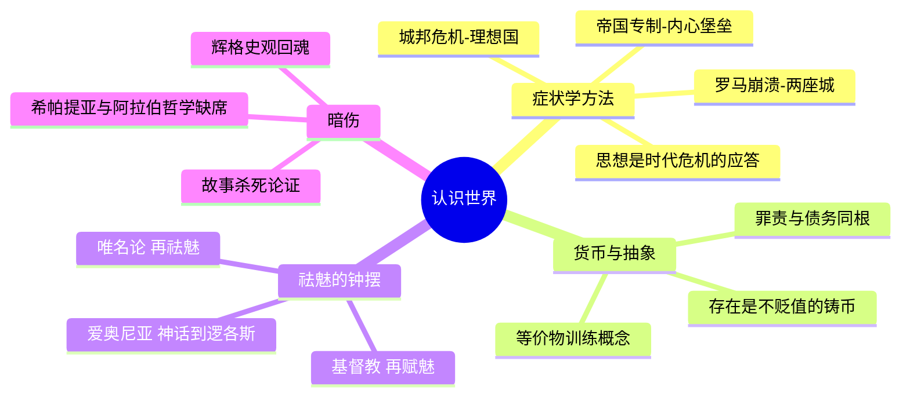

---
tags:
  - 哲学史
  - 货币与抽象
  - 苏格拉底审判
  - 奥古斯丁
  - 唯名论
douban_link: https://book.douban.com/subject/35268348/
score: 4
cover: https://img2.doubanio.com/view/subject/s/public/s33854061.jpg
create_time: 2026-10-02
---

# 深层解构

普莱希特在这本书里押了一个很大的赌注：哲学史可以不写成"理论的接力赛"——泰勒斯说了什么、柏拉图驳了什么——而写成**社会断裂的症状史**。他赌读者真正想知道的不是答案，而是：为什么偏偏在那个时候、那个地方，有人开始那样提问？

顺着这个赌注往下摸，你会发现这本书真正的主角不是任何一位哲学家，而是**"抽象"本身**——一种先在货币里、后在"存在"里、最后在上帝那里反复换形的能力。看懂这条暗线，全书的章节就自动重新排列了。

### 基石：三根承重梁

**一、思想是时代危机的应答，而且从来如此。** 普莱希特的方法论近乎偏执：每一个哲学体系都被他按回一场具体的溃败里。雅典在伯罗奔尼撒战争中崩溃，于是有了柏拉图对民主的系统性不信任；亚历山大把城邦碾成帝国，于是哲学从广场退入内心，造出斯多亚派那座"不可攻破的堡垒"；罗马陷落，于是奥古斯丁写出两座城，告诉基督徒真正的祖国不在此地。**读这本书的正确姿势是反过来读：先记住每个时代的伤口，再去看哲学家开出的药方——药方几乎是伤口的镜像。**

**二、货币是哲学的隐秘接生婆。** 这是全书最锋利、也最被"通俗哲学史"标签掩盖的论点。铸币诞生在小亚细亚，哲学也诞生在小亚细亚，时间几乎重合——普莱希特不认为这只是巧合。当一切货物被折算为一个抽象等价物，人就被迫进行一种前所未有的心智操作：**抽掉一切具体属性，只保留可交换的量**。毕达哥拉斯的数、赫拉克利特的逻各斯、巴门尼德的"存在"，都是这种操作的升级版。他还不忘补一刀：希腊语里罪责与债务同源——道德概念本身就是从账本里长出来的。这个论点日后你会在尼采《道德的谱系》里再次遇到，普莱希特在这里埋的是一颗谱系学的种子。

**三、祛魅不是一条直线，是一架钟摆。** 爱奥尼亚人用自然本原替换神话（第一次祛魅），基督教用道成肉身重新占领世界（再赋魅），中世纪末的唯名论把共相砍成"名字"、把上帝逐出可证明的范围（再祛魅）。全书的骨架就是这三次摆动。值得注意的是普莱希特在导言里亲口承认：**哲学不像科学那样积累真理、不断进步**——记住这句话，它马上会变成刺向他自己的刀。

### 边缘：叙述节奏掩盖下的三个爆破点

**一、苏格拉底之死不是殉道，是内战的尾巴。** 流行的圣徒叙事里，苏格拉底死于雅典人的愚昧。普莱希特还原的是另一幅图景：三十僭主的恐怖统治刚被推翻，而僭主集团的核心人物是苏格拉底的学生；民主派不能公开报复（大赦令在前），于是以"渎神与败坏青年"为名清算他的老师。**这场审判的本质是政治内战的延期执行。** 顺着看下去，柏拉图一生的写作都是这场创伤的应激反应——《理想国》不是乌托邦蓝图，而是一个战败贵族子弟的复仇幻想：把城邦交给哲学家，就是交给"我们这种人"。

**二、奥古斯丁发明了"内在的人"。** 这是全书最冒险、也最被低估的判断。《忏悔录》之前，没有人这样写过自己：记忆是一座宫殿，时间不是天体的运动而是**心灵的延展**，认识自己必须向内心最深处挖掘。普莱希特在这里悄悄干了一件大事：他把通常归于笛卡尔（我思）乃至弗洛伊德（潜意识）的"内在性"的发明权，前推到了公元4世纪。如果这个论断成立，那么**近代主体性不是反基督教的产物，而是基督教孕育的**——整个"世俗化=解放"的故事都要改写。

**三、中世纪不是停电，是产房。** 普莱希特把近四分之一的篇幅给了中世纪，而且立场鲜明地翻案：奥卡姆的唯名论把共相贬为名字，等于宣布**只有个体才是真实的**——经验科学和个体权利的两颗胚胎，都在这台手术里着床。嘲笑中世纪"黑暗"的人，多半只读过文艺复兴胜利者写的战报。

### 暗流：作者自己不敢直视的三块地基

**一、辉格史观的回魂。** 普莱希特嘴上说"哲学不进步"，笔锋却一路上扬：从神话到逻各斯，从迷信到理性，从中世纪走向（下一卷的）主体性黎明。他为中世纪"平反"的方式，恰恰是把它写成**近代的预备班**——这还是进步史观，只是把进步的中继站多设了一个。真正彻底的历史主义应该能设想：奥古斯丁的世界对我们来说不是"未完成的现代"，而是一个**已经永远关闭的、同等完整的世界**。

**二、故事杀死了论证。** 巴门尼德的诗、安瑟伦的本体论证明、奥卡姆的剃刀，在书里都变成了场景、轶事和警句。读者带走了大量"关于哲学的知识"，却可能从头到尾没有经历过一次**被论证逼到墙角**的体验——而后者才是哲学本身。这是所有"小说式哲学史"的原罪，普莱希特只是把它犯得格外迷人。

**三、谁不在场。** 希帕提亚被暴徒杀死的段落一闪而过，宾根的希尔德加德干脆缺席；阿拉伯哲学（阿维森纳、阿威罗伊）只是"亚里士多德归来"的快递员，不是思想主体。一部以"思想的社会史"自诩的著作，对**哲学话语的准入机制本身**——谁能写、谁能被保存、谁能进入这部正典——几乎没有反思。它的方法背叛了它的眼界。

### 追问的变形：这本书真正的读法

公元前6世纪的问题是"世界由什么构成"，公元前5世纪变成"人应当如何生活"，帝国时代变成"在坏世界里如何自处"，中世纪变成"信仰与理性如何共存"。**每个时代都不是回答了上一个时代的问题，而是宣判它问错了。** 所以别把这本书读成答案之书——里面的答案全部过期了。盯住问题的变形，你才算读到了普莱希特真正想让你带走的东西：提问的能力从来不在真空里，它是被时代掐住脖子之后，从指缝里挤出来的。

# 章节内容

不按目录流水，按思想史的八次断裂重排全书。

### 爱奥尼亚的爆炸：当等价物学会说话（从前在爱奥尼亚 / 万物的尺度 / 人的本性）

米利都的商人水手们干了两件事：把货物折成铸币，把世界折成"本原"。泰勒斯说万物是水——结论粗糙，方法石破天惊：**不诉诸神明，只诉诸自然**。随后毕达哥拉斯把本原升级为数（并在南意大利搞出政教合一的教团，哲学与权力第一次合谋），赫拉克利特宣布万物皆流、逻各斯为法，巴门尼德反手一刀：流变是假象，只有"存在"不动——思想的抽象速度在这里追上了货币的抽象速度。德谟克利特把这条路推到底：一切皆为原子与虚空，灵魂也不例外。两千年后人们才意识到，这是唯物主义最彻底的一次亮相。

### 民主雅典的反噬：苏格拉底之死的政治解剖（流浪汉、他的弟子与雅典公共秩序）

苏格拉底是不穿鞋的街头质问者，专门拆穿"知道自己不知道"之外的所有人。但普莱希特的重点不在他的辩证法，而在他的死：伯罗奔尼撒战争战败、三十僭主（他的学生们）被推翻之后，民主派需要一颗头颅来缝合城邦。审判是政治清算，"渎神"只是合法外衣。柏拉图的写作由此开始——**把一场政治谋杀追认为哲学诞生的献祭**，这是西方思想史上第一次、也是最成功的一次叙事夺权。

### 柏拉图的两场战争（表象与存在 / 金钱还是荣誉）

柏拉图同时向两个方向开战。对感性世界：洞穴喻宣布我们看到的一切只是影子，真正的存在是不动的理念——这是贵族对变动世界的系统性不信任，"世界的非本真化"。对金钱社会：《理想国》里护卫者不得有私产、家庭甚至固定配偶——**对私有制的总攻先于一切社会主义两千年**。晚年的《法律篇》是退却：马格尼西亚重新承认家庭与财产，理想主义者向现实分期付款。

### 亚里士多德：把秩序还给世界（事物的秩序 / 适合的道德）

学生对老师的反动是地基级的：理念不在天上，就在事物之中；"存在"有多种意义；宇宙是一个以目的为骨架的秩序。他的伦理学同样务实——德性不是知识而是习惯，幸福是"合乎德性的实现活动"。但普莱希特不给他打折：女人、奴隶、"野蛮人"被明确排除在德性主体之外，**这套最强调"人是政治动物"的哲学，恰恰规定了谁不算完整的人**。这个排除机制比它的任何定理都长寿。

### 帝国时代的内心堡垒（避世者与怀疑者 / 错误生活中的正确生活）

城邦死了，哲学退守。犬儒学派以挑衅为业（第欧根尼的灯笼与木桶），怀疑论者以悬搁判断求生，伊壁鸠鲁把快乐重定义为"痛苦的缺席"、把诸神打发到星际的冷漠里，斯多亚派则建起最坚固的堡垒：世界是程序化的逻各斯，你唯一能管辖的是自己的判断——**"做最好的自己"是奴隶与皇帝共享的哲学**，爱比克泰德与马可·奥勒留师出同门，这不是巧合，是这种哲学的功能证明。

### 哲学的神学化：从斐洛到奥古斯丁（合法化与赋魅 / 奥古斯丁或上帝之恩典）

罗马需要超越城邦的黏合剂，哲学与东方宗教开始合流。犹太哲学家斐洛用希腊概念重读摩西——普莱希特语出惊人："摩西，所有哲学家的老师"。新柏拉图主义把柏拉图的彼岸蒸馏成"太一"。然后奥古斯丁登场，以个人灵魂的全部重量——怀疑、肉欲、阅读、一棵无花果树下的大哭——为新宗教浇筑概念地基：恶不是实体而是善的缺失，时间是心灵的延展，救赎靠恩典不靠功业。**上帝之城与尘世之城的划分，让罗马的陷落变得可以忍受**——哲学第一次大规模地执行了它此后反复执行的任务：为不可忍受的现实提供意义。

### 修道院里的定时炸弹（在教会的阴影下 / 创世的意义与目的）

修道院保存了文本，也囚禁了文本。爱留根纳在9世纪就敢论自由意志与自然的分层；安瑟伦试图用一个纯概念证明上帝存在——信仰第一次感到需要论证，这本身就是理性的进逼。阿伯拉尔用《是与否》把教父们摆上矛盾的解剖台，为逻辑冲锋，付出被阉割与审判的代价。13世纪"亚里士多德归来"（经由阿拉伯学者之手），阿奎那完成大综合：理性与信仰各治一方，哲学被收编为神学的婢女——**但婢女掌握了主人的全部钥匙**。中世纪大学在这场收编中诞生，知识制度化的闸门一开，就再也关不上了。

### 唯名论：中世纪如何亲手接生近代（世界的祛魅 / 诸神的黄昏）

14世纪，邓斯·司各脱把上帝的意志抬到理性之上，奥卡姆挥动剃刀：共相只是名字，只有个体真实，上帝不可证明、只能信仰。这套操作的后果是毁灭性的——**经院哲学的大厦是被它自己最虔诚的修士们拆掉的**。信仰与理性分家之日，就是经验科学获准单过之时。库萨的尼古拉以"有学识的无知"摸到无限宇宙的边缘，人在宇宙中的特权位置开始摇晃。本书到此收束：旧神退场，新主角——"自我"——正在意大利的城邦里更衣，准备登场。
