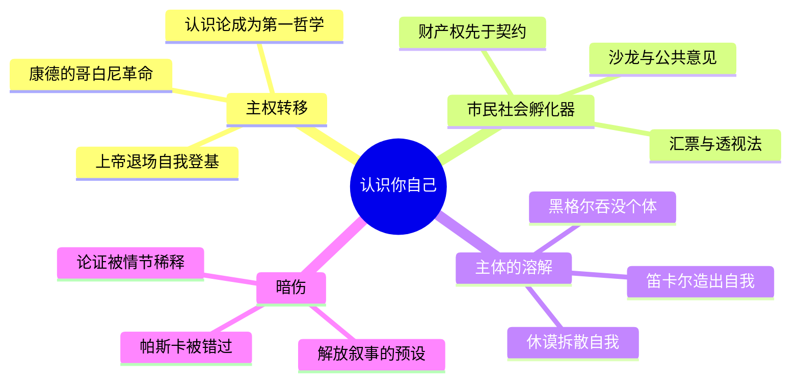

---
tags:
  - 哲学史
  - 主体性转向
  - 市民社会
  - 启蒙运动
  - 德国唯心论
douban_link: https://book.douban.com/subject/35899741/
score: 5
cover: https://img3.doubanio.com/view/subject/s/public/s34247213.jpg
create_time: 2026-10-02
---

# 深层解构

读这本书之前，先接受普莱希特一个不太客气的暗示：**你以为与生俱来的那个"自我"，是这四百年里被人一点点制造出来的。** 个体、自由、财产、公共意见、内在尊严——这些你出厂自带的观念，全部是近代欧洲的手工艺品。这本书写的不是哲学家的列传，而是一台"自我制造机"的装配图纸。

而且这台机器有个诡异之处：**它造出的产品始终不太稳定。** 笛卡尔刚把"我思"铸成哲学的地基，休谟就把它拆成一束流动的知觉；康德刚刚宣布人为自然和道德立法，黑格尔就把个体溶进历史精神的洪流。认识你自己？四百年忙到最后，"你自己"反而成了最说不清的东西。普莱希特没有明说这条暗线，但整本书的章节顺序就是它最诚实的供词。

### 基石：支撑全书的三根梁

**一、主权的转移：从上帝到自我。** 这是全书的总纲，也是书名的来历。第一卷《认识世界》里，认识的主体躲在对象背后；这一卷里，对象变成了主体的函数。库萨的尼古拉把人从宇宙中心放逐又加冕，皮科宣布人的尊严在于自我塑造，笛卡尔用"我思"为确定性奠基，康德干脆让人为自然立法——**上帝留下的每一个职位，都被"自我"逐个接任：世界的解释者、道德的立法者、历史的作者**。近代哲学史，读作一部缓慢的、不断遭遇抵抗的篡位史。

**二、经济先思考，哲学后追认。** 普莱希特最不肯让步的方法论在这里达到最强音：近代哲学的概念工具箱，是市民社会先于哲学家发明的。汇票与复式记账要求远程的、可计算的抽象信任——这是"清楚明白"的商业版；透视法让阿尔贝蒂时代的画家学会了从单一主体位置组织世界——**笛卡尔的"我"不过是透视灭点的哲学化**；洛克写财产论的时代，英国正经历金融革命；"公共理性"诞生于咖啡馆、沙龙与出版市场。哲学家不是时代的教师，是时代最敏感的速记员。

**三、身体的复辟冲动。** 与绝大多数哲学史不同，普莱希特执拗地跟踪"身体"这条线索：笛卡尔把身体降格为"自动装置"时的不安、斯宾诺莎偏要给情感画"几何学"、浪漫派对身心分裂的全面反叛。他在暗示：**近代哲学的主线叙事——心灵驯服身体——下面始终涌动着反方向的潜流**。人不是纯粹的理性主体，人是生物。这个判断他后来在《思考动物》和《人工智能与生活的意义》里继续展开，这一卷是伏笔。

### 边缘：三处被主线叙事压低的暗扣

**一、"太初有私产"：现代政治的原点不在契约，在劳动。** 讲洛克时普莱希特点破一个常被教材绕开的逻辑：不是社会契约创造了财产，而是**财产先于国家存在，国家只是为保护财产而设的保安公司**。劳动"混入"对象，对象就变成了"我的"。这个论证撑起了此后三百年自由主义的全部建筑——也预埋了马克思的炸药：如果劳动创造价值，占有者凭什么收割？左右之争的原始裂缝，就在这几页里。

**二、帕斯卡：理性的黄金时代里最不体面的先知。** 当笛卡尔体系如日中天，帕斯卡在波尔罗亚尔的寂静里写下反向证词：人心有其理，而理性一无所知；在无限宇宙的永恒沉默面前，"我"是会被吓坏的。普莱希特给了他篇幅，却把他安放在"怀疑"的注脚位置。但帕斯卡真正可怕的是：**他比笛卡尔更早知道主体性大厦将建在一片焦虑之上**——二十世纪的存在主义只是把他的恐惧重新出版了一次。

**三、伊丽莎白的质问。** 波希米亚的伊丽莎白公主写信逼问笛卡尔：如果心灵是非物质的实体，它怎么推动身体这个物质机器？笛卡尔终其一生没有给出令人满意的回答。普莱希特记下了这场通信，但没有追认它的份量——**这位不在大学、不入正典的女性，用一封信击中了整个近代形而上学的阿喀琉斯之踵**。女性在本书中多以"通信者""受教育者"的面目出现，她们在场，却没有被承认为思想的作者。这部写"市民社会如何制造自我"的书，恰恰没问：谁有资格成为"市民"？

### 暗流：作者没打算清算的三笔账

**一、解放叙事的预设。** 全书的隐性骨架是一个从神权到理性自律的上行故事：文艺复兴挣脱、启蒙破除、唯心论加冕。但注意一个错位——路德"唯独恩典"对自由意志的摧毁，被叙述成通往现代自由的铺路石，可路德本人是想把人捆得更紧。**把反动者追认为解放的先驱，是进步史观惯用的追封术。** 普莱希特在上一卷批判别人犯这个病，这一卷自己也没完全免疫。

**二、论证继续被情节稀释。** 康德的先验演绎——"人为自然立法"为什么必须成立——被浓缩成几个明亮的句子；黑格尔的逻辑学几乎整体绕道，只留下历史哲学的华丽外壳。读者会记住"我心中的道德法则"的感动，却拿不到它赖以成立的推导链条。**哲学史越像侦探小说，哲学越像小说。** 这不是对普莱希特的苛责，而是对这种体裁的结构性警告：流畅是有代价的，代价由论证支付。

**三、"经济解释思想"的还原论风险。** 当普莱希特把透视法、汇票、咖啡馆写进哲学史，他干得漂亮；但这个方法有个静默的越界：仿佛思想总能被经济条件"说明"。康德的绝对命令恰恰宣称**"应当"无法从任何经验条件中推出**——如果道德法则真是市民社会自我意识的升华，那它的绝对性从何谈起？普莱希特没有回答，也可能无法回答：这是他全部方法论撞上唯心论时留下的凹痕。

### 权威的轮换：上帝死后的四个摄政王

这本书还可以读成一部"宝座空置史"。上帝退场后，权威宝座上先后坐过四位摄政：**理性**（笛卡尔到莱布尼茨，清楚明白者即真）、**自然法与财产**（洛克，不可让渡者即正当）、**公共意见**（启蒙，经公开讨论者即合法）、**历史**（黑格尔，精神展开的方向即目的）。每一位摄政王都宣称自己是最终裁决者，每一位都被下一位政变推翻。读完这四百年再看今天——坐在那个位置上的"科学""数据""市场"，姿态是不是同样眼熟？**这本书最大的实用价值，是给当代权威做CT的底片。**

# 章节内容

不按目录流水，按"自我制造机"的装配工序重排全书。

### 透视法与汇票：世界先被商人重新观看（内在于我们的世界 / 全新视角）

佛罗伦萨的美第奇们用"三王游行"把家族庆典办成了政治神学，而同城的画家和银行家在做另一件更深远的事：透视法教会欧洲人**从一个固定的"我"的位置组织整个可见世界**，复式记账和汇票教会他们用抽象的、可计算的信任替代人情。人文主义者的"精神考古"把柏拉图挖回托斯卡纳，瓦拉向神学决定论发起论战，皮科宣布人没有固定本性、尊严全在自我塑造——**哲学还没动笔，认识论革命的装备已经在账房和画室里备齐了**。这是普莱希特方法论的最佳示范：观念的换代，永远滞后于生活方式的换代半步。

### 北方的决裂：恩典、愚人与乌托邦（此岸—彼岸）

伊拉斯谟的《愚人颂》用讽刺给教会放血，姿态温和，立场还是内部改良；路德直接掀桌——"唯独恩典、唯独信仰"，人的自由意志在救赎面前一文不值。伊拉斯谟与路德的论战是近代第一场公开的思想决斗，结果反讽至极：**以反抗教会垄断起家的宗教改革，造出了比教会更不容置疑的确定性**。莫尔的《乌托邦》在另一条战线上开火：既然此岸的制度烂透了，就把它整体画成反面。此岸与彼岸的裂缝一旦撕开，此后四百年所有激进与保守的分歧都从这里经过。

### 天空失去天使之后（全新的天空）

哥白尼只是谨慎地挪了一下地球，布鲁诺却把宇宙直接撑到无限——为此他献祭于火刑柱，"太阳的祭礼"是本卷最灼人的一章。伽利略的望远镜让争论变成观测：天上有山、有斑点、有木星的卫星，**完满天球的时代死于光学仪器**。培根没有造一颗望远镜，却造出更厉害的装置——"所罗门的房子"，一座想象中的科学协作机构：知识从此不再是沉思的产物，而是有组织、有分工、以改造世界为目的的生产。技术精神在这一章接过哲学的话筒。

### 炉边之梦与身心之债（我思，故我在）

1619年冬，乌尔姆附近一间有火炉的小屋，笛卡尔做了三个梦，醒来决定用怀疑清算一切旧知识。怀疑的尽头站着"我思故我在"——**近代哲学的阿基米德点，是一个冻得发抖的人拒绝再相信任何外部凭证**。代价随即到账：心灵与身体被劈成两种实体，身体沦为"自动装置"，而两者之间如何相互作用成了四百年还不清的债。伊丽莎白公主的来信第一个上门催债。值得注意的是"清楚明白"这个真理标准：它要求观念像一张兑付无误的汇票——商业理性的语法，就这样写进了第一哲学。

### 理性的黄金时代及其暗伤（清晰事物的上帝）

斯宾诺莎是被阿姆斯特丹犹太社区革出教门的人，却写出最严密的理性体系：实体唯一，万物是神的样态，情感也要按几何学的方式证明——**最异端的人造出最秩序的宇宙，这是理性时代最大的反讽**。莱布尼茨用"单子"和前定和谐把宇宙调回精致：每个单子是一面没有窗户的镜子。帕斯卡在波尔罗亚尔冷眼旁观这一切：你们用理性砌墙，可墙外是无限空间的永恒沉默——"人会思考"既是尊严，也是恐惧的来源。理性最自信的年代，恰是它最不安的年代。

### 恐惧的政治学：霍布斯（缔结的权力）

英国内战教会霍布斯一件事：人最根本的激情是怕死。自然状态不是田园诗，是"一切人对一切人的战争"；要结束战争，人们只好互相立约，把除自卫外的一切权利上缴给一个"人造的神"——利维坦。**主权的合法性第一次彻底不来自上帝，而来自恐惧双方的相互授权**。此后所有政治哲学——洛克的、卢梭的、甚至你我对国家的默认想象——都在这座建筑的阴影里开工。

### 财产如何成为人：洛克的双重面孔（个体与财产 / 未被书写的白板）

洛克给"我"装上两块基石：认识上，心灵是白板，一切观念来自经验——**人没有天生的思想，只有积累的印象，这是教育革命的哲学执照**；政治上，人把自己的劳动"混入"对象即获得财产，政府的全部正当性就是保护这份先已存在的财产。但普莱希特不让洛克体面退场：这位自由主义之父持有皇家非洲公司——奴隶贸易垄断企业——的股份，他起草的卡罗来纳宪法写着奴隶主对奴隶的生杀大权。"商人的宽容"宽容的是新教徒与股东，不宽容的是被贩运的人。**近代自由的建筑师亲自设计了它的地下室。** 白板说引发的连锁反应同样剧烈：感觉论把理智"解剖"为感觉的组合，贝克莱顺水推舟喊出"存在就是被感知"，与莱布尼茨的隔空论战把经验论与唯理论的裂缝越撕越宽。

### 幸福的计算与理性的反噬（所有人的幸福 / 坍塌的老建筑）

启蒙把救赎换算成幸福，且必须是可计算的、此岸的、最大多数人的幸福——爱尔维修式的快乐痛苦核算呼之欲出，功利主义在试管里成形。这套算法解放了人，也把人还原成效用函数上的点。然后休谟进场，一个人拆掉三堵承重墙：因果不是必然联系，只是习惯性联想；自我不是实体，只是一束流动的知觉；奇迹经不起经验法庭的质证。**启蒙许诺理性将建成大厦，休谟证明图纸本身画在沙地上。** 哲学史上很少有人这样，一边用理性的全部武器，一边给理性开出死亡证明——康德说，是休谟把他从独断论的迷梦中叫醒。

### 公共意见：匿名的神（公共理性）

启蒙的真正发明不是某条原理，而是一个新法庭：公共领域。伏尔泰的檄文、狄德罗的百科全书、巴黎的沙龙与伦敦的咖啡馆，造出一种前所未有的权威——**匿名的、不断自我修正的、以讨论为唯一程序的"公众"**。卢梭在阵营内部投下反对票：文明没有治愈人，文明制造了不平等——第一个人圈起一块地说"这是我的"，市民社会连同它的苦难一起诞生。康德为这个时代盖章："启蒙就是人摆脱自己加之于自己的不成熟状态。要有勇气运用你自己的理智。"四年后巴士底狱陷落，公共意见第一次以街垒的形式发言。

### 康德：为人立法（在精神的宇宙中 / 我心中的道德法则 / 至高点）

本书的真正枢纽。康德的第一刀砍向认识论：不是心灵符合对象，而是对象符合心灵的先天结构——时空与范畴是人自带的操作系统，我们只认识现象，物自体永远在边界之外。**"认识世界"从此必须经过"认识你自己"的安检，书名在这一章兑现为纲领。** 第二刀砍向伦理学：道德不来自幸福、习俗或神谕，只来自理性自身的立法——绝对命令；自由不是摆脱因果，而是给自己立法并服从，即自律；人是目的，永远不得仅仅作为手段。第三刀，判断力批判：在必然的自然与自由的道德之间，审美判断搭起窄桥——美是"无目的的合目的性"，它在机械宇宙里为意义留了最后一个房间。

### 从自我到自然到历史：唯心论的膨胀与回收（灵魂世界还是世界灵魂 / 美的存在与显像 / 历史的终结）

康德把"自我"抬上王座，后继者立刻把它推向僭主。费希特宣布绝对自我设定世界；谢林反手一问：灵魂的世界，还是世界的灵魂？——自然是沉睡的精神，精神是醒来的自然。浪漫派（诺瓦利斯、施莱格尔）在诗里寻找无限，席勒给出诊断：人只有在游戏时才完全是人——**审美被任命为感性与理性的调停者，这是"认识你自己"最温柔的一个版本**。荷尔德林把这一切唱到精神失常的边缘。然后黑格尔收网：全部四百年只是绝对精神认识自身的漫长弯路，历史是自由意识的进步史，终点是精神与自己的和解——"密涅瓦的猫头鹰在黄昏起飞"。个体在这场和解里既被成全也被吞没。普莱希特就此搁笔：自我的登基大典刚刚落幕，马克思、克尔凯郭尔、尼采已经在会场外排队——那是下一卷的事，也是我们今天仍在其中挣扎的事。
