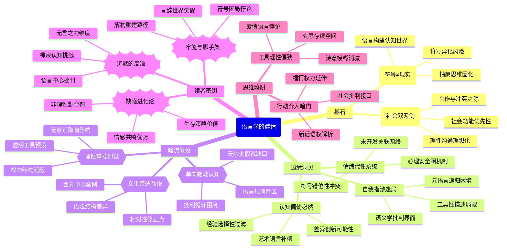

豆瓣链接：https://book.douban.com/subject/26431646/

# 深层解构

以下是对《语言学的邀请》的深度解码，为你揭示书中的三重世界：

### 一、基石：作者反复回归的核心信念
1. **符号≠现实的割裂观**
    - **核心表述**：“符号并不就是所代表的事物，地图并不就是所代表的地区，言辞并不就是事实”“动听的字眼……常会使我们感到‘言之有物’，可是稍微仔细审查就会发现其本质是情绪的极端化表达”。
    - **逻辑支点**：作者认为语言是构建认知的“第二重世界”，但人们常将语言符号与现实混为一谈。例如“爱国心的象征标记往往被看得比爱国心本身更重要”，这种混淆会导致思维固化（如二元价值观点）和社会冲突。
    - **论证闭环**：从语言的工具性（报告用语言、控制社会的语言）到思维的抽象性（分类、概念形成），始终围绕“打破语言幻觉，回归现实本身”展开。
2. **语言的社会性双刃剑**
    - **核心表述**：“语言既能让人走到一起，也能让人走向对立”“同类之间通过语言进行广泛合作，是人类生存的基本工具”。
    - **隐藏预设**：语言的社会功能优先于个体表达，认为“谈话引发冲突是使用不当的结果”，暗含对“理性沟通可能性”的乐观信念。

### 二、边缘：思想曲线的远端洞见
1. **认知偏倚的必然性**
    - **原文线索**：“每个人的经验都会先由他按照自己的利益和背景选择节略一番，因此我们大家所得到的经验都是一开始就是‘偏倚’的”。
    - **延伸可能**：作者仅将“偏倚”视为需要克服的认知缺陷，却未意识到其可能是创新思维的源头——差异偏倚正是多元视角的基础，如艺术语言（“伟大的文学帮助我们适应现实”）正是通过故意打破逻辑偏倚来激活情感认知。
2. **语言的自我指涉性**
    - **原文线索**：“语言可以用来叙述语言”。
    - **未竟领域**：若深入探讨，可触及“元语言”对思维的递归作用（如用语言分析语言本身的局限性），这接近现代语义学的自我批判维度，但作者仅将其作为工具性描述。
3. **情绪的语言安全阀理论**
    - **原文线索**：“没有发泄和陶冶感情的工具，我们就会像没有安全阀的机器一样，有爆炸的危险”。
    - **跨界启示**：结合心理学，可推导出“语言不仅是思维工具，更是情绪代谢系统”，但作者未展开其与日常沟通（如争吵本质是情绪符号的错位）的关联。

### 三、暗流：未被言说的前提假设
1. **语言可被理性掌控的幻觉**
    - **假设内容**：作者认为通过“前后文分析”“避免过早判断”等方法可纠正语言偏差，隐含“语言是可被系统化解析的透明工具”这一前提。
    - **现实挑战**：忽略了语言的无意识层面（如隐喻的潜意识影响）和权力结构（如“社会有系统地鼓励符号与事物混为一谈”背后的意识形态操控），例如广告语言正是利用符号联想绕过理性审查。
2. **个体能动性的单向度认知**
    - **假设内容**：强调“人应主动驾驭语言”，但未探讨语言体系对个体的先在规训（如萨丕尔 - 沃尔夫假说中的“语言决定思维范畴”）。
    - **逻辑裂缝**：当作者说“我们所学到的总有一部分是必须抛弃的”时，未追问“抛弃行为本身是否受限于现有语言框架”，陷入“用语言批判语言”的循环困境。
3. **文化普适性的隐性预设**
    - **假设内容**：案例多基于西方社会（如宗教符号、公民道德），默认语言问题具有跨文化一致性。
    - **被忽视的变量**：不同语言的语法结构（如中文的模糊性 vs 英文的逻辑化）可能导致认知差异，作者未触及“语言相对性”对其理论的修正可能。

### 四、给读者的三个礼物
1. **顿悟：这本书真正在说——语言是思维的牢笼与脚手架**
    - 表面讲语言学，实则揭示人类如何被自己创造的符号系统困在“言辞世界”，又如何通过解构符号（如“地图 - 地域”模型）重建对现实的感知。核心矛盾在于：语言既是认知的枷锁（“偏倚”“分类固化”），又是突破枷锁的唯一工具（“用语言分析语言”）。
2. **惊喜：如果换个角度看——语言的“缺陷”正是其进化优势**
    - 偏倚性 ≠ 认知缺陷：广告、宗教、艺术均依赖符号联想激发情感共鸣，这种“非理性”恰是人类协作的黏合剂。
    - 二元思维 ≠ 低级认知：在紧急决策（如避险）中，“非黑即白”的快速分类是生存策略，作者低估了其进化合理性。
3. **发现：作者可能没意识到——其理论隐含着对“沉默”的歧视**
    - 全书聚焦“语言使用”，但未探讨“不说话”的力量：沉默可能是反抗（如“消极抵抗”）、深度思考（如禅宗的“不立文字”）或情感共鸣（如默契）。语言的边界之外，存在另一种认知维度，这恰是对“语言中心主义”的温和挑战。

### 五、思维陷阱与暗门提示
- **警惕工具理性倾向**：作者过度强调语言的“功能性优化”（如“让语言成为自由心境的工具”），可能忽视语言的诗意维度——有些美好（如爱情、哲学玄思）恰恰源于语言的模糊性。
- **暗门：从语言批判到行动介入**：书中提到“语言能粉饰恶政”，可顺着“语言 - 权力”脉络延伸至《1984》的“新话”理论，或福柯的“话语即权力”，完成从语言学向社会批判的跨界。

这本书的真正价值，不在于提供一套语言使用手册，而在于教会读者用“第三只眼”审视日常交流中的符号游戏——当你下次听到“绝对”“永远”“所有人”这类词语时，或许会停下来想想：这是现实的报告，还是语言编织的幻觉？这种怀疑，正是思维自由的开始。

# 章节内容
好的，作为一名历史和文化领域的学者，我将为您逐章节总结塞缪尔·早川的经典著作《语言学的邀请》。我的总结将严格依据书籍的核心内容，提炼每一章作者的关键论点与主张。

### **第一编：语言的功用**

#### **第一章：语言和生存**
在本章中，作者早川先生开宗明义，提出了一个核心论点：**语言是人类实现合作、进而得以生存的最重要机制**。不同于动物依靠本能进行有限的合作，人类通过语言积累和传递知识，实现了跨时间、跨空间的广泛合作。作者认为，人类文明的建立，无论是修建金字塔还是现代城市的运转，其基础都是语言所促成的知识共享与社会协同。一个人的神经系统能够接收和处理的信息是有限的，但通过语言，我们可以利用他人神经系统（即他人的经验和知识）的成果。因此，语言并非仅仅是沟通工具，更是塑造人类社会结构、推动文明发展的根本动力。**人类最重要的生存特征，就在于能够通过语言将知识汇集起来**。不理解语言的运作方式，我们就无法深刻理解人类自身和社会。

#### **第二章：符号**
本章探讨了语言的本质——符号系统。作者的核心主张是：**“地图”不等于“实地”，“言辞”不等于“事物”**。语言是由一系列符号（词语、句子）组成的“地图”，我们用它来代表现实世界这个“实地”。然而，人们常常会犯一个根本性的错误，即将符号本身与其所代表的事物混为一谈。例如，人们会因为一个负面的标签（符号）而对某人产生厌恶，却忽略了对这个人的实际了解。作者强调，这种对符号的无意识反应，是许多偏见、冲突和非理性行为的根源。理解符号的象征性，认识到言辞世界与现实世界之间的区别，是心智成熟的第一步。**我们生活在一个符号的世界里，也在一个现实世界里，前者是对后者的“地图”，但绝不是后者本身**。

#### **第三章：报告用的语言**
作者在本章中对语言的功能进行了区分，重点阐述了“报告”（Report）这种语言形式。报告性语言的核心特征在于其**可证实性（verifiability）和客观性**。它致力于描述客观存在的事物和现象，而不掺杂说话者的个人判断、推论或情感色彩。例如，“这台机器重200公斤”是一句报告，而“这是一台笨重的机器”则加入了个人判断。早川先生主张，清晰、有效的沟通始于准确的报告。**报告是社会知识的基础，是我们可以共同验证和信赖的言语**。在科学、法律和日常事实陈述中，严格使用报告性语言至关重要。作者警告说，将推论（inferences）和判断（judgments）伪装成报告，是导致沟通失败和思想混乱的主要原因之一。

#### **第四章：前后文**
本章的核心论点是：**词语的意义并非固定不变，而是由其“前后文”（Context）决定的**。作者指出，我们不应该去问一个词“是什么意思”，而应该问它在“这个特定的情境下是什么意思”。他将前后文分为两个层面：物理性前后文（Physical Context），即词语被使用时的现实环境；以及修辞性前后文（Verbal Context），即它与其他词语的关系。例如，“火”这个词在火灾现场和在命令“开火！”时，意义截然不同。作者进一步提出一个深刻的观点：**没有一个词语会在不同的场合具有完全相同的意义**。因为每一次使用的前后文都有细微差别。这个观点挑战了我们对词典定义的僵化理解，强调了在解读语言时，必须充分考虑其所处的动态环境。

#### **第五章：有助于社会团结的语言**
在本章中，作者探讨了语言的一种“前象征性”（Presymbolic）功能，即促进社会团结。这类语言的主要目的不是传递信息，而是建立和维持社交关系。例如，日常的问候（“你好吗？”）、关于天气的闲聊等，其内容本身通常无关紧要，但这种言语交换行为本身，**像是一种社交仪式，传达了“我们是朋友，我们愿意交谈”的友好信号**。作者将其比作人与人之间的“互相梳理毛发”，是一种建立信任和亲密感的社交润滑剂。这种语言创造了一种温暖、融洽的社会氛围，是任何有效合作和深入交流的必要前提。**在传递事实性信息之前，我们往往需要通过这种仪式性的语言来为沟通铺平道路**。

#### **第六章：语言的双重任务**
本章综合了前面的讨论，指出语言几乎总是在同时执行两大任务：**信息传递（informative）和情感表达（affective）**。前者是语言的外延意义（denotation），指向客观事实；后者是语言的内涵意义（connotation），涉及说话者的情感、态度和价值判断。例如，称一位老人为“长者”或“老家伙”，外延意义相似，但内涵意义却天差地别。作者强调，在沟通中，我们必须敏锐地意识到语言的这两个层面。许多沟通障碍源于混淆了这两种功能，比如将一句充满情感色彩的抱怨误解为客观的事实报告。**能干的听者和读者，必须能够分辨出话语中的客观内容和说话者附加的情感色彩**。

#### **第七章：控制社会的语言**
本章深入探讨了语言如何成为一种强大的社会控制工具。作者认为，语言通过制定规则、法律、协议和承诺，为社会成员的行为设定了明确的框架。**这些“指导性语言”（directive language）通过创造集体性的未来预期，来约束和引导人们的行为**。当一个立法机构宣布“法律规定……”或一个人说“我保证……”，这些话语本身就在塑造未来的现实。这种语言的力量源于社会成员的普遍共识，即相信并遵守这些语言所设定的规范。因此，语言不仅仅是描述社会，更是在构建社会。**它通过在人们的神经系统中建立起共同的行为模式，从而实现大规模的社会控制与合作**。

#### **第八章：传达感情的语言**
本章聚焦于语言的情感传达功能。作者认为，语言不仅可以*描述*情感（如“我感到悲伤”），更可以*表现*和*唤起*情感。这是通过词语的音韵、节奏、比喻以及强烈的内涵意义来实现的。诗歌和文学是情感语言的最高形式。作者主张，**情感语言的目的不是为了增进知识，而是为了协调我们内在的情感状态**。当我们用语言成功地表达了自己的情感，或者通过他人的语言感受到了某种情绪，我们的情感世界就得到了梳理和组织。这种情感的交流有助于增进人与人之间的同理心和理解，其重要性不亚于事实信息的交换。

#### **第九章：艺术和激荡的情绪**
本章是上一章的延伸，专门探讨了艺术（尤其是文学）在处理人类情感方面的作用。作者认为，伟大的艺术作品，如戏剧和小说，为我们提供了**“情感的蓝图”或“经验的地图”**。通过阅读文学作品，我们可以在一个安全的环境中去体验和理解复杂甚至危险的情感，如嫉妒、复仇、狂喜与绝望。这种体验能够提高我们的情商和内心韧性。艺术作品通过组织和澄清情感，帮助我们为现实生活中的情感挑战做好准备。因此，艺术并非逃避现实，而是**一种重要的演练，它能锻炼我们的情感能力，使我们能更好地应对真实世界的人生起伏**。它为我们的内心世界带来秩序和智慧。

### **第二编：语言和思想**

#### **第十章：我们是怎样得到知识的**
本章引入了本书一个极其重要的概念：“抽象阶梯”（Abstraction Ladder）。作者认为，我们的知识和语言存在于不同的抽象层次上。阶梯的最底层是具体的、可感知的“过程世界”（process level），即我们通过感官直接经验到的现实。往上是描述的层次（我们对所见所闻的命名），再往上是更高层次的概括和归纳（如从“奶牛1、奶牛2”到“奶牛”，再到“家畜”、“农场资产”、“财富”）。早川先生的核心论点是，**高层次的抽象虽然是思考所必需的，但也充满了危险**。最大的危险在于我们**“混淆了抽象的层次”**，忘记了高层次的抽象概念最终必须植根于底层的、可观察的现实。有效的思考者能够自如地在抽象阶梯上上下移动，而僵化的思考者则停留在某个层次，尤其是高层抽象，脱离了现实。

#### **第十一章：捕风捉影**
本章探讨了由语言引起的思想混乱，特别是当我们对“地图”（言辞）的反应，超过了对“实地”（现实）的反应时。作者用“捕风捉影”来形容这种现象：我们常常对词语本身产生强烈的、自动化的反应，而不管这些词语背后是否有对应的事实。偏见、谣言和许多无谓的争论都源于此。例如，一个词语（如“叛徒”）足以让人不经审视事实就产生敌意。**作者强调，心智成熟的标志之一，就是能够延迟反应，先去审视言辞所代表的现实，而不是立即被言辞所触发**。我们必须警惕那些存在于我们头脑中，但在现实世界里却“不在场的人”（The Little Man Who Wasn't There），即那些纯粹由语言构建出来的幻象。

#### **第十二章：分类**
本章的核心论点是：**分类是我们为了方便理解世界而强加于现实的一种系统，它并非现实世界固有的属性**。自然界中没有绝对清晰的界限，但我们的语言和思想却依赖于分门别类。例如，“好人”和“坏人”的分类，在现实中并不存在泾渭分明的两个群体，人们的行为是连续变化的。作者警告说，当我们忘记分类是人为的、便利的工具时，就会陷入僵化思维。我们会误以为我们的分类就是世界的真相，从而导致偏见和刻板印象。**我们创建了分类，但我们不应该成为分类的囚徒**。一个明智的思考者会记住，任何分类系统都有其局限性，并且总有无法被完美归类的例外存在。

#### **第十三章：二元价值观点与多元价值观点**
本章探讨了两种基本的思维模式。**“二元价值观点”（Two-Valued Orientation）是一种非此即彼、非黑即白的思维方式**，它将世界简化为两个对立面：好/坏、是/非、朋友/敌人。作者认为，这种观点在辩论、法律判决等特定场合有用，但作为日常生活的指导思想则极其有害和幼稚。它会扼杀细致的思考，助长冲突和极端主义。与之相对，作者极力提倡**“多元价值观点”（Multi-Valued Orientation）**。这种观点承认事物的复杂性和多样性，能够看到中间地带和不同程度的差异。它更接近科学和民主精神，鼓励我们用更精确的、带有程度差异的语言去描述现实（如使用“比较……”、“在某种程度上……”）。拥有多元价值观点是心智成熟和社会宽容的基石。

#### **第十四章：一团糟**
本章可以看作是前面理论的应用和案例分析。作者通过各种实例，展示了当人们不理解语言的运作机制时，如何在个人生活、社会议题和人际关系中制造出“一团糟”（Confusion）。这些混乱源于前面章节讨论过的种种思想陷阱：将言辞与现实混淆、停留在高层抽象、使用僵化的分类、固守二元价值观点等。例如，政治辩论常常因为双方对“自由”或“公平”等高抽象层次的词语有不同定义而陷入僵局。**作者认为，许多所谓的“问题”实际上是“语义问题”，即由于语言使用不当而造成的问题**。通过澄清语言、降低抽象层次、关注事实，许多看似无解的困局都可以得到化解。

#### **第十五章：老鼠和人**
本章通过对比动物与人类的学习方式，进一步凸显了语言的决定性作用。老鼠等动物主要通过直接的、痛苦的试错来学习。而人类则可以通过语言，学习他人的经验和历史的教训，避免了亲自去犯所有可能的错误。这就是**“文化积累”（cultural accumulation）的力量，它是人类独有的优势**。然而，这也带来了独特的风险：老鼠不会被虚假的“地图”所困，现实会立即纠正它；而人类却可能一生都活在错误的“地图”（意识形态、偏见、虚假信念）中，并用语言为这些错误辩护。因此，**语言既是人类超越动物的荣耀，也是人类可能陷入愚蠢的陷阱**。人类的智慧在于，既要善用语言带来的巨大优势，也要时刻警惕它所带来的风险。

#### **第十六章：走向内心和外界的秩序**
作为全书的收官之章，本章总结了语义学的最终目标：**帮助我们实现内心世界与外部世界的和谐与秩序**。作者将这种理想状态称为拥有“伸展性的观点”（extensional orientation）。一个具有伸展性观点的人，他的信念、思想和语言（内在的“地图”）总是向外部的、可观察的现实（“实地”）开放，并随时准备根据新的事实进行修正。他不会被教条、高层抽象或僵化的分类所束缚。他能倾听、观察，并从经验中学习。**通过培养这种科学的、自我修正的思维态度，我们可以减少内心的冲突，改善人际关系，并更有效地解决社会问题**。最终，对语言的深刻理解，将引导我们走向一种更理智、更宽容、也更完整的人生。