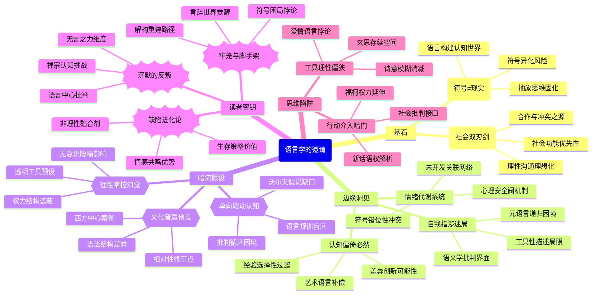

豆瓣链接：https://book.douban.com/subject/26431646/

# 深层解构

以下是对《语言学的邀请》的深度解码，为你揭示书中的三重世界：

### 一、基石：作者反复回归的核心信念
1. **符号≠现实的割裂观**
    - **核心表述**：“符号并不就是所代表的事物，地图并不就是所代表的地区，言辞并不就是事实”“动听的字眼……常会使我们感到‘言之有物’，可是稍微仔细审查就会发现其本质是情绪的极端化表达”。
    - **逻辑支点**：作者认为语言是构建认知的“第二重世界”，但人们常将语言符号与现实混为一谈。例如“爱国心的象征标记往往被看得比爱国心本身更重要”，这种混淆会导致思维固化（如二元价值观点）和社会冲突。
    - **论证闭环**：从语言的工具性（报告用语言、控制社会的语言）到思维的抽象性（分类、概念形成），始终围绕“打破语言幻觉，回归现实本身”展开。
2. **语言的社会性双刃剑**
    - **核心表述**：“语言既能让人走到一起，也能让人走向对立”“同类之间通过语言进行广泛合作，是人类生存的基本工具”。
    - **隐藏预设**：语言的社会功能优先于个体表达，认为“谈话引发冲突是使用不当的结果”，暗含对“理性沟通可能性”的乐观信念。

### 二、边缘：思想曲线的远端洞见
1. **认知偏倚的必然性**
    - **原文线索**：“每个人的经验都会先由他按照自己的利益和背景选择节略一番，因此我们大家所得到的经验都是一开始就是‘偏倚’的”。
    - **延伸可能**：作者仅将“偏倚”视为需要克服的认知缺陷，却未意识到其可能是创新思维的源头——差异偏倚正是多元视角的基础，如艺术语言（“伟大的文学帮助我们适应现实”）正是通过故意打破逻辑偏倚来激活情感认知。
2. **语言的自我指涉性**
    - **原文线索**：“语言可以用来叙述语言”。
    - **未竟领域**：若深入探讨，可触及“元语言”对思维的递归作用（如用语言分析语言本身的局限性），这接近现代语义学的自我批判维度，但作者仅将其作为工具性描述。
3. **情绪的语言安全阀理论**
    - **原文线索**：“没有发泄和陶冶感情的工具，我们就会像没有安全阀的机器一样，有爆炸的危险”。
    - **跨界启示**：结合心理学，可推导出“语言不仅是思维工具，更是情绪代谢系统”，但作者未展开其与日常沟通（如争吵本质是情绪符号的错位）的关联。

### 三、暗流：未被言说的前提假设
1. **语言可被理性掌控的幻觉**
    - **假设内容**：作者认为通过“前后文分析”“避免过早判断”等方法可纠正语言偏差，隐含“语言是可被系统化解析的透明工具”这一前提。
    - **现实挑战**：忽略了语言的无意识层面（如隐喻的潜意识影响）和权力结构（如“社会有系统地鼓励符号与事物混为一谈”背后的意识形态操控），例如广告语言正是利用符号联想绕过理性审查。
2. **个体能动性的单向度认知**
    - **假设内容**：强调“人应主动驾驭语言”，但未探讨语言体系对个体的先在规训（如萨丕尔 - 沃尔夫假说中的“语言决定思维范畴”）。
    - **逻辑裂缝**：当作者说“我们所学到的总有一部分是必须抛弃的”时，未追问“抛弃行为本身是否受限于现有语言框架”，陷入“用语言批判语言”的循环困境。
3. **文化普适性的隐性预设**
    - **假设内容**：案例多基于西方社会（如宗教符号、公民道德），默认语言问题具有跨文化一致性。
    - **被忽视的变量**：不同语言的语法结构（如中文的模糊性 vs 英文的逻辑化）可能导致认知差异，作者未触及“语言相对性”对其理论的修正可能。

### 四、给读者的三个礼物
1. **顿悟：这本书真正在说——语言是思维的牢笼与脚手架**
    - 表面讲语言学，实则揭示人类如何被自己创造的符号系统困在“言辞世界”，又如何通过解构符号（如“地图 - 地域”模型）重建对现实的感知。核心矛盾在于：语言既是认知的枷锁（“偏倚”“分类固化”），又是突破枷锁的唯一工具（“用语言分析语言”）。
2. **惊喜：如果换个角度看——语言的“缺陷”正是其进化优势**
    - 偏倚性 ≠ 认知缺陷：广告、宗教、艺术均依赖符号联想激发情感共鸣，这种“非理性”恰是人类协作的黏合剂。
    - 二元思维 ≠ 低级认知：在紧急决策（如避险）中，“非黑即白”的快速分类是生存策略，作者低估了其进化合理性。
3. **发现：作者可能没意识到——其理论隐含着对“沉默”的歧视**
    - 全书聚焦“语言使用”，但未探讨“不说话”的力量：沉默可能是反抗（如“消极抵抗”）、深度思考（如禅宗的“不立文字”）或情感共鸣（如默契）。语言的边界之外，存在另一种认知维度，这恰是对“语言中心主义”的温和挑战。

### 五、思维陷阱与暗门提示
- **警惕工具理性倾向**：作者过度强调语言的“功能性优化”（如“让语言成为自由心境的工具”），可能忽视语言的诗意维度——有些美好（如爱情、哲学玄思）恰恰源于语言的模糊性。
- **暗门：从语言批判到行动介入**：书中提到“语言能粉饰恶政”，可顺着“语言 - 权力”脉络延伸至《1984》的“新话”理论，或福柯的“话语即权力”，完成从语言学向社会批判的跨界。

这本书的真正价值，不在于提供一套语言使用手册，而在于教会读者用“第三只眼”审视日常交流中的符号游戏——当你下次听到“绝对”“永远”“所有人”这类词语时，或许会停下来想想：这是现实的报告，还是语言编织的幻觉？这种怀疑，正是思维自由的开始。

# 章节内容
以下是《语言学的邀请》更为详细的各章节读书笔记：

### 第一编 语言的功用
1. **第一章 语言与生存**：
    - 关键论点：明确语言是人类生存的关键要素。人类与其他动物的显著区别之一在于能够使用语言进行交流协作。语言使得人类可以传递信息、分享经验、制定计划，从而更好地应对生存挑战。例如，原始人类通过语言交流狩猎技巧、躲避危险的方法等，这种信息共享极大地提高了群体的生存几率。它不仅是个体之间沟通的桥梁，更是人类社会得以构建和发展的基石，在人类适应环境、获取资源、繁衍后代等生存活动中都发挥着不可或缺的作用。
2. **第二章 符号**：
    - 关键论点：着重阐述符号的本质及其与所代表事物的关系。符号是人类创造出来用以代表其他事物的标记，它与所指事物之间并没有内在的、必然的物理联系。例如，“树”这个字与实际的树木在形态和本质上完全不同，只是人们约定俗成地用这个符号来指代树木。然而，在社会生活中，人们常常错误地将符号等同于事物本身，过度看重符号的意义。像在宗教中，某些仪式或象征物被赋予了神圣不可侵犯的地位，人们对这些符号的尊崇甚至超越了对其背后宗教精神的追求；在道德和爱国等领域，一些特定的标志或口号也被极端化，导致人们盲目跟从，而忽略了其真正内涵。
3. **第三章 报告用的语言**：
    - 关键论点：强调报告语言应基于客观事实。报告是对事物实际情况的描述，其语言必须准确、真实且源于直接的观察与经验。只有这样的报告语言才能为人们提供可靠的信息，帮助人们了解事情的真相。例如，科学研究报告需要详细记录实验过程、数据结果等实际发生的情况，不能掺杂主观臆断或虚假内容。在新闻报道中，也应遵循客观公正的原则，如实报道事件的时间、地点、人物和经过，以满足公众对信息真实性的需求，使人们能够依据这些准确的报告做出合理的判断和决策。
4. **第四章 前后文**：
    - 关键论点：突出前后文在语言理解中的重要性。语言的意义并非孤立存在，而是受到其所处的上下文环境的深刻影响。同一个词语或语句在不同的前后文情境中可能具有截然不同的含义。比如“这个人很厉害”，如果是在描述一位运动员在比赛中的出色表现，那么“厉害”表示其竞技能力强；若在描述一个善于耍心机、手段强硬的人，“厉害”则带有贬义。因此，在理解语言时，必须充分考虑前后文所提供的背景信息，包括说话者的身份、场合、话题的主旨等，才能准确把握语言所传达的真正意义，避免误解。
5. **第五章 有助于社会团结的语言**：
    - 关键论点：探讨语言对促进社会团结的作用机制。共同的语言能够增强群体成员之间的认同感和归属感，成为凝聚社会力量的重要纽带。例如，一个国家或民族的通用语言可以让不同地区、不同阶层的人们顺畅交流，分享共同的文化、价值观和历史记忆。此外，一些特定的文化语言，如行业术语、地方方言中的特色词汇等，在特定群体内部使用时，也能强化群体内部的联系和团结。这些语言元素不仅是交流工具，更承载着群体的情感和文化内涵，通过语言的交流互动，促进社会成员之间的相互理解、信任与合作，从而维护社会的和谐稳定与团结统一。
6. **第六章 语言的双重任务**：
    - 关键论点：揭示语言在传达信息和表达情感方面的双重角色。语言一方面要准确地传递客观事实、知识和观念等信息内容，使接收者能够获取有用的资讯，这是其在认知层面的任务。例如，在学术讲座、技术说明书等场景中，语言主要用于清晰地阐述概念、原理和步骤等信息。另一方面，语言也用于表达说话者的情感态度，如喜悦、愤怒、悲伤等，以引发听者在情感上的共鸣或反应。在文学作品、日常交流中的感叹、赞美、抱怨等表达中，情感性语言的运用尤为明显。这两种任务相互交织，共同构成了语言丰富多样的功能体系，且在不同的语境和交流目的下，语言的侧重点会有所不同。
7. **第七章 控制社会的语言**：
    - 关键论点：剖析语言被用作控制社会的手段及其影响。语言在社会控制中具有强大的力量，通过宣传、政治话语、广告等形式表现出来。宣传者可以利用特定的语言策略来塑造公众的思想和行为。例如，在政治领域，一些政客可能会运用富有感染力和煽动性的语言来赢得民众的支持，通过强调某些理念、制造对立或承诺利益等方式，引导民众按照他们的意愿行事。广告商也会借助巧妙的语言设计来影响消费者的购买决策，营造出产品的吸引力和必要性。这种控制社会的语言往往会在潜移默化中影响人们的价值观、信仰和行为模式，可能导致人们在不知不觉中接受某种观念或行为规范，而失去独立思考和批判性判断的能力。
8. **第八章 传达感情的语言**：
    - 关键论点：阐述语言在情感传达方面的独特功能与方式。语言是表达情感的有力工具，能够跨越个体之间的心理距离，引发他人的情感共鸣。在文学作品中，作者通过细腻的文字描写来展现人物的情感世界，使读者能够感同身受。比如在描写爱情时，运用优美的词汇、生动的比喻和形象的描写来传达爱情的甜蜜、苦涩或无奈，让读者在阅读过程中产生情感上的触动。在日常交流中，人们也会借助语气、语调、表情等辅助手段，用语言来表达自己的喜怒哀乐，分享内心的感受，从而增进彼此之间的情感联系，促进人际关系的发展。不同的情感表达方式和语言风格会产生不同的情感效果，合适的情感语言能够有效地拉近人与人之间的距离，建立良好的情感沟通渠道。
9. **第九章 艺术和激荡的情绪**：
    - 关键论点：探讨艺术与语言之间的紧密关联以及艺术如何借助语言激发强烈情绪。艺术作品通过独特的语言形式，如诗歌的韵律、绘画的色彩语言、音乐的旋律等，来传达深层次的情感和思想，引发观众或读者内心激荡的情绪反应。例如，一首激昂的交响曲可以通过强烈的节奏、高亢的旋律使听众感受到振奋、激动的情绪；一幅色彩浓烈、笔触奔放的绘画作品能够传达出画家的热情与创造力，让观赏者产生强烈的视觉冲击和情感共鸣。艺术语言往往超越了普通语言的表面意义，以一种更为抽象、富有想象力的方式触动人们的心灵深处，唤起人们内心深处的情感记忆和审美体验，从而使人们在欣赏艺术作品的过程中获得情感的宣泄、精神的升华和对世界的更深层次的感悟。

### 第二编 语言和思想
1. **第十章 我们是怎样得到知识的**：
    - 关键论点：探讨人类通过语言获取知识的多种途径与方式。语言是知识传承和积累的重要载体，人们通过听闻、阅读等方式接收语言信息，进而学习和理解知识。从幼儿时期开始，我们通过与家人、老师和周围人的语言交流，逐渐认识世界、学习各种概念和技能。在学校教育中，教材、讲座等语言形式将人类积累的大量知识传授给学生。此外，语言还能够促进知识的创新和发展，人们在交流讨论中，通过对已有知识的思考、质疑和重新组合，产生新的见解和理论。例如，科学研究中的学术交流会议，学者们通过分享研究成果、探讨问题，推动科学知识不断向前发展。同时，语言也会对知识的获取产生一定的限制，不同语言的表达方式、词汇量和文化内涵会影响人们对知识的理解和认知范围。
2. **第十一章 捕风捉影**：
    - 关键论点：揭示语言使用中常见的不准确、无根据的现象及其危害。在日常交流和信息传播中，存在许多捕风捉影的语言表达，即缺乏事实依据、仅凭主观臆断或传闻就轻易传播的内容。这些不实语言可能源于谣言、偏见或片面的认知。例如，一些未经证实的小道消息在社交媒体上迅速传播，引发公众的恐慌或误解。这种捕风捉影的语言不仅会误导个人的判断和决策，使人们在错误信息的基础上行动，还可能对社会秩序产生负面影响，破坏社会的稳定与和谐。而且，一旦这种不实语言形成一种舆论氛围，就会更难被纠正，人们往往会在群体压力下盲目跟从，进一步加剧其危害。
3. **第十二章 分类**：
    - 关键论点：阐述语言对事物分类的重要性以及分类对认知和思维的深刻影响。语言通过词汇对事物进行分类，这种分类方式反映了人类对世界的认知结构。不同的文化和语言可能有不同的分类体系，例如，某些语言对亲属关系的分类更为细致，而另一些语言则对颜色的分类有独特的方式。分类影响着我们如何看待事物、理解事物之间的关系以及进行逻辑推理。当我们将事物归入某一类别时，就会赋予它该类别的特征和属性，从而影响我们对其的进一步认知和处理。例如，将一种动物归类为“宠物”，我们就会更多地从陪伴、可爱等角度去看待它，而归类为“野生动物”则会引发不同的认知和对待方式。同时，分类也并非固定不变，随着知识的增长和社会的发展，语言中的分类也会不断演变和调整。
4. **第十三章 二元价值观点与多元价值观点**：
    - 关键论点：批判二元价值观点的局限性，倡导多元价值思维。二元价值观点将事物简单地分为对立的两类，如好与坏、对与错、黑与白等，这种观点在很多情况下过于简化和片面。在现实生活中，大多数事物是复杂多面的，不能仅仅用二元对立的方式来评判。例如，一个人的行为可能在某些方面是值得赞扬的，但在其他方面存在不足；一个社会现象可能既有积极的影响，也有消极的后果。多元价值观点则能够更全面、客观地认识事物，考虑到事物的多个维度和不同的评价标准。它鼓励人们从不同的角度去分析问题，尊重多样性和差异性，避免因二元价值判断而导致的偏见、误解和冲突，从而促进更深入的思考、更广泛的交流和更和谐的社会关系。
5. **第十四章 一团糟**：
    - 关键论点：描述人类在语言和思想上容易出现的混乱状态及其根源与后果。在语言和思想领域，常常会出现各种混乱情况。一方面，语言表达模糊不清、概念混淆会导致思想的混乱。例如，一些词语具有多种含义，如果在交流中不明确其具体所指，就会造成误解和沟通障碍。另一方面，逻辑错误、自相矛盾的语言也会使思想陷入困境。这种混乱状态可能源于人们对语言的不精确使用、缺乏系统的思考训练以及受到各种复杂信息的干扰。其后果是影响个人的认知准确性、决策合理性，在社会层面上则可能导致群体意见分歧、社会矛盾加剧等问题，阻碍知识的进步和社会的有序发展。因此，需要通过提高语言素养、培养逻辑思维能力等方式来避免和纠正这种混乱状态。
6. **第十五章 老鼠和人**：
    - 关键论点：通过老鼠和人的对比，深入探讨人类语言和思维的独特性与优越性。老鼠等动物虽然也具有一定的感知和行为能力，但与人类相比，其语言和思维能力存在巨大差距。人类的语言具有高度的抽象性、丰富性和创造性，能够表达复杂的概念、思想和情感，进行深度的思考和推理。人类可以通过语言传承文化、积累知识、制定计划、创造艺术等，而这些都是老鼠等动物难以企及的。例如，人类能够通过语言构建科学理论、创作长篇小说，这些活动需要高度发达的语言和思维能力。然而，这也提醒人类要珍惜和正确运用自己独特的语言和思维天赋，避免因滥用或错误使用语言而陷入思维误区，如被虚假信息误导、陷入片面的观念等，从而更好地发挥人类语言和思维在认识世界、改造世界中的巨大作用。
7. **第十六章 走向内心和外界的秩序**：
    - 关键论点：阐述如何借助正确的语言理解与运用实现内心思想与外界环境的有序和谐。通过对语言本质和功能的深入理解，人们能够更加清晰地认识自己的思想，避免语言带来的混乱和误导。在内心层面，运用准确、恰当的语言进行自我反思和思考，可以梳理复杂的情绪和观念，使内心世界更加有序、平静。例如，通过写日记、进行心理对话等方式，用语言表达内心的感受和困惑，有助于自我认知和心理调适。在与外界的关系上，正确使用语言能够促进有效的沟通交流，减少误解和冲突，从而建立和谐的人际关系和社会秩序。无论是在家庭、工作场所还是社会公共领域，合理的语言表达都有助于协调各方利益、解决问题，使个人与外界环境相互适应、共同发展，实现从个体内心到整个社会的秩序化与和谐化。 