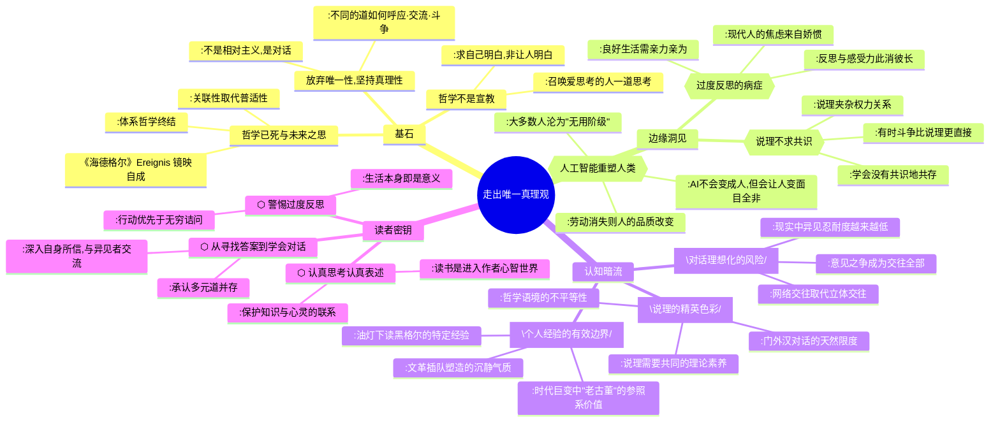

---
tags:
  - 哲学反思
  - 多元真理
  - 说理与对话
  - 良好生活
  - 陈嘉映
douban_link: https://book.douban.com/subject/34988734/
score: 5
cover: https://img3.doubanio.com/view/subject/s/public/s33591973.jpg
create_time: 2026-08-09
---

# 深层解构

### 《走出唯一真理观》深层解码：在多元之道的交汇处重新思考哲学

#### 一、基石：放弃唯一性，但绝不放弃真理性

陈嘉映的核心信念，藏在他对"不同的道"的反复确认中。这本书不是一部体系哲学著作，而是一位思想者十余年演讲、访谈与评论的结集，但它有一个贯穿始终的轴心命题：**走出唯一真理观，需要放弃的是唯一性，同时需要坚持的是真理性。**

- **核心冲突与痛点**：大众（乃至许多哲学研究者）的深层认知是——哲学应当提供一套终极的、放之四海而皆准的真理体系，所有问题都应在这个体系内找到唯一正确答案。陈嘉映称之为"普遍主义"或"绝对主义"的传统，从柏拉图到黑格尔，哲学一直在追逐这个唯一的"道"。但尼采之后的哲学家——杜威、威廉·詹姆士、海德格尔、维特根斯坦——开始松动这一传统。陈嘉映自己的心路也经历了这一转变：少年时代在油灯下读黑格尔，信奉"一套终极真理或唯一理念，其他都是它的分殊"；后来渐渐离开了这种普遍主义。**他要颠覆的不是"真理"本身，而是"唯一"这个修饰语。**

- **底层逻辑（第一性原理）**：走出唯一真理观并不滑向相对主义。陈嘉映的关键论证是——**只要我们之间还有对话，还有争论，就已经走出了相对主义**。相对主义是"怎么说都行"的虚无，而陈嘉映主张的是"各执所是，但彼此交流"。唯一真理观的对立面不是相对主义真理观，而是**对话真理观**：深入自身了解自己真正相信什么，然后与那些信念不同但同样坚定的人展开对话，在对话中消除彼此的虚假，变得越来越实在。

- **哲学已死，但"思"未死**：如果哲学的目标是构建一个无所不包的真理体系，那哲学无疑已经终结了。但海德格尔在这个终结之处召唤的是"未来之思"（Ereignis），陈嘉映翻译为"在相互镜映中自成一体"。其核心有两点：**关联性取代普适性**，**对话成为最基本的思的方式**。未来之思不再有唯一的主流传统，异端也不再是异端，因为没有了中心。

- **哲学不是宣教**：陈嘉映反复强调，今天的哲学不是上智向下愚宣教。"我们之所求，首先不是让别人明白，而是求自己明白。"这句话暗含对知识精英"启蒙大众"姿态的温和拒绝——**哲学的首要目标是自我澄明，而非征服他人。**

#### 二、边缘：被轻描淡写的颠覆性洞见

书中散落着许多看似随意的漫谈，实则埋着改变思维习惯的炸药：

- **说理的目的不是共识**：这是全书最反直觉的洞见之一。陈嘉映明确表示："我的确高度怀疑，任何对话的目的都在于谋求共识，我也不认为，一个社会在方方面面都有共识就是一个更好的社会。"在许多场合，我们根本无需达到共识。**真正的问题不是如何达成共识，而是"没有共识的人应该怎么在一起生存"。** 这一观点直接挑战了当代社会对"求同存异"中"求同"的执念——很多时候，"求同"本身就是暴力的伪装。更深刻的是，他承认说理常常夹杂着权力关系，"妄图以理压人"；在某些极端情境下（如面对恐怖主义杀戮），斗争比说理更直接、更必要。**一个以说理为业的人，坦然承认说理的限度，这本身就是最诚实的说理。**

- **过度反思是现代病**：陈嘉映提出一个精辟的诊断——现代人的焦虑很大一部分来自"娇惯的心灵"。"时代娇惯我们，我们自己也在娇惯我们自己。"过度反思让人脱离了生存与劳作的直接性，在概念的天空中漂浮。良好生活只能从**亲力亲为**中获得，而不是在无穷的自我审视中找到。他推崇那个徒步穿越阿富汗的英国人罗瑞·斯图尔特——行走是为了"身体和灵魂得到锻炼、考验、折磨"，就像生活本身那样。**反思与感受力此消彼长：越多的反思，越薄的感受。** 当我们习惯了GPS定位，方位感就退化了；当一切不爱干的事都交给机器，剩下爱干的事的性质也会改变。

- **人工智能不会变成人，但会把人变成"新人类"**：在《漫谈人工智能》中，陈嘉映提出了一个比"AI威胁论"更深刻的判断——他不担心AI统治人类，而担忧AI大规模改变人类自身。工业革命接管了人的体力劳动，AI接管了人的脑力劳动，那么社会结构将发生巨变：**只有少数人是有用的，大多数人变成了"无用阶级"。** 更关键的是，人不是只要享受的动物，我们不仅希望获得结果，也希望这些结果是亲力亲为的结果。劳动与享受割裂之后，人的定义就改变了。这让人想起马克思"劳动创造了人"的命题——当劳动消失，人还是人吗？

#### 三、暗流：未被审视的认知前提

在平实温和的表述之下，藏着几条需要批判性审视的暗流：

- **说理的精英色彩**：陈嘉倡导的"说理"与"对话"，其最佳实践是《"说理"四人谈》——他与刘擎、慈继伟、周濂三位哲学研究者的长篇对谈。这恰恰暴露了一个隐含前提：**高质量的对话需要参与者具备相近的理论素养和思想倾向。** 面对门外汉，即使是陈嘉映也不免"有些话我就不会对他说"。这意味着，说理作为一种理想化的交往方式，天然带有精英主义色彩——它预设了对话者之间的智识平等。在现实中，大多数人并不具备进行深度哲学对话的能力，那么"学会没有共识地共存"这一理想，对于公共生活而言是否过于奢侈？

- **对话理想化与现实断裂**：陈嘉映的理想对话场景——有智识的交锋、诘难与退让、险峻的转折与宁静的省思——在当代社交媒体环境中几乎不存在。他自己也观察到，以前人和人的交往是立体的、多层面的，政治见解不同只伤害交往的一个维度；而今天，人际交往大半在微信上发生，**意见之争成了你我交往的全部，没有其他纽带来妨碍你我"脱钩"**。这意味着，"对话真理观"在理论上是优美的，但在当代交往结构中缺乏制度性支撑。当说理的场域被算法、情绪和流量逻辑支配时，呼吁"学会对话"是否有些杯水车薪？

- **个人经验的有效边界**：陈嘉映的思想底色形成于特定历史经验——文革期间在内蒙古插队，油灯下读黑格尔和康德，自学德语。这种"沉得住气"的气质、对"不断兴奋"的警惕（"每一场运动都像一场大潮，海潮退去，满地不过一些瓦砾而已"），深深烙印在他的哲学态度中。他自认"老古董"，说"大家都生活在当前时代，你拿出些古旧货色，虽然过时，倒为现实提供了一个参照系"。**这种自洽是真诚的，但也可能意味着一种时代错位——他的哲学是否还能回应数字原生代的精神困境？** 当他说"我们是最后一代读书人"时，这既是一种洞见，也可能是一种自我局限：未来的思考方式或许不再以"读书"为核心。

#### 四、金句与精华语录

> "有不同的道，从前有不同的道，现在有不同的道，将来还有不同的道。重要的问题不是找到唯一的道，而是这些不同的道之间怎样呼应，怎样交流，怎样斗争。"

**解读**：这是全书的精神轴心。"不同"不是缺陷，而是思想的常态；"唯一"不是理想，而是哲学的迷思。关键动词是"呼应、交流、斗争"——对话不是和风细雨，它包含着真实的冲突。

> "你要是坚持说，哲学要的就是唯一的真理体系，那我不得不说，哲学已经死了。"

**解读**：这不是宣判哲学的死刑，而是宣判"体系哲学"的终结。哲学不会死，但那种"一个人想清楚所有事情"的野心已经过时了。

> "我们与其说需要共识，不如说需要学会，没有共识的人应该如何一起生存。"

**解读**：对当代社会撕裂的最精准诊断。共识不是前提，而是——如果有的话——偶尔的礼物。日常生活的基石应是"共存"而非"同意"。

> "天下滔滔，时局动乱，但自己要沉得住气，不能不断兴奋，荒疏了自己的学业。每一场运动都像一场大潮，把很多人卷进来，往往，海潮退去，满地不过一些瓦砾而已。"

**解读**：写于具体历史语境，但超越了具体历史。在信息过载、情绪狂欢的时代，"沉得住气"本身就是一种哲学态度。

> "我不认为人工智能会演变为一种新人类，但人工智能倒是很可能把人变成新人类。"

**解读**：比所有AI威胁论都更冷静、也更 unsettling。问题不是AI会不会超越人，而是人会不会在技术便利中不知不觉地不再是人。

# 章节内容

### 辑一：哲学与思想的漫谈

#### 走出唯一真理观
本篇是全书的同题文章，带有自传性质。陈嘉映梳理了自己从少年时代读黑格尔、信奉普遍主义，到后来读杜威、威廉·詹姆士、海德格尔、维特根斯坦，渐渐离开唯一真理观的心路历程。他提出核心命题：有不同的道，从前有、现在有、将来还有；重要的问题不是找到唯一的道，而是不同的道之间怎样呼应、交流、斗争。哲学如果追求的是唯一真理体系，那它已经死了。今天的哲学不是宣教式的，而是求自己明白，召唤爱思考的人来一道思考。

#### 我们不再那样感受世界
本篇是陈嘉映与雕塑家向京的对话，从个人经历一路聊到艺术与哲学的终极意义。陈嘉映谈到文化传承的关键——"本来是血肉和灵魂才成就文化。血肉消失了，灵魂流失了，文化就飘起来了"，传承不能"低到没文化，也不能高到飘起来"。他还反思了网络新词的泛滥——新词来得快去得快，有了网络不意味着语词更丰富，反而可能更贫乏，因为新词不再需要"慢慢爬升到文化阶梯上端"才能普及。技术让人少了感知过程，只会直接享受结果，人的感受正在变得越来越薄。

#### 读懂一两个大哲学家
陈嘉映主张，做哲学不需要泛读所有哲学家，而是要真正读懂一两个大哲学家。"读懂"不是了解他们的结论，而是进入他们的思考方式，理解他们如何提出问题、如何论证、如何面对困境。这种"深度阅读"的方式本身就是对"唯一真理观"的超越——不同的哲学家提供了不同的"道"，读懂他们不是要选出唯一正确的道，而是在不同道之间穿行，培育自己的判断力。

#### 思想增益元气
本篇探讨思想与生命力的关系。陈嘉映认为，真正的思考不是消耗元气，而是增益元气。那种让人越想越疲惫、越想越焦虑的"思考"，很可能是过度反思或伪思考。健康的思想活动应该让人更加沉静、更加有力——就像他在动荡时局中坚持"沉得住气"一样，思想本身就是一种安身立命的力量。

#### 未来之思臆测
本篇围绕海德格尔的"未来之思"展开。海德格尔在哲学终结的节点上提出"思"的可能，其关键概念是Ereignis，陈嘉映翻译为"在相互镜映中自成一体"。他从中抓住两点：**关联性取代普适性**——未来之思不再追求无所不包的体系，而是在相互关联中生成意义；**对话成为基本的思的方式**——对话是最符合"镜映"的言说方式，依托于各式各样的文本，连环的对话不断生成联系。未来之思不再有唯一的主流传统，异端也不再是异端，因为没有了中心。

#### 聊聊爱情与死亡
本篇以漫谈方式触及哲学中最古老的话题。陈嘉映没有给出"爱情的本质"或"死亡的意义"的唯一答案，而是从不同角度——文学、哲学、个人经验——展开思考。这本身就是"走出唯一真理观"的实践：爱情与死亡不是有待解答的谜题，而是需要不断被重新感受和重新思考的生命维度。

### 辑二：围绕过往著作的展开

#### 哲学关心的是事物的意义
本篇阐明哲学的根本关切——不是事物是什么，而是事物对我们意味着什么。哲学介于宗教和科学之间：宗教以信仰认识世界，科学以实证研究世界，哲学则以理性思考世界的意义。当一个问题有了确切的研究对象或答案，它就落入了科学的范畴；剩下那些没有唯一答案但至关重要的意义问题，才是哲学的地盘。

#### 漫谈人工智能
本篇是全书中最受关注的文章之一。陈嘉映认为AI在很多特定方面已远强于人类，但AI与人类智能有根本区别：人类智能是有机体的智能，连着意识、欲望和感觉。他不担心AI统治人类，而担忧AI大规模改变人类自身——很可能把人变成"新人类"。工业革命接管体力劳动，AI接管脑力劳动，社会结构将产生巨变：只有少数人有用，大多数人沦为"无用阶级"。更深层的问题是，人不是只要享受的动物，劳动与享受割裂后人的定义就改变了。

#### 说理与对话
本篇系统阐述陈嘉映的"说理"观。说理的必不可少的条件是事实、逻辑、平等、尊重。但他不将说理理想化——说理过程中常夹杂权力关系，妄图以理压人；在某些情况下，斗争比说理更直接。他高度怀疑对话的目的在于谋求共识，也不认为社会在方方面面都有共识就更好。真正的问题是"没有共识的人应该怎么在一起生存"。

#### "说理"四人谈
本篇是全书最酣畅淋漓的篇章，长达80页，是陈嘉映与刘擎、慈继伟、周濂三位哲学研究者的长篇对谈。因为对话者有相近的理论素养、思想倾向且相熟有默契，这次长谈火花四溅，涉及说理的本质、共识的限度、权力与说理的关系、道德判断的多样性等深层问题。这是"对话真理观"的最佳实践——不同观点的碰撞不是为了分出胜负，而是在交锋中彼此深化。

#### 反思与过度反思
本篇诊断现代人的精神状况。陈嘉映提出，当代焦虑很大一部分来自"娇惯的心灵"——时代娇惯我们，我们也在娇惯自己。过度反思让人脱离生存与劳作的直接性，在概念中漂浮。良好生活只能从亲力亲为中获得。反思与感受力此消彼长：越多反思，越薄感受。他推崇徒步穿越阿富汗的罗瑞·斯图尔特——行走是为了身体和灵魂的锻炼、考验、折磨，就像生活本身。

#### 教育与洗脑
本篇探讨教育与洗脑的边界。陈嘉映指出，我们并非总能把真诚与被迫、主动和被动分清。有时候被胁迫做的事，在适当条件下，人可能让自己觉得是自愿去做的——这里涉及自尊，自愿做事多一点尊严，被胁迫少一点尊严。教育是否也可能是一种"温和的洗脑"？真正的教育与洗脑的区别在于：教育鼓励质疑，洗脑压制质疑；教育培育判断力，洗脑替代判断力。

#### 行之于途而应于心
本篇延续《何为良好生活》的主题。良好生活不是选对人生道路，而是行路的问题——知道自己在走什么路，知道这条路该怎么走，是否贴切着自己的真实天性。"行之于途而应于心"意味着实践与内心的一致，知行合一不是理论命题，而是生活状态。

#### 召唤爱思考的人来一道思考
本篇阐明陈嘉映的哲学态度——认真思考，认真表述这些思考，召唤爱思考的人来一道思考。哲学不是一个人的事业，也不是从上往下的宣教，而是同道之间的交流。这种交流不以说服对方为目的，而以共同深化思考为目的。

#### 关于痛苦与灾难
本篇反思人类面对痛苦与灾难的态度。陈嘉映注意到，比起历史上的几次大流行病，新冠疫情杀伤力不算最大，但引起的心理震动却特别剧烈——这跟技术发展带来的安全感预期有关，也跟"天下承平已久"有关。好几代人觉得和平繁荣是常态，于是更容易恐慌、指责、敌意，引发更广范围的观点极化。

#### 《查理周刊》血案余想
本篇从《查理周刊》恐怖袭击事件出发，探讨说理与斗争的边界。陈嘉映指出，遏制极端主义的努力包括努力去理解他们为什么会那么干，但理解不等于原谅。"如果我们面对扫射平民这样的事情不再感到震惊，不再为这样丧生的人们感到悲愤，我们还能够理解什么呢？"面对极端主义者的杀戮，最直接的反应就是起而与之斗争。

#### 起而斗争未必声称"正义战胜邪恶"
本篇延续上一文的思考。陈嘉映警惕"正义"话语的滥用——起而斗争未必需要声称"正义战胜邪恶"的道德高地。真正的斗争可能是沉静的、具体的，而不是口号化的、情绪化的。这与他对"不断兴奋"的警惕一脉相承。

#### 查尔莫斯"语词之争"的评论
本篇是对哲学家查尔莫斯关于"语词之争"论述的评论，涉及分析哲学中的核心问题：许多哲学争论本质上不是关于事实的争论，而是关于语词用法的争论。陈嘉映借此讨论说理中"真正分歧"与"表面分歧"的区分。

#### 传心术刍议
本篇探讨"他心问题"——我们如何知道他人有心灵？传心术（telepathy）作为一个思想实验，帮助我们思考心灵之间的交流是否可能、以何种方式可能。这与全书的"对话"主题相关：对话的本质是心灵的交流，而不仅仅是信息的传递。

### 辑三：读书漫谈与书评

#### 漫谈书写、书、读书
本篇系统阐述陈嘉映的阅读观。读书从来不只是为了吸收信息，读书把我们领进作者的心智世界，我们通过阅读与作者交谈，培育自己的心智。他自称"最后一代读书人"——以后只会有个别的人一味读书。系统阅读在历史上就是一小撮精英的事，碎片化阅读是大众化的自然结果。

#### 书是地图,是画,是歌
本篇以比喻方式阐释书籍的多重功能：书是地图（指引方向）、是画（呈现世界）、是歌（打动心灵）。不同类型的书提供不同性质的意义，阅读方式也应有所不同。

#### 读《知识分子》
本篇是对保罗·约翰逊《知识分子》的书评，反思知识分子的道德品质与公共责任。陈嘉映不认为"哲学工作者"有什么特别的责任，社会观念的形成和传播方式早已改变，不再是"在高层形成观念，一层层往下传播"。思想者的责任就是普通人的责任：把课讲好一点，写得诚实一点、通顺一点、深刻一点。

#### 序阿坚
本篇为友人阿坚的书所作序言，从中可见陈嘉映对友谊、文字与生活的态度。

#### 从黎明到衰落
本篇是对《从黎明到衰落》等历史著作的评论，探讨西方文明兴衰的脉络与启示。

#### 无限与视角
本篇探讨"无限"概念与人类认知视角的关系，涉及科学哲学与现象学的交叉地带。

#### 最好的告别
本篇是对阿图·葛文德《最好的告别》的书评，反思现代医学对死亡态度的问题——过度医疗背离治病初衷，面对终末期病人，医学的限度也是人性的限度。

#### 想象的共同体?
本篇是对本尼迪克特·安德森《想象的共同体》的评论，反思民族主义的本质与"想象"在共同体建构中的作用。

#### 《绝·情书》序
本篇为一部情书集所作序言，从哲学角度审视爱情、书写与真诚之间的关系。

#### 朱利安·巴吉尼《无神论》序
本篇为巴吉尼《无神论》中译本所作序言，探讨无神论与道德生活的关系——不信神不意味着没有道德根基，世俗生活中同样可以找到意义的来源。

#### 海德格尔《存在与时间》导读
本篇是陈嘉映为海德格尔《存在与时间》中译本所写的导读，系统梳理这部20世纪哲学经典的核心理路。陈嘉映是这部著作的译者，对海德格尔思想的把握精深而切己。他不是在做客观介绍，而是在用自己的理解重新讲述——那些"翻出新解、精进一层"的地方，展现了重述的哲学意味。

#### 海德格尔《林中路》导读
本篇是对海德格尔《林中路》的导读，聚焦于"艺术作品的本源"等核心篇章，阐释海德格尔对真理、艺术与存在的思考。

#### 说,所说,不可说
本篇探讨语言哲学的核心问题——说与所说、可言说与不可言说之间的关系。这一问题贯穿维特根斯坦和海德格尔的哲学，也是陈嘉映自身思考的持续关切。语言既是说理的媒介，也有其不可逾越的边界；真正的思考不仅在于说了什么，也在于对"不可说"的敬畏。
