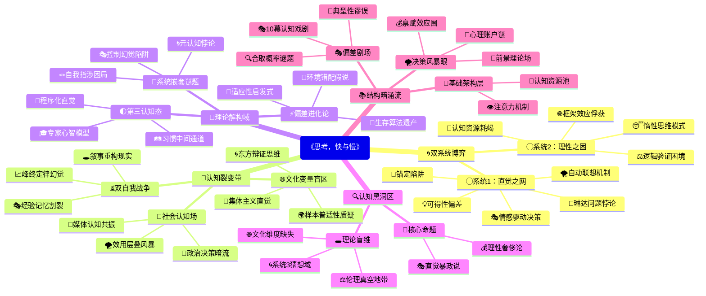

豆瓣链接：https://book.douban.com/subject/37270984/

# 深层解构

# 《思考，快与慢》深层解码：双系统框架下的认知地图与思维暗礁
## 一、基石：双系统理论——认知的阴阳太极
作者构建全书的核心支点，是对人类思维的二元划分：**系统1（快思考）与系统2（慢思考）**。这一划分如同认知世界的“阴阳”，构成理解人类决策的底层代码。
- **系统1的直觉霸权**：它是大脑的“默认程序”，依赖直觉、情感、记忆快速反应，如看到“2+2”立刻想到“4”。这种自动化处理让人类能快速应对日常环境，但也埋下认知偏差的种子，如锚定效应、可得性启发式等。书中通过“琳达问题”（人们更倾向于认为琳达是“银行出纳且女权主义者”而非单纯“银行出纳”），揭示系统1如何让我们陷入“合取谬误”。
- **系统2的理性困局**：作为“懒惰的掌控者”，它需要主动调用注意力和逻辑推理，如计算复杂数学题。但系统2常被系统1“劫持”，陷入“认知放松”状态，默认接受系统1的直觉判断。作者通过“锚定实验”（对非洲国家在联合国占比的估计受随机数字影响），证明系统2在系统1的直觉暗示面前多么脆弱。

**核心信念的悄然渗透**：作者反复强调，人类并非“理性人”，而是“直觉优先的有限理性者”。传统经济学的理性假设被彻底颠覆，行为经济学的大厦由此奠基。

## 二、边缘：思想曲线的隐秘延伸
### （一）被轻描淡写的“认知政治”
书中第13章提到的“效用层叠”（availability cascade），揭示了一个被主流认知科学忽视的维度：**认知偏差的社会放大机制**。
- 媒体报道→公众焦虑→更多报道的循环，本质是“注意力经济”与“情感传播”对风险认知的重构。例如新冠疫情初期，某些风险的媒体曝光度与实际危险程度可能脱节，导致资源分配错位。
- 这一洞见指向更深层命题：认知偏差不仅是个体大脑的产物，更是社会系统的衍生品。作者轻轻掠过的这一“边缘”，实则连接着传播学、政治学的交叉领域，可能改写我们对“理性决策”的社会环境认知。

### （二）被简化的“双自我悖论”
在“两个自我”（经验自我与记忆自我）的论述中，作者提出“峰终定律”（记忆由高峰和结束时的感受决定），但隐含着对“自我”本质的哲学叩问：
- 当我们用“记忆自我”构建人生故事时，是否在创造一种认知幻觉？经验自我的真实体验（如漫长的平淡时光）被记忆自我的“叙事偏好”所扭曲，这与文学中“叙事即真相”的哲学命题遥相呼应。
- 这一洞见若延伸，可能挑战“理性决策应基于真实体验”的前提——因为我们根本无法真正触及“经验自我”，只能通过记忆自我的叙事重构决策依据。

### （三）未被展开的“文化变量”
全书案例多基于西方样本（如美国大学生、以色列士兵），但作者未明确讨论：**不同文化背景下，双系统的运作是否存在差异？**
- 例如，集体主义文化中，系统1的直觉是否更依赖社会规范（如“他人会怎么看”）？东方辩证思维是否让系统2更擅长处理矛盾信息？这些问题若成立，将动摇“双系统理论具有普适性”的隐含假设。

## 三、暗流：未被审视的认知基石
### （一）“偏差”叙事的权力结构
作者将系统1的产物定义为“偏差”（如锚定、可得性），暗含一种“理性至上”的价值判断：
- 但“偏差”是否总是负面？在紧急情况下（如躲避危险），系统1的快速反应可能是生存优势。这种“偏差”与“适应性”的辩证关系，书中未深入探讨，实则挑战了“克服偏差=更优决策”的单向逻辑。
- 更深层的问题：判断“偏差”的标准，是否依赖于特定的社会目标（如经济效率）？若以“生存”“情感满足”为目标，某些“偏差”可能具有功能性。

### （二）“控制幻觉”的隐含前提
书中多处暗示“通过系统2训练可减少偏差”（如“事前验尸”法预判风险），但忽略了一个关键前提：**系统2本身是否足够独立于系统1？**
- 当我们用系统2反思系统1时，反思过程可能仍受系统1的直觉影响（如“我觉得自己足够理性”的元认知判断，可能是系统1的认知放松产物）。这种“自我指涉”的困境，类似于逻辑学中的“罗素悖论”，暗示人类理性的自我提升存在不可逾越的边界。

### （三）“决策”定义的局限性
全书聚焦“有意识的选择”（如购物、投资、政策制定），但**人类大部分行为是无意识的习惯驱动**（如每天走同一条路回家）。系统1与系统2的模型，是否足以解释“习惯”这种介于“快”与“慢”之间的认知状态？
- 例如，驾车熟练后，操作从系统2的刻意控制转为系统1的自动化流程，但又不同于纯粹的直觉反应（仍需部分注意力监控）。这种“第三状态”的存在，暗示双系统模型可能是一种简化的二分法，而非完整的认知光谱。

## 四、真相、角度与盲点：解码后的再思考
### （一）这本书真正在说什么？
表面是“双系统理论”，实则是对“人类理性边界”的系统性勘探。它通过解剖思维的自动化陷阱，告诉我们：**理性不是人类的默认设置，而是需要刻意维护的认知奢侈品**。每个决策背后，都是系统1的直觉冲动与系统2的理性挣扎的博弈场。

### （二）换个角度看：当“偏差”成为生存策略
若跳出“理性中心主义”，从进化心理学视角看，系统1的“偏差”可能是人类祖先在资源有限、时间紧迫的环境中演化出的“适应性启发式”。例如，“可得性偏差”（容易想起的事件被高估概率）可能帮助早期人类快速识别高频危险（如野兽出没）。现代社会的“偏差”之所以成为问题，是因为环境变化（信息爆炸、复杂决策）远超进化适应范围。这种视角转换，将“偏差”从“认知缺陷”重新定义为“演化遗产与现代环境的错配”。

### （三）作者可能没意识到的事
- **文化局限性**：双系统理论的普适性需接受跨文化验证，书中对“东方思维”的忽视，可能导致结论的片面性。
- **系统3的存在？**：在系统1与系统2之外，是否存在“系统3”——一种通过长期训练形成的、介于直觉与理性之间的“专家直觉”？如象棋大师的瞬间判断，既非纯粹系统1的直觉（依赖大量刻意练习），也非系统2的慢速推理。这种“程序化直觉”的机制，可能需要更复杂的认知模型解释。
- **伦理维度的缺失**：书中讨论“如何利用双系统理论影响他人决策”（如“框架效应”在营销中的应用），但未深入探讨其中的伦理风险——当商家、政客熟练运用认知偏差操纵选择时，个体的“自由意志”该何处安放？这指向行为经济学的伦理边界问题。

## 五、思想接力的下一棒：从解码到创造
阅读此书的终极价值，不是接受“双系统理论”的正确性，而是学会用“三重世界”的视角审视任何理论：
- 识别其基石（核心假设），警惕将模型等同于现实；
- 捕捉其边缘（未展开的可能性），让思想向未知延伸；
- 探测其暗流（隐含前提），在逻辑缝隙中发现新问题。
正如卡尼曼颠覆了传统经济学的理性假设，读者亦可带着这种解构精神，在双系统理论的基础上，构建更贴近真实世界的认知模型。毕竟，每一次对“已知”的解码，都是为了向“未知”更进一步。

# 章节内容
好的，根据您提供的书籍链接和相关信息，我将为您创作《思考，快与慢》的读书笔记，每章约200字，并按照章节顺序进行整理。

## 《思考，快与慢》读书笔记

### 第一部分 系统1，系统2

#### 第1章 一张愤怒的脸和一道乘法题

本章介绍了大脑的两个系统：系统1和系统2。系统1运行快速、无意识且依赖直觉，而系统2运行缓慢、有意识且需要逻辑分析。系统1负责日常决策，如识别情绪，而系统2则处理复杂问题，如计算。当系统1遇到难题时，会启动系统2。作者通过实验展示了系统2的局限性，如注意力有限，以及系统1在快速决策中的主导地位。理解这两个系统的运作模式是理解本书后续内容的基础。

#### 第2章 电影的主角与配角

本章深入探讨了系统2的注意力机制。瞳孔扩张是衡量大脑活动强度的一个指标，复杂的认知活动会消耗更多能量，导致瞳孔扩张。作者通过“看不见的大猩猩”实验，揭示了“注意力盲视”现象，即当我们专注于某事时，可能会忽略明显的事物。这表明我们的注意力是有限的，系统2在执行任务时会分配资源，但过度专注会导致我们错过其他重要信息。

#### 第3章 惰性思维与延迟满足的矛盾

本章探讨了系统2的“惰性”以及与延迟满足之间的关系。作者通过认知测试发现，人们倾向于使用系统1快速给出看似正确的答案，即使这些答案是错误的。同时，实验表明，能够抵制诱惑、延迟满足的人，通常在认知能力测试中表现更佳，更能有效利用系统2进行深入思考。这种自我控制能力与认知努力密切相关，需要克服系统1的冲动。

#### 第4章 联想的神奇力量

本章着重介绍了系统1的联想机制，它能迅速建立事物之间的联系，形成连贯的认知模式。启动效应是一种无意识的影响，例如，接触与金钱相关的词语会影响人们的行为。这种联想网络非常广泛，可以影响我们的情绪、态度和行为。作者指出，理解联想机制有助于我们理解直觉和偏见的来源。

#### 第5章 你的直觉有可能只是错觉

本章揭示了直觉的不可靠性，指出许多直觉实际上是基于记忆的错觉。易于提取的信息会让我们高估其重要性，从而产生认知偏差。作者通过研究发现，信息呈现方式、熟悉度和易读性都会影响我们对信息的信任度。因此，我们需要警惕那些看似“流畅”的信息，因为它们很可能只是错觉。

#### 第6章 意料之外与情理之中

本章探讨了系统1如何通过构建故事来理解世界，以及“常态理论”如何影响我们的判断。当我们遇到意外事件时，系统1会试图寻找合理的解释，使事件“正常化”。这种常态理论解释了为什么某些信息比其他信息更容易被记住，以及我们如何对事件进行因果推断。作者指出，我们对世界的理解很大程度上取决于我们构建的故事。

#### 第7章 字母“B”与数字“13”

本章讨论了语境如何影响我们的认知和判断。同样的符号，在不同的语境下会被解读为不同的含义。作者还提到了“光环效应”，即我们对一个人的总体印象会影响我们对其具体特质的评价。此外，作者强调了“眼见即为事实”的原则，指出系统1倾向于根据现有信息做出判断，而忽略潜在的证据。

#### 第8章 我们究竟是如何作出判断的？

本章深入研究了系统1如何进行快速判断，尤其是在缺乏完整信息的情况下。作者通过实验表明，人们可以通过观察照片来预测选举结果，这说明系统1能够迅速提取面部特征等信息，并进行判断。此外，本章还介绍了强度匹配的概念，即系统1会将不同维度的信息进行转换，从而进行直觉判断。

#### 第9章 目标问题与启发性问题形影不离

本章介绍了启发式判断的概念，即当我们面对复杂问题时，系统1会用一个简单的问题来替代它。作者将原始问题称为“目标问题”，替代问题称为“启发性问题”。例如，当我们被问及某人的幸福程度时，我们可能会用“他最近的心情如何”来替代。作者还提到了“情感启发式”，即情绪会影响我们的判断和决策。

### 第二部分 启发法与偏见

#### 第10章 大数法则与小数定律

本章讨论了人们对统计规律的直觉偏差，特别是对大数法则和小数定律的误解。人们常常错误地认为小样本也能反映总体特征，从而得出错误的结论。作者指出，这种对随机性的误解源于系统1的偏见，即寻求模式和因果关系，即使在随机事件中也是如此。因此，在进行统计推断时，我们需要依赖严谨的统计方法，而不是直觉。

#### 第11章 锚定效应在生活中随处可见

本章介绍了锚定效应，即人们在进行估算时，会受到先前接触到的数字（锚定值）的影响，即使这个数字与估算问题无关。作者通过实验证明，锚定效应普遍存在，且人们通常意识不到它的影响。锚定效应可以被商家利用来影响消费者的购买决策，因此，我们需要警惕锚定效应，尽量独立思考。

#### 第12章 科学地利用可得性启发法

本章探讨了可得性启发法，即人们倾向于根据容易想到的信息来判断事件的概率。容易想到的事件通常是近期发生的、生动的或引人注目的事件。作者指出，可得性启发法会导致认知偏差，例如，人们会高估飞机失事的概率，因为这类事件更容易被媒体报道。为了减少可得性偏见，我们需要主动寻找不同的信息来源，避免过度依赖容易获得的信息。

#### 第13章 焦虑情绪与风险政策的设计

本章讨论了情绪如何影响风险评估和决策。作者指出，焦虑情绪会使人们更加关注潜在的风险，从而做出更保守的决策。同时，作者还探讨了如何利用心理学原理来设计更有效的风险政策，例如，通过强调风险的可控性来降低人们的焦虑感。理解情绪在风险决策中的作用，有助于我们做出更明智的选择。

#### 第14章 猜一下，汤姆的专业是什么？

本章介绍了典型性启发法，即人们倾向于根据事物与典型案例的相似程度来判断其概率。作者通过“汤姆问题”展示了典型性启发法如何导致认知偏差，人们常常忽略基础比率（prior probability），而过度依赖典型性信息。为了减少典型性偏见，我们需要结合基础比率和逻辑分析，而不是仅仅依赖直觉。

#### 第15章 琳达问题的社会效应

本章继续探讨了典型性启发法，并通过“琳达问题”揭示了人们在判断概率时的逻辑错误。人们倾向于认为，描述更详细、更具代表性的事件比简单事件更有可能发生，即使这违反了概率论的基本原则。作者指出，这种“合取谬误”源于系统1的偏见，即寻求连贯性和代表性。

#### 第16章 因果关系比统计学信息更具说服力

本章强调了因果关系在人们认知和判断中的重要性。作者指出，人们更容易接受基于因果关系的信息，而忽略统计学信息。例如，人们更愿意相信一个关于个体经历的故事，而不是一个基于大量数据的统计报告。这种对因果关系的偏好会影响我们的决策，导致我们做出不明智的选择。

#### 第17章 所有表现都会回归平均值

本章介绍了回归平均值现象，即极端值往往会向平均值回归。作者通过例子说明，表扬或批评对后续表现的影响常常被误解为因果关系，实际上只是回归平均值的结果。理解回归平均值现象有助于我们避免对随机事件做出错误的因果推断。

#### 第18章 如何让直觉性预测更恰当有效？

本章探讨了如何提高直觉性预测的准确性。作者建议，在进行预测时，应该先估计一个基准值，然后根据具体情况进行调整。同时，作者还强调了修正直觉性预测的重要性，避免过度自信和乐观偏见。通过结合统计数据和理性分析，我们可以做出更准确的预测。

### 第三部分 过度自信与决策错误

#### 第19章 “知道”的错觉

本章探讨了过度自信现象，即人们常常高估自己对事物的了解程度。作者指出，“后见之明”会使我们认为过去的事情是显而易见的，从而产生“知道”的错觉。这种过度自信会导致我们低估风险，做出错误的决策。作者还探讨了企业管理中存在的“知道”的错觉，指出成功企业常常被过度解读，而忽略了运气等因素。

#### 第20章 未来是不可预测的

本章进一步探讨了预测的局限性。作者指出，许多专家预测的准确性并不比随机猜测高多少。作者通过研究股票市场和政治事件，揭示了预测的不可靠性。他认为，过度自信和对自身能力的错误认知是导致预测失败的重要原因。因此，在面对未来时，我们应该保持谦逊，认识到不确定性的存在。

#### 第21章 直觉判断与公式运算，孰优孰劣？

本章比较了直觉判断和公式运算的优劣。作者通过研究发现，在许多情况下，简单的公式运算比专家的直觉判断更准确。他认为，公式运算能够消除主观偏见，提供更客观的评估。然而，作者也强调，直觉在某些情况下仍然有价值，尤其是在经验丰富的专家进行判断时。

#### 第22章 什么时候可以相信专家的直觉？

本章探讨了专家直觉的可靠性。作者认为，只有在环境具有可预测性且专家具有丰富的经验时，专家的直觉才是可靠的。他通过例子说明，专家需要经过长时间的训练和实践，才能形成准确的直觉。此外，作者还强调了评估直觉正确性的重要性，避免盲目信任专家。

#### 第23章 努力养成采纳外部意见的决策习惯

本章强调了采纳外部意见的重要性。作者指出，人们通常更倾向于相信自己的内部意见，而忽略外部信息。这种“内部视角”会导致“规划谬误”，即人们总是过于乐观地估计完成任务所需的时间和资源。为了减少决策错误，我们需要主动寻求外部意见，并认真听取不同的观点。

#### 第24章 乐观主义是一柄双刃剑

本章探讨了乐观主义的双重影响。作者指出，乐观主义者通常更自信、更有活力，但也更容易低估风险，做出冒险的决策。乐观偏见会导致过度投资、创业失败等问题。为了避免乐观主义的负面影响，我们需要保持理性，客观评估风险，并采取适当的预防措施。作者还介绍了“事前验尸”方法，帮助团队成员识别潜在的问题。

### 第四部分 选择与风险

#### 第25章 事关风险与财富的抉择

本章探讨了人们在面对风险和财富时的决策行为。作者回顾了伯努利的财富效用理论，并指出该理论的局限性，即无法解释人们对损失的厌恶。作者通过实验证明，人们对损失的反应比对收益的反应更强烈，这种“损失厌恶”是影响风险决策的重要因素。

#### 第26章 更人性化的前景理论

本章介绍了前景理论，该理论是对伯努利财富效应理论的改进。前景理论认为，人们的决策取决于他们对收益和损失的评估，而不是绝对财富水平。作者强调了“参照点”的重要性，即人们会根据参照点来判断收益和损失。此外，前景理论还解释了损失厌恶、概率权重等现象。

#### 第27章 禀赋效应与市场交易

本章介绍了禀赋效应，即人们对自己拥有的东西赋予更高的价值。作者通过实验证明，人们不愿意出售自己拥有的物品，即使这些物品的市场价值很高。禀赋效应解释了为什么人们不愿意改变现状，以及为什么市场交易有时会受到阻碍。

#### 第28章 公平性——经济交易的参照点

本章探讨了公平性在经济交易中的作用。作者指出，人们对公平的理解受到参照点的影响。例如，人们认为商家在需求旺盛时提高价格是不公平的。公平性考虑会影响人们的消费行为和市场价格。

#### 第29章 对结果可能性的权衡

本章讨论了人们如何对结果的可能性进行权衡。作者介绍了“可能性效应”和“确定性效应”，即人们对小概率事件和确定性事件的反应更为强烈。作者还提到了“阿莱斯悖论”，揭示了人们在面对不同概率的选项时，常常做出不一致的选择。

#### 第30章 被过分关注的罕见事件

本章探讨了罕见事件如何影响人们的决策。作者指出，生动的、引人注目的罕见事件更容易引起人们的关注，从而影响人们对风险的评估。作者通过例子说明，媒体报道和个人经历会影响人们对罕见事件的认知，导致人们做出不理性的决策。

#### 第31章 能带来长远收益的风险政策

本章讨论了如何制定更有效的风险政策。作者建议，采用“宽框架”来评估风险，即将多个决策合并考虑，而不是单独评估每个决策。这种方法可以减少风险厌恶的影响，使人们做出更理性的选择。作者还强调了长期投资的重要性，避免过度关注短期波动。

#### 第32章 心理账户是如何影响我们的选择的？

本章介绍了心理账户的概念，即人们会将不同的收入和支出分配到不同的心理账户中。作者通过例子说明，心理账户会影响人们的消费行为和投资决策。例如，人们更愿意花掉“意外之财”，而不是动用储蓄账户中的钱。

#### 第33章 评估结果的逆转

本章探讨了评估模式如何影响人们的偏好。作者介绍了“联合评估”和“单独评估”两种评估模式，指出人们在不同的评估模式下，可能会做出相反的选择。这种“偏好逆转”现象揭示了人们在评估事物时存在的认知偏差。

#### 第34章 善用框架效应，让生活更美好

本章总结了框架效应，即信息的呈现方式会影响人们的判断和决策。作者指出，通过改变信息的框架，可以影响人们的选择，例如，强调手术的存活率比强调死亡率更容易被接受。作者建议，善用框架效应，可以帮助我们做出更明智的决策，并改善人际沟通。

希望这份读书笔记对您有所帮助！

Citations:
[1] https://book.douban.com/subject/10785583/

---
来自 Perplexity 的回答: pplx.ai/share