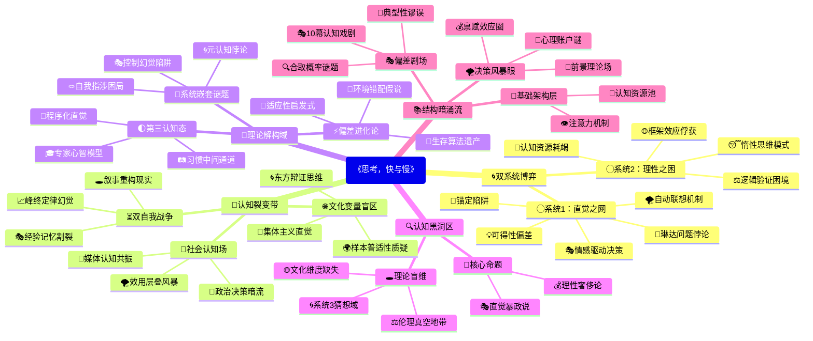

豆瓣链接：https://book.douban.com/subject/37270984/

# 深层解构

# 《思考，快与慢》深层解码：双系统框架下的认知地图与思维暗礁
## 一、基石：双系统理论——认知的阴阳太极
作者构建全书的核心支点，是对人类思维的二元划分：**系统1（快思考）与系统2（慢思考）**。这一划分如同认知世界的“阴阳”，构成理解人类决策的底层代码。
- **系统1的直觉霸权**：它是大脑的“默认程序”，依赖直觉、情感、记忆快速反应，如看到“2+2”立刻想到“4”。这种自动化处理让人类能快速应对日常环境，但也埋下认知偏差的种子，如锚定效应、可得性启发式等。书中通过“琳达问题”（人们更倾向于认为琳达是“银行出纳且女权主义者”而非单纯“银行出纳”），揭示系统1如何让我们陷入“合取谬误”。
- **系统2的理性困局**：作为“懒惰的掌控者”，它需要主动调用注意力和逻辑推理，如计算复杂数学题。但系统2常被系统1“劫持”，陷入“认知放松”状态，默认接受系统1的直觉判断。作者通过“锚定实验”（对非洲国家在联合国占比的估计受随机数字影响），证明系统2在系统1的直觉暗示面前多么脆弱。

**核心信念的悄然渗透**：作者反复强调，人类并非“理性人”，而是“直觉优先的有限理性者”。传统经济学的理性假设被彻底颠覆，行为经济学的大厦由此奠基。

## 二、边缘：思想曲线的隐秘延伸
### （一）被轻描淡写的“认知政治”
书中第13章提到的“效用层叠”（availability cascade），揭示了一个被主流认知科学忽视的维度：**认知偏差的社会放大机制**。
- 媒体报道→公众焦虑→更多报道的循环，本质是“注意力经济”与“情感传播”对风险认知的重构。例如新冠疫情初期，某些风险的媒体曝光度与实际危险程度可能脱节，导致资源分配错位。
- 这一洞见指向更深层命题：认知偏差不仅是个体大脑的产物，更是社会系统的衍生品。作者轻轻掠过的这一“边缘”，实则连接着传播学、政治学的交叉领域，可能改写我们对“理性决策”的社会环境认知。

### （二）被简化的“双自我悖论”
在“两个自我”（经验自我与记忆自我）的论述中，作者提出“峰终定律”（记忆由高峰和结束时的感受决定），但隐含着对“自我”本质的哲学叩问：
- 当我们用“记忆自我”构建人生故事时，是否在创造一种认知幻觉？经验自我的真实体验（如漫长的平淡时光）被记忆自我的“叙事偏好”所扭曲，这与文学中“叙事即真相”的哲学命题遥相呼应。
- 这一洞见若延伸，可能挑战“理性决策应基于真实体验”的前提——因为我们根本无法真正触及“经验自我”，只能通过记忆自我的叙事重构决策依据。

### （三）未被展开的“文化变量”
全书案例多基于西方样本（如美国大学生、以色列士兵），但作者未明确讨论：**不同文化背景下，双系统的运作是否存在差异？**
- 例如，集体主义文化中，系统1的直觉是否更依赖社会规范（如“他人会怎么看”）？东方辩证思维是否让系统2更擅长处理矛盾信息？这些问题若成立，将动摇“双系统理论具有普适性”的隐含假设。

## 三、暗流：未被审视的认知基石
### （一）“偏差”叙事的权力结构
作者将系统1的产物定义为“偏差”（如锚定、可得性），暗含一种“理性至上”的价值判断：
- 但“偏差”是否总是负面？在紧急情况下（如躲避危险），系统1的快速反应可能是生存优势。这种“偏差”与“适应性”的辩证关系，书中未深入探讨，实则挑战了“克服偏差=更优决策”的单向逻辑。
- 更深层的问题：判断“偏差”的标准，是否依赖于特定的社会目标（如经济效率）？若以“生存”“情感满足”为目标，某些“偏差”可能具有功能性。

### （二）“控制幻觉”的隐含前提
书中多处暗示“通过系统2训练可减少偏差”（如“事前验尸”法预判风险），但忽略了一个关键前提：**系统2本身是否足够独立于系统1？**
- 当我们用系统2反思系统1时，反思过程可能仍受系统1的直觉影响（如“我觉得自己足够理性”的元认知判断，可能是系统1的认知放松产物）。这种“自我指涉”的困境，类似于逻辑学中的“罗素悖论”，暗示人类理性的自我提升存在不可逾越的边界。

### （三）“决策”定义的局限性
全书聚焦“有意识的选择”（如购物、投资、政策制定），但**人类大部分行为是无意识的习惯驱动**（如每天走同一条路回家）。系统1与系统2的模型，是否足以解释“习惯”这种介于“快”与“慢”之间的认知状态？
- 例如，驾车熟练后，操作从系统2的刻意控制转为系统1的自动化流程，但又不同于纯粹的直觉反应（仍需部分注意力监控）。这种“第三状态”的存在，暗示双系统模型可能是一种简化的二分法，而非完整的认知光谱。

## 四、真相、角度与盲点：解码后的再思考
### （一）这本书真正在说什么？
表面是“双系统理论”，实则是对“人类理性边界”的系统性勘探。它通过解剖思维的自动化陷阱，告诉我们：**理性不是人类的默认设置，而是需要刻意维护的认知奢侈品**。每个决策背后，都是系统1的直觉冲动与系统2的理性挣扎的博弈场。

### （二）换个角度看：当“偏差”成为生存策略
若跳出“理性中心主义”，从进化心理学视角看，系统1的“偏差”可能是人类祖先在资源有限、时间紧迫的环境中演化出的“适应性启发式”。例如，“可得性偏差”（容易想起的事件被高估概率）可能帮助早期人类快速识别高频危险（如野兽出没）。现代社会的“偏差”之所以成为问题，是因为环境变化（信息爆炸、复杂决策）远超进化适应范围。这种视角转换，将“偏差”从“认知缺陷”重新定义为“演化遗产与现代环境的错配”。

### （三）作者可能没意识到的事
- **文化局限性**：双系统理论的普适性需接受跨文化验证，书中对“东方思维”的忽视，可能导致结论的片面性。
- **系统3的存在？**：在系统1与系统2之外，是否存在“系统3”——一种通过长期训练形成的、介于直觉与理性之间的“专家直觉”？如象棋大师的瞬间判断，既非纯粹系统1的直觉（依赖大量刻意练习），也非系统2的慢速推理。这种“程序化直觉”的机制，可能需要更复杂的认知模型解释。
- **伦理维度的缺失**：书中讨论“如何利用双系统理论影响他人决策”（如“框架效应”在营销中的应用），但未深入探讨其中的伦理风险——当商家、政客熟练运用认知偏差操纵选择时，个体的“自由意志”该何处安放？这指向行为经济学的伦理边界问题。

## 五、思想接力的下一棒：从解码到创造
阅读此书的终极价值，不是接受“双系统理论”的正确性，而是学会用“三重世界”的视角审视任何理论：
- 识别其基石（核心假设），警惕将模型等同于现实；
- 捕捉其边缘（未展开的可能性），让思想向未知延伸；
- 探测其暗流（隐含前提），在逻辑缝隙中发现新问题。
正如卡尼曼颠覆了传统经济学的理性假设，读者亦可带着这种解构精神，在双系统理论的基础上，构建更贴近真实世界的认知模型。毕竟，每一次对“已知”的解码，都是为了向“未知”更进一步。

# 章节内容
---

**《思考，快与慢》章节总结**

## 第一部分 系统1，系统2

**第1章 两个系统的特征 (The Characters of the Story)**

本章开篇，丹尼尔·卡尼曼引入了他全书的核心框架：**我们的大脑中存在两种思考模式，他称之为系统1和系统2**。这不是物理上大脑的两个部分，而是两种功能不同的“角色”或过程。

**系统1**的运作是**快速、自动、直觉、毫不费力、且通常是无意识的**。它依赖联想、经验和情感来迅速做出判断。例如，我们能立刻知道2+2=4，能从一个人的表情中读出愤怒，能理解简单的句子，或者在听到巨大声响时立刻转头。这些都是系统1在工作。卡尼曼强调，系统1是我们日常生活中绝大多数思考和行为的来源，它使得我们能够高效地处理海量信息并迅速做出反应。它是我们演化适应的产物，帮助我们在复杂环境中生存。

**系统2**的运作则是**缓慢、刻意、需要付出努力、且是有意识的逻辑思考**。它负责复杂的计算、比较、选择和自我控制。例如，计算17×24，刻意在一大群人中寻找某个特定的人，检查一个复杂论证的有效性，或者抵制诱惑。系统2的启动需要专注力，并且它的“认知资源”是有限的，容易感到疲劳。当我们说“集中注意力”时，通常指的是启动系统2。

卡尼曼指出，**这两个系统之间存在一种分工与合作，但并非总是和谐**。理想情况下，系统1提供快速的印象、直觉和意图，而系统2则在必要时进行审查、修正和控制。然而，**系统2通常是“懒惰”的**，它倾向于接受系统1提供的简单答案，除非遇到困难或有强烈动机才会介入。这种懒惰是系统2的一个关键特征，也是许多认知偏差产生的原因。

作者通过一系列生动的例子（如著名的“大猩猩实验”——我们专注于某事时会忽略显而易见的其他事物）来阐释系统1的自动性和系统2的专注性是如何运作的，以及它们各自的局限。他强调，**我们常常高估了自己对思维的掌控程度，实际上系统1在幕后主导了许多我们以为是理性思考的结果。** 理解这两个系统的特性和它们之间的互动，是理解后续章节中讨论的各种认知偏差和决策缺陷的基础。本章为读者勾勒出了这两个“思维主角”的基本面貌，为后续深入探讨它们的互动模式和影响奠定了基础。

**第2章 注意力和努力 (Attention and Effort)**

在这一章中，卡尼曼深入探讨了**系统2的核心特征：它需要注意力和认知努力**。他强调，系统2的运作与我们通常所说的“思考”紧密相关，而这种思考是消耗资源的。

卡尼曼通过描述瞳孔大小的变化与认知努力程度之间的关系来阐释这一点。实验表明，当人们进行更复杂的脑力劳动时（例如，进行“加1”或“加3”的心算任务，后者更难），他们的瞳孔会明显放大，这反映了大脑正在调动更多的认知资源。**瞳孔的变化成为了衡量心力投入的一个可靠指标。**

本章的核心论点之一是，**我们拥有的注意力是有限的资源池**。当系统2投入一项需要高度专注的任务时，它会“吸走”大部分可用的注意力，使得我们对其他事物的感知能力下降。这就是为什么在进行复杂的思考时，我们可能不会注意到周围发生的事情（呼应了第一章提到的“看不见的大猩猩”实验）。卡尼曼用“认知负荷”（cognitive load）来描述这种状态。当认知负荷过高时，系统2的运作效率会降低，甚至可能完全“罢工”。

卡尼曼还讨论了**“心流”（flow）**的概念，这是一种由心理学家米哈里·契克森米哈赖提出的状态，指个体完全沉浸在某种活动中，感觉不到时间的流逝，并且伴随着高度的愉悦感和充实感。在心流状态下，人们能够长时间保持高度专注，而不会感到认知上的疲劳。这似乎与系统2的努力性有些矛盾，但卡尼曼解释说，心流状态下的专注力分配是高效的，没有不必要的资源浪费，也没有内心冲突。

此外，本章还探讨了**自我控制与认知努力之间的关系**。自我控制，如抵制诱惑、克服冲动，同样需要系统2的介入和努力。卡尼曼引用了罗伊·鲍迈斯特等人关于“自我损耗”（ego depletion）的研究，指出**意志力就像一种有限的认知资源，使用后会暂时耗尽**。例如，如果一个人刚刚通过努力克制了自己不吃诱人的巧克力蛋糕，那么他在接下来的需要认知努力或自我控制的任务中，表现可能会更差。这表明，不同类型的认知努力（如逻辑推理、注意力集中、情绪控制）似乎都从同一个有限的资源池中提取能量。

卡尼曼总结道，**系统2的运作是费力的，它在我们的“认知预算”中占据了重要份额**。理解注意力的有限性和努力的消耗性，对于我们如何管理自己的思维、提高决策质量以及避免因认知疲劳而犯错至关重要。他暗示，因为系统2的运作成本高昂，所以我们会本能地倾向于依赖更轻松的系统1。

**第3章 懒惰的控制者 (The Lazy Controller)**

本章深入探讨了系统2的一个关键特性——它的**“懒惰”**，以及这种懒惰如何导致我们依赖系统1，从而产生判断失误。卡尼曼明确指出，**尽管系统2有能力进行复杂的逻辑思考和审慎的判断，但它常常选择“走捷径”，或者干脆不介入**，让更为迅速和自动的系统1来主导。

卡尼曼通过经典的“球拍和球”问题（一个球拍和一个球总共1.10美元，球拍比球贵1美元，问球多少钱？）来说明这一点。许多人（包括一些高智商人群）会直觉地回答0.10美元，这是系统1迅速给出的答案。而正确的答案是0.05美元，这需要系统2启动，进行简单的代数运算。这个例子生动地展示了**系统1如何提供一个看似合理但错误的答案，而懒惰的系统2未能及时进行核查和纠正**。

作者认为，**持续的警觉和认知努力对大多数人来说是不现实的，甚至是令人不悦的**。因此，系统2倾向于将控制权交给系统1，除非它检测到明显的错误或面临一项它知道自己必须处理的特定任务。这种“认知上的轻松”是系统1的主要吸引力，也是系统2“懒惰”的根源。

卡尼曼进一步讨论了**“认知放松”（cognitive ease）与“认知紧张”（cognitive strain）**的概念。当事物易于理解、熟悉、或以清晰的方式呈现时，我们会体验到认知放松，此时系统1更占主导，我们更倾向于相信所见所闻，感觉良好且不加批判。相反，当面临模糊、新奇、复杂或难以辨认的信息时，我们会体验到认知紧张，这会促使系统2更警觉地介入，进行更深入的分析和怀疑。例如，用更清晰的字体印刷的陈述比用模糊字体印刷的陈述更容易被认为是真实的。

本章还提到了智力、理性和系统2投入程度之间的关系。虽然高智商的人通常拥有更强的系统2能力，但这并不意味着他们总是更有效地使用它。**即使是聪明人，如果他们的系统2处于“懒惰”状态，也同样容易受到认知偏差的影响**。卡尼曼引用了基思·斯坦诺维奇（Keith Stanovich）关于“理性”与“智力”区分的观点，强调理性思维——即有效运用系统2进行批判性思考和避免偏差——与单纯的智力（如IQ测试所测量的）并非完全等同。

卡尼曼通过这些论述，强调了**系统2作为“控制者”的懒惰是人类思维的一个根本特征**。这种懒惰使得我们容易受到系统1产生的直觉和偏见的影响，即使这些直觉可能是错误的。他提醒读者，要意识到这种内在的倾向，并在重要决策中主动促使系统2参与进来，进行更审慎的思考，尽管这需要额外的认知努力。理解这种“懒惰的控制者”的存在，是避免许多常见判断错误的关键一步。

**第4章 联想的机器 (The Associative Machine)**

在这一章中，卡尼曼聚焦于**系统1的核心运作机制——联想激活（associative activation）**。他将系统1描绘成一台庞大的联想机器，能够迅速、自动地在各种概念、记忆、情绪和行为之间建立联系。

卡尼曼解释说，当一个想法（或词语、图像、事件）被激活时，它并不会孤立存在，而是会**像涟漪一样在巨大的联想网络中扩散开来，激活其他相关的想法**。这种激活是自动发生的，我们通常意识不到这个过程。例如，当我们看到“香蕉”这个词时，可能会不由自主地联想到“黄色”、“水果”、“猴子”甚至“呕吐”（如果之前有过不愉快的经历）。这些联想的强度和范围因人而异，取决于个人的经验和当前的语境。

这个联想过程的一个重要特性是**“一致性”或“连贯性”**。系统1努力构建一个连贯的故事，即使信息是零散的或不完整的。它会利用已有的联想来填补空白，并倾向于抑制那些与当前主流叙事不一致的想法。**这种追求连贯性的机制，使得系统1能够快速形成印象和判断，但同时也可能导致它忽略矛盾信息，过早下结论。**

卡尼曼引入了**“启动效应”（priming effect）**作为联想激活的有力证据。启动效应是指，接触到一个刺激（如一个词语、图像或想法）会影响个体对后续刺激的反应。例如，如果一个人先接触到与“年老”相关的词语（如佛罗里达、健忘、秃顶、灰色、皱纹），即使这些词语没有直接提到“缓慢”，他们随后在走廊里行走的速度也会不自觉地变慢。同样，如果被启动了“金钱”的概念，人们在后续任务中可能会表现得更自私、更独立。这些实验表明，**我们的行为和判断可以被我们甚至没有意识到的微妙线索所影响，这些线索通过激活相关的联想网络来发挥作用。**

作者强调，这种联想激活不仅仅是概念上的，它还可以**影响我们的情绪、面部表情甚至生理反应**。例如，被要求做出微笑表情的人，即使他们并没有感到快乐，也会更容易感知到积极的情绪，并对事物做出更积极的评价（面部反馈假说）。这表明身体状态和心理状态之间存在双向的联想联系。

卡尼曼指出，**系统1的联想机制是其力量的源泉，也是其许多错误的根源**。它使得我们能够快速理解世界，形成预期，并对环境做出适应性反应。然而，它也容易受到无关信息的影响，容易形成刻板印象，并且在构建连贯故事时可能会牺牲准确性。理解这台“联想的机器”是如何工作的，对于识别和抵制那些由无意识联想引发的偏见至关重要。卡尼曼提醒我们，虽然我们无法完全控制系统1的联想过程，但我们可以通过培养系统2的警觉性来审视和修正系统1的输出。

**第5章 认知放松度 (Cognitive Ease)**

本章深入探讨了“认知放松度”（Cognitive Ease）这一概念，它是系统1运作的一个重要调节器，并深刻影响着我们的判断和决策。**认知放松度指的是我们处理信息时感觉到的轻松或困难的程度。**

卡尼曼指出，多种因素可以导致认知放松：**重复的经验、清晰的呈现方式、被启动的想法（primed idea）、以及良好的心情等**。当这些因素存在时，我们会体验到认知放松。相反，新奇的、模糊的、未被启动的或令人心情不佳的信息则会引发“认知紧张”（Cognitive Strain）。

认知放松度与系统1和系统2的互动密切相关。**当我们处于认知放松状态时，系统1更占主导地位，我们倾向于感到舒适、熟悉、感觉良好，并且更容易相信自己所见所闻的真实性。** 这时，系统2的警觉性会降低，不太可能介入进行批判性分析。卡尼曼称这种状态为“舒服的糊涂”。例如，一个用清晰字体、高质量纸张印刷的陈述，仅仅因为其呈现方式的“轻松”，就更容易被人们判断为是真实的，即使其内容并无依据。

相反，**认知紧张会触发系统2的警觉**。当我们遇到难以辨认的字迹、复杂的表达或不熟悉的概念时，系统2会被调动起来，进行更深入、更分析性的思考。这种紧张感是一个信号，表明当前情境可能需要更多的认知努力和审慎判断。例如，有研究表明，用稍微难以阅读的字体呈现问题，反而能提高学生解决这些问题的正确率，因为认知紧张促使他们更仔细地思考。

卡尼曼通过一系列实验和例子阐释了认知放松度的影响：
*   **熟悉效应/曝光效应（Mere Exposure Effect）**：仅仅因为重复接触某个刺激（如一个词语、一张脸、一个符号），我们就会对其产生更多的好感。这种熟悉感带来了认知放松，从而转化为积极的情感。
*   **判断真实性**：如前所述，信息呈现的清晰度和熟悉度会影响我们对其真实性的判断。系统1偏爱连贯和轻松的故事。
*   **创造力与直觉**：认知放松度也与创造性思维和直觉判断有关。在心情愉悦（一种认知放松的状态）时，人们的直觉判断往往更准确，也更容易产生创造性的联想。卡尼曼提到了“远隔联想测验”（Remote Associates Test, RAT），表明好心情能增强这类直觉性联想能力。

作者强调，**认知放松度本身是一种来自系统1的信号，它告诉我们事情进展顺利，不需要额外的努力。** 然而，这种信号并不总是可靠的。我们可能会因为表面的流畅性而错误地判断信息的真实性或价值。营销人员和宣传者常常会有意无意地利用认知放松的原理来影响我们的偏好和信念，例如通过重复广告、使用简洁明了的口号等。

卡尼曼的核心观点是，**理解认知放松度的运作机制，可以帮助我们识别那些仅仅因为“感觉对”就被我们接受的想法或判断，并促使我们在必要时主动启动系统2进行更严格的审查。** 我们需要意识到，一个想法的“轻松感”并不等同于它的“正确性”。

**第6章 常态、惊奇与原因 (Norms, Surprises, and Causes)**

在这一章中，卡尼曼探讨了系统1如何构建和维持我们对世界的“常态”感知，以及它如何处理“惊奇”事件，并本能地寻找因果解释。

首先，卡尼曼指出，**系统1的核心功能之一是维护一个关于我们个人世界中什么是正常的模型**。这个模型包含了我们对各种情境、事件和行为的预期。这些预期是基于过去的经验和联想学习形成的。当发生的事情符合这个“常态”模型时，系统1会平稳运行，我们不会感到特别的意外。例如，我们预期在餐厅里会有人点餐，在图书馆里人们会保持安静。

然而，当发生的事情**偏离了我们的“常态”预期时，就会产生“惊奇”感**。惊奇的程度取决于事件偏离常态的幅度。卡尼曼区分了两种类型的惊奇：
1.  **主动预期落空**：例如，你明确预期某事会发生（比如门铃响了，你预期是快递员），结果却不是。
2.  **被动预期违反**：某些事件本身并不在你的主动预期之内，但它们的发生仍然让你感到惊讶，因为它们不符合你对世界如何运作的更广泛的、潜在的理解。例如，看到一只会说话的狗。

**系统1对惊奇事件的反应是迅速更新其“常态”模型**。一旦一个令人惊讶的事件发生过一次或几次，它就可能不再那么令人惊讶，因为它被整合进了新的常态认知中。例如，第一次在新闻中看到某个罕见现象可能会很惊讶，但如果频繁报道，它就会变得“见怪不怪”。

本章的另一个核心论点是**系统1具有强烈的“因果解释”倾向**。当发生不寻常的事件时，尤其是当两个不寻常的事件几乎同时发生时，系统1会**自动地、毫不费力地试图在它们之间建立因果联系**，即使这种联系可能并不存在。例如，如果股市在一个名人去世的当天大跌，人们很可能会不自觉地寻找两者之间的联系。

卡尼曼强调，**这种对因果关系的渴求是系统1构建连贯故事的一部分**。它使得世界看起来更有序、更可预测。然而，这种倾向也容易导致我们**在随机事件中看到模式，或者错误地将相关性归因为因果性**。心理学家保罗·布卢姆（Paul Bloom）认为，我们天生就倾向于将事物区分为具有意图的行动者（agents）和物理客体，并且倾向于从意图的角度来理解行动者的行为，这进一步强化了我们的因果推断。

卡尼曼引用了比利时心理学家阿尔伯特·米切特（Albert Michotte）的实验，这些实验通过简单的几何图形运动，就能让人产生强烈的因果感知（例如，一个方块“撞击”另一个方块，导致后者“移动”）。这表明，**我们对因果关系的感知是直觉性的，是系统1的产物，而不是系统2深思熟虑的结果**。

总而言之，系统1通过不断更新“常态”模型来理解世界，对偏离常态的事件做出反应，并本能地为这些事件寻找因果解释。这种机制使得我们能够快速适应环境，并形成对世界的连贯理解。但是，它也使我们容易在缺乏充分证据的情况下过早下结论，尤其是在归因因果关系时。卡尼曼提醒我们，**要警惕系统1这种自动寻找原因的倾向，特别是在处理复杂或统计性现象时，应更多地依赖系统2进行审慎的分析。**

**第7章 仓促的判断机制 (A Machine for Jumping to Conclusions)**

本章集中讨论了系统1的一个关键特征：**它倾向于在信息不充分的情况下迅速形成结论，即“仓促下结论”（jumping to conclusions）**。这种机制虽然在很多情况下能提高效率，但也常常导致判断失误。

卡尼曼指出，系统1运作的核心原则是**“眼见即为事实”（What You See Is All There Is, WYSIATI）**。这意味着系统1主要依赖当前手头可获得的信息来构建一个尽可能连贯的故事，而**往往忽略了那些缺失的、但可能至关重要的信息**。系统1不会主动去寻找它不知道的信息，它满足于用现有的信息碎片编织出一个解释。

这种“眼见即为事实”的倾向导致了几个重要的认知偏差：
1.  **过度自信（Overconfidence）**：由于系统1只关注已知信息并构建了一个连贯的故事，它会让我们对基于这些有限信息做出的判断感到异常自信。我们很少会考虑到那些我们不知道的事情可能会如何改变我们的结论。**故事的连贯性比信息的完整性和质量更能影响我们的自信程度。**
2.  **框架效应（Framing Effects）**：同一信息的不同呈现方式（框架）会显著影响我们的判断和决策，因为不同的框架会凸显信息的不同方面，从而改变系统1“看到”的东西。例如，说某种手术“有90%的存活率”比说它“有10%的死亡率”更容易被接受，尽管两者在逻辑上是等价的。
3.  **比率忽略/基础概率忽略（Base-Rate Neglect）**：当我们面对具体的、生动的个案信息时，系统1倾向于过分关注这些个案信息，而忽略了更广泛的、统计性的基础概率信息。例如，如果描述一个人非常害羞、有条理，人们更可能判断他是图书管理员而不是农民，即使农民的数量远多于图书管理员。个案的鲜活性压倒了统计数据。

卡尼曼强调，**系统1追求的是认知上的连贯性和舒适感，而不是逻辑上的严谨性和统计上的准确性**。它倾向于用一个简单、具体、有因果关系的故事来解释事件，即使这个故事是建立在不完整甚至错误的证据之上。

为了避免仓促下结论，理论上我们需要启动系统2进行更审慎的评估，考虑其他可能性，寻找缺失的信息。然而，正如前面章节所讨论的，系统2是懒惰的，并且在认知放松的状态下，系统1的结论往往会不加审查地被接受。

卡尼曼通过一系列例子（如对一个只见过几次面的人的快速印象判断、对一个复杂问题的草率回答）来说明这种仓促下结论的机制是如何运作的。他指出，**这种机制在进化上是有利的，因为它允许我们快速做出反应**，在许多日常情境下是有效的。例如，看到一个模糊的影子迅速判断为危险并逃跑，可能比仔细分析后再行动更有生存优势。

然而，在现代社会的许多复杂决策中，尤其是在需要权衡多种因素、处理不确定信息的情况下，系统1的这种“仓促”特性就成了认知陷阱的来源。卡尼曼的核心建议是，**要意识到“眼见即为事实”这一倾向，并在重要决策中主动质疑系统1的初步结论，努力寻找那些被忽略的信息，并考虑多种解释的可能性。**

**第8章 我们如何做出判断 (How Judgments Happen)**

在这一章，卡尼曼进一步阐释了系统1产生判断的过程，重点介绍了两种基本的评估机制：**“强度匹配”（intensity matching）和“思维发散性”（mental shotgun）**。这些机制解释了系统1如何能够对各种复杂问题迅速给出直觉性的答案。

首先，卡尼曼讨论了**系统1持续不断地对我们周围环境的各个方面进行基本评估**。这些评估是自动的、无意识的，例如判断物体是好是坏、是威胁还是机会、距离远近等。这些基本的评估是我们对世界产生直觉印象的基础。

然后，他引入了**“强度匹配”**的概念。这意味着系统1有能力将不同维度上的感受或评估（例如，一个人的善良程度、一个声音的响度、一种罪行的严重性）映射到一个共同的“强度”标尺上，并进行跨维度的比较和转换。例如，如果被问及“如果萨姆的身高和他的智商一样高，他会有多高？”我们能够直觉地给出一个答案，尽管身高和智商是完全不同的衡量维度。系统1找到了一种方式来匹配这两种不同属性的“强度”或“突出程度”。这种能力使得我们能够回答一些看似毫无意义的问题，或者用一个熟悉维度的量来表达另一个不熟悉维度的量。

接下来，卡尼曼介绍了**“思维发散性”（mental shotgun）**。这个比喻指的是，**当我们被要求评估某个特定属性时，系统1往往会不由自主地、过度地评估其他相关的、但并非被直接要求的属性**。就像霰弹枪一样，它会同时射出许多弹丸，即使目标只有一个。例如，如果被问及一家公司的财务前景是否良好，系统1可能不仅评估财务数据，还会自动评估其产品的受欢迎程度、管理团队的印象、甚至公司名字是否好听等。**系统1倾向于进行比任务要求更广泛和更全面的计算，因为它更容易，也因为它试图构建一个连贯的整体印象。**

这种“思维发散性”的一个重要后果是，**我们常常用一个更容易回答的问题（启发式问题）来替代一个更难回答的目标问题**。例如，当被问及“你对生活有多满意？”（一个复杂的目标问题）时，人们可能会不自觉地回答“我现在心情怎么样？”（一个更容易的启发式问题）。系统1自动地进行了这种替换，而我们自己往往没有意识到。

卡尼曼指出，这些机制——基本评估、强度匹配和思维发散性——共同构成了系统1产生快速直觉判断的基础。它们使得系统1能够高效地处理信息，并对各种问题（无论是简单的还是复杂的）都能迅速给出一个答案。然而，**这些机制也是许多启发式和偏误的来源**，因为它们依赖于简化的评估和不完全的计算。例如，用当前情绪来判断整体生活满意度，显然可能导致不准确的评估。

理解系统1如何通过这些机制做出判断，有助于我们认识到直觉答案的潜在局限性。卡尼曼再次强调，虽然系统1的这些运作方式是自动且难以完全控制的，但通过了解它们，我们可以更有意识地在重要判断中引入系统2的审视，质疑那些“唾手可得”的答案，并思考它们是如何产生的。

**第9章 回答一个更简单的问题 (Answering an Easier Question)**

本章是《思考，快与慢》中承上启下的关键章节，卡尼曼在这里正式且系统地阐述了**“启发式”（heuristics）**的核心概念，并解释了这是如何通过**“问题替换”（attribute substitution）**机制运作的。这是理解后续章节中各种具体认知偏差的基础。

卡尼曼指出，当我们面对一个复杂或困难的问题（他称之为**“目标问题” Target Question**）时，系统1常常会自动地、不自觉地用一个相关的、但更容易回答的问题（他称之为**“启发式问题” Heuristic Question**）来替代它。然后，系统1会给出启发式问题的答案，而这个答案会被我们（通常是未经系统2严格审查地）当作是目标问题的答案。

**这种“问题替换”的过程是启发式思维的核心。** 卡尼曼强调，这种替换通常是无意识的，我们甚至没有意识到自己回答的其实是另一个问题。启发式之所以有用，是因为它们提供了一种认知上的“捷径”，使我们能够快速做出判断，而不需要进行复杂的、耗费精力的系统2运算。在许多日常情境下，启发式问题提供的答案往往是目标问题的一个足够好的近似。

卡尼曼列举了几个启发式问题替换的例子，预示了后续章节将要详细讨论的内容：
*   **目标问题**：“这位政治候选人未来会取得多大成功？”
    *   **启发式问题（可能被替换为）**：“这位候选人看起来多有领袖魅力和自信？”（典型性启发式/情感启发式）
*   **目标问题**：“为濒危物种捐款多少才合适？”
    *   **启发式问题（可能被替换为）**：“想到垂死的海豚，我有多悲伤？”（情感启发式）
*   **目标问题**：“未来一年股市会如何表现？”
    *   **启发式问题（可能被替换为）**：“我对当前经济形势的感觉如何？”（情感启发式/可得性启发式）

卡尼曼在本章中重点介绍了**情感启发式（Affect Heuristic）**。这是一种特别普遍的问题替换形式，即**我们对事物的喜好或厌恶（情感态度）常常会成为我们判断其风险和收益的依据**。如果我们喜欢某项技术（如核能），我们倾向于认为它的风险低、收益高；如果我们讨厌它，则倾向于认为风险高、收益低。情感（喜欢/不喜欢）成为了一个简单的启发式问题，用以替代对风险和收益的复杂评估。

他还提到了系统1的“思维发散性”（mental shotgun，在第8章讨论过）在本章的背景下如何发挥作用。当我们试图回答一个目标问题时，系统1会自动地评估许多相关属性，其中一些属性可能更容易评估，从而成为启发式问题的基础。例如，在评估一个人的能力时，我们可能会不自觉地被其外表或谈吐的吸引力所影响。

卡尼曼强调，**启发式本身并非坏事，它们是适应性的工具，帮助我们高效地应对复杂世界**。然而，问题在于，它们依赖的简化过程和被替换的问题，有时会导致系统性的、可预测的错误，即**认知偏差（biases）**。当我们没有意识到问题替换的发生，或者当启发式问题与目标问题之间的关联性较弱时，就特别容易出错。

本章的核心信息是，**要警惕我们的直觉判断，因为它们很可能不是对原始复杂问题的直接回答，而是对一个被系统1悄悄替换掉的、更简单问题的回答。** 识别出这种替换机制，并有意识地将思维拉回到真正的目标问题上，是提高判断质量的关键一步。卡尼曼鼓励读者在面对重要决策时，问问自己：“我正在回答的真的是我需要回答的那个问题吗？还是我用了一个更简单的问题来代替它？”

好的，我们继续总结《思考，快与慢》的后续章节。

---

## 第二部分 启发法与偏见 (Heuristics and Biases)

**第10章 大数法则与小数定律 (The Law of Small Numbers)**

在这一章中，卡尼曼深入探讨了人们在理解和应用统计学原理时常犯的一个关键错误：**对“小数定律”（law of small numbers）的错误信念，即错误地认为小样本能够准确反映大总体的规律。** 与此相对的是统计学中的“大数法则”（law of large numbers），该法则指出，只有当样本量足够大时，样本的统计结果才能稳定地趋近于总体的真实参数。

卡尼曼指出，**系统1不擅长处理纯粹的统计信息，它更倾向于关注具体的、生动的故事和模式，而不是抽象的概率。** 因此，人们常常从过小的样本中得出过于确信的结论。例如，如果在某个地区连续出现几例罕见癌症病例，人们很容易将其归因于某种特定的环境因素，即使从统计学上看，这种小范围的聚集很可能仅仅是随机波动的结果。

作者通过自己早期与阿莫斯·特沃斯基合作研究的经历来说明这个问题。他们发现，**即使是经验丰富的研究人员，也常常低估了小样本研究中结果的随机变异性，并对从小样本中观察到的显著结果赋予过高的可信度。** 他们倾向于相信，一个小样本就能很好地代表其来源的总体，因此从小样本中得出的结论也具有普遍性。这种信念，卡尼曼和特沃斯基称之为对“小数定律”的信念。

卡尼曼强调，**小数定律的错误信念源于系统1对连贯故事的追求和对随机性的不理解。** 系统1急于在数据中寻找模式和因果关系，而随机波动本身并不构成一个“好故事”。因此，当我们在小样本中观察到某种模式（例如，一个篮球运动员连续投中几个球），我们倾向于认为这反映了他的“手感火热”（一种稳定的状态），而不是简单地承认随机性的作用。

这种偏见在很多领域都会导致错误的判断和决策：
*   **科学研究**：研究人员可能因为从小样本中得到了“显著”结果而过早发表，而这些结果很可能无法被重复。
*   **投资决策**：投资者可能因为某只基金在短期内表现优异（小样本）就认为它未来也会持续跑赢大盘。
*   **人事管理**：管理者可能因为某位员工在几次任务中表现出色（小样本）就对其能力做出过高评价。

卡尼曼指出，**我们对随机性的直觉非常差。我们期望随机序列看起来“随机”，但我们对“随机”的理解本身就带有偏见。** 例如，我们期望在抛硬币时正反面交替出现，如果出现连续多次正面，我们会觉得这不“随机”，并预期下一次更可能是反面（赌徒谬误）。

为了克服小数定律的偏见，卡尼曼建议：
1.  **要对从小样本中得出的结论保持高度警惕。**
2.  **尽可能使用足够大的样本量进行研究和评估。**
3.  **要理解随机性的力量，接受某些事件的发生可能并没有深层原因，仅仅是偶然。**

他强调，系统2虽然有能力理解大数法则，但在日常判断中，系统1基于小数定律的直觉往往占据上风。因此，**培养对统计思维的敏感性和在重要判断中主动运用统计原理至关重要。** 本章的核心信息是，我们必须认识到小样本的不可靠性，避免从偶然现象中过度解读意义。

**第11章 锚定效应 (Anchors)**

本章详细阐述了**“锚定效应”（Anchoring Effect）**，这是人类决策中一种非常强大且普遍存在的认知偏差。锚定效应指的是，**人们在进行估算或判断时，会不自觉地受到一个初始信息（“锚”）的影响，即使这个初始信息与待估算的问题毫不相关或明显错误。** 一旦一个“锚”被设定，后续的判断就会围绕这个锚进行调整，但调整的幅度往往不足。

卡尼曼区分了两种主要的锚定机制：
1.  **作为调整起点的锚定（Anchoring as Adjustment）**：这是系统2的一种运作方式。当人们被要求估计一个未知数值时，如果被提供了一个初始值（锚），他们会从这个锚开始，向上或向下调整，直到找到一个他们认为合理的答案。然而，这种调整往往是不充分的，导致最终的估计值过于接近初始的锚点。例如，如果问一组人“甘地去世时是否大于114岁？”，然后问他们甘地去世的年龄；再问另一组人“甘地去世时是否小于35岁？”，然后问他们甘地去世的年龄。第一组的平均估计年龄会显著高于第二组，因为他们的调整分别从114岁和35岁这两个锚点开始。**这种调整是系统2刻意进行的，但努力程度不足。**

2.  **作为启动效应的锚定（Anchoring as Priming）**：这是系统1的一种自动运作方式。在这种情况下，锚点信息会通过联想激活机制，使得与锚点数值相关的想法和概念更容易进入大脑，从而影响后续的判断。即使人们没有被明确要求从锚点开始调整，锚点信息也会潜移默化地影响他们的思考方向。例如，在一个实验中，让法官在判决前掷一个被做了手脚的骰子（只会掷出3或9），结果显示，那些掷出9的法官给出的模拟刑期显著高于那些掷出3的法官，尽管骰子点数与案情毫无关系。**这表明锚点可以通过暗示和联想来影响判断，这是系统1的自动过程。**

卡尼曼强调，**锚定效应非常普遍，并且其影响常常被低估。** 即使我们意识到锚的存在，并且努力不受其影响，也很难完全摆脱它的束缚。锚可以是数字（如价格、数量、年份），也可以是非数字信息。

锚定效应在许多现实场景中都有重要应用和影响：
*   **谈判**：首先出价的一方往往能设定一个锚，从而在谈判中占据优势。
*   **营销和定价**：商家通过“建议零售价”或“限时折扣”（与原价对比）来锚定消费者的价格感知。
*   **法律判决**：检察官提出的赔偿金额或刑期建议，可能会锚定法官或陪审团的最终决定。
*   **日常估算**：当我们被要求估计某个不熟悉事物的数量或价值时，任何一个不经意间出现的数字都可能成为锚。

卡尼曼给出的对抗锚定效应的建议是：**当怀疑可能存在锚定时，要有意识地激活系统2，并主动从相反的方向思考。** 例如，在谈判中，如果对方提出了一个很高的初始报价，不要只是从这个报价向下调整，而应该思考为什么这个报价可能是不合理的，并考虑一个非常低的可能性，从而“反锚定”。要主动寻找不支持锚点信息的论据。

本章的核心观点是，**我们的大脑很容易被初始信息所“锚定”，这种效应既可以通过系统2的调整不足产生，也可以通过系统1的启动效应产生。** 理解锚定效应的强大力量，并学会识别和有意识地对抗它，对于做出更理性的判断和决策至关重要。我们必须警惕那些看似随意的数字或信息，因为它们可能正在不知不觉中塑造我们的思维。

**第12章 可得性启发法 (The Science of Availability)**

在这一章中，卡尼曼详细探讨了**“可得性启发法”（Availability Heuristic）**，这是人们在评估事件发生的频率、可能性或原因时常用的一种心理捷径。**可得性启发法指的是，我们倾向于根据某个想法、例子或事件在脑海中浮现的容易程度（即可得性）来判断其频率或概率。** 如果某个事物很容易被回忆起来，我们就认为它更常见、更重要或更可能发生。

卡尼曼指出，这种启发法在很多情况下是有效的，因为**确实，更频繁发生的事件通常也更容易被我们回忆起来。** 然而，依赖回忆的轻松程度作为判断依据，也可能导致系统性的偏差，因为除了真实频率之外，还有许多其他因素会影响信息的可得性：
1.  **事件的显著性（Salience）和媒体报道**：引人注目、戏剧性或情感强烈的事件（如飞机失事、鲨鱼袭击）比平淡无奇的事件（如死于糖尿病）更容易被记住，也更容易被媒体大量报道。这使得我们高估这些罕见但显著事件的发生概率。
2.  **个人经历和情感共鸣**：亲身经历过或与自己情感相关的事件，会更容易被回忆起来，从而影响我们对类似事件概率的判断。例如，如果你的朋友刚经历了一次失窃，你可能会暂时高估社区的犯罪率。
3.  **搜索和提取的难易程度**：有些信息在记忆中更容易被搜索和提取。例如，人们通常认为以字母“R”开头的单词比第三个字母是“R”的单词更多，仅仅因为从首字母搜索单词更容易。

卡尼曼通过一系列实验来证明可得性启发法的影响。其中一个著名的实验是要求参与者列举自己果断行为的例子。一组被要求列举6个例子，另一组被要求列举12个例子。结果，那些被要求列举6个例子的人（相对容易完成）在后续评价自己果断程度时，给出的评分更高。而被要求列举12个例子的人（相对困难，很多人想不全）反而认为自己不那么果断。**这个实验的关键在于，影响判断的不是实际列举出的例子数量，而是列举过程中的“顺畅感”或“困难感”。** 如果回忆某个类别的例子很费劲，我们就会倾向于认为这个类别不常见或不重要。

这种“提取的流畅性”（fluency of retrieval）本身就成为了一种系统1的信号。**当提取流畅时，系统1会感到认知放松，从而倾向于相信被提取的内容是普遍的或真实的。**

可得性启发法导致的偏见会影响我们的风险认知、决策制定和日常生活：
*   **风险评估**：我们可能过度担忧那些被媒体频繁报道的、耸人听闻的风险（如恐怖袭击），而忽视那些更常见但不那么引人注目的风险（如交通事故、慢性疾病）。
*   **政策制定**：公众和政策制定者可能会因为某个近期发生的、广受关注的事件（“可得性瀑布” Availability Cascade，指一个相对次要的事件通过媒体和公众讨论被不断放大，最终导致大规模的政府行动）而过度反应，投入不成比例的资源。
*   **团队合作**：在评估团队成员贡献时，我们更容易回忆起自己的努力和贡献，而不是他人的，这可能导致对他人贡献的低估。

为了克服可得性偏见，卡尼曼建议我们要**有意识地质疑那些仅仅因为“容易想到”就被我们认为是普遍或重要的判断。** 我们可以尝试：
1.  **主动寻找那些不容易被回忆起来的信息和反例。**
2.  **依赖客观的统计数据，而不是主观的印象。**
3.  **意识到媒体报道和个人经历可能会不成比例地放大某些事件的可得性。**

本章的核心思想是，**我们的大脑常常用“回忆的轻松程度”这个简单的启发式问题，来替代“某事发生的频率或概率”这个更复杂的目标问题。** 理解可得性启发法的运作机制及其潜在的误导性，是培养批判性思维和做出更明智判断的关键一步。

**第13章 可得性、情绪与风险 (Availability, Emotion, and Risk)**

本章延续了对可得性启发法的讨论，并深入探讨了**情绪（emotion）在其中扮演的关键角色，特别是在风险感知和风险决策方面。** 卡尼曼指出，我们对风险的判断常常受到情绪的强烈影响，而这种影响很多时候是通过可得性启发法和情感启发法（Affect Heuristic，之前章节提到过）共同作用的。

卡尼曼引用了心理学家保罗·斯洛维奇（Paul Slovic）及其同事关于风险感知的开创性研究。斯洛维奇发现，**公众对风险的感知与专家基于统计数据的风险评估之间常常存在巨大差异。** 公众更容易被那些唤起强烈负面情绪（如恐惧、焦虑、愤怒）的风险所影响，即使这些风险在统计上发生的概率很低。例如，核事故、恐怖袭击等，虽然造成的实际死亡人数远低于常见疾病或交通事故，但它们引发的公众恐惧感却不成比例地高。

这种现象背后，**情感启发式起着重要作用**：我们对一个风险源的情感反应（喜欢或不喜欢，害怕或不害怕）会直接影响我们对其危险程度的判断。如果某个风险源引发了负面情绪，我们倾向于认为它风险高、收益低；反之亦然。**情绪成为了判断风险的捷径。**

可得性启发法在这里也发挥了作用。**那些容易唤起生动画面和强烈情绪的风险事件，在我们的记忆中更“可得”，因此更容易被高估其发生的可能性。** 媒体报道往往偏爱那些具有戏剧性和情感冲击力的故事，这进一步强化了某些风险的可得性和相关情绪。

卡尼曼提出了一个重要的概念——**“可得性瀑布”（Availability Cascade）**。这是一个自我强化的过程，由一个相对较小的事件或报道开始，通过媒体的放大、公众的关注和讨论，逐渐积累情感能量，最终导致大规模的公众恐慌和政府行动，即使最初的风险可能并不那么严重。在这个过程中，媒体为了吸引眼球会选择性地报道，公众因为情绪的驱动而更容易相信和传播相关信息，专家意见如果与主流情绪不符则可能被边缘化。例如，关于某个食品添加剂可能致癌的报道，即使科学证据不足，也可能引发一场可得性瀑布，导致该产品下架甚至被禁用。

卡尼曼还讨论了**“概率忽略”（probability neglect）**的现象。当一个负面结果具有强烈的情感冲击力时，**我们对其发生的概率关注度会降低，而主要被其可能造成的后果的严重性所驱动。** 换句话说，我们更关心“万一发生会怎么样”，而不是“它发生的可能性有多大”。这解释了为什么人们愿意为几乎不可能发生的小概率灾难（如特定类型的保险）支付过高的保费，或者对某些低概率但高后果的风险（如恐怖袭击）产生过度焦虑。

卡尼曼认为，**系统1在处理风险时，很大程度上是受情绪和生动画面驱动的，它不擅长处理抽象的概率和统计数据。** 而系统2虽然有能力进行更理性的风险评估，但常常被系统1强烈的情感信号所压倒，或者因为懒惰而未能有效介入。

为了做出更理性的风险决策，卡尼曼建议：
1.  **要意识到情绪在风险判断中的强大影响，并尝试区分基于情绪的反应和基于证据的评估。**
2.  **主动寻求并关注客观的统计数据和概率信息，而不是仅仅依赖生动的个案或媒体报道。**
3.  **警惕可得性瀑布的形成，对那些迅速获得广泛关注和强烈情感共鸣的风险事件，要保持一定的批判性距离。**

本章的核心观点是，**我们的风险感知系统在很大程度上是由情绪和可得性塑造的，这使得我们容易高估那些引人注目、能唤起强烈情感的风险，而低估那些平淡但更普遍的风险。** 在一个充斥着各种风险信息的世界里，培养一种更审慎、更基于证据的风险评估能力至关重要。

**第14章 汤姆·W的专业 (Tom W.'s Specialty)**

在这一章中，卡尼曼聚焦于另一种重要的启发式——**典型性启发法（Representativeness Heuristic）**，并通过一个名为“汤姆·W”的经典实验案例来生动地阐释它。典型性启发法指的是，**我们倾向于根据一个事物与某个类别典型特征的相似程度，来判断它属于该类别的概率，而往往忽略了更重要的基础概率信息。**

实验是这样的：研究人员首先向参与者描述了汤姆·W的个性特征（例如，他追求条理和清晰，喜欢科幻，缺乏对他人的真正同情，等等），这些特征被设计得与人们心目中“计算机科学专业研究生”的刻板印象（典型特征）非常吻合，而与“人文与教育专业研究生”的典型特征不太吻合。然后，参与者被要求根据这些描述，判断汤姆·W更可能就读于九个不同专业领域（包括计算机科学、人文与教育、社会科学等）中的哪一个，并对这些专业的可能性进行排序。

结果显示，**参与者在判断汤姆·W的专业时，几乎完全依赖于他的个性描述与各个专业学生典型形象的匹配程度。** 他们认为汤姆·W最可能是计算机科学专业的学生，而最不可能是人文与教育专业的学生。

然而，这个判断过程忽略了一个至关重要的信息：**各个专业研究生的基础概率（base rate）**，即在汤姆·W所在的那所大学里，各个专业招收的研究生数量的比例。事实上，人文与教育等专业的招生人数可能远多于计算机科学专业。根据贝叶斯定理，在判断汤姆·W的专业时，应该同时考虑他的个性描述（个体信息）和各个专业的基础概率（统计信息）。但人们往往严重依赖前者，而**系统性地忽略或低估了后者**。

卡尼曼指出，这种对基础概率的忽略是典型性启发法的一个核心特征。**系统1自动地将“相似性”判断（汤姆·W的描述与某个专业典型特征有多像？）替换为“概率”判断（汤姆·W属于这个专业的可能性有多大？）。** 因为判断相似性比计算和整合概率要容易得多，也更直观。

典型性启发法导致的偏见体现在多个方面：
1.  **对刻板印象的过度依赖**：我们很容易根据一个人是否符合某个群体的刻板印象来对其进行归类和判断，即使这种刻板印象可能并不准确或具有误导性。
2.  **对预测的过度自信**：当我们看到一个案例的特征与某个结果的典型模式高度吻合时，我们会对基于此做出的预测（例如，一个看起来很有创业潜质的人一定会成功）抱有不切实际的信心，而忽略了成功的整体基础概率可能很低。
3.  **对样本大小的不敏感**：典型性启发法也与之前讨论的“小数定律”信念有关。我们期望小样本也能表现出总体的典型特征，如果一个小样本的结果看起来“不典型”，我们会感到惊讶，并试图寻找原因，而不是简单地归因于随机性。

卡尼曼强调，**典型性判断本身（即判断A与B有多像）是系统1的一项基本能力，它快速而自动。** 问题在于，当这种相似性判断被不加批判地用来替代更复杂的概率判断时，就会产生偏差。

为了克服典型性偏见，特别是基础概率忽略，卡尼曼提出的建议是：
1.  **锚定于基础概率**：在进行判断时，首先要明确相关的基础概率是多少。即使有具体的个案信息，也要从基础概率出发进行调整。
2.  **质疑你对典型性的诊断价值**：问问自己，你所依赖的那些“典型特征”在多大程度上能够真正预测结果？这些特征是否足够可靠和独特？
3.  **思考统计性的思维方式**：尽可能地将问题转化为一个统计问题，并运用统计规则（如贝叶斯定理，即使只是非正式地运用其逻辑）进行思考。

本章通过汤姆·W的例子，清晰地展示了典型性启发法如何让我们偏离理性的概率判断，仅仅因为系统1偏爱用简单的相似性匹配来解决复杂的推断问题。**“看起来像”往往会压倒“实际上有多大可能”。**

**第15章 琳达： меньше значит больше (Linda: Less is More) （琳达：少即是多）**

这一章继续深入探讨典型性启发法，并通过另一个著名的实验——“琳达问题”——来揭示其更深层次的运作机制，特别是它如何导致我们违反基本的逻辑概率规则，产生所谓的**“合取谬误”（Conjunction Fallacy）**。

“琳达问题”是这样的：参与者被告知琳达31岁，单身，性格外向，非常聪明。她主修哲学。在学生时代，她非常关注歧视和社会公正问题，并参加过反核示威。然后，参与者被要求对以下几个关于琳达目前状况的陈述，按其可能性大小进行排序：
a. 琳达是一名小学教师。
b. 琳达在书店工作，并参加瑜伽课程。
c. 琳达积极参与女权运动。
d. 琳达是一名银行出纳员。
e. 琳达是一名保险销售员。
f. 琳达是一名银行出纳员，并且积极参与女权运动。

实验结果一致表明，**大多数人（包括一些受过统计学训练的人）认为陈述 (f) “琳达是一名银行出纳员，并且积极参与女权运动”比陈述 (d) “琳达是一名银行出纳员”更可能为真。**

然而，从逻辑概率的角度来看，这是错误的。因为“银行出纳员”这个集合包含了所有“既是银行出纳员又是女权主义者”的人。因此，任何一个个体是“银行出纳员”的概率，逻辑上必然大于或等于她是“银行出纳员并且是女权主义者”的概率。两个事件（A和B）同时发生的概率（P(A and B)）不可能大于其中任何一个事件单独发生的概率（P(A) 或 P(B)）。这种违反基本概率合取规则的错误，就是**合取谬误**。

卡尼曼解释说，合取谬误的产生，正是因为**典型性启发法压倒了逻辑规则**。琳达的描述与“女权主义者”的典型形象非常吻合，而与“银行出纳员”的典型形象不太吻合。当“银行出纳员”这个描述与“积极参与女权运动”这个更具典型性的描述结合在一起时（如陈述f），**这个组合后的描述似乎比单独的“银行出纳员”（陈述d）更符合琳达的整体形象，即更“典型”或更“连贯”。** 系统1关注的是故事的连贯性和代表性，而不是逻辑上的可能性。

卡尼曼指出，这种现象体现了**“少即是多”（Less is More）**的原则在直觉判断中的反常体现：**增加一个细节（“积极参与女权运动”），虽然从逻辑上降低了概率，但因为它增强了描述的典型性（使其更像一个“好故事”），反而使得整个陈述在直觉上显得更可信、更可能。**

这个实验有力地证明了：
1.  **典型性判断的强大力量**：它可以轻易地让我们违背最基本的逻辑原则。
2.  **系统1和系统2的分工**：系统1自动地根据典型性做出判断，而系统2未能有效地进行逻辑审查和纠正。卡尼曼指出，即使人们被明确指出了合取规则，有些人仍然觉得更具体的（但逻辑上更不可能的）描述更可信。
3.  **概率概念的难以捉摸**：对于系统1来说，概率是一个抽象且不直观的概念。它更喜欢处理具体的、形象的、具有代表性的信息。

卡尼曼强调，合取谬误不仅仅是一个有趣的实验室现象，它在现实世界的判断中也可能产生影响，例如在法律判决、医疗诊断和商业预测中，过于具体和生动的（但因此概率更低的）情景描述可能被错误地认为比更概括（但概率更高）的情景更可能发生。

为了避免合取谬误，关键在于**识别出那些通过增加细节来增强典型性但实际上降低了可能性的描述，并主动运用系统2进行逻辑概率的思考。** 要提醒自己，一个更丰富、更具体的故事，并不一定是一个更可能的故事。有时，更简单的、细节更少的描述反而更接近真相。

**第16章 因果关系胜过统计信息 (Causes Trump Statistics)**

本章探讨了人们在做判断时，**对因果解释的偏爱常常会压倒对纯粹统计信息的考量。** 即使统计数据非常明确，如果存在一个看似合理的因果故事，人们也更倾向于相信这个故事，而不是冰冷的数字。这再次突显了系统1对连贯叙事和因果关系的强烈需求。

卡尼曼通过一个关于“出租车肇事逃逸”的经典实验（由卡尼曼和特沃斯基设计）来说明这一点：
假设在一个城市里，发生了一起夜间出租车肇事逃逸事件。该城市有两家出租车公司：蓝公司和绿公司。已知信息如下：
1.  **基础概率信息**：该市85%的出租车属于绿公司，15%属于蓝公司。
2.  **目击者证词**：一位目击者指认肇事车辆是蓝色的。法院对这位目击者在夜间识别出租车颜色的能力进行了测试，发现在类似的条件下，他能正确识别出两种颜色的概率都是80%，出错的概率是20%。

问题是：肇事车辆是蓝色的概率有多大？

许多人会倾向于高估肇事车辆是蓝色的概率，他们可能主要关注目击者80%的准确率。然而，根据贝叶斯定理的正确计算，考虑到基础概率（绿车远多于蓝车），即使目击者指认是蓝色，肇事车辆实际上是蓝色的概率也只有大约41%（而不是80%）。**这意味着，基础概率（统计信息）应该对最终判断产生重大影响。**

然而，卡尼曼和特沃斯基发现，如果将基础概率信息以一种**“因果关系”**的形式呈现，人们就更容易正确地使用它。例如，如果将基础概率信息改为：“尽管两家公司的出租车数量相等，但绿公司的出租车司机造成的事故占所有出租车事故的85%。” 在这种情况下，绿公司与事故多发之间似乎存在一种（即使是虚构的）因果联系（例如，绿公司司机更鲁莽）。当基础概率被赋予了因果含义后，参与者在判断肇事车辆颜色时，会更有效地将这个“因果性的基础概率”纳入考虑。

这个实验表明：
1.  **纯粹的统计性基础概率很容易被忽略**，尤其是在有具体的、个案的（如目击者证词）信息存在时。这是因为系统1不擅长处理抽象的统计数字。
2.  **具有因果解释力的信息更容易被系统1接受和处理。** 当统计数据能够被编织进一个因果故事中时，它们就变得更有分量，更能影响我们的判断。

卡尼曼进一步讨论了**“刻板印象”（stereotypes）**。他认为，刻板印象本质上是一种基于群体特征的统计性概括，但它们常常被赋予了强烈的因果含义。例如，“某个群体的人很懒惰”这种刻板印象，不仅仅是对该群体行为频率的统计描述（这本身可能就是不准确的），更暗示了一种内在的、因果性的特质。正因为刻板印象具有这种因果解释力（即使是错误的），它们才如此顽固和难以改变。

卡尼曼指出，**我们有一种强烈的倾向，去用个体的、意图性的原因来解释事件，而不是用统计的、情境性的因素。** 例如，如果一个学生考试不及格，我们更容易将其归因于他不努力（个体原因），而不是考试太难或教学质量差（情境/统计因素）。

本章的核心观点是，**系统1偏爱因果叙事，它会努力将信息组织成连贯的因果链条。** 这种倾向使得我们更容易理解和记住具有因果解释的信息，但也可能导致我们低估那些缺乏明显因果联系的纯统计信息的重要性。在需要做出理性判断时，我们应该**有意识地克服对生动因果故事的偏爱，努力关注和正确使用相关的统计数据，即使这些数据看起来不那么“有趣”或“直观”。** 要警惕那些仅仅因为听起来“合理”的因果解释，而忽略了它们可能缺乏坚实的统计基础。

**第17章 回归平均值 (Regression to the Mean)**

在这一章中，卡尼曼探讨了一个非常重要但经常被误解的统计现象——**“回归平均值”（Regression to the Mean）**。这个现象指的是，**在一个包含随机因素的系列事件中，如果某一次的表现极端好或极端差，那么下一次的表现更有可能趋向于该系列的平均水平。**

卡尼曼通过一个经典的例子来说明：以色列空军飞行教官发现，当他们表扬那些表现超常的飞行学员后，这些学员在下一次飞行中通常表现会变差；而当他们惩罚那些表现极差的学员后，这些学员在下一次飞行中通常表现会变好。教官们因此错误地得出结论：表扬无效，惩罚有效。

然而，卡尼曼指出，这很可能就是回归平均值在起作用。飞行表现本身就包含一定的随机波动。一个学员某次表现极好，可能部分是因为技术好，部分是因为运气好（随机因素）。下一次飞行时，这种“好运气”不太可能持续，所以他的表现自然会向其平均水平“回归”。同样，某次表现极差，可能部分是技术问题，部分是运气差。下次运气可能没那么差了，所以表现也会有所改善，向平均水平回归。**教官的表扬和惩罚，与学员后续表现的变化之间，可能并没有直接的因果关系，或者至少其因果关系被回归效应大大夸大了。**

回归平均值是一个纯粹的统计现象，**它不依赖于任何特定的因果机制**。它之所以发生，是因为极端表现往往包含了较大的随机成分（运气），而这些随机成分在下一次不太可能以同样的方式出现。

人们之所以难以理解和接受回归平均值，主要有以下几个原因：
1.  **系统1对因果解释的强烈需求**：当我们观察到两个事件（如表扬和后续表现变差）接连发生时，系统1会自动寻找它们之间的因果联系。回归平均值这种非因果的统计解释，对系统1来说是不直观、不令人满意的。
2.  **忽略随机因素的存在**：我们倾向于将他人的表现（无论是好是坏）更多地归因于其内在的、稳定的特质（如能力、努力），而低估了情境和随机因素的影响（基本归因错误）。
3.  **对极端事件的过度关注**：极端事件更容易吸引我们的注意力，我们也更容易记住它们。当极端事件之后出现不那么极端的事件时，我们更容易将其解释为某种干预措施（如表扬或惩罚）的结果，而不是统计上的必然。

卡尼曼强调，**回归平均值无处不在，只要一个测量的结果不完全由确定性因素决定，就会存在回归效应。** 例如：
*   高智商父母的孩子，其智商往往会低于父母，但仍高于平均水平。
*   表现异常出色的运动员或团队，在接下来的赛季中表现往往会有所下滑。
*   一个季度业绩特别好的公司，下个季度业绩可能不那么亮眼。

**误解回归平均值会导致许多错误的判断和决策**：
*   错误的归因：将回归效应错误地归因于某种干预措施的有效性或无效性。
*   不切实际的期望：期望极端的好运或坏运能够持续。
*   无效的政策：基于对回归效应的误解而制定出无效的改进措施。

卡尼曼给出的建议是，**要认识到回归平均值的普遍存在，并在评估表现变化时始终将其考虑在内。** 当观察到一个极端结果时，要问问自己：这个结果在多大程度上是由于随机因素造成的？下一次表现向平均水平回归的可能性有多大？ **不要轻易地为这种回归寻找复杂的因果解释，尤其是在缺乏其他证据的情况下。**

理解回归平均值，需要我们克服系统1对因果故事的偏爱，并接受世界在某种程度上是受随机性支配的这一事实。这对培养更理性的预期和更准确的归因至关重要。

**第18章 如何培养直觉判断力 (Taming Intuitive Predictions)**

在这一章中，卡尼曼探讨了如何对系统1产生的直觉性预测进行“驯服”或校准，以使其更接近于理性的、基于统计的预测。他强调，**未经修正的直觉预测往往过于极端和自信，并且容易忽略回归平均值等统计规律。**

卡尼曼指出，当我们根据某些证据（例如，对一个孩子的观察描述）来预测一个未来的结果（例如，这个孩子未来的学业成绩）时，系统1的运作方式通常是**“典型性匹配”**：孩子当前的表现特征与我们心目中“高学业成就者”的典型形象越匹配，我们就越倾向于预测他未来会有很高的学业成就。这种基于典型性的预测，本质上是一种**“强度匹配”**（之前章节讨论过），即我们将当前证据的“强度”（例如，孩子表现出的聪慧程度）直接映射到对未来结果的预测“强度”上（例如，预测其GPA会非常高）。

然而，这种直觉预测方法存在几个问题：
1.  **忽略基础概率**：它没有考虑所预测结果的整体基础概率。例如，即使一个孩子看起来很聪明，但能达到顶尖学业成就的人在总人口中毕竟是少数。
2.  **忽略证据的可靠性（或预测的准确性）**：它没有充分考虑我们赖以预测的那些证据到底有多可靠，以及基于这些证据进行预测的准确性有多高。如果证据的质量不高，或者预测本身就很困难（例如，长期预测），那么我们的预测就不应该那么极端。
3.  **忽略回归平均值**：如上一章所述，极端表现之后往往会向平均水平回归。基于当前极端表现做出的直觉预测，往往未能考虑到这种回归效应，因此会过于乐观（对于好的表现）或过于悲观（对于差的表现）。

为了做出更准确的（或者说“更少错误”的）预测，卡尼曼提出了一个**修正直觉预测的五步流程**，旨在将统计思维（系统2的领域）融入到直觉判断（系统1的产物）中：
1.  **选择一个参考类别，并确定结果的基准预测（Baseline Prediction）**：首先，确定你正在预测的事件属于哪个参考类别，并了解该类别结果的平均水平或基础概率。例如，如果要预测一个新开餐厅的成功率，可以参考同类餐厅的平均成功率作为基准。这个基准预测是在你没有任何关于该特定案例的个体信息时，应该做出的预测。
2.  **对你的证据进行直觉性评估，并做出初步的直觉预测（Intuitive Prediction）**：根据你手头关于这个特定案例的证据（例如，餐厅的厨师、位置、菜单等），形成一个初步的直觉判断。这个判断通常是系统1基于典型性或情感启发式给出的。
3.  **估计你的证据与你预测的变量之间的相关性（或预测的准确性）**：这是关键的一步，需要你判断你的证据在多大程度上能够真正预测结果。这个相关性可以用一个从0（完全不相关）到1（完全相关）的系数来大致估计。例如，你可能认为餐厅厨师的经验与餐厅成功之间的相关性是0.3。**这一步要求我们对自己的判断能力有一个现实的评估。**
4.  **根据相关性调整你的预测**：如果证据与结果之间的相关性不是完美的（即小于1），那么你的最终预测应该从直觉预测向基准预测的方向进行调整（“回归”）。调整的幅度取决于相关性的大小：相关性越低，调整的幅度就越大，最终预测就越接近基准预测；相关性越高，调整的幅度就越小，最终预测就越接近直觉预测。
    一个简化的公式可以是：**最终预测 = 基准预测 + 相关性 × (直觉预测 - 基准预测)**。
5.  **做出最终预测**：经过上述调整后得到的预测，就是经过“驯服”的、更审慎的预测。

卡尼曼强调，这个过程虽然看起来有些复杂，但其核心思想是**通过系统2的介入，对系统1产生的过于自信和极端的直觉预测进行“打折”处理，使其更符合统计规律。** 关键在于认识到：
*   **大多数预测的准确性都是有限的。**
*   **在预测准确性不高的情况下，我们的预测应该更保守，更接近平均水平。**

他承认，在实际操作中，精确估计相关系数是很困难的。但是，仅仅是有意识地思考“我的证据有多可靠？”以及“我应该在多大程度上让我的预测向平均水平回归？”这两个问题，就能显著改善预测的质量。

本章的核心信息是，**我们的原始直觉预测需要被“驯服”，以避免因过度自信和忽略统计规律而导致的系统性错误。** 通过引入对基础概率、证据可靠性和回归平均值的考量，我们可以做出更现实、更准确的判断。这需要我们克服系统1对简单、极端预测的偏好，并主动运用系统2的分析能力。

---

好的，我们继续总结《思考，快与慢》的第三部分。

---

## 第三部分 过度自信 (Overconfidence)

**第19章 “我知道”的错觉 (The Illusion of Understanding)**

在这一章中，卡尼曼深入探讨了**“后见之明偏见”（Hindsight Bias）**，也常被称为**“我早就知道了效应”（I-knew-it-all-along effect）**。这种偏见指的是，**一旦我们知道了某个事件的结果，我们就会倾向于高估自己在事件发生前预测到该结果的能力，并且会觉得这个结果的发生是显而易见、不可避免的。**

卡尼曼指出，后见之明偏见源于系统1的特性：**它不断地试图将接收到的信息编织成一个连贯的、有意义的故事。** 当一个事件的结果变得已知时，系统1会迅速更新其对世界的理解模型，将这个结果无缝地整合进去，使得新旧信息看起来非常协调。过去的不确定性被抹去了，取而代之的是一种对事件发展脉络的清晰感。

这种“故事重构”的过程是自动发生的，并且非常有效，以至于我们很难准确回忆起在结果揭晓之前，我们对事件的真实看法和不确定感。**我们的大脑会不自觉地调整过去的信念，使其与已知的结果相符。** 例如，在一场出乎意料的政治选举结果揭晓后，许多人会声称他们“早就预料到了”，即使他们在选举前可能犹豫不决或持有相反的预测。

卡尼曼强调，后见之明偏见不仅仅是记忆上的错误，它还深刻影响着我们如何评估过去的决策和学习经验：
1.  **对决策质量的错误评估**：我们倾向于根据决策的结果来评价决策的好坏，而不是根据决策制定时所依据的信息和过程。一个好的决策如果碰巧导致了坏的结果，可能会被错误地评价为坏决策；反之，一个糟糕的决策如果幸运地带来了好结果，则可能被认为是英明的。这种“结果偏见”（outcome bias）与后见之明密切相关。
2.  **难以从经验中学习**：如果我们总是觉得过去的事件是显而易见的，那么我们就很难从意外事件中吸取真正的教训。我们会低估世界的不确定性和复杂性，并高估自己未来的预测能力。
3.  **对他人（尤其是决策者）的苛责**：当事后回顾一个导致了负面结果的决策时（例如，一次失败的军事行动或商业投资），我们很容易认为决策者当时应该预见到这个结果，并指责他们犯了明显的错误。我们忘记了在决策者做决定时，他们面临的是充满不确定性的未来，而不是我们现在所拥有的清晰的“后见之明”。

卡尼曼引用了历史学家和社会评论家纳西姆·尼古拉斯·塔勒布（Nassim Nicholas Taleb）关于**“叙事谬误”（narrative fallacy）**的观点，来进一步解释这种“我知道”的错觉。叙事谬误指的是我们喜欢用简单、连贯、有因果关系的故事来解释复杂的、往往是随机的事件，即使这些故事可能大大简化甚至歪曲了事实。**一旦一个结果发生，我们很容易编造出一个令人信服的叙事来解释它为什么“必然”会发生。**

为了对抗后见之明偏见，卡尼曼建议：
1.  **在做重要决策或预测时，记录下当时的理由和预期。** 这样，在结果揭晓后，可以对照检查自己当时的真实想法，而不是依赖被“污染”了的记忆。
2.  **在评估他人决策时，要努力设身处地地从决策者当时所掌握的信息和面临的不确定性出发，而不是用事后的眼光来评判。**
3.  **对那些声称“早就知道”的解释保持警惕，** 尤其是当这些解释听起来过于完美和简单时。

本章的核心观点是，**我们有一种强大的倾向，会认为过去发生的事件比它们实际上更具可预测性。** 这种“我知道”的错觉，虽然能给我们带来一种对世界的掌控感和理解感，但它会扭曲我们对过去的记忆，阻碍我们从经验中有效学习，并导致对决策者的不公正评价。认识到这种偏见的存在，是培养更审慎的历史观和决策评估能力的第一步。

**第20章 未来是不可预测的 (The Illusion of Validity)**

这一章，卡尼曼集中讨论了**“有效性错觉”（Illusion of Validity）**，即**我们对自己基于某些（通常是主观和不充分的）证据所做出的判断和预测的准确性，抱有过度的、不切实际的信心。** 即使我们知道自己的预测记录并不好，或者我们依赖的工具（如面试、专家意见）的有效性很低，我们仍然倾向于相信自己这次的判断是准确的。

卡尼曼通过自己早年在以色列军队中参与设计士兵甄选面试的经历来说明这一点。他和同事们设计了一套面试程序，试图预测新兵在军官培训中的表现。尽管他们很快发现，基于面试的预测准确率非常低（几乎与随机猜测差不多），但他们仍然对自己每一次具体的面试判断（例如，“这个候选人很有潜力”）抱有强烈的信心。**每次面试都给他们一种清晰的、令人信服的印象，这种主观的确定感压倒了他们对整体预测准确率低下的客观认知。**

这种有效性错觉的产生，与系统1的特性密切相关：
1.  **“眼见即为事实”（WYSIATI）**：系统1专注于当前可获得的信息，并利用这些信息构建一个连贯的故事。如果这些信息（例如，候选人在面试中的表现）能够形成一个清晰、一致的印象，系统1就会产生高度的自信，而忽略了那些缺失的、但可能同样重要的信息，以及预测任务本身的固有难度。**故事的连贯性被错误地当作了判断有效性的标志。**
2.  **认知放松度**：当信息易于处理，并且能够形成一个流畅的叙事时，我们会体验到认知放松，这进一步增强了我们的自信心。
3.  **忽略回归平均值**：如前所述，我们倾向于做出过于极端的预测，而未能充分考虑到回归效应。

卡尼曼特别指出了**专家判断中存在的有效性错觉**。许多领域的专家（如临床心理学家、股票分析师、政治评论员）对自己基于经验和直觉做出的预测抱有高度信心，但大量的实证研究表明，这些专家的预测准确率往往并不比简单的统计模型或外行高多少，有时甚至更差。然而，专家们仍然坚信自己的直觉和判断力。

菲利普·泰特洛克（Philip Tetlock）关于政治专家预测的长期研究，为专家判断的局限性提供了有力的证据。泰特洛克发现，那些最出名、最常在媒体上发表意见的专家，其预测准确率往往最差，因为他们更倾向于坚持自己宏大的、单一的理论，而对反面证据不敏感。相比之下，那些思维更开放、更愿意承认不确定性、并从多个角度考虑问题的“刺猬型”专家，预测准确率略高一些，但也远非完美。

卡尼曼认为，**有效性错觉之所以如此顽固，部分原因在于我们很少能得到关于自己判断准确性的清晰、及时的反馈。** 而且，即使得到了负面反馈（例如，预测失败），我们也很容易通过各种方式来解释掉，而不是修正自己对判断能力的根本看法。

为了克服有效性错觉，卡尼曼提出的建议与他在其他章节中强调的原则一脉相承：
1.  **尊重算法和统计模型**：在有可靠的统计模型可用的领域（如信用评分、疾病诊断的某些方面），应该优先使用模型，而不是依赖主观的专家判断。模型没有情绪，不受个案生动性的影响，并且能够始终如一地应用规则。
2.  **寻求外部意见和反馈**：主动获取关于自己判断准确性的反馈，并认真对待。
3.  **保持怀疑精神，尤其是对自己充满信心的判断**：当感觉某个判断“非常确定”时，反而要更加警惕，问问自己这种信心从何而来，是否基于充分的证据。
4.  **分解问题，使用清单**：对于复杂的判断，可以将其分解为更小的、可评估的组成部分，并使用清单来确保所有相关因素都得到考虑。这有助于减少主观印象的影响。

本章的核心信息是，**我们常常对自己判断的准确性抱有过高且不合理的信心，这种“有效性错觉”植根于系统1的运作方式。** 要做出更明智的决策，我们需要认识到这种错觉的存在，并采取措施来约束和校准我们的主观判断，更多地依赖客观证据和经过验证的工具。这需要我们保持谦逊，并承认人类预测能力的固有局限性。

**第21章 直觉 vs. 公式 (Intuitions vs. Formulas)**

这一章，卡尼曼进一步深化了对专家直觉与统计公式（或算法）在预测准确性上孰优孰劣的讨论。他引用了心理学家保罗·米尔（Paul Meehl）在20世纪50年代的开创性研究，米尔通过对大量比较研究的回顾，得出了一个在当时颇具争议但在后来被反复证实的结论：**在许多需要预测人类行为或结果的领域，简单的统计公式的表现几乎总是优于或至少等同于经验丰富的专家的临床直觉判断。**

米尔的研究涵盖了各种预测任务，例如预测学生在大学的学业表现、精神病患者的暴力倾向、贷款申请人的违约风险等。在这些领域，研究人员将专家的主观判断与基于少量客观变量（如测试分数、病史、财务指标）构建的简单线性回归模型的预测结果进行比较。结果一致表明，**公式几乎总是胜出。**

卡尼曼解释了为什么公式往往比专家直觉更准确：
1.  **一致性（Consistency）**：公式在处理信息和应用规则时是完全一致的。对于相同的输入，它总是给出相同的输出。而人类专家则容易受到各种情境因素的影响（如疲劳、情绪、近期经验、个案的生动性），导致他们在面对相似情况时可能做出不一致的判断。**人类判断中固有的“噪音”（noise）会降低其准确性。**
2.  **权重的最优分配（Optimal Weighting）**：统计公式（尤其是通过回归分析得出的公式）能够以一种最优的方式来权衡不同的预测变量。而专家在进行直觉判断时，可能过分强调某些不那么重要的线索，或者未能以最佳方式整合所有信息。
3.  **避免不相关信息的干扰**：公式只关注那些被明确纳入模型的变量。而专家则可能受到一些与预测任务不相关但具有情感冲击力或认知显著性的信息的影响（如候选人的外表、谈吐等）。
4.  **对复杂性的处理能力有限**：人类的认知能力在处理大量复杂信息并进行精确权衡时是有限的。当预测因素众多且关系复杂时，公式往往能更好地处理这种复杂性。

尽管有大量证据支持公式的优越性，但卡尼曼指出，**人们（包括许多专家）对接受这一结论普遍存在抵触情绪。** 这种抵触情绪可能源于：
*   **对人类独特性的信念**：认为每个个体都是独特的，无法用简单的公式来概括。
*   **对专家经验和智慧的尊重**：不愿相信一个没有“灵魂”的公式能比经验丰富的专家做得更好。
*   **对自身判断能力的自信（有效性错觉）**：专家很难接受自己的直觉可能不如一个简单的算法。
*   **算法厌恶（Algorithm Aversion）**：即使知道算法表现更好，人们在情感上也可能更倾向于依赖人类判断，尤其是在高风险决策中，如果算法出错，人们可能更难接受。

卡尼曼并非完全否定直觉的作用。他承认，在某些情况下，专家直觉可以捕捉到公式未能包含的细微线索或模式。然而，他强调，**即使如此，直觉也应该被用作公式的补充，而不是替代。** 例如，专家可以提供一些公式未考虑到的额外信息，然后这些信息可以被系统地整合到公式的预测中。

他提倡在可以应用公式的领域，应该**优先考虑使用公式，或者至少将公式作为判断的基准。** 即使是“外行”设计的、基于简单规则的公式（所谓的“引导式直觉” bootstrapping），其表现也常常优于专家的整体直觉。例如，阿普加新生儿评分系统（Apgar score），就是一个基于五项简单观察指标的评分系统，它在预测新生儿健康风险方面被证明非常有效，远胜于医生当时的整体印象。

本章的核心观点是，**在许多预测领域，基于统计数据和简单规则的公式，其准确性往往超过人类专家的直觉判断。** 尽管我们可能在情感上更偏爱人类的智慧和经验，但理性的选择是拥抱并利用这些经过验证的预测工具。这需要我们克服对算法的偏见，并对人类直觉的局限性有更清醒的认识。

**第22章 专家直觉的习得：什么时候可以相信它？ (Expert Intuition: When Can We Trust It?)**

在承认了公式在许多情况下优于专家直觉之后，卡尼曼在本章转向了一个更细致的问题：**在什么条件下，专家直觉才可能是可靠的，值得我们信任？** 他并非全盘否定直觉的价值，而是试图区分“真直觉”和“假直觉”（即那些看似有道理但实际上并不可靠的直觉）。

卡尼曼与认知心理学家加里·克莱因（Gary Klein）——一位强调在自然决策情境中专家直觉重要性的学者——进行了深入的讨论和合作，试图在这个问题上达成共识。他们共同认为，**专家直觉的可靠性，取决于两个基本条件：**

1.  **一个可预测的、有规律可循的环境（A Predictable, Regular Environment）**：
    *   专家所处的领域必须存在一定的稳定模式和规律，使得未来的事件在某种程度上是可以被预测的。如果环境是完全随机或混沌的（例如，长期预测股票市场的具体点位），那么无论专家经验多么丰富，都不可能发展出真正有效的直觉。
    *   换句话说，**必须有“东西”可以学习。** 如果结果是高度不确定的，那么任何基于经验的直觉都将是海市蜃楼。

2.  **通过长期实践获得学习这些规律的机会（An Opportunity to Learn These Regularities Through Prolonged Practice）**：
    *   专家必须有足够多的机会，在上述有规律的环境中进行大量的练习和实践。
    *   最重要的是，这种实践必须伴随着**清晰、及时且准确的反馈（Clear, Timely, and Unambiguous Feedback）**。专家需要知道他们的判断是对是错，以及为什么对或为什么错，这样才能不断调整和完善他们的直觉模型。

卡尼曼和克莱因认为，**只有当这两个条件同时满足时，专家才可能通过经验习得真正的、可靠的直觉技能。** 在这种情况下，直觉可以被看作是一种**“识别”（recognition）**，即专家通过长期的训练，能够快速、自动地识别出情境中的关键模式和线索，并将其与储存在记忆中的大量经验进行匹配，从而做出快速而准确的判断。这类似于系统1的联想和模式匹配能力，但它是在特定领域内经过高度专业化训练的结果。

满足这两个条件的典型例子包括：
*   **消防指挥官**：他们在火场中面临着高度复杂但并非完全随机的情境，并且能够通过观察火势蔓延、建筑结构等线索，并结合过去的经验（以及事后分析成功或失败的案例），来判断火场的危险程度和最佳灭火策略。他们能从经验中获得及时的反馈（例如，房屋是否会坍塌）。
*   **经验丰富的医生（在某些领域）**：例如，麻醉医生在手术中需要根据病人的生理指标快速做出判断和调整。他们能够即时观察到自己操作的效果。
*   **顶尖棋手**：棋局虽然复杂，但有明确的规则和可观察的模式。棋手通过大量的对弈和复盘（清晰的反馈）来培养对棋局的直觉判断。

然而，在许多其他领域，这两个条件（尤其是清晰及时的反馈）往往难以满足，因此专家的直觉可能并不可靠，即使他们自己非常自信：
*   **长期经济预测或政治预测**：这些领域环境复杂多变，规律性不强，且反馈周期长，反馈信号模糊。
*   **临床心理学家的长期预后判断**：患者的长期发展受到多种因素影响，难以获得清晰的反馈来验证最初的判断。
*   **股票经纪人推荐股票**：股市的短期波动在很大程度上是随机的，即使股票上涨，也难以判断是经纪人的判断准确还是纯粹运气。

卡尼曼强调，**主观自信感并不是判断直觉是否可靠的好指标。** 许多在反馈模糊或环境不可预测领域工作的专家，仍然对自己基于“经验”的直觉抱有高度信心，但这往往是“有效性错觉”的表现。

因此，当我们评估一个专家的直觉时，不应该只看他有多自信或者有多少年的从业经验，而应该问：**他所处的领域是否有稳定的规律可循？他是否有机会通过大量的、有清晰反馈的实践来学习这些规律？** 如果答案是否定的，那么我们就应该对他的直觉判断持保留态度，并寻求更客观的证据或方法。

本章的核心思想是，**并非所有的专家直觉都是生而平等的。** 真正的专家直觉是在特定条件下习得的宝贵技能，但我们也必须警惕那些在不适宜的条件下产生的、看似专业实则不可靠的“假直觉”。

**第23章 外部意见（The Outside View）**

在这一章，卡尼曼介绍了一个非常实用且重要的决策辅助方法——**“外部意见”（Outside View）**，并将其与我们通常采用的**“内部意见”（Inside View）**进行对比。他认为，在进行规划和预测时，过度依赖内部意见是导致乐观偏差和计划失误的主要原因之一。

**内部意见**指的是，我们在做预测或计划时，**主要关注当前这个特定案例的细节、我们自己的经验和我们对因果关系的理解。** 我们试图构建一个关于这个特定项目如何展开的详细故事，并基于这个故事来预测结果（例如，完成时间、成本、成功概率）。这是系统1自然而然的思考方式，它关注具体情境，并试图形成一个连贯的叙事。

**外部意见**（也称为参考类预测 Reference Class Forecasting）则采取一种完全不同的视角。它**不关注当前案例的独特性，而是将其视为一个更广泛的、相似案例类别（参考类）中的一个样本。** 然后，它会查找这个参考类中其他案例的实际结果的统计数据（例如，平均完成时间、成本超支比例、成功率等），并以此作为对当前案例预测的基准。

卡尼曼通过自己参与编写以色列教育部决策与判断课程教科书的亲身经历，生动地说明了内部意见和外部意见的差异及其后果。当时，他和他的团队对完成教科书所需的时间做出了一个非常乐观的估计（大约两年），这是基于他们对自己团队能力和项目细节的内部评估。然而，当团队中一位经验丰富的课程设计专家（西摩·福克斯）被问及其他类似教科书编写项目的完成时间时，他给出的外部意见是：大约40%的项目从未完成，完成的项目平均耗时7到10年。尽管这个外部意见令人沮丧，但团队在当时并没有充分重视它。结果，这本教科书最终耗费了大约8年时间才完成，并且期间卡尼曼本人已经退出了项目。

这个例子凸显了内部意见的几个问题：
1.  **计划谬误（Planning Fallacy）**：我们倾向于对完成一项任务所需的时间和资源做出过于乐观的估计，而低估了可能出现的障碍和延误。这是因为在构建内部故事时，我们更容易关注最佳情景，而忽略了各种潜在的风险。
2.  **独特性错觉**：我们常常认为自己的项目或情况是独特的，因此其他案例的经验不适用于我们。
3.  **对因果关系的过度自信**：我们相信自己能够通过努力和计划来控制结果，而低估了外部环境和随机因素的影响。

采用外部意见的好处在于：
1.  **提供了更现实的基准**：它基于大量实际案例的统计结果，因此更能反映现实的可能性。
2.  **有助于克服乐观偏差**：通过参考其他类似案例的真实结局（包括许多失败或延误的案例），可以有效地抑制我们内在的乐观倾向。
3.  **绕过了对具体细节的复杂分析**：它不需要深入了解当前案例的所有细节，而是从一个更宏观的、统计的视角进行预测。

卡尼曼承认，在实际操作中，获取可靠的外部意见数据可能并不总是容易。但是，他强调，**即使只是有意识地去寻找和考虑外部意见，也能显著改善规划和预测的质量。**

实施外部意见的步骤大致如下：
1.  **识别一个合适的参考类**：找到一组与你当前正在规划或预测的项目相似的、已经完成的案例。
2.  **获取参考类的统计数据**：收集关于这些案例结果的统计信息（例如，平均值、分布范围、成功/失败率等）。
3.  **利用统计信息做出基准预测**：将参考类的统计结果作为对你当前项目的一个初步预测。
4.  **评估当前项目的具体特征，并对基准预测进行调整（可选）**：如果有一些强有力的、客观的证据表明你的项目与参考类中的典型案例有显著不同，可以对基准预测进行适当的调整。但这种调整应该非常谨慎，避免重新陷入内部意见的乐观偏差。

卡尼曼认为，**外部意见是一种对抗过度自信和计划谬误的有效工具。** 它迫使我们从一个更客观、更统计的视角来看待问题，而不是仅仅沉浸在自己对当前情境的乐观叙事中。虽然采纳外部意见可能会让人感到不舒服（因为它常常会打破我们的美好幻想），但它能帮助我们做出更现实、更明智的决策。

**第24章 引擎与市场 (The Engine of Capitalism)**

在这一章，卡尼曼探讨了**乐观偏差（Optimism Bias）**在经济活动，特别是资本主义体系中的作用。他认为，广泛存在的乐观倾向，虽然常常导致个体层面上的错误判断和损失，但从宏观上看，它可能是驱动创新、冒险和经济增长的一个重要引擎。

卡尼曼指出，**大多数人在评估自己的能力、前景和对未来的掌控力时，都表现出一种普遍的、通常是不切实际的乐观。** 我们倾向于高估自己成功的可能性，低估失败的风险。例如：
*   **创业者**：绝大多数创业者都相信自己的企业会成功，尽管统计数据显示新企业的失败率非常高。如果创业者们都是完全理性的概率评估者，可能就不会有那么多人去冒险创业了。
*   **发明家和创新者**：他们通常对自己发明的价值和市场前景抱有极大的热情和信心，即使面临重重困难和不确定性。
*   **投资者**：许多个人投资者相信自己能够通过选股或择时来跑赢市场，尽管这对于大多数人来说非常困难。
*   **普通人对生活的预期**：人们通常期望自己比一般人更长寿、婚姻更幸福、事业更成功，而低估自己遭遇不幸事件（如疾病、事故、失业）的风险。

这种乐观偏差在很大程度上是系统1的产物。系统1偏爱积极信息，倾向于构建连贯且令人愉悦的故事，并且容易受到“眼见即为事实”（WYSIATI）的影响，忽略那些可能导致负面结果的潜在风险。

卡尼曼认为，这种乐观偏差具有双重性：
**负面影响（个体层面）**：
*   **导致不切实际的计划和预测**（计划谬误）。
*   **促使人们承担过高的风险**，例如在投资或创业中投入过多资源而没有充分考虑失败的后果。
*   **可能导致失望和财务损失**，当乐观的预期未能实现时。

**正面影响（社会和经济层面）**：
*   **激励冒险和创新**：乐观主义者更愿意尝试新事物，承担风险，追求远大的目标。正是这种冒险精神推动了许多技术进步和经济发展。
*   **增强毅力和韧性**：乐观的人在面对挫折时，更不容易放弃，更愿意坚持下去。这种毅力对于克服创新过程中的困难至关重要。
*   **促进竞争和效率**：大量乐观的参与者（例如，在市场上竞争的企业）即使个体成功率不高，但整体上可能促进行业的活力和效率提升。
*   **提升整体福祉（在一定程度上）**：适度的乐观与更好的身心健康、更高的幸福感相关。

卡尼曼特别提到了**“控制错觉”（Illusion of Control）**，即人们倾向于高估自己对事件结果的控制能力，即使这些事件在很大程度上是受偶然因素影响的。这种控制错觉进一步强化了乐观偏差。

他还讨论了**“竞争忽略”（Competition Neglect）**的现象。当人们评估自己的项目或业务前景时，往往只关注自己的优势和计划，而忽略了竞争对手的存在和他们的实力。这就像在一条拥挤的赛道上，每个选手都只盯着自己的跑道，而没有意识到旁边还有很多同样优秀的选手。

卡尼曼认为，**资本主义的活力在一定程度上就是建立在广泛存在的乐观偏差之上的。** 如果每个人都对风险进行完全理性的评估，那么许多有益于社会整体但个体成功概率不高的创新活动可能就不会发生。从这个角度看，乐观偏差就像一把双刃剑：它让许多个体付出了代价，但可能为整个系统带来了活力。

然而，卡尼曼也提醒，**过度或不受约束的乐观是非常危险的。** 因此，他再次强调了运用“外部意见”和进行审慎风险评估的重要性，以期在保持积极进取精神的同时，避免因盲目乐观而导致的灾难性后果。他建议决策者，尤其是那些掌握公共资源或对他人负有责任的人，应该努力识别和纠正自己和他人的乐观偏差。

本章的核心思想是，**乐观是一种普遍存在且影响深远的人类特性，它既是许多个人错误的根源，也可能是社会进步和经济活力的重要驱动力。** 理解乐观偏差的机制和影响，有助于我们在个人决策中更加审慎，并在社会层面更好地引导和利用这种强大的心理力量。

---

好的，我们继续总结《思考，快与慢》的第四部分。

---

## 第四部分 选择与风险 (Choices)

这一部分的核心是介绍卡尼曼和阿莫斯·特沃斯基提出的**“前景理论”（Prospect Theory）**，这个理论是行为经济学的奠基石之一，它挑战了传统经济学中基于“期望效用理论”（Expected Utility Theory）的理性人假设，并为人们在风险决策中的实际行为提供了更准确的描述。

**第25章 伯努利的错误 (Bernoulli's Errors)**

在这一章，卡尼曼首先回顾了传统经济学中关于风险决策的经典理论——**期望效用理论**。这个理论最早由丹尼尔·伯努利在18世纪提出，旨在解释为什么人们在面对风险选择时，并不总是简单地追求期望值（概率乘以结果的数值）的最大化。

伯努利观察到，财富的增加带来的“效用”（即主观价值或满意度）是递减的。例如，对于一个穷人来说，额外获得1000美元带来的快乐，要远大于一个富翁额外获得1000美元带来的快乐。换句话说，**财富的边际效用是递减的**。基于此，伯努利提出，人们在做决策时，追求的是**期望效用的最大化**，而不是期望财富的最大化。

期望效用理论在很长一段时间内都是描述理性决策的标准模型。它假设人们：
1.  **对最终的财富状态（states of wealth）进行评估**：决策的价值取决于你最终拥有多少财富，而不是财富的变化。
2.  **具有一致的风险偏好**：例如，如果一个人是风险厌恶的，那么他在所有情况下都会表现出风险厌恶。
3.  **遵循一些基本的理性公理**（如传递性、占优性等）。

然而，卡尼曼指出，尽管伯努利的洞察（边际效用递减）是重要的，但**期望效用理论本身存在一些根本性的缺陷，它未能准确捕捉人们在实际风险决策中的心理过程和行为模式。** 卡尼曼称之为“伯努利的错误”，主要体现在以下几个方面：

1.  **参照点依赖（Reference Dependence）**：期望效用理论假设人们评估的是最终的财富状态。但卡尼曼和特沃斯基通过前景理论指出，**人们对结果的评估，是相对于一个“参照点”（reference point）进行的，这个参照点通常是当前的状态或期望的状态。** 人们更关心的是财富的“变化”（收益或损失），而不是财富的绝对水平。例如，拥有200万的人损失100万，和拥有100万的人保持不变，最终财富都是100万，但前者的感受是强烈的损失，后者的感受是中性的。这是期望效用理论无法解释的。

2.  **损失厌恶（Loss Aversion）**：人们对损失的敏感程度远高于对等量收益的敏感程度。**损失带来的痛苦感大约是等量收益带来的快乐感的两倍。** 例如，损失100美元的痛苦远大于得到100美元的快乐。这种不对称性是期望效用理论所忽略的。

3.  **对概率的非线性感知（Probability Weighting）**：期望效用理论假设人们对概率的反应是线性的。但前景理论发现，人们对概率的感知是非线性的。**人们倾向于高估极小概率事件（例如，中彩票头奖），而低估中高概率事件。** 此外，从不可能（0%）到可能（例如，1%）的转变，以及从可能（例如，99%）到确定（100%）的转变，在心理上的权重远大于概率在中间区域的等量变化（例如，从50%到51%）。

卡尼曼认为，**伯努利的模型是“理论引致盲区”（theory-induced blindness）的一个例子**：一旦一个理论被广泛接受，即使它存在明显的缺陷，人们也可能长时间忽略那些与之不符的证据。期望效用理论虽然优雅且具有规范性（描述了理性人应该如何决策），但它在描述人们实际如何决策方面是不足的。

本章为后续介绍前景理论奠定了基础。通过指出期望效用理论的局限性，卡尼曼强调了引入一个新的、更符合心理现实的风险决策模型的必要性。这个新模型需要能够解释参照点依赖、损失厌恶以及对概率的非线性反应等关键的心理现象。

**第26章 前景理论 (Prospect Theory)**

在这一章，卡尼曼正式详细地阐述了他与已故的阿莫斯·特沃斯基共同提出的**前景理论（Prospect Theory）**。这个理论是描述人们在不确定条件下如何进行决策的一个心理学模型，它成功地解释了许多期望效用理论无法解释的“反常现象”。前景理论是卡尼曼获得诺贝尔经济学奖的核心贡献。

前景理论的核心观点可以概括为以下三个基本特征，它们共同构成了人们在面对风险和收益时的心理账户：

1.  **参照点依赖（Reference Dependence）与收益和损失的评估**：
    *   与期望效用理论不同，前景理论认为，**决策结果的价值（value）不是根据最终的财富状态来评估的，而是根据相对于某个“参照点”（reference point）的变化，即“收益”（gains）或“损失”（losses）来评估的。** 这个参照点通常是当前的状态，但也可能是期望的目标或社会比较的结果。
    *   例如，对于一个期望年终奖是5000元的人来说，如果实际得到3000元，他会将其感知为2000元的“损失”，即使他的绝对财富增加了。

2.  **损失厌恶（Loss Aversion）**：
    *   **人们对损失的敏感度远高于对等量收益的敏感度。** 损失带来的负面效用（痛苦）大约是等量收益带来的正面效用（快乐）的两倍左右（这个比例因人而异，但损失厌恶是普遍现象）。
    *   这意味着，在其他条件相同的情况下，人们更倾向于避免损失，而不是追求收益。例如，大多数人不会接受一个有50%概率赢得150美元，50%概率损失100美元的赌局，因为潜在损失的心理权重过大。
    *   损失厌恶解释了许多经济行为，如“禀赋效应”（endowment effect，对自己拥有的物品估价更高）、“现状偏见”（status quo bias，倾向于维持现状以避免潜在损失）。

3.  **价值函数（Value Function）与决策权重函数（Decision Weight Function）**：
    *   **价值函数**：描述了人们如何评估收益和损失的主观价值。它具有以下特点：
        *   **在收益区是凹形的（concave for gains）**：这意味着边际收益递减。例如，从0元到100元的快乐，大于从1000元到1100元的快乐。这导致了**收益区的风险厌恶（risk aversion for gains）**。人们倾向于选择确定的较小收益，而不是有风险的较大收益（例如，宁愿确定性地得到500元，也不愿选择有50%概率得到1000元，50%概率一无所有的赌局）。
        *   **在损失区是凸形的（convex for losses）**：这意味着边际损失递减。例如，从0元到损失100元的痛苦，大于从损失1000元到损失1100元的痛苦。这导致了**损失区的风险寻求（risk seeking for losses）**。人们倾向于选择有风险的较大损失（但有概率避免损失），而不是确定的较小损失（例如，宁愿选择有50%概率损失1000元，50%概率不损失，也不愿确定性地损失500元）。
        *   **在参照点处有一个拐点，并且损失区的曲线比收益区的曲线更陡峭**：这体现了损失厌恶。

    *   **决策权重函数（π(p)）**：描述了人们如何感知和权衡概率。它不是直接使用客观概率（p），而是使用一个转换后的“决策权重”。它具有以下特点：
        *   **高估小概率事件**：对于非常小的概率，决策权重π(p) > p。这解释了为什么人们会买彩票（追求极小概率的大奖）或购买针对小概率灾难的保险。
        *   **低估中高概率事件**：对于中等到较大的概率，决策权重π(p) < p。
        *   **确定性效应（Certainty Effect）**：从可能（p<1）到确定（p=1）的转变，以及从不可能（p=0）到可能（p>0）的转变，在心理上的权重被不成比例地放大。例如，将赢得奖品的概率从99%提高到100%（确定性），比将其从50%提高到51%（可能性）更有吸引力。
        *   **可能性效应（Possibility Effect）**：使得小概率事件获得比其本身概率更大的权重，这驱动了对小概率大收益的追求（如买彩票）。

前景理论通过这两个函数（价值函数和决策权重函数）来计算每个“前景”（即一个包含不同结果及其概率的选项）的主观价值，并预测人们会选择主观价值最大的那个前景。

卡尼曼强调，前景理论是一个**描述性理论（descriptive theory）**，它旨在描述人们实际上是如何做决策的，而不是规定他们应该如何做决策（规范性理论，如期望效用理论）。它成功地解释了许多在传统经济学框架下难以理解的行为，例如为什么人们在面对收益时倾向于风险厌恶，而在面对损失时倾向于风险寻求（著名的“四重模式” Fourfold Pattern，将在后续章节详细讨论）。

前景理论的提出，极大地推动了行为经济学的发展，并对金融、市场营销、公共政策等多个领域产生了深远影响。它提醒我们，人类的决策并非总是基于冷冰冰的理性计算，而是深受心理因素（如参照点、情绪、对概率的直觉感知）的影响。

**第27章 禀赋效应 (The Endowment Effect)**

在这一章，卡尼曼聚焦于前景理论中“损失厌恶”概念的一个重要体现——**禀赋效应（Endowment Effect）**。禀赋效应指的是，**人们对于自己所拥有的物品，赋予的价值通常远高于他们愿意为获得同样物品所支付的价格。** 简单来说，**“我的就是比你的好（或者更值钱）”。**

卡尼曼通过一系列经典的实验（许多是与理查德·塞勒 Richard Thaler 和杰克·克内奇 Jack Knetsch 合作进行的）来展示禀赋效应。其中一个著名的实验是“马克杯实验”：
*   研究人员将参与者随机分为两组。一组参与者（“卖方”）每人免费得到一个印有大学校徽的马克杯（当时价值约6美元）。另一组参与者（“买方”）则没有得到马克杯。
*   然后，研究人员询问卖方愿意以什么最低价格出售他们手中的马克杯，同时询问买方愿意以什么最高价格购买一个同样的马克杯。
*   根据标准的经济理论，由于马克杯是随机分配的，卖方的出售价格和买方的购买价格应该大致相当，并且市场上的交易量应该比较大。
*   然而，实验结果 consistently 显示，**卖方对马克杯的估价（中位数通常在7美元左右）大约是买方估价（中位数通常在3美元左右）的两倍。** 因此，实际发生的交易量非常少。

卡尼曼解释说，禀赋效应的产生，并非因为拥有物品本身带来了额外的效用，而是因为**放弃自己拥有的物品被感知为一种“损失”，而获得一个新物品则被感知为一种“收益”。** 由于损失厌恶的存在（损失的痛苦大于等量收益的快乐），卖方在考虑放弃马克杯时，会感受到比买方在考虑获得马克杯时更强烈的负面（或正面）情绪。因此，卖方需要更高的价格来弥补这种“放弃的痛苦”。

禀赋效应在许多情境下都会出现，不仅仅是针对实物商品：
*   **股票市场**：投资者可能不愿意卖出账面亏损的股票，即使从理性分析来看应该卖出（“处置效应” disposition effect，也是损失厌恶的一种表现）。
*   **谈判**：在谈判中，各方对自己已经拥有的（或认为应该拥有的）权利或利益估价过高，导致难以达成协议。
*   **知识产权**：发明家或创作者对自己作品的估价可能远高于市场愿意支付的价格。

卡尼曼指出，禀赋效应与传统的“无差异曲线”（indifference curves，表示消费者对不同商品组合的偏好）的某些假设相矛盾。传统的无差异曲线通常是平滑的，并且不依赖于初始的禀赋点。但禀赋效应的存在表明，**人们的偏好会受到其当前“拥有”什么的影响，无差异曲线在参照点（即当前的禀赋）处会有一个“拐点”。**

他还区分了两种类型的物品：
1.  **用于“使用”的物品（Goods for Use）**：例如，你买来自己穿的鞋子、自己喝的酒。对于这类物品，禀赋效应通常很强。
2.  **用于“交换”的物品（Goods for Exchange）**：例如，商店里的库存商品、货币。对于这类物品，禀赋效应通常较弱或不存在，因为它们本身就是用来交易的，其价值主要体现在交换价值上。有经验的交易者（如专业的股票交易员）在交易其日常交易的标的时，禀赋效应也会减弱。

卡尼曼强调，**禀赋效应并非不理性，而是人类心理的一种固有特征。** 它反映了我们对损失的天然厌恶感。然而，在某些情况下，它可能导致次优的决策，例如，持有不必要的资产，或者错失有利的交易机会。

理解禀赋效应，有助于我们更好地认识到自己在评估价值时可能存在的偏见，并在需要做出交换决策时（例如，卖房子、换工作），尝试从一个更客观的角度来评估相关的“收益”和“损失”，而不是仅仅被“拥有”这个事实所束缚。

**第28章 坏事件 (Bad Events)**

在这一章，卡尼曼进一步深入探讨了**损失厌恶（Loss Aversion）**这一前景理论的核心概念，并着重阐释了**负面事件（或“坏事件”）在心理上的优先性和强大影响力。** 他指出，我们的大脑似乎天然地对负面信息比对正面信息更为敏感和警觉。

卡尼曼引用了心理学家约翰·卡乔波（John Cacioppo）等人关于“负面偏好”（negativity bias）或“负面主导”（negativity dominance）的研究。这些研究表明，在许多认知和情感过程中，负面刺激比正面或中性刺激能更快地被注意到，引发更强烈的生理和情绪反应，并且在记忆中留下更深刻的印象。**“坏比强”（Bad is stronger than good）**是本章的一个核心论点。

这种负面偏好在进化上可能具有适应意义：对潜在威胁（坏事件）保持高度警惕，比对潜在机会（好事件）的反应更强烈，更有利于生存。一个错过的机会可能只是少了一些收益，而一个未能避开的威胁则可能导致丧失生命。

卡尼曼列举了负面偏好在各个层面上的体现：
1.  **情绪反应**：负面情绪（如恐惧、愤怒、悲伤）通常比正面情绪（如快乐、满足）更强烈、更持久。失去一段友谊的痛苦，往往大于建立一段新友谊的快乐。
2.  **注意力和感知**：我们更容易注意到人群中愤怒的面孔，而不是快乐的面孔。威胁性刺激能更快地抓住我们的注意力。
3.  **学习和记忆**：我们从负面经验中学到的东西（例如，一次失败的教训）往往比从正面经验中学到的更深刻。创伤性事件尤其难以忘怀。
4.  **社会互动**：负面的社会信息（如批评、背叛）比正面的社会信息（如赞扬、善意）对人际关系的影响更大、更持久。一段关系中，一个负面行为可能需要多个正面行为才能弥补。
5.  **道德判断**：不道德行为（坏事）比道德行为（好事）更容易引起强烈的谴责和关注。

**损失厌恶是负面偏好在经济决策领域的一个具体表现。** 正是因为“坏比强”，所以损失（一种坏事件）的心理权重远大于等量收益（一种好事件）的心理权重。

卡尼曼还讨论了**“目标是参照点”**的概念。当我们将某个目标（例如，销售目标、减肥目标）设定为参照点时，未能达到目标会被感知为一种损失，从而引发强烈的负面情绪和避免失败的动机。这可以解释为什么设定具有挑战性的目标有时能激发更大的努力，但也可能在目标未能实现时导致更大的挫败感。

此外，本章还触及了**公平感和正义感**的问题。人们对不公平的“损失”（例如，应得的报酬被剥夺）的反应，通常比对未能获得额外“收益”的反应更为强烈。这种对公平的追求，也与损失厌恶和对负面事件的敏感性有关。

卡尼曼强调，**损失厌恶和负面偏好是系统1的自动反应，它们深刻地影响着我们的动机、判断和行为。** 虽然这些机制在进化过程中可能是有益的，但在现代社会的许多情境下，它们也可能导致我们做出非理性的或次优的决策，例如：
*   **过度规避风险**：为了避免可能的（即使是较小的）损失，而错失了潜在的（即使是较大的）收益机会。
*   **维持现状的惰性**：因为改变现状可能带来未知的损失风险，所以倾向于固守现状，即使现状并非最优。
*   **对负面新闻和信息的过度关注**：导致对世界产生悲观的看法。

理解“坏事件”在心理上的强大力量，有助于我们更有意识地管理自己的情绪和决策。例如，在评估风险时，要警惕自己是否因为过度关注潜在的负面结果而变得过于保守。在人际交往中，要意识到负面言行的破坏力，并努力营造积极的互动氛围。卡尼曼提醒我们，虽然我们无法完全消除这种负面偏好，但通过认知到它的存在，我们可以尝试在系统2的层面进行一些平衡和校准。

**第29章 四重模式 (The Fourfold Pattern)**

在这一章，卡尼曼系统地总结了前景理论的核心预测，即著名的**“四重模式”（The Fourfold Pattern）**。这个模式描述了人们在面对不同概率（高概率 vs. 低概率）和不同结果类型（收益 vs. 损失）的风险决策时，所表现出的四种典型行为倾向。这四种模式是前景理论的价值函数（S型曲线，参照点依赖，损失厌恶）和决策权重函数（高估小概率，低估中高概率，确定性效应，可能性效应）共同作用的结果。

四重模式可以概括如下：

1.  **高概率下的收益（Gains with High Probability）**：
    *   **例子**：有95%的概率赢得10000美元，或者确定性地得到9000美元。
    *   **人们的行为倾向**：**风险厌恶（Risk Averse）**。大多数人会选择确定性的较小收益（9000美元），而不是去博取概率很高但仍有微小风险的更大收益（10000美元）。
    *   **前景理论的解释**：
        *   **价值函数**：在收益区是凹形的，边际收益递减。确定性收益的价值相对较高。
        *   **决策权重函数**：**确定性效应（Certainty Effect）**。人们对“确定性”赋予了过高的权重。将概率从95%提高到100%（确定性）的心理价值，远大于其概率数值上的差异。为了获得这种确定性，人们愿意放弃一部分潜在的收益。
    *   **现实应用**：人们倾向于在有利的诉讼中接受和解（获取确定的赔偿），而不是冒着微小风险去争取可能更高的法庭判决。

2.  **低概率下的收益（Gains with Low Probability）**：
    *   **例子**：有5%的概率赢得10000美元，或者确定性地得到500美元。
    *   **人们的行为倾向**：**风险寻求（Risk Seeking）**。许多人会选择去博取小概率的大收益（10000美元），而不是接受确定性的较小收益（500美元）。
    *   **前景理论的解释**：
        *   **决策权重函数**：**可能性效应（Possibility Effect）**。人们高估了小概率事件发生的可能性。即使概率只有5%，但“赢得大奖的可能性”本身就具有强大的吸引力，其决策权重被不成比例地放大了。
    *   **现实应用**：人们购买彩票（追求极小概率的巨额奖金）。

3.  **高概率下的损失（Losses with High Probability）**：
    *   **例子**：有95%的概率损失10000美元，或者确定性地损失9000美元。
    *   **人们的行为倾向**：**风险寻求（Risk Seeking）**。大多数人会选择去博取一线生机（有5%的概率避免损失10000美元），即使这意味着他们要承担95%的概率遭受更大损失的风险，也不愿接受确定性的较小损失（9000美元）。
    *   **前景理论的解释**：
        *   **价值函数**：在损失区是凸形的，边际损失递减。人们非常厌恶确定的损失。
        *   **决策权重函数**：这里，避免确定性损失的愿望压倒了对高概率的理性评估。与收益区的确定性效应类似，人们强烈希望避免一个几乎确定的损失。
    *   **现实应用**：赌徒在输钱时倾向于继续下注，试图“翻本”（避免接受已发生的损失）。企业在面临几乎确定的巨大亏损时，可能采取孤注一掷的冒险策略。在不利的诉讼中，被告可能拒绝和解，选择上庭博取胜诉的一线希望。

4.  **低概率下的损失（Losses with Low Probability）**：
    *   **例子**：有5%的概率损失10000美元，或者确定性地支付500美元（例如，作为保险费）。
    *   **人们的行为倾向**：**风险厌恶（Risk Averse）**。许多人愿意支付一定的金额（例如，保险费）来避免小概率的巨大损失。
    *   **前景理论的解释**：
        *   **价值函数**：损失厌恶。即使损失的概率很低，但损失本身带来的负面效用很大。
        *   **决策权重函数**：**可能性效应**。人们高估了小概率负面事件发生的可能性（或者说，对其心理权重过大）。对“可能发生灾难”的担忧，促使人们采取预防措施。
    *   **现实应用**：人们购买各种保险（如房屋保险、医疗保险）来防范小概率但后果严重的风险。

卡尼曼强调，**这四重模式清晰地展示了前景理论与期望效用理论的根本区别。** 期望效用理论通常假设人们具有一致的风险偏好（例如，始终是风险厌恶的），而前景理论则表明，人们的风险偏好会根据参照点（收益或损失）和概率水平（高或低）系统性地发生改变。

四重模式对于理解和预测人们在各种风险决策情境下的行为具有重要的实践意义，例如在金融投资、保险购买、法律谈判、医疗决策等领域。它提醒我们，在设计选择架构或进行风险沟通时，需要充分考虑到这些心理因素的影响。例如，在呈现选项时，框架（framing，是将选项描述为收益还是损失）会极大地影响人们的选择，因为这会改变他们所处的四重模式中的哪个区域。

**第30章 罕见事件 (Rare Events)**

在这一章，卡尼曼深入探讨了人们在面对**概率极低的罕见事件（rare events）**时的复杂心理和行为反应。他指出，我们对罕见事件的反应并非总是一致的，有时我们会**完全忽略（neglect）**它们，有时又会**过度关注（overweight）**它们，这取决于多种因素，特别是事件的**可得性（availability）**和**生动性（vividness）**，以及它们是如何被描述或呈现的。

卡尼曼区分了两种不同类型的罕见事件以及我们对它们的典型反应：

1.  **“从未发生过”或“难以想象”的罕见事件**：
    *   对于那些我们从未经历过，也难以具体想象其发生情景的罕见事件，我们倾向于**完全忽略其发生的可能性，或者将其概率视为零。**
    *   例如，在9/11事件发生之前，很少有人会认真考虑恐怖分子劫持民航客机撞击摩天大楼这种特定形式的袭击。即使从统计上看，各种形式的恐怖袭击并非不可能，但这种具体而新颖的罕见事件超出了大多数人的想象范围。
    *   系统1在构建对世界的认知模型时，通常不会包含那些从未被激活或没有生动表征的极端罕见可能性。

2.  **“被明确提及”或“生动呈现”的罕见事件**：
    *   然而，一旦某个罕见事件被明确地提出来，或者通过生动的描述、图像、个人经历等方式变得在心理上非常“可得”和突出，我们又倾向于**不成比例地高估其发生的可能性，或者赋予其过高的决策权重。**
    *   这与前景理论中的**“可能性效应”（Possibility Effect）**以及决策权重函数中对小概率的过分看重是一致的。
    *   例如，在媒体对某次飞机失事进行铺天盖地的报道后，许多人可能会暂时高估航空旅行的风险，即使从统计数据上看，航空旅行仍然非常安全。生动的画面和情感冲击使得这个罕见事件在心理上被放大了。
    *   同样，购买彩票也是对小概率（中大奖）的过度关注，因为“赢得大奖”这个可能性被营销手段和想象力渲染得非常诱人。

卡尼曼指出，这种对罕见事件反应的摇摆性，与系统1和系统2的互动有关：
*   **系统1**：通常倾向于忽略那些不突出的罕见事件。但如果一个罕见事件因为其生动性或情感冲击力而变得“可得”，系统1就会对其产生强烈的直觉反应（通常是情绪化的），并高估其重要性。系统1不擅长处理抽象的概率数字，更容易被具体的、形象的“可能性”所驱动。
*   **系统2**：理论上有能力对罕见事件的概率进行更理性的评估，但它常常受到系统1强烈信号的影响，或者因为懒惰而未能进行充分的校准。

卡尼曼还讨论了**“分母忽略”（Denominator Neglect）**或**“概率格式效应”（Probability Format Effect）**的现象。人们对以不同方式呈现的相同概率信息的反应是不同的。例如，相比于说某种疫苗导致严重副作用的概率是0.001%，如果说“每10万名接种者中，有10人会出现严重副作用”，后者听起来可能更令人担忧，尽管两者在数学上是等价的。这是因为后者以具体的频次（10人）呈现，更容易在脑海中形成生动的画面（受害者形象），从而激活系统1的情感反应和可得性启发法。

此外，**经验与描述的差异（Experience-Description Gap）**也会影响我们对罕见事件的反应：
*   **基于描述的决策（Decisions from Description）**：当罕见事件的概率是通过文字或数字描述告知我们时（例如，实验中的赌局选项），我们倾向于高估小概率（如前景理论所预测）。
*   **基于经验的决策（Decisions from Experience）**：当我们通过反复经历来学习事件发生的概率时（例如，通过多次尝试一个按钮，观察它是否会产生奖励），我们有时反而会低估罕见事件的发生，尤其是如果该事件在我们的有限经验中从未发生过或者发生次数极少。这是因为在有限的取样中，罕见事件可能根本没有出现。

卡尼曼认为，理解我们如何处理罕见事件对于风险管理、政策制定（如应对自然灾害、恐怖主义、流行病）和个人决策（如购买保险、进行高风险投资）都至关重要。政策制定者和沟通者需要意识到，仅仅提供关于罕见事件的统计数据可能不足以改变人们的行为，还需要考虑信息的呈现方式、生动性以及公众的心理反应模式。

本章的核心观点是，**我们对罕见事件的反应是复杂且不稳定的，既可能完全忽视，也可能过度关注，这取决于多种心理因素。** 我们需要警惕这种不一致性，并努力在评估和应对罕见风险时，更多地依赖系统2的审慎分析，而不是仅仅被系统1的直觉和情绪所左右。

**第31章 风险政策 (Risk Policies)**

在这一章，卡尼曼探讨了在面对一系列相似的风险决策时，采取一种**“风险政策”（Risk Policy）**的重要性，而不是对每个决策进行孤立的、直觉性的评估。他认为，孤立地评估每个风险选项（他称之为**“窄框架” Narrow Framing**）常常会导致次优的、甚至是不一致的决策，而采用一种更广阔的视角，将多个决策视为一个组合（他称之为**“宽框架” Broad Framing**），并据此制定统一的风险政策，通常能带来更好的长期结果。

卡尼曼以萨缪尔森（Paul Samuelson，诺贝尔经济学奖得主）的一个著名例子开场：萨缪尔森曾问他的一个朋友是否愿意接受一个有50%概率赢得200美元，50%概率损失100美元的赌局。朋友拒绝了这一个赌局，理由是损失100美元的痛苦大于赢得200美元的快乐（典型的损失厌恶）。但当萨缪尔森问他，如果可以连续玩这个赌局100次，他是否愿意时，朋友欣然接受了。

这个例子说明了窄框架和宽框架的区别：
*   **窄框架**：将每个赌局视为一个独立的、一次性的决策。在这种情况下，损失厌恶感会非常强烈，导致人们拒绝许多具有正期望值的有利赌局。
*   **宽框架**：将100个赌局视为一个整体的“投资组合”。在这种情况下，根据大数定律，多次重复这种有利赌局，几乎肯定会带来正的总体收益。单个赌局的损失风险被多次重复所分散和抵消。

卡尼曼指出，**前景理论描述的许多行为（如损失厌恶、对小概率的过度反应）主要是在窄框架下发生的。** 当人们孤立地看待每个决策时，系统1的直觉和情绪（特别是对损失的恐惧）会占据主导。

他提倡，在条件允许的情况下，决策者（无论是个人还是组织）应该尽可能地采用宽框架，并制定相应的风险政策。**风险政策指的是一套预先设定的规则或指导方针，用于处理某一类重复出现的风险决策。** 例如：
*   一个公司可以规定，对于所有期望收益为正且单次最大损失不超过某个可承受限度的小型投资项目，都应该批准，而不是让每个部门经理根据自己的直觉去判断。
*   一个投资者可以设定一个资产配置策略，并长期坚持，而不是根据市场短期的波动频繁调整。
*   在保险决策中，可以考虑“自保”那些损失额度较小、发生概率较高的风险（从长期看，支付保费的总额可能高于自己承担损失的总额），而只为那些自己无法承受的灾难性损失购买保险。

采用风险政策和宽框架的好处在于：
1.  **克服损失厌恶**：通过将多个决策捆绑在一起，可以减少对单次损失的过度敏感，从而更愿意接受那些长期来看有利的风险。
2.  **提高决策的一致性和效率**：避免了对每个相似决策进行重复的、耗时的、且可能不一致的直觉评估。
3.  **利用统计规律**：在多次重复决策中，可以更好地利用大数法则等统计原理。
4.  **减少情绪干扰**：预设的政策有助于在决策时减少情绪（如恐惧、贪婪）的影响。

然而，卡尼曼也承认，在实际中，人们往往倾向于采用窄框架。这可能是因为：
*   **认知上的轻松**：孤立地评估每个问题比进行复杂的组合分析更容易。
*   **责任和评估机制**：如果决策者因为某一次的坏结果而受到严厉惩罚（即使这个决策本身是合理的），他们就更倾向于规避所有可能的短期损失，即使这意味着放弃长期的更大利益。组织中的评估和激励体系往往强化了窄框架思维。
*   **心理账户（Mental Accounting）**：人们倾向于将不同的决策结果分门别类地记在不同的“心理账户”中，而不是将它们视为一个整体的财富组合。

卡尼曼建议，为了促进宽框架思维和风险政策的应用：
*   **决策者应该有意识地“聚合”（aggregate）相似的决策**，将它们视为一个整体来评估。
*   **组织应该设计鼓励宽框架思维的激励和评估体系**，允许合理的失败，并关注长期的总体表现。
*   **在做重要决策时，可以问自己：“如果我将来还会遇到很多类似这样的选择，我应该采取什么样的总体策略？”**

本章的核心思想是，**通过采用宽框架并将多个风险决策视为一个组合，并据此制定统一的风险政策，我们可以有效地克服由损失厌恶等心理偏见导致的次优选择，从而做出更理性、更符合长期利益的决策。** 这需要我们超越系统1对孤立事件的直觉反应，并运用系统2进行更宏观、更具统计性的思考。

**第32章 心理账户 (Keeping Score)**

在这一章，卡尼曼深入探讨了由行为经济学家理查德·塞勒（Richard Thaler）提出的**“心理账户”（Mental Accounting）**概念。心理账户指的是，**人们在做财务决策时，并非像传统经济学假设的那样将所有财富视为一个统一的、可替代的整体，而是会在头脑中将不同的资金来源、支出项目和投资结果划分到不同的、互不相通的“账户”中进行管理和评估。**

这种心理上的账户划分，虽然有助于简化复杂的财务决策，但也常常导致一些非理性的行为和决策偏差。

卡尼曼列举了心理账户在多个方面的体现及其影响：

1.  **资金的不可替代性（Non-Fungibility of Money）**：
    *   根据传统经济学，金钱是可替代的（fungible），即一块钱就是一块钱，无论它来自哪里或用于何处。
    *   然而，心理账户使得人们对不同来源或指定用途的钱赋予不同的意义和处理方式。例如：
        *   人们可能同时拥有高利率的信用卡债务和低利率的储蓄存款，而不是用储蓄去偿还债务，因为他们将“储蓄账户”和“日常支出账户/债务账户”分开了。
        *   意外之财（如中奖、退税）更容易被挥霍掉（“意外之财账户”），而辛勤工作赚来的钱则更可能被存起来或用于重要支出（“劳动所得账户”）。
        *   为特定目标预留的资金（如“度假基金”、“教育基金”）通常不会轻易动用，即使有更紧急或回报更高的其他用途。

2.  **框架效应与交易效用（Framing and Transaction Utility）**：
    *   心理账户使得我们对交易的评估受到框架的影响。塞勒提出了**“交易效用”（transaction utility）**的概念，即交易所带来的心理上的满意度，它独立于商品本身的“获得效用”（acquisition utility，即商品的实际价值）。
    *   交易效用取决于我们认为这笔交易是否“划算”，而“划算”与否又与我们为该商品设定的心理账户或参照价格有关。
        *   例如，在一家高档度假酒店的小卖部里花10美元买一瓶啤酒，可能觉得可以接受；但在一家普通的街边小店里花同样的价格买同样的啤酒，则可能觉得被“宰”了。商品本身带来的获得效用是相同的，但交易效用因地点（参照）不同而不同。
        *   “打折”、“促销”等营销手段正是利用了交易效用，让我们感觉“占了便宜”，即使我们购买的商品并非必需。

3.  **沉没成本谬误（Sunk Cost Fallacy）**：
    *   心理账户也与沉没成本谬误有关。当我们为一个项目（例如，一张昂贵的电影票，一项投资）投入了不可收回的成本（沉没成本）后，我们倾向于继续投入更多，即使前景不佳，仅仅因为我们不想“浪费”已经投入的成本，或者想让那个特定的“心理账户”最终看起来是“盈利”或“不亏”的。
    *   例如，即使一场电影很难看，许多人也会坚持看完，因为他们已经买了票。如果他们将票款视为一个已经“关闭”的账户，并根据当前的体验来决定是否继续观看，可能会做出更理性的选择。

4.  **狭隘框架与风险决策**：
    *   心理账户强化了窄框架思维（在第31章讨论过）。我们将不同的投资或赌局结果分别记在不同的心理账户中，孤立地评估每个账户的盈亏，而不是从整体财富组合的角度来看待风险。
    *   例如，一个投资者可能因为某只股票的账户亏损而感到痛苦，即使他的整体投资组合是盈利的。这种对单个账户盈亏的关注，可能导致过于频繁的交易或过早卖出盈利股票、过久持有亏损股票（处置效应）。

5.  **后悔厌恶（Regret Aversion）**：
    *   心理账户也与后悔情绪有关。当我们做出的某个决策导致某个特定心理账户出现损失时，我们可能会感到后悔。为了避免这种后悔，我们可能会做出一些非理性的行为，例如，不敢卖出亏损的股票（害怕卖出后它又涨了，会后悔当初的决定），或者过分追求“不作为”（omission）而不是“作为”（commission）以减少潜在的责任感和后悔感。

卡尼曼认为，心理账户是系统1简化世界的一种方式。它将复杂的财务状况分解为更易于管理和理解的单元。然而，这种简化也付出了代价，即可能导致非理性的、不一致的财务行为。

为了做出更理性的财务决策，卡尼曼建议：
*   **努力从整体财富的角度思考**，而不是将资金分割到互不相关的账户中。
*   **警惕沉没成本的影响**，做决策时应关注未来的成本和收益，而不是过去无法挽回的投入。
*   **在评估交易时，区分商品的实际价值（获得效用）和交易本身的“划算感”（交易效用）**，避免仅仅因为“便宜”而购买不需要的东西。
*   **对于投资决策，采用宽框架**，关注整体投资组合的长期表现，而不是单个投资的短期盈亏。

本章的核心思想是，**我们在头脑中对金钱和财务结果进行的“心理记账”方式，深刻地影响着我们的消费、储蓄和投资决策，并常常引导我们做出一些不符合传统理性经济人模型的行为。** 理解心理账户的运作机制，有助于我们识别并克服这些潜在的非理性倾向。

**第33章 对结果可能性的不同权衡 (Reversals)**

在这一章，卡尼曼探讨了一种有趣的判断和决策现象——**“偏好逆转”（Preference Reversals）**。这种现象指的是，人们在不同的评估模式下（例如，单独评估 vs. 联合评估），或者在被要求以不同方式表达偏好时（例如，选择 vs. 定价），可能会对相同的选项表现出不一致的、甚至完全相反的偏好。这进一步挑战了传统经济学关于稳定、一致偏好的假设。

卡尼曼重点讨论了由心理学家保罗·斯洛维奇（Paul Slovic）、萨拉·利希滕斯坦（Sarah Lichtenstein）和阿莫斯·特沃斯基等人发现的一种经典偏好逆转：**在“P-赌局”（高概率赢得较小金额）和“$-赌局”（低概率赢得较大金额）之间的选择。**

例如，考虑以下两个赌局：
*   **P-赌局**：有90%的概率赢得100美元，10%的概率一无所获。
*   **$-赌局**：有10%的概率赢得1000美元，90%的概率一无所获。

实验发现：
1.  **当被要求在这两个赌局中“选择”一个时（单独评估或直接比较选择）**，大多数人倾向于选择P-赌局。这是因为P-赌局的赢面更大，更“安全”，符合前景理论中对高概率收益的风险厌恶（确定性效应）。
2.  **然而，当被要求为这两个赌局分别“定价”（即说出他们愿意为获得玩这个赌局的机会支付多少钱，或者如果他们拥有这个赌局，愿意以什么价格卖出）时**，人们通常会为$-赌局定一个更高的价格。这是因为在定价任务中，那个潜在的“1000美元”大奖更容易成为一个显著的“锚”，并影响价格判断。

这种在选择和定价之间的偏好不一致，就是一种偏好逆转。**人们在选择时更看重概率，在定价时更看重金额。**

卡尼曼解释说，这种偏好逆转的产生，与**评估模式**和**系统1、系统2的互动**有关：

*   **单独评估（Single Evaluation） vs. 联合评估（Joint Evaluation）**：
    *   **单独评估**：当选项被孤立地呈现和评估时，我们更容易依赖那些容易评估的、突出的特征（例如，一个情感上吸引人的特征，或者一个容易与常模比较的特征）。系统1的直觉和情感反应起主导作用。
    *   **联合评估**：当多个选项同时呈现并进行比较时，我们更有可能启动系统2进行更系统的、分析性的思考。那些在单独评估中不那么突出但在比较中很重要的特征（例如，更具“理性”依据的特征）会获得更大的权重。
    *   在P-赌局和$-赌局的例子中，如果将它们放在一起进行联合评估并要求选择，P-赌局的“高概率”这一理性优势更容易凸显。但如果单独为它们定价，$-赌局的“高金额”更容易成为定价的锚点。

*   **情感因素与可比较性**：
    *   斯洛维奇等人认为，某些属性（例如，一个感人的故事，一个生动的形象）在单独评估时更容易引发强烈的情感反应，从而主导判断。但在联合评估中，当需要进行更冷静的权衡时，这些情感因素的权重可能会降低，而那些更易于量化比较的属性（例如，统计数据，经济价值）的权重会增加。
    *   例如，在决定为哪个慈善项目捐款时，如果单独评估一个讲述某个具体受助儿童悲惨故事的项目，人们可能非常愿意捐款（情感驱动）。但如果同时呈现这个项目和另一个提供统计数据说明其能帮助更多儿童但缺乏感人故事的项目，人们在联合评估下，可能会更倾向于后者（理性权衡）。

卡尼曼指出，偏好逆转现象的存在，对“理性选择理论”提出了严峻挑战，因为它表明人们的偏好并非像理论所假设的那样稳定和内在一致。相反，**偏好在很大程度上是“建构”出来的（constructed），受到问题呈现方式、评估情境和所用启发式的影响。**

这种现象在现实世界中有很多启示：
*   **公共政策**：在制定涉及公共物品（如环境保护、公共安全）的政策时，公众对不同方案的偏好可能会因为评估方式的不同而发生逆转。例如，在评估一个环保项目的价值时，如果让人们直接为其“支付意愿”定价，可能会得到与让他们在不同环保方案中“选择”时不同的结果。
*   **法律判决**：在评估赔偿金额时，单独评估一个案件（例如，一个工伤案件）可能导致基于情感的较高赔偿判断。但如果将多个不同类型的案件放在一起比较，可能会促使更系统的、基于先例和相对严重性的判断。
*   **市场营销**：商家可以通过改变产品的呈现方式和比较集，来影响消费者的偏好和选择。

本章的核心观点是，**我们的偏好并非像我们想象的那样稳定和清晰，它们很容易受到评估情境和提问方式的微妙影响，甚至可能出现完全的逆转。** 这提醒我们在做重要决策时，要意识到这种不稳定性，并尝试从不同的角度和评估模式来审视选项，以期做出更稳健、更符合自己深层价值的判断。同时，决策设计者也需要意识到这些效应，以避免无意中操纵或误导人们的选择。

**第34章 框架效应与现实 (Frames and Reality)**

在这一章，卡尼曼集中讨论了**“框架效应”（Framing Effects）**，这是前景理论的一个核心推论，也是行为经济学中最著名和最具影响力的发现之一。框架效应指的是，**对于同一个问题，仅仅因为描述方式（即“框架”）的不同，就会系统性地导致人们做出截然相反的决策，即使这些不同框架在逻辑上是等价的。** 这再次有力地证明了人类决策并非总是基于纯粹的理性，而是深受系统1对信息呈现方式的直觉反应的影响。

卡尼曼通过一个经典的“亚洲疾病问题”（Asian Disease Problem）实验（由他和特沃斯基设计）来生动地阐释框架效应：

假设美国正在为一场罕见的亚洲疾病的爆发做准备，预计该疾病将导致600人死亡。现在有两种备选方案来对抗这种疾病。
**情景一（积极框架/收益框架）**：
*   如果采用A方案，可以挽救200人的生命。
*   如果采用B方案，有1/3的概率挽救600人的生命，有2/3的概率一个人也救不了。

在这个框架下（强调“挽救生命”，即收益），大多数参与者（通常超过70%）选择了A方案（确定性地挽救200人），表现出**风险厌恶**。这符合前景理论中高概率收益区的行为模式。

**情景二（消极框架/损失框架）**：
（对同一批或另一批随机分配的参与者呈现，但问题本质与情景一相同）
*   如果采用C方案，将有400人死亡。
*   如果采用D方案，有1/3的概率没有人会死亡，有2/3的概率600人都会死亡。

在这个框架下（强调“死亡人数”，即损失），大多数参与者（通常超过70%）转而选择了D方案（博取1/3的概率无人死亡，即使面临2/3的概率600人全死的风险），表现出**风险寻求**。这符合前景理论中高概率损失区的行为模式。

**关键在于，A方案和C方案在结果上是完全等价的（200人活，400人死），B方案和D方案在结果上也是完全等价的（1/3概率600人活，2/3概率无人活）。** 仅仅是将结果描述为“收益”（挽救生命）还是“损失”（死亡人数），就戏剧性地逆转了人们的风险偏好。

卡尼曼解释说，框架效应的产生机制在于：
1.  **参照点的影响**：不同的框架会设定不同的参照点。在收益框架下，参照点可能是“所有人都死了”，那么“挽救200人”就被视为收益。在损失框架下，参照点可能是“所有人都活着”（或者一个预期的死亡人数），那么“400人死亡”就被视为损失。
2.  **前景理论的价值函数**：由于人们对损失比对等量收益更敏感（损失厌恶），并且在收益区风险厌恶，在损失区风险寻求，因此，一旦框架将问题置于价值函数的不同区域，就会引发不同的风险态度。
3.  **系统1的自动反应**：框架效应是系统1对信息表面特征的快速、直觉反应。系统1通常不会主动去进行逻辑上的等价转换，去识别不同框架下的问题本质是相同的。它只是被动地接受呈现给它的框架，并据此产生判断。系统2的懒惰也使得它未能及时介入进行纠正。

框架效应在现实生活中无处不在，并且具有重要的实践意义：
*   **医疗决策**：医生在向病人解释手术方案时，如果强调手术的“成功率”（收益框架），病人可能更容易接受；如果强调“并发症发生率”或“死亡率”（损失框架），病人可能更倾向于拒绝或选择风险更大的替代方案。
*   **金融投资**：一个投资产品的表现，如果被描述为“已经实现了8%的回报”（收益框架），投资者可能倾向于锁定利润（风险厌恶）；如果被描述为“比预期目标低了2%”（损失框架，相对于期望参照点），投资者可能更愿意继续持有甚至加仓以期“弥补损失”（风险寻求）。
*   **公共政策宣传**：政府在推行某项政策时（例如，税收改革、环保措施），其宣传口号和措辞的框架选择，会极大地影响公众的接受度和支持率。
*   **营销和广告**：商家通过精心设计的框架来凸显产品的优势或淡化其劣势，例如，“90%无脂”听起来比“含有10%脂肪”更有吸引力。

卡尼曼强调，**框架效应并非简单的文字游戏，它揭示了人类理性在面对信息呈现方式时的脆弱性。** 即使是经验丰富的专业人士，也可能受到框架效应的影响。

他认为，**没有一个“中立”的框架是普遍适用的。** 对于同一个问题，总可以有多种不同的描述方式。然而，他建议，在做重要决策时，我们应该：
1.  **有意识地尝试从不同的框架来审视问题。** 例如，如果一个问题最初是以收益框架呈现的，尝试将其转换为损失框架，看看自己的偏好是否会改变。
2.  **关注问题的实质内容和长远后果，而不是仅仅被表面的措辞所迷惑。**
3.  **在可能的情况下，寻求“宽框架”（broad framing）**，将多个相关的决策或结果整合起来考虑，而不是孤立地看待每个被特定框架框住的问题。

本章的核心观点是，**我们对世界的感知和基于此做出的决策，在很大程度上受到信息呈现“框架”的影响。** 理解框架效应的强大力量，有助于我们识别那些可能被操纵或误导的情境，并努力做出更符合问题实质、更经得起推敲的理性选择。这需要我们主动挑战系统1的直觉反应，并运用系统2进行更深入的分析和反思。

---

好的，我们继续总结《思考，快与慢》的最后一部分和结论。

---

**第五部分 两个自我 (Two Selves)**

这一部分探讨了人类体验和记忆幸福（或痛苦）的复杂性，引入了“体验自我”（Experiencing Self）和“记忆自我”（Remembering Self）的概念，并分析了这两个“自我”在评估生活质量和做决策时的不同角色和潜在冲突。

**第35章 两个自我 (Two Selves)**

在这一章，卡尼曼引入了全书最后也是非常重要的一个概念区分：**“体验自我”（Experiencing Self）**和**“记忆自我”（Remembering Self）**。他认为，我们在谈论幸福、快乐或痛苦时，常常混淆了这两个不同的“自我”所关注的方面。

*   **体验自我（Experiencing Self）**：
    *   指的是**我们每时每刻的意识和感受**。它回答的问题是：“现在感觉怎么样？”或者“这段时间内，你感觉好吗/痛苦吗？”
    *   体验自我的“生活”是由一系列的“瞬间”组成的，每个瞬间都有其情感色彩（快乐、痛苦、中性等）。
    *   衡量体验自我的幸福感，通常需要实时记录或即时回忆（例如，通过“体验取样法”Experience Sampling Method，让人们在一天中随机时刻报告自己的感受）。
    *   卡尼曼认为，体验自我的幸福总量，原则上可以通过对一段时间内所有瞬间的快乐和痛苦进行“积分”来衡量。

*   **记忆自我（Remembering Self）**：
    *   指的是**我们对过去经历进行回顾、评估和整合后形成的“故事”和记忆。** 它回答的问题是：“总的来说，那段经历怎么样？”或者“你对那段生活满意吗？”
    *   记忆自我的评估并非简单地将所有体验瞬间的感受加总，而是有其独特的运作规则。它更像一个“讲故事的人”，会挑选、编辑和总结过去的体验，形成一个连贯的叙事。
    *   当我们回顾过去或展望未来并据此做决策时，通常是记忆自我在起主导作用。

卡尼曼通过一系列关于疼痛体验的经典实验（例如，结肠镜检查实验、冰水浸手实验）来阐释这两个自我的区别以及记忆自我的运作特点。在这些实验中，参与者经历了不同时长和不同疼痛强度的不适体验。实验结果揭示了记忆自我在评估整个疼痛经历时，遵循两个关键原则：

1.  **峰终定律（Peak-End Rule）**：
    *   记忆自我对一段经历的整体评估，主要取决于两个时刻的感受强度：**体验最强烈的时刻（峰值 Peak）**和**体验结束时的时刻（终点 End）**。
    *   例如，在结肠镜检查实验中，即使检查过程的总时长不同，患者对整个检查过程痛苦程度的回忆，主要受到检查中最痛苦的那个瞬间和检查结束前最后几分钟感受的影响。

2.  **过程忽视（Duration Neglect）**：
    *   记忆自我在评估一段经历时，**往往忽略了整个体验过程的持续时长。**
    *   例如，在冰水浸手实验中，一组参与者将手浸入冰水中60秒。另一组参与者也经历同样的60秒冰水浸泡，但之后，在他们不知情的情况下，实验员悄悄地将水温略微升高一点（仍然很冷但不那么刺骨），并让他们再多浸泡30秒。结果，第二组参与者（经历了更长时间的总痛苦，但结尾的痛苦程度有所减轻）在回顾时，反而认为整个经历的痛苦程度低于第一组（经历了较短时间但结尾更痛苦的体验）。**因为结尾稍微好一点，即使总时长更长，记忆自我也会给出一个更积极的评价。**

这两个原则——峰终定律和过程忽视——共同作用，导致**记忆自我对体验的总结往往与体验自我的实际感受总和存在显著偏差。** 记忆自我更看重“故事”的结局和高潮，而不太关心故事有多长。

卡尼曼指出，这种体验自我和记忆自我之间的分歧，对我们理解幸福和做决策具有重要意义：
*   **我们追求的是体验自我的快乐，还是记忆自我的满意故事？** 当我们为未来做计划时（例如，选择度假方式），我们是在为体验自我安排尽可能多的快乐瞬间，还是在为记忆自我构建一个值得回味的美好故事（即使过程中可能有些不适）？
*   **在评估生活质量时，我们应该更重视哪个自我？** 是应该关注人们每时每刻的真实感受（体验自我），还是他们对生活的整体回顾性评价（记忆自我）？这对于公共政策（例如，衡量国民幸福指数）具有重要启示。
*   **决策冲突**：有时，为了让记忆自我满意（例如，选择一个结局更好但过程更长的痛苦治疗方案），我们可能会让体验自我承受更多不必要的痛苦。

卡尼曼在本章并没有明确说哪个自我更“重要”，但他强调了认识到这两个自我存在的必要性。他认为，**我们通常会过于重视记忆自我的判断，并以此作为未来决策的依据，而可能忽略了体验自我的真实感受。** 这可能是因为记忆自我更容易被我们“调用”和“咨询”，它提供了关于过去的简洁总结。

本章的核心观点是，**我们至少拥有两个“自我”在感知和评估我们的生活：一个活在当下，感受着每一刻的体验自我；另一个则负责回顾过去，讲述故事，并影响我们未来选择的记忆自我。** 这两个自我并非总是和谐一致，理解它们各自的运作方式和偏好，对于我们更全面地认识幸福、痛苦以及我们自身都至关重要。

**第36章 人生如戏 (Life as a Story)**

在这一章，卡尼曼进一步深化了对“记忆自我”如何主导我们对生活整体评价的讨论。他强调，**记忆自我倾向于将人生视为一个“故事”（narrative）**，而故事的好坏，更多地取决于其关键时刻（如高潮和结局）以及整体的连贯性和意义感，而不是简单地取决于故事中所有快乐和痛苦瞬间的总和。

卡尼曼再次提及“峰终定律”和“过程忽视”在塑造人生故事中的作用。正如在短期体验中一样，当我们回顾整个人生或人生的某个重要阶段时，**那些最强烈的情感体验（无论是积极的还是消极的“峰值”）以及人生“结局”时的状态，对我们如何评价这段人生起着不成比例的决定性作用。** 而人生经历的总时长（过程），其重要性则相对被低估。

这意味着：
*   **一个结局美好的长寿人生，即使过程中充满了平淡甚至一些痛苦，也可能被记忆自我评价为“幸福的一生”。**
*   **相反，一个曾经辉煌但结局悲惨的人生，即使其辉煌时期非常漫长，也可能因为糟糕的结局而被记忆自我打上“不幸”的烙印。**

卡尼曼通过一些思想实验和实际案例来说明这一点。例如，他设想两个人的人生，一个人活了60岁，一生中经历了许多快乐，但最后几年在痛苦中度过；另一个人也活了60岁，经历了同样多的快乐，但最后几年非常幸福。大多数人会认为后者的“人生故事”更好，即使两人体验到的快乐总量可能相差无几（甚至前者更多，如果只考虑前50多年）。**结局的重要性被记忆自我极大地放大了。**

他还讨论了**“叙事同一性”（narrative identity）**的概念，即我们通过讲述和理解自己的人生故事来构建自我认知。记忆自我在这个过程中扮演了核心角色，它筛选、组织和解释过去的经历，使其符合一个连贯的、有意义的（通常是积极的）自我叙事。

这种“人生如戏”的视角，也解释了为什么人们有时会做出一些看似对“体验自我”不利，但却能让“人生故事”更精彩或更有意义的选择。例如：
*   为了追求一个伟大的目标（如攀登珠峰、创作一部巨著），人们可能愿意忍受长期的艰辛和痛苦（体验自我的牺牲），因为这个过程和最终的成就将为他们的人生故事增添浓墨重彩的一笔（记忆自我的满足）。
*   人们对“有意义”的追求，往往超越了对单纯快乐的追求。一个充满挑战但有意义的人生，即使体验到的快乐瞬间不多，也可能被记忆自我评价为是值得的。

然而，卡尼曼也对完全由记忆自我主导的人生评价提出了质疑。他认为，**如果过分强调“故事性”和“结局”，可能会导致我们低估了“体验自我”在漫长人生过程中每一刻的真实感受的重要性。** 毕竟，活在当下的、感受着喜怒哀乐的，是我们的体验自我。

他提出了一个困境：**我们是应该努力最大化体验自我的幸福总量（即让尽可能多的生命瞬间充满快乐），还是应该努力为记忆自我构建一个精彩的、令人满意的“人生剧本”？** 这两者之间可能存在冲突。

卡尼曼没有给出明确的答案，但他倾向于认为，**至少在思考公共政策和社会福祉时，我们不应该完全忽视体验自我的感受。** 一个社会如果只关注人们对生活的整体满意度（记忆自我的评价），而忽略了大部分民众在日常生活中所承受的痛苦和压力（体验自我的感受），那将是不全面的。

本章的核心观点是，**记忆自我将我们的人生经验编织成一个故事，并根据故事的戏剧性、连贯性、高潮和结局来评价人生的好坏。** 这种“人生如戏”的视角深刻影响着我们的自我认知和人生选择，但也可能让我们在某种程度上忽略了“活在当下”的体验自我的真实感受。

**第37章 体验效用 (Experienced Well-Being)**

在这一章，卡尼曼将注意力转向如何衡量和理解**“体验自我”的幸福感，即“体验效用”（Experienced Well-Being）**。他认为，传统的通过回顾性问卷（如“你对生活总体满意吗？”）来衡量幸福感的方法，主要捕捉的是“记忆自我”的判断，而未能充分反映人们在日常生活中每时每刻的真实感受。

为了更准确地衡量体验效用，卡尼曼和他的同事们（包括经济学家艾伦·克鲁格 Alan Krueger 等）开发和推广了一些新的研究方法，例如：
1.  **体验取样法（Experience Sampling Method, ESM）**：要求参与者在一天中的随机时刻，通过电子设备（如手机App）报告他们当下的活动、情绪状态（如快乐、悲伤、压力、疲倦等）以及与谁在一起等信息。这种方法可以捕捉到日常生活中的即时感受。
2.  **昨日重现法（Day Reconstruction Method, DRM）**：要求参与者在某一天结束时，回顾并详细描述前一天所经历的各个“片段”（episodes），并对每个片段的情感体验进行评分。这种方法虽然也是回顾性的，但它通过引导人们重构具体的日常活动，比笼统的生活满意度问卷更能接近体验自我的感受。

通过这些方法收集到的大量数据，卡尼曼等人得以分析影响人们日常体验效用的因素。他们的一些重要发现包括：

*   **日常活动对情绪的影响**：某些活动（如社交、休闲、饮食、亲密关系）通常与积极情绪相关；而另一些活动（如通勤、工作压力、家务劳动）则可能与消极情绪相关。
*   **时间的分配**：人们如何分配时间在不同的日常活动上，显著影响他们的整体体验效用。例如，花更多时间在愉快的社交活动上，通常能提升日常幸福感。
*   **注意力是关键**：**我们当下的情绪状态，在很大程度上取决于我们当时正在关注什么。** 如果我们的注意力集中在令人不快的事情上（例如，工作中的烦恼，身体的不适），即使客观环境尚可，体验效用也会降低。相反，即使在相对困难的环境中，如果能将注意力转移到积极的方面，也能改善体验。卡尼曼提出了一个著名的观点：**“除了你正在想的事情之外，生活中没有什么事情像你认为的那么重要。”（Nothing in life is as important as you think it is when you are thinking about it.）** 这也被称为**“聚焦错觉”（Focusing Illusion）**，我们将在下一章详细讨论。
*   **金钱与体验效用的关系**：研究发现，金钱对体验效用的影响是有限的。当收入水平较低时，收入的增加确实能显著提升日常幸福感（主要是通过减少贫困带来的痛苦和压力）。但是，**当收入达到一定水平（例如，在美国大约是年收入7.5万美元，这个数字可能因地区和通胀而异）之后，更高的收入对人们日常体验到的快乐、悲伤或压力的影响就变得非常小了。** 换句话说，超过某个拐点后，更多的钱并不能买到更多的日常快乐。然而，高收入者通常对自己的生活有更高的“生活评价”（life evaluation，记忆自我的判断），他们可能认为自己的生活更成功，但他们日常的体验未必比中等收入者更快乐。
*   **社会比较和适应**：虽然这里没有详细展开，但其他研究也表明，社会比较（与他人比较）和享乐适应（对好的或坏的变化逐渐习惯）也会影响体验效用。

卡尼曼强调，**衡量体验效用对于理解人类福祉和社会进步至关重要。** 如果我们只关注GDP增长或人们对生活的总体满意度（记忆自我的评价），可能会忽略了许多影响人们日常喜怒哀乐的重要因素。例如，一个国家即使GDP很高，但如果大部分民众承受着巨大的工作压力、长时间通勤、缺乏社交和休闲，那么他们的体验效用可能并不高。

他主张，政策制定者应该更多地关注如何改善人们的日常体验，例如通过改善工作环境、减少通勤时间、提供更好的医疗保健和精神健康支持、促进积极的社会交往等。

本章的核心观点是，**“体验自我”的幸福感是可以通过科学方法进行测量的，它揭示了与“记忆自我”的幸福评价不同的图景。** 关注人们在日常生活中的真实感受，理解影响这些感受的因素，对于个人追求幸福和制定更人本的公共政策都具有重要意义。

**第38章 关于人生的思考 (Thinking About Life)**

在这一章，也是全书的最后一章（不含结论部分），卡尼曼回到了“记忆自我”对生活整体评价的讨论，并重点分析了**“聚焦错觉”（Focusing Illusion）**对这种评价的深刻影响。聚焦错觉指的是，**当我们思考生活中某个特定方面对整体幸福感的影响时，我们倾向于夸大这个方面的重要性，仅仅因为我们正在关注它。** 正如上一章提到的那句话：“除了你正在想的事情之外，生活中没有什么事情像你认为的那么重要。”

卡尼曼通过一个关于加州居民和中西部居民幸福感的经典研究来说明聚焦错觉：
*   当问及加州居民和中西部居民他们对自己的生活有多满意时，两地居民的平均满意度大致相当。
*   然而，当问及中西部居民“你认为加州居民有多幸福？”或者问加州居民“你认为中西部居民有多幸福？”时，双方都倾向于认为加州居民更幸福。
*   原因是，当人们思考“加州人的幸福感”时，他们会不自觉地将注意力聚焦在加州最显著的、为人熟知的特征上，例如宜人的气候。然后，他们会高估气候这个单一因素对加州居民整体幸福感的影响。实际上，加州居民和中西部居民一样，他们的幸福感也受到工作、家庭、健康、社交等多种因素的影响，气候只是其中之一，而且人们很快会对气候产生适应。

聚焦错觉解释了为什么我们常常错误地判断某些生活变化（例如，搬到一个气候更好的地方、获得更高的收入、拥有一辆新车、甚至身体残疾）会对我们的长期幸福感产生多么大或多么持久的影响。**当我们聚焦于这个变化本身时，我们会高估它在未来生活中的持续重要性。** 实际上，一旦变化发生并成为生活的一部分，我们的注意力会很快转移到其他日常事务上，这个曾经被聚焦的因素对我们每时每刻体验效用的影响会逐渐减弱（适应效应）。

卡尼曼指出，聚焦错觉与“眼见即为事实”（WYSIATI）的原则有关。当我们思考某个特定方面时，系统1会自动构建一个以该方面为中心的故事，并赋予其过高的权重，而忽略了那些未被聚焦的其他众多因素。

聚焦错觉对我们如何评估自己和他人的生活，以及如何做人生决策，都有重要影响：
*   **对生活满意度的判断**：当我们被问及“你对生活总体满意吗？”时，我们当前的处境、情绪状态以及正在思考的某个特定生活领域（例如，工作顺利与否，感情状况如何）都可能成为一个“焦点”，从而影响我们对整个生活的评价。这就是为什么生活满意度调查的结果有时会受到提问时机和情境的微妙影响。
*   **对未来幸福感的预测**：我们常常基于对某个未来目标的聚焦（例如，“如果我能升职，我就会更幸福”），而高估了实现该目标后幸福感的提升程度和持久性。
*   **对他人生活的误判**：我们容易根据他人生活中某个突出的方面（例如，财富、残疾、婚姻状况）来判断其整体幸福感，而忽略了他们生活的复杂性和适应能力。例如，人们常常高估了残疾人士的不幸福程度，或者高估了富人的幸福程度。

卡尼曼认为，**记忆自我尤其容易受到聚焦错觉的影响**，因为它在构建人生故事时，会不成比例地强调那些在回顾时被聚焦的、具有象征意义的方面。

为了减少聚焦错觉的负面影响，卡尼曼建议：
1.  **拓宽思考的范围**：当评估某个因素对幸福感的影响时，要有意识地提醒自己考虑其他所有相关的、可能被忽略的因素。
2.  **关注长期和整体**：不要仅仅因为某个短期变化或某个单一因素而对整体幸福感做出草率的判断。
3.  **意识到适应的力量**：认识到人类具有强大的适应能力，无论是对好的变化还是坏的变化，其最初的冲击力通常会随着时间的推移而减弱。

本章的核心观点是，**聚焦错觉是一种普遍存在的认知偏差，它使得我们在思考生活和幸福感时，会不成比例地夸大当前所关注的那个方面的重要性。** 理解并警惕这种错觉，有助于我们更准确地评估自己和他人的生活，并做出更明智的人生选择，避免因为对单一因素的过度聚焦而追求错误的目标。

**结论 (Conclusions)**

在全书的结论部分，卡尼曼对系统1和系统2的特性、它们之间的互动，以及由此产生的各种认知偏差和决策模式进行了总结。他再次强调了理解这两个思维系统对于改善个人判断和决策，以及优化组织和社会政策的重要性。

**关于系统1和系统2的总结**：
*   **系统1**：快速、自动、直觉、情绪化、不费力、联想式、追求连贯性、容易受启发法和偏见影响。它是我们大部分日常思维和行为的来源。
*   **系统2**：缓慢、刻意、逻辑、需要努力、有意识、负责复杂计算和自我控制。它有能力审查和纠正系统1的输出，但常常因为“懒惰”或认知资源有限而未能有效发挥作用。

**核心观点回顾**：
*   **启发法与偏见**：系统1依赖各种启发法（如可得性、典型性、锚定、情感启发式）来快速做出判断，这些启发法虽然高效，但也常常导致系统性的认知偏差。
*   **过度自信**：我们常常对自己基于直觉的判断抱有过高的信心（有效性错觉、后见之明偏见、计划谬误），而低估了不确定性和随机性的影响。
*   **前景理论**：描述了人们在风险决策中的实际行为，核心概念包括参照点依赖、损失厌恶、价值函数（收益区风险厌恶，损失区风险寻求）和决策权重函数（高估小概率，低估中高概率，确定性效应，可能性效应），以及由此产生的四重模式。
*   **框架效应与心理账户**：决策深受问题呈现方式（框架）和心理记账方式的影响，挑战了传统理性选择理论的假设。
*   **两个自我**：体验自我（感受当下）和记忆自我（回顾和叙述过去）在评估幸福和痛苦时存在差异，记忆自我往往通过“峰终定律”和“过程忽视”来主导我们对经历的评价和未来的选择。
*   **聚焦错觉**：我们倾向于夸大当前所关注的某个方面对整体幸福感或生活评价的重要性。

**对改善决策的启示**：
卡尼曼认为，虽然我们无法完全摆脱系统1的直觉和偏见，但通过理解这些认知机制，我们可以采取一些措施来改善判断和决策的质量：
1.  **“慢思考”的重要性**：在面对重要决策时，要有意识地放慢思考速度，激活系统2进行更审慎的分析和评估。
2.  **识别偏误的信号**：学习识别那些容易导致认知偏差的情境和信号（例如，强烈的情绪、生动的个案、不充分的证据、过于自信的感觉）。
3.  **寻求外部意见和反馈**：利用他人的视角（外部意见）来校准自己的判断，并积极寻求关于自己决策准确性的反馈。
4.  **使用清单和算法**：在可以标准化的决策领域，使用清单和统计公式可以减少主观偏见和人为错误。
5.  **改善决策环境（选择架构）**：组织和社会可以通过优化信息呈现方式、提供清晰的反馈、设计合理的激励机制等“助推”（Nudge）手段，来帮助人们做出更好的选择，而不是直接强制。
6.  **保持谦逊和批判性思维**：认识到人类认知能力的局限性，对自己的直觉保持一定的怀疑，并培养批判性思考的习惯。

**对“能动性”的反思**：
卡尼曼承认，理解这些认知偏差可能会让人对人类的理性能力感到有些悲观。然而，他认为，这种理解本身就是一种赋能。通过认识到我们思维中固有的“缺陷”，我们才能更有针对性地去弥补和改进。

他强调，**提高决策质量的关键，并非期望个体在每一次决策中都能完全克服所有偏见（这几乎是不可能的），而更多地在于改善决策的“流程”和“环境”。** 对于组织而言，这意味着建立更好的决策程序，鼓励不同意见的表达，并系统性地检查潜在的偏见。

**最后的思考**：
卡尼曼以一种审慎乐观的态度结束全书。他认为，虽然人类的思维充满了各种有趣的“怪癖”和系统性的错误，但正是对这些机制的深入研究，为我们提供了改进自身和社会福祉的工具。他鼓励读者将书中的洞见应用于自己的生活和工作中，成为一个更明智的思考者和决策者。

《思考，快与慢》不仅仅是一本关于认知心理学的科普著作，更是一部深刻反思人类理性局限性，并为我们如何在复杂世界中更好地思考和行动提供指南的经典之作。它提醒我们，认识自己思维的运作方式，是迈向更明智生活的第一步。

---

至此，《思考，快与慢》全书的逐章节内容总结已全部完成。希望这些总结能帮助你更好地理解这部重要的著作。