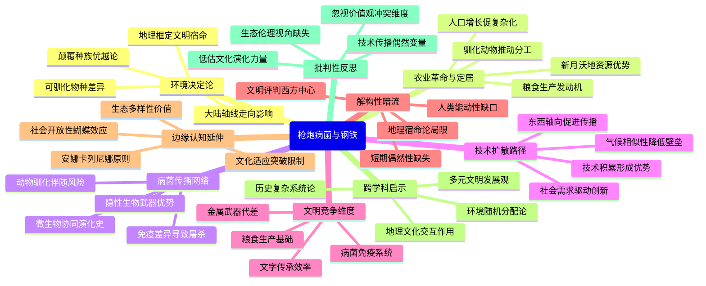

豆瓣链接：https://book.douban.com/subject/1813841/

# 深层解构

### 基石：被地理框定的文明宿命
作者贾雷德·戴蒙德的论证始终围绕着**环境决定论**这一核心信念展开，他认为地理环境如同一只无形的手，掌控着人类文明的发展轨迹。在他看来，各大陆在地理禀赋上的差异，如可驯化的动植物种类、大陆轴线走向、地形地貌等，早在人类文明起步之时，就已经决定了不同文明的发展潜力和方向。

- **粮食生产的“遗传密码”**：戴蒙德把粮食生产视为文明发展的“发动机”。在他的论述中，新月沃地之所以能成为早期文明的重要发源地，关键在于那里拥有丰富的可驯化植物（如小麦、大麦）和动物（如绵羊、山羊）资源。这些资源为定居生活和社会分工提供了可能，进而催生了文字、技术和复杂的政治制度。而美洲大陆由于缺乏合适的大型驯化动物（如马），导致其农业发展受限，无法像欧亚大陆那样形成大规模的帝国和高效的运输体系。
- **大陆轴线的“隐形壁垒”**：欧亚大陆东西向的轴线（与纬度平行）使得相同纬度的地区气候相似，有利于农作物和技术在东西方向上广泛传播。例如，轮子、冶金术等技术能够迅速在欧亚大陆扩散。相比之下，美洲和非洲大陆南北向的轴线（与经度平行）带来了巨大的气候差异，阻碍了技术和物种的传播。这一观点成为解释不同大陆文明发展速度差异的重要依据。
- **对“种族优越论”的彻底颠覆**：戴蒙德的核心信念中蕴含着对传统种族主义历史观的批判。他通过大量的史实证明，欧亚大陆人之所以能够在近代征服其他地区，并非是因为种族优越，而是得益于他们所处的地理环境赋予的“先发优势”，如拥有更多的可驯化物种、更便利的技术传播条件以及因与动物接触而产生的病菌免疫力等。

### 边缘：被轻描淡写的关键变量
在围绕地理环境展开论述的过程中，戴蒙德不经意间提及的一些观点，却可能蕴含着改变对人类文明发展认知的巨大潜力。

- **病菌的“屠杀机器”属性**：书中提到，欧亚大陆的病菌在征服美洲、澳大利亚等地的过程中起到了关键作用，这些地区的土著居民由于缺乏对欧亚大陆病菌的免疫力，累计死亡率高达50%-100%。这一数据揭示了一个残酷的事实：生物演化的偶然产物（病菌）在历史进程中的作用，远远超过了军事技术和政治制度的短期影响。它暗示着，人类文明的竞争不仅仅是技术和制度的竞争，更是一场与微生物的“协同演化”竞赛，而这一点在传统的历史研究中常常被忽视。
- **社会“开放性”的蝴蝶效应**：作者提到，“接受新作物、新牲畜或新技术的社会因而可能吃得更好，繁殖得更快，从而取代、征服或杀光那些抵制新事物的社会”。这一论述虽然简短，却触及了一个重要的文化变量——社会对创新的接受度。在地理环境相似的地区，社会开放性的差异可能会导致截然不同的发展轨迹。例如，近代中国在明清时期的闭关锁国与同时期欧洲的开放创新形成鲜明对比，这或许可以从社会开放性的角度为地理决定论提供补充解释。
- **“失败案例”的启示价值**：书中详细分析了为什么大多数大型野生哺乳动物未能被驯化（如斑马因性情凶险、猎豹因圈养繁殖困难等），并提出了“安娜·卡列尼娜原则”（成功需要满足所有必要条件，而失败只需缺少一个）。这一原则不仅适用于动物驯化，也可以延伸到文明发展的分析中。例如，一个文明的衰落可能并非是单一因素导致的，而是多种不利条件的共同作用结果，这为我们分析文明兴衰提供了更全面的思维框架。

### 暗流：未被审视的论证前提
戴蒙德的论证看似逻辑严密，但实际上隐含着一些未被明确讨论的假设，这些假设可能成为其理论的潜在“盲点”。

- **“地理宿命”中的人类能动性缺失**：尽管戴蒙德承认人类在利用地理资源方面的作用，但整体论述中仍暗含着“地理环境决定一切”的倾向，相对忽视了人类的主观能动性和文化创造力。例如，波利尼西亚人在孤立的岛屿环境中，通过独特的航海技术和社会组织，创造了复杂的文化和社会体系，这表明即使在不利的地理条件下，人类也可以通过创新突破环境的限制。此外，印加帝国在安第斯山脉的复杂地形中建立起庞大的帝国，依靠的不仅仅是地理环境提供的资源，更是其独特的政治制度和工程技术。
- **“文明差异”背后的价值判断**：书中对不同文明的发展程度进行比较时，隐含着以欧亚大陆文明为“标杆”的价值判断。例如，将粮食生产、技术发展和政治集权视为文明进步的标志，而相对忽视了其他文明在文化、艺术、生态适应等方面的独特价值。这种以西方文明为中心的视角，可能会导致对多元文明发展模式的忽视，未能充分认识到不同文明在特定环境下的适应性和合理性。
- **“长期决定论”与短期偶然性的冲突**：戴蒙德的理论侧重于从长期地理因素解释文明发展的大趋势，但对于历史进程中的短期偶然性事件（如关键人物的决策、技术发明的偶然契机等）关注不足。例如，西班牙征服者皮萨罗征服印加帝国，虽然有病菌和技术优势的背景，但皮萨罗的冒险精神和策略选择等偶然因素也起到了重要作用。这些短期偶然事件可能会在特定历史节点上改变文明发展的轨迹，而地理决定论难以完全解释这些现象。

### 解码后的启示
- **原来这本书真正在说**：《枪炮、病菌与钢铁》表面上是在探讨不同大陆文明发展的差异，实则是在挑战人类对自身历史的认知——我们一直以来所认为的“文明优劣”，很大程度上是地理环境“随机分配”的结果。它提醒我们，看待历史不能简单地用“进步”或“落后”来评判，而应从更宏观的地理和生态视角去理解文明的多样性和复杂性。
- **如果换个角度看**：当我们跳出地理决定论的框架，会发现人类文明的发展是地理环境、文化选择和偶然事件共同作用的结果。例如，我们可以思考：在地理环境相似的地区，为什么会出现不同的文化和制度？如果某个关键技术的传播路径因偶然因素发生改变，历史会如何改写？这种思考能够让我们更全面地认识历史的多样性和不确定性。
- **作者可能没意识到**：戴蒙德在强调地理环境作用的同时，可能低估了文化自身的演化力量。文化并非完全被动地适应地理环境，它也可以通过内部的创新和外部的交流，主动改变人类与环境的互动方式。此外，书中对“文明冲突”的论述主要集中在技术和病菌层面，而对文化价值观冲突（如宗教、哲学观念）在历史进程中的作用探讨较少，这也是值得进一步思考的方向。

通过解码《枪炮、病菌与钢铁》，我们不仅看到了地理环境如何塑造人类文明，更应该意识到，每一种文明都有其独特的发展逻辑和价值，而历史的魅力就在于它是多种因素交织作用的复杂结果。这种解码不是为了否定作者的观点，而是为了让我们在阅读时能够更加理性地审视其中的逻辑，同时激发自己对人类文明发展的更深层次思考，让阅读成为一场思想的“接力赛”。
# 章节内容
### 第一章：引言
作者在引言中提出了一个核心问题：为什么欧亚文明最终可以存活下来并战胜其他文明，例如为什么是欧洲人完成了对美洲、非洲等地区的征服，而不是相反？作者主张从历史发展的长期进程中寻找答案，认为不同大陆的人类社会发展差异并非源于人种的智力或基因差异，而是由于地理环境、可驯化的动植物资源等多种因素综合作用的结果。这一观点挑战了传统的以种族或文化优越性来解释历史发展差异的观点，为后续的论述奠定了基础。
### 第二章：历史的自然实验
以波利尼西亚群岛的不同社会发展为例，作者阐述了地理环境对社会发展的影响。尽管波利尼西亚人拥有共同的祖先和相似的文化，但由于各岛屿在面积、地形、气候、资源等方面的差异，导致了不同岛屿上社会发展的巨大差异。如有的岛屿资源丰富，发展出了复杂的社会结构和农业文明；而有的岛屿资源匮乏，社会发展相对滞后。这表明地理环境在人类社会早期发展中起着关键作用，为理解不同大陆间的发展差异提供了微观视角。
### 第三章：卡哈马卡的冲突
讲述了西班牙征服者皮萨罗在卡哈马卡俘虏印加帝国皇帝阿塔瓦尔帕的事件。作者通过对这一事件的详细描述，对比了双方在军事技术、组织形式、文化等方面的巨大差距。欧洲人凭借钢铁武器、马匹、火药等军事优势，以及高度组织化的军事体系，轻易地战胜了印加帝国。这一冲突直观地展现了欧亚文明与美洲文明之间的发展鸿沟，进一步引发了对这种差异根源的思考，为后续探讨地理因素如何影响技术发展和社会演进埋下伏笔。
### 第四章：农民的力量
主要探讨了农业在人类社会发展中的重要性。作者指出，农业的出现是人类历史上的一次重大革命，它使人类能够定居下来，生产出更多的食物，从而支持更大规模的人口增长。人口的增长又促使社会分工的细化、技术的进步和社会组织的复杂化。不同大陆上可驯化的动植物种类和数量的差异，影响了农业的起源和发展速度。例如，欧亚大陆拥有更多适合驯化的动植物，这为其农业发展提供了更有利的条件，进而推动了欧亚文明的快速发展。
### 第五章：历史上的穷与富
分析了不同大陆在财富和权力分配上的历史演变。地理因素导致了各大陆在农业发展、技术传播、贸易往来等方面的差异，进而造成了贫富分化。一些地区由于具有更好的自然条件和地理位置，能够发展出更先进的农业和商业，积累更多的财富和权力；而另一些地区则相对落后。这种贫富差距在历史进程中不断扩大，影响了不同文明之间的相互关系，如殖民与被殖民等。同时，也探讨了这种贫富分化对现代世界格局的深远影响。
### 第六章：大陆的轴线
阐述了大陆轴线方向对文明传播和交流的影响。欧亚大陆的东西轴线方向使得动植物、技术和文化能够在相似的气候带内更迅速地传播，促进了不同地区之间的交流与发展。而非洲和美洲大陆的南北轴线方向则给传播带来了更多障碍，如气候差异大、地理阻隔等，限制了文明的传播速度和范围。这一因素在很大程度上解释了为什么欧亚大陆的文明能够更快地发展并取得优势，进一步强调了地理环境在人类历史发展中的基础性作用。
### 第七章：牲畜的致命礼物
讨论了动物驯化对人类社会的多方面影响，特别是病菌传播方面。被驯化的动物为人类提供了食物、劳动力和交通工具，但也带来了许多致命病菌。长期与动物的密切接触使欧亚大陆的居民逐渐对这些病菌产生了一定的免疫力，而美洲等地的原住民由于缺乏与家畜的接触，对这些病菌毫无抵抗力。当欧洲人到达美洲时，病菌的传播引发了大规模的传染病流行，对美洲原住民社会造成了毁灭性打击。这一现象从病菌传播的角度揭示了欧亚文明在扩张过程中的一种“优势”，以及地理因素如何通过动物驯化间接影响了人类历史进程。
### 第八章：文字的力量
强调了文字在人类社会发展中的关键作用。文字的出现使得信息能够更准确、广泛地传播和传承，促进了知识的积累、技术的创新以及社会组织的管理和协调。欧亚大陆较早地发展出了文字系统，并通过文字记录了丰富的知识和经验，这为其文明的持续发展提供了强大动力。相比之下，一些其他地区文字发展较晚或缺乏完善的文字体系，在知识传承和社会发展方面受到一定限制。作者通过对不同文明文字发展历程的比较，展示了文字作为一种重要文化因素对历史进程的深远影响，以及地理环境等因素如何影响文字的产生和传播。
### 第九章：技术的演进
分析了技术在不同文明中的发展路径和影响因素。技术的进步并非是孤立的，而是受到社会需求、经济利益、文化传统和地理环境等多种因素的综合影响。欧亚大陆在长期的发展过程中，由于其复杂的社会结构、广泛的贸易网络以及地理上的连通性，促进了技术的交流、创新和传播。例如，战争需求推动了武器技术的发展，商业利益促使航海技术和贸易工具的改进。而其他地区可能由于相对封闭的地理环境或简单的社会结构，技术发展相对缓慢。作者通过对各种技术案例的研究，揭示了技术发展与社会、地理等因素之间的相互关系，以及技术在不同文明竞争中的重要地位。
### 第十章：病菌的传播
进一步深入探讨了病菌在人类历史上的传播规律及其对不同文明的影响。病菌的传播与人类的迁徙、贸易活动以及地理环境密切相关。欧亚大陆的病菌传播网络更为广泛和复杂，一方面是因为其人口密集、交通便利，另一方面也得益于其相对统一的生态环境。而在其他大陆，如美洲和澳大利亚，由于地理隔离和生态系统的独特性，病菌传播相对受限。当不同文明相遇时，病菌往往成为一种“隐形武器”，对没有免疫力的一方造成巨大灾难。这不仅改变了人口结构，也深刻影响了不同文明之间的力量对比和历史走向，从病菌传播的微观角度再次强调了地理因素对人类历史发展的深远影响。
### 第十一章：社会的演化
研究了不同社会形态的演化过程及其背后的原因。作者认为，社会的演化是一个复杂的过程，受到多种因素的共同作用，包括地理环境、人口增长、技术发展、政治组织形式等。从狩猎采集社会到农业社会，再到工业社会的转变，每个阶段都伴随着社会结构、经济模式和文化观念的重大变革。欧亚大陆在这一演化过程中相对领先，其多样的地理环境促使不同地区发展出不同的社会模式，并通过交流和竞争不断推动社会的进步。而其他地区由于地理条件的限制，社会演化相对缓慢。通过对不同社会演化案例的分析，作者试图揭示社会发展的一般性规律，以及地理因素在其中所起的基础性作用。
### 第十二章：后记
在后记中，作者总结了全书的主要观点，再次强调地理环境是影响人类社会发展差异的重要因素，但并非唯一因素。人类社会的发展是一个复杂的、多因素相互作用的过程，包括文化、政治、经济等方面的因素也在不同程度上影响着历史的进程。同时，作者也指出，理解历史发展的原因有助于我们更好地面对当今世界的各种问题，如贫富差距、文化冲突等。本书通过跨学科的研究方法，综合运用考古学、人类学、地理学、生物学等多学科知识，为我们提供了一个全新的视角来理解人类历史的发展，启发读者从更宏观、更深入的层面思考人类社会的过去、现在和未来。

《枪炮、病菌与钢铁》的核心观点是：不同地区的人类社会发展出截然不同的文明，导致全球范围内的巨大不平等，其主要原因是环境和地理因素，而非种族或文化上的优越性。

具体观点如下：
1. 地理决定论：人类历史的差异主要源于地理和生态环境。欧亚大陆的东西向轴线使得作物、家畜和技术更容易传播，促进了社会发展；而非洲和美洲的南北向轴线因气候差异阻碍了传播。例如，肥沃新月地带因其地中海气候、丰富的可驯化植物和动物等有利条件，成为世界上最早发展农业的地区之一。
2. 农业与文明的兴起：农业的发明是社会复杂化的起点。粮食盈余支持了人口增长和专业分工。欧亚大陆更早且更广泛地发展了农业，而其他地区因可驯化物种缺乏或环境条件限制而发展滞后。
3. 病菌的作用：农业文明密集的人口与家畜接触频繁，导致致命病菌的产生与传播。当欧亚人接触其他地区时，这些病菌成为比武器更具毁灭性的力量，造成种族间的不平等对抗。例如欧洲人带来的病菌使美洲土著大量死亡。
4. 技术的发展：技术的产生和传播并非仅依靠英雄式发明家，而是由社会需求驱动，且依赖环境条件。技术的传播在东西轴向的欧亚大陆进展迅速，而在南北轴向加地理隔绝的非洲和美洲举步维艰。
5. 动物驯化：只有少数满足严格条件的动物才能被成功驯化，这解释了不同地区驯化差异，也佐证了环境对社会发展的根本性影响。
6. 文字的传播：早期文字存在局限性，其传播受到地理等因素限制。
7. 社会组织的演变：从平等的族群到复杂的社会结构，如酋长管辖地和国家的演变。
8. 否定种族主义：强调不同民族的历史轨迹差异是环境造成的，而非生物学上的差异。种族主义观点缺乏科学依据。

作者通过跨学科的研究方法，综合多个学科的知识，试图揭示导致这些差异的终极因素，为理解人类社会发展的不平等提供了全面而深入的视角。