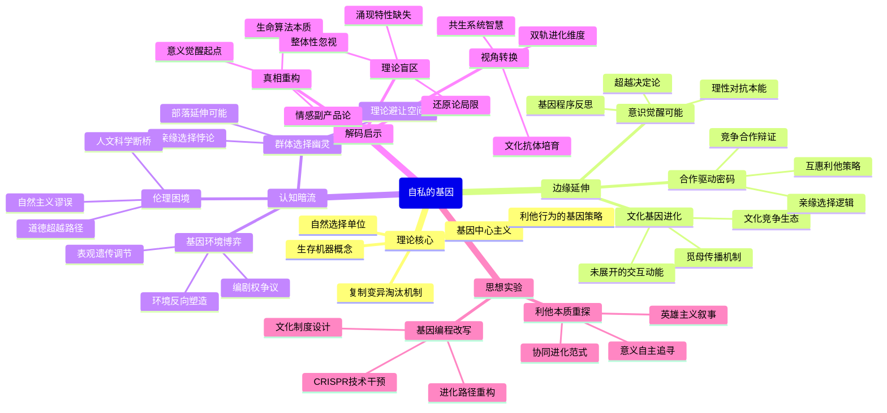

豆瓣链接：https://book.douban.com/subject/11445548/

# 深层解构

# 基因的生存游戏：一场被编码的进化叙事
## 一、基石：基因中心主义的生存逻辑
道金斯构建理论的核心支点是“基因至上论”，他将生命体定义为“基因的生存机器”，认为自然选择的基本单位是基因而非个体或群体。这一观点的底层逻辑在于：基因通过“复制、变异、淘汰”的三重机制，在亿万年的进化历程中缔造了生命世界的多样形态。书中反复强调，“利他行为”本质上是基因的“生存策略”——蜜蜂的自杀式攻击、鸟类的报警行为，皆可解读为基因通过牺牲个体来保障自身在群体中的延续概率。这种将生命现象简化为基因博弈的思维，打破了传统“物种整体进化”的认知框架，构建起以基因为核心的解释体系。

## 二、边缘：被轻描淡写的颠覆可能
### 1. 文化基因的隐秘进化
在第十一章“觅母：新的复制基因”中，道金斯提出“文化基因”（觅母）的概念，将其与生物基因类比，暗示文化、思想、符号等非物质形态同样遵循“复制-变异-传播”的进化逻辑。这一洞见如同一束微光，照亮了文化进化的暗室——宗教、科学理论、流行语等文化现象，实则是人类大脑中“觅母”相互竞争的结果。可惜作者仅将其作为补充章节，未深入探讨生物进化与文化进化的交互作用，而这或许能为理解人类社会的独特性开辟新路径。

### 2. 合作的基因密码
书中虽以“自私”为主线，却在字里行间透露着“合作”的蛛丝马迹。例如，蚂蚁的分工协作、人类的互惠行为，本质上是基因通过“亲缘选择”（如父母为子女牺牲）或“ reciprocal altruism”（互惠利他）实现群体层面的基因保存。这种“自私基因驱动下的合作”，暗示进化并非单纯的零和博弈，而是存在复杂的策略组合。若沿着这一思路深入，或可重新审视“竞争-合作”在进化中的辩证关系。

### 3. 个体意识的突围可能
当道金斯将人类视为“基因的傀儡”时，忽视了一个关键事实：人类拥有反思基因程序的能力。我们明知“繁衍后代是基因的诉求”，却仍可选择丁克；明知“甜食偏好源于基因对能量的囤积本能”，却能通过理性控制饮食。这种“对抗基因指令”的意识能动性，恰似黑客帝国中挣脱代码控制的觉醒者，为“超越基因决定论”提供了现实依据。

## 三、暗流：未被审视的理论前提
### 1. 基因与环境的权力之争
道金斯的理论暗含“基因决定论”的假设，默认基因是生命的“唯一编剧”，却弱化了环境（包括物理环境与社会环境）对基因表达的塑造作用。现代表观遗传学已证明，环境刺激可通过甲基化等机制改变基因活性，换言之，基因更像是“剧本的执行者”，而非“唯一的作者”。书中对“后天环境如何反作用于基因”着墨甚少，这导致其理论在解释人类复杂行为时略显单薄。

### 2. 群体选择的幽灵
尽管道金斯明确反对“群体选择论”，但其理论中“亲缘选择”（如父母为子女牺牲）本质上是一种“缩小版的群体选择”——当基因在亲属群体中高度相似时，个体牺牲可视为“基因在群体层面的自我保存”。这种逻辑若延伸至更大的群体（如部落、民族），是否可能为“有限的群体选择”提供生存空间？作者对此避而不谈，却为后续理论争议埋下伏笔。

### 3. 伦理学的基因陷阱
当“自私是基因的本性”被等同于“人类应当自私”时，便陷入了“自然主义谬误”（从“是”推导出“应当”）。道金斯本人试图通过“觅母”理论跳出这一陷阱，提出“我们可以通过文化教育对抗基因的自私本能”，但书中对“道德如何超越基因编程”的论证略显仓促。这一未被充分展开的伦理思考，恰是连接科学理论与人文关怀的关键桥梁。

## 四、解码后的三重启示
### 1. 真相重述：这本书真正在说什么？
《自私的基因》并非鼓吹“人性本恶”，而是以基因之名，揭示生命进化的底层算法——所有生物都是基因编写的“生存程序”，爱情、亲情、道德等人类珍视的情感，本质上是基因优化生存策略的副产品。这种“冰冷的科学视角”看似消解了生命的意义，实则为我们提供了一个重新定义意义的起点：既然基因赋予我们的本能是生存与繁衍，那么人类超越本能的艺术创作、科学探索、道德追求，恰恰是生命对抗机械进化的伟大觉醒。

### 2. 视角转换：如果换个角度看？
- **从“基因利己”到“生命共生”**：地球生命历经数十亿年形成的共生系统（如线粒体与细胞的共生）表明，进化的主旋律并非单纯的竞争，而是不同基因、物种之间的协作共生。或许“自私”只是局部策略，“共生”才是长期智慧。
- **从“生物进化”到“文化反叛”**：觅母理论暗示，人类文化正在创造新的进化维度。当我们通过教育传递“利他主义”“环保理念”时，实则是在培育对抗基因自私性的“文化抗体”，这种文化进化可能使人类逐渐摆脱基因的暴政，走向更文明的生存形态。

### 3. 作者的盲点：那些未被言说的局限
道金斯的理论如同锋利的手术刀，解剖了生命的进化机制，却在解剖过程中忽略了“生命的整体性”。他将生物体简化为基因的载体，却未充分考虑生物体作为“复杂系统”的涌现特性——单个神经元并无意识，但无数神经元的网络却诞生了意识；单个基因并无目的，但基因与环境的交互却创造了生命的多样性与能动性。这种“还原论”思维虽带来认知突破，却也可能让我们错失生命的复杂性之美。

## 五、思想接力：解码后的行动邀请
当我们透过“自私基因”的透镜看清生命的本质后，不妨进行一场思维实验：
- 若基因是“自私的程序员”，那么人类能否成为“改写代码的黑客”？通过基因编辑技术（如CRISPR）、文化教育、社会制度设计，我们能否创造更符合人类价值观的“进化路径”？
- 当“自私”被解构为基因的生存策略，我们该如何重新定义“利他”？是将其视为对抗基因本能的英雄主义，还是看作另一种形式的“基因-文化协同进化”？

《自私的基因》的终极价值，不在于给出答案，而在于抛出一个颠覆常识的问题：当我们认识到自己是基因编写的“生存机器”时，是选择臣服于本能，还是勇于开启超越基因的“意义追寻之旅”？这场关乎人类命运的抉择，或许才是道金斯留给后世最珍贵的思想遗产。

# 章节内容

### **第一章：为什么会有人呢？（Why are People?）**

本章是全书的序言和纲领，道金斯开宗明义地提出了他最核心的革命性论点。他首先批判了当时流行的“物种利益”或“群体利益”的进化论观点，认为这些观点无法解释自然界中广泛存在的利他行为和自私行为的矛盾。道金斯明确指出，**理解进化论的关键在于，要从基因的视角，而非个体或物种的视角出发**。他断言，我们以及其他一切动物，都只是基因为了延续自身而创造和利用的“生存机器”（survival machines）。作者强调，他所说的“自私”并非指意识层面或道德层面的自私，而是一个拟人化的比喻，用以描述基因在进化过程中表现出的那种“不顾一切寻求自身最大化复制”的客观效果。一个成功的基因，其根本特性就是无情的自私。这种自私性通常会导致个体行为的自私。然而，在某些特殊情况下，基因可以通过促使个体表现出有限的利他主义行为，来更好地达到其自私的目的，例如对亲属的照顾。因此，本书的目的就是要**从根本上解释个体自私主义和利他主义的生物学，其理论基础是“基因是自然选择的基本单位”**。这一章奠定了全书的基调：将生命体看作是基因为了在严酷的生存竞争中胜出而建造的、暂时性的载体。

### **第二章：复制因子（The Replicators）**

这一章追溯到生命起源的“原始汤”（primeval soup），道金斯在此构建了他理论的逻辑起点。他设想，在地球早期的海洋中，各种化学物质在能量（如闪电、紫外线）的作用下随机碰撞，偶然形成了一种非常特殊的分子，他称之为**“复制因子”（replicator）**。这种分子的非凡之处在于它能利用周围的“积木”分子复制出与自身完全一样的拷贝。这就是生命的曙光。一旦复制因子出现，进化就不可避免地开始了。由于复制过程并非完美，会产生各种“错误”的变种。这些变种之间为了争夺有限的“积木”分子而展开竞争。道金斯指出，成功的复制因子具备三个关键特性：**长寿（Longevity）、繁殖力（Fecundity，即复制速度快）和复制的忠实性（Copying-fidelity）**。在漫长的竞争中，那些更稳定、复制更快、复制更准确的复制因子将在“原始汤”中占据主导地位。更重要的是，它们开始发展出保护自己的手段，通过化学方式瓦解对手，并为自己建造一层蛋白质“保护壁”。这便是最早的细胞雏形，也是“生存机器”的起源。**因此，我们这些生物体，归根结底，是远古复制因子为了在竞争中生存下来而演化出的越来越复杂的“容器”和“工具”**。

### **第三章：不朽的双螺旋（Immortal Coils）**

本章将第二章中抽象的“复制因子”概念与现代生物学的核心——DNA分子联系起来。道金斯指出，今天，几乎所有的生命都以DNA的形式承载着古老的复制因子。他用了一个生动的比喻：**基因就像一群不朽的“乘客”，而个体生物（如你我）则是它们赖以生存和旅行的、终将报废的“交通工具”**。他在这里对“基因”给出了一个功能性的定义：它不是一个不可分割的物理单位，而是**“任何一个在遗传过程中能够作为一个单位，并能延续足够长的时间，从而可以作为自然选择单位的一段染色体”**。这意味着一个基因可能只是一小段DNA片段，但它的信息内容可以在无数代的身体中传递下去，几乎是永恒的。个体生命是短暂的，因为个体是基因的独特组合，这种组合在有性生殖中会被拆散和重组。但基因本身（作为信息）却可以通过精确的复制，在基因库中穿梭，实现“不朽”。道金斯强调，**基因通过控制蛋白质的合成来间接操控“生存机器”的建造过程**。它们是“程序员”，为胚胎发育设定了规则和蓝图，从而构建出一个能够应对环境挑战、并最终帮助它们完成复制任务的复杂机器。

### **第四章：基因机器（The Gene Machine）**

在这一章，道金斯详细阐述了基因如何控制其“生存机器”的行为。他指出，基因的控制方式并非像拉线木偶一样直接、实时地操控每一个动作。因为环境瞬息万变，基因无法预知所有情况。因此，基因采取了一种更高级的策略：**它们像一个高明的程序员，预先为生存机器（特别是其大脑）编写好行为“程序”或“策略”，赋予其一定的学习和决策能力，以应对不可预测的未来**。例如，基因会赋予动物“饥饿感”、“恐惧感”或“性欲”，这些感觉会驱使动物做出有利于基因生存和繁殖的行为（如觅食、避敌、交配），而无需基因在每一刻都下达指令。这种间接控制是基因应对时间延迟挑战的唯一方法。道金... 此处作者用了一个生动的类比：**基因为生存机器制定了策略和“政策”，而大脑则是执行这些政策的“执行官”**。大脑通过模拟和预测未来，做出最有利的决策。因此，意识的出现，可以被看作是进化过程的顶峰——生存机器最终从其主人（基因）那里获得了解放，能够自主地应对复杂环境，但这最终依然是为了服务于基因的根本利益。

### **第五章：进犯行为：稳定性和自私的机器（Aggression: Stability and the Selfish Machine）**

本章引入了一个至关重要的概念来解释动物社会中的冲突与合作：**“进化上的稳定策略”（Evolutionarily Stable Strategy, ESS）**。这个概念由约翰·梅纳德·史密斯提出，道金斯将其作为解释动物行为的核心工具。ESS指的是一种被种群中绝大多数成员所采纳的策略，这种策略一旦确立，任何偏离它的“突变”策略都无法获得更高的收益。道金斯用“鹰鸽博弈”模型来阐释：如果种群中全是“鸽子”（总是退让），一个“鹰”（总是战斗）的突变体会大获全胜；但如果全是“鹰”，它们会因不断战斗而两败俱伤，此时一个“鸽子”策略反而能存活。最终，种群会达到一个“鹰”和“鸽子”的稳定比例，或者所有个体都采取一种混合策略（如“还击者”策略：开始像鸽子，被攻击后像鹰一样还击）。**ESS解释了为什么动物间的争斗往往是仪式化的、点到即止的，而不是你死我活的**。因为残酷的搏斗对所有参与者的基因（无论是胜者还是败者）都构成长远风险。因此，自然选择倾向于那些能够形成稳定、可预测行为模式的基因，这种模式使得个体在社会博弈中能够最大化自身基因的长期利益。

### **第六章：基因道德（Genesmanship）**

这一章集中解决了一个核心难题：如何从“自私的基因”理论出发，解释生物界普遍存在的“利他行为”，尤其是亲属之间的利他行为。道金斯在这里详细阐述了威廉·汉密尔顿的**“亲缘选择”（Kin Selection）**理论。其核心思想是，一个基因之所以会促使其载体（个体）对亲属表现出利他行为，是因为它的亲属有很大概率也携带着同样的基因拷贝。从基因的视角看，**帮助亲属繁殖，就等同于帮助自己基因的拷贝进行复制**。道金斯引入了“亲缘关系指数”（relatedness）的概念，即两个亲属之间共享某一特定基因的概率（如父母与子女、同胞兄弟姐妹之间是1/2，祖孙是1/4）。一个利他行为是否“值得”发生，取决于一个简单的公式：**利他者自身承担的风险（C）必须小于受益者获得的利益（B）乘以两者的亲缘关系指数（r），即 C < rB**。这个理论完美地解释了为什么父母对子女的爱护如此强烈，以及为什么蜜蜂、蚂蚁等社会性昆虫中存在不育的“工蜂”会牺牲自己来保卫蜂后（它们的姐妹）。它们不是为了群体，而是为了高效地传播与自己共享的大量基因。

### **第七章：计划生育（Family Planning）**

道金斯在本章中运用自私基因理论，驳斥了“动物为了控制种群数量、防止资源枯竭而主动节制生育”的“群体选择”观点。他认为，动物的生育行为同样是出于个体基因的自私算计。他引用大卫·拉克（David Lack）的理论指出，**动物并非能生多少就生多少，而是会选择一个“最适宜的窝卵数”（或胎数），以实现其最终抚养成活的后代数量最大化**。生得太多，会导致每个后代分到的资源（食物、亲代照顾）过少，存活率下降，结果成活的总数反而不如生得少一些的个体。因此，所谓的“计划生育”并非为了物种的未来，而是**父母基因为了最大化其自身基因遗传成果的自私策略**。动物个体会根据环境资源、自身健康状况等因素，来“决定”是投入更多资源在“生育”（bearing）上，还是在“抚养”（caring）上。这两种策略的权衡，完全是从个体基因利益最大化的角度出发的。这是一种在个体层面上的成本收益分析，而不是为了群体的长远利益。

### **第八章：代际之战（Battle of the Generations）**

这一章将基因的自私逻辑延伸到了家庭内部，揭示了**亲代与子代之间存在的根本性利益冲突**。传统观点认为家庭是充满温情与合作的港湾，但道金斯指出，从基因角度看，冲突是不可避免的。根本原因在于亲缘关系的不对称：**一个子女对自己是100%相关的，但对它的同胞兄弟姐妹只有50%相关；而母亲对她所有的子女都是50%相关的**。这就导致了利益的分配矛盾。例如，在断奶问题上，子女总希望从母亲那里获得比母亲“愿意”给予的更多的乳汁和照顾，因为这对它自身的生存至关重要。而母亲则需要权衡对当前子女的投入和为未来可能出生的其他子女保留资源之间的关系。当继续哺乳对这个子女的收益，已经低于对未来子女造成的损失时，母亲就倾向于断奶，而此时子女仍然“希望”继续获取资源。这种冲突还体现在子女间的竞争，甚至在极端情况下，会出现“该亚”行为，即先出生的雏鸟杀死后出生的弟妹。**家庭内部的温情与合作背后，始终贯穿着一场基于基因利益的、微妙而持续的“战争”**。

### **第九章：两性战争（Battle of the Sexes）**

本章探讨了雄性和雌性在繁殖策略上的根本差异及其引发的冲突，道金斯将其称为“两性战争”。这场战争的根源在于一个最基本的不对称：**雌性的性细胞（卵子）比雄性的性细胞（精子）要大得多，也珍贵得多**。雌性从一开始就为后代投入了更多的资源。这种初始投资的不平等，导致了两性繁殖策略的巨大分化。雌性由于投入巨大，其成功繁殖的后代数量有限，因此她们的策略倾向于是“精挑细选”的（coy），会选择那些能证明自己拥有优良基因或能提供可靠资源（如领地、食物、保护）的雄性。相反，雄性由于投资小，理论上可以使无数雌性受孕，他们的策略倾向于是“滥交”的（promiscuous），并彼此激烈竞争以获得与雌性交配的机会。道金斯基于ESS理论，分析了多种有趣的策略，如“忠诚大丈夫”策略、“薄情郎”策略，以及雌性的“羞怯”策略和“放荡”策略。**他认为，两性间的求偶、炫耀、欺骗、博弈，都是这场围绕繁殖投资展开的、深刻的进化冲突的表现形式**，其最终目的是最大化各自基因的遗传利益。

### **第十章：你为我搔痒，我便骑在你头上（You Scratch My Back, I'll Ride on Yours）**

在解决了亲缘利他主义之后，道金斯在本章中处理了另一个难题：如何解释非亲属个体之间的合作行为。他引入了罗伯特·特里弗斯（Robert Trivers）的**“互惠利他主义”（reciprocal altruism）**理论。其核心思想可以概括为“你帮我，我以后也帮你”。这种合作模式得以成立的关键条件是：**个体之间有较高的重复博弈机会，并且能够识别和记住对方**。在这种情况下，一次利他行为的短期“成本”，可以被未来对方回报的长期“收益”所补偿。道金斯用博弈论中的“囚徒困境”来分析，并引出了三种策略者：“傻瓜”（总是合作）、“骗子”（总是背叛）和“斤斤计较者”（Grudger，第一次合作，之后若对方背叛则永不合作）。在一个“骗子”横行的世界里，“傻瓜”会灭绝。但“斤斤计较者”却能识别并惩罚“骗子”，同时与其他的“斤斤计较者”或“傻瓜”建立稳定的合作关系，从而获得长远优势。**这种有条件的、基于记忆和报复机制的合作，是自私的基因在非亲属社会中实现共赢的一种精明策略**，它解释了从清洁鱼到吸血蝙蝠的许多跨物种合作现象。

### **第十一章：觅母：新的复制因子（Memes: The New Replicators）**

这是全书思想最为奔放和影响深远的一章。道金斯将“复制因子”的概念从生物领域大胆地推广到了人类文化领域，并创造了一个全新的词汇：**“觅母”（Meme，或译为“模因”）**。他认为，正如基因是生物进化的基本单位，觅母是文化进化的基本单位。**觅母是“一个文化传播的单位”或“一个模仿的单位”**，它可以是一段旋律、一个思想观念、一句口号、一种时装、一种建筑风格等等。觅母通过“模仿”这一过程，从一个大脑“跳”到另一个大脑，从而在“觅母库”（meme pool，即人类文化）中进行复制和传播。如同基因一样，觅母之间也存在竞争，它们争夺的是人类大脑的有限注意力和记忆空间。成功的觅母也同样具备**长寿、繁殖力（传播速度快）和复制的忠实性**。例如，“上帝”的观念、贝多芬的《第九交响曲》、科学理论等，都是极其成功的觅母复合体。道金斯提出，人类的独特性可能就在于我们同时被两种复制因子——基因和觅母——所主宰。更重要的是，**我们作为被基因构建的生存机器，有可能具备足够强大的意识和预见能力，去反抗自私基因的盲目指令，甚至反抗觅母的奴役**。

### **第十二章：好人终有好报（Nice Guys Finish First）**

本章是增订版中增加的内容，旨在进一步巩固关于合作进化的论点。道金斯介绍了罗伯特·阿克塞尔罗德（Robert Axelrod）组织的“囚徒困境”计算机模拟竞赛。竞赛邀请各领域专家提交各种策略，在循环赛中进行博弈。令人惊讶的是，最终胜出的是所有策略中最简单、最“善良”的一个：**“一报还一报”（Tit for Tat）**。这个策略的规则是：第一回合选择合作；在之后的每一回合，都重复对手上一回合的行动。道金斯总结了“一报还一报”策略成功的几个关键特质：它是**“善良的”**（从不首先背叛）、**“可激怒的”**（对背叛会立即报复）和**“宽容的”**（一旦对方重新合作，它会立刻忘记旧怨并恢复合作）。这个竞赛结果为“互惠利他主义”的演化提供了强有力的证据。它表明，即使在一个由纯粹追求自身利益的“自私”个体组成的群体中，**基于互惠的合作与信任也能够自发地涌现并成为一种进化上的稳定策略（ESS）**。这证明了“好人”（即愿意合作和宽容的策略）在长期的重复博弈中，确实能获得最终的胜利。

### **第十三 章：基因的延伸（The Long Reach of the Gene）**

这是全书的压轴章节，也是道金斯思想最深刻、最具颠覆性的部分。他提出了一个更为宏大的理论框架：**“延伸表现型”（The Extended Phenotype）**。道金斯认为，我们不应将基因的作用局限于它所栖居的那个生物体之内。**一个基因的表型效应（phenotypic effect），可以超越个体身体的界限，延伸到外部世界中**。最经典的例子是河狸的堤坝。堤坝并非河狸身体的一部分，但它无疑是河狸基因的产物，并且对这些基因的生存和复制至关重要。因此，堤坝应被视为河狸基因的“延伸表现型”。同理，寄生虫使其宿主行为改变以利于自身传播，这也是寄生虫基因的延伸表现型。这个观点彻底打破了生物个体作为独立单位的传统观念。**道金斯主张，我们应该把生命看作是“复制因子（基因）通过其延伸的表现型效应，在世界上为自己争取生存”的过程**。整个世界，可以被看作是无数不朽的基因，通过它们在不同生物体内外延伸出的各种效应（从细胞结构到动物行为，再到人工制品）相互作用、彼此竞争的巨大网络。这才是对“自私的基因”理论最彻底、最逻辑自洽的理解。