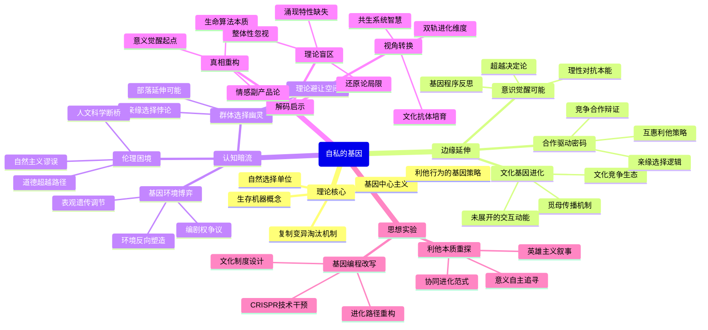

豆瓣链接：https://book.douban.com/subject/11445548/

# 深层解构

# 基因的生存游戏：一场被编码的进化叙事
## 一、基石：基因中心主义的生存逻辑
道金斯构建理论的核心支点是“基因至上论”，他将生命体定义为“基因的生存机器”，认为自然选择的基本单位是基因而非个体或群体。这一观点的底层逻辑在于：基因通过“复制、变异、淘汰”的三重机制，在亿万年的进化历程中缔造了生命世界的多样形态。书中反复强调，“利他行为”本质上是基因的“生存策略”——蜜蜂的自杀式攻击、鸟类的报警行为，皆可解读为基因通过牺牲个体来保障自身在群体中的延续概率。这种将生命现象简化为基因博弈的思维，打破了传统“物种整体进化”的认知框架，构建起以基因为核心的解释体系。

## 二、边缘：被轻描淡写的颠覆可能
### 1. 文化基因的隐秘进化
在第十一章“觅母：新的复制基因”中，道金斯提出“文化基因”（觅母）的概念，将其与生物基因类比，暗示文化、思想、符号等非物质形态同样遵循“复制-变异-传播”的进化逻辑。这一洞见如同一束微光，照亮了文化进化的暗室——宗教、科学理论、流行语等文化现象，实则是人类大脑中“觅母”相互竞争的结果。可惜作者仅将其作为补充章节，未深入探讨生物进化与文化进化的交互作用，而这或许能为理解人类社会的独特性开辟新路径。

### 2. 合作的基因密码
书中虽以“自私”为主线，却在字里行间透露着“合作”的蛛丝马迹。例如，蚂蚁的分工协作、人类的互惠行为，本质上是基因通过“亲缘选择”（如父母为子女牺牲）或“ reciprocal altruism”（互惠利他）实现群体层面的基因保存。这种“自私基因驱动下的合作”，暗示进化并非单纯的零和博弈，而是存在复杂的策略组合。若沿着这一思路深入，或可重新审视“竞争-合作”在进化中的辩证关系。

### 3. 个体意识的突围可能
当道金斯将人类视为“基因的傀儡”时，忽视了一个关键事实：人类拥有反思基因程序的能力。我们明知“繁衍后代是基因的诉求”，却仍可选择丁克；明知“甜食偏好源于基因对能量的囤积本能”，却能通过理性控制饮食。这种“对抗基因指令”的意识能动性，恰似黑客帝国中挣脱代码控制的觉醒者，为“超越基因决定论”提供了现实依据。

## 三、暗流：未被审视的理论前提
### 1. 基因与环境的权力之争
道金斯的理论暗含“基因决定论”的假设，默认基因是生命的“唯一编剧”，却弱化了环境（包括物理环境与社会环境）对基因表达的塑造作用。现代表观遗传学已证明，环境刺激可通过甲基化等机制改变基因活性，换言之，基因更像是“剧本的执行者”，而非“唯一的作者”。书中对“后天环境如何反作用于基因”着墨甚少，这导致其理论在解释人类复杂行为时略显单薄。

### 2. 群体选择的幽灵
尽管道金斯明确反对“群体选择论”，但其理论中“亲缘选择”（如父母为子女牺牲）本质上是一种“缩小版的群体选择”——当基因在亲属群体中高度相似时，个体牺牲可视为“基因在群体层面的自我保存”。这种逻辑若延伸至更大的群体（如部落、民族），是否可能为“有限的群体选择”提供生存空间？作者对此避而不谈，却为后续理论争议埋下伏笔。

### 3. 伦理学的基因陷阱
当“自私是基因的本性”被等同于“人类应当自私”时，便陷入了“自然主义谬误”（从“是”推导出“应当”）。道金斯本人试图通过“觅母”理论跳出这一陷阱，提出“我们可以通过文化教育对抗基因的自私本能”，但书中对“道德如何超越基因编程”的论证略显仓促。这一未被充分展开的伦理思考，恰是连接科学理论与人文关怀的关键桥梁。

## 四、解码后的三重启示
### 1. 真相重述：这本书真正在说什么？
《自私的基因》并非鼓吹“人性本恶”，而是以基因之名，揭示生命进化的底层算法——所有生物都是基因编写的“生存程序”，爱情、亲情、道德等人类珍视的情感，本质上是基因优化生存策略的副产品。这种“冰冷的科学视角”看似消解了生命的意义，实则为我们提供了一个重新定义意义的起点：既然基因赋予我们的本能是生存与繁衍，那么人类超越本能的艺术创作、科学探索、道德追求，恰恰是生命对抗机械进化的伟大觉醒。

### 2. 视角转换：如果换个角度看？
- **从“基因利己”到“生命共生”**：地球生命历经数十亿年形成的共生系统（如线粒体与细胞的共生）表明，进化的主旋律并非单纯的竞争，而是不同基因、物种之间的协作共生。或许“自私”只是局部策略，“共生”才是长期智慧。
- **从“生物进化”到“文化反叛”**：觅母理论暗示，人类文化正在创造新的进化维度。当我们通过教育传递“利他主义”“环保理念”时，实则是在培育对抗基因自私性的“文化抗体”，这种文化进化可能使人类逐渐摆脱基因的暴政，走向更文明的生存形态。

### 3. 作者的盲点：那些未被言说的局限
道金斯的理论如同锋利的手术刀，解剖了生命的进化机制，却在解剖过程中忽略了“生命的整体性”。他将生物体简化为基因的载体，却未充分考虑生物体作为“复杂系统”的涌现特性——单个神经元并无意识，但无数神经元的网络却诞生了意识；单个基因并无目的，但基因与环境的交互却创造了生命的多样性与能动性。这种“还原论”思维虽带来认知突破，却也可能让我们错失生命的复杂性之美。

## 五、思想接力：解码后的行动邀请
当我们透过“自私基因”的透镜看清生命的本质后，不妨进行一场思维实验：
- 若基因是“自私的程序员”，那么人类能否成为“改写代码的黑客”？通过基因编辑技术（如CRISPR）、文化教育、社会制度设计，我们能否创造更符合人类价值观的“进化路径”？
- 当“自私”被解构为基因的生存策略，我们该如何重新定义“利他”？是将其视为对抗基因本能的英雄主义，还是看作另一种形式的“基因-文化协同进化”？

《自私的基因》的终极价值，不在于给出答案，而在于抛出一个颠覆常识的问题：当我们认识到自己是基因编写的“生存机器”时，是选择臣服于本能，还是勇于开启超越基因的“意义追寻之旅”？这场关乎人类命运的抉择，或许才是道金斯留给后世最珍贵的思想遗产。

# 章节内容

### **第一章 为什么会有人类呢**  
道金斯开篇颠覆“人类中心论”，提出生命的本质是基因的“生存机器”。他反驳“造物主”或“生命目的”的传统叙事，指出进化的主角是基因而非个体或物种。通过“原始汤”假说，他论证复制因子（基因）的核心目标是延续自身，而非服务于生物体。人类的出现并非“进化的顶点”，而是基因在自然选择中偶然形成的高效载体。本章奠定全书的基因中心论视角，强调所有生命行为（包括利他与自私）本质上都是基因的生存策略。

### **第二章 复制基因**  
追溯生命起源，道金斯设想40亿年前的“原始汤”中，有机分子偶然形成可自我复制的RNA-like分子（原始基因）。复制错误导致变异，竞争稀缺资源促使复制因子发展出“保护壳”（如蛋白质膜），形成早期细胞。他提出“成功基因的特性”：稳定性、复制效率、精确性，这些特性使基因在亿万年中通过自然选择留存。本章揭示基因的“自私”本质——并非主观意志，而是无意识的复制优势驱动，为后续“生存机器”理论奠基。

### **第三章 不朽的螺旋圈**  
聚焦DNA的双螺旋结构，道金斯解释基因如何通过“不朽”的复制延续。DNA的高保真复制（偶尔突变）使其成为理想的遗传物质，每个基因是染色体上的“遗传单位”，通过减数分裂和重组在种群中扩散。他类比“染色体图书馆”，个体是基因的临时组合，而基因库才是永恒的“基因海洋”。本章强调基因的“策略”：通过控制生物体的发育，确保自身在代际传递中占据优势，而非关注个体的生死。

### **第四章 基因机器**  
定义生物体为“基因的生存机器”，行为是基因的“遥控程序”。道金斯以海鸟喂食、蜜蜂采蜜为例，说明基因通过“预先编程”（如本能）和“灵活指令”（如学习）操控行为。他提出“时滞”概念：基因无法实时反应，需赋予生存机器适应环境的灵活性（如人类的大脑）。本章反驳“基因决定论”，指出基因是“概率性策略制定者”，而非绝对控制者，个体行为是基因与环境互动的产物。

### **第五章 进犯行为：稳定性和自私的机器**  
分析动物冲突的进化逻辑，提出“进化稳定策略（ESS）”。道金斯以斗鸡博弈为例，说明为何争斗常以“仪式化”而非致命攻击结束——ESS是个体在长期博弈中最大化基因收益的策略（如“鹰派”与“鸽派”的平衡）。他批判“群体选择论”，强调自私基因的个体选择才是核心：即使牺牲个体，也是为了同类基因的传播（如工蜂蜇人后死亡，保护蜂后基因）。本章揭示“利他”表象下的基因自私本质。

### **第六章 基因道德**  
探讨亲属利他行为的基因基础，引入“亲缘系数”（如亲子1/2，兄妹1/2）。道金斯提出“汉密尔顿法则”：当利他行为的收益×亲缘系数＞成本时，基因会被选择。以母亲护崽、鸟类喂雏为例，说明亲代投资是基因最大化自身拷贝的策略。他批判“母爱无私”的浪漫化，指出亲代与子代的冲突（如断奶争议）本质是基因利益的博弈——母亲需平衡资源分配，子代则争取更多投资。

### **第七章 计划生育**  
分析动物“窝卵数”的调节机制，反驳“为种群利益节育”的群体选择论。道金斯以塘鹅为例，说明个体节育是自私策略：过量繁殖会导致幼崽饿死，降低基因传递成功率。亲代投资（PI）是有限资源的分配游戏，最优策略是根据环境调整后代数量（如拉克法则）。本章揭示“计划生育”的基因逻辑：非利他性节制，而是最大化自身基因在孙代的留存。

### **第八章 世代之间的争斗**  
聚焦亲子冲突，指出子代的“欺骗”（如夸大饥饿）与亲代的“警觉”是基因博弈的结果。道金斯以雏鸟乞食为例，说明子代基因试图获取超额资源，而亲代基因需公平分配。他提出“资源控制理论”：亲代因掌握资源主导权，最终会赢得冲突（如断奶），但子代可能通过“情感勒索”（如哭泣）争取利益。本章深化“基因自私”的内涵——即使亲密关系，也是利益的计算。

### **第九章 两性之间的争斗**  
从基因投资差异解释雌雄策略分化。雌性因卵子大（高投资），倾向“挑剔择偶”；雄性因精子小（低投资），倾向“多交配”。道金斯以极乐鸟求偶、海马育儿为例，说明性别角色由“亲代投资”决定，而非“性别本质”。他提出“家庭幸福策略”与“大丈夫策略”，解释雌性如何通过择偶偏好（如领地、羽饰）筛选优质基因。本章揭示两性冲突的根源：基因在繁殖成本上的不对称性。

### **第十章 你为我挠痒，我就骑在你头上**  
探讨非亲属的互惠利他，以吸血蝙蝠分享血液、清洁鱼与大鱼共生为例。道金斯引入“囚徒困境”模型，说明互惠在“重复博弈”中进化的条件：长期互动、识别欺骗者、以牙还牙。他强调“互惠利他”本质是自私——今日利他是为了明日利己，而非道德驱动。本章反驳“人性本善”，指出合作是基因在进化中筛选出的高效生存策略。

### **第十一章 觅母：新的复制基因**  
突破性提出“文化基因”（觅母，meme），类比基因的传播逻辑。道金斯以语言、宗教、科学理论为例，说明觅母通过模仿在人脑（宿主）中复制，其生存取决于“感染力”（如简洁性、神秘感）。他探讨觅母与基因的冲突（如禁欲主义抑制繁殖），指出人类是唯一能反抗基因的物种——通过文化进化超越生物本能。本章拓展进化论边界，为模因学奠基。

### **第十二章 好人终有好报**  
结合计算机模拟（阿克塞尔罗德实验），论证“Tit for Tat”（以牙还牙）策略在博弈中的优越性：善良、宽容、不嫉妒。道金斯解释为何合作能在自私基因的世界中胜出——短期利他换取长期共赢，惩罚背叛者维持秩序。他以人类社会的法律、道德为例，说明文化规范如何强化互惠，使“自私的基因”衍生出合作的“生存机器”。本章调和“自私”与“利他”的矛盾，揭示进化中的合作逻辑。

### **第十三章 基因苦旅**  
总结基因的“永恒视角”：个体生命短暂，基因却穿越亿万年。道金斯以“恐龙基因的灭绝”与“人类基因的延续”对比，强调基因的成功在于“长期生存”，而非个体的成败。他畅想未来：基因可能通过技术（如克隆）摆脱生物体的束缚，甚至征服星际。本章回归哲学命题：人类作为基因的载体，虽被创造，却能通过理解基因的“自私”，获得超越本能的自由——这正是生命的诗意。

