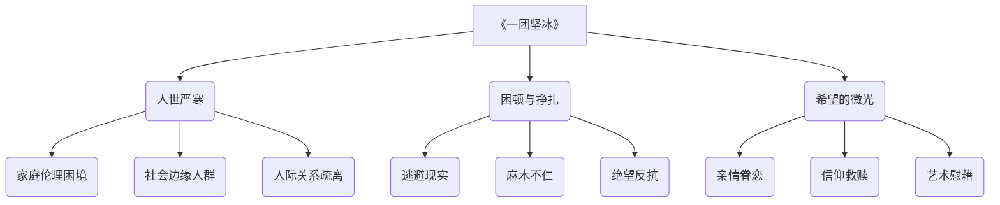

好的，文学家已就位，现在开始对杨知寒的短篇小说集《一团坚冰》进行全面分析。

## 1. 基础信息

*   **作者背景：** 杨知寒，1994年生，中国作家协会会员，属于“东北文艺复兴”的青年一代作家。从网络文学转向纯文学写作，并崭露头角。
*   **创作背景：** 作品带有明显的地域特征，故事背景设定在东北，反映了转型时期东北社会的人情冷暖和世态变迁。与东北老工业基地的衰落以及社会转型背景相关。
*   **版本信息：** 2022年10月由译林出版社出版。属于“现场文丛”书系。目前没有找到重要译本差异的信息。

## 2. 主题架构

*   **核心主题：**
    *   **人世严寒：** 故事中人物多处于困境，生活环境恶劣，人际关系冷漠。
    *   **困顿与挣扎：** 面对生活困境，人物或逃避，或挣扎，或麻木，展现出复杂的人性。
    *   **希望的微光：** 即使在最寒冷的环境中，人物内心深处仍然存留着对美好事物或情感的向往和希望。
*   **子主题网络：**

*   **主题呈现方式：**
    *   **象征系统：** “冰”是核心意象，象征着冷酷的现实环境和人与人之间的隔阂。“火种”则象征着人物内心深处残存的希望和对温暖的渴望。
    *   **叙事策略：** 多采用冷静、客观的叙述视角，以平淡的语言展现残酷的现实， contrast 手法突出人物内心的挣扎和渴望。

## 3. 人物系统

*   **人物关系图谱：**
    *   迟敏 ↔ 妹夫：仇恨、杀戮
    *   少女 → 佛寺：逃避、寻求慰藉
    *   瑞贝卡 ↔ 李小瑞：疏离、消失
    *   老戏子 ↔ 观众：期盼、失落
*   **角色弧光分析：** 由于是短篇小说集，人物弧光相对较短，但仍能看到人物在特定事件中的转变。例如，《虎坟》中的驯兽师，经历了送走老虎的失落后，可能重新找回生活的意义。
*   **人物象征意义：**
    *   边缘人物：象征着社会转型时期被忽视和遗忘的群体。
    *   困境中的人物：象征着在残酷现实中挣扎求生的人性。

## 4. 叙事结构

*   **时间线分析：** 线性叙事为主，部分故事可能采用倒叙或插叙，但整体时间线较为清晰。
*   **情节动力学：** 故事多采用三幕式结构，即：
    *   **开端：** 介绍人物背景和所处环境。
    *   **发展：** 展现人物面临的困境和挑战。
    *   **高潮/结局：** 人物做出选择或命运发生转折。
*   **悬念设置手法：** 善用伏笔和铺垫，例如《一团坚冰》中，冰块中是否真的能藏进火种，就构成了一种悬念。

## 5. 文学技法

*   **语言风格：** 语言朴实、自然，贴近东北方言，具有口语化的表达习惯，营造出一种 realism 的氛围。
*   **意象体系：**
    *   **冰雪：** 象征着寒冷、冷漠、隔阂。
    *   **火/光：** 象征着希望、温暖、人性。
    *   **废墟/老物件：** 象征着衰败、失落、过去。
*   **视角选择：** 多采用第三人称 limited 视角，聚焦于特定人物的内心世界，增强读者的代入感。

## 6. 思想深度

*   **哲学命题探讨：**
    *   **存在主义：** 故事中的人物常常面临着人生的选择和困境，需要在荒诞的世界中寻找意义。
*   **社会批判维度：**
    *   **阶级：** 关注社会底层人物的生存状态，揭示社会不公和阶级固化的问题。
    *   **地域：** 反映东北老工业基地衰落带来的社会问题和人们的精神困境。
*   **人性洞察层面：**
    *   **善恶二元：** 人物形象复杂，既有善良的一面，也有自私和阴暗的一面，展现了人性的复杂性。
    *   **异化主题：** 在社会压力下，人物逐渐失去自我，变得麻木和异化。

   《一团坚冰》深刻地展现了在 rapid social changes 和经济转型背景下，东北人民所面临的生存困境和精神危机。小说集通过对小人物命运的描绘，折射出宏大的社会图景，引发读者对社会公平、人性、道德等问题的思考。杨知寒并没有对人物进行简单的道德评判，而是试图理解他们的选择和行为，展现了人性的复杂和多面性。在看似冷酷无情的现实中，作者也试图挖掘人物内心深处残存的希望和温暖，表达了对人性的终极关怀。
    小说集中的人物，如开枪杀人的迟敏、隐身佛寺的少女、消失于网络的瑞贝卡、等待再次登台的老戏子等，都带有鲜明的时代烙印和社会特征。他们是社会转型时期的“失落者”，在 rapid social changes 中失去了原有的生活和精神支柱，面临着身份认同危机和生存压力。他们或主动或被动地选择了逃避、反抗或沉沦，在人生的道路上迷失了方向。
    《一团坚冰》还探讨了家庭伦理、人际关系等问题。在经济压力和社会变革的冲击下，家庭关系变得脆弱，亲情变得疏离，人与人之间的信任感逐渐丧失。小说中的人物常常陷入家庭矛盾、情感纠葛和人际冲突之中，难以获得真正的理解和支持。这种人际关系的冷漠和疏离，加剧了人物内心的孤独和绝望。

## 7. 文学史坐标

*   **所属文学运动：** “东北文艺复兴”
*   **对后世影响：** 作为“东北文艺复兴”的代表作家之一，杨知寒的作品延续了对东北地域文化和底层人民的关注，为当代文学注入了新的活力。
*   **与同期作品比较：**
    *   **《冬泳》班宇：** 同样关注东北底层人民的生活，但班宇的笔触更加冷峻和诗意。
    *   **《双雪涛》双雪涛：** 同样具有强烈的地域特色，但双雪涛的故事更具传奇色彩和 mythic color。
    *   **《 равнина 》郑执：** 同样关注东北的社会转型，但郑执的叙事更加 direct 和有力。

## 8. 读者互动

*   **读者对结局的解读：** 读者对《一团坚冰》的结局褒贬不一。有人认为结局过于 dark 和 negative，缺乏希望；也有人认为结局真实地反映了现实的残酷，引发人们对社会问题的思考。
*   **争议性观点梳理：** 有评论认为杨知寒的作品存在模仿双雪涛的痕迹，缺乏 originality ；也有评论认为杨知寒在叙事和人物塑造方面有自己的特色，展现了女性作家独特的视角和 sensitivity 。
*   **跨媒介改编分析：** 尚未发现《一团坚冰》的影视或戏剧改编作品。

《一团坚冰》以其独特的地域特色和深刻的社会洞察，引起了广泛关注和讨论。作品在展现东北社会转型时期小人物命运的同时，也引发了人们对人性、道德和社会问题的思考，具有重要的文学价值和社会意义。

Citations:
[1] https://book.douban.com/subject/35983022/

---
来自 Perplexity 的回答: pplx.ai/share