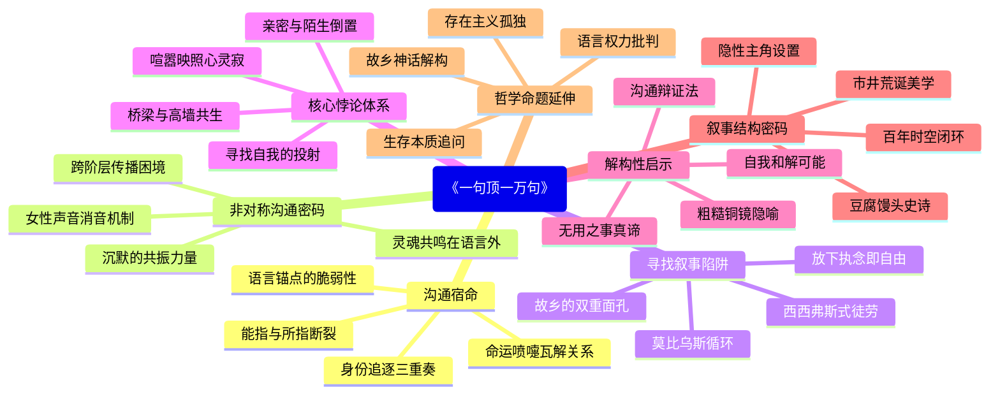

豆瓣链接：https://book.douban.com/subject/36062390/

# 深层解构

《一句顶一万句》通过横跨百年的“出延津”与“回延津”叙事，构建了一个关于人类沟通困境的精密寓言。在刘震云看似琐碎的市井烟火中，藏着三重值得深掘的思想矿藏：

### 一、基石：被命运嘲弄的沟通宿命
作者反复叩击的核心命题，是人类“求认同而不得”的永恒孤独。杨百顺三改其名（从杨百顺到杨摩西、吴摩西、罗长礼）的过程，本质是对“被看见”的绝望追逐——做豆腐、喊丧、种地、卖馒头，每个身份都是试图与世界建立联结的徒劳实验。这种困境在牛爱国身上形成镜像：寻找私奔妻子的旅程，最终沦为对“说得上话”的幻影追溯。

**隐藏的信念**：作者认为，语言天生具有“能指与所指的断裂性”。书中人物越试图通过改名、职业、婚姻证明自己，越暴露语言作为身份锚点的脆弱性。就像吴摩西弄丢养女巧玲的瞬间，所有试图用语言编织的关系网，终究抵不过命运的一个喷嚏。

### 二、边缘：被忽视的“非对称沟通”密码
书中两处轻描淡写的细节，暴露出沟通困境的深层结构：
- **阶层隔阂的失语**：老詹神父用拉丁语传教二十年，最终在延津只发展出一个信徒杨摩西。这个宗教传播的失败案例，暗示着跨阶层沟通的本质困境——当语言成为文化权力的符号，底层人听到的不是福音，而是另一种Noise。
- **女性声音的消音**：曹青娥（巧玲）作为贯穿上下部的隐形主角，她的内心独白始终通过“别人口中的故事”间接呈现。这种叙事选择揭示出：在男权话语主导的社会结构中，女性的真实诉求往往被转化为他人叙事的注脚。

**思想曲线的延伸**：刘震云无意中触达了“沟通中的沉默比话语更具力量”的命题。当吴摩西对着茫茫旷野喊出“说得着”时，那个未被记录的声波，或许比他一生的絮絮叨叨更接近沟通的本质——有些灵魂共振，本就发生在语言之外。

### 三、暗流：未被审视的“寻找”叙事陷阱
全书最危险的假设，藏在“寻找”这个核心动作里：
- **循环叙事的隐喻**：从杨百顺找老婆到牛爱国找相好，两代人的“出走-寻找”构成莫比乌斯环。作者默认“寻找=救赎”，却未追问：当寻找本身成为生存的意义，是否反而陷入了新的枷锁？就像希腊神话中的西西弗斯，推石上山的重复劳作，究竟是反抗还是妥协？
- **故乡神话的解构**：延津作为“根”的象征，在书中呈现出双重面孔——离开时是困局，归来时是虚空。这种矛盾暗示着：人类对“故乡”的执念，可能只是对现实困境的精神逃逸。当牛爱国站在延津土地上，他寻找的与其说是“故乡”，不如说是“想象中的故乡”。

**思维的陷阱**：作者用三十年写“出延津”，用三十年写“回延津”，却没告诉读者：或许真正的自由，在于放下“必须找到”的执念。就像老汪那句“活着是为了做无用的事”，当我们不再把沟通视为拯救孤独的解药，或许才能窥见人性更本真的模样。

### 解码者的启示：当我们在书中看见什么？
合上书页时，真正值得咀嚼的不是故事本身，而是刘震云在字里行间埋下的“沟通辩证法”：
- 最亲密的人往往最说不上话（吴摩西与妻子、牛爱国与母亲），最陌生的人反而能触发灵魂共振（杨百顺与喊丧人罗长礼）；
- 语言既是联结的桥梁，也是隔阂的高墙——杨摩西靠模仿罗长礼的嗓音谋生，却在成为“罗长礼”的瞬间弄丢了自己；
- 寻找的终极悖论在于：当你以为在找某个人，其实是在找那个“愿意听你说话的自己”。

这本书真正的价值，在于用百万字的喧嚣，写出了人类心灵的寂静。它像一面粗糙的铜镜，让每个读者照见自己在人群中张皇四顾的模样——原来我们终其一生，都在寻找那个“一句话能顶一万句”的人，却忘了：或许最珍贵的沟通，发生在与自己和解的瞬间。

# 章节内容
### 关键情节描述
《一句顶一万句》围绕着杨百顺（后名吴摩西、罗长礼）与牛爱国的人生轨迹展开，展现了普通人在时代洪流中的命运沉浮与心灵挣扎。

上部“出延津记”从杨百顺的童年讲起。他的父亲老杨卖豆腐，他对做豆腐毫无兴趣，渴望上学却未能如愿。后被老詹神父收为教徒改名杨摩西。杨摩西在老詹的安排下学做木工，却因师傅师娘的刁难而离开。他偶然得到给县长种菜的机会，却因一个尿壶被县长夫人误解而丢了工作。之后经人说媒，入赘到馒头铺的吴香香家，改名吴摩西。吴香香与他人私奔，吴摩西带着她和前夫的女儿巧玲寻找，途中巧玲被人贩子拐走，绝望的吴摩西决定离开延津，从此以罗长礼之名生活。

下部“回延津记”时间来到现代。巧玲被卖到陕西后成为曹青娥，她的儿子牛爱国经历了与妻子庞丽娜婚姻的破裂。庞丽娜与他人关系暧昧，牛爱国假意寻找妻子，实则内心迷茫。他在这个过程中想起自己曾经的相好，也想起母亲曹青娥念叨的老家延津，于是踏上回延津的路途。书中人物在各自的人生道路上不断面临着家庭、友情、爱情的困境，他们努力寻找着能理解自己、与自己说得上话的人，却总是在命运的捉弄下失之交臂，在孤独与无奈中前行。

### 重点句子摘录
1. “不拿你当朋友的，你赶着巴结了一辈子；拿你当朋友的，你倒不往心里去。经心活了一辈子，活出个朋友吗？”
2. “因为在他看来，所有人都生错了年头；所有人每天干的，都不是命里该有的，奔也是白奔；所有人的命，都和他这个人别着劲和岔着道。”
3. “病相同，人却不同；不同的人，开同样的方子，药也未必管用。”
4. “从今儿起，不论穷富，有不嫌儿少一只耳垂的，只要真心跟儿过日子，我就嫁给他。儿的短处说到明处，一辈子没有把柄在谁手里。儿知道啥事得看人的内心。可世上啥最毒？就是人的心。人心毒不是说它狠，是说大家遇事都不往好处想，盼着事坏。”
5. “说起来，富贵贫贱如流水，富贵未必不烦恼，贫贱未必不是好夫妻。只要心气顺，吃口窝头也安然。”
6. “平时说一千句坏话无碍，关键时候说人一句坏话，就把一个人变成了另一个人。”
7. “但时间长了发现，同来的往往有隔阂，过去相互不认识的，处着处着倒能成为朋友。”
8. “与亲兄弟说不着，路上与朋友倒说得着。这时贩葱就不单是贩葱，还为个说得着。”
9. “除了不与人拉帮结派，招惹是非，也学会了吃亏。人支使他，他便放下种菜的活儿，替人去干分外的杂事；肚子里骂人，面上不带出来，仍乐呵呵的。”
10. “一开始觉得没有话说是两人不爱说话，后来发现不爱说话和没话说是两回事。不爱说话是心里还有话，没话说是干脆什么都没有了。”
11. “曹青娥在牛家庄生活了二十年，早已将丈夫牛书道掰扯过来。两人不再吵架。但这时的牛书道，成了已经去世的襄垣县温家庄的老曹，曹青娥成了老曹老婆。曹青娥这时才明白，人是掰扯不得的，掰扯了别人，就是掰扯了自己。”
12. “人是掰扯不得的，掰扯了别人，就是掰扯了自己。”
13. “遇到大事千万别把自个儿的命运，拴在别人身上。”
14. “世上的事情件件藏着委屈。”
15. “过日子是过以后，不是过从前。”

好的，文学家为您解读刘震云的《一句顶一万句》。

## 1. 基础信息

*   **作者背景：** 刘震云，当代作家，属于现实主义流派，以描写中国社会现实，关注小人物命运见长。代表作有《故乡天下黄花》《我不是潘金莲》等。
*   **创作背景：** 本书创作历时多年，反映了中国社会转型时期，普通民众在时代变迁中的困惑与挣扎。也与作者本人对社会底层人民的关注和对人与人之间沟通障碍的思考有关。
*   **版本信息：** 初版于2009年，后有多个版本。2022年花城出版社的版本是较新的版本之一。

## 2. 主题架构

*   **核心主题：** 寻找、孤独、沟通。
*   **子主题网络：**

    ```mermaid
    graph TD
        A[一句顶一万句] --> B(寻找)
        A --> C(孤独)
        A --> D(沟通)
        B --> B1(寻找说得上话的人)
        B --> B2(寻找自我身份)
        C --> C1(个体在社会中的孤立)
        C --> C2(情感的缺失与疏离)
        D --> D1(语言的无力与误解)
        D --> D2(人与人之间的理解与 empathy)
    ```
*   **主题呈现方式：** 通过人物的命运和情节的演进，展现了在社会变迁中，人们对于理解和被理解的渴望。书名本身就是一种象征，即一句真诚的话语，胜过千言万语的空洞。

## 3. 人物系统

*   **人物关系图谱：**

    ```mermaid
    graph LR
        A[杨百顺/吴摩西/罗长礼] --> B(吴香香)
        A --> C(巧玲/曹青娥)
        C --> D(牛爱国)
        B --婚外情--> E(老姜)
        D --寻找--> F(李雪莲)
    ```

    箭头表示人物之间的互动关系，例如婚姻、寻找等。
*   **角色弧光分析：**

    *   **杨百顺/吴摩西/罗长礼：** 从最初的茫然无措，到为了寻找说得上话的人而不断漂泊，最终以罗长礼的身份孤独终老。
    *   **牛爱国：** 从寻找妻子，到最终理解了生活的真谛，完成了自我救赎。
*   **人物象征意义：** 结合荣格原型理论：

    *   **杨百顺/吴摩西/罗长礼：** 象征着“流浪者”原型，一生都在寻找归属感和自我认同。
    *   **牛爱国：** 象征着“英雄”原型，通过寻找和自我反思，最终完成了成长。

## 4. 叙事结构

*   **时间线分析：** 小说采用双线叙事结构，通过“出延津记”和“回延津记”两条线索，讲述了两个不同时代的故事，最终汇聚成一个关于寻找和孤独的永恒主题。
*   **情节动力学：** 可以用“英雄之旅”模型来分析牛爱国的故事，他经历了“启程”、“考验”、“回归”等阶段，最终获得了内心的平静。
*   **悬念设置手法：** 作者善于运用“契诃夫之枪”的手法，例如，小说中一些看似不经意的细节，最终都成为了推动情节发展的关键因素。

## 5. 文学技法

*   **语言风格：** 刘震云的语言朴实幽默，充满乡土气息，善于运用口语化的表达，使人物形象更加鲜活。
*   **意象体系：** “延津”是一个重要的意象，象征着故乡和根，也象征着一种无法摆脱的命运。
*   **视角选择：** 小说主要采用全知视角，可以自由切换于不同人物之间，展现他们的内心世界。

## 6. 思想深度

*   **哲学命题探讨：** 小说探讨了存在主义的孤独和荒诞感，以及人与人之间沟通的困境。
*   **社会批判维度：** 小说对中国社会转型时期的一些社会问题进行了批判，例如城乡差距、道德沦丧等。
*   **人性洞察层面：** 小说展现了人性的复杂性，既有善良和希望，也有自私和无奈。

## 7. 文学史坐标

*   **所属文学运动：** 《一句顶一万句》属于新现实主义文学，关注社会现实，描写小人物的命运。
*   **对后世影响：** 刘震云的作品对当代文学产生了重要影响，他的叙事风格和对社会问题的关注，影响了许多后来的作家。
*   **与同期作品比较：**

    1.  **《活着》余华：** 同样关注小人物在时代变迁中的命运，但《活着》更加悲情和残酷。
    2.  **《白鹿原》陈忠实：** 描写了中国农村的变迁，但《白鹿原》更加宏大和历史化。
    3.  **《尘埃落定》阿来：** 展现了藏族地区的历史和文化，但《尘埃落定》更具有地域特色。

## 8. 读者互动

*   **开放式结局解读可能性：** 小说的结局并没有明确交代牛爱国最终是否找到了真正说得上话的人，这给读者留下了想象空间。一种解读是，牛爱国最终在寻找的过程中，找到了自我，实现了内心的平静。
*   **争议性观点梳理：** 有评论认为，小说过于关注底层人民的苦难，缺乏对社会进步的肯定。
*   **跨媒介改编分析：** 《一句顶一万句》被改编成电影，电影在叙事结构和人物塑造上与原著有所不同，但都表达了对人与人之间沟通的渴望。

Citations:
[1] https://book.douban.com/subject/36062390/

---
来自 Perplexity 的回答: pplx.ai/share


### 上部：出延津记  
**核心内容总结**：  
上部以杨百顺的人生轨迹为主线，展现其在延津的生存困境与精神孤独。杨百顺出身底层，卖豆腐、学杀猪、挑水等营生皆不顺，三次改名（杨摩西、吴摩西）象征其不断寻找身份认同却始终迷失。他因尿壶得罪县长后入赘馒头铺，娶吴香香为妻，却因“说不着”的婚姻陷入压抑。妻子与屠户私奔后，他带着养女巧玲踏上寻妻之路，途中却不慎丢失巧玲，最终彻底对故乡失望，冒用喊丧人罗长礼的身份离开延津。  

**作者关键论点与主张**：  
1. **“说得着”与生存本质**：书中人物的行动驱动力皆源于“能否说上话”，杨百顺改名、入赘、寻妻，本质是寻找精神共鸣。老詹传教时说“信主是为了找个能说话的”，点出底层对情感连接的渴求。  
2. **身份异化与孤独循环**：每次改名都是对自我的剥离，从“杨百顺”到“罗长礼”，最终活成他人影子，暗示个体在世俗压力下的自我迷失。吴摩西丢巧玲的情节，将“寻找”推向荒诞——寻找他人时弄丢了更重要的羁绊。  
3. **生活的荒诞性**：吴摩西寻妻途中，众人对私奔的态度从“指责”转为“猎奇”，体现底层对他人痛苦的漠视；喊丧职业的设定，以“替死人说话”反讽活人世界的沉默，强化“活着即孤独”的主题。  


### 下部：回延津记  
**核心内容总结**：  
下部以巧玲（曹青娥）的后代牛爱国为主角，形成跨时空的命运呼应。巧玲被卖山西后改名曹青娥，嫁牛书道生子牛爱国。牛爱国婚姻失败，妻子庞丽娜私奔，他在寻妻过程中逐渐揭开母亲的身世之谜，最终返回延津寻找“来处”。两代人的“寻找”形成闭环：吴摩西因孤独离开延津，牛爱国因孤独返回延津，却发现物是人非，唯有孤独永恒。  

**作者关键论点与主张**：  
4. **代际孤独的传承**：曹青娥模仿亡父唠叨，最终明白“掰扯别人就是掰扯自己”，暗示试图改变他人的徒劳；牛爱国重复祖辈“寻而不得”的命运，体现孤独的遗传性与普遍性。  
5. **“寻找”的悖论**：牛爱国寻妻途中，从“愤怒报复”到“理解释然”，最终在延津故地的废墟中意识到“寻找的不是人，而是说得上话的念想”。刘震云借此解构“寻找”的意义——过程本身即为生存动力。  
6. **故乡的精神象征**：延津在上部是“逃离之地”，在下部是“归乡之锚”，但其内核始终是“说不着”的孤独载体。曹青娥临终未提延津，牛爱国却因母亲的模糊记忆踏上归途，体现故乡作为情感符号的复杂意义。  


### 结构与主题统合  
全书以“一出一进”的环形结构，将百年时光压缩在两代人的命运中，核心始终围绕“人与人能否沟通”的终极命题。刘震云通过底层小人物的婚丧嫁娶、迁徙流离，揭示中国人“孤独至死”的生存真相：表面是找一个“说得着”的人，本质是寻找存在的共鸣与认同。书中没有宏大叙事，却以“豆腐、馒头、喊丧”等细节堆砌出震撼人心的真实，让个体的孤独成为跨越时代的集体隐喻。