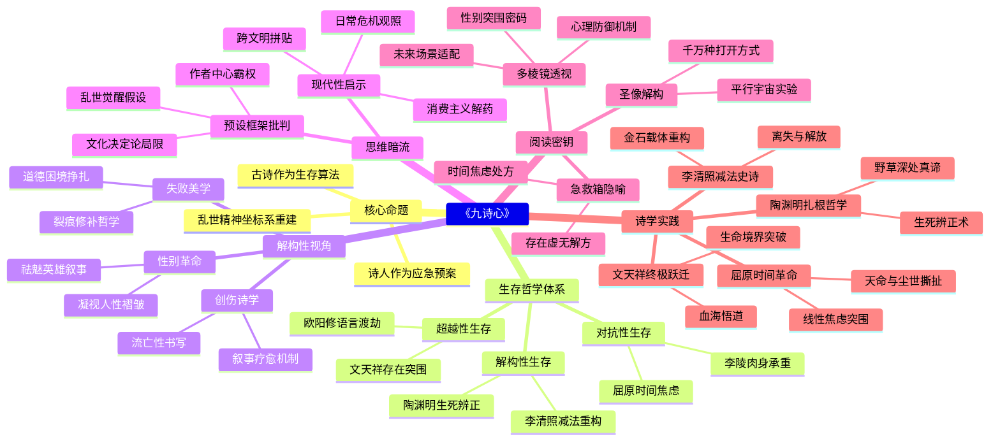

豆瓣链接：https://book.douban.com/subject/37077202/

# 深层解构

# 《九诗心》深度解码：在古诗中寻找现代人的精神锚点
## 一、基石：乱世中精神坐标的重建
作者黄晓丹的核心信念，藏在对九位诗人的选择逻辑里——**他们都是传统价值体系崩塌时的「精神幸存者」**。从屈原面对线性时间带来的焦虑，到吴梅村以艳诗完成自我救赎，全书反复叩问一个命题：**当外部秩序瓦解时，人如何在精神废墟上重建「活着的理由」**？

这里有三个递进的生存哲学：
1. **对抗性生存**（屈原、李陵）：以极端的美与承受力对抗世界的荒诞，如屈原「向天国和历史寻找永恒」，李陵在「无神可求」的绝境中以肉身硬扛命运。
2. **解构性生存**（陶渊明、李清照）：陶渊明把「归园田」视为「野草深处是坟冢」的清醒解构，李清照在《金石录后序》中用「残忍的减法」重构生命重量。
3. **超越性生存**（文天祥、欧阳修）：欧阳修借语言的道德感召力完成「舍筏登岸」的境界跃迁，文天祥在「零丁洋的血海」中悟到「大光明」的存在主义突围。

**核心低语**：作者真正想告诉读者的是——**古诗不是博物馆里的标本，而是乱世中「稳定精神坐标系」的算法**。每个诗人都是一种「精神应急预案」，教我们在时代震荡中校准心灵的陀螺仪。

## 二、边缘：被轻拂过的思想闪电
### 1. **女性视角的隐秘革命**
文档提到「细腻文笔，女性视角，看见诗人的『另一面』」，但未展开的是：黄晓丹的解读自带「去英雄化」的性别意识。她剥离了传统文学史对屈原「忠君」、文天祥「殉国」的宏大叙事，转而凝视他们作为「人」的脆弱——屈原「在永恒门口跌入尘埃」，文天祥「北行路上的迤逦梦途」。这种视角暗合当代叙事学对「英雄神话」的解构，**将圣贤拉下神坛，让他们成为与读者平等的「精神同路人」**。

### 2. **未被命名的「创伤诗学」**
书中多次提到诗人在「时代变动的阵痛」中的创作，但未明确提出的是：**这些作品本质上是「创伤的转化性表达」**。如李陵的「流亡性」诗歌，在佛教尚未传入的汉代，只能以「挺身承受」的原始力量对抗存在之轻，这种「无解脱之药」的书写，恰与现代创伤理论中「通过叙事完成疗愈」的机制遥相呼应。作者无意中触碰了一个跨时空命题：**文学始终是人类处理集体创伤的古老算法**。

### 3. **被忽视的「失败美学」**
吴梅村的「艳诗自赎」章节藏着全书最尖锐的洞见：**当宏大理想崩塌时，个体的「小忏悔」可能比「大英雄」更具人性光芒**。作者写吴梅村「此生终负卿卿」的愧疚，实则在解构传统「气节叙事」，暗示**道德困境中的挣扎比完美人设更接近真实的人性光谱**。这束微光指向一个危险的命题：**或许我们需要重新定义「精神突围」——它不必是悲壮的殉道，也可以是带着裂痕的自我修补**。

## 三、暗流：未被审视的思维前提
### 1. **「乱世=精神觉醒」的隐性假设**
全书默认「时代动荡」是催生深刻思考的必要条件，却未反思：**和平年代的精神困境是否同样需要文学启明？** 这种对「乱世」的偏爱，可能源于中国文学传统中「穷而后工」的审美惯性，但也悄悄排除了对日常性精神危机的观照——比如当代人在消费主义中的空心化，是否能从王维的「辋川闲居」中找到答案？作者的选择暗含**「痛苦优先」的思维定式**，这或许是传统文学研究的集体无意识。

### 2. **「古诗=解药」的文化决定论**
书中坚信古诗能回应「当下的时代变局」，但未深究：**传统文化资源是否可能成为认知的枷锁？** 例如，用陶渊明的「重建生命」对应现代人的存在焦虑，固然提供了一种解法，但也可能遮蔽其他文明（如存在主义哲学、心理学）的可能性。这种「以古解今」的路径，**预设了中华文化的自足性**，却忽略了现代性困境的复杂性——它可能需要跨文明的思想拼贴，而非单一传统的回归。

### 3. **「作者中心」的解读霸权**
黄晓丹的「文本细读」带着强烈的主体性，如将曹丕的「乐极哀情」解读为「死亡与文学纪念碑」，虽精妙却可能忽略其他阐释空间。这种解读背后藏着一个未明说的前提：**作者有权为诗人的心灵立法**。但事实上，文学阐释本应是读者与文本的对话，**当我们过于依赖「学者视角」时，可能会错过民间记忆、大众想象对古诗的再创造**——比如李清照在当代文化中的「女性主义符号」身份，就远超书中「离失史诗」的定位。

## 四、给读者的三把钥匙
### 1. **原来这本书真正在说...**
它表面在讲古诗，实则在构建**「现代人的精神急救箱」**。每位诗人都是一粒「思想药片」：屈原治「时间焦虑症」，陶渊明治「存在虚无症」，李清照治「丧失创伤症」。读此书的终极意义，是学会从古人的精神病历中，找到属于自己的「心理处方」。

### 2. **如果换个角度看...**
- **用心理学视角**：把九位诗人看作「人格原型」，分析他们的「防御机制」（如欧阳修用「语言的道德感」抵御贬谪创伤，类似心理学中的「升华」）。
- **用性别视角**：追问为何书中唯一女性诗人李清照的「冒犯与解放」被单独标出？这是否暗示传统文学中女性精神突围的特殊性？
- **用未来视角**：思考书中的「生存智慧」如何植入元宇宙、AI时代的精神困境——比如陶渊明的「极简生活观」对消费主义的启示。

### 3. **作者可能没意识到...**
她在解构传统英雄叙事的同时，**悄悄塑造了新的「精神圣像」**。九位诗人虽被赋予「人性褶皱」，但本质上仍被视为「精神导师」。或许真正的现代阅读，应放下「求救赎」的心态，把古诗当作「平行宇宙的生存实验」——不必模仿他们的活法，只需借他们的眼睛，看见人生有千万种打开方式。

## 结语：在「舍筏」与「登岸」之间
《九诗心》的终极价值，不在于提供答案，而在于教会我们**在「渡海」时珍惜船只（传统智慧），又在「登岸」后放下执念（不困于古法）**。正如欧阳修的「舍筏登岸」比喻：**文学的真正启明，是让我们在别人的精神地图上，标出属于自己的坐标**。当你合上书卷时，或许会突然明白：那些穿越千年的诗心，从来不是用来仰望的星辰，而是照见自己灵魂褶皱的镜子。

# 章节内容
### 屈原：时间的焦虑
作者认为屈原处于神话时代向理性时代过渡阶段，此时人们对世界和时间的认知发生巨变，屈原作品中体现出这种变化带来的时间焦虑。在神话起效时代，祭祀乐歌不应有诸多遗憾哀伤，但《九歌》呈现出时间错位、失序与忧伤，反映出神话时代的失落进程。

《离骚》打破环形时间观，前几句介绍屈原身世和特殊生辰，暗示其使命不同寻常，名字也源于天命。屈原面对时代变革，没有逃避，而是认领了生命的短暂、无依与平凡，成为理性时代人类的榜样。他在诗中向天国和历史寻找永恒，却最终在现实中跌入尘埃，但这一过程展现出人类在面对命运时的艰难与尊严。这种对时间和生命的思考，使屈原的作品具有独特魅力，也反映了当时社会的巨大变迁。

### 李陵：流亡的孤独
作者指出，李陵背负着世界的恶意生活，他有着三重孤独：作为武将战败投降，被汉朝抛弃；身处匈奴，却不被匈奴真正接纳；内心的痛苦与情感无人倾诉。在当时，被儒家价值体系摒弃后，人们缺乏后世诗歌中常见的解脱方案，只能以肉身对抗痛苦。

“苏李诗”具有“流亡性”，即便其是否为李陵所写存疑，但也代表了晋朝及以前人们对李陵事件的看法。李陵在胡地的孤独，通过其《答苏武书》中对听觉的描写展现得淋漓尽致，他越过匈奴帐篷内的欢乐，听到的是北国的荒凉和无尽孤独，却又得不到汉朝的消息。然而，李陵仍有挺身承受的力量，面对汉朝使臣的劝归，他一句“丈夫不能再辱”，展现出他复杂而坚韧的内心世界，这种孤独与力量使他成为真正的流亡者形象。

### 曹丕：乐极的哀情
建安二十二年的瘟疫给人们带来巨大冲击，也影响了曹丕的思想。作者认为，曹丕在早期是贵公子，享受着生活的乐趣，这在他的第一封信中有所体现；但瘟疫导致许多人死亡，让他开始思考死亡与文学的意义，第二封信中流露出对生命无常的感慨。

曹丕将人生比作如墙头蒿草、风中高树般脆弱，意识到未有不亡之国，亦无不掘之墓。他敢于直面生命的脆弱与无常，并通过文字表达出来，这种对生死兴亡的坦然，使他的文学作品具有震撼人心的力量。他在文学创作中展现出的对生命的思考，不仅仅是个人情感的抒发，更反映了那个时代人们对生命的普遍认知和忧虑，为建安文学增添了独特的情感色彩。

### 陶渊明：生死的辨正
作者认为陶渊明在诗歌中对死亡的态度有别于常人，他对死亡的好奇超过恐惧，死亡成为他放大生命价值的工具。陶渊明笔下的耕种是真实的劳作经验，这与现代人们将其视为象征有所不同。

在诗中，一个春日和一个夏夜的场景，展现出他对生活的感悟；他不再渴望天际的归鸟，而是回归田园，发现野草深处是坟冢，从一棵豆苗的生长中体会到生生之乐。陶渊明在对死亡的勇敢直面中，重建了生命，突破了魏晋时代普遍的“人生如流”和“人生如寄”的观念，发展出“人生如植”的观念，强调生命如同植物扎根土地，在平凡的生活中寻找生命的意义和价值。 

### 杜甫：生活的慰藉
作者通过解读杜甫的诗歌，展现其在不同时期、不同地点从生活中寻找慰藉的过程。春天的景象在杜甫诗中是一种奇迹，给人带来希望；长安的鄜州月、洛阳的紫荆树与“旧犬”、成都的老妻与鸬鹚等，这些生活中的事物都成为他情感的寄托。

面对生活的痛苦和绝望，杜甫以独特的视角看待现实，如以鸟的眼光重看一遍现实，使现实呈现出可堪欣悦的一面。他独自处理了更大的时代命题，即如何面对黄金时代已经永远过去的事实。杜甫的诗歌证明了即便没有希望，生活中依然存在慰藉，这不仅体现了他个人的乐观与坚韧，也为后人在面对困境时提供了思考和借鉴。 

### 欧阳修：语言的力量
欧阳修的贬谪诗不再哀怨，而是展现出具有道德感召力的语言力量。作者认为，欧阳修在青春时期是洛阳的狂生，充满活力与激情；他的永叔词在别离主题上表达热烈，展现出丰富的情感世界。

晚年的欧阳修与世界渐行渐远，经历了四个看似无关的梦，这些都反映出他内心的变化。他在文学创作中，将个人经历与情感融入语言，使语言具有强大的感染力和影响力。他通过文字表达自己对生活、政治、情感等方面的看法，不仅展现了自己的思想境界，也对后世文学创作在语言运用和情感表达上产生了积极影响。 

### 李清照：离失的史诗
作者通过分析李清照的《金石录后序》，指出历史中关于她和赵明诚爱情的文献证据较少，二人并非传统认知中的神仙眷侣，他们之间的情感更多是以收藏为载体的共同神游。

南渡使李清照的生活发生巨变，时间仿佛忽然涌入，她经历了丈夫离世和金石收藏丧失的痛苦。李清照在这一过程中遭受诸多磨难，“再嫁污名”也给她带来困扰，但作者认为这一系列遭遇成为她自我解放的契机。她在作品中追忆文学的壮丽，其词作反映出时代的离乱和个人命运的起伏，宛如一部离失的史诗，展现出女性在困境中的坚韧与文学才华。 

### 文天祥：英雄的省思
作者从南宋末年的崖山海战讲起，文天祥在这场战役后面对元军劝降，写下《过零丁洋》，但这并非他精神的终点，而是探索的起点。此后他经历了巨大反转，在北行路上，他面临宋朝覆灭后赴死是否有意义的困惑。

在狱中，文天祥写下《逢有道者》，诗中的顿悟标志着他突破传统士大夫的精神框架，达到与天地精神往来的境界，完成从“伦理境界”到“生命境界”的飞跃。从千年尺度来看，他生命的最后四年虽对历史进程影响不大，但他的精神和心灵不断成长，其诗作让后世对宋亡后的历史有了更多理解，展现出英雄在困境中对生命和信仰的深刻省思。 

### 吴梅村：艳诗的自赎
作者以吴梅村与卞赛的爱情关系为线索展开叙述。初见时，描绘了秦淮最后的艳情，展现出晚明时期的风情；重遇时，体现出一种“脆弱的力量”，反映出两人情感的复杂与深沉。

诀别时，吴梅村深感此生终负卞赛，内心充满愧疚。访墓过程则是他寻找美善与自由的过程，在这段感情中，展现出小人物心灵之光。吴梅村的艳诗背后，有着他对爱情、人生的思考和自我救赎，他通过文学创作，将个人情感与时代背景相融合，其作品不仅仅是对爱情的描述，更反映了那个时代人们的情感世界和精神追求。 