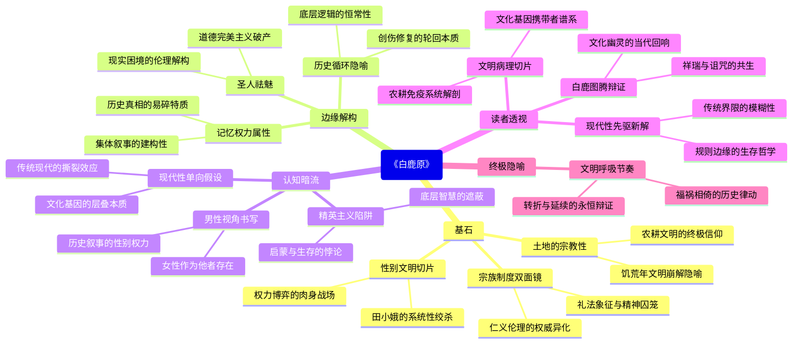

豆瓣链接：https://book.douban.com/subject/10564071/

# 深层解构

### 《白鹿原》深层解码：在历史褶皱里寻找文明的胎记

#### **一、基石：被反复摩挲的文明密码**  
陈忠实的笔触始终缠绕着一个**文化脐带**——**传统农耕文明的灵与肉**。  
- **宗族制度的双面镜**：  
  白嘉轩的腰杆是礼法的象征，祠堂既是秩序堡垒，也是精神囚笼。作者反复叩问：当"仁义"沦为族长权威的注脚（如白孝文被逐出祠堂），传统伦理究竟是文明的骨架，还是专制的皮囊？  
- **土地的宗教性**：  
  鹿子霖在田地里打滚的狂喜，黑娃返乡务农的顿悟，都在诉说**土地才是终极的宗教**。书中最震撼的不是政治风暴，而是饥荒年"人相食"的惨烈——当土地背叛人类时，所有文明建构都将崩解。  
- **性别作为文明切片**：  
  田小娥的悲剧不是个人命运，而是**传统文明对生命力的系统性绞杀**。她的肉身成为各种权力争夺的战场，最终被镇压在六棱塔下，恰似被封存的原始欲望与文明禁忌的永恒博弈。

**核心低语**：作者用家族史作手术刀，解剖的是**农业文明在现代性冲击下的基因重组**。白姓与鹿姓的争斗，本质是"耕读传家"与"投机取巧"两种生存哲学的千年战争。

#### **二、边缘：思想曲线外的闪电**  
那些看似轻描淡写的段落，藏着颠覆认知的惊雷：  
- **圣人的祛魅**：  
  书中直言"圣人的哲理只有圣人能做到"，解构了传统伦理的普适性。白嘉轩践行"耕读传家"却痛失长子，鹿子霖违背礼法却仕途顺遂，暗示**道德完美主义在现实中的破产**。  
- **历史的循环性隐喻**：  
  "牛车陷坑又继续滚动"的比喻，道破历史的本质不是线性进步，而是**创伤与修复的轮回**。辛亥革命、抗日战争、土地改革……每次变革都像换车轴，但底层生存逻辑始终未变。  
- **记忆的权力属性**：  
  "灾祸摧毁记忆，传说经久不衰"揭示：**历史真相是易碎品，集体记忆是被建构的叙事**。冷先生的药方、朱先生的预言，都是特定视角下的"历史滤镜"。

**边缘洞见**：当我们为宏大叙事热血沸腾时，作者提醒——**每个历史转折点的尘埃里，都藏着未被记录的千万种活法**。鹿三的镰刀、田小娥的窑洞、白灵的剪发，才是文明演进的神经末梢。

#### **三、暗流：沉默的逻辑地基**  
作者未明说的前提，构成了叙事的隐形框架：  
- **男性视角的历史书写**：  
  全书几乎以男性为叙事核心，女性始终是被凝视的"他者"。田小娥、白灵、孝文媳妇……她们的声音被消音，暗示**传统历史本身就是男性权力的产物**。  
- **精英主义的悲悯陷阱**：  
  朱先生的"学为好人"充满知识分子的救世情怀，但黑娃的"学为好人"却以死亡告终。作者潜意识里或许认为：**底层的觉醒需要精英启蒙，却忽略了民众自身的生存智慧**。  
- **现代性的单向度假设**：  
  书中对新思潮（如白灵的革命）的描写略显平面化，仿佛传统与现代是二元对立。但鹿兆鹏的纠结、鹿兆海的迷茫，其实暗示**现代性本身也在撕裂着试图拥抱它的人**。

**暗流警示**：当我们为"传统VS现代"的二元对立鼓掌时，或许正陷入作者未察觉的思维窠臼——文明的演进从来不是非此即彼，而是像白鹿原的黄土一样，层层叠叠埋着不同时代的种子。

#### **四、给读者的X光片**  
- **一个顿悟**：  
  **《白鹿原》不是家族史诗，而是文明的病理切片**。每个角色都是文化基因的携带者：白嘉轩是礼法的抗体，鹿子霖是欲望的载体，朱先生是理想的疫苗，他们共同构成了农耕文明的免疫系统。  
- **一个惊喜**：  
  换个角度看，鹿子霖才是真正的"现代性先驱"。他摒弃虚文，直接与权力、利益接轨，像极了当代社会中那些游走于规则边缘的"成功人士"。传统与现代的界限，远比我们想象的模糊。  
- **一个发现**：  
  陈忠实或许没意识到，他笔下的"白鹿"既是祥瑞也是诅咒。这个图腾般的存在，恰似传统文化的幽灵——我们既想摆脱它的束缚，又忍不住在困境中回望它的微光。

**终极叩问**：  
当我们合上这本书时，看见的不仅是白鹿原的五十年，更是中华文明的五千年。那些在历史中反复上演的福祸相倚、新旧纠缠，或许从来不是需要被解决的问题，而是文明本身的呼吸节奏。正如书中所言：**"好好活着！熬过去，就会开始新的转折。"**  
——这既是对个体命运的忠告，也是对文明演进的隐喻。

# 章节内容
好的，下面我将对陈忠实的《白鹿原》进行全面的文学分析，尽量覆盖书籍的关键信息。

### 1. 基础信息

*   **作者背景：** 陈忠实（1942-2016），当代作家，中国当代文学的代表人物之一。属于现实主义流派，他的作品扎根于中国农村的现实生活，以其深刻的社会洞察和对人性的探索而闻名。主要作品有《白鹿原》《信任》《告状》等。
*   **创作背景：** 《白鹿原》的创作历时六年，是陈忠实对家乡土地和历史的深刻反思。创作背景既有20世纪中国社会变革的历史大背景，也与作者个人的生活经历密切相关。
    *   历史事件：从清末到新中国成立的各个历史时期，包括辛亥革命、军阀混战、土地革命、抗日战争和解放战争等。这些历史事件对白鹿原的社会结构和人们的生活产生了深远的影响。
    *   个人经历：陈忠实生于陕西农村，对农村生活有着切身的体验和感受。他对农民的疾苦、土地的变迁以及传统文化的流失有着深刻的思考。
*   **版本信息：**
    *   初版时间：1993年首次出版。
    *   重要译本差异：存在多种译本，不同译本在语言风格和文化诠释上可能存在差异。需要具体分析不同译本的特点。

### 2. 主题架构

*   **核心主题：**
    *   土地与命运
    *   家族兴衰
    *   传统文化与现代变革
*   **子主题网络：**
    *   白鹿原
        *   土地制度 (耕作方式、地租剥削)
        *   宗族文化 (祠堂、族规、孝道)
        *   社会变革 (革命运动、政权更迭)
    *   白鹿两家
        *   家族传承 (婚姻、生育、家风)
        *   权力斗争 (族长地位、利益分配)
        *   命运兴衰 (历史选择、个人性格)
    *   人物群像
        *   农民 (勤劳、保守、迷信)
        *   知识分子 (理想、迷茫、抗争)
        *   当权者 (腐败、专制、压迫)
*   **主题呈现方式：**
    *   象征系统：
        *   白鹿：象征着祥瑞、正义和传统道德的力量。
        *   原：象征着土地、家园和生存的根基。
        *   祠堂：象征着宗族权力、传统文化和道德约束。
    *   叙事策略：
        *   历史叙事：以白鹿原的历史变迁为背景，展现中国社会近代的历史画卷。
        *   家族叙事：以白鹿两家的兴衰为主线，展现中国传统家族的命运沉浮。
        *   人物叙事：通过塑造不同的人物形象，展现人性的复杂和多样。

### 3. 人物系统

*   **人物关系图谱：**
    *   白嘉轩 ↔ 鹿子霖：族长之争，既合作又对抗
    *   白嘉轩 → 田小娥：道德审判，压迫与歧视
    *   鹿子霖 ↔ 田小娥：勾结利用，最终抛弃
    *   白孝文 → 田小娥：情欲沉沦，背叛与堕落
    *   黑娃 ↔ 田小娥：真挚爱情，反叛与悲剧
*   **角色弧光分析：**
    *   白嘉轩：从一个坚守传统道德的族长，到最终对现实产生困惑和无奈。
        *   关键转折点：休妻事件、白鹿原的灾难、对白孝文的失望。
    *   田小娥：从一个被压迫的女性，到追求自由和爱情的悲剧人物。
        *   关键转折点：被郭举人凌辱、与黑娃相爱、被鹿子霖利用。
    *   白孝文：从一个循规蹈矩的青年，到背叛家庭和道德的堕落者，再到最终的转变。
        *   关键转折点：与田小娥的私情、被父亲赶出家门、投靠军阀。
*   **人物象征意义：**
    *   白嘉轩：象征着传统道德、宗族权威和农民的坚守。
    *   田小娥：象征着被压迫的女性、对自由的渴望和人性的复杂。
    *   鹿子霖：象征着乡村的权谋、自私自利和传统文化的腐朽。
    *   黑娃：象征着农民的反抗精神、对自由的追求和理想主义的破灭。

### 4. 叙事结构

*   **时间线分析：** 线性叙事与非线性叙事相结合。
    *   以时间先后为顺序，讲述白鹿原的历史变迁和人物命运。
    *   穿插倒叙、插叙等手法，补充人物背景和事件细节。
*   **情节动力学：**
    *   三幕式结构：
        *   第一幕：白鹿原的平静生活被打破，人物关系逐渐展开。
        *   第二幕：社会变革和家族矛盾激化，人物命运发生转折。
        *   第三幕：历史走向新的阶段，人物命运尘埃落定。
*   **悬念设置手法：**
    *   红鲱鱼：设置一些干扰性的情节，误导读者对人物命运的判断。
    *   契诃夫之枪：埋下一些伏笔，为后来的情节发展做铺垫。例如，田小娥的出现，预示着白鹿原的道德危机和家族变故。

### 5. 文学技法

*   **语言风格：**
    *   质朴凝练，富有地方特色。
    *   运用大量的方言词汇和俚语，增强作品的乡土气息和真实感。
    *   隐喻密度较高，通过象征性的描写，表达深刻的社会和文化内涵。
*   **意象体系：**
    *   麦田：象征着丰收、希望和生命的轮回。
    *   祠堂：象征着宗族权力、传统文化和道德约束。
    *   风雪：象征着自然的力量、社会的动荡和人生的艰难。
*   **视角选择：**
    *   全知视角与 सीमित视角相结合。
    *   作者可以自由地进入人物的内心世界，展现人物的心理活动。
    *   同时，作者也 सीमित于某些人物的视角，保持叙事的客观性和悬念。

### 6. 思想深度

*   **哲学命题探讨：**
    *   宿命论：作品中充满了对命运的无奈和感叹，人物的命运似乎受到某种神秘力量的支配。
    *   文化批判：对中国传统文化的弊端进行了深刻的反思和批判，例如宗族制度、封建迷信、男权主义等。
*   **社会批判维度：**
    *   阶级分析：展现了不同阶级之间的矛盾和冲突，例如地主与农民、统治者与被统治者。
    *   性别分析：对女性在传统社会中的地位和命运进行了深刻的揭示和批判，例如田小娥的悲剧。
*   **人性洞察层面：**
    *   善恶二元：作品中的人物形象 complex而立体，既有善良的一面，也有邪恶的一面。
    *   异化主题：在社会变革和历史变迁中，人物的本性逐渐扭曲和异化，例如白孝文的堕落。
    *   例如，白嘉轩的固执和坚守，既体现了他的道德责任感，也导致了他对田小娥的残酷压迫。鹿子霖的精明和圆滑，既是他生存的手段，也是他道德沦丧的根源。

### 7. 文学史坐标

*   **所属文学运动：** 现实主义文学。
*   **对后世影响：**
    *   《白鹿原》是中国当代文学的重要作品，对后世产生了深远的影响。
    *   直接引用：许多作家在作品中借鉴了《白鹿原》的叙事手法和人物塑造。
    *   解构再创作：一些作家对《白鹿原》的主题和人物进行了新的解读和创作。
*   **与同期作品比较：**
    *   《平凡的世界》：同样以中国农村为背景，展现了社会变革和人性的力量。但《平凡的世界》更侧重于对普通人奋斗精神的赞扬，而《白鹿原》更侧重于对历史和文化的深刻反思。
    *   《活着》：同样讲述了个人在历史变迁中的命运沉浮。但《活着》更侧重于对生命的坚韧和苦难的承受，而《白鹿原》更侧重于对民族历史和文化的反思。
    *   《废都》：同样具有争议性，都对中国传统文化和道德进行了深刻的批判。但《废都》更侧重于对城市生活的描写和知识分子的精神困境，而《白鹿原》更侧重于对农村生活的描写和农民命运的关注。

### 8. 读者互动

*   **读者对结局的解读：**
    *   开放式结局，留给读者思考和想象的空间。
    *   对白鹿原的未来、人物的命运以及历史的走向，存在不同的解读。
    *   有人认为结局充满了希望，预示着新的开始；也有人认为结局充满了悲观，预示着传统的没落。
*   **争议性观点梳理：**
    *   对田小娥的评价：有人认为她是受害者，值得同情；也有人认为她是罪人，咎由自取。
    *   对白嘉轩的评价：有人认为他是道德的化身，是传统文化的守护者；也有人认为他是虚伪的卫道士，是封建思想的代表。
    *   对作品的价值：有人认为它是中国当代文学的经典之作，具有深刻的思想性和艺术性；也有人认为它存在一些缺陷，例如对女性的歧视、对历史的歪曲等。
*   **跨媒介改编分析：**
    *   电影版本：王全安导演的电影《白鹿原》对原著进行了大量的改编和删减，引发了争议。
    *   戏剧版本：孟京辉导演的话剧《白鹿原》以其独特的舞台表现和对原著的解构而备受关注。
    *   影视/戏剧版本在情节、人物和主题等方面都与原著存在差异。分析这些差异，可以更深入地理解原著的内涵和价值。

希望以上分析能够对您有所帮助。

Citations:
[1] https://book.douban.com/subject/1085799/

---
来自 Perplexity 的回答: pplx.ai/share