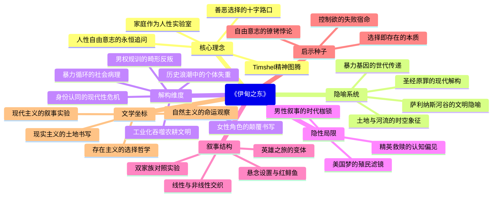

豆瓣链接：https://book.douban.com/subject/36710568/

# 深层解构

### 《伊甸之东》深层解码：在善恶的裂隙中瞥见人性的星光


#### **一、基石：被反复打磨的核心信念**  
斯坦贝克的创作支点，是对**人性自由意志的永恒追问**。他借萨利纳斯河谷的家族史诗，抛出一个近乎宗教性的命题：**人是否拥有超越原罪、选择善良的能力？**  
- **核心隐喻的双重性**：书名取自《圣经》该隐杀亚伯的典故，但斯坦贝克颠覆了“宿命论”——书中人物并非被动承受原罪，而是始终站在“选择”的十字路口。比如凯西的邪恶不是天生，而是她主动拥抱黑暗的结果；卡尔对父爱的渴求，最终在自我救赎中绽放光芒。作者通过反复强调“Timshel”（希伯来语“你可以选择”），将“自由意志”铸成本书的精神图腾。  
- **家庭作为人性实验室**：两个家族（特拉斯克与汉密尔顿）的对照，本质是“爱与控制”的实验场。亚当对儿子的盲目溺爱、塞勒斯对子女的操纵欲，折射出**爱的缺失比恨更具破坏力**——它会扭曲人性，让灵魂在荒芜中长出恶之花。斯坦贝克借此证明：真正的爱不是占有，而是赋予对方选择的勇气。  


#### **二、边缘：思想曲线的隐秘延伸**  
斯坦贝克在宏大叙事中埋下的微光，往往藏在看似不经意的细节里：  
- **历史浪潮中的个体失重感**：从南北战争到一战的半个世纪里，工业化、城市化如巨兽碾压传统乡村。汉密尔顿家族的衰落，恰似农业文明在现代性冲击下的缩影。作者轻描淡写的“时代变迁”，实则暗示：当社会快速迭代时，**个体的身份认同会成为漂泊的孤舟**，这正是卡尔等青年陷入精神困境的深层原因。  
- **女性角色的颠覆性书写**：凯西作为“恶女”形象，突破了传统文学中“蛇蝎美人”的扁平化设定。她的堕落不是为了衬托男性的正义，而是**以极端方式控诉男权社会对女性的规训**——当女性被剥夺教育、经济独立的权利时，畸形的权力关系必然催生畸变的人性。斯坦贝克对凯西的复杂刻画，暗含对性别平等的超前思考。  
- **集体无意识的暴力循环**：书中多次出现“暴力传承”的细节（如塞勒斯用军事化思维教育儿子），暗示**创伤会像基因一样在代际间传递**。这种“暴力的平庸化”描写，不仅指向家庭，更延伸至社会——当某个群体将伤害视为常态，文明的根基便岌岌可危。  


#### **三、暗流：未被言说的思维基石**  
斯坦贝克的叙事依赖于两个隐形前提，却未对其彻底审视：  
- **美国梦的浪漫化滤镜**：汉密尔顿家族的拓荒史被赋予诗意，但作者回避了“西部开拓”背后的殖民暴力。这种对“奋斗叙事”的默认，折射出美国主流文化对历史原罪的集体缄默——正如该隐的血迹被泥土掩盖，书中的“理想主义”始终漂浮在真实的社会矛盾之上。  
- **男性视角的局限性**：尽管刻画了凯西、阿比盖尔等复杂女性，但全书的核心冲突仍围绕男性（父子、兄弟）展开。斯坦贝克无意识中延续了“男性主导历史”的传统叙事，忽视了女性在家族命运中可能扮演的主动角色——这种视角盲区，恰是其所处时代的文化枷锁。  
- **救赎的精英主义倾向**：书中的“觉醒者”（如李、山姆）多为智慧长者或外来者，普通民众往往陷入蒙昧。这种设定暗含**“救赎需要先知指引”的精英逻辑**，而低估了普通人自我觉醒的可能性，暴露出作者对大众文化的潜在不信任。  


### **给读者的三颗启示之种**  
1. **顿悟**：  
   这本书真正在说的，不是家族恩怨或历史史诗，而是**每个灵魂都在进行的“选择之战”**。斯坦贝克用百万字证明：善恶不是刻在基因里的代码，而是你每天清晨醒来时，对自己许下的无声承诺。  

2. **惊喜**：  
   如果换个角度看，《伊甸之东》也是一部**“失败之书”**——几乎所有试图控制他人的角色（亚当、塞勒斯、凯西）都走向了悲剧。它暗示：真正的爱与成长，始于承认“我们永远无法掌控他人”，只能成为自己的光。  

3. **发现**：  
   斯坦贝克可能没意识到，他笔下的“自由意志”本身就是一种悖论——当卡尔在雪夜中奔跑着送钱给父亲时，看似自由的选择，实则是被“渴望被爱”的潜意识驱动。**人类的“自由”，永远戴着潜意识与社会规训的镣铐跳舞**，这才是人性最真实的模样。  


### **结语：在裂隙中种下游魂的锚点**  
斯坦贝克的伟大，在于他从不给答案，只抛出永恒的疑问。《伊甸之东》不是道德教科书，而是一面照见人性深渊的镜子——你会在其中看见自己的脆弱、不甘与挣扎，也会在某个深夜突然惊觉：当我们抱怨命运不公时，或许早已忘记，自己手中握着那枚名为“选择”的钥匙。  
**阅读此书的终极意义，不是成为被故事感动的旁观者，而是成为那个敢在“伊甸之东”的荒原上，亲手种下玫瑰的人。**

# 章节内容
好的，文学家为您解读约翰·斯坦贝克的《伊甸之东》。

### 1. 基础信息

*   **作者背景：** 约翰·斯坦贝克（1902-1968）是美国20世纪的重要作家，属于现实主义文学流派，同时又带有自然主义和象征主义色彩。他的作品关注社会底层人民的生活，反映大萧条时期的社会问题。代表作有《愤怒的葡萄》、《人鼠之间》、《罐头厂街》等。1962年获得诺贝尔文学奖。
*   **创作背景：** 《伊甸之东》创作于1952年，正值冷战时期，美国社会面临着意识形态的对立和人性的迷茫。斯坦贝克希望通过这部作品探讨善与恶、自由意志与命运等永恒的命题，为人们提供精神上的指引。此外，小说也融入了斯坦贝克家族的历史和个人经历，具有一定的自传色彩。
*   **版本信息：** 《伊甸之东》初版于1952年。目前国内常见的译本有：
    *   王一凡译本（2024年，湖南文艺出版社）：此版本为最新译本，收录了两万字作者手记。
    *   李继宏译本。
    *   石永 Hins译本。

### 2. 主题架构

*   **核心主题：**
    *   **善与恶的斗争：** 小说深入探讨了人性的两面性，善与恶并非截然对立，而是在每个人心中不断斗争。
    *   **自由意志的选择：** 故事强调人有选择善恶的自由，可以通过自身的努力战胜邪恶，承担责任，改变命运。“Timshel”（你可以）是贯穿全书的重要概念。
    *   **爱的救赎与毁灭：** 爱既可以带来救赎，也可以造成毁灭。小说展现了不同形式的爱，如父爱、兄弟之爱、男女之爱，以及爱的缺失所带来的伤害。
*   **子主题网络：**

    ```mermaid
    graph TD
        A[《伊甸之东》] --> B(善与恶的斗争)
        A --> C(自由意志的选择)
        A --> D(爱的救赎与毁灭)
        B --> B1(人性的两面性)
        B --> B2(道德困境)
        C --> C1(个人责任)
        C --> C2(命运与选择)
        D --> D1(家庭关系)
        D --> D2(情感纠葛)
        D --> D3(爱的形式)
    ```
*   **主题呈现方式：**
    *   **象征系统：** 小说运用了丰富的象征意象，如“伊甸园”象征着人类最初的纯真和美好，萨利纳斯河谷则象征着现实世界，充满着罪恶和诱惑。
    *   **叙事策略：** 通过两个家族的命运纠葛，展现了主题的复杂性和深刻性。同时，小说也穿插了作者的 personal narrative，表达了对主题的思考和感悟。

### 3. 人物系统

*   **人物关系图谱：**

    ```mermaid
    graph TD
        A[亚当·特拉斯克] -- 爱/控制 --> B(凯茜·艾姆斯)
        A -- 父爱/忽视 --> C(迦勒·特拉斯克)
        A -- 父爱/偏爱 --> D(亚伦·特拉斯克)
        B -- 操控/利用 --> A
        B -- 抛弃/伤害 --> C
        B -- 抛弃/伤害 --> D
        C -- 嫉妒/竞争 --> D
        D -- 崇拜/依赖 --> A
        E[查尔斯·特拉斯克] -- 嫉妒/怨恨 --> A
        A -- 兄弟情/内疚 --> E
        F[李] -- 忠诚/友谊 --> A
        G[塞缪尔·汉密尔顿] -- 友谊/启发 --> A
    ```
*   **角色弧光分析：**
    *   **亚当·特拉斯克：** 从一个天真、理想主义的青年，到经历战争和婚姻的打击后变得麻木、迟钝。最终，他在李和塞缪尔的帮助下， осознаёт 自己对两个儿子的爱的方式存在问题，并在迦勒的请求下，给予了他“Timshel”的祝福，完成了自我救赎。
    *   **迦勒·特拉斯克：** 继承了母亲凯茜的“恶”的基因，内心充满挣扎。他渴望得到父亲的爱，但总是适得其反。在小说的结尾，他 осознаёт 自己的错误，并获得了父亲的原谅，开始走向成熟。
    *   **凯茜·艾姆斯：** 小说中最具争议的角色，她天生邪恶， cold-blooded， manipulative。她抛弃家庭，背叛丈夫，最终走向毁灭。凯茜的结局是她性格的必然结果。
*   **人物象征意义：**
    *   **亚当：** 象征着人类的始祖亚当，代表着天真、善良和对爱的渴望。
    *   **凯茜：** 象征着夏娃和该隐的结合体，代表着邪恶、堕落和对爱的拒绝。
    *   **迦勒和亚伦：** 分别象征着该隐和亚伯，代表着善与恶的斗争。

### 4. 叙事结构

*   **时间线分析：** 小说采用线性叙事与非线性叙事相结合的方式。故事以斯坦贝克家族的历史为开端，然后以时间顺序讲述了特拉斯克家族和汉密尔顿家族的故事。其中，也穿插了对历史事件和人物的回忆。
*   **情节动力学：** 小说的情节发展可以看作是英雄之旅模型的变体。亚当经历了“召唤”、“启程”、“考验”、“ crisis”、“回归”等阶段。而迦勒的成长也符合英雄之旅的模式。
*   **悬念设置手法：** 小说善于运用悬念，如凯茜的身世之谜、亚当的 past 等。作者也使用了“红鲱鱼”的手法，如亚伦的死亡，让读者对迦勒的命运产生误判。

### 5. 文学技法

*   **语言风格：** 斯坦贝克的语言简洁、朴实， yet 充满力量。他善于运用比喻、象征等手法，使文字具有丰富的内涵。小说中也穿插了一些方言，增加了作品的真实感。
*   **意象体系：**
    *   **土地：** 土地象征着生命、希望和财富，也象征着人性的根源。
    *   **河流：** 河流象征着时间的流逝和命运的变迁。
    *   **星星：** 星星象征着希望和指引，也象征着人性的光辉。
*   **视角选择：** 小说主要采用第三人称视角，但作者也时不时地切换到第一人称视角，表达自己的观点和情感，增加了作品的 personal touch。

### 6. 思想深度

*   **哲学命题探讨：**
    *   **存在主义：** 小说强调人的自由选择和个人责任，与存在主义的观点相契合。人不是被命运所 결정 的，而是可以通过自己的选择来创造意义。
    *   **基督教神学：** 小说对《圣经·创世纪》的故事进行了 reinterpretation，探讨了原罪、救赎等神学命题。 “Timshel”的概念体现了人有选择善恶的自由，是救赎的希望。
*   **社会批判维度：**
    *   **阶级：** 小说对美国社会的阶级分化进行了批判。
    *   **性别：** 凯茜的形象挑战了传统的女性形象，展现了女性在父权社会中的困境。
    *   **种族：** 小说中对中国劳工阿李的描写，反映了当时美国社会对 racial minorities 的歧视。
*   **人性洞察层面：**
    *   **善恶二元：** 小说深入探讨了人性的善与恶，指出善与恶并非截然对立，而是在每个人心中不断斗争。
    *   **异化主题：** 小说展现了工业化社会对人性的异化，人们在追求物质财富的过程中迷失了自我。

### 7. 文学史坐标

*   **所属文学运动：** 《伊甸之东》具有现实主义、自然主义和现代主义的 mixed characteristics。它既关注现实社会问题，又深入探讨人性的复杂性，体现了现代主义的 literary traits。
*   **对后世影响：** 《伊甸之东》对后世文学产生了深远影响。许多作家都从中汲取灵感，创作了类似主题的作品。
*   **与同期作品比较：**
    *   **《麦田里的守望者》：** 同样探讨了青少年的成长困惑和对社会的 disillusionment。
    *   **《老人与海》：** 同样展现了人在面对困境时的坚韧和不屈不挠的精神。
    *   **《洛丽塔》：** 同样挑战了传统的道德观念，引发了伦理争议。

### 8. 读者互动

*   **读者对结局的解读：** 读者对《伊甸之东》的结局有不同的解读。一些人认为，迦勒最终获得了父亲的原谅，预示着希望和救赎。另一些人则认为，凯茜的邪恶基因仍然存在，迦勒的未来充满不确定性。
*   **争议性观点梳理：**
    *   **对凯茜的评价：** 凯茜是小说中最具争议的角色。一些人认为她是 evil incarnate，另一些人则认为她是父权社会的受害者。
    *   **对“Timshel”的理解：** 对“Timshel”的理解也存在争议。一些人认为它代表着自由意志，另一些人则认为它暗示着人对自身命运的掌控是有限的。
*   **跨媒介改编分析：**
    *   **电影版本：** 由伊利亚·卡赞执导的同名电影《伊甸之东》于1955年上映，由詹姆斯·迪恩主演。电影主要改编了小说后半部分关于迦勒的故事。电影在人物塑造和情节处理上与原著有所不同。

### 模糊、开放式的结局或隐喻的解读方向

*   **迦勒的未来：** 迦勒最终是否能够摆脱母亲凯茜的影响，走向光明，是一个开放式的问题。作者并没有给出明确的答案，而是留给读者想象的空间。
*   **“Timshel”的真正含义：** “Timshel”的真正含义是人有选择的自由，但这种自由是否是无限的，仍然是一个值得思考的问题。

希望以上分析对您有所帮助！

Citations:
[1] https://book.douban.com/subject/36710568/

---
来自 Perplexity 的回答: pplx.ai/share