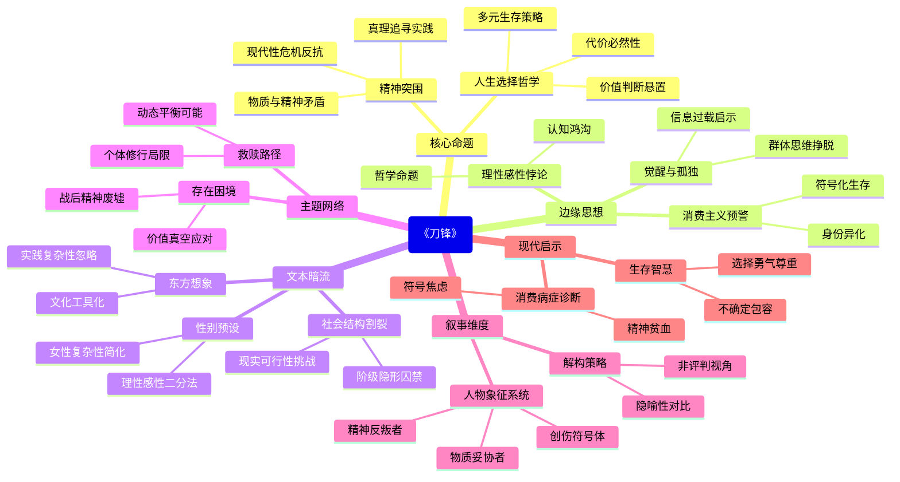

豆瓣链接：https://book.douban.com/subject/35197280/

# 深层解构

### 《刀锋》深层解码：在欲望与精神的裂缝中，窥见人性的多重镜像

#### 一、基石：作者反复叩击的核心命题
1. **超越世俗的精神突围**
毛姆以拉里的人生轨迹为轴心，构建起对"生之意义"的终极追问。拉里在目睹战友死亡后，摒弃华尔街的优渥生活，踏上追寻"刀锋般难以跨越的真理"之路，这一选择本质是对现代性危机的反抗——当战争、经济危机撕碎旧有的价值体系，个体如何在精神废墟上重建生命坐标？毛姆通过拉里的印度修行、对"无所为而为"生活的践行，**反复传递一个核心信念：物质丰裕与精神充盈存在不可调和的矛盾，真正的救赎始于对世俗成功学的彻底解构**。

2. **多元人生选择的平等性哲学**
书中塑造了三组对照人物：拉里（精神探寻者）、伊莎贝尔（世俗享乐者）、艾略特（名利追逐者）。毛姆以近乎冷酷的笔触揭示：伊莎贝尔在物质婚姻中压抑的精神空虚，艾略特在社交场的浮华泡沫，与拉里在贫困中坚守的精神富足，**本质上都是对抗生命虚无的生存策略**。他拒绝评判任何一种选择的高低，反而通过人物的命运纠葛，暗示**人生本无"得救之道"的标准答案，所有选择都需背负对应的代价**。

#### 二、边缘：被轻描淡写的思想闪电
1. **理性与感性的永恒悖论**
书中拉里与伊莎贝尔的对话堪称经典："我真想能够使你懂得，精神的生活多么令人兴奋"与"你却在浪费宝贵光阴"的碰撞，暴露出**人类永恒的认知鸿沟——理性主义者试图用逻辑丈量生命深度，感性主义者依赖直觉捕捉存在本质**。毛姆看似轻描淡写的争吵，实则触及哲学核心命题：当理性无法解释灵魂的悸动，感性如何避免陷入盲目？这一未被展开的思辨，为读者预留了叩问自我的思想空间。

2. **消费主义的早期预警**
艾略特对贵族头衔、古董收藏的偏执追求，在今天看来极具预言性。毛姆通过这个"社交动物"的一生，**悄然勾勒出消费主义的雏形：当物质占有成为身份认同的唯一标尺，人终将沦为商品拜物教的囚徒**。书中对艾略特临终前仍惦记宴会请柬的描写，既是对虚荣的嘲弄，更是对现代社会"符号化生存"的提前预警。

3. **孤独作为精神觉醒的必经之路**
拉里在巴黎苦读、印度修行的段落中，毛姆多次提到"孤独"的重量。这种孤独并非消极避世，而是**精神觉醒者必须穿越的黑暗隧道——唯有挣脱群体思维的枷锁，才能听见内心真实的声音**。这一洞见被包裹在叙事中未被强调，却为当代人对抗信息过载、集体焦虑提供了逆向启示。

#### 三、暗流：潜伏在文本深处的思维前提
1. **精神追求的性别化预设**
书中女性角色（伊莎贝尔、苏菲）大多被刻画为受欲望驱动的"世俗生物"，而男性（拉里、毛姆本人）承担精神探索的重任。这种叙事背后隐藏着**20世纪初的性别认知惯性：将理性、超越性赋予男性，将感性、世俗性归属女性**。当伊莎贝尔说出"没有爱，一个人也可以过得很好"时，看似是对物质选择的自我合理化，实则暴露了作者对女性精神复杂性的简化处理。

2. **东方哲学的浪漫化想象**
拉里在印度的悟道过程被赋予神秘主义色彩，毛姆将东方哲学简化为"坐而论道即可顿悟"的捷径，**忽略了文化语境差异与实践的复杂性**。这种"西方问题，东方求解"的叙事模式，暗含着对东方思想的工具化利用，本质上仍是西方中心主义的思维残余。

3. **个体救赎与社会结构的割裂**
全书聚焦个体的精神突围，却回避了一个关键问题：当整个社会陷入价值崩塌，仅凭个人修行能否真正"越过刀锋"？毛姆**默认了个体选择的绝对自由，却忽视了阶级、经济、文化等结构性力量对人生选项的隐形囚禁**。拉里的"得救"建立在无牵无挂的单身汉身份上，若置于婚姻、家庭等现实语境中，其选择的可行性将面临严峻挑战。

### 给读者的三个阅读礼物
1. **顿悟：这本书真正在说什么？**
表面是"寻找生命意义"的哲学之旅，实则是**对现代性困境的文学解剖——当宗教、传统、集体主义相继退场，人类如何在价值真空时代自洽地活着**。毛姆用小说证明：没有一种活法能彻底规避痛苦，重要的是清醒地选择，并承担选择的重量。

2. **惊喜：如果换个角度看……**
从消费主义视角重读艾略特，会发现他的社交狂热与当代人"打卡式生活"如出一辙：都是通过外在符号构建存在感。毛姆早在80年前，就用文学预言了**物质丰裕时代的精神贫血症**，而拉里的"无用之用"，恰是对抗这种病症的一剂猛药。

3. **发现：作者可能没意识到……**
毛姆对"精神追求"的理想化书写，无意中暴露了知识分子的傲慢——他将拉里的选择神圣化，却低估了普通人在生存压力下的妥协必然性。或许真正的"越过刀锋"，不是非此即彼的极端选择，而是**在世俗责任与精神追求间找到动态平衡点**，这种"带着枷锁的舞蹈"，可能更接近大多数人的真实人生。

### 结语：刀锋之下，是人性的万神殿
毛姆用手术刀般的笔触，在欲望与精神的交界处划开一道伤口，让我们看见人性的复杂肌理：这里没有圣徒与俗人的二元对立，只有无数个在"刀锋"两侧徘徊的灵魂。阅读《刀锋》的终极意义，不在于找到"正确的活法"，而在于学会**容忍生命的不确定性，尊重每一种认真活着的勇气**——毕竟，在这个没有标准答案的世界里，敢直面内心的人，都已越过了最锋利的那道坎。

# 章节内容
好的，文学家为您解读毛姆的《刀锋》。

## 1. 基础信息

*   **作者背景：** 威廉·萨默赛特·毛姆（1874-1965）是英国现实主义小说家、剧作家，属于新爱德华时期作家。他的作品常以冷静、客观的视角剖析社会现实和复杂的人性。代表作包括《月亮和六便士》、《人生的枷锁》、《英国病人》等。
*   **创作背景：** 《刀锋》创作于二战期间，反映了一战后西方社会普遍存在的精神危机和对人生意义的追寻。毛姆本人也曾经历过战争，并对哲学和宗教产生浓厚兴趣，这些都影响了本书的创作。
*   **版本信息：** 初版于1944年。周煦良的译本是国内常见的经典译本。其他重要译本可能在语言风格和细节处理上有所差异，但核心内容基本一致。

## 2. 主题架构

*   **核心主题：** 人生意义、精神追寻、东西方文化碰撞。
*   **子主题网络：**

    ```mermaid
    graph TD
        A[《刀锋》] --> B(人生意义);
        A --> C(精神追寻);
        A --> D(东西方文化碰撞);
        B --> B1(战争创伤);
        B --> B2(物质与精神);
        B --> B3(个人选择);
        C --> C1(宗教信仰);
        C --> C2(哲学思考);
        C --> C3(自我救赎);
        D --> D1(西方困境);
        D --> D2(东方智慧);
        D --> D3(文化融合的可能);
    ```
*   **主题呈现方式：** 通过拉里·达雷尔的个人经历和选择，以及“我”的叙述和评论，展现不同的人生观和价值观。通过拉里在西方和东方的游历，以及与不同人物的交往，探讨东西方文化的差异和互补。

## 3. 人物系统

*   **人物关系图谱：**

    ```mermaid
    graph LR
        A[拉里·达雷尔] -- 精神追寻 --> B(“我”);
        A -- 爱情纠葛 --> C(伊莎贝尔);
        A -- 友情 --> D(汤姆);
        A -- 救赎 --> E(索菲);
        B -- 观察和记录 --> A;
        C -- 物质与爱情的抉择 --> A;
        C -- 婚姻 --> F(格雷);
        E -- 堕落与毁灭 --> A;
        G[艾略特] -- 社交与金钱 --> C
    ```
*   **角色弧光分析：**
    *   **拉里·达雷尔：** 从对战争的反思到对人生意义的探寻，再到最终在东方找到精神归宿，他的角色弧光是“迷茫——追寻——顿悟——回归”。关键转折点包括：朋友之死、在矿上的工作、在印度的修行。
    *   **伊莎贝尔：** 从对爱情的憧憬到对现实的妥协，再到最终选择物质生活，她的角色弧光是“理想——现实——务实”。关键转折点包括：拉里拒绝结婚、索菲的堕落。
*   **人物象征意义：**
    *   **拉里：** 象征着对精神价值的追求和对传统价值观的反叛。
    *   **伊莎贝尔：** 象征着对物质生活的追求和对社会规范的顺从。
    *   **索菲：** 象征着战争带来的创伤和人性的堕落。
    *    **“我”：** 象征着理性观察者和思考者，引导读者理解故事背后的深层含义。

## 4. 叙事结构

*   **时间线分析：** 采用非线性叙事，通过“我”的回忆和插叙，将不同时间的故事片段穿插在一起，使情节更加紧凑，也更能展现人物内心的复杂性。
*   **情节动力学：** 可视为英雄之旅的变体。拉里经历了“启程——考验——顿悟——回归”的过程，但他最终并没有成为传统意义上的英雄，而是选择了一种更加隐逸的生活方式。
*   **悬念设置手法：** 通过对拉里行为的铺垫和暗示，引发读者对他的选择和命运的思考。通过对索菲命运的悬念设置，增加故事的悲剧色彩。

## 5. 文学技法

*   **语言风格：** 简洁、流畅、富有哲理，常使用反讽和幽默的语言来表达深刻的思想。
*   **意象体系：** “刀锋”意象象征着人生道路的艰难和选择的危险。旅行、书籍、宗教场所等意象象征着拉里追寻人生意义的途径。
*   **视角选择：** 采用第一人称叙事（“我”的视角）和有限视角，使读者能够更深入地了解人物的内心世界，同时也保持了一定的客观性和距离感。

## 6. 思想深度

*   **哲学命题探讨：**
    *   **存在主义：** 拉里对人生意义的追寻，体现了存在主义对个人自由和责任的强调。他通过自己的选择来定义自己的人生，而不是被传统和社会所束缚。
    *   **东方哲学：** 拉里在印度的经历，体现了东方哲学对超越自我、追求 inner peace 的思想。他通过修行和冥想来达到 inner peace 的境界，从而找到人生的意义。
*   **社会批判维度：**
    *   **阶级：** 通过对不同阶层人物的描写，展现了社会阶级对个人命运的影响。伊莎贝尔对物质生活的追求，部分源于她对社会地位的渴望。
    *   **价值观：** 对当时社会主流价值观的反思和批判。拉里对传统价值观的背离，体现了对物质主义和功利主义的反思。
*   **人性洞察层面：**
    *   **善恶二元：** 对人性的复杂性和多面性的深刻洞察。每个人物都有其优点和缺点，没有绝对的善与恶。
    *   **异化主题：** 战争对人性的摧残和异化。索菲的堕落，是战争创伤后的一种表现。

## 7. 文学史坐标

*   **所属文学运动：** 现实主义、现代主义。
*   **对后世影响：** 《刀锋》对后世文学作品产生了深远影响，许多作品都借鉴了其对人生意义的探讨和对东西方文化的对比。
*   **与同期作品比较：**
    *   **《了不起的盖茨比》（菲茨杰拉德）：** 同样描写了一战后美国社会的精神空虚和迷茫，但侧重于对美国梦的幻灭的批判。
    *   **《荒原》（艾略特）：** 同样表达了西方文明的危机和精神的荒芜，但采用了一种更加晦涩和象征性的语言。
    *   **《 சித்தார்த்தா》（黑塞）：** 与《刀锋》一样探讨了人生的意义和精神的追寻，但更侧重于对东方智慧的肯定和对个人 inner peace 的追求。

## 8. 读者互动

*   **读者对结局的解读：** 读者对拉里最终选择回归平凡生活有不同的解读。有人认为这是一种真正的顿悟和解脱，有人认为这是一种妥协和逃避。
*   **争议性观点梳理：** 学界对《刀锋》的评价存在争议。有人认为其思想深刻，艺术性高超，是毛姆的代表作；有人认为其情节平淡，人物刻画不够深入，主题表达过于直白。
*   **跨媒介改编分析：** 《刀锋》曾多次被改编成电影和电视剧。不同版本的改编在情节和人物塑造上有所差异，但都试图展现原著的核心主题。

《刀锋》是一部引人深思的作品，它探讨了人生的意义、精神的追寻以及东西方文化的碰撞。通过拉里·达雷尔的个人经历，毛姆展现了不同的人生选择和价值观，引发读者对自身存在的深刻思考。

Citations:
[1] https://book.douban.com/subject/2035162/

---
来自 Perplexity 的回答: pplx.ai/share