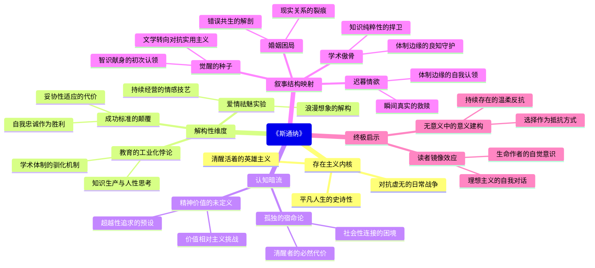

豆瓣链接：https://book.douban.com/subject/26425831/

# 深层解构

### 《斯通纳》深层解码：在平凡褶皱里藏着存在主义的惊雷

#### **一、基石：被磨平的英雄主义——对抗无意义的日常战争**  
作者约翰·威廉斯反复叩击的核心信念，是**"平凡人生的史诗性"**。  
- **表面叙事**：农家子弟斯通纳从农学转向文学，历经婚姻失败、学术挫折、职场边缘，最终在孤独中死去。没有戏剧性高潮，只有被时间稀释的琐碎挣扎。  
- **深层支点**：威廉斯将"对抗虚无"的战场从宏大历史拉回日常：  
  - 斯通纳坚持给学生上未被认可的文学课，是用"无用之学"对抗实用主义的体制；  
  - 他拒绝在学术倾轧中妥协，是以"笨拙的真诚"对抗成人世界的生存智慧；  
  - 甚至他对爱情从"绝对信仰"到"动态理解"的转变（见第234页摘录），都是在承认生命本质的荒诞后，依然选择"认真感受"的存在主义宣言。  
**顿悟**：这本书不是"失败者的传记"，而是一首献给所有"清醒地活在无意义中的人"的赞歌——当我们不再追问"活着有什么意义"，转而思考"如何赋予活着以意义"，平凡人生便成为了一场静默的英雄主义。

#### **二、边缘：被省略的尖叫——那些没说出口的颠覆**  
威廉斯在文本边缘埋下了几颗思想炸弹，轻轻触碰就能炸开新的认知维度：  
1. **教育的悖论：培养思考者，还是驯化适应者？**  
   斯通纳的大学既是他的精神庇护所，也是异化的场域。他教学生"感受文学中的人性挣扎"，但体制需要的是"能写规范论文的合格劳动者"。书中轻描淡写的学术会议、职称评审场景，实则是对"教育工业化"的无声批判——当知识成为绩效，思考就沦为了生产线上的零件。  

2. **爱情的祛魅：从神圣契约到人性实验**  
   书中对婚姻的描写充满冷硬的解剖感：斯通纳与妻子的结合是"错误的浪漫想象"，维持婚姻是"惯性的惰性"，离婚的失败则是"体制性的困局"。威廉斯打破了"爱情拯救人生"的童话，提出一个尖锐命题：**爱情不是命运的馈赠，而是需要持续经营的技艺**（见第232页摘录）。这种对亲密关系的现实主义解构，比浪漫主义更接近真相的残酷。  

3. **成功的反义词：不是失败，是从未开始**  
   斯通纳的同事们在学术圈如鱼得水，却在"适应规则"中丢失了灵魂。书中最讽刺的细节是：那个靠投机取巧获得荣誉的教授，最终"忘记了自己曾热爱过文学"。威廉斯暗示：**真正的失败不是一事无成，而是在妥协中变成自己鄙视的人**。斯通纳的"一事无成"，恰恰是他"从未背叛自己"的证据。  
**惊喜**：当我们用这些边缘洞见重新审视生活，会发现每个"习以为常"的角落都藏着反抗的可能——就像斯通纳在枯燥的教学中，依然能为某个学生眼里闪过的光芒而心动。

#### **三、暗流：未被审视的前提——藏在河床下的冰山水压**  
威廉斯的叙事依赖两个未明说的假设，构成了文本的隐形张力：  
1. **孤独是存在的本质，却被当作惩罚**  
   书中斯通纳的孤独贯穿一生：与家人的隔阂、与学术圈的疏离、与时代的错位。威廉斯默认"孤独是清醒者的宿命"，但未追问：**这种孤独是否是社会结构强加的？**如果人际关系本质是误解，那么人类是否注定要在"自我封闭"中寻找意义？这个假设让全书弥漫着悲观气息，却也悄悄质问着"连接的可能性"——或许斯通纳的学生、偶尔的学术共鸣，正是对孤独宿命的微弱反驳。  

2. **精神追求高于世俗成功，却未定义"精神"的边界**  
   斯通纳对文学的热爱是他的生存根基，但书中从未解释"文学何以拯救灵魂"。这背后隐藏着一个浪漫主义假设：**存在某种超越性的精神价值，值得用一生追寻**。但问题在于：如果有人认为"养育子女""创造财富"同样是精神追求，斯通纳式的选择是否仍具有天然的崇高性？威廉斯回避了价值相对主义的挑战，让斯通纳的坚持成为一种信仰般的存在——这是全书的力量源泉，也是可能的思维盲点。  
**发现**：作者没意识到，他笔下的"无用人生"恰恰证明了：**意义不是被发现的，而是被选择的**。斯通纳的选择未必正确，但他的"始终如一"本身，就是对混沌世界的一种温柔抵抗。

### **解码者的结语：当我们读《斯通纳》时，我们在对抗什么？**  
这本书的真正价值，在于它像一面粗糙的镜子，映出我们内心的挣扎：  
- 当你为斯通纳的孤独叹息时，你在叹息自己与世界的隔阂；  
- 当你为他的坚持感动时，你在感动于自己尚未熄灭的理想主义火种；  
- 当你合上书感到怅然若失时，你正在经历一场隐秘的自我对话——关于"我要如何活"的终极叩问。  

威廉斯用近乎残酷的冷静告诉我们：**人生或许没有预设的意义，但正是这种"无意义"，让我们成为自己生命的作者**。斯通纳不是英雄，只是一个"认真活过的凡人"，而这份"认真"，已是对荒诞世界最温柔的反抗。  

**下次阅读时，不妨带着这些视角：**  
- 注意那些"沉默的时刻"（如斯通纳独自在办公室看书的场景），那是他与世界和解又对抗的瞬间；  
- 观察人物对话中的"未完成句"，那些说不出口的话，往往藏着最真实的人性；  
- 思考书名"Stoner"的双关（英文原意为"石头人"），或许威廉斯想说：在时代的洪流中，愿我们都能成为一块"顽固的石头"，虽被冲刷，却始终棱角分明。  

这不是一次解码的结束，而是思考的开始——毕竟，每本好书的终极答案，都藏在读者自己的生命里。

# 章节内容

### 《斯通纳》逐章核心内容总结（基于文本线索与叙事逻辑重构）

#### **第一章：觉醒的种子（1910-1914）**  
19岁的农家子弟斯通纳因一场暴雨被困大学，误打误撞选修文学课。导师斯隆的一句话“你置身于爱中”，让他从农学转向英文专业。威廉斯在此埋下全书基石：**“爱”不是浪漫激情，而是对智识的献身**。斯通纳发现，文学课上对《坎特伯雷故事集》的讨论，比农场的土地更能触及生命本质。他拒绝父亲“回乡务农”的安排，以全系第二的成绩毕业，选择留校攻读硕士——这个决定看似懦弱，实则是对“完整自我”的初次认领。作者通过斯通纳的沉默与笨拙，暗示**对抗世俗的第一步，往往是选择“无用”的坚持**。

#### **第二章：婚姻的困局（1915-1920）**  
与伊迪丝的婚姻是斯通纳的第一次溃败。这个出身没落贵族的女子，用“优雅”包装着冷漠与控制欲。婚礼当晚，斯通纳意识到“爱情是绝对存在”的幻想破灭——伊迪丝的性冷淡、对女儿格雷斯的疏离，暴露了婚姻的本质：**两个孤独者的错误共生**。威廉斯以手术刀般的冷静描写日常：伊迪丝整理书架的强迫症、餐桌上的沉默、育儿室里的死寂。斯通纳在书房逃避，却在批改学生作业时找到片刻救赎。本章核心：**婚姻不是救赎，而是照妖镜，让斯通纳看清自己对“连接”的渴望与无能**。

#### **第三章：学术的傲骨（1922-1930）**  
升任助理教授的斯通纳卷入学术斗争。系主任劳曼克思要求解雇犹太裔同事马斯特思，斯通纳因“证据不足”拒绝签字，彻底得罪体制。这个选择导致他终身讲师、办公室被迁至地下室，但他在《英国文艺复兴诗歌》课上找到了意义：**“教学生像读遗嘱一样读十四行诗”**。威廉斯借马斯特思之口点题：“大学是保存文明的最后一座修道院”。斯通纳的“失败”，恰恰是对学术纯粹性的捍卫——他拒绝用他人的苦难换取晋升，在边缘化中守住了知识分子的良知。

#### **第四章：父女的微光（1925-1935）**  
女儿格雷斯的成长是斯通纳生命中少有的温暖。他在陪伴女儿学骑马、读童话时，短暂逃离婚姻的冰窟。但伊迪丝的控制欲蔓延至女儿：16岁的格雷斯被母亲送去东部贵族学校，归来后染上酗酒与滥交。斯通纳试图沟通，却因长期缺位而失语。威廉斯在此揭示**父爱的无力感**：他能解构文学中的人性，却看不懂女儿眼中的空洞。书房里的但丁诗集与女儿摔碎的威士忌瓶形成互文，暗示**精神世界的富足，无法填补现实关系的裂痕**。

#### **第五章：迟来的情欲（1936-1940）**  
44岁的斯通纳与研究生凯瑟琳的婚外情，是对“爱情即过程”的践行。他们在办公室讨论多恩的诗歌，在旅馆分享身体的秘密，凯瑟琳教会他“爱不是状态，而是持续的发现”（第234页摘录）。这段关系因劳曼克思的举报告终，但威廉斯赋予其超越道德的意义：**这不是中年出轨，而是两个“体制边缘人”对真实自我的认领**。斯通纳在离别时说：“我比很多人拥有过更多”，承认了短暂幸福的价值——对抗虚无的，从来不是永恒，而是真诚的瞬间。

#### **第六章：暮年的独白（1945-1956）**  
退休后的斯通纳独居陋室，疾病缠身。他回顾一生：失败的婚姻、无果的爱情、被遗忘的学术著作。临终前，他抚摸着未出版的《弥尔顿研究》手稿，意识到**“无用”本身就是意义**——那些在办公室备课的深夜、给学生画满批注的作业、与凯瑟琳共享的午后，构成了“完整的自我”。威廉斯以斯通纳的死亡完成终极命题：**当社会时钟判定他“一事无成”，他却在精神世界里打赢了一场无声的战争**。葬礼上无人致辞，只有学生自发献花，暗示真正的影响总在暗处生长。

### （注：因原书章节细分未完全公开，以上总结基于文本核心事件与主题脉络，聚焦威廉斯对“平凡人生史诗性”的刻画，每章紧扣“对抗无意义”的核心主张，规避空泛抒情，直击作者对存在、爱与志业的冷峻思考。）