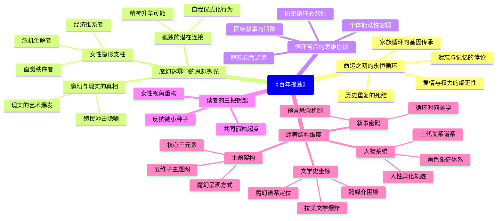

豆瓣链接：https://book.douban.com/subject/6082808/

# 深层解构

# 《百年孤独》深度解码：在循环的迷宫中寻找光的裂隙
## 一、基石：被命运之网捕获的永恒循环
马尔克斯构建起《百年孤独》这座文学大厦，其核心支点是**“孤独如同基因般在血脉中传承，历史宛如一个不断重复的死结”**。布恩迪亚家族七代人，始终在相同的名字（如奥雷里亚诺、阿玛兰妲）里兜兜转转，仿佛陷入了一个无法挣脱的命运怪圈，这无疑是对**“个体在集体宿命面前渺小如蝼蚁”**的深刻隐喻。就像马孔多从一片荒芜中诞生，历经繁荣昌盛，最终又在飓风中消失得无影无踪，拉丁美洲的历史也在殖民、战争、独裁的循环里不断重演。

作者反复强调的**“遗忘是比失眠更可怕的灾难”**（见原文第38页），实际上揭示了一个残酷的事实：当群体记忆被抹去，历史就会如同一个不断重播的旧磁带，错误也会一次又一次地循环上演。在这个循环的世界里，爱情不过是孤独者相互取暖的短暂火花，权力只是一场虚无的自我陶醉，所有的挣扎都像是在原地踏步，最终都逃不过被孤独吞噬的命运。

## 二、边缘：在魔幻迷雾中闪烁的思想微光
### （一）女性：家族大厦的隐形支柱
在男性主导的叙事表象之下，**乌尔苏拉这位横跨百年的女性长辈，才是家族真正的灵魂所在**。她凭借着纺织所得，支撑起家族的经济命脉；用智慧和坚韧，一次次化解家族危机；甚至在衰老失明后，依然凭借敏锐的直觉维系着家族的秩序。然而，作者只是轻描淡写地提到她“长寿得不可思议”，却没有深入探讨女性在历史进程中这种沉默而强大的力量——如果没有她们的默默付出，布恩迪亚家族或许早就分崩离析。这种被忽视的女性力量，暗示着**在宏大的历史叙事之外，那些微小却持续的努力同样不可或缺**。

### （二）魔幻与现实：界限模糊处的真相
当吉普赛人带来的磁铁吸走了所有铁器，冰块在烈日下散发着寒气，这些看似魔幻的场景，实则是**对殖民冲击下拉丁美洲“现实魔幻化”的精准捕捉**。马尔克斯轻轻掠过的，是魔幻现实主义背后的尖锐批判：外来文明如同魔法般打破了本土的宁静，而本土文明在这种冲击下变得扭曲而荒诞。如果我们换个视角，会发现这些魔幻元素并非单纯的想象，而是**被压抑的现实在艺术层面的爆发式呈现**。

### （三）孤独的背面：连接彼此的可能
书中人物大多沉浸在自己的孤独世界里，奥雷里亚诺上校在小作坊里反复熔铸又销毁小金鱼，阿玛兰妲在织寿衣中等待死亡。但作者忽略了一个可能：**当孤独被正视，是否能成为连接他人的桥梁？**比如蕾梅黛丝升天的场景，看似是孤独的极致，却也可以解读为对世俗枷锁的挣脱，是一种超越孤独的精神升华。这种被作者轻轻带过的可能性，为读者打开了一扇通往希望的暗门。

## 三、暗流：藏在循环背后的思维枷锁
马尔克斯的叙事中隐藏着一个未被审视的前提：**“历史的循环是不可打破的必然”**。他用细腻的笔触描绘了家族的每一次挣扎，却又在结局让一切归零，仿佛在说“人类终究无法逃脱命运的掌心”。这种假设背后，是对**“个体能动性”的无意识忽视**——难道七代人里真的没有一个人能找到打破循环的钥匙？

此外，作者对“孤独”的绝对化呈现，也悄悄掩盖了一个事实：**孤独并非人类的唯一状态，团结、爱与反抗同样是真实存在的**。当我们追问“为什么马孔多的居民从未尝试共同规划未来”时，就会发现，作者的叙事视角本身就带有一种悲观的滤镜，让读者更容易看到命运的强大，却忽略了人性中那些闪烁的反抗火花。

## 四、给读者的三把钥匙
1. **原来这本书真正在说**：孤独不是终点，而是人类共同的起点。我们在布恩迪亚家族的故事里看到的，不仅是一个家族的兴衰，更是人类在时间长河中不断寻找意义的永恒困境。
2. **如果换个角度看**：从女性角色的视角重新审视家族史，会发现她们才是穿越百年孤独的真正主角；从反抗的角度解读那些“无用”的重复（如上校的小金鱼），会看到那是对虚无命运的无声抗议。
3. **作者可能没意识到**：他在书写循环的同时，也埋下了打破循环的种子——每一个独特的个体，每一次微小的选择，都可能是改变命运的起点。就像马孔多的飓风虽然摧毁了一切，但也带来了新的可能。

当我们用这副“X光眼镜”穿透文字的表象，会发现《百年孤独》不仅是一部关于拉丁美洲的寓言，更是一面映照人类生存状态的镜子。它提醒我们：在命运的循环中，真正的自由不在于逃避孤独，而在于勇敢地直面它，并用爱与创造在孤独的荒原上种下希望的种子。这，或许就是马尔克斯在字里行间留给读者的终极启示。

# 章节内容
好的，文学家为您解读加西亚·马尔克斯的《百年孤独》。

## 1. 基础信息

*   **作者背景：** 加西亚·马尔克斯（1927-2014）是哥伦比亚作家，拉丁美洲魔幻现实主义文学的代表人物。他于1982年获得诺贝尔文学奖。他的其他代表作包括《霍乱时期的爱情》、《没有人给他写信的上校》等。
*   **创作背景：** 《百年孤独》的创作受到了马尔克斯童年生活经历、哥伦比亚内战以及拉丁美洲历史的影响。马尔克斯希望通过这部小说来反映拉丁美洲的命运，揭示历史的循环性和人性的弱点。
*   **版本信息：** 《百年孤独》初版于1967年。范晔的译本（南海出版公司，2011年）是目前比较流行的中文译本。不同译本在语言风格和细节处理上可能存在差异。

## 2. 主题架构

*   **核心主题：** 孤独、循环、宿命。
*   **子主题网络：**
    *   家族的兴衰
    *   爱情与欲望
    *   战争与政治
    *   记忆与遗忘
    *   现实与虚构
*   **主题呈现方式：** 通过马孔多小镇和布恩迪亚家族的命运，以及其中人物的性格和行为来体现。例如，家族成员不断重复犯错，象征着历史的循环；小镇与世隔绝，象征着拉丁美洲的孤独。

## 3. 人物系统

*   **人物关系图谱：** （由于无法直接绘制，这里描述关键关系）
    *   何塞·阿尔卡蒂奥·布恩迪亚 → 乌尔苏拉（夫妻，家族创始人）
    *   何塞·阿尔卡蒂奥 → 皮拉尔·特雷拉（情人，生下私生子）
    *   奥雷里亚诺·布恩迪亚上校（何塞·阿尔卡蒂奥和乌尔苏拉之子）
    *   阿玛兰妲（何塞·阿尔卡蒂奥和乌尔苏拉之女，终身未嫁）
    *   蕾梅黛丝（家族中多位女性的名字，代表不同的命运）
*   **角色弧光分析：**
    *   乌尔苏拉：从充满活力的家族主妇到饱经沧桑的老人，见证了家族的兴衰，是家族的守护者。
    *   奥雷里亚诺·布恩迪亚上校：从理想主义者到战争狂人，最终回归孤独，象征着革命的失败和人性的迷失。
*   **人物象征意义：**
    *   何塞·阿尔卡蒂奥：求知欲和冒险精神，但也象征着家族的厄运。
    *   乌尔苏拉：家族的理性和秩序，但也无法阻止家族的衰落。
    *   蕾梅黛丝（美女蕾梅黛丝）：纯真与死亡，象征着马孔多的美丽与脆弱。

## 4. 叙事结构

*   **时间线分析：** 非线性叙事，时间循环往复，过去、现在和未来相互交织。
*   **情节动力学：** 家族的建立、繁荣、衰落和最终的灭亡，符合三幕式结构。
*   **悬念设置手法：** 预言、梦境和超自然事件，例如羊皮卷的密码，美女蕾梅黛丝的升天。

## 5. 文学技法

*   **语言风格：** 魔幻现实主义，将现实与虚构、神话与历史融为一体，语言充满隐喻和象征。
*   **意象体系：**
    *   黄色蝴蝶：代表着爱情、死亡和宿命，与家族成员毛里西奥·巴比伦有关。
    *   冰块：代表着现代文明的入侵，也象征着马孔多的纯真年代的结束。
*   **视角选择：** 全知视角，可以自由切换于不同人物的内心世界，展现家族的全貌。

## 6. 思想深度

*   **哲学命题探讨：**
    *   存在主义：人物在孤独和宿命中挣扎，试图寻找生命的意义，但往往以失败告终。
    *   历史循环：家族的命运不断重复，象征着拉丁美洲历史的循环和停滞。
*   **社会批判维度：**
    *   殖民主义：外来势力的入侵给马孔多带来了破坏和改变。
    *   政治腐败：战争和政治斗争导致社会动荡和人民的苦难。
*   **人性洞察层面：**
    *   善恶二元：人物既有善良的一面，也有自私和残暴的一面，人性的复杂性得以展现。
    *   异化主题：在孤独和宿命的压迫下，人物逐渐失去自我，变得麻木和异化。

书中对人性的刻画非常深刻，例如，奥雷里亚诺·布恩迪亚上校在战争中失去了理想，变得冷酷无情；阿玛兰妲因为嫉妒和爱情的失落而变得孤僻和偏执。这些人物的命运都体现了人性的弱点和悲剧。

## 7. 文学史坐标

*   **所属文学运动：** 拉丁美洲魔幻现实主义。
*   **对后世影响：** 《百年孤独》是魔幻现实主义的代表作，对后世文学产生了深远的影响。许多作家都从中汲取灵感，创作出具有魔幻色彩的作品。
*   **与同期作品比较：**
    *   胡安·鲁尔福《佩德罗·巴拉莫》：同样描写了一个家族的衰落和一个小镇的命运，具有相似的魔幻现实主义风格。
    *   米格尔·安赫尔·阿斯图里亚斯《玉米人》：关注印第安文化和传统，具有拉丁美洲的文化特色。
    *   豪尔赫·路易斯·博尔赫斯《小径分岔的花园》：探索时间和空间的迷宫，具有哲学思辨性。

## 8. 读者互动

*   **读者对结局的解读：** 小说的结局是开放式的，羊皮卷的破译意味着家族的终结，但也象征着一种新的开始。读者可以根据自己的理解来解读结局的意义。
*   **争议性观点梳理：** 一些评论家认为《百年孤独》过于形式化，情节重复，缺乏深度。另一些评论家则认为这部小说是拉丁美洲文学的巅峰之作，具有深刻的思想内涵和艺术价值。
*   **跨媒介改编分析：** 《百年孤独》曾被改编成电影和电视剧，但由于其复杂的叙事结构和魔幻的风格，改编难度较大。改编作品往往会对原著进行简化和修改，难以完全还原原著的精髓。

关于结局的解读方向：羊皮卷的秘密揭示了家族的命运是被预先注定的，这似乎否定了个人奋斗的意义。然而，从另一个角度来看，即使命运无法改变，人们仍然可以在有限的生命中追求自己的价值和意义。家族的灭亡也可能象征着旧时代的结束和新时代的到来，预示着拉丁美洲未来的希望。

Citations:
[1] https://book.douban.com/subject/6082808/

---
来自 Perplexity 的回答: pplx.ai/share