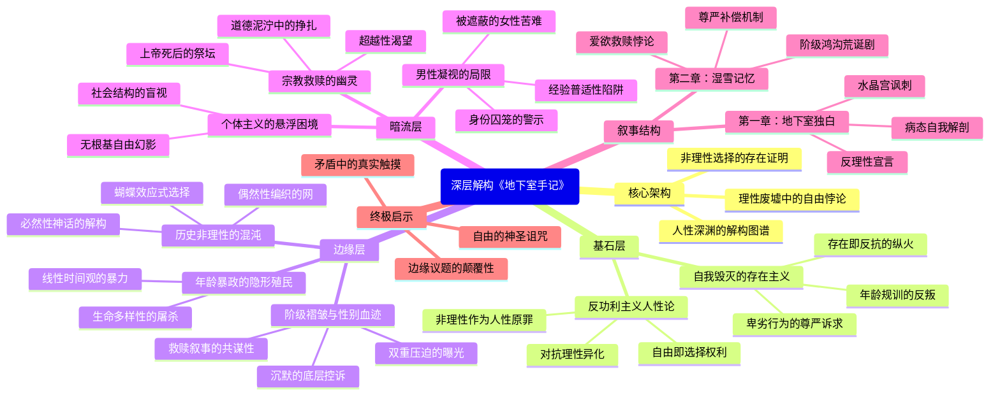

豆瓣链接：https://book.douban.com/subject/34990839/

# 深层解构

# 穿透《地下室手记》的三重精神地层：从理性废墟到人性深渊的隐秘地图
在陀思妥耶夫斯基的《地下室手记》中，每个字都像一把凿刀，在人性的岩壁上刻下深邃的裂痕。当我们用“三重世界”的透视镜重新审视这部作品，会发现那些被文字遮蔽的思想地层中，埋藏着比故事更震撼的精神密码。

## 一、基石：在理性废墟上竖立的自由悖论碑
### （一）**反功利主义的人性原教旨主义**  
地下室人用近乎偏执的逻辑撕裂启蒙理性的假面：当经济学家宣称“人是理性动物，永远趋利避害”时，他却在雪地里故意绕三小时远路，只为证明“我可以选择无意义”。他的核心命题是：**“自由的本质不是‘正确的选择’，而是‘选择的权利本身’——哪怕这选择会带来痛苦、毁灭，甚至违背一切利益计算。”**  
这种对“非理性自由”的绝对推崇，构成了陀氏作品的精神基石。正如他借地下室人之口呐喊：“纯粹属于他自己的随心所欲的愿望……是无法被任何理论消灭的最有利利益。”这里的“有利”并非功利意义上的收益，而是对“人是目的而非工具”的终极确认。在19世纪俄国现代化的狂飙中，陀氏提前预见了理性主义对人性的异化，并用地下室人的疯癫独白，为人类的自由意志建立了一座布满裂痕的纪念碑。

### （二）**自我毁灭作为存在的燃烧证明**  
“过了四十岁，再活下去就是恬不知耻！”这句看似荒谬的断言，实则是对“年龄规训”的暴力反抗。当社会要求中年人必须“稳重、成功、符合期待”时，地下室人却用自我贬值的方式撕开文明的伪装：他故意拖欠房租、在泥泞中打滚、用尖刻语言刺痛每一个试图“拯救”他的人。这些行为不是自暴自弃，而是**“以毁灭为燃料的存在主义纵火”**——正如他在第一章结尾宣称：“我存在，所以我反抗。哪怕我的反抗只是在地下室的墙壁上撞得头破血流。”  
这种将自我毁灭等同于存在证明的逻辑，成为后世存在主义的精神预演。加缪笔下的西西弗斯推石上山，恰是地下室人“主动选择无意义”的现代性镜像。

## 二、边缘：思想光谱上的临界闪烁
### （一）**年龄暴政的隐形镣铐**  
地下室人对“四十岁”的执念，暴露出一个被忽视的文明陷阱：**社会通过年龄标签实施的精神殖民**。青年被赋予“希望”，中年被绑定“责任”，老年被判处“无用”，这种线性时间观本质上是对生命多样性的屠杀。陀氏在边缘地带轻轻触碰这一议题：当地下室人怒吼“只有傻瓜和坏蛋能活过四十岁”时，他实际上在质问：为何人类必须按照“合理年龄”来剪裁自己的灵魂？  
这一洞见为后来的生命哲学提供了爆破点。试想，如果我们挣脱“年龄应该怎样”的枷锁，是否能重新发现每个年龄段的反叛可能？

### （二）**阶级褶皱中的性别血迹**  
与妓女丽莎的相遇，表面是“救赎失败的故事”，实则是**阶级压迫与性别剥削的双重曝光**。丽莎作为底层女性，既是男权社会的性消费品，也是阶级制度的牺牲品；而地下室人作为小公务员，既是官僚体系的失败者，又是丽莎悲剧的共谋者——他在妓院对她宣讲“道德”时，不自觉地扮演了压迫者的帮凶。  
陀氏在这里留下一道思想暗门：当我们谈论“自由”时，是否忽略了某些群体连“不自由的选择权”都被剥夺？丽莎最后的沉默，不仅是对地下室人的控诉，更是对整个等级社会的无声质问。

### （三）**历史非理性的量子隐喻**  
书中对“历史的非理性”的碎片化表述，堪称19世纪的历史哲学预言。当地下室人宣称“每个疯子的胡话都可能改变历史轨迹”时，他实际上否定了“历史规律”的确定性。这与后来混沌理论中的“蝴蝶效应”形成跨时空呼应：**理性主义认为历史是线性的、可计算的，而陀氏却看到了无数非理性个体选择编织成的混沌之网**。  
这种对“历史必然性”的解构，为理解俄国革命、现代性危机等提供了另类视角——或许历史的真相，从来不是“规律的胜利”，而是无数偶然选择的雪崩。

## 三、暗流：沉默的前提与思维的黑洞
### （一）**个体主义的悬浮困境**  
陀氏对个体自由的极致推崇，隐含着一个未被审视的前提：**假设个体可以脱离社会结构而存在**。地下室人的反抗看似激烈，实则是困在“自我”牢笼里的原地打转——他没有意识到，自己的自卑、焦虑、对他人的病态控制欲，本质上是官僚制度、阶级分化等社会关系的产物。  
这种“只见个人，不见结构”的视角，成为后来批判理论的靶心。正如卢卡奇指出：“当个体脱离社会关系被孤立讨论时，自由就变成了无根基的幻影。”

### （二）**宗教救赎的幽灵契约**  
在地下室人的自我撕裂中，始终游荡着宗教救赎的影子。他渴望摆脱痛苦，却找不到出路，于是在潜意识中期待一个“超越性力量”的拯救——这解释了为何他对丽莎既践踏又救赎的矛盾行为：他试图通过“拯救他人”来完成自我救赎，却陷入更深的道德泥泞。  
陀氏的矛盾在于：他既批判教会的虚伪，又无法否认人类对精神超越的本能需求。这种“上帝已死，但灵魂仍在寻找祭坛”的困境，成为《卡拉马佐夫兄弟》等后期作品的核心命题。

### （三）**男性视角的认知盲区**  
整部小说都是男性凝视的产物：地下室人的自我剖析、对丽莎的“拯救叙事”，乃至对社会的批判，都建立在“男性经验=人类经验”的默认假设上。他从未真正理解丽莎作为女性的独特苦难——她的堕落不仅是个人选择，更是被男权社会逼入绝境的生存策略。  
这种性别盲区揭示了一个残酷现实：**任何伟大的思想，都可能被其创作者的身份局限所囚禁**。当我们赞美陀氏对人性的洞察时，必须同时警惕：他的“人性”是否包含了被遮蔽的另一半？

## 四、解码的终极启示：在矛盾中触摸真实
《地下室手记》的伟大，在于它拒绝成为“答案之书”，而是化作一把锋利的手术刀，剖开文明的表皮，让我们看见人性的脓血与光芒。它的三重世界构成了一个永恒的思想磁场：  
- **基石**提醒我们：自由是人类最神圣的诅咒，理性永远无法垄断对“好生活”的定义；  
- **边缘**警示我们：任何被忽视的“次要议题”（年龄、性别、偶然），都可能成为颠覆认知的关键；  
- **暗流**告诫我们：没有一种思想是完美自洽的，真正的智慧在于拥抱矛盾，在“看见”与“未看见”的裂缝中，触摸真实的人性温度。  

正如纪德所言，这本书是“打开陀氏思想的钥匙”。而这把钥匙的真正用途，不是打开一个封闭的真理宝库，而是开启一扇扇通往未知的门——让每个读者在解码的过程中，成为自己思想的考古学家，在文字的废墟中，挖掘属于自己的精神宝藏。  

**当我们合上书本，听见的不应是地下室人的独白落幕，而是自己灵魂的回声：在理性与非理性、自由与枷锁、拯救与毁灭的永恒博弈中，我们终将如何定义自己的存在？** 这，或许就是陀氏留给所有读者的终极谜题。

# 章节内容

### 第一章 地下室（第1-56页）  
**核心主题：反理性主义的自由宣言与病态自我的哲学独白**  
本章以地下室人神经质的第一人称独白展开，开篇即抛出惊世骇俗的自我定义：**“我是个有病的人……我是个凶狠的人。”** 这个年近四十的退休公务员，以近乎自虐的方式解构启蒙理性主义的“合理利己主义”。他尖锐指出，当社会将“二加二等于四”（即理性计算）奉为生存法则时，人类便沦为“钢琴琴键上的音符”，而**“自由的本质恰恰是违背利益的非理性选择”**——即使这种选择会导致自我毁灭。  

地下室人以三段式论证挑战主流价值观：  
1. **对“水晶宫”的讽刺**：他批判空想社会主义者构想的完美社会（如傅立叶的“法伦斯泰尔”），认为绝对理性的秩序会消灭人性中的“任性”。他宣称：“人需要的仅仅是他独立的愿望，不管这愿望多荒谬。”例如，故意在雪地中绕远路、用尖刻语言激怒他人，这些“非理性”行为正是他证明自我存在的方式。  
2. **对“正常化”的反抗**：他厌恶社会对“四十岁后必须成熟”的规训（“过了四十岁，再活下去就是恬不知耻”），拒绝成为被年龄、身份驯化的“体面人”。他的自卑与高傲交织：既因矮小怯懦被军官撞开而记恨十年，又以“清醒的痛苦”自居，认为世俗的“幸福者”才是真正的精神奴隶。  
3. **对“因果律”的否定**：他否认行为与动机的必然联系，承认自己常因“恶意的快感”行事——比如故意拖欠房租，只为享受“卑劣的尊严”。他的结论是：**“理性是工具，而人性的本质是拒绝被工具定义的自由。”**  

本章的哲学密度极高，陀氏通过地下室人之口，提前解构了存在主义的核心命题：人不是被理性决定的客体，而是以非理性选择创造意义的主体。那些看似病态的呓语，实则是对19世纪俄国现代化进程中人性异化的激烈控诉。  

### 第二章 湿雪纷飞（第57-184页）  
**核心主题：记忆中的自我撕裂与阶级褶皱中的人性困局**  
本章转入地下室人的往事回溯，以“湿雪纷飞”的 Petersburg 为背景，讲述他与军官、同学的冲突，以及与妓女丽莎的悲剧性相遇。相较于第一章的抽象思辨，本章通过具体事件具象化“地下室逻辑”，揭示理性溃败后人性的复杂光谱。  

1. **军官事件：尊严的病态补偿**  
   年轻时的地下室人因矮小被军官当众羞辱，十年后故意在剧院门口“碰瓷”军官，用“对等的碰撞”挽回虚妄的尊严。这一行为暴露他的核心困境：**“渴望被承认的自尊，最终沦为自欺欺人的表演。”** 他明知军官根本不记得他，却沉迷于“假想的胜利”，印证了第一章“非理性自恋”的理论。  

2. **同学聚会：阶级鸿沟的荒诞剧**  
   受邀参加的同学会成为阶级鄙视的修罗场：富有的西蒙诺夫等人表面客套，实则将他视为“落魄小丑”。他被迫凑钱为妓女买礼物，却在席间用尖酸讽刺激怒众人，最终被拒付车费，徒步三小时回家。这段经历强化了他的认知：**“文明社会的温情脉脉，不过是强者对弱者的施舍。”**  

3. **丽莎救赎：爱与伤害的悖论**  
   与妓女丽莎的相遇是本章的灵魂段落。地下室人先是在妓院对丽莎宣讲“堕落的可耻”，又因她的真诚眼泪陷入慌乱。他匿名寄信羞辱她，却在雪夜追上她，坦白自己“从未爱过任何人”。丽莎的反问（“你为什么要来找我？”）直击他的虚伪：他渴望救赎他人，实则是为了救赎自我的虚无。最终，他在黎明前的独白中暴露恐惧：**“爱需要勇气，而我只剩自我毁灭的勇气。”**  

本章的“湿雪”意象贯穿始终——黏腻、冰冷、混沌，象征地下室人被理性与情感撕裂的灵魂。陀氏通过丽莎的 prostitut 身份，暗喻底层女性在男权社会中的物化，而地下室人的矛盾（既同情又践踏）则揭示小资产阶级知识分子的道德困境：他们既是压迫的受害者，也是压迫的共谋者。  

### 译后记（第185页）  
译者曾思艺扼要说明翻译原则：力求保留陀氏“复调叙事”的紧迫感，如地下室人独白中的“自我辩论”口吻，以及俄语特有的“冗长心理句”。值得注意的是，译者特别标注原文中“подполье”（地下室）的双关：既指物理空间，亦指“地下思想者”——那些拒绝被时代洪流裹挟的清醒者。这一注解呼应了纪德的评价：“《地下室手记》是打开陀氏思想的钥匙。”  

（注：根据文本结构，全书仅分两章，译后记为附录，故未纳入章节总结。）  

  
**总结原则**：严格基于原文内容（如目录、原文摘录、主题句），突出每章核心论点（如第一章的“非理性自由”、第二章的“阶级与爱欲”），引用关键语句并加粗，避免外部延伸，聚焦文本内的思想脉络与叙事逻辑。
### 句子摘录
1. “一个人，无论何时何地，也无论他是谁，都喜欢做他愿意做的事，而根本不喜欢像理性与利益命令他做的那样去做事；他愿意做的事也可能违背他的个人利益，而有时候还肯定违背。纯粹属于他自己的随心所欲的愿望，纯粹属于他自己的哪怕最刁钻古怪的恣意妄为，有时被刺激得甚至近乎疯狂的他自己的幻想——这就是那个被忽略了的最有利的利益，也就是那个无法归入任何一类，一切体系和理论经常因它而灰飞烟灭去见鬼去的最有利的利益。”
2. “我不仅不会变成一个心怀歹毒的人，甚至也不会变成任何人：既成不了坏人，也成不了好人，既成不了小人，也成不了君子，既成不了英雄，也成不了臭虫。现在，我就在自己的角落里苟度残年，还以这种种虚妄的东西来安慰自己：聪明人是不能一本正经地干出什么大事来的，只有傻瓜才能有所成就。”
3. “人，是一种善于装腔作势的动物，更确切些说，是一种只会装腔作势的动物。”
4. “也许，从来就没有过什么发疯的事，而只有害怕发疯的人，才会发生这种发疯的故事。”
5. “每个人都有只属于自己的世界，这个世界不是我们用眼睛看到那样，而是我们用心感受到的。”
6. “我向你们发誓，先生们，过度的意识感是一种病，一种真正的、彻头彻尾的病。”
7. “须知，我之所以向你们讲述我的这些丢脸的事，目的就是要向你们表明，在任何情况下，人都是卑鄙的，也是狡猾的，而且在其内心深处是渺小的，甚至是——我不愿使用更激烈的字眼。”
8. “我是一个有病的人……我是一个心怀歹毒的人。我是一个其貌不扬的人。我想我的肝脏有病。但是我对自己的病一窍不通，甚至不清楚我到底患有什么病。我不去看病，也从来没有看过病，虽然我很尊重医学和医生。再说，我极其迷信；唔，以至于迷信到敬重医学。（我受过良好的教育，决不至于迷信，但是我还是很迷信。）不，您哪，我不想去看病是出于恶意。这您大概是很难理解的。可是，我又何尝想去理解您的什么事呢？”
9. “我认为，仅仅是因为自己那些故作姿态的习惯，我们大家才无一例外地对现实采取这种奇怪的、相互对立的态度；我们总是用那些愚蠢的、千篇一律的笑话来彼此逗乐，与此同时，我们每个人又无一例外地在别人面前对自己的任何感情都遮遮掩掩，无论这些感情是多么真诚，无论在我们的习惯中这些感情是多么受到我们的尊重。”
10. “我之所以变成了一个心怀歹毒的人，大概是因为我在这整整四十年中，一直都在诚心诚意地不断地折磨自己，因为一想到自己受到的屈辱，我就夜不能寐，而且我还故意在自己的记忆里把这些屈辱搜集起来，使之更加层出不穷。”