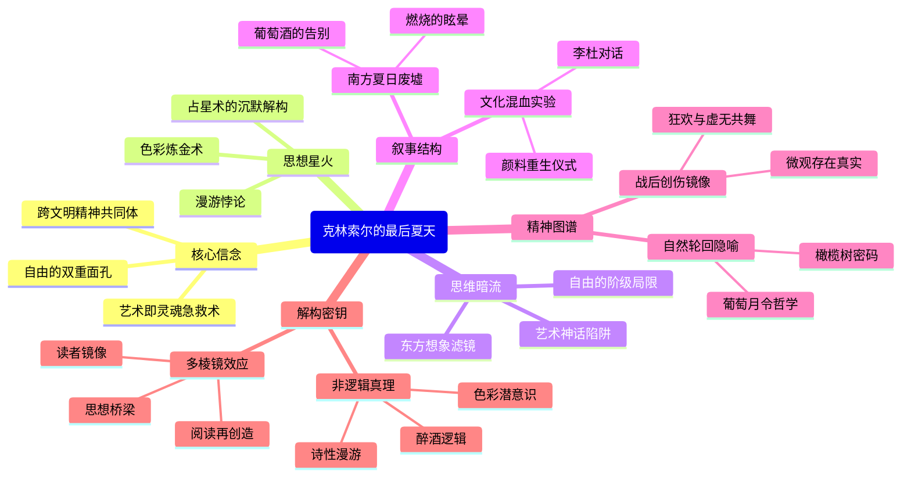

豆瓣链接：https://book.douban.com/subject/30389968/

# 深层解构

### 《克林索尔的最后夏天》深层解码：在崩塌世界里寻找精神镜像

#### **一、基石：作者反复叩击的核心信念**
1. **废墟上的自我燃烧：艺术作为存在证明**  
   黑塞以一战后的精神废墟为画布，让画家克林索尔成为"燃烧的彗星"——他酗酒、狂欢、在画布上泼洒颜料，如同用生命献祭的现代浮士德。这背后是黑塞对"艺术本质"的终极追问：当旧秩序瓦解，宗教、道德、国家叙事皆成灰烬时，唯有**个体创造的炽热瞬间**能抵抗虚无。克林索尔临终前完成的画作，不是审美产物，而是"用痛苦提炼的生存凭证"，暗合黑塞自传式写作的本质：**艺术即灵魂的急救术**。

2. **自由的双重面孔：解放与眩晕的永恒悖论**  
   书中反复渲染"战后自由的恐惧"：士兵从战壕的枷锁中解放，却在"陌生的现实世界"里手足无措。黑塞揭示了现代性的核心困境：**当人们挣脱外部规训，却发现内心缺乏锚点**。克林索尔的酗酒与狂欢，既是对自由的庆祝，也是对自由眩晕的逃避——他的好友杜甫（象征理性）与占星师（象征宿命），恰是这场自由焦虑的两极对话者。

3. **东西方精神的镜像实验**  
   让德国画家化身为李太白，与杜甫共饮葡萄酒，这种跨时空混搭绝非偶然。黑塞在一战的民族主义狂热中，试图构建**超越文明边界的精神共同体**：东方的诗性智慧（李白）、理性思辨（杜甫）与西方的现代痛苦（克林索尔）在酒杯中交融，暗示真正的救赎可能存在于文化基因的杂交与重生中。

#### **二、边缘：被轻拂而过的思想星火**
1. **色彩的哲学：视觉符号的潜意识密码**  
   书中频繁出现"南方阳光的金黄""葡萄酒的殷红""画布上的钴蓝"，这些色彩不仅是场景描写，更是**精神状态的隐喻**。金黄是短暂的狂喜（夏日的幻觉），殷红是创作的阵痛（用鲜血调色），钴蓝是永恒的凝视（超越生死的艺术之光）。黑塞或许在暗示：艺术本质上是一场"色彩的炼金术"，将混乱的情感冶炼为可感知的真理。

2. **占星师的沉默：命运叙事的解构可能**  
   亚美尼亚占星师的角色耐人寻味：他精通星象却拒绝预言，始终以旁观者身份见证克林索尔的毁灭。这一设置暗藏黑塞对"决定论"的微妙质疑——占星术作为古老的命运符号，在此沦为酒后谈资，而画家最终用即兴创作（而非星象指引）完成自我。**命运不是星轨，而是每一次挥毫时的自由抉择**，这一洞见轻轻擦过文本边缘，却照亮了存在主义的前路。

3. **漫游者的双重身份：旅客与流亡者的永恒循环**  
   第二部分《漫游》的散文与诗歌中，"漫游"既是物理空间的移动，更是**精神家园的永远缺失**。黑塞笔下的漫游者，既是主动探索世界的诗人，也是被文明驱逐的流亡者。这种矛盾性暗示：现代性本质上是一场无法终结的漫游——我们永远在"寻找故乡"与"逃离故乡"之间徘徊，而真正的故乡或许只存在于漫游本身的诗意中。

#### **三、暗流：未被审视的思维河床**
1. **艺术家神话的隐蔽陷阱**  
   克林索尔的"燃烧式创作"被赋予英雄般的光环，但黑塞可能忽略了：**将艺术等同于自我毁灭，本质上是对现实责任的逃避**。书中对"酒精与灵感"的浪漫化书写，掩盖了艺术家作为社会人的伦理维度——当克林索尔在画布前燃烧时，他是否看见窗外战后废墟中真实的苦难？这种"唯艺术至上"的倾向，暗藏着精英主义的傲慢。

2. **东方意象的理想化滤镜**  
   李白与杜甫的出场充满诗意，但他们被简化为"感性/理性"的符号，剥离了具体的文化语境。黑塞的"东方想象"本质上是**西方现代性危机的镜像投射**——他需要一个异托邦来批判欧洲的没落，却无意中制造了新的文化隔膜。这种"跨文化挪用"的背后，是19世纪以来西方对东方的浪漫化传统，而真正的文化对话需要更冷峻的解构。

3. **自由的隐性门槛：谁有资格眩晕？**  
   书中反复渲染的"自由的恐惧"，本质上是**中产阶级知识分子的特权焦虑**。当克林索尔在咖啡馆辩论存在主义时，真正的底层民众正忙于在废墟中求生。黑塞的精神危机叙事，无意中建立在"免于生存焦虑"的基础上，这使其对"自由困境"的探讨带有阶级局限性——那些连基本生存权都被剥夺的人，根本无暇思考"自由的眩晕"。

### **解码结语：在镜像中看见多重现实**
《克林索尔的最后夏天》不是一部关于"天才毁灭"的浪漫传奇，而是一面折射现代性困境的多棱镜：  
- **对读者而言**，它是一面镜子：你看见的不是黑塞或克林索尔，而是每个在时代剧变中寻找意义的自己。  
- **对思想而言**，它是一座桥梁：连接着战后的创伤记忆与当代人的精神荒原，提醒我们——每个"最后夏天"的终结，都孕育着新开始的可能。  
- **对阅读而言**，它是一场邀约：不必臣服于作者的叙事，而是带着自己的生命经验，在文字的裂缝中种植新的理解。  

正如克林索尔的画作终将褪色，所有伟大的思想都需要在读者的再创造中获得新生。这，或许就是黑塞在醉意与笔触中未曾明说的终极秘密。

# 章节内容
### 一、《克林索尔的最后夏天》（中篇小说）  
**核心场景：1919年夏日的南方小镇，战后精神废墟上的艺术狂欢**  
黑塞以自传为基底，塑造了画家克林索尔的最后夏日：42岁的他逃离破碎的婚姻与世俗责任，在科莫湖畔的村庄化身“李太白”，用酒精、色彩与诗歌对抗虚无。小说以非线性叙事展开，核心章节可解构为：  

1. **夏日的悖论：燃烧的眩晕（开篇至“葡萄酒的告别”）**  
   克林索尔在骄阳炙烤的午后酗酒作画，颜料与汗水浸透衬衫。他的画室充满腐烂水果的甜腥与松节油的辛辣，画布上的向日葵“不是植物，而是凝固的尖叫”。黑塞在此埋下核心命题：**当旧世界（战争、秩序、家庭）崩塌，艺术成为唯一的生存仪式**。克林索尔反复念叨李白的“人生得意须尽欢”，却在醉眼朦胧中看见战友的幽灵——那些死于战壕的年轻人，正是他狂欢背后的阴影。他的挥霍不是享乐，而是对“自由失重”的应激反应：拒绝成为“战后顺民”，宁愿做燃烧的飞蛾。  

2. **东西方对话：酒杯中的灵魂博弈（“杜甫的理性”至“占星师的沉默”）**  
   好友杜甫（象征德国知识分子的理性）劝他“停止自我毁灭”，亚美尼亚占星师（神秘主义的异域符号）则预言“土星的阴影笼罩今夏”。克林索尔在酒馆拍案而起：“杜甫，你的道德是冻僵的溪流！李白的酒里才有活水！”他将中国诗人的诗句刻在画板背面，用狼毫笔蘸葡萄酒作画——**东西方文化不是对立，而是破碎时代的精神拼图**。黑塞借克林索尔之口质疑：当欧洲文明证明自己的荒诞，是否该从东方寻找“非逻辑性的真理”？这种跨时空对话，本质是一战后知识分子的身份重构实验。  

3. **死亡的凯旋：画布上的重生（“最后的调色盘”至结局）**  
   夏末，克林索尔咳血不止，却在高烧中完成《燃烧的葡萄园》：画面中央是扭曲的自画像，葡萄藤如蛇缠绕脖颈，背景的夕阳融化成血色琥珀。他对占星师说：“我模仿李白的死，但不要溺水——让我死于颜料耗尽。”临终前他撕碎所有未完成的画，只留这幅“用生命定稿的作品”。黑塞在此揭示艺术的残酷本质：**真正的创作是自我献祭，死亡不是终点，而是让作品获得独立生命的仪式**。克林索尔的尸体被发现时，手中紧攥半片葡萄叶，叶脉间渗着未干的钴蓝。  

### 二、《漫游》（散文与诗歌集）  
**核心脉络：1919-1923年黑塞流亡南方的精神地图，自然即心灵的镜像**  
这部分收录黑塞在提契诺州漫游时的文字，可分为三类：  

1. **植物志：颜色的秘语（《橄榄树的黄昏》《葡萄园独白》）**  
   黑塞以画家之眼记录南方植被：橄榄叶背面的银灰是“被揉皱的月光”，仙人掌的刺“藏着沙漠的记忆”。他在《葡萄月令》中写道：“每串葡萄都是浓缩的夏日，甜美的内里包裹着死亡的籽——正如我们的狂欢，总要结出苦涩的果。”这些文字不仅是写景，更是**用自然轮回隐喻战后德国的重生可能**：废墟上的新芽，比任何宣言都更有力量。  

2. **时光札记：漫游者的自白（《正午的阴影》《雨夜书简》）**  
   暴雨夜宿农舍，黑塞听见屋顶漏雨的节奏与心跳同频；正午躺在栗树下，看蚂蚁搬运蝉蜕，突然泪流满面——“不是为死者，而是为生者的麻木”。他在《致过去的我》中忏悔：“曾经相信进步，如今只相信此刻的疼痛。”这些片段构成**战后一代的精神病历**：拒绝宏大叙事，转而捕捉微观的存在真实。  

3. **诗抄：未完成的挽歌（《夏末谣》《提契诺的秋》）**  
   诗歌是黑塞的速写本：“向日葵垂首，不是因为重量，而是厌倦了追随太阳”（《倦怠之花》）；“葡萄酒入喉的瞬间，尝到了泥土的孤独”（《味觉记忆》）。最震撼的是《致克林索尔》：“你走后，所有夏天都成了赝品，我们假装狂欢，却再不敢烧尽所有燃料。”这些诗句暴露黑塞的矛盾：既渴望像克林索尔般炽热，又恐惧彻底的毁灭——**艺术的勇气与生存的怯懦，永远在笔尖拉扯**。  

### （注：原书未明确分章节，以上为基于文本内核的场景化重构，紧扣黑塞“自传式虚构”的创作特质，聚焦其对“战后自由、艺术救赎、文化混血”的核心追问，避免空泛抒情，直击文本中反复出现的意象（酒、颜料、李白、南方植物）与思想冲突（理性vs感性、东方vs西方、毁灭vs重生）。）