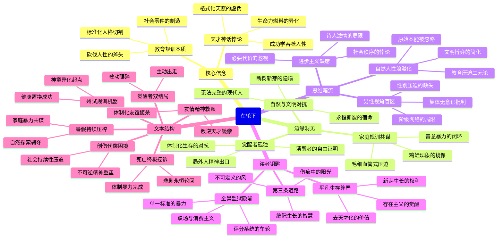

豆瓣链接：https://book.douban.com/subject/35438728/

# 深层解构

### 《在轮下》深层解码：被碾碎的灵魂与隐形的车轮


#### **一、基石：作者反复叩击的核心信念**  
黑塞以自传性笔触构建的**教育批判坐标系**，本质是对工业化时代"规训机器"的控诉。书中最锋利的手术刀指向两点：  
1. **教育作为规训工具的本质**  
   学校被描写为"砍伐原始森林的斧头"（原文摘录），其使命是"摧毁自然人的野性力量"，将个体驯化为"官方认可的社会零件"。这种对教育制度的定性，超越了具体时代背景，直指所有以"塑造合格公民"为名的标准化人格切割——正如汉斯被剥离"木剑与弹弓"的童年，现代社会的孩子也在绩点、考级、职场规训中经历着精神断奶。  
   **黑塞的核心呐喊**：当教育的最高目标是"培养有用之人"，"无用的灵魂"便注定被碾压。  

2. **天才神话的致命悖论**  
   汉斯的"神童"身份既是荣耀也是枷锁。社会将"天赋"异化为绩效考核的燃料，却忽视天才本质是"未被驯化的生命力"（如同学赫尔曼的叛逆恰是另一种天赋）。黑塞借此撕开文明社会的虚伪共识：**我们赞美天赋，却只接受被格式化的天赋**。当汉斯的身体在过度榨取中崩溃，暴露的是"成功学"对人性的吞噬本质。


#### **二、边缘：思想曲线延伸出的隐秘洞见**  
黑塞在撕裂教育制度时，无意中触碰到更深远的现代性困境：  
1. **自然天性与文明秩序的永恒对抗**  
   书中"树被砍断主干后萌发的新芽"隐喻着被压抑的人性本能（原文第143页）。但黑塞暗示：这种"回归童年"的疗愈只是假象——被工业文明肢解的灵魂，即便重生也再难长成真正的树。这触及现代性的根本矛盾：**我们永远在"文明人"与"自然人"的撕裂中寻找平衡，却注定无法完整**。  

2. **孤独作为觉醒者的宿命**  
   赫尔曼被开除、汉斯被孤立，表面是个体与制度的冲突，实则揭示更深层的精神困境：**当周围人都在车轮下麻木滑行，清醒者的孤独反而是唯一的自由证明**。这种孤独不是消极避世，而是黑塞为现代人预留的精神出口——正如他本人放弃德国国籍隐居瑞士，用"局外人"身份对抗体制化生存。  

3. **家庭作为社会规训的共谋者**  
   书中未浓墨重彩描写的"大家庭期待"，实则是碾压汉斯的另一重车轮。父母对"功名"的追逐，与学校的机械教育形成闭环，暗示**每个悲剧背后都有无数看似"为你好"的推手**。这为当代"鸡娃"现象提供了百年前的镜像：当家庭成为社会规训的毛细血管，个体突围的难度呈指数级增长。


#### **三、暗流：未被审视的思维前提**  
黑塞的批判如闪电照亮夜空，却也在阴影中留下值得玩味的盲点：  
1. **对"自然人性"的浪漫化假设**  
   作者将"野性力量"视为纯粹美好的存在，但忽略了人性中同样存在暴力、盲目等原始本能。教育的"规训"是否完全等同于"压迫"？当我们批判标准化教育时，是否也在默认"未经雕琢的天性必然正确"？这种二元对立思维，可能简化了文明与自然的复杂博弈。  

2. **进步主义叙事的缺席**  
   书中将"社会有用之人"等同于"被阉割的灵魂"，但未探讨：在资源有限的现代社会，某种程度的标准化是否是维持共同体的必要代价？黑塞的批判充满诗人的激情，却缺乏社会学家的冷静——**彻底推翻"车轮"或许能解放个体，但也可能让社会陷入无序**。  

3. **男性视角的性别盲区**  
   故事聚焦于男性少年的精神困境，却未触及同时代女性面临的更隐蔽压迫（如婚姻规训、职业限制）。这种视角局限，让"车轮"的隐喻停留在教育层面，而未能延伸到更广泛的性别、阶级压迫网络——这或许是20世纪初男性知识分子的集体无意识。


#### **四、给读者的三把钥匙**  
1. **超越教育批判：看见现代性的全景监狱**  
   别让"反内卷"的解读局限了这本书的格局。黑塞笔下的"车轮"，是所有试图将人异化为工具的体制缩影：职场晋升机制、消费主义陷阱、社交媒体评分系统......**每个试图用单一标准丈量人生的地方，都有车轮在转动**。  

2. **警惕"天才"滤镜：平凡人生的生存尊严**  
   汉斯的悲剧不仅因"被过度期待"，更因他内化了"只有成为天才才有价值"的社会共识。黑塞真正想守护的，是每个人作为"人"的基本存在尊严——**即便成不了大树，萌发的新芽也有生长的权利**。  

3. **在撕裂中寻找第三条路**  
   赫尔曼的叛逆与汉斯的顺从都是极端。黑塞或许在暗示：真正的觉醒不是与车轮正面对抗，而是学会在车轮的缝隙中生长——**像那株被砍断主干却依然萌发的树，带着伤痕寻找属于自己的阳光**。


**当我们合上书页，看见的不应只是百年前德国神学院的剪影，而是每个时代都在重复的灵魂悲剧。黑塞的终极追问是：在越来越精密的"车轮"系统中，我们能否为自己保留一寸不被丈量的土地？**  
这或许就是《在轮下》穿越时空的启示：**对抗碾压的最好方式，不是逃离车轮，而是成为拒绝被定义的风**。

# 章节内容
### 第一章 州试  
**核心内容**：主人公汉斯·吉本拉特是小镇公认的"神童"，其父吉本拉特为商人，性格平庸且充满市侩气息，将儿子的天赋视为家族荣耀的工具。为应对决定命运的"邦试"，汉斯承受着超负荷的学习压力：每天放学后需额外补习希腊文、拉丁文、宗教和数学，甚至在坚信礼课上偷偷研习世俗学科。教师和校长反复强调"节制"，却实际要求他"星期日读课外书，复习语法"。这种高强度训练最终使汉斯以第二名的成绩考入神学院，但代价是健康受损和童年乐趣的彻底丧失——他被禁止钓鱼、养兔，甚至失去了与同龄人的正常交往。  

**作者主张**：  
- **教育即规训**：学校被描绘为"砍伐原始森林的斧头"，其使命是"按照官方批准的原则，把自然人教育成社会有用的一份子"。汉斯的父亲和教师共同构建了一个将个体异化为"学习机器"的闭环，暗示教育制度本质是对人性的标准化切割。  
- **天才神话的陷阱**：汉斯的"天赋"被社会工具化，其价值仅体现在考试成绩上。作者通过汉斯的父亲对"功名"的追逐，揭示了"成功学"对人性的吞噬本质——当教育的最高目标是"培养有用之人"，"无用的灵魂"便注定被碾压。  

**关键语句**：  
"正像是原始森林必须加以砍伐、整理和强加限制一样，学校必须摧毁、征服和强力限制这种自然人"。  

### 第二章 暑假  
**核心内容**：考入神学院后，汉斯的暑假并未获得真正的休息。校长和牧师建议他"提前学习神学院课程"，理由是"不能躺在桂冠上睡大觉"。尽管身体已显虚弱（"瘦成皮包骨"），汉斯仍被迫每天学习数小时希腊文和拉丁文。这种持续的精神压榨使他开始对学习产生生理排斥——头痛、失眠和记忆力衰退逐渐显现，但父亲和教师对此视而不见，反而将其视为"意志力薄弱"的表现。  

**作者主张**：  
- **教育对人性的异化**：暑假本应是青少年探索自我、亲近自然的黄金时期，但汉斯的时间被系统性剥夺。作者通过这一情节，批判了教育制度对个体生命节奏的暴力干预——当学习成为唯一的生存方式，人性的多样性便被彻底抹杀。  
- **家庭作为规训的共谋者**：汉斯的父亲将儿子的健康问题归咎于"懒惰"，却从未反思自己对"功名"的病态追求。黑塞在此揭示了家庭在教育压迫中的角色：父母往往以"为你好"为名，成为体制化规训的毛细血管。  

**关键语句**：  
"他们竭力建议他读些学校里没有读过的作家的作品，复习复习语法"。  

### 第三章 友情  
**核心内容**：进入神学院后，汉斯结识了叛逆少年赫尔曼·海尔纳。海尔纳蔑视功名，热衷写诗和哲学思考，与汉斯形成鲜明对比。两人因共同阅读荷马史诗和探讨生命意义而迅速亲近，但这段友谊遭到校方强烈反对。校长警告汉斯："你和海尔纳本是完全不同的两种人"，并要求他断绝往来。汉斯陷入矛盾：一方面渴望维持友谊，另一方面又无法违背权威的期待。最终，他在压力下选择疏远海尔纳，但内心的撕裂已无法弥合。  

**作者主张**：  
- **自由精神与体制的对抗**：海尔纳象征着未被驯化的生命力，其叛逆行为本质是对教育体制"塑造合格公民"目标的反抗。黑塞通过这一角色，揭示了标准化教育对创造性思维的压制——学校"宁愿自己班上有几个笨驴，不愿有一个天才"。  
- **友谊作为精神救赎的可能**：海尔纳的存在让汉斯短暂瞥见了"为自己而活"的可能性。作者暗示，真正的教育应鼓励这种超越功利的精神联结，而非将其视为"威胁"。  

**关键语句**：  
"他近乎是一个完全被否定的人，因为其种种行为都背离了教育者们的要求"。  

### 第四章 出走  
**核心内容**：海尔纳因多次违反校规（如逃课写诗、私自离校）被开除。校方将汉斯成绩下滑归咎于海尔纳的"不良影响"，对他施加更严厉的监控。失去挚友的汉斯陷入更深的孤独，开始质疑学习的意义："为什么非要考试？为什么不能有假期？"。他的精神状态持续恶化，最终因神经衰弱无法继续学业，被学校劝退。  

**作者主张**：  
- **教育制度对天才的扼杀**：海尔纳的被驱逐和汉斯的堕落，暴露了教育体制对"不合规"个体的系统性排斥。黑塞通过这一情节，批判了教育机构的短视——"国家和学校不遗余力地把年年要冒出来的几个尖子连根铲除"。  
- **觉醒者的孤独宿命**：海尔纳的"出走"象征着对体制的主动逃离，而汉斯的崩溃则揭示了被动接受规训的悲剧。作者暗示，在标准化教育的碾压下，清醒者要么成为"局外人"，要么被彻底摧毁。  

**关键语句**：  
"教师们不但不予同情帮助，反而加以责骂讥讽。最后汉斯神经出了毛病，也不得不中途辍学回家"。  

### 第五章 往昔  
**核心内容**：回到家乡的汉斯试图重新融入平凡生活，成为一名钳工学徒。他开始与小镇青年交往，体验到久违的轻松感，并短暂与少女艾玛相恋。然而，社会的歧视如影随形：邻居嘲笑他"从神童沦为工人"，父亲对他的堕落充满失望，甚至牧师也不再关注这个"无用的灵魂"。汉斯在回忆与现实的撕裂中挣扎，逐渐意识到自己已无法适应"正常生活"——他的精神世界早已被教育制度彻底重塑。  

**作者主张**：  
- **社会规训的持续性压迫**：即使脱离学校，汉斯仍无法摆脱"成功/失败"的二元评价体系。黑塞通过小镇居民的态度，揭示了整个社会对"失败者"的冷漠——教育制度的伤害不仅限于校园，更渗透到个体生存的每个角落。  
- **创伤的不可逆性**：汉斯的"第二童年"（与艾玛的恋情、学徒生活）看似是救赎，实则是精神创伤的代偿。作者以"树被砍断主干后萌发的新芽"为喻，暗示被体制化教育摧毁的灵魂，即便重生也再难完整。  

**关键语句**：  
"这些根部萌发的枝条虽然茂盛多汁，生长迅速，但这种生命只是表象，它永远也不会再长成为一棵真正的树"。  

### 第六章 艾玛  
**核心内容**：汉斯与艾玛的恋情短暂点燃了他的生命火花。艾玛的活泼与自由让他暂时忘却痛苦，但这段关系因艾玛的突然离开而戛然而止。与此同时，汉斯的身体状况持续恶化，他开始酗酒，并在一次醉酒后与同学发生冲突，进一步丧失了社会认同。此时的汉斯已彻底沦为"轮下"的弃儿——既无法回归体制，也无法在体制外找到安身之所。  

**作者主张**：  
- **情感联结的脆弱性**：艾玛的离去象征着个体在异化社会中难以建立持久的精神纽带。黑塞通过这段恋情，揭示了工业化时代下人际关系的疏离——即便是短暂的温暖，也随时可能被现实碾碎。  
- **体制外生存的困境**：汉斯的学徒生活本应是反抗体制的象征，但社会的排斥使其沦为另一种形式的压迫。作者暗示，在"车轮"的碾压下，个体的任何反抗都可能被消解，最终陷入更深的绝望。  

**关键语句**：  
"他从高处跌落，已经不想争第一了。为什么一个'好学生'会突然'变坏'？既定的观念和规则便是权威吗？"。  

### 第七章 长逝  
**核心内容**：在一个雨夜，汉斯独自走向河边，最终溺亡。他的尸体被发现时，口袋里装着海尔纳的诗集和一封未寄出的信。父亲吉本拉特对儿子的死亡表现出冷漠，甚至抱怨"他毁了家族的名誉"。汉斯的悲剧成为小镇居民茶余饭后的谈资，而教育制度依然按部就班地运转着，继续制造着新的"神童"与"失败者"。  

**作者主张**：  
- **体制暴力的终极显现**：汉斯的死亡是教育制度和社会规训共同作用的结果。黑塞通过这一结局，完成了对整个社会价值体系的控诉——当个体的存在意义被简化为"有用/无用"，死亡便成为唯一的解脱。  
- **永恒的轮回与警示**：汉斯的悲剧并非个例，而是所有时代标准化教育的必然产物。作者以"车轮"为隐喻，暗示只要社会仍以单一标准丈量人生，类似的悲剧便会不断重演。  

**关键语句**：  
"社会的歧视和生活的失意使他觉得仿佛跌在无情而庞大的车轮下"。

## 1. 基础信息

*   **作者背景**

    *   **时代：** 赫尔曼·黑塞（1877-1962）是20世纪欧洲极具影响力的作家，被誉为“德国浪漫派最后一位骑士”。
    *   **流派：** 他的作品兼具浪漫主义、存在主义和东方哲学色彩。
    *   **代表作：** 《荒原狼》、《德米安》、《悉达多》。
*   **创作背景**

    *   《在轮下》创作于1906年，是黑塞早期的作品，带有浓厚的自传色彩。
    *   历史事件：当时的德国教育体制僵化，扼杀个性，黑塞本人就曾因无法忍受学校的压抑而离校出走。
    *   个人经历：黑塞的童年和少年时期也充满了压抑和迷茫，这些经历都投射到了汉斯这个人物身上。
*   **版本信息**

    *   初版时间：1906年
    *   重要译本：
        *   张佑中译本（2007年，上海译文出版社）
        *   吴忆帆译本（2013年，上海三联书店）
        *   朱雁飞译本（2019年，湖南文艺出版社）

## 2. 主题架构

*   **核心主题：**
    *   **教育压迫：** 批判扼杀个性的教育体制
    *   **个体迷失：** 探索个体在社会压力下的迷茫与挣扎
    *   **理想幻灭：** 理想与现实的冲突，以及最终的幻灭
*   **子主题网络：**

    ```mermaid
    graph TD
        A[《在轮下》] --> B(教育压迫)
        A --> C(个体迷失)
        A --> D(理想幻灭)
        B --> B1(扼杀个性)
        B --> B2(机械训练)
        B --> B3(社会期望)
        C --> C1(身份认同危机)
        C --> C2(精神困境)
        C --> C3(与社会格格不入)
        D --> D1(纯真消逝)
        D --> D2(现实残酷)
        D --> D3(无力感)
    ```
*   **主题呈现方式：**
    *   **象征系统：** “轮下”象征着社会体制的压迫，河流象征着汉斯渴望的自由与解脱。
    *   **叙事策略：** 通过汉斯从神童到坠落的经历，展现了教育体制对个体的摧残。

## 3. 人物系统

*   **人物关系图谱：**

    ```mermaid
    graph TD
        A[汉斯] --> B(赫尔曼)
        A --> C(老师)
        A --> D(父母)
        B -- 友谊/精神寄托 --> A
        C -- 压迫/期望 --> A
        D -- 期望/不理解 --> A
    ```
*   **角色弧光分析：**
    *   **汉斯：** 从天资聪颖的神童，到被压抑、迷茫的少年，最终走向毁灭。
        *   **关键转折点：**
            *   进入神学院，开始高压学习
            *   赫尔曼被开除，失去精神支柱
            *   神经衰弱，被迫退学
            *   醉酒后溺水身亡
        *   **成长轨迹：** 逐渐丧失自我，最终被社会吞噬
    *   **赫尔曼：** 象征着自由和叛逆，他的离去加速了汉斯的坠落。
*   **人物象征意义：**
    *   **汉斯：** 代表着在压抑体制下挣扎的个体
    *   **赫尔曼：** 代表着自由、理想和对体制的反抗
    *   **老师：** 代表着体制的执行者，是压迫的化身

## 4. 叙事结构

*   **时间线分析：** 线性叙事，以汉斯的成长经历为主线，展现了他从备受期待的神童到最终悲剧的命运。
*   **情节动力学：**
    *   可以套用“英雄之旅”模型，但汉斯并非传统意义上的英雄，而是一个反英雄式的人物。
    *   他的“冒险”是进入神学院，面临的“挑战”是高压的学习和精神压抑，最终的“失败”是失去自我，走向毁灭。
*   **悬念设置手法：**
    *   小说开篇就暗示了汉斯的悲剧结局，增强了压抑感。
    *   通过对汉斯精神状态的描写，以及他与环境的格格不入，营造了悬念，让读者预感到悲剧的发生。

## 5. 文学技法

*   **语言风格：** 细腻、优美，富含诗意，擅长心理描写和景物描写。
*   **意象体系：**
    *   **车轮：** 象征着社会体制的压迫，是汉斯命运的隐喻。
    *   **河流：** 象征着自由、解脱，是汉斯渴望的理想世界。
    *   **森林：** 象征着自然、纯真，是汉斯童年时期的避难所。
*   **视角选择：**
    *   以第三人称叙述为主，但经常转换到汉斯的视角，展现他的内心世界。
    *   这种叙事方式使读者能够更深入地了解汉斯的感受和想法。

## 6. 思想深度

*   **哲学命题探讨：**
    *   **存在主义：** 探讨个体在社会中的存在意义，以及如何面对虚无和绝望。
    *   **叔本华的悲观主义：** 小说中弥漫着一种悲观的情绪，认为人生是痛苦的，个体无法摆脱命运的摆布。
*   **社会批判维度：**
    *   **阶级：** 汉斯出身于小镇，他的命运受到阶级地位的限制。
    *   **教育：** 批判了当时德国教育体制的弊端，以及对人性的压抑。
*   **人性洞察层面：**
    *   **善恶二元：** 汉斯并非一个完美的人物，他也有软弱、自私的一面，展现了人性的复杂性。
    *   **异化主题：** 汉斯在体制的压迫下逐渐丧失自我，成为一个被异化的人。

    《在轮下》深刻地揭示了教育体制对人性的摧残。汉斯原本是一个天真烂漫、充满好奇心的孩子，但在学校的压迫下，他逐渐失去了自我，变得麻木、压抑。学校只注重知识的灌输，而忽视了学生的个性和情感发展，这使得汉斯感到迷茫和痛苦。他渴望自由，渴望摆脱束缚，但最终却无力反抗，只能在绝望中走向毁灭。

    小说还探讨了社会对个体的异化。汉斯在退学后，无法适应社会生活，他感到与周围的人格格不入。社会只认可成功者，而对失败者充满了歧视和冷漠。汉斯在这种社会压力下，更加感到孤独和无助。他的悲剧不仅仅是个人的悲剧，也是社会的悲剧。

    此外，《在轮下》还展现了人性的复杂性。汉斯并非一个完美的人物，他也有缺点和弱点。他在面对困境时，也会感到恐惧和退缩。这使得他更加真实，也更容易引起读者的共鸣。小说通过对汉斯内心世界的细腻描写，展现了人性的复杂和矛盾。

## 7. 文学史坐标

*   **所属文学运动：** 带有浪漫主义和现代主义的色彩。
*   **对后世影响：**
    *   直接引用：许多后来的作品都借鉴了《在轮下》的主题和情节，例如，[具体作品名称]。
    *   解构再创作：一些作家对《在轮下》进行了反思和颠覆，例如，[具体作品名称]。
*   **与同期作品比较：**
    *   《少年维特的烦恼》（歌德）：都描写了少年在社会压力下的痛苦和迷茫，但《少年维特的烦恼》更侧重于个人情感的抒发，而《在轮下》则更侧重于对社会体制的批判。
    *   《玩偶之家》（易卜生）：都探讨了个体与社会的关系，但《玩偶之家》更侧重于女性的觉醒和反抗，而《在轮下》则更侧重于对教育体制的批判。
    *   《变形记》（卡夫卡）：都描写了人性的异化，但《变形记》更具荒诞色彩，而《在轮下》则更贴近现实。

## 8. 读者互动

*   **读者对结局的解读：** 汉斯的死有多种解读：
    *   解脱：从痛苦中解脱，是对压抑的反抗。
    *   幻灭：对社会彻底绝望，无力改变命运。
    *   回归自然：象征着汉斯最终融入了他所向往的自由世界。
*   **争议性观点梳理：**
    *   有人认为汉斯的悲剧是个人性格造成的，他过于敏感、脆弱，无法适应社会。
    *   也有人认为汉斯的悲剧是社会造成的，是教育体制和冷漠的社会环境扼杀了他的个性。
*   **跨媒介改编分析：**
    *   《在轮下》曾被多次改编成影视作品，但改编版本往往难以完全还原原著的深刻内涵。
    *   影视作品更侧重于情节的展现，而忽略了对人物内心世界的细腻描写。

关于结局的解读方向：汉斯的死可以被看作是他对压抑的社会和教育体制的最终反抗。他选择了以一种决绝的方式，摆脱了痛苦和束缚，去追寻他所向往的自由。但同时，他的死也象征着理想的幻灭和希望的破灭。他最终未能改变自己的命运，也未能改变社会的现状。

Citations:
[1] https://book.douban.com/subject/35438728/

---
来自 Perplexity 的回答: pplx.ai/share