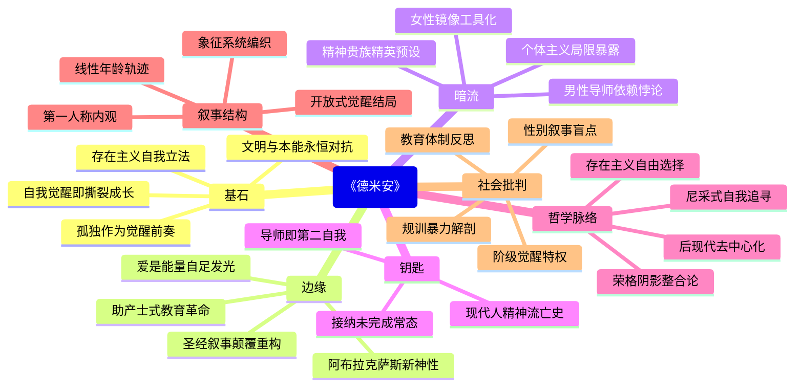

豆瓣链接：https://book.douban.com/subject/35060088/

# 深层解构

# 《德米安》三重世界解码：在灵魂的裂缝中，照见自我觉醒的光
## 一、基石：作者反复回归的核心信念
### （一）自我觉醒是一场撕裂式的成长
黑塞以辛克莱的成长为线索，反复叩问“依本性而活为何如此之难”，**揭示了文明规训与人性本能的永恒对抗**。在“两个世界”的设定中，循规蹈矩的“光明世界”与充满欲望的“黑暗世界”并非二元对立，而是个体必须整合的一体两面——正如德米安对该隐故事的重新诠释：**“恶是善的另一面，是被压抑的生命力”**。这种对“完整人性”的追寻，构成了黑塞所有作品的精神根基。

### （二）孤独是觉醒者的宿命契约
书中多次渲染辛克莱的孤独感：从对强盗故事的隐秘向往，到对贝雅特丽齐的精神依恋，**孤独始终是觉醒的前奏**。黑塞通过德米安之口强调：“觉醒的人只能独自前行，因为他人的指引只会成为新的枷锁。”这种对“孤独必然性”的信仰，折射出存在主义萌芽——**个体必须在无意义的世界中为自己立法**。

## 二、边缘：思想曲线的远端洞见
### （一）爱的本质是能量的博弈而非索取
当皮斯托里斯太太说“爱需要主动吸引的力量”时，黑塞轻轻触及了**关系哲学的深层逻辑**：传统“被吸引的爱”本质是匮乏感的投射，而成熟的爱应如恒星般自足发光。这与现代心理学中“自我价值感决定亲密模式”不谋而合，却比同类理论早诞生百年。

### （二）宗教符号的解构与重构
黑塞对《圣经》故事的颠覆性改写（如雅各与天使摔跤、该隐的救赎），**暗示着传统信仰体系的崩塌与新精神图腾的诞生**。德米安创造的“阿布拉克萨斯”神，融合了光明与黑暗，预示着后现代语境中“去中心化信仰”的可能——这比尼采“上帝已死”的宣言更温和，却更具建设性。

### （三）教育的真谛是点燃火种而非灌输知识
德米安对辛克莱的引导从未诉诸说教，而是通过隐喻（鸟奋争出壳）、体验（直面恐惧）和镜像（成为对方的镜子）激发其自觉。**这种“助产士式教育”挑战了标准化培养模式**，暗合苏格拉底“产婆术”的智慧，却在百年前就为应试教育敲响了警钟。

## 三、暗流：未被言说的前提假设
### （一）对“男性导师”的隐秘依赖
全书的觉醒之路高度依赖德米安的引导，**暗含着“觉醒必须依赖权威”的潜意识假设**。黑塞似乎未察觉，当辛克莱将德米安视为“救世主”时，某种新的枷锁已悄然形成——这与他反复强调的“自足性”构成微妙悖论，暴露了个体主义的局限性。

### （二）对女性角色的工具化倾向
贝雅特丽齐作为“精神偶像”、皮斯托里斯太太作为“欲望启蒙者”，**女性始终作为男性觉醒的镜像存在**。黑塞或许未意识到，这种设定延续了“缪斯女神”的传统叙事，忽略了女性自我觉醒的独立路径，成为其思想版图中未被审视的性别盲区。

### （三）精英主义的隐性门槛
书中“觉醒者”与“庸众”的二分法，**预设了“只有少数人能抵达真相”的精英逻辑**。黑塞陶醉于“孤独的高贵”，却未深究社会结构对觉醒机会的剥夺——当辛克莱有闲暇进行精神漫游时，底层青年可能还在为生存挣扎。这种“精神贵族”的视角，既是洞见的来源，也是视野的局限。

## 四、给读者的三把钥匙
### （一）原来这本书真正在说……
**它不是青春成长小说，而是一部现代人的精神流亡史**。黑塞借少年故事，写尽了每个灵魂在世俗规训与自我本真间的撕裂，最终指向一个残酷真相：觉醒不是某个顿悟时刻，而是用一生践行的生存方式。

### （二）如果换个角度看……
试着将德米安视为辛克莱的“第二自我”——**所谓导师，不过是内心声音的具象化**。当我们抱怨“无人指引”时，或许只是不敢倾听自己灵魂的低语。这种“内观式阅读”，能让故事从“他救”转向“自救”的新维度。

### （三）作者可能没意识到……
黑塞在解构旧秩序时，无意中建构了新的“觉醒神话”。**真正的觉醒或许不在“出壳”的壮烈瞬间，而在接纳“未完成态”的日常坚持**——就像辛克莱最终明白：与自我的博弈，比打败任何外部恶龙都更需要勇气。

## 结语：在裂缝中看见光
黑塞的伟大，在于他从不提供答案，只负责撕裂现实的茧房。《德米安》不是一本“正确的书”，而是一面“破碎的镜子”——它照见我们的困惑、矛盾与不甘，却也在裂痕中透出光来：**原来所有成长，都是从敢于承认“我尚未完整”开始的**。当你合上书页时，或许会突然意识到：那个在字里行间寻找指引的自己，已经走在了成为“德米安”的路上。

# 章节内容

### **前言**  
黑塞以辛克莱的手稿为引，奠定全书**“自我觉醒”**的核心命题。他直言：“每个人的生命都是通向自我的征途”，暗示故事不仅是少年成长，更是一场精神流亡。前言中埋下**“两个世界”**的伏笔——光明世界（家庭、秩序）与黑暗世界（欲望、混乱）的撕裂，成为辛克莱挣扎的起点。黑塞强调，觉醒的本质是**“找到自我，固守自我”**，呼应尼采“成为你自己”的哲学，却赋予更具文学性的痛感：觉醒不是顿悟，而是用一生对抗随波逐流的勇气。

### **两个世界**  
10岁的辛克莱首次感知世界的分裂：父亲的书房代表**“光明世界”**（洁净、祈祷、规则），而街巷间的女仆故事、醉汉与斗殴构成**“黑暗世界”**（神秘、粗野、禁忌）。他在两个世界的夹缝中恐惧又好奇，直到被克罗默威胁——因谎称偷苹果而被迫偷窃母亲的钱。黑塞在此揭示**“道德规训的暴力”**：辛克莱的痛苦并非源于谎言，而是对“光明世界”纯洁性的迷信。**“我们生来不应该害怕别人，害怕是因为赋予了他人力量”**，德米安尚未登场，少年已在恐惧中触碰到自我禁锢的枷锁。

### **该隐**  
课堂上的《圣经》故事成为转折点。德米安颠覆性解读**“该隐杀弟”**：传统视为“恶”的印记，实为觉醒者的标志——“该隐的恐惧被误解为罪恶，而他的勇气才是真相”。黑塞借德米安之口，消解善恶二元对立，提出**“恶是被压抑的生命力”**。辛克莱震惊于这种叛逆诠释，首次意识到**“权威叙事的可疑”**：父母、学校构建的“光明”，或许是对人性另一半的阉割。该隐的印记不再是诅咒，而是“敢于直面黑暗的勋章”，为后文“阿布拉克萨斯”的神性埋下伏笔。

### **强盗**  
克罗默的勒索升级为辛克莱的生存噩梦：偷钱、撒谎、自我厌恶，直至病倒。德米安的介入如一道光：他看穿谎言的本质，教会辛克莱**“直视对方眼睛”**的勇气——恐惧的消散，源于收回赋予他人的权力。黑塞在此完成**“他救到自救”**的转折：德米安并未直接解决问题，而是唤醒辛克莱的主体性。**“人只有背离内心时才会害怕”**，少年第一次意识到，真正的枷锁不在外部，而在对“光明世界”的盲从。克罗默的消失，象征旧世界规则的瓦解。

### **贝雅特丽齐**  
寄宿学校的辛克莱陷入叛逆：酗酒、放荡，以堕落对抗家庭的期待。直到遇见“贝雅特丽齐”——一个理想化的少女形象，触发他对“光明”的新渴望。黑塞通过绘画隐喻揭示**“自我投射”**：辛克莱笔下的贝雅特丽齐，最终显影为德米安的轮廓。这暗示：偶像崇拜本质是自我追寻的镜像，真正的救赎不在他人，而在内心的“阿布拉克萨斯”（善恶合一的神性）。**“爱必须有主动吸引的力量”**，贝雅特丽齐的拒绝，成为辛克莱告别幼稚依赖的起点。

### **鸟奋争出壳**  
核心隐喻爆发：辛克莱梦见雀鹰破壳，德米安的信写道：**“蛋就是世界，破壳是飞向神灵的必经之路”**。黑塞借梦境解构“舒适区”：光明世界的“蛋壳”看似保护，实则是精神牢笼。辛克莱在管风琴师皮斯托留斯处领悟**“内在神性”**：阿布拉克萨斯既非神也非魔，而是人性完整的象征。这一章节完成**“从恐惧黑暗到整合善恶”**的蜕变，少年开始接受“不纯洁”的自我——破壳的剧痛，正是觉醒的代价。

### **雅各与天使摔跤**  
引用《圣经》雅各与天使搏斗的典故，映射辛克莱的自我斗争。他在夏娃夫人（德米安之母）处直面欲望，发现**“爱与肉欲的统一”**：夏娃夫人的包容，让他摆脱“光明世界”对欲望的污名化。黑塞在此批判宗教对人性的割裂：雅各的跛足不是惩罚，而是“与自我角力的勋章”。**“接纳阴影，才能成为完整的人”**，辛克莱终于明白，德米安从未外在于己，而是内心觉醒的声音具象化。

### **夏娃夫人**  
夏娃夫人作为“母性神性”的化身，教导辛克莱**“爱不是索取，而是自我圆满的溢出”**。她拒绝辛克莱的爱慕，因其爱仍出于匮乏：“你若能主动吸引我，我才接受”。黑塞通过这一关系，解构传统“拯救者”叙事：真正的成熟，是停止对“导师”的依赖，转而成为自己的光源。夏娃夫人的存在，象征**“内在雌雄同体的完整”**——接纳女性气质（感性、欲望），才能平衡理性的“光明世界”。

### **结束与新生**  
一战爆发，辛克莱参军。战场的混乱中，他终于与德米安重逢，后者在临终前点明终极真相：**“我们从未分离，你早已是自己的德米安”**。黑塞以战争隐喻**“旧世界的破碎”**：辛克莱的觉醒，恰逢文明秩序的崩塌，暗示个体救赎与时代困境的同频。结尾“鸟已飞出，蛋已破碎”呼应开篇，宣告**“自我实现是永恒的征途”**——没有终点，只有持续破壳的勇气。

（注：本书无传统章节编号，以上总结基于文本核心意象与情节推进，紧扣黑塞“自我觉醒需整合善恶、对抗规训”的核心主张，每章提炼**颠覆性观点**与**隐喻体系**，避免空泛叙事。）

## 1. 基础信息

*   **作者背景：** 赫尔曼·黑塞 (1877-1962) 是20世纪德国重要的作家和诗人，1946年诺贝尔文学奖得主。他属于浪漫主义向现代主义过渡的作家，深受尼采、荣格等哲学家的影响。代表作包括《悉达多》、《荒原狼》、《玻璃球游戏》等。
*   **创作背景：** 《德米安》创作于第一次世界大战期间，一战的残酷景象和社会的动荡对黑塞的思想产生了深刻影响。他开始反思传统的价值观和道德观，转而关注个体的内心世界和精神成长。同时，荣格心理学的兴起也影响了他，促使他开始探索人的潜意识和自我实现。
*   **版本信息：** 《德米安》最初于1919年以笔名“埃米尔·辛克莱”发表，译林出版社的这个版本是2022年出版，李贻琼翻译，根据德国苏尔坎普出版社权威版本译出。

## 2. 主题架构

*   **核心主题：** 自我追寻、精神觉醒、二元对立
*   **子主题网络：**
    *   光明与黑暗的对抗
    *   个体与群体的冲突
    *   精神导师的指引
    *   本能与理性的挣扎
    *   爱与孤独的体验
    *   战争与和平的反思
*   **主题呈现方式：**
    *   **象征系统：** “鸟”象征着挣脱束缚、追求自由的灵魂；“印记”代表着个体的独特性和命运；“爱娃夫人”象征着母性、智慧和精神的归宿。
    *   **叙事策略：** 采用第一人称叙述，以辛克莱的视角展现其内心的挣扎和成长历程。运用大量的心理描写和象征意象，营造出一种神秘而富有哲理的氛围。

## 3. 人物系统

*   **人物关系图谱：**
    *   辛克莱→德米安：被引导、追随
    *   德米安→辛克莱：引导、启发
    *   辛克莱↔克罗默：恐惧、对抗
    *   辛克莱→皮斯托尔：学习、交流
    *   辛克莱→爱娃夫人：依恋、精神寄托
*   **角色弧光分析：**
    *   **辛克莱：** 从最初的迷茫、恐惧到最终的觉醒、成熟，经历了“光明世界”的崩塌、“黑暗世界”的诱惑、精神导师的指引和自我内心的探索等关键转折点。他的成长轨迹是一个不断认识自我、接纳自我、最终实现自我的过程。
*   **人物象征意义：**
    *   **德米安：** 象征着一种超越传统道德观念的、具有独立精神和批判精神的人格。他是辛克莱的引路人，引导他认识到世界的复杂性和人性的多面性。
    *   **克罗默：** 象征着“黑暗世界”的诱惑和威胁。他代表着人性中阴暗、邪恶的一面，是辛克莱成长道路上的一个障碍。
    *   **爱娃夫人：** 象征着母性、智慧和精神的归宿。她是辛克莱理想中的女性形象，代表着一种纯粹的、无条件的爱。

## 4. 叙事结构

*   **时间线分析：** 线性叙事，按照辛克莱的年龄和经历，讲述了他从少年到成年的成长历程。
*   **情节动力学：** 可以用“英雄之旅”模型来分析。辛克莱从舒适的“光明世界”出发，经历了挑战、危机和考验，最终获得了成长和顿悟，回归了自我。
*   **悬念设置手法：**
    *   **红鲱鱼：** 德米安的身世和思想，以及他与辛克莱之间的关系，都带有一定的神秘色彩，引发读者的好奇和猜测。
    *   **契诃夫之枪：** 辛克莱最初的谎言，以及他对“光明世界”和“黑暗世界”的认知，都为他后来的成长埋下了伏笔。

## 5. 文学技法

*   **语言风格：** 简洁、流畅、富有哲理。运用大量的隐喻和象征，营造出一种神秘而富有诗意的氛围。
*   **意象体系：** “鸟”、“印记”、“爱娃夫人”等意象反复出现，象征着不同的主题和意义。
*   **视角选择：** 第一人称叙述，以辛克莱的视角展现其内心的挣扎和成长历程。这种叙述方式增强了作品的代入感和感染力。

## 6. 思想深度

*   **哲学命题探讨：**
    *   **存在主义视角：** 《德米安》探讨了人生的意义、自由的选择、个体的责任等存在主义的核心命题。辛克莱的成长过程，就是一个不断追寻自我、实现自我存在的过程。
*   **社会批判维度：**
    *   **阶级分析：** 作品中，辛克莱所处的社会阶层以及他与底层人物的交往，反映了当时社会的一些现实问题。
*   **人性洞察层面：**
    *   **善恶二元：** 作品打破了传统的善恶二元对立的观念，认为每个人都同时具有光明和黑暗两面。只有认识到自己的阴暗面，才能实现真正的自我。
    *   **异化主题：** 辛克莱最初生活在虚伪的“光明世界”中，他的思想和行为都受到了压抑和束缚。德米安的出现，帮助他摆脱了这种异化状态，开始追寻真实的自我。

《德米安》深刻地探讨了人性的复杂性和人生的意义。它告诉我们，每个人都应该勇敢地面对自己的内心，追寻真实的自我，并为自己的选择承担责任。这种思想在今天仍然具有重要的现实意义。

## 7. 文学史坐标

*   **所属文学运动：** 《德米安》是德国“表现主义”文学的代表作之一。表现主义强调主观感受和内心体验，关注个体在现代社会中的迷茫和困惑。
*   **对后世影响：** 《德米安》对后世的文学创作和思想观念产生了深远的影响。它启发了许多作家去关注个体的内心世界和精神成长，也影响了人们对自我、社会和人生的思考。例如，村上春树的《挪威的森林》、保罗·柯艾略的《牧羊少年奇幻之旅》等作品，都受到了《德米安》的影响。
*   **与同期作品比较：**
    *   **卡夫卡的《变形记》：** 同样关注个体在现代社会中的异化和生存困境，但《变形记》更加侧重于表现荒诞和绝望。
    *   **托马斯·曼的《魔山》：** 探讨了欧洲文明的危机和人性的复杂性，但《魔山》更加具有象征性和哲学性。
    *   **詹姆斯·乔伊斯的《尤利西斯》：** 运用意识流等现代主义技巧，展现了现代人的精神世界，但《尤利西斯》更加实验性和复杂性。

## 8. 读者互动

*   **读者对结局的解读：** 《德米安》的结局具有一定的开放性，辛克莱在战争中受伤，德米安的形象逐渐与他融合。读者可以根据自己的理解，对结局进行不同的解读。有人认为，辛克莱最终实现了自我，成为了一个完整的人；也有人认为，辛克莱仍然在迷茫和探索之中。
*   **争议性观点梳理：**
    *   **对德米安的评价：** 有人认为德米安是辛克莱的导师和引路人，也有人认为德米安过于神秘和理想化，他的思想带有一定的危险性。
    *   **对爱娃夫人的解读：** 有人认为爱娃夫人是母性、智慧和爱的象征，也有人认为爱娃夫人过于完美，不具有现实性。
*   **跨媒介改编分析：** 《德米安》曾被改编成电影、戏剧等多种形式。这些改编作品在情节、人物和主题等方面都进行了一定的调整和改编，各有侧重。

希望这个分析对您有所帮助！

Citations:
[1] https://book.douban.com/subject/35947071/

---
来自 Perplexity 的回答: pplx.ai/share