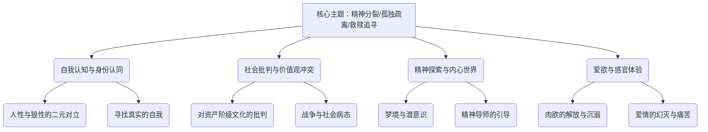
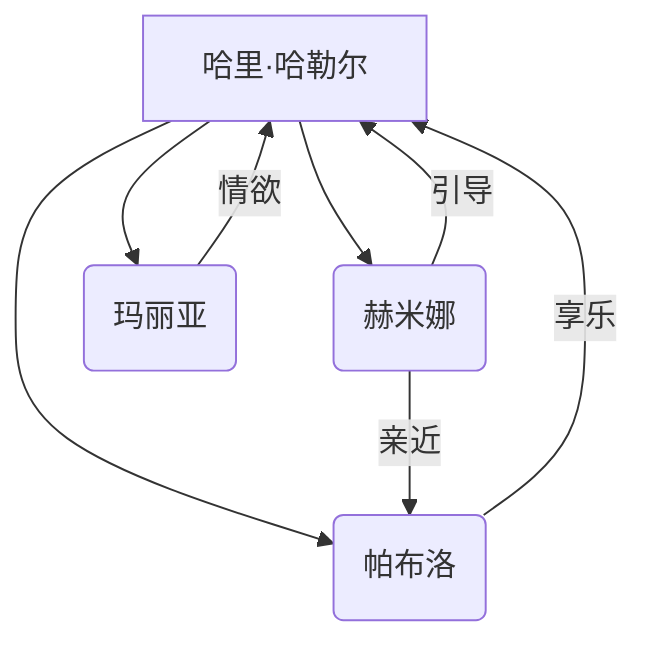

豆瓣链接：https://book.douban.com/subject/4908883/

# 深层解构

# 章节内容
### 情节描述

《荒原狼》的故事围绕着主人公哈里·哈勒尔展开，他是一位年近五十、生活在德国的作家，具有深刻而复杂的精神世界。

哈里长期处于一种孤独且矛盾的精神状态中，内心深处的“人性”与“狼性”不断交织冲突。他一方面有着高尚的精神追求，渴望纯粹的艺术、哲学与人性的美好；另一方面，“狼性”又使他对现代社会的虚伪、平庸和堕落感到极度厌恶，时常陷入愤世嫉俗的情绪中，与周围的世界格格不入。

一天，哈里偶然读到一本名为《评荒原狼》的小册子，书中对“荒原狼”的剖析让他深受触动，仿佛看到了自己的内心写照，从此便以“荒原狼”自比。不久后，他受邀参加一场聚会，在聚会上，他的反战观点和独特思想与周围人格格不入，遭到了众人的嘲笑和排斥，这让他更加深刻地感受到自己与这个社会的隔阂，内心的孤独与痛苦愈发强烈。

离开聚会后，哈里在街头偶遇了酒吧女郎赫米纳，赫米纳的出现犹如一道光照进了他灰暗的世界。她带着哈里走进了一个充满感官刺激和享乐的世界，让他暂时忘却了内心的痛苦与挣扎。在赫米纳的引导下，哈里结识了才华横溢的音乐人帕布洛和热情奔放的姑娘玛丽亚，他们一起沉浸在音乐、舞蹈和欢愉之中，哈里在这个过程中体验到了一种前所未有的放松和愉悦，仿佛找到了逃离内心荒原的出口。

然而，随着时间的推移，哈里对赫米纳的感情逐渐变得复杂而深沉，当他看到赫米纳与帕布洛之间亲密的举动时，内心深处的“狼性”被彻底激发，强烈的嫉妒和占有欲让他失去了理智，最终在冲动之下，他将赫米纳杀害。这一悲剧性的事件成为了哈里人生的转折点，他陷入了深深的自责和痛苦之中，开始对自己的人生、人性以及整个世界进行了更加深刻和全面的反思与探索。

在这段艰难的时期，哈里的内心世界仿佛经历了一场狂风暴雨的洗礼，他不断地在回忆中审视自己过去的生活，思考着自己的每一个选择和行为背后的深层原因。他意识到自己一直以来都在逃避现实世界的种种问题，试图通过沉浸在自己的精神世界和短暂的感官刺激中寻求解脱，但这终究只是一种虚幻的逃避，无法真正解决他内心深处的矛盾和痛苦。

在经历了无数次的自我挣扎和内心的煎熬后，哈里逐渐开始尝试面对自己内心的“荒原”，接受自己人性与狼性的双重本质，并努力在这两者之间寻找一种平衡与和谐。尽管这个过程充满了艰辛和磨难，但哈里始终没有放弃，他在这条充满荆棘的自我救赎之路上不断前行，直至生命的最后一刻。他的故事不仅仅是一个个体的精神旅程，更反映了当时整个社会中人们普遍存在的精神危机和对自我认知、生命意义的深刻探寻。

### 句子摘录
1. “我无权去评判或谴责他人的生活。我只知道一件事：我就是这样的人，我曾这样生活过，我也只能这样生活。我曾试图反抗，也曾试图改变，但最终我还是回到了原点。这就是我的命运，我必须接受它。”
2. “因为我跟你一样。因为我也和你一样孤独，和你一样不能爱生活，不能爱人，不能爱我自己，我不能严肃认真地对待生活，对待别人和自己。世上总有几个这样的人，他们对生活要求很高，对自己的愚蠢和粗野又不甘心。”
3. “我们每个人都是一个独特的个体，有着自己的思想、情感和欲望。我们不能将自己的标准强加于他人，也不能期望他人完全理解我们。我们所能做的，就是尊重彼此的差异，包容彼此的不足，共同创造一个和谐的世界。”
4. “也许有一天，我会找到内心的平静。也许有一天，我会学会接受自己，爱自己，爱这个世界。但在那之前，我只能继续在这片荒原上徘徊，寻找着那一丝希望的曙光。”
5. “生活中充满了矛盾和冲突，我们不能逃避它们，只能勇敢地面对。只有通过不断地挣扎和奋斗，我们才能找到真正的自我，实现自己的价值。”
6. “我们都是孤独的旅行者，在人生的道路上寻找着自己的方向。有时候，我们会迷失方向，有时候，我们会感到疲惫和无助。但只要我们心中有梦想，有希望，我们就一定能够找到属于自己的那片天空。”
7. “真正的智慧不是来自于书本，而是来自于生活。我们必须亲身经历痛苦和磨难，才能真正理解人生的真谛。”
8. “在这个世界上，没有什么是永恒不变的。一切都在变化，一切都在流动。我们所能做的，就是珍惜当下，把握每一个机会，让自己的生命变得更加精彩。”
9. “我们不能改变过去，但我们可以改变未来。我们不能控制别人，但我们可以控制自己。让我们从现在开始，做一个更好的人，创造一个更美好的世界。”
10. “每个人的心中都有一片荒原，那里充满了孤独、恐惧和绝望。但只要我们勇敢地面对自己的内心，寻找那一丝希望的光芒，我们就一定能够走出这片荒原，迎接新的生活。” 

好的，文学家为您解读赫尔曼·黑塞的《荒原狼》。

## 1. 基础信息

*   **作者背景：** 赫尔曼·黑塞（1877-1962）是德国作家，后入瑞士籍。他是德国浪漫主义的最后一位骑士，作品常探讨个体与社会、精神与现实的冲突。1946年获诺贝尔文学奖。代表作还有《悉达多》、《德米安》等。
*   **创作背景：** 《荒原狼》创作于一战后，魏玛共和国时期，社会动荡，价值观混乱。黑塞本人也经历了一系列的个人危机，包括婚姻问题和精神困境。这些经历促使他深入探索人性的复杂性和精神的困境。
*   **版本信息：** 初版于1927年。重要的译本包括英文版、法文版等，中文译本以上海译文出版社的版本较为通行。不同译本在语言风格和文化理解上可能存在差异。

## 2. 主题架构

*   **核心主题：**
    *   **精神分裂：** 主人公哈勒尔的人性与狼性之间的分裂，象征着现代人内心的冲突。
    *   **孤独疏离：** 哈勒尔与社会的格格不入，以及个体在现代社会中的孤独感。
    *   **救赎追寻：** 通过探寻自我、体验生活，哈勒尔试图找到精神的救赎之路。
*   **子主题网络：**

*   **主题呈现方式：**
    *   **象征系统：** “荒原狼”象征着主人公分裂的人格，以及与社会格格不入的边缘人形象。“魔术剧场”象征着人性的多重性和潜意识的探索。
    *   **叙事策略：** 小说采用多层叙事结构，包括“出版者序”、“哈勒尔手稿”和“魔术剧场”等，呈现了主人公不同侧面的形象和精神状态。

## 3. 人物系统

*   **人物关系图谱：**

*   **角色弧光分析：**
    *   **哈里·哈勒尔：** 从最初的自我封闭、精神分裂，到在赫米娜等人的引导下，逐渐体验生活、认识自我，最终在“魔术剧场”中打破了固有的认知。
    *   **赫米娜：** 象征着感性和生命的活力，引导哈勒尔体验世俗的快乐，但最终被哈勒尔杀死，象征着精神与肉体的冲突。
*   **人物象征意义：**
    *   **哈勒尔：** 象征着现代知识分子的精神困境和自我追寻。
    *   **赫米娜：** 象征着感性、肉欲和生命力。
    *   **帕布洛：** 象征着享乐主义和对现实的妥协。
    *   **玛丽亚：** 象征着纯真和对爱情的渴望。

## 4. 叙事结构

*   **时间线分析：** 小说采用非线性叙事，穿插了哈勒尔的日记、回忆和梦境，以及“魔术剧场”的超现实情节。
*   **情节动力学：** 可以视为一种变体的“英雄之旅”模型。哈勒尔经历了“启程”（精神危机）、“考验”（结识赫米娜等人）、“顿悟”（进入魔术剧场）和“回归”（重新面对生活）等阶段。
*   **悬念设置手法：**
    *   **红鲱鱼：** 小说中对哈勒尔自杀倾向的暗示，以及对“荒原狼”身份的强调，都带有一定的迷惑性。
    *   **契诃夫之枪：** 哈勒尔对刀的描写，预示着最终的暴力事件。

## 5. 文学技法

*   **语言风格：** 充满隐喻和象征，具有浓厚的哲学思辨色彩。
*   **意象体系：**
    *   **狼：** 代表着哈勒尔的野性和孤独。
    *   **镜子：** 代表着自我认知和分裂的人格。
    *   **魔术剧场：** 代表着潜意识和人性的多重性。
*   **视角选择：** 采用多视角叙事，包括“出版者”的客观视角、哈勒尔的主观视角，以及“魔术剧场”的超现实视角。

## 6. 思想深度

*   **哲学命题探讨：**
    *   **存在主义：** 小说探讨了人生的意义、自由的选择和存在的荒诞性。哈勒尔的孤独感和对社会的反抗，都体现了存在主义的哲学思想。
    *   **尼采哲学：** 黑塞深受尼采哲学的影响，小说中对“超人”的追求和对传统道德的批判，都体现了尼采的思想。
*   **社会批判维度：**
    *   **阶级：** 小说批判了资产阶级的虚伪和空虚的精神生活。
    *   **战争：** 黑塞通过哈勒尔的反战言论，表达了对战争的厌恶和对和平的渴望。
*   **人性洞察层面：**
    *   **善恶二元：** 小说展现了人性的复杂性，既有高尚的追求，也有阴暗的欲望。
    *   **异化主题：** 哈勒尔与社会的格格不入，以及精神的分裂，都体现了现代社会中人的异化。

## 7. 文学史坐标

*   **所属文学运动：** 现代主义文学。
*   **对后世影响：** 《荒原狼》对后世的文学创作产生了深远的影响，影响了存在主义文学、心理小说等。
*   **与同期作品比较：**
    *   **《尤利西斯》（詹姆斯·乔伊斯）：** 两部小说都采用了意识流的写作手法，探索了现代人的精神困境。托马斯·曼称《荒原狼》为“德国的尤利西斯”。
    *   **《变形记》（弗兰茨·卡夫卡）：** 两部小说都表现了人与社会的疏离感和存在的荒诞性。
    *   **《追忆似水年华》（马塞尔·普鲁斯特）：** 两部小说都通过对内心世界的探索，追寻逝去的时光和存在的意义。

## 8. 读者互动

*   **读者对结局的解读：** 读者对《荒原狼》的结局有不同的解读。有人认为哈勒尔最终找到了内心的平静，有人认为他仍然迷失在精神的困境中。
*   **争议性观点梳理：** 学界对《荒原狼》的评价也存在争议。有人认为它是黑塞的代表作，深刻地揭示了现代人的精神危机；也有人认为它过于晦涩难懂，带有自我沉溺的倾向。
*   **跨媒介改编分析：** 《荒原狼》被改编成电影、戏剧等多种形式。不同版本的改编在情节、人物和主题的呈现上存在差异。

## 开放式结局/隐喻的解读方向：

*   **魔术剧场：** “魔术剧场”是小说中最具象征意义的部分，代表着人性的多重性和潜意识的无限可能。它既可以被视为哈勒尔精神分裂的体现，也可以被视为他自我救赎的途径。
*   **哈勒尔的命运：** 小说的结局并没有明确交代哈勒尔的命运，而是留下了开放式的解读空间。他是否真正摆脱了精神的困境，找到了内心的平静，仍然是一个未知数。

Citations:
[1] https://book.douban.com/subject/4908883/

---
来自 Perplexity 的回答: pplx.ai/share