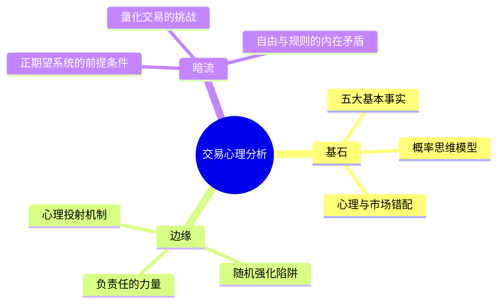

# 深层解构

## 一、基石：核心论点与底层逻辑

**一句话定义**：交易盈利的核心不是预测市场方向，而是在完全接受不确定性的前提下，像赌场庄家一样通过概率思维和有纪律的执行长期获利。

### 核心冲突与痛点

- **大众认知误区**：为了赚钱，我必须知道市场下一步怎么走；亏损是因为我懂的还不够多、技术还不够精。
- **作者颠覆性认知**：**你根本不需要知道下一步会发生什么就能赚钱。** 95%的交易错误起源于态度——对亏损、犯错、错过机会和赚不到钱的态度。交易员用适应"社会生活"的思维（追求确定性、分对错）去应对"市场环境"（完全的概率、无对错），这才是痛苦和失败的根源。

### 底层逻辑（第一性原理）

本书的基石建立在认知心理学与概率论的结合之上：

**一、心理投射**：市场本身是中性的，行情图表没有威胁。恐惧是你内心的投射。当你看到价格下跌感到恐惧，是因为你把"亏钱"定义为一种痛苦或失败，而不是单纯的"商业成本"。市场只是一面镜子，照出你信念系统中的冲突。

**二、大数定律**：单次交易的结果是随机的，但一系列交易的结果是确定的。交易员必须放弃对"这一笔"结果的执着，转而关注"这一组"结果的期望值。**稳定盈利 = 概率思维 + 信念重塑 + 无情绪执行。**

**三、信念过滤机制**：我们只能看到我们已经知道的东西。如果你的信念是"我不能犯错"，你的大脑会自动屏蔽与你持仓方向相反的信息。你看到的不是市场，而是你信念的投射。

## 二、边缘：被轻描淡写的洞见

### 洞见一：心理投射才是亏损的根源，而非技术缺陷

道格拉斯指出，行情的每一次跳动本身没有意义——意义是你赋予它的。当你看到一根大阳线时兴奋，看到一根大阴线时恐惧，这并非市场的本质属性，而是你内心预期与现实的冲突。**市场不针对你，你的痛苦来自预期与现实的差距。** 绝大多数交易书籍都在教你分析市场，但这本书告诉你：分析的对象应该是你自己。这个逆转极为深刻。

### 洞见二：随机强化——交易中最隐蔽的成瘾机制

道格拉斯揭示了为什么坏习惯如此难以改变：**随机强化。** 在现实生活中，正确行为通常带来正面结果，错误行为带来惩罚。但在交易中，你胡乱操作也可能赚钱，严格遵守规则也可能亏损。这种随机的奖惩让大脑无法建立稳定的因果联系，从而陷入"对随机回报上瘾"的状态。这就是为何90%的交易者不断重复错误——因为错误偶尔被奖励过。

### 洞见三：承担责任不是自责，而是夺回控制权

传统观念将"负责"等同于"都是我的错"，带有强烈的自责色彩。但道格拉斯对"负责"的定义完全不同：**承担责任意味着确信所有结果都是自己造成的，因此所有结果都在你的改变能力范围内。** 当你把亏损归咎于市场、消息、庄家时，你也同时放弃了改变的能力。只有完全承担责任，你才能完全控制自己的交易行为。这是一种心理赋能，而非心理负担。

### 洞见四：一致性是心理状态，不是技术指标

很多人以为只要找到一个好策略就能稳定盈利。但道格拉斯指出：**一致性本身就是一种心态。** 宁可平庸规则一致执行，也不要完美计划频繁违背。交易者训练的终极目标不是找到圣杯，而是让你的心理结构能够支撑你一致地执行任何正期望的系统。正如他所说："赢家有一种思想——独特的态度——让他们保持有纪律、专注，以及在不利状态下的自信。"

## 三、暗流：未被审视的认知前提

### 隐含假设一：你必须先有正期望系统

道格拉斯的理论有一个沉默的前提——**读者已经拥有一个具备正期望值的交易系统。** 如果你的技术分析本身就是负期望，那么心态再好也只是"稳定地、愉快地破产"。这本书不讲任何技术，它解决的是"懂技术但赚不到钱"的问题。对于纯新手，需要先补上技术分析的基础课。

### 隐含假设二：心理修炼可以替代系统决策

道格拉斯强调"心流"（The Zone）和直觉执行，但对机械化、程序化交易的讨论不足。现代量化交易的实践表明：对于绝大多数人而言，用代码替代心理博弈更为可靠。将策略写成程序，让机器在最差情绪下也能完美执行，这可能比花费数年修炼心性更有效率。道格拉斯对"直觉交易"的推崇，可能是他自身作为场内交易员的职业惯性。

### 隐含假设三：所有交易者面临相同的心理挑战

道格拉斯将交易心理当作通用问题来讨论，但实际上不同交易风格（日内/波段/长线）、不同市场（股票/期货/外汇）的心理挑战差异巨大。日内交易者面临的是过度交易的冲动，长线投资者面临的是持仓信心的考验，套利交易者面对的是模型风险的焦虑。一本书难以覆盖全部场景。

### 补充视角

- **行为金融学**：丹尼尔·卡尼曼的前景理论从实验角度证实了道格拉斯的观察——人对亏损的敏感度是盈利的约2.5倍，这解释了为什么止损如此困难。
- **神经科学**：杏仁核在亏损时被激活的程度远超盈利，说明恐惧反应是生理性的，仅靠理性说教不足以克服。需要系统性的暴露疗法（如模拟盘训练）来重塑神经回路。

---

# 章节内容

## 第1章：成功之道——基本分析、技术分析或者心理分析

道格拉斯以自身经历开篇，揭示了交易者学习路径中的三次转折。他从基本分析入手，试图通过研究经济数据、公司财报来找到市场"应该"怎么走的答案。但他很快发现，基本分析从来不把其他交易者当作变量——是大众通过推动价格来表达信念和期望，而非模型推动价格。接着他转向技术分析，发现即使拥有最好的分析系统，心理因素仍然导致执行失败。最终他认识到：**交易中最大的变量不是市场，而是交易者自己。** 成功的关键不在于找到更好的分析方法，而在于培养正确的交易心理：接受风险、保持一致性、控制情绪。

## 第2章：交易的诱惑与风险

交易的低门槛、高自由度、潜在高回报使其极具诱惑力。但统计表明，95%的期货交易者会在第一年内亏损殆尽。道格拉斯剖析了四个核心问题：**（1）不愿意制定规则**——没有规则就没有约束，容易被情绪主导；**（2）不能负责**——亏损时责怪市场、消息、庄家，唯独不责怪自己；**（3）沉迷于随机报酬**——偶尔的随机获利强化了错误的行为模式；**（4）外在控制与内在控制**——试图控制市场结果，而不是控制自己的行为。他指出，交易之所以危险，恰恰是因为它太自由了——这种自由让没有内在纪律的人暴露在最危险的境地中。

## 第3章：负责

这是全书最具颠覆性的章节之一。道格拉斯重新定义了"负责"：**承担责任意味着接受所有交易结果都是自己的决策和执行导致的，亏损不怪市场，盈利也不感谢市场。** 当你把亏损归咎于外部因素时，你同时放弃了改变的能力。真正的区别在于是否对自己的结果100%负责。赢家关注长期一致性，输家关注单笔交易的对错；旺家靠运气短期获利但最终归还市场，衰家既没技术也没心态持续亏损。道格拉斯给出了一个尖锐的论断：**为什么我们容易受没有结构、随机的交易影响？因为我们不想负责任。**

## 第4章：持续一贯是一种心态

稳定盈利不是靠精准预测，而是靠长期一致地按优势与规则交易。道格拉斯在这一章展开了"一致性"的深层内涵：一致性本身是一种心理状态，不是技术指标的附属品。真正接受风险意味着——在进场前就定义好最大损失，并完全接受这个损失发生的可能性。最优秀的交易者不但接受风险，还学习承受和拥抱风险。他们交易时没有一丝一毫的犹豫或冲突，即使有亏损，在退出交易时也不会有一点点不舒服。如果你不能做到不带情绪地交易，你就没有学会接受交易天生的风险。

## 第5章：认知的动力

道格拉斯将交易心理问题提升到认知哲学的高度。我们的心智会过滤、扭曲、选择性接收信息——只看符合预期的，忽略风险。你看到的不是市场，而是你信念的投射。真正的学习需要开放心态：承认自己不知道，才能真正看到市场在告诉你什么。痛苦和亏损往往是心智抗拒改变的信号。此外，大脑会自动建立联想——某次亏损后看到某个指标就害怕，某次盈利后看到某种形态就兴奋。这些联想往往是非理性的，会干扰客观判断。**觉察并打破这些错误联想，是走向客观交易的必经之路。**

## 第6章：市场观点

这一章奠定了全书的核心世界观。道格拉斯提出了**不确定原则**：接受市场的不确定性是交易的前提，任何事情都可能在任何时刻发生。试图"确定"市场下一步会怎样是徒劳的，只会导致痛苦和失望。市场的最基本特性是：**表现方式几乎毫无限制**——价格可以用任何组合方式来表达自己。没有"应该"，没有"合理"，只有"实际发生了什么"。市场中性，无善恶、无意图；永远在概率下运行，不欠任何人利润。市场总是对的，个人观点往往毫无意义。把市场当概率游戏，不把它当朋友或敌人。

## 第7章：交易者的优势——从概率角度思考

全书最核心的方法论章节。道格拉斯将交易比作赌场经营：赌场老板不关心单笔输赢，他们只关心有足够多的次数让概率发挥作用。单笔交易结果是随机的，但在大数定律下，具有正期望的系统会产生稳定收益。**优势只不过是显示一件事情发生的概率高于另一件事情**——哪怕只是51%对49%。交易者要做的，就是像赌场一样，专注于执行有正期望值的系统，而不是执着于单次结果。市场中的每一刻都具有独一无二的性质，过去的经验不能完全套用现在。当你完全接受风险并定义了止损，情感上的风险就消失了——你知道最坏的情况是什么，而且你能承受。

## 第8章：发挥信念的优势

道格拉斯在此定义了赢家的五项核心信念：**（1）目标**不是赚钱，而是持续一致地执行系统；**（2）执行技巧**与市场分析能力同等重要；**（3）开放的心态**——市场告诉什么就接受什么，不抗拒、不辩解；**（4）客观性**——看到是什么，而不是你想看到什么；**（5）"当下"的意义**——每笔交易都是独立的，不带上次的情绪。当你完全内化这些信念，交易就会变得自然流畅——**纪律不再需要意志力来维持，它已经成为你的一部分。** 这就是交易者追求的"顺境"或"心流状态"。

## 第9章：信念的本质

道格拉斯深入剖析信念的来源与运作机制。信念来自成长环境、教育和个人经历。在生活中有用的信念（如"不要犯错"、"努力就有回报"）在交易中往往是限制性信念。**信念是心智地图，决定感知、决策和行动。你赚不到你信念之外的钱。** 如果你的信念说"赚钱很难"，那么即使有机会你也会错过——你的系统会自我实现这个预言。常见的负面信念包括：怕错、怕亏、怕错过、怕利润回吐——这些导致过早止盈、不止损、重仓、追涨杀跌。信念不等于事实，但信念会主动过滤事实。

## 第10章：信念对交易的影响

这一章从理论落地到实践。信念一旦形成就很难改变，但可以被新的信念覆盖。情绪是信念的外在反应——当你感到恐惧或贪婪时，问问自己："是什么信念导致了这种情绪？" 道格拉斯特别指出：**自我价值感深刻影响交易结果。** 潜意识中的不配得感、完美主义会让你主动破坏盈利——赚钱了就想快点落袋为安，或者突然违反规则。最可怕的敌人不是市场，而是你自己。他建议交易者列出3条限制盈利的信念，逐条用新的、更具建设性的信念来替代。

## 第11章：像交易者一样思考

全书收官之作。道格拉斯总结了赢家思维的**五大核心事实**（建议每天开盘前默读）：（1）任何事都可能发生；（2）不必知道下一步也能赚钱；（3）优势盈亏随机分布；（4）优势是概率差；（5）每一刻独一无二。他将交易成长分为三阶段：**机械阶段**——严格执行，不思考，建立纪律基础；**一致阶段**——稳定执行，形成习惯，不再需要意志力强迫自己；**直觉阶段**——规则内化，行云流水，成为真正的交易艺术家。最终，自律本身就是一种可以训练的技术，创造长期获利的信念不是一蹴而就的，而是通过一次次正确的行动逐步建立的。

---

# 金句与精华语录

1. **"你不需要知道下一刻会发生什么就能赚钱。"**
   （You don't need to know what is going to happen next in order to make money.）
   ——这是全书的灵魂。它打破了"分析=盈利"的因果链，把交易员从预测未来的沉重负担中解放出来。交易不是关于准确率，而是关于赔率和执行力。

2. **"优势仅仅意味着一种结果发生的概率略高于另一种结果。"**
   （An edge is nothing more than an indication of a higher probability of one thing happening over another.）
   ——这句话给"圣杯"祛魅。最好的系统也只是"略高"一点。接受这个"略高"，你才能平静地接受失败。

3. **"如果你能学会建立一种不受市场行为影响的心智状态，内心的挣扎就会停止。"**
   （If you can learn to create a state of mind that is not affected by the market's behavior, the struggle will cease.）
   ——痛苦的来源不是亏损，而是你抗拒亏损。当你不抗拒市场给出的任何结果，交易就变成了一件轻松的事情。

4. **"区别持续一致赢家和输家的关键特征在于：赢家有一种独特的态度，让他们保持有纪律、专注，以及在不利状态下的自信。"**
   ——技术可以复制，但态度需要修炼。正是这种看不见的态度差异，决定了看得见的盈亏差异。

5. **"最优秀的交易者不但接受风险，他们还学习承受和拥抱风险。"**
   ——接受风险不是嘴上说说，而是当止损被触发时内心毫无波澜。当你真正把亏损看作做生意的成本，恐惧就消失了。

---

# 实操指南与行动清单

## 20笔交易训练法（道格拉斯核心训练方案）

1. **选定一个系统**：定义一个极其明确、不需要主观判断的进场信号（如均线突破、MACD金叉）。关键是明确到没有模糊空间。
2. **定义风险**：进场前必须明确每笔交易的止损位置。把止损写下来，设为自动止损单。
3. **资金管理**：算出自己愿意为这20笔交易付出的总"学费"。比如愿意亏1000元，每笔风险就是50元。**确保金额小到你完全不心疼。**
4. **承诺执行**：告诉自己——"这20笔交易，我的目的不是为了赚钱，而是为了完美执行规则。"
5. **机械操作**：信号出现→立即交易。禁止犹豫、加仓、提前平仓、移动止损。接受每一个结果，记录，然后等下一个信号。
6. **事后复盘**：做完20笔才能评价系统。做之前和做之中禁止评判。

## What-If 应对方案

- **看到信号不敢下单**：问自己——"我现在是在思考概率，还是在试图预测这笔交易的死活？" 记住，这只是20个样本之一。
- **赚了点就想跑**：提醒自己——"我在玩大数定律的游戏。" 提前离场破坏了数学期望，这比亏损更可怕。
- **连续亏损后想报复**：暂停交易。连续亏损后的"翻本心态"是职业交易者最大的敌人。

---

# 避坑指南

1. **绝对不要试图报复市场**：这一笔亏了，下一笔加倍下注想赚回来。这是赌徒行为，不是赌场老板思维。长期来看，情绪化报复交易是账户毁灭的最快路径。

2. **绝对不要根据上一笔结果决定这一笔操作**：上一笔亏了就少买，上一笔赚了就多买——这是打破概率分布的自杀式操作。每一笔交易都是独立的，仓位决策只取决于系统规则和当前机会，与历史盈亏无关。

3. **绝对不要挪动止损**：止损是保险费，是做生意的成本。挪动止损等于在已经亏损的生意上追加投资，且放弃了最初的风险管理框架。一旦进场，止损就是不可触碰的底线。

4. **切忌完美主义**道格拉斯特别强调：交易者不需要永不犯错，需要的是错误发生时快速承认并止损的能力。追求每笔都赚钱是天方夜谭，追求每笔都执行规则才是可行的目标。

5. **小心盈利后的过度自信**：一连串盈利带来的兴奋和过度自信，其危险程度不亚于亏损带来的恐惧。盈利会让人误以为"自己变厉害了"，从而放松纪律，最终导致更大的回撤。

---

**全书总结**：《交易心理分析》改变的不仅是你对交易的认识，更是你对不确定性的态度。它不教你怎么分析市场，它教你如何让你的内心与市场的本质（概率性、不确定性、独立性）达成和解。当你的内心不再与市场对抗，盈利就变成了一件"自然而然"的事——正如台湾繁体版的译名所示：**《賺錢，再自然不過》**。
