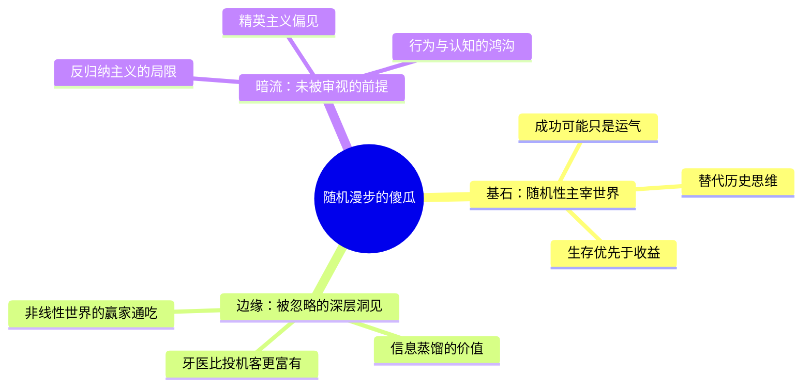

---
tags:
  - 随机性
  - 黑天鹅事件
  - 幸存者偏差
  - 概率思维
  - 风险管理
douban_link: https://book.douban.com/subject/10773362/
score: 4
cover: https://piccdn3.umiwi.com/img/201607/21/201607211219570439016451.jpg
create_time: 2026-06-20
---

你好。我是你的财经图书拆解专家。今天我们要拆解的这本书，是纳西姆·塔勒布"不确定性"系列的开山之作——**《随机漫步的傻瓜》（Fooled by Randomness）**。这是理解《黑天鹅》《反脆弱》《非对称风险》三部曲的思想地基。

这**不是**一本教你"怎么赚钱"的书。这是一本**教你认出自己有多蠢，从而避免被随机性消灭**的生存手册。塔勒布自己就是衍生品交易员出身，这本书是他用真金白银烧出来的认知框架。

下面，我们将从底层逻辑到章节脉络，进行颗粒度极细的拆解。

---

# 深层解构

## 一、基石：核心论点与底层逻辑

### 一句话定义
**世界由随机性主宰，我们严重高估能力、低估运气——那些被媒体追捧的"成功者"，很可能只是概率游戏的幸运幸存者，而真正的智慧在于区分运气与实力，并在黑天鹅来临前确保自己还活着。**

### 核心冲突与痛点

| 大众认知误区 | 塔勒布的颠覆性认知 |
|---|---|
| 成功=能力+努力 | 极端成功=运气×杠杆，温和成功才可由技能解释 |
| 历史是必然的因果链条 | 历史是"众多可能替代历史中恰好发生的那一个" |
| 概率高的事就该做 | 如果失败的代价是毁灭性的，成功概率多高都不重要 |
| 媒体和专家能帮我们理解世界 | 新闻是"未蒸馏信息"，越关注越容易被噪声误导 |

### 底层逻辑（第一性原理）

本书的思想地基由三个互相咬合的概念构成：

**1. 替代历史（Alternative Histories）**

塔勒布的核心思维工具。评价一个决策的好坏，不能只看"已发生的结果"，必须考虑所有**可能发生但恰好没发生**的路径。一个交易员连赚十年，看似天才——但如果你把他的人生重演一千遍，可能九百九十九次他都爆仓了，只有一次成了亿万富翁。**你看到的那个"成功版本"，只是千万种可能中最幸运的那一个。**

**2. 幸存者偏差（Survivorship Bias）**

我们只能看见赢家，看不见那些被概率消灭在海面之下的失败者——他们永远沉默了。基金经理排行榜只显示活着的基金，那些亏光解散的基金已经从榜单上消失。**任何基于"可见成功者"归纳出来的成功法则，都带有系统性扭曲。**

**3. 偏态与非对称（Skewness & Asymmetry）**

赚钱的频率不重要，**单次获利的大小**才重要。正确99次、每次赚1块钱，错1次亏100块——你依然是输家。塔勒布的策略恰恰是：**容忍高频小亏，换取低频暴利**。这就是"欹斜下注"——在稀有事件上押注，因为稀有事件的定价最不合理、最被低估。

---

## 二、边缘：被轻描淡写的洞见

### 洞见一：牙医为什么比投机客更富有？

书中反复出现的一个"反直觉"对比：**开劳斯莱斯的摇滚明星、坐私人飞机的企业家、管理数十亿的对冲基金经理——他们的"财富"可能还不如一个社区牙医。**

这不是说牙医赚得多。而是说：如果你把每个人的人生重演一千遍，牙医在**所有**版本中都过得不错（低方差，高鲁棒性）；而投机客在一千个版本中，九百九十九个都破产了，只有一个成了亿万富翁。塔勒布的结论是：**真正的富有不是账户数字的大小，而是"不会跌回去"的确定性。**

这背后是一个深刻的人生策略：选择低方差、高下限的职业和生活方式，比追逐"可能暴富但更可能毁灭"的路径，长期来看更富有。**这不仅是投资哲学，更是人生哲学。**

### 洞见二：信息蒸馏——为什么看新闻让你更蠢？

塔勒布区分了两种信息：

- **未蒸馏信息**：新闻、实时报价、分析师研报、最新论文——从未经过时间检验，噪声占比极高。
- **已蒸馏信息**：流传千年的哲学、经过多轮学术批判的理论、被反复验证的经典——经过时间筛选留存。

记者和评论员的职业本质是**娱乐提供者**，不是真理探索者。他们的成功取决于"说得好看"而非"说得对"。一个电视股评家的薪酬，和他预测准确的次数没有任何统计学关联——他拿的是收视率，不是准确率。

塔勒布的建议极为激进：**关闭新闻，只读经典。** 越频繁查看投资组合，回报越低——不是因为市场变了，而是因为你的情绪被短期波动牵着走，做出愚蠢决策。牙医每月看一次账户，比日内交易员每年多看三百次，最终收益反而更高。

### 洞见三：进化论在金融市场中的误用

"适者生存"在金融市场中经常被颠倒为"**最不适者可能生存**"。原因在于：在一个充满随机性的环境中，**高风险策略的短期表现往往最好**——赌徒在牛市中看起来像天才，保守者在牛市中看起来像傻瓜。

于是出现了残酷的反转：**那些承担了最大隐性风险的交易员，短期内获得了最高收益、吸引了最多资金、被市场奉为神明——直到黑天鹅来临。** 而真正稳健的人，在泡沫期被嘲笑，在崩盘期幸存。塔勒布警告：**不能只看谁活得好，要看在一切可能的替代历史中，谁能活得久。**

---

## 三、暗流：未被审视的认知前提

### 批判一：反归纳主义的激进立场是否自洽？

塔勒布的核心哲学武器来自卡尔·波普尔的"证伪主义"——你永远无法证实一个理论，只能证明它尚未被证伪。他将此推向极端，几乎否定一切从历史数据中归纳结论的努力。

**问题在于**：如果所有基于历史数据的归纳都不可靠，那么塔勒布本人从历史中总结出的"黑天鹅法则"本身也是归纳——他用归纳法攻击归纳法，形成了一种哲学上的自指悖论。波普尔的证伪主义更多是科学哲学的规范标准，而非对日常生活决策的可操作指南。**完全的怀疑论在逻辑上无懈可击，但在实践中寸步难行。**

### 批判二：塔勒布的精英主义盲区

书中隐含了一个假设：**大多数人都是"概率盲"，只有少数像塔勒布这样受过哲学训练的精英能看穿随机性。** 但他自己也承认（在《反脆弱》中更加明显）——即使你知道所有认知偏差，你依然会被它们愚弄。他给出的解决方案（如"不看新闻"、"不做频繁决策"）更接近一种**斯多葛式的自我修行**，而非可推广的社会方案。

这意味着：**塔勒布的智慧对于普通人来说，更多是一种"知道但做不到"的知识。** 他的书提供的是世界观的重塑，而非操作手册。

### 批判三：好运的幸存者——塔勒布自己是否也在其中？

塔勒布因1987年股灾和2008年金融危机中的巨额做空收益而闻名。他的策略（买入极虚值期权，赌稀有事件）本质上是**长期持续小亏、偶尔一次暴赚**。但问题在于：如果在黑天鹅来临之前，他的资金就因持续亏损而耗尽了呢？

他自己在书中承认："我尽量不经常赚钱，越不经常越好。"这意味着**他的成功本身也需要运气的配合——黑天鹅必须在他还有子弹的时候到来。** 1987年和2008年他等到了。但如果下一个黑天鹅在他退休后才来呢？他的策略依赖"在有限时间内稀有事件恰好发生"——这本身就是一个随机性的赌博。

---

## 四、金句与精华语录

| 原文 | 深度解读 |
|---|---|
| **"如果失败的代价过于沉重、难以承受，那么这件事成功的概率有多高根本无关紧要。"** | 这是全书最核心的生存法则。俄罗斯轮盘赌——六分之五的概率赢100万，六分之一的概率死亡——正期望值再高也不该玩，因为你只有一条命。投资、创业、人生决策，**先算下行风险，再考虑上行空间。** |
| **"拥有一身好本事却穷困潦倒的人，最后一定会爬上来。幸运的傻瓜短期可能得助于好运气，但长期而言，他的处境会慢慢趋近于运气没那么好的傻瓜。"** | 塔勒布在这里偷换了一个概念：他暗示存在一个"长期均值回归"，但这本身需要无限长的时间。**"长期"有多长？如果你在回归之前就破产了，"长期"对你就毫无意义。** 但这句话的洞察力在于：时间是最好的去随机化工具。能力在足够长的时间尺度上确实会浮现——前提是你还活着。 |
| **"历史从不爬行，只会跳跃。"** | 世界不是线性演进的。文明的进程、市场的走势、个人的命运——都是由少数极端事件定义的，而非日常的渐进积累。**你的生命中真正改变一切的决定或事件，可能不超过五个。** 这句话的隐含推论是：把精力花在"预测日常小事"上是浪费，应该聚焦在"为跳跃做好准备"。 |
| **"命运女神唯一不能控制的东西，是你的行为。"** | 这是全书最接近斯多葛哲学的一句。随机性无法消除，但你的**反应方式**完全在你掌控之中。塔勒布的核心主张不是"战胜随机性"，而是"在随机性面前保持优雅"。你无法决定市场崩不崩盘，但你可以决定崩盘时自己是否还有现金。 |
| **"我们经历的现实只是所有可能出现的随机历史中的一个，却误将它当作最具代表性的。"** | 这句话拆解了人类最顽固的认知幻觉——事后合理化。每一个成功故事的背后，都有成千上万个做了同样事情但失败了的隐形人。**当你听到"他是怎么成功的"，你应该追问："那些用了同样方法但失败了的人，他们怎么了？"** |

---

# 章节内容

## 自序：任何人都会买卖

塔勒布开篇自述写作动机：他是交易员出身，却"运气好到"不必假装自己能预测市场。他区分了两类人——**知道自己不懂随机性的人，和不知道自己不懂的人**。后者包括了大多数基金经理、财经评论员、企业CEO。自序奠定了全书基调：这不是一本概率学教材，而是一本**认知自卫手册**。

## 前言：幸运的交易员

以两位交易员的对比开篇：**塔利波**（作者的镜像）——多疑、保守、交易公债、追求低破产概率、拥有大量私人时间；**约翰**——高调、激进、赚取天量佣金、被视为"交易天才"。约翰的财富远高于塔利波，但塔勒布认为：**约翰只是在玩高赔率的俄罗斯轮盘赌，只是枪恰好还没响。** 这个对比贯穿全书，成为"运气vs能力"的叙事锚点。

## 第一篇：黑天鹅事件

### 第一章 赚钱的随机性

核心论证：**短期观察到的是波动率（易变性），不是回报率。** 塔勒布用牙医的案例说明——同样是高收入者，牙医的收入来自低方差的可复制技能，而交易员的收入来自高方差的随机事件。他提出了"替代历史"思维：如果让一个牙医和一个交易员各活一千遍，牙医每一遍都过得不错，交易员只有一遍成了富豪，其余都破产了。**但我们只看到那一遍。**

### 第二章 奇特的结算方法

用"俄罗斯轮盘赌"隐喻阐释核心风险观：一个赢了100万美元的俄罗斯轮盘赌玩家，和一个月薪1万的牙医——谁的"真实财富"更高？塔勒布的答案是牙医。因为**俄罗斯轮盘赌玩家在更广阔的替代历史集合中，已经死亡了无数次。** 本章提出了关键的操作原则：不要用"结果"评判决策质量，要用"在所有可能世界中的表现分布"来评判。

### 第三章 从数学的角度思考历史

提出"蒙特卡罗方法"的哲学含义：通过模拟大量随机路径来理解现实。历史只是随机过程中的**一条已实现路径**，不能据此推断过程的本质特征。塔勒布批判了那些从单一历史叙事中总结规律的人——**他们是在用"后视镜"开车。** 本章也引入了"噪声与信号"的区分：绝大部分我们日常接收到的信息，都是随机噪声。

### 第四章 随机性和科学知识分子

塔勒布对比了**科学思维**（可证伪、可重复）与**文学思维**（叙事驱动、不可证伪）。他批评了"科学知识分子"——那些用科学术语包装自己观点、但实际上从不接受统计检验的人。财经评论员是典型代表：他们的话听起来有道理，但你无法验证。**科学的核心不是"看起来聪明"，而是"能被证明是错的"。**

### 第五章 最不适者可能生存吗？

书中最具挑衅性的一章。塔勒布提出：在随机性主导的环境中，**"适者生存"可能被颠倒为"最不适者生存"。** 因为高风险策略在短期牛市中表现最好，会产生"不适者"看起来最成功的假象。他以新兴市场交易员卡洛斯为例——连续数年碾压市场，靠的是不断"摊平"亏损头寸。在趋势反转前，这种策略看起来是天才，反转后就是灾难。**进化论在金融市场中需要一个关键修正：短期成功不等于长期适应。**

### 第六章 偏态与不对称

本章是全书的技术核心。塔勒布引入了**偏态（Skewness）**概念：收益分布的不对称性。在投资中，**正确率不重要，期望值才重要。** 如果你的策略是"99次赚1块，1次亏100块"，高胜率反而是灾难。反之，"99次亏1块，1次赚1000块"——这才是好策略，尽管你大部分时间都在亏损。

他还讨论了"比索问题"（Peso Problem）：市场会对从未发生但可能发生的极端事件进行定价。即使某一事件历史上从未出现过，理性的交易者也应该为其分配概率——因为**"从未发生"不等于"不会发生"。**

### 第七章 归纳法的问题

塔勒布搬出了大卫·休谟和卡尔·波普尔：**归纳法在逻辑上永远无法被证明有效。** "太阳明天会升起"这个信念，不是被逻辑证明的，而是被我们无数次观察后形成的心理习惯。在金融市场上，归纳法的失败尤其惨烈——每次泡沫中，人们都用"过去N年都在涨"来论证"未来还会涨"，直到崩盘。

本章介绍了两类交易员的对比：**尼德霍夫**（归纳法的信徒，用历史数据预测市场，最终爆仓）和**索罗斯**（波普尔信徒，不断寻找自己的错误并快速修正）。塔勒布的立场是：**与其预测黑天鹅何时来，不如假设它随时会来。**

## 第二篇：打字机前的猴子

### 第八章 太多"下一个富翁"

正式引入**幸存者偏差**的核心隐喻：一万只猴子在打字机前乱敲，总有一只恰巧敲出了《伊利亚特》。这只猴子会认为自己是"文学天才"，旁观的记者会写文章分析它的"创作方法论"——**而真相只是概率的必然。** 塔勒布攻击了《邻家的百万富翁》这类成功学：它们只研究了"活下来的富翁"，完全忽略了那些采用了同样策略但破产的亿万失败者。**从幸存者身上总结的成功法则，是统计学上的致命错误。**

### 第九章 买卖证券比煎蛋容易

讨论数据的欺骗性。塔勒布用了**生日悖论**说明：即使在一个完全随机的过程中，"巧合"也比你直觉认为的常见得多。在一个23人的房间里，两人生日相同的概率超过50%——这违背直觉，但数学正确。由此推及投资：**任何一个基金经理连赢三五年的表现，在纯随机的零假设下，概率其实远高于你的直觉。** 你看到的是"天赋异禀"，实际上只是大数定律的自然结果。

### 第十章 生活中的非线性现象

将讨论从金融市场扩展到生活。塔勒布指出：**世界是非线性的，但人类大脑是线性思维机器。** 你多工作一小时，不会多产出一小时的成果；你每年读100本书，收获不是读50本书的两倍。在复杂系统中，微小的输入可能产生巨大的输出（蝴蝶效应），反之亦然。

本章还讨论了**赢家通吃效应**——在知识经济和金融市场中，微小的优势会被非线性放大为垄断性优势。最好的交易员拿走全部利润，第二好的可能一无所获。**这种极端不平等不是"不公平"，而是非线性系统的自然属性。**

### 第十一章 我们是概率盲

塔勒布认为这是全书最受欢迎的章节（他本人在采访中说过）。他系统梳理了人类在概率判断上的系统性错误：

- **框架效应**：同样一种手术，"存活率72%"听起来比"死亡率28%"好得多——尽管逻辑等价。
- **显著性偏差**：人们高估"容易想象"的风险（恐怖袭击），低估"抽象"的风险（糖尿病）。
- **事后归因**：结果好就认为决策好，结果差就认为决策差——完全忽略运气。

他特别批判了财经新闻媒体的角色：**记者的职责是"讲一个连贯的故事"，不是"揭示随机性的真相"。** 一个好的故事必须逻辑清晰、因果分明——而这恰恰是对随机世界最具误导性的呈现方式。

## 第三篇：活在随机世界中

### 第十二章 赌徒的迷信和笼中的鸽子

借用斯金纳的鸽子实验：当食物被随机投放时，鸽子会发展出各种迷信行为——转圈、点头、单脚站立——因为它们把"随机事件"与"自己刚好在做的动作"错误地关联了起来。**人类交易员和赌徒的行为完全一样：穿着幸运衬衫、坚持某种"盘感"、在特定时间交易——全都是对随机性的仪式性抵抗。**

塔勒布的洞见是：**懂得这种迷信机制的人，并不会因此就摆脱它。** 他自己也承认会在交易中感到"运气的好坏"，只是他能意识到这是情绪而非事实。

### 第十三章 概率与怀疑论

本章将前面的所有讨论升华为一种**认知态度**：概率思维不是一种计算工具，而是一种**看待世界的方式**。核心要义有三：

1. **路径依赖是思维的敌人**：一旦你形成了一个观点，就会不自觉地寻找支持证据、忽视反面证据。塔勒布建议：**随时准备推翻自己昨天的判断。**
2. **不要只计算，要思考**：数学模型是工具，不是答案。在金融市场上，用错误模型计算的精确数字，比没有模型更危险。
3. **怀疑论的边界**：完全的怀疑会导致无法行动。塔勒布的解决方案是——**在日常生活中保持怀疑，但在操作层面设定明确的风险规则。** 怀疑论服务于生存，而非服务于虚无。

### 第十四章 掌控随机现象

全书的收官章。塔勒布回归到个人层面，给出了他理解的"与随机性和平共处"之道：

- **接受情绪的存在，但不被它驱动决策**：你的大脑会产生恐惧和贪婪，这不可改变。但你可以设计一套规则，在情绪发作时不让自己触碰交易按钮。
- **优雅地面对随机性**：你无法控制世界给你什么牌，但你可以控制自己打牌的姿势。命运女神唯一碰不到的东西，**是你的行为方式。**
- **生存第一，其余都是奢侈品**：只要你还活着，一切都有可能。爆仓了就什么都没了。

## 后记：遇上黑天鹅

塔勒布以个人经历作结：他在1987年股灾中幸存，从此确立了对黑天鹅事件的终生关注。这本书出版于2001年——在"9·11"事件和2008年金融危机之前。事后回看，这本质上是**一部预言书**，只不过它预言的不是"某件事会发生"，而是"你根本不知道会发生什么，但你最好做好准备"。

后记也预告了他的下一本书《黑天鹅》——如果说《随机漫步的傻瓜》是"教你看清随机性"，那么《黑天鹅》就是"教你如何从随机性中获益"。
